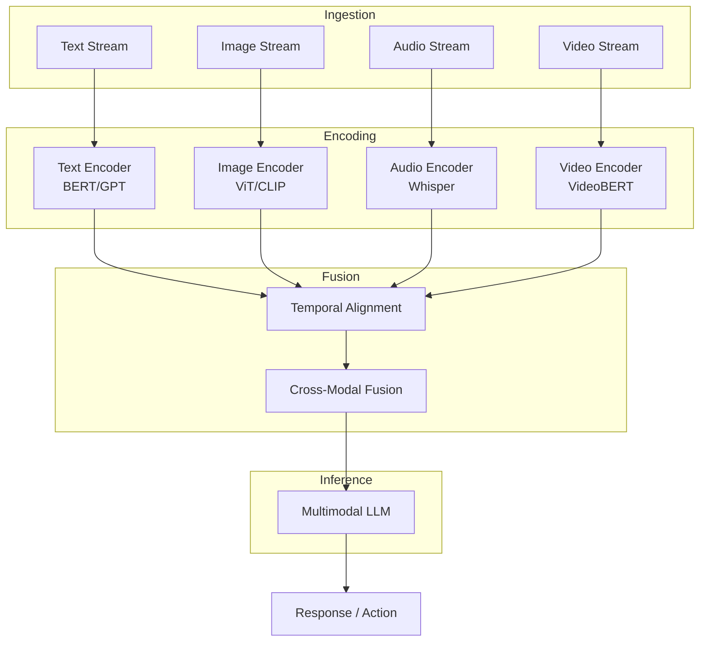

# Multimodal AI Real-Time Streaming Architecture

> **Language**: English | **Source**: [Knowledge/06-frontier/multimodal-ai-streaming-architecture.md](../Knowledge/06-frontier/multimodal-ai-streaming-architecture.md) | **Last Updated**: 2026-04-21

---

## 1. Definitions

### Def-K-06-EN-70: Multimodal AI

A 5-tuple $\mathcal{M} = \langle \mathcal{M}_T, \mathcal{M}_I, \mathcal{M}_A, \mathcal{M}_V, \mathcal{F} \rangle$:

- $\mathcal{M}_T$: Text modality space (token sequences)
- $\mathcal{M}_I$: Image modality space (pixel tensors $H \times W \times C$)
- $\mathcal{M}_A$: Audio modality space (waveform or spectrogram)
- $\mathcal{M}_V$: Video modality space (frame sequences $T \times H \times W \times C$)
- $\mathcal{F}: \bigcup_{i \in \{T,I,A,V\}} \mathcal{M}_i \rightarrow \mathcal{R}$: Unified representation mapping

### Def-K-06-EN-71: Real-Time Multimodal Stream

A time-constrained data sequence $S = \langle (d_1, t_1, m_1), (d_2, t_2, m_2), \ldots \rangle$:

- $d_i$: Data unit
- $t_i$: Timestamp (monotonically increasing)
- $m_i \in \{T, I, A, V\}$: Modality label
- **Hard real-time**: $\Delta t = t_{proc} - t_{arrival} \leq \tau_{max}$ (e.g., voice dialogue $\tau_{max} = 320$ms)

### Leading Multimodal Models (2026)

| Model | Provider | Modalities | Key Feature | Latency Target |
|-------|----------|-----------|-------------|----------------|
| **GPT-4o** | OpenAI | Text+Image+Audio | Native end-to-end multimodal | 320ms voice |
| **Gemini 3 Pro** | Google | All (incl. video) | Ultra-long context (1M+ tokens) | Streaming real-time |
| **Claude 4** | Anthropic | Vision+Doc+Text | Strong reasoning | Streaming optimized |
| **Llama 3.2 Vision** | Meta | Text+Image | Open-source deployable | Edge optimized |

## 2. Properties

### Lemma-K-06-EN-40: Multimodal Latency Lower Bound

For a real-time stream system with $n$ modalities:

$$L_{total} \geq \max_{i=1}^{n}(L_{capture}^{(i)} + L_{encode}^{(i)}) + L_{fusion} + L_{inference} + L_{output}$$

### Lemma-K-06-EN-41: Cross-Modal Alignment Cost

Aligning $n$ modalities with maximum drift $\delta_{max}$ requires buffer size:

$$B_{align} \geq \sum_{i=1}^{n} R_i \cdot \delta_{max}$$

where $R_i$ is the ingestion rate of modality $i$.

## 3. Architecture



## 4. Flink Integration

```java
// Multimodal stream union
DataStream<MultimodalEvent> unified = env
    .union(
        textStream.map(e -> new MultimodalEvent(TEXT, e)),
        imageStream.map(e -> new MultimodalEvent(IMAGE, e)),
        audioStream.map(e -> new MultimodalEvent(AUDIO, e))
    )
    .assignTimestampsAndWatermarks(
        WatermarkStrategy
            .<MultimodalEvent>forBoundedOutOfOrderness(Duration.ofSeconds(5))
            .withIdleness(Duration.ofMinutes(1))
    );

// Windowed multimodal fusion
unified
    .keyBy(e -> e.getSessionId())
    .window(EventTimeSessionWindows.withDynamicGap(
        (element) -> Time.seconds(30)))
    .aggregate(new MultimodalFusionAggregate());
```

## References
