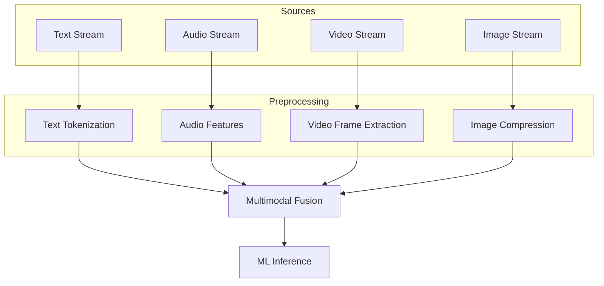

# Multimodal Stream Processing Architecture

> **Stage**: Knowledge/06-frontier | **Prerequisites**: [Real-Time ML Inference](realtime-ml-inference.md) | **Formalization Level**: L4
> **Translation Date**: 2026-04-21

## Abstract

Multimodal stream processing simultaneously handles text, image, audio, and video streams with real-time acquisition, preprocessing, feature extraction, fusion analysis, and inference.

---

## 1. Definitions

### Def-K-MM-01 (Multimodal Stream Processing)

**Multimodal stream processing** handles multiple data modalities (text, image, audio, video) in real-time. Core challenge: different sampling rates, data volumes, semantic spaces, and processing latencies.

### Def-K-MM-02 (Cross-Modal Embedding)

Maps data from different modalities into a unified low-dimensional vector space where semantically similar content is close (e.g., speech and its transcription).

### Def-K-MM-03 (Modality Alignment)

Synchronizes heterogeneous data streams by timestamp or event trigger, ensuring fused data points to the same semantic moment.

---

## 2. Properties

### Lemma-K-MM-01 (Modality Latency Bounds)

| Modality | Typical Latency |
|----------|----------------|
| Text | < 10ms |
| Audio | 20-40ms |
| Video (30fps) | 33ms |
| Video (60fps) | 16ms |
| High-res Image | 100-500ms |

System response is bounded by the slowest modality.

### Lemma-K-MM-02 (Fusion Timing Trade-off)

- **Early fusion** (before features): Higher accuracy, handles heterogeneity
- **Late fusion** (at decision layer): Lower latency, simpler implementation

### Prop-K-MM-01 (Sharding for Visual Data)

Real-time sharding by scene, object, or time window parallelizes visual processing across Flink tasks, avoiding single-point bottlenecks.

---

## 3. Architecture

---

## 4. References
