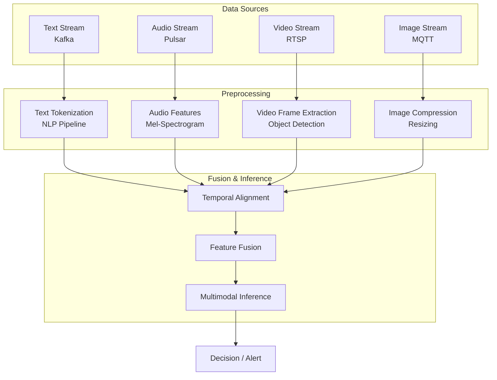

# Multimodal Stream Processing Architecture

> **Language**: English | **Source**: [Knowledge/06-frontier/multimodal-stream-processing.md](../Knowledge/06-frontier/multimodal-stream-processing.md) | **Last Updated**: 2026-04-21

---

## 1. Definitions

**Def-K-MM-EN-01: Multimodal Stream Processing**

A stream computing paradigm that simultaneously performs real-time acquisition, preprocessing, feature extraction, fusion analysis, and inference response on data streams of multiple modalities (text, image, audio, video). The core challenge is that different modalities have significantly different sampling rates, data volumes, semantic spaces, and processing latencies.

**Def-K-MM-EN-02: Cross-Modal Embedding**

Mapping data from different modalities into a unified low-dimensional vector space, such that semantically similar content (e.g., a segment of speech and its corresponding text transcription) are close in the vector space, enabling cross-modal retrieval and similarity computation.

**Def-K-MM-EN-03: Modality Alignment**

Synchronizing and aligning heterogeneous data streams from different sensors in the temporal dimension based on timestamps or event triggers, ensuring that during fusion analysis, all modalities refer to the same semantic moment.

## 2. Properties

**Lemma-K-MM-EN-01: Modality Latency Difference Bounds**

In typical multimodal systems: text stream latency < 10ms, audio frame latency 20-40ms, video frame latency 33ms (30fps) to 16ms (60fps), while high-resolution image batch processing latency can reach 100-500ms. Total system response time is bounded by the slowest modality processing path.

**Lemma-K-MM-EN-02: Cross-Modal Fusion Accuracy-Efficiency Tradeoff**

Early fusion (merging before feature layer) typically achieves higher downstream task accuracy but requires handling dimensional heterogeneity and temporal misalignment between modalities. Late fusion (merging at decision layer) is simpler and has lower latency but may lose complementary information between modalities.

**Prop-K-MM-EN-01: Stream Sharding is Key for High-Resolution Visual Data**

Sharding video/image streams by scene, object, or time window enables parallelization of large visual processing tasks across multiple Flink tasks, avoiding single-point bottlenecks.

## 3. Architecture

## 4. Modality Characteristics

| Modality | Rate | Volume | Latency Req | Typical Pipeline |
|----------|------|--------|-------------|-----------------|
| Text | < 1KB/event | Low | < 10ms | Tokenize → Embed → Classify |
| Audio | 16-48kHz | Medium | < 50ms | STT → Text pipeline |
| Video | 30-60fps | Very high | < 100ms | Decode → Sample → Detect |
| Image | Event-driven | High | < 200ms | Resize → Encode → Classify |

## References
