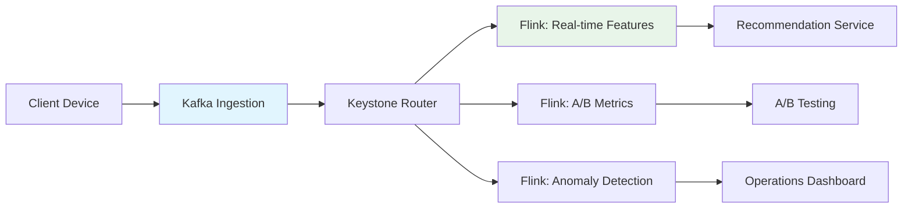

# Netflix Streaming Architecture: From Keystone to Flink

> **Stage**: Knowledge/03-business-patterns | **Prerequisites**: [Flink Core Mechanisms](flink-core-mechanisms.md), [Real-time Recommendation](real-time-recommendation.md) | **Formalization Level**: L3-L4
> **Translation Date**: 2026-04-21

## Abstract

Netflix processes 2+ trillion events daily across 200M+ subscribers. This document analyzes Netflix's streaming architecture evolution from Chukwa to Keystone to Flink, focusing on real-time recommendation features and global deployment challenges.

---

## 1. Definitions

### Def-K-03-08 (Netflix Data Pipeline)

The **Netflix data pipeline** is the distributed stream processing infrastructure supporting global operations:

$$\text{NetflixPipeline} \triangleq \langle \text{Sources}, \text{Processors}, \text{Sinks}, \text{SLAs} \rangle$$

where:
- **Sources**: Client devices → playback events, user interactions, error logs
- **Processors**: Keystone → routing/filtering/aggregation/feature engineering
- **Sinks**: Recommendation service, A/B testing platform, operations dashboards

### Def-K-03-09 (Keystone Platform)

**Keystone** is Netflix's self-serve stream processing platform:

$$\text{Keystone} = \langle \text{Ingestion}, \text{Routing}, \text{Processing}, \text{Delivery} \rangle$$

- **Ingestion**: Kafka front door, 2+ trillion events/day
- **Routing**: Dynamic routing based on event type and tenant
- **Processing**: Flink jobs for real-time computation
- **Delivery**: Multi-protocol sinks (Kafka, Elasticsearch, S3)

### Def-K-03-10 (Real-time Recommendation Features)

**Real-time recommendation features** are computed within seconds of user interaction:

$$\text{Feature}_{rt} = f(\text{Events}_{last\_N}, \text{UserProfile}, \text{ContentCatalog})$$

| Feature Category | Examples | Latency |
|-----------------|----------|---------|
| Playback | Watch time, completion rate | < 1s |
| Interaction | Search, browse, rating | < 5s |
| Context | Device, location, time | < 1s |

---

## 2. Properties

### Prop-K-03-03 (Event Processing Latency Bound)

Netflix's Keystone platform guarantees:

$$P(\text{Latency} < 1s) \geq 0.99 \text{ for real-time features}$$

### Prop-K-03-04 (Elastic Scaling Response Time)

Auto-scaling responds to load changes within:

$$T_{scale} \leq 2 \cdot T_{checkpoint} \approx 60s$$

---

## 3. Architecture Evolution

| Era | Technology | Scale | Key Characteristics |
|-----|-----------|-------|---------------------|
| 2009-2012 | Chukwa | 100M events/day | Hadoop-based, batch-oriented |
| 2012-2018 | Keystone v1 | 500B events/day | Kafka + Samza, real-time routing |
| 2018-2024 | Keystone v2 | 2T events/day | Kafka + Flink, self-serve platform |
| 2024+ | Keystone v3 | 5T+ events/day | Flink + AI-optimized, global mesh |

### Why Migrate from Samza to Flink?

| Aspect | Apache Samza | Apache Flink |
|--------|-------------|--------------|
| Event time | Limited | Native watermark support |
| State management | RocksDB | RocksDB + incremental checkpoint |
| Exactly-once | At-least-once + dedup | End-to-end exactly-once |
| Ecosystem | LinkedIn-centric | Broader community |

---

## 4. Engineering Argument

### 4.1 Global Deployment Challenges

Netflix operates in 190+ countries with:
- **Data sovereignty**: EU data stays in EU
- **Latency requirements**: < 100ms for playback start
- **Failover**: Cross-region replication within 30s

### 4.2 Keystone SLA

$$\text{Keystone SLA} = \langle 99.99\% \text{ availability}, < 1s \text{ p99 latency}, 0 \text{ data loss} \rangle$$

---

## 5. Examples

### 5.1 Real-time Viewing Experience Optimization

```
Playback Events → Keystone → Flink Window Aggregate → Recommendation API
                → Latency: < 500ms
                → Feature: "recent_watch_genre_distribution"
```

### 5.2 Content Popularity Prediction

```
View Events → Flink Session Window → Trend Detection → Content Investment Dashboard
            → Window: 1 hour session gap
            → Output: Predicted popularity score
```

---

## 6. Visualizations



---

## 7. References
[^1]: Netflix Tech Blog, "Keystone: Real-time Stream Processing Platform", 2018.
[^2]: Netflix Tech Blog, "Evolution of the Netflix Data Pipeline", 2020.
[^3]: Apache Flink Documentation, "Netflix Case Study", 2025.
