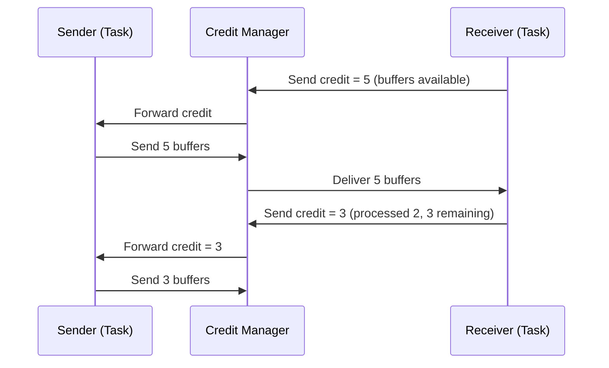

# Network Stack Evolution: From TCP to Credit-Based Flow Control

> **Language**: English | **Source**: [Flink/02-core/network-stack-evolution.md](../Flink/02-core/network-stack-evolution.md) | **Last Updated**: 2026-04-21

---

## 1. Definitions

### Def-F-02-EN-26: TCP-based Backpressure

Flink 1.4 and earlier relied entirely on TCP sliding windows for flow control:

$$
\text{TCP-Backpressure} = \langle SocketBuffer, AdvertisedWindow, KernelFlowControl \rangle
$$

$$
\text{Backpressure}(t) \iff \text{SocketBuf}_{occ}(t) \to \text{SocketBuf}_{cap} \land \text{AdvertisedWindow}(t) \to 0
$$

**Core issues**:

- Connection-level flow control, not task-level
- All channels on same TCP connection share the window
- One slow task blocks the entire connection

### Def-F-02-EN-27: Credit-Based Flow Control (CBFC)

Flink 1.5+ introduced task-level fine-grained flow control:

$$
\text{CBFC} = \langle Credit_{channel}, RemoteInputChannel, ResultSubPartition, BufferPool \rangle
$$

$$
\begin{aligned}
&\text{Credit}(ch) = k > 0 \implies \text{Sender can send at most } k \text{ buffers} \\
&\text{Credit}(ch) = 0 \implies \text{Sender pauses}
\end{aligned}
$$

**Core innovation**:

- Task-level credit mechanism
- Per-channel independent credit management
- One slow task does not affect others

### Def-F-02-EN-28: Network Buffer Pool

TaskManager-level managed network buffer pool providing physical resources for CBFC:

$$
\text{BufferPool} = \langle B_{total}, B_{available}, B_{reserved}, AllocationPolicy \rangle
$$

## 2. Evolution Comparison

| Dimension | TCP (≤ 1.4) | Credit-Based (1.5+) |
|-----------|-------------|---------------------|
| Granularity | Connection-level | Task-level (per channel) |
| Isolation | None | Independent credit per channel |
| Latency | Kernel-dependent | User-space, predictable |
| Backpressure propagation | Implicit (TCP window) | Explicit (credit messages) |
| Buffer utilization | Fixed per connection | Dynamic per channel |

## 3. Credit-Based Flow Control Protocol

## 4. Buffer Debloating (Flink 1.14+)

Buffer debloating dynamically adjusts buffer sizes based on actual throughput:

$$
\text{TargetBuffers}(ch) = \frac{\text{Throughput}(ch) \times \text{TargetLatency}}{\text{BufferSize}}
$$

| Scenario | Before Debloating | After Debloating |
|----------|------------------|------------------|
| Low throughput | Fixed 10 buffers | 2-3 buffers |
| High throughput | Fixed 10 buffers | 10+ buffers |
| Latency | Higher (full buffers) | Lower (minimal buffering) |

## 5. Key Metrics

| Metric | TCP Era | CBFC Era | Improvement |
|--------|---------|----------|-------------|
| Backpressure detection time | Seconds | Milliseconds | 1000× |
| Slow task isolation | No | Yes | — |
| Buffer memory overhead | High (fixed) | Low (dynamic) | 50-70% |
| Latency under backpressure | Unpredictable | Bounded | — |

## References
