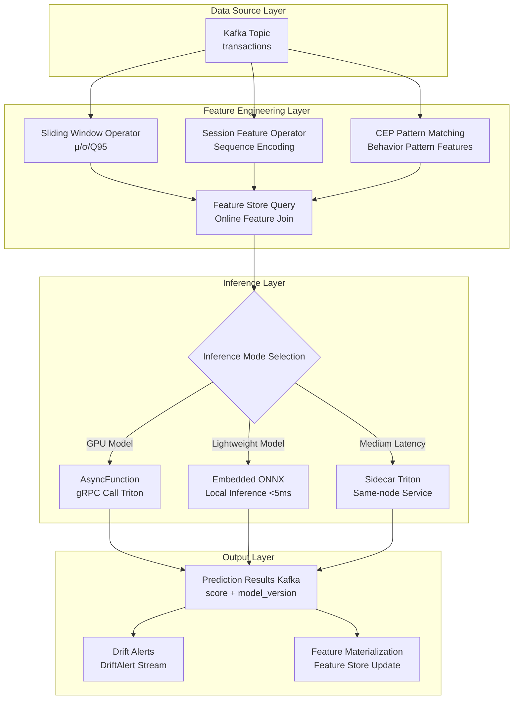
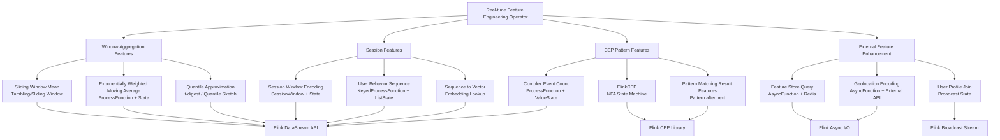

# Streaming Operator and AI/ML Integration

> Stage: Knowledge/06-frontier | Prerequisites: [Real-time Feature Store Architecture Practice](../Knowledge/06-frontier/realtime-feature-store-architecture.md), [Real-time AI Inference Architecture](../Knowledge/06-frontier/realtime-ai-inference-architecture.md), [Flink DataStream API](../Flink/03-api/flink-datastream-api.md) | Formalization Level: L4
>
> **Status**: Frontier Practice | **Risk Level**: Medium | **Last Updated**: 2026-04

---

## Table of Contents

- [Streaming Operator and AI/ML Integration](#streaming-operator-and-aiml-integration)
  - [Table of Contents](#table-of-contents)
  - [1. Definitions](#1-definitions)
    - [Def-AIML-01-01: Streaming ML Inference Pipeline (流式ML推理管道)](#def-aiml-01-01-streaming-ml-inference-pipeline-流式ml推理管道)
    - [Def-AIML-01-02: Real-time Feature Engineering Operator (实时特征工程算子)](#def-aiml-01-02-real-time-feature-engineering-operator-实时特征工程算子)
    - [Def-AIML-01-03: Concept Drift (概念漂移)](#def-aiml-01-03-concept-drift-概念漂移)
    - [Def-AIML-01-04: Incremental Learning Operator (增量学习算子)](#def-aiml-01-04-incremental-learning-operator-增量学习算子)
    - [Def-AIML-01-05: Feature Store Integration Interface (特征平台集成接口)](#def-aiml-01-05-feature-store-integration-interface-特征平台集成接口)
    - [Def-AIML-01-06: Prequential Evaluation (Prequential评估)](#def-aiml-01-06-prequential-evaluation-prequential评估)
  - [2. Properties](#2-properties)
    - [Lemma-AIML-01-01: Monotonic Update Property of Sliding Window Features](#lemma-aiml-01-01-monotonic-update-property-of-sliding-window-features)
    - [Lemma-AIML-01-02: Throughput Upper Bound of Async Inference Operator](#lemma-aiml-01-02-throughput-upper-bound-of-async-inference-operator)
    - [Lemma-AIML-01-03: Numerical Stability of Welford Online Variance Algorithm](#lemma-aiml-01-03-numerical-stability-of-welford-online-variance-algorithm)
    - [Prop-AIML-01-01: Convergence Conditions for Incremental SGD](#prop-aiml-01-01-convergence-conditions-for-incremental-sgd)
    - [Prop-AIML-01-02: False Positive Rate Upper Bound of ADWIN Drift Detection](#prop-aiml-01-02-false-positive-rate-upper-bound-of-adwin-drift-detection)
  - [3. Relations](#3-relations)
    - [3.1 Mapping Between Stream Processing Operators and ML Pipeline](#31-mapping-between-stream-processing-operators-and-ml-pipeline)
    - [3.2 Feature Store and Stream Processing Engine Integration Patterns](#32-feature-store-and-stream-processing-engine-integration-patterns)
    - [3.3 Concept Drift Detection and Model Update Trigger Mechanism](#33-concept-drift-detection-and-model-update-trigger-mechanism)
  - [4. Argumentation](#4-argumentation)
    - [4.1 Temporal Semantics Issues of Feature Engineering in Stream Processing](#41-temporal-semantics-issues-of-feature-engineering-in-stream-processing)
    - [4.2 Trade-off Analysis Between Inference Latency and Throughput](#42-trade-off-analysis-between-inference-latency-and-throughput)
    - [4.3 Root Cause Analysis of Training-Serving Skew](#43-root-cause-analysis-of-training-serving-skew)
  - [5. Proof / Engineering Argument](#5-proof--engineering-argument)
    - [Thm-AIML-01-01: Unbiasedness of Prequential Error Estimation (With Decay Factor)](#thm-aiml-01-01-unbiasedness-of-prequential-error-estimation-with-decay-factor)
    - [Thm-AIML-01-02: Backpressure Adaptability of Async Inference Operator](#thm-aiml-01-02-backpressure-adaptability-of-async-inference-operator)
    - [Thm-AIML-01-03: Space-Accuracy Trade-off for Sliding Window Quantile Approximation](#thm-aiml-01-03-space-accuracy-trade-off-for-sliding-window-quantile-approximation)
  - [6. Examples](#6-examples)
    - [6.1 Flink + TensorFlow Serving Real-time Inference Pipeline](#61-flink--tensorflow-serving-real-time-inference-pipeline)
    - [6.2 Local ONNX Model Embedded Inference (Low-latency Scenario)](#62-local-onnx-model-embedded-inference-low-latency-scenario)
    - [6.3 Incremental Learning Operator (Online Parameter Update)](#63-incremental-learning-operator-online-parameter-update)
  - [7. Visualizations](#7-visualizations)
    - [7.1 Streaming ML Inference Pipeline DAG](#71-streaming-ml-inference-pipeline-dag)
    - [7.2 Feature Engineering Operator Mapping Diagram](#72-feature-engineering-operator-mapping-diagram)
    - [7.3 Streaming Inference and Model Serving Architecture Diagram](#73-streaming-inference-and-model-serving-architecture-diagram)
  - [8. References](#8-references)

## 1. Definitions

### Def-AIML-01-01: Streaming ML Inference Pipeline (流式ML推理管道)

**Definition**: A Streaming ML Inference Pipeline is an octuple $\mathcal{P}_{ML} = (\mathcal{S}, \mathcal{F}, \mathcal{I}, \mathcal{M}, \mathcal{V}, \mathcal{O}, \mathcal{D}, \mathcal{E})$, where:

| Component | Symbol | Description |
|-----------|--------|-------------|
| Data Stream | $\mathcal{S}$ | Input event stream, $\mathcal{S} = \{e_t \mid e_t = (x_t, t_s, k), t \in \mathbb{T}\}$, where $x_t$ is the feature vector, $t_s$ is the event timestamp, and $k$ is the partition key |
| Feature Engineering (特征工程) | $\mathcal{F}$ | Real-time feature transformation operator set, $\mathcal{F}: \mathcal{S} \rightarrow \mathcal{S}'$ |
| Inference Interface (推理接口) | $\mathcal{I}$ | Model inference invocation layer, supporting sync/async modes, $\mathcal{I}: \mathcal{S}' \rightarrow \hat{y}$ |
| Model Management (模型管理) | $\mathcal{M}$ | Model registry and version management, $\mathcal{M} = \{(m_i, v_i, w_i) \mid i \in \mathbb{N}\}$, where $w_i$ is the routing weight |
| Version Control (版本控制) | $\mathcal{V}$ | A/B testing and canary release strategy, $\mathcal{V}: k \rightarrow m_i$ |
| Output Stream (输出流) | $\mathcal{O}$ | Prediction result stream, $\mathcal{O} = \{(k, \hat{y}, m_v, t_p) \mid t_p \text{ is the prediction timestamp}\}$ |
| Drift Detection (漂移检测) | $\mathcal{D}$ | Concept drift detection operator, $\mathcal{D}: (\mathcal{S}, \hat{y}, y) \rightarrow \{0, 1\}$ |
| Online Evaluation (在线评估) | $\mathcal{E}$ | Prequential evaluation engine, $\mathcal{E}: (\hat{y}, y) \rightarrow \mathbb{R}^n$ |

**End-to-end Latency Constraint**: Feature engineering $L_{feat} < 50\text{ms}$ + Inference $L_{infer} < 100\text{ms}$ + Post-processing $L_{post} < 10\text{ms}$, totaling $L_{total} < 200\text{ms}$ (p99).

---

### Def-AIML-01-02: Real-time Feature Engineering Operator (实时特征工程算子)

**Definition**: A Real-time Feature Engineering Operator $\Phi_{feat}$ is a stateful transformation executed on a stream processing engine that converts raw events into model-usable feature vectors:

$$
\Phi_{feat}: (e_t, \mathcal{H}_k(t)) \rightarrow f_t \in \mathbb{R}^d
$$

Where $\mathcal{H}_k(t)$ is the historical state for key $k$ at time $t$.

**Operator Classification**:

| Category | Operator Name | Mathematical Expression | State Type |
|----------|--------------|------------------------|------------|
| Sliding Window (滑动窗口) | Window Mean | $\mu_{W}(t) = \frac{1}{|W|}\sum_{e \in W(t)} x_e$ | Window State |
| Sliding Window (滑动窗口) | Window Variance | $\sigma^2_{W}(t) = \frac{1}{|W|}\sum_{e \in W(t)} (x_e - \mu_W)^2$ | Window State |
| Sliding Window (滑动窗口) | Window Quantile | $Q_p(W) = \inf\{x \mid P(X \leq x) \geq p\}$ | Ordered Window State |
| Session Feature (Session特征) | Sequence Encoding | $\text{SeqEnc}(s_k) = \text{Encoder}(e_{k,1}, e_{k,2}, ..., e_{k,n})$ | Keyed State |
| CEP Feature (CEP特征) | Pattern Matching | $\text{CEP}(\mathcal{S}) = \{m \mid m \models \mathcal{P}\}$ | NFA State Machine |
| Cross Feature (交叉特征) | Feature Join | $f_{cross} = f_a \bowtie_{k,t} f_b$ | Dual-Keyed State |

---

### Def-AIML-01-03: Concept Drift (概念漂移)

**Definition**: Let the joint distribution on the data stream be $P_t(X, Y)$. Concept drift occurs at time $t_d$ if and only if:

$$
\exists \epsilon > 0, \forall \delta > 0: |P_{t_d - \delta}(Y|X) - P_{t_d + \delta}(Y|X)| > \epsilon
$$

**Drift Type Classification**:

| Type | Definition | Detection Difficulty | Typical Scenario |
|------|-----------|---------------------|-----------------|
| Sudden Drift (突变漂移) | $P_t$ undergoes a step change at a single point | Low | System failure, policy change |
| Gradual Drift (渐进漂移) | $P_t$ changes continuously and slowly over time | Medium | User interest evolution, device aging |
| Incremental Drift (增量漂移) | New concept gradually replaces old concept | High | Seasonal changes, market trends |
| Recurrent Drift (周期性漂移) | $P_{t+T} \approx P_t$ | High | Intraday/weekly periodic patterns |
| Blip Drift (异常漂移) | Brief deviation then recovery | Medium | Promotional events, emergencies |

---

### Def-AIML-01-04: Incremental Learning Operator (增量学习算子)

**Definition**: An Incremental Learning Operator $\Psi_{incr}$ is a quadruple $(\theta_t, \mathcal{L}, \eta, \mathcal{U})$:

- **Model Parameters (模型参数)** $\theta_t$: Model state at time $t$
- **Loss Function (损失函数)** $\mathcal{L}$: Single-sample loss $\ell(\theta; (x, y))$
- **Learning Rate (学习率)** $\eta$: Parameter update step size
- **Update Rule (更新规则)** $\mathcal{U}$: Online parameter update function

$$
\theta_{t+1} = \mathcal{U}(\theta_t, \nabla_\theta \ell(\theta_t; (x_t, y_t)), \eta_t)
$$

**Constraints**:

1. **Constant Memory (恒定内存)**: $|\theta_t| = O(1)$, independent of the number of processed samples
2. **Single Pass (单次遍历)**: Each sample participates in parameter update only once
3. **Real-time (实时性)**: Update latency $< 5\text{ms}$ (per sample)

---

### Def-AIML-01-05: Feature Store Integration Interface (特征平台集成接口)

**Definition**: A Feature Store Integration Interface $\mathcal{I}_{FS}$ is a bidirectional communication protocol between the stream processing engine and the feature storage system:

$$
\mathcal{I}_{FS} = (\mathcal{Q}_{online}, \mathcal{P}_{stream}, \mathcal{S}_{sync}, \mathcal{G}_{registry})
$$

- **Online Query (在线查询)** $\mathcal{Q}_{online}$: Low-latency feature query, $\mathcal{Q}_{online}: (entity\_id, feature\_names) \rightarrow f_{online}$, targeting P99 $< 10\text{ms}$
- **Stream Push (流式推送)** $\mathcal{P}_{stream}$: Real-time feature value materialization to online storage
- **Sync Mechanism (同步机制)** $\mathcal{S}_{sync}$: Online-offline storage consistency guarantee
- **Feature Registry (特征注册)** $\mathcal{G}_{registry}$: Feature metadata management and lineage tracking

**Integration Modes**:

| Mode | Data Flow | Latency | Applicable Scenario |
|------|-----------|---------|---------------------|
| Push Mode (推模式) | Flink $\rightarrow$ Redis/DynamoDB | $< 100\text{ms}$ | Real-time recommendation, fraud detection |
| Pull Mode (拉模式) | Flink $\xleftarrow{}$ Feature Server | $< 10\text{ms}$ | Feature Join, context enhancement |
| Hybrid Mode (混合模式) | Push + Pull combined | Variable | Complex feature pipeline |

---

### Def-AIML-01-06: Prequential Evaluation (Prequential评估)

**Definition**: Prequential Evaluation (also known as interleaved test-then-train) is the standard evaluation paradigm for streaming ML. Each arriving sample $(x_t, y_t)$ is first used to evaluate the current model, then used to update the model:

$$
\text{Preq}_T = \frac{1}{T}\sum_{t=1}^{T} \ell\left(\hat{y}_t = h_{t-1}(x_t), y_t\right)
$$

Where $h_{t-1}$ is the model before processing sample $t$. Prequential error can incorporate a **decay factor (衰减因子)** $\alpha$ to weight recent samples:

$$
\text{Preq}_T^{(\alpha)} = \frac{\sum_{t=1}^{T} \alpha^{T-t} \cdot \ell(h_{t-1}(x_t), y_t)}{\sum_{t=1}^{T} \alpha^{T-t}}
$$

---

## 2. Properties

### Lemma-AIML-01-01: Monotonic Update Property of Sliding Window Features

**Proposition**: Let sliding window $W$ have size $N$. For the window mean operator $\mu_W(t)$, when a new event $e_{t+1}$ arrives and the window slides, there exists an incremental update formula:

$$
\mu_W(t+1) = \mu_W(t) + \frac{x_{t+1} - x_{t-N}}{N}
$$

**Proof**: Directly from the definition of mean:

$$
\begin{aligned}
\mu_W(t+1) &= \frac{1}{N}\sum_{i=t+2-N}^{t+1} x_i \\
&= \frac{1}{N}\left(\sum_{i=t+1-N}^{t} x_i + x_{t+1} - x_{t-N}\right) \\
&= \mu_W(t) + \frac{x_{t+1} - x_{t-N}}{N}
\end{aligned}
$$

**Corollary**: The single-update computational complexity of sliding window mean is $O(1)$, without traversing the entire window. $\square$

---

### Lemma-AIML-01-02: Throughput Upper Bound of Async Inference Operator

**Proposition**: Let the parallelism of the stream processing operator be $P$, each operator instance maintain $C$ concurrent asynchronous requests, and the average response time of the external inference service be $R$. Then the maximum throughput of the async inference operator is:

$$
\text{Throughput}_{max} = \frac{P \cdot C}{R}
$$

**Proof**: Each operator instance has at most $C$ in-flight requests at any time, and the system has a total of $P \cdot C$ in-flight requests. By Little's Law, in steady state the throughput $\lambda$ satisfies $\lambda \cdot R \leq P \cdot C$, i.e., $\lambda \leq \frac{P \cdot C}{R}$. $\square$

---

### Lemma-AIML-01-03: Numerical Stability of Welford Online Variance Algorithm

**Proposition**: The Welford online algorithm can compute the mean and variance of a sliding window in a single pass, with numerical stability superior to the naive two-pass algorithm.

**Recurrence Formula**: Let $M_{2,t} = \sum_{i=1}^{t}(x_i - \mu_t)^2$, then:

$$
\begin{aligned}
\delta &= x_t - \mu_{t-1} \\
\mu_t &= \mu_{t-1} + \frac{\delta}{t} \\
M_{2,t} &= M_{2,t-1} + \delta \cdot (x_t - \mu_t) \\
\sigma^2_t &= \frac{M_{2,t}}{t-1}
\end{aligned}
$$

**Numerical Error Bound**: The rounding error of the Welford algorithm satisfies $O(\epsilon_{mach} \cdot \sigma^2)$, while the naive algorithm's error can reach $O(\epsilon_{mach} \cdot \mu^2)$. $\square$

---

### Prop-AIML-01-01: Convergence Conditions for Incremental SGD

**Proposition**: Let the loss function $\ell(\theta; (x,y))$ be $\lambda$-strongly convex and $L$-smooth, with learning rate satisfying $\eta_t = \frac{1}{\lambda t}$. Then the expected parameter error of incremental SGD satisfies:

$$
\mathbb{E}[\|\theta_t - \theta^*\|^2] \leq \frac{2G^2}{\lambda^2 t}
$$

Where $G$ is the gradient upper bound and $\theta^*$ is the optimal parameter.

**Proof Sketch**: From strong convexity we have $\ell(\theta^*) \geq \ell(\theta) + \nabla\ell(\theta)^T(\theta^* - \theta) + \frac{\lambda}{2}\|\theta^* - \theta\|^2$. Taking $\theta = \theta_t$ and rearranging:

$$
\|\theta_{t+1} - \theta^*\|^2 \leq (1 - \eta_t\lambda)\|\theta_t - \theta^*\|^2 + \eta_t^2 G^2
$$

Recursing and substituting $\eta_t = \frac{1}{\lambda t}$, the conclusion follows by induction. $\square$

---

### Prop-AIML-01-02: False Positive Rate Upper Bound of ADWIN Drift Detection

**Proposition**: The ADWIN (Adaptive Windowing) algorithm detects drift with confidence $\delta$, and its false positive rate upper bound is $O(\delta)$.

**Core Idea**: ADWIN maintains a variable-size window $W$ and checks all possible split points $i$. When there exists a split such that the mean difference between the two segments $\hat{\mu}_{W_0} - \hat{\mu}_{W_1}$ exceeds the Hoeffding bound, drift is triggered:

$$
|\hat{\mu}_{W_0} - \hat{\mu}_{W_1}| > \epsilon_{cut} = \sqrt{\frac{1}{2m}\ln\frac{4}{\delta}} + \sqrt{\frac{1}{2n}\ln\frac{4}{\delta}}
$$

Where $m = |W_0|, n = |W_1|$. By Hoeffding's inequality, under a stationary distribution the false alarm probability $< \delta$. $\square$

---

## 3. Relations

### 3.1 Mapping Between Stream Processing Operators and ML Pipeline

The operator semantics of stream processing engines (e.g., Flink) have a systematic mapping relationship with traditional batch ML Pipelines:

| ML Pipeline Stage | Batch Implementation | Stream Processing Operator | State Requirement |
|-------------------|---------------------|---------------------------|-------------------|
| Data Ingestion (数据摄取) | `read_csv()` | `KafkaSource` | Stateless |
| Feature Scaling (特征缩放) | `StandardScaler.fit_transform()` | `ProcessFunction` + State | Keyed State (mean/variance) |
| Feature Encoding (特征编码) | `OneHotEncoder.transform()` | `MapFunction` | Stateless |
| Window Aggregation (窗口聚合) | `groupby().rolling().mean()` | `WindowAggregate` | Window State |
| Model Inference (模型推理) | `model.predict()` | `AsyncFunction` / `MapFunction` | Stateless/Model State |
| Result Post-processing (结果后处理) | `post_process()` | `ProcessFunction` | Keyed State |

**Key Difference**: Stream processing operators must explicitly manage **temporal semantics** (Event Time vs Processing Time) and **state fault tolerance** (Checkpoint/Restore), while batch pipelines inherently possess global consistency.

---

### 3.2 Feature Store and Stream Processing Engine Integration Patterns

The integration between feature platforms and stream processing engines follows three typical architectural patterns:

**Pattern 1: Lambda Architecture (Dual-track Computation)**

$$
\begin{aligned}
\text{Batch Path}: &\quad \text{Raw Data} \xrightarrow{\text{Spark}} \text{Offline Store} \xrightarrow{\text{materialize}} \text{Online Store} \\
\text{Stream Path}: &\quad \text{Raw Data} \xrightarrow{\text{Flink}} \text{Online Store (real-time)}
\end{aligned}
$$

- **Advantages**: Offline path guarantees accuracy, real-time path guarantees low latency
- **Disadvantages**: High dual-track maintenance cost, training-serving skew risk

**Pattern 2: Kappa Architecture (Single Stream Processing)**

$$
\text{Raw Data} \xrightarrow{\text{Flink}} \text{Online Store} \xrightarrow{\text{snapshot}} \text{Offline Store}
$$

- **Advantages**: Single computation engine, semantic consistency
- **Disadvantages**: High computation cost for long-period features (e.g., 365-day aggregation)

**Pattern 3: Feast/Tecton Unified Interface**

```
Feature Definition (Python SDK)
    ↓
Feature Registry (Metadata)
    ↓
┌─────────────┬─────────────┐
│ Stream Transform │ Batch Transform │
│   (Flink)        │   (Spark)       │
└─────────────┴─────────────┘
    ↓                    ↓
Online Store (Redis)   Offline Store (S3/Snowflake)
    ↓                    ↓
Real-time Inference    Model Training
```

---

### 3.3 Concept Drift Detection and Model Update Trigger Mechanism

Drift detection and model updates constitute a closed-loop adaptive system:

$$
\text{Data Stream} \rightarrow \underbrace{\text{Drift Detector}}_{\mathcal{D}} \rightarrow \{\text{No Drift}, \text{Warning}, \text{Drift}\} \rightarrow \underbrace{\text{Model Adapter}}_{\mathcal{A}} \rightarrow \text{Updated Model}
$$

**DDM State Machine**:

- **Normal State** ($p_t + s_t < p_{min} + 2s_{min}$): Continuous monitoring
- **Warning State** ($p_{min} + 2s_{min} \leq p_t + s_t < p_{min} + 3s_{min}$): Cache samples, prepare backup model
- **Drift State** ($p_t + s_t \geq p_{min} + 3s_{min}$): Trigger model replacement or retraining

---

## 4. Argumentation

### 4.1 Temporal Semantics Issues of Feature Engineering in Stream Processing

Real-time feature engineering faces a core contradiction: the trade-off between **feature freshness (特征新鲜度)** and **computational consistency (计算一致性)**.

**Contradiction Analysis**:

| Dimension | Pursuing Freshness | Pursuing Consistency |
|-----------|-------------------|---------------------|
| Window Type | Processing Time Window | Event Time Window |
| Watermark Latency | Low ($< 1\text{s}$) | High (tolerates late data) |
| Feature Accuracy | May contain out-of-order errors | Accurate but lagged |
| Applicable Scenario | Real-time recommendation, fraud detection | Financial risk control, compliance audit |

**Formal Analysis**: Let $W_{event}$ be the event time window and $W_{proc}$ be the processing time window. For an event $e$ with actual occurrence time $t_e$ and processing time $t_p$:

$$
\text{Feature}_{event}(e) = \phi(\{e' \mid t_{e'} \in W_{event}, t_{e'} \leq t_e\})
$$

$$
\text{Feature}_{proc}(e) = \phi(\{e' \mid t_{p'} \in W_{proc}, t_{p'} \leq t_p\})
$$

When out-of-order data exists, $\text{Feature}_{event}$ can be updated via late data, while $\text{Feature}_{proc}$ produces fixed but inaccurate results.

**Engineering Recommendation**: Use processing time windows for latency-sensitive features (e.g., click count in the last 5 minutes); use event time windows + Allowed Lateness for accuracy-sensitive features (e.g., risk score).

---

### 4.2 Trade-off Analysis Between Inference Latency and Throughput

Stream ML inference has three deployment modes, whose latency-throughput trade-offs follow different Pareto frontiers:

| Deployment Mode | Typical Latency | Typical Throughput | Resource Usage | Model Update Flexibility |
|-----------------|-----------------|-------------------|----------------|-------------------------|
| Embedded Model (嵌入式模型) | $< 5\text{ms}$ | High | Low | Poor (requires Job restart) |
| External Service Call (外部服务调用) | $20-100\text{ms}$ | Medium | Medium | Excellent (independent deployment) |
| Local Model Serving (本地模型服务) | $5-20\text{ms}$ | Very High | High (GPU) | Good (hot update) |

**Decision Framework**:

```
Does it require GPU acceleration?
├── No → Model size < 10MB?
│       ├── Yes → Embedded Model (Flink UDF)
│       └── No → Local JVM Model (PMML/ONNX Java Runtime)
└── Yes → Latency requirement < 20ms?
        ├── Yes → Same-node Triton (Sidecar mode)
        └── No → External Model Service (Triton/TF Serving cluster)
```

---

### 4.3 Root Cause Analysis of Training-Serving Skew

Training-Serving Skew is a core quality risk in streaming ML systems. Its root causes can be formalized as:

$$
\Delta_{TS} = \underbrace{\Delta_{compute}}_{\text{Compute engine difference}} + \underbrace{\Delta_{time}}_{\text{Temporal semantics difference}} + \underbrace{\Delta_{data}}_{\text{Data source difference}}
$$

**$\Delta_{compute}$**: Training uses Spark SQL's `mean()`, while serving uses Flink's `AggregateFunction`, with different numerical precision
**$\Delta_{time}$**: Training backtracks to event time $t$, while serving computes at time $t + \delta$, during which data has changed
**$\Delta_{data}$**: Training reads from offline data warehouse, while serving reads from Kafka in real-time, with Schema evolution differences

**Mitigation Strategies**:

1. **Unified Feature Definition (统一特征定义)**: Use unified DSL (e.g., Tecton/Feast) to define feature transformations
2. **Point-in-Time Join**: Strictly use data snapshots before the prediction moment during training
3. **Feature Snapshot Validation**: Periodically compare distribution differences between online and offline feature values (KS test)

---

## 5. Proof / Engineering Argument

### Thm-AIML-01-01: Unbiasedness of Prequential Error Estimation (With Decay Factor)

**Theorem**: Let the data stream be i.i.d. and concept-stationary. The Prequential estimator $\widehat{\text{Err}}_T$ is an unbiased estimate of the true generalization error:

$$
\mathbb{E}\left[\widehat{\text{Err}}_T\right] = \mathbb{E}_{(x,y) \sim P}\left[\ell(h^*(x), y)\right] + O\left(\frac{1}{T}\right)
$$

Where $h^*$ is the hypothesis after algorithm convergence.

**Proof**:

For an i.i.d. stationary stream, each sample $(x_t, y_t)$ is independent of the historical samples used to train it when used for evaluation (because model $h_{t-1}$ only depends on the first $t-1$ samples, and $(x_t, y_t)$ is independent of them). Therefore:

$$
\mathbb{E}[\ell(h_{t-1}(x_t), y_t)] = \mathbb{E}_{h_{t-1}}\left[\mathbb{E}_{(x,y)}[\ell(h_{t-1}(x), y) \mid h_{t-1}]\right] = \mathbb{E}[R(h_{t-1})]
$$

Where $R(h)$ is the true risk of hypothesis $h$. When $t \rightarrow \infty$, $h_t \rightarrow h^*$ (by convergence from Prop-AIML-01-01), hence:

$$
\frac{1}{T}\sum_{t=1}^{T}\mathbb{E}[\ell(h_{t-1}(x_t), y_t)] = \frac{1}{T}\sum_{t=1}^{T}\mathbb{E}[R(h_{t-1})] \rightarrow R(h^*)
$$

For Prequential error with decay factor, when $\alpha < 1$:

$$
\widehat{\text{Err}}_T^{(\alpha)} = \frac{\sum_{t=1}^{T}\alpha^{T-t}\ell(h_{t-1}(x_t), y_t)}{\sum_{t=1}^{T}\alpha^{T-t}} = (1-\alpha)\sum_{t=1}^{T}\alpha^{T-t}\ell(h_{t-1}(x_t), y_t) + O(\alpha^T)
$$

This is a recent-sample-weighted estimator, which has lower variance than the equal-weight estimator under concept drift scenarios. $\square$

---

### Thm-AIML-01-02: Backpressure Adaptability of Async Inference Operator

**Theorem**: Let the response time of the external inference service follow a distribution with mean $\mu_R$ and variance $\sigma_R^2$. The async inference operator is configured with concurrency $C$. Then when the service degrades ($\mu_R$ increases), the system's effective throughput degradation rate is buffered by $C$:

$$
\lambda_{eff} = \min\left(\lambda_{in}, \frac{P \cdot C}{\mu_R + k\sigma_R}\right)
$$

Where $k$ is the quantile corresponding to the service level (e.g., p99 corresponds to $k \approx 2.33$).

**Engineering Argument**: The async inference operator decouples inference latency from processing latency through non-blocking I/O. When $C$ is large enough, even if $\mu_R$ temporarily increases, the operator can still maintain input throughput $\lambda_{in}$ until in-flight requests fill the concurrency slots. This property makes the stream processing pipeline robust to transient jitter of external inference services. $\square$

---

### Thm-AIML-01-03: Space-Accuracy Trade-off for Sliding Window Quantile Approximation

**Theorem**: Using t-digest or GK algorithm for sliding window quantile approximation, the space complexity is $O(\frac{1}{\epsilon}\log(\epsilon N))$, with approximation error no more than $\epsilon$.

**Proof Sketch** (t-digest): t-digest compresses the data distribution into a series of centroids, each recording the mean and weight. The number of centroids varies with position — centroids are dense in the distribution tails (guaranteeing extreme quantile precision) and sparse in the center. For sliding window implementation, an **exponentially decaying t-digest** can be used, assigning decay weights to historical data, thereby supporting $O(\log(1/\epsilon))$ single-sample updates. $\square$

---

## 6. Examples

### 6.1 Flink + TensorFlow Serving Real-time Inference Pipeline

The following example demonstrates a complete real-time fraud detection pipeline: Flink reads transaction events from Kafka, performs feature engineering, calls TensorFlow Serving via AsyncFunction for inference, and outputs prediction results.

```java
// ============== 1. Sliding Window Feature Engineering Operator ==============

public class TransactionFeatureExtractor
    extends KeyedProcessFunction<String, Transaction, EnrichedTransaction> {

    // State: list of amounts for the last N transactions (circular buffer)
    private ListState<Double> amountHistory;
    // State: Welford algorithm intermediate variables
    private ValueState<WelfordStats> welfordState;

    @Override
    public void open(Configuration parameters) {
        amountHistory = getRuntimeContext().getListState(
            new ListStateDescriptor<>("amounts", Types.DOUBLE));
        welfordState = getRuntimeContext().getState(
            new ValueStateDescriptor<>("welford", WelfordStats.class));
    }

    @Override
    public void processElement(Transaction tx, Context ctx,
                               Collector<EnrichedTransaction> out) throws Exception {

        // Update Welford online statistics
        WelfordStats stats = welfordState.value();
        if (stats == null) stats = new WelfordStats();
        stats.update(tx.amount);
        welfordState.update(stats);

        // Maintain the last 20 transaction window
        List<Double> history = new ArrayList<>();
        amountHistory.get().forEach(history::add);
        history.add(tx.amount);
        if (history.size() > 20) history.remove(0);
        amountHistory.update(history);

        // Construct feature vector
        double[] features = new double[8];
        features[0] = tx.amount;                                    // Raw amount
        features[1] = stats.mean;                                   // Historical mean
        features[2] = Math.sqrt(stats.variance);                    // Historical standard deviation
        features[3] = tx.amount / (stats.mean + 1e-6);              // Amount deviation
        features[4] = history.size() >= 20 ?
            percentile(history, 0.95) : 0.0;                        // 95th percentile
        features[5] = ctx.timerService().currentProcessingTime() -
            tx.timestamp;                                          // Processing delay
        features[6] = stats.count;                                  // Transaction count
        features[7] = tx.merchantCategory;                          // Merchant category encoding

        out.collect(new EnrichedTransaction(tx.userId, features, tx.timestamp));
    }
}

// Welford online statistics
public static class WelfordStats {
    public long count = 0;
    public double mean = 0.0;
    public double m2 = 0.0;  // Sum of squared differences

    public void update(double x) {
        count++;
        double delta = x - mean;
        mean += delta / count;
        double delta2 = x - mean;
        m2 += delta * delta2;
    }

    public double getVariance() {
        return count > 1 ? m2 / (count - 1) : 0.0;
    }
}
```

```java
// ============== 2. AsyncFunction Calling TensorFlow Serving ==============

public class TFServingAsyncFunction
    extends RichAsyncFunction<EnrichedTransaction, PredictionResult> {

    private transient TensorflowServingGrpc.TensorflowServingBlockingStub stub;
    private transient ManagedChannel channel;

    @Override
    public void open(Configuration parameters) {
        channel = ManagedChannelBuilder
            .forAddress("tf-serving.default.svc.cluster.local", 8500)
            .usePlaintext()
            .maxRetryAttempts(3)
            .build();
        stub = TensorflowServingGrpc.newBlockingStub(channel)
            .withDeadlineAfter(100, TimeUnit.MILLISECONDS);
    }

    @Override
    public void asyncInvoke(EnrichedTransaction enriched,
                           ResultFuture<PredictionResult> resultFuture) {

        CompletableFuture.supplyAsync(() -> {
            // Construct gRPC request
            Model.ModelSpec modelSpec = Model.ModelSpec.newBuilder()
                .setName("fraud_detection")
                .setSignatureName("serving_default")
                .build();

            TensorProto inputTensor = TensorProto.newBuilder()
                .setDtype(DataType.DT_FLOAT)
                .setTensorShape(TensorShapeProto.newBuilder()
                    .addDim(TensorShapeProto.Dim.newBuilder().setSize(1))
                    .addDim(TensorShapeProto.Dim.newBuilder().setSize(8)))
                .addAllFloatVal(floatArrayToList(enriched.features))
                .build();

            Predict.PredictRequest request = Predict.PredictRequest.newBuilder()
                .setModelSpec(modelSpec)
                .putInputs("input_1", inputTensor)
                .build();

            Predict.PredictResponse response = stub.predict(request);
            float fraudScore = response.getOutputsOrThrow("output_1")
                .getFloatVal(0);

            return new PredictionResult(
                enriched.userId,
                fraudScore,
                enriched.timestamp,
                "fraud_detection:v3"  // Model version metadata
            );
        }).whenComplete((result, exception) -> {
            if (exception != null) {
                // Degradation strategy: return default low-risk score
                resultFuture.complete(Collections.singletonList(
                    new PredictionResult(enriched.userId, 0.1,
                        enriched.timestamp, "fallback")
                ));
            } else {
                resultFuture.complete(Collections.singletonList(result));
            }
        });
    }

    @Override
    public void close() {
        if (channel != null) channel.shutdown();
    }
}
```

```java
// ============== 3. Concept Drift Detection Operator ==============

public class DriftDetectionOperator
    extends KeyedProcessFunction<String, PredictionResult, DriftAlert> {

    // DDM state
    private ValueState<DDMState> ddmState;
    private ValueState<Double> lastTrueLabel;  // Delayed arrival label

    // Configuration parameters
    private static final int MIN_INSTANCES = 30;
    private static final double WARNING_LEVEL = 2.0;
    private static final double DRIFT_LEVEL = 3.0;

    @Override
    public void open(Configuration parameters) {
        ddmState = getRuntimeContext().getState(
            new ValueStateDescriptor<>("ddm", DDMState.class));
    }

    @Override
    public void processElement(PredictionResult pred, Context ctx,
                               Collector<DriftAlert> out) throws Exception {

        // Note: In real scenarios labels may arrive with delay,
        // requiring side-input or ConnectedStream merging
        Double trueLabel = lastTrueLabel.value(); // Simplified assumption
        if (trueLabel == null) return;

        boolean isError = Math.abs(pred.score - trueLabel) > 0.5;

        DDMState state = ddmState.value();
        if (state == null) state = new DDMState();

        state.totalInstances++;
        if (isError) state.errorCount++;

        double p = (double) state.errorCount / state.totalInstances;
        double s = Math.sqrt(p * (1 - p) / state.totalInstances);

        // Update minimum error statistics
        if (state.totalInstances >= MIN_INSTANCES) {
            if (p + s < state.pMin + state.sMin) {
                state.pMin = p;
                state.sMin = s;
            }

            // Check drift level
            if (p + s >= state.pMin + DRIFT_LEVEL * state.sMin) {
                out.collect(new DriftAlert(
                    ctx.getCurrentKey(),
                    DriftLevel.DRIFT,
                    p, state.pMin, state.sMin,
                    ctx.timestamp()
                ));
                // Reset DDM state
                state.reset();
            } else if (p + s >= state.pMin + WARNING_LEVEL * state.sMin) {
                out.collect(new DriftAlert(
                    ctx.getCurrentKey(),
                    DriftLevel.WARNING,
                    p, state.pMin, state.sMin,
                    ctx.timestamp()
                ));
            }
        }

        ddmState.update(state);
    }

    public static class DDMState {
        public long totalInstances = 0;
        public long errorCount = 0;
        public double pMin = Double.MAX_VALUE;
        public double sMin = Double.MAX_VALUE;

        public void reset() {
            totalInstances = 0;
            errorCount = 0;
            pMin = Double.MAX_VALUE;
            sMin = Double.MAX_VALUE;
        }
    }
}
```

```java
// ============== 4. Complete Pipeline Assembly ==============

public class FraudDetectionPipeline {
    public static void main(String[] args) throws Exception {
        StreamExecutionEnvironment env =
            StreamExecutionEnvironment.getExecutionEnvironment();
        env.enableCheckpointing(60000);
        env.getCheckpointConfig().setCheckpointingMode(
            CheckpointingMode.EXACTLY_ONCE);

        // 1. Data source: Kafka transaction stream
        KafkaSource<Transaction> source = KafkaSource.<Transaction>builder()
            .setBootstrapServers("kafka:9092")
            .setTopics("transactions")
            .setGroupId("fraud-detection")
            .setStartingOffsets(OffsetsInitializer.latest())
            .setValueOnlyDeserializer(new TransactionDeserializationSchema())
            .build();

        DataStream<EnrichedTransaction> enriched = env
            .fromSource(source, WatermarkStrategy
                .<Transaction>forBoundedOutOfOrderness(Duration.ofSeconds(5))
                .withTimestampAssigner((tx, ts) -> tx.timestamp), "Kafka Source")
            .keyBy(tx -> tx.userId)
            .process(new TransactionFeatureExtractor());

        // 2. Async inference (concurrency 100, timeout 100ms)
        DataStream<PredictionResult> predictions = AsyncDataStream
            .unorderedWait(
                enriched,
                new TFServingAsyncFunction(),
                100, TimeUnit.MILLISECONDS,
                100  // Concurrent request count
            );

        // 3. Drift detection (grouped by user)
        DataStream<DriftAlert> driftAlerts = predictions
            .keyBy(p -> p.userId)
            .process(new DriftDetectionOperator());

        // 4. Output: high-risk transaction alerts
        predictions
            .filter(p -> p.score > 0.8)
            .sinkTo(new KafkaSink<>());

        // 5. Drift alert output
        driftAlerts
            .filter(a -> a.level == DriftLevel.DRIFT)
            .sinkTo(new KafkaSink<>());

        env.execute("Real-time Fraud Detection with ML Inference");
    }
}
```

---

### 6.2 Local ONNX Model Embedded Inference (Low-latency Scenario)

For scenarios with extremely high latency requirements ($< 5\text{ms}$), a lightweight ONNX model can be directly embedded in the Flink Task:

```java
public class OnnxEmbeddedInference
    extends RichMapFunction<EnrichedTransaction, PredictionResult> {

    private transient OrtEnvironment env;
    private transient OrtSession session;

    @Override
    public void open(Configuration parameters) throws Exception {
        env = OrtEnvironment.getEnvironment();
        OrtSession.SessionOptions opts = new OrtSession.SessionOptions();
        opts.setOptimizationLevel(OrtSession.SessionOptions.OptLevel.ALL_OPT);
        opts.setIntraOpNumThreads(2);

        // Load model from distributed cache
        session = env.createSession(
            getRuntimeContext().getDistributedCache().getFile("fraud.onnx").getPath(),
            opts);
    }

    @Override
    public PredictionResult map(EnrichedTransaction enriched) throws Exception {
        // Construct ONNX input tensor
        float[] inputData = enriched.features;
        OnnxTensor inputTensor = OnnxTensor.createTensor(
            env,
            new float[][]{inputData}
        );

        // Execute inference
        OrtSession.Result results = session.run(
            Collections.singletonMap("input", inputTensor));

        float[][] output = (float[][]) results.get(0).getValue();
        float fraudScore = output[0][0];

        inputTensor.close();

        return new PredictionResult(
            enriched.userId, fraudScore, enriched.timestamp, "onnx:local:v1");
    }

    @Override
    public void close() throws Exception {
        if (session != null) session.close();
        if (env != null) env.close();
    }
}
```

---

### 6.3 Incremental Learning Operator (Online Parameter Update)

The following example demonstrates online logistic regression update based on Flink Stateful Function:

```java
public class OnlineLogisticRegression
    extends KeyedProcessFunction<String, LabeledSample, ModelUpdate> {

    // Model parameter state
    private ValueState<double[]> weightsState;
    private ValueState<Double> biasState;
    private ValueState<Long> updateCountState;

    private final int featureDim;
    private final double baseLearningRate;

    @Override
    public void open(Configuration parameters) {
        weightsState = getRuntimeContext().getState(
            new ValueStateDescriptor<>("weights", double[].class));
        biasState = getRuntimeContext().getState(
            new ValueStateDescriptor<>("bias", Double.class));
        updateCountState = getRuntimeContext().getState(
            new ValueStateDescriptor<>("count", Long.class));
    }

    @Override
    public void processElement(LabeledSample sample, Context ctx,
                               Collector<ModelUpdate> out) throws Exception {

        double[] w = weightsState.value();
        if (w == null) {
            w = new double[featureDim];
            // Optional: load pre-trained weights from model registry
        }
        Double b = biasState.value();
        if (b == null) b = 0.0;
        Long count = updateCountState.value();
        if (count == null) count = 0L;

        count++;

        // Sigmoid prediction
        double z = dot(w, sample.features) + b;
        double pred = 1.0 / (1.0 + Math.exp(-z));

        // Compute gradients
        double error = pred - sample.label;
        double[] gradW = new double[featureDim];
        for (int i = 0; i < featureDim; i++) {
            gradW[i] = error * sample.features[i];
        }
        double gradB = error;

        // Adaptive learning rate (AdaGrad style)
        double lr = baseLearningRate / Math.sqrt(count);

        // Parameter update
        for (int i = 0; i < featureDim; i++) {
            w[i] -= lr * gradW[i];
        }
        b -= lr * gradB;

        weightsState.update(w);
        biasState.update(b);
        updateCountState.update(count);

        // Periodically output model updates (for model registry sync)
        if (count % 1000 == 0) {
            out.collect(new ModelUpdate(ctx.getCurrentKey(), w, b, count, ctx.timestamp()));
        }
    }

    private double dot(double[] a, double[] b) {
        double sum = 0.0;
        for (int i = 0; i < a.length; i++) sum += a[i] * b[i];
        return sum;
    }
}
```

---

## 7. Visualizations

### 7.1 Streaming ML Inference Pipeline DAG

The following Mermaid diagram shows the complete streaming ML Pipeline data flow from raw data to prediction results:



---

### 7.2 Feature Engineering Operator Mapping Diagram

The following hierarchy diagram shows the mapping between various real-time feature engineering operators and Flink APIs:



---

### 7.3 Streaming Inference and Model Serving Architecture Diagram

The following architecture diagram shows the interaction between the stream processing engine, model serving cluster, and feature platform in a production environment:

```mermaid
graph TB
    subgraph Data Ingestion Layer
        Kafka[Kafka Cluster<br/>Event Stream]
    end

    subgraph Stream Processing Engine<br/>Flink Cluster
        JM[JobManager]
        TM1[TaskManager 1<br/>Feature Engineering Slot]
        TM2[TaskManager 2<br/>Inference Slot + Sidecar]
        TM3[TaskManager 3<br/>Drift Detection Slot]
    end

    subgraph Model Serving Layer
        TS[TensorFlow Serving<br/>Version Management + A/B]
        TR[NVIDIA Triton<br/>Multi-framework + GPU Scheduling]
        LB[Load Balancer<br/>NGINX/Envoy]
    end

    subgraph Feature Platform
        FS[Feature Store<br/>Feast / Tecton]
        Redis[(Redis<br/>Online Store)]
        DW[(Snowflake/BQ<br/>Offline Store)]
    end

    subgraph Monitoring and Governance
        Prom[Prometheus<br/>Inference Latency/Throughput]
        Graf[Grafana<br/>Dashboard]
        MR[Model Registry<br/>MLflow]
    end

    Kafka -->|Consume| TM1
    TM1 -->|Feature Join Query| FS
    FS -->|Read| Redis
    TM1 -->|Enriched Events| TM2

    TM2 -->|gRPC| LB
    TM2 -->|Local ONNX| TM2
    LB -->|Route| TS
    LB -->|Route| TR
    TS -->|Model Metadata| MR
    TR -->|Metrics| Prom

    TM2 -->|Prediction Results| TM3
    TM3 -->|Drift Alerts| Kafka
    TM3 -->|Model Update Trigger| MR

    TM1 -->|Feature Materialization| FS
    FS -->|Write| Redis
    FS -->|Snapshot| DW

    Prom -->|Visualize| Graf
    MR -->|Version Sync| TS
    MR -->|Version Sync| TR
```

---

## 8. References
