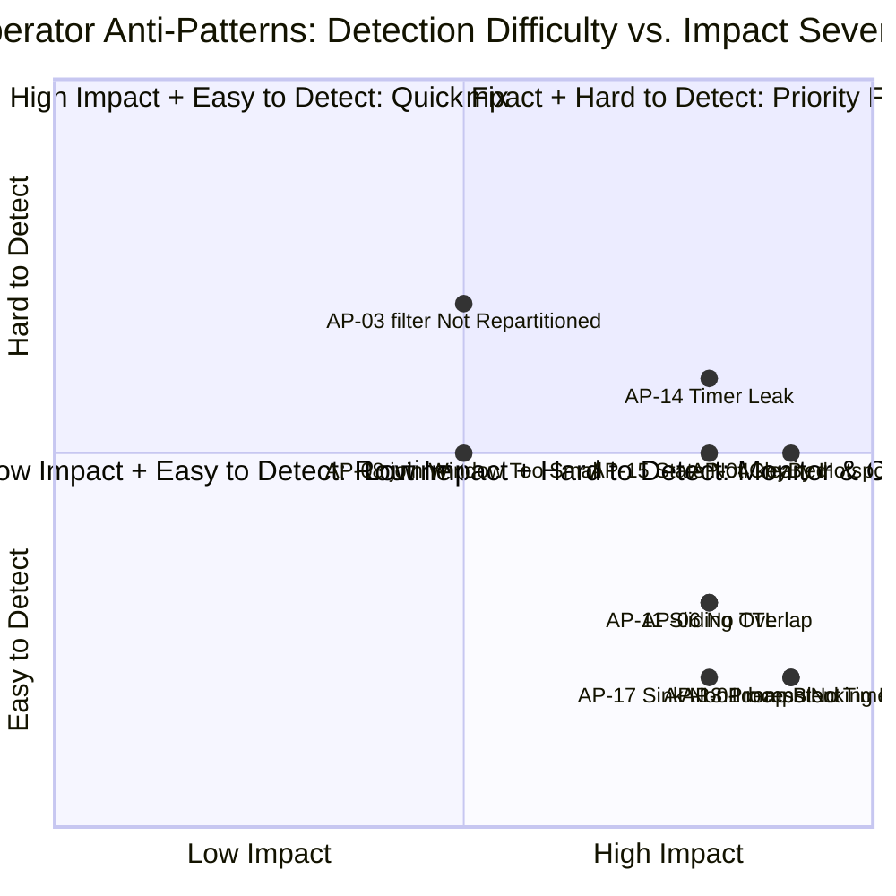
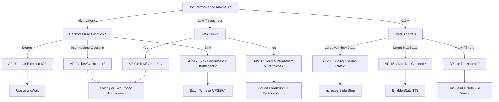

# Operator Anti-Patterns and Common Pitfalls (算子反模式与常见陷阱)

> **Stage**: Knowledge/09-anti-patterns | **Prerequisites**: [01.06-single-input-operators.md](01-concept-atlas/operator-deep-dive/01.06-single-input-operators.md), [01.10-process-and-async-operators.md](01-concept-atlas/operator-deep-dive/01.10-process-and-async-operators.md) | **Formalization Level**: L2-L3
> **Document Positioning**: Common misuse patterns, pitfalls, and corrective solutions at the streaming operator (算子) level
> **Version**: 2026.04

---

## Table of Contents

- [Operator Anti-Patterns and Common Pitfalls (算子反模式与常见陷阱)](#operator-anti-patterns-and-common-pitfalls-算子反模式与常见陷阱)
  - [Table of Contents](#table-of-contents)
  - [1. Anti-Pattern Overview](#1-anti-pattern-overview)
  - [2. Single-Input Operator Anti-Patterns](#2-single-input-operator-anti-patterns)
    - [AP-01: Blocking IO in map](#ap-01-blocking-io-in-map)
    - [AP-02: flatMap Abuse Leading to State Explosion](#ap-02-flatmap-abuse-leading-to-state-explosion)
    - [AP-03: No Repartitioning After filter](#ap-03-no-repartitioning-after-filter)
  - [3. Grouped Aggregation Anti-Patterns](#3-grouped-aggregation-anti-patterns)
    - [AP-04: keyBy Hot Key (热点键)](#ap-04-keyby-hot-key-热点键)
    - [AP-05: reduce Emitting Intermediate Results Causing Downstream Jitter](#ap-05-reduce-emitting-intermediate-results-causing-downstream-jitter)
    - [AP-06: Aggregate State Without TTL](#ap-06-aggregate-state-without-ttl)
  - [4. Multi-Stream Operator Anti-Patterns](#4-multi-stream-operator-anti-patterns)
    - [AP-07: Aggregating Directly After union Without keyBy](#ap-07-aggregating-directly-after-union-without-keyby)
    - [AP-08: join Window Too Small Causing Low Association Rate](#ap-08-join-window-too-small-causing-low-association-rate)
    - [AP-09: connect Without CoProcessFunction Handling](#ap-09-connect-without-coprocessfunction-handling)
  - [5. Window Operator Anti-Patterns](#5-window-operator-anti-patterns)
    - [AP-10: Improper Session Window Gap Setting](#ap-10-improper-session-window-gap-setting)
    - [AP-11: Excessive Sliding Window Overlap Rate](#ap-11-excessive-sliding-window-overlap-rate)
    - [AP-12: Global Window Without Custom Trigger](#ap-12-global-window-without-custom-trigger)
  - [6. Process Function Anti-Patterns](#6-process-function-anti-patterns)
    - [AP-13: Accessing External Services in ProcessFunction Without Timeout](#ap-13-accessing-external-services-in-processfunction-without-timeout)
    - [AP-14: Timer Leak (Timer泄漏)](#ap-14-timer-leak-timer泄漏)
    - [AP-15: State Not Cleaned Leading to OOM](#ap-15-state-not-cleaned-leading-to-oom)
  - [7. Source/Sink Anti-Patterns](#7-sourcesink-anti-patterns)
    - [AP-16: Source Parallelism Greater Than Kafka Partition Count](#ap-16-source-parallelism-greater-than-kafka-partition-count)
    - [AP-17: Sink Non-Idempotent and Without Transaction](#ap-17-sink-non-idempotent-and-without-transaction)
  - [8. Visualizations](#8-visualizations)
    - [Anti-Pattern Severity Matrix](#anti-pattern-severity-matrix)
    - [Anti-Pattern Detection Decision Tree](#anti-pattern-detection-decision-tree)
  - [9. References](#9-references)

---

## 1. Anti-Pattern Overview

| Anti-Pattern ID | Name | Affected Operator (算子) | Severity | Detection Difficulty |
|---------|------|---------|---------|---------|
| AP-01 | Blocking IO in map | map | 🔴 High | Low |
| AP-02 | flatMap Abuse | flatMap | 🟡 Medium | Medium |
| AP-03 | No Repartitioning After filter | filter + keyBy | 🟡 Medium | High |
| AP-04 | keyBy Hot Key | keyBy | 🔴 High | Medium |
| AP-05 | reduce Emitting Intermediate Results | reduce | 🟡 Medium | Low |
| AP-06 | Aggregate State Without TTL | aggregate | 🔴 High | Low |
| AP-07 | union Without keyBy | union | 🟡 Medium | Medium |
| AP-08 | join Window Too Small | join | 🟡 Medium | Medium |
| AP-09 | connect Without CoProcess | connect | 🟡 Medium | Low |
| AP-10 | Improper Session Gap | session window | 🟡 Medium | Medium |
| AP-11 | Excessive Sliding Overlap | sliding window | 🔴 High | Low |
| AP-12 | Global Window Without Trigger | global window | 🟡 Medium | Low |
| AP-13 | ProcessFunction Without Timeout | ProcessFunction | 🔴 High | Low |
| AP-14 | Timer Leak | KeyedProcessFunction | 🔴 High | Medium |
| AP-15 | State Not Cleaned | All Stateful Operators | 🔴 High | Medium |
| AP-16 | Source Parallelism > Partition Count | Source | 🟡 Medium | Low |
| AP-17 | Sink Non-Idempotent Without Transaction | Sink | 🔴 High | Low |

---

## 2. Single-Input Operator Anti-Patterns

### AP-01: Blocking IO in map

**Symptoms**:

```java
stream.map(event -> {
    // ❌ Wrong: synchronous external HTTP call inside map
    Result result = httpClient.call(event.getId());
    return enrich(event, result);
});
```

**Consequences**:

- A single event blocks the entire parallel subtask
- Backpressure (背压) propagates to the Source, throughput drops to near zero
- Checkpoint (检查点) timeouts cause frequent job restarts

**Root Cause**: `map` follows a synchronous single-threaded execution model; each element must be fully processed before the next one can begin.

**Corrective Solution**:

```java
// ✅ Correct: use asyncWait
AsyncDataStream.unorderedWait(
    stream,
    new AsyncFunction<Event, EnrichedEvent>() {
        public void asyncInvoke(Event event, ResultFuture<EnrichedEvent> resultFuture) {
            asyncHttpClient.call(event.getId(), result -> {
                resultFuture.complete(Collections.singletonList(enrich(event, result)));
            });
        }
    },
    Time.milliseconds(100),  // timeout
    50  // concurrency capacity
);
```

**Formal Explanation**: Let the external service latency be $L$; the throughput upper bound of map is $1/L$. `asyncWait` improves effective throughput to $C/L$ ($C$ is the concurrency capacity) through parallelization.

---

### AP-02: flatMap Abuse Leading to State Explosion

**Symptoms**: Using flatMap to generate a large number of intermediate events without pre-aggregation (预聚合) downstream.

```java
// ❌ Wrong: one event generates 1000 sub-events, directly window-aggregated
stream.flatMap(event -> generateSubEvents(event, 1000))
    .keyBy(sub -> sub.getKey())
    .window(TumblingEventTimeWindows.of(Time.minutes(1)))
    .aggregate(new CountAggregate());
```

**Consequences**:

- Event volume inside the window inflates by 1000x
- Window State (状态) memory usage explodes
- GC pressure causes Full GC pauses

**Corrective Solution**:

```java
// ✅ Correct: pre-aggregate immediately after flatMap (map-side aggregation)
stream.flatMap(event -> generateSubEvents(event, 1000))
    .keyBy(sub -> sub.getKey())
    .map(new PreAggregateFunction())  // pre-aggregation reduces downstream data volume
    .keyBy(pre -> pre.getKey())
    .window(TumblingEventTimeWindows.of(Time.minutes(1)))
    .aggregate(new FinalAggregate());
```

---

### AP-03: No Repartitioning After filter

**Symptoms**: The data distribution changes after filter, but the old keyBy partitioning is continued.

```java
// ❌ Wrong: data skew may worsen after filter
stream.keyBy(event -> event.getUserId())
    .filter(event -> event.getAmount() > 1000)  // retain only large transactions
    .window(TumblingEventTimeWindows.of(Time.minutes(1)))
    .aggregate(new SumAggregate());
```

**Consequences**:

- After filtering, some partitions may contain no data at all while others become denser
- Data skew intensifies; some Tasks become bottlenecks

**Corrective Solution**:

```java
// ✅ Correct: re-keyBy after filter (if business logic permits)
stream.filter(event -> event.getAmount() > 1000)
    .keyBy(event -> event.getCategory())  // use a more evenly distributed key
    .window(TumblingEventTimeWindows.of(Time.minutes(1)))
    .aggregate(new SumAggregate());
```

---

## 3. Grouped Aggregation Anti-Patterns

### AP-04: keyBy Hot Key (热点键)

**Symptoms**:

```java
// ❌ Wrong: keyBy country code, China (86) accounts for 90% of data
stream.keyBy(phone -> phone.getCountryCode())
```

**Consequences**:

- A single subtask processes 90% of the data
- That Task CPU reaches 100% while other Tasks remain idle
- Backpressure (背压) causes overall latency to spike

**Root Cause**: The key distribution is non-uniform (Zipf distribution is common).

**Corrective Solution**:

```java
// ✅ Solution 1: Salting (加盐)
stream.map(event -> {
    int salt = ThreadLocalRandom.current().nextInt(10);
    event.setSaltedKey(event.getUserId() + "_" + salt);
    return event;
})
.keyBy(event -> event.getSaltedKey())
.aggregate(new PartialAggregate())
// downstream: de-salt and aggregate by original key
.keyBy(event -> event.getOriginalKey())
.aggregate(new FinalAggregate());

// ✅ Solution 2: Two-Phase Aggregation (先本地聚合，再全局聚合)
stream.keyBy(event -> event.getUserId())
    .map(new LocalSum())  // local pre-aggregation
    .keyBy(event -> event.getUserId())
    .window(...)
    .aggregate(new GlobalSum());
```

---

### AP-05: reduce Emitting Intermediate Results Causing Downstream Jitter

**Symptoms**:

```java
// ❌ Wrong: reduce outputs on every rolling aggregation
stream.keyBy(Event::getKey)
    .reduce((a, b) -> new Event(a.getValue() + b.getValue()))
    .addSink(new PrintSink());
// Output: 1, 3, 6, 10, 15... every event triggers one output
```

**Consequences**:

- Downstream receives massive amounts of redundant intermediate results
- Sink throughput is overwhelmed
- Results are unreadable

**Corrective Solution**:

```java
// ✅ Correct: reduce only outputs when the window ends
stream.keyBy(Event::getKey)
    .window(TumblingEventTimeWindows.of(Time.minutes(1)))
    .reduce((a, b) -> new Event(a.getValue() + b.getValue()))
    .addSink(new PrintSink());
// Output: a single final result at window end
```

---

### AP-06: Aggregate State Without TTL

**Symptoms**:

```java
// ❌ Wrong: aggregation state never expires
stream.keyBy(Order::getUserId)
    .window(EventTimeSessionWindows.withGap(Time.minutes(30)))
    .aggregate(new UserStatsAggregate());
```

**Consequences**:

- User IDs keep growing (especially with new user registrations)
- State backend storage grows linearly
- Eventually OOM or disk full

**Corrective Solution**:

```java
// ✅ Correct: configure State TTL (Time-To-Live)
StateTtlConfig ttlConfig = StateTtlConfig
    .newBuilder(Time.hours(24))
    .setUpdateType(StateTtlConfig.UpdateType.OnCreateAndWrite)
    .setStateVisibility(StateTtlConfig.StateVisibility.NeverReturnExpired)
    .build();

// Configure in the open method of AggregateFunction
@Override
public void open(Configuration parameters) {
    ValueStateDescriptor<Accumulator> descriptor =
        new ValueStateDescriptor<>("stats", Accumulator.class);
    descriptor.enableTimeToLive(ttlConfig);
    state = getRuntimeContext().getState(descriptor);
}
```

---

## 4. Multi-Stream Operator Anti-Patterns

### AP-07: Aggregating Directly After union Without keyBy

**Symptoms**:

```java
// ❌ Wrong: windowAll directly after union
DataStream<Event> merged = stream1.union(stream2);
merged.windowAll(TumblingEventTimeWindows.of(Time.minutes(1)))
    .aggregate(new SumAggregate());
```

**Consequences**:

- `windowAll` runs at single parallelism and cannot scale
- Throughput upper bound is limited to single-core capacity

**Corrective Solution**:

```java
// ✅ Correct: keyBy first, then window after union
DataStream<Event> merged = stream1.union(stream2);
merged.keyBy(Event::getCategory)
    .window(TumblingEventTimeWindows.of(Time.minutes(1)))
    .aggregate(new SumAggregate());
```

---

### AP-08: join Window Too Small Causing Low Association Rate

**Symptoms**:

```java
// ❌ Wrong: order stream and payment stream joined with only 5-second window
stream1.join(stream2)
    .where(Order::getId)
    .equalTo(Payment::getOrderId)
    .window(TumblingEventTimeWindows.of(Time.seconds(5)))
    .apply(new JoinFunction());
```

**Consequences**:

- Payments usually lag orders by seconds to minutes
- Association rate within a 5-second window is <10%
- 90% of data is dropped or sent to side output (侧输出)

**Corrective Solution**:

```java
// ✅ Correct: use intervalJoin or a larger window
stream1.keyBy(Order::getId)
    .intervalJoin(stream2.keyBy(Payment::getOrderId))
    .between(Time.seconds(-5), Time.minutes(5))  // payment arrives 5s to 5min after order
    .process(new OrderPaymentJoin());
```

---

### AP-09: connect Without CoProcessFunction Handling

**Symptoms**:

```java
// ❌ Wrong: map directly after connect
ConnectedStreams<A, B> connected = streamA.connect(streamB);
connected.map(
    a -> processA(a),
    b -> processB(b)
);
```

**Consequences**:

- The two streams are processed independently; join logic cannot be implemented
- The advantages of connect (shared state and timers) are wasted

**Corrective Solution**:

```java
// ✅ Correct: use CoProcessFunction
connected.process(new CoProcessFunction<A, B, Result>() {
    private ValueState<A> aState;
    private ValueState<B> bState;

    @Override
    public void processElement1(A a, Context ctx, Collector<Result> out) {
        B b = bState.value();
        if (b != null) {
            out.collect(new Result(a, b));
            bState.clear();
        } else {
            aState.update(a);
            ctx.timerService().registerEventTimeTimer(ctx.timestamp() + 60000);
        }
    }

    @Override
    public void onTimer(long timestamp, OnTimerContext ctx, Collector<Result> out) {
        if (aState.value() != null) aState.clear();
        if (bState.value() != null) bState.clear();
    }
});
```

---

## 5. Window Operator Anti-Patterns

### AP-10: Improper Session Window Gap Setting

**Symptoms**: Session gap is set too large or too small.

```java
// ❌ Wrong: user behavior session with 10-second gap (too small)
stream.keyBy(Event::getUserId)
    .window(EventTimeSessionWindows.withGap(Time.seconds(10)))
    .aggregate(new UserSessionStats());
// A user reading an article for more than 10 seconds is split into multiple sessions
```

**Consequences**:

- Gap too small: one user session is split into many, statistics become distorted
- Gap too large: different user sessions merge, memory usage surges

**Corrective Solution**:

```java
// ✅ Correct: set gap based on business scenario analysis
// E-commerce browsing: 30 minutes is reasonable
stream.keyBy(Event::getUserId)
    .window(EventTimeSessionWindows.withGap(Time.minutes(30)))
    .aggregate(new UserSessionStats());
```

---

### AP-11: Excessive Sliding Window Overlap Rate

**Symptoms**:

```java
// ❌ Wrong: 1-hour window with 1-minute slide step → 60x state redundancy
stream.keyBy(Event::getKey)
    .window(SlidingEventTimeWindows.of(Time.hours(1), Time.minutes(1)))
    .aggregate(new CountAggregate());
```

**Consequences**:

- Each event belongs to 60 windows
- State volume inflates 60x
- Single parallelism reaches GB-level state; RocksDB triggers frequent compaction

**Corrective Solution**:

```java
// ✅ Correct: increase slide step, or switch to incremental aggregation (增量聚合)
stream.keyBy(Event::getKey)
    .window(SlidingEventTimeWindows.of(Time.hours(1), Time.minutes(15)))
    .aggregate(new IncrementalCountAggregate());
```

---

### AP-12: Global Window Without Custom Trigger

**Symptoms**:

```java
// ❌ Wrong: GlobalWindow + default Trigger (never expires)
stream.keyBy(Event::getKey)
    .window(GlobalWindows.create())
    .aggregate(new SumAggregate());
```

**Consequences**:

- Global window default Trigger is NeverTrigger
- Window never expires; state grows indefinitely
- Results are never emitted

**Corrective Solution**:

```java
// ✅ Correct: custom Trigger (触发器)
stream.keyBy(Event::getKey)
    .window(GlobalWindows.create())
    .trigger(CountTrigger.of(1000))  // trigger every 1000 records
    .evictor(CountEvictor.of(100))   // retain only the most recent 100 records
    .aggregate(new SumAggregate());
```

---

## 6. Process Function Anti-Patterns

### AP-13: Accessing External Services in ProcessFunction Without Timeout

**Symptoms**:

```java
// ❌ Wrong: synchronous external service call without timeout
public void processElement(Event event, Context ctx, Collector<Result> out) {
    Result result = externalService.call(event);  // may block forever
    out.collect(result);
}
```

**Consequences**:

- When the external service fails, processElement blocks permanently
- Checkpoint (检查点) cannot complete (barrier cannot pass through)
- Job crashes

**Corrective Solution**:

```java
// ✅ Correct: use async call or Future.get(timeout)
public void processElement(Event event, Context ctx, Collector<Result> out) {
    Future<Result> future = asyncExternalService.call(event);
    try {
        Result result = future.get(100, TimeUnit.MILLISECONDS);
        out.collect(result);
    } catch (TimeoutException e) {
        ctx.output(timeoutTag, event);  // send to side output (侧输出)
    }
}
```

---

### AP-14: Timer Leak (Timer泄漏)

**Symptoms**:

```java
// ❌ Wrong: register Timer without deleting the old one
public void processElement(Event event, Context ctx, Collector<Result> out) {
    ctx.timerService().registerEventTimeTimer(event.getTimestamp() + 60000);
    // Each event registers a Timer; old Timers are never deleted
}
```

**Consequences**:

- Timer queue grows indefinitely
- Timer state explodes during Checkpoint
- Upon recovery, massive numbers of Timers fire simultaneously (Timer Storm)

**Corrective Solution**:

```java
// ✅ Correct: track and delete old Timer
private ValueState<Long> timerState;

public void processElement(Event event, Context ctx, Collector<Result> out) {
    Long oldTimer = timerState.value();
    if (oldTimer != null) {
        ctx.timerService().deleteEventTimeTimer(oldTimer);
    }
    long newTimer = event.getTimestamp() + 60000;
    ctx.timerService().registerEventTimeTimer(newTimer);
    timerState.update(newTimer);
}

public void onTimer(long timestamp, OnTimerContext ctx, Collector<Result> out) {
    timerState.clear();
    // process Timer logic
}
```

---

### AP-15: State Not Cleaned Leading to OOM

**Symptoms**: Using MapState/ListState without cleaning expired data.

```java
// ❌ Wrong: MapState only grows, never shrinks
private MapState<String, Event> eventMap;

public void processElement(Event event, Context ctx, Collector<Result> out) {
    eventMap.put(event.getId(), event);  // only put, never remove
}
```

**Consequences**:

- MapState grows linearly
- Eventually OOM (Out Of Memory, 内存溢出)

**Corrective Solution**:

```java
// ✅ Solution 1: State TTL (Time-To-Live)
StateTtlConfig ttl = StateTtlConfig.newBuilder(Time.hours(1)).build();
mapStateDescriptor.enableTimeToLive(ttl);

// ✅ Solution 2: Periodic cleanup via Timer
public void onTimer(long timestamp, OnTimerContext ctx, Collector<Result> out) {
    Iterator<Map.Entry<String, Event>> iter = eventMap.iterator();
    while (iter.hasNext()) {
        Map.Entry<String, Event> entry = iter.next();
        if (entry.getValue().getTimestamp() < timestamp - 3600000) {
            iter.remove();
        }
    }
    // register next cleanup Timer
    ctx.timerService().registerEventTimeTimer(timestamp + 60000);
}
```

---

## 7. Source/Sink Anti-Patterns

### AP-16: Source Parallelism Greater Than Kafka Partition Count

**Symptoms**:

```java
// ❌ Wrong: Kafka topic has only 4 partitions, but Source parallelism is set to 8
KafkaSource<String> source = KafkaSource.builder()...build();
env.fromSource(source, ...).setParallelism(8);
```

**Consequences**:

- 4 subtasks actually consume data; 4 subtasks remain idle
- Resource waste without throughput improvement

**Corrective Solution**:

```java
// ✅ Correct: Source parallelism ≤ Kafka partition count
int kafkaPartitions = 4;
env.fromSource(source, ...).setParallelism(kafkaPartitions);
// or set to match the partition count
```

---

### AP-17: Sink Non-Idempotent and Without Transaction

**Symptoms**:

```java
// ❌ Wrong: JDBC Sink with plain INSERT, no idempotency guarantee
JdbcSink.sink(
    "INSERT INTO results (id, value) VALUES (?, ?)",
    (ps, event) -> { ps.setString(1, event.getId()); ps.setLong(2, event.getValue()); },
    ...
);
```

**Consequences**:

- After failure recovery, data is inserted repeatedly
- Primary key conflicts cause job failures

**Corrective Solution**:

```java
// ✅ Correct: UPSERT or Two-Phase Commit (两阶段提交)
JdbcSink.sink(
    "INSERT INTO results (id, value) VALUES (?, ?) " +
    "ON CONFLICT (id) DO UPDATE SET value = EXCLUDED.value",  // PostgreSQL
    (ps, event) -> { ps.setString(1, event.getId()); ps.setLong(2, event.getValue()); },
    ...
);
```

---

## 8. Visualizations

### Anti-Pattern Severity Matrix



### Anti-Pattern Detection Decision Tree



---

## 9. References


---

*Related Documents*: [01.06-single-input-operators.md](01-concept-atlas/operator-deep-dive/01.06-single-input-operators.md) | [01.10-process-and-async-operators.md](01-concept-atlas/operator-deep-dive/01.10-process-and-async-operators.md) | [streaming-operator-selection-decision-tree.md](04-technology-selection/operator-decision-tools/streaming-operator-selection-decision-tree.md)
