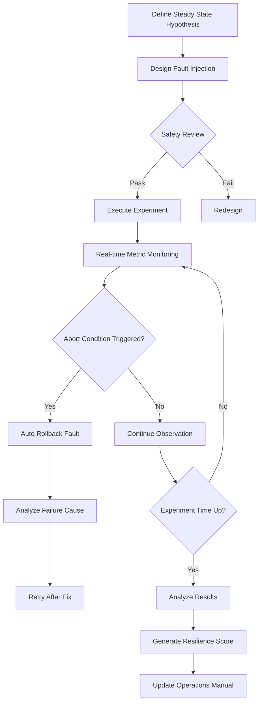
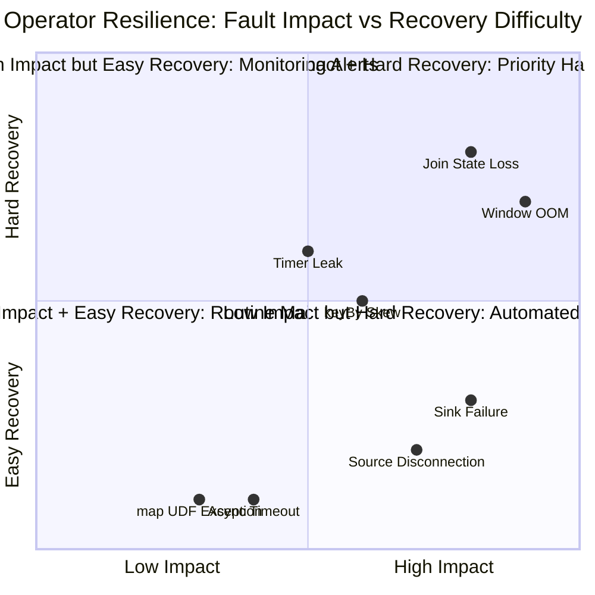

# Operator Chaos Engineering and Resilience Verification

> **Stage**: Knowledge/07-best-practices | **Prerequisites**: [operator-testing-and-verification-guide.md](operator-testing-and-verification-guide.md), [operator-debugging-and-troubleshooting-handbook.md](operator-debugging-and-troubleshooting-handbook.md) | **Formalization Level**: L3
> **Document Positioning**: Verify stream processing operator resilience and recovery capabilities under fault scenarios through Chaos Engineering (混沌工程) methods
> **Version**: 2026.04

---

## Table of Contents

- [Operator Chaos Engineering and Resilience Verification](#operator-chaos-engineering-and-resilience-verification)
  - [Table of Contents](#table-of-contents)
  - [1. Definitions](#1-definitions)
    - [Def-CHA-01-01: Operator Resilience (算子韧性)](#def-cha-01-01-operator-resilience-算子韧性)
    - [Def-CHA-01-02: Chaos Engineering (混沌工程)](#def-cha-01-02-chaos-engineering-混沌工程)
    - [Def-CHA-01-03: Operator-level Fault Injection (算子级故障注入)](#def-cha-01-03-operator-level-fault-injection-算子级故障注入)
    - [Def-CHA-01-04: Steady State Hypothesis (稳态假设)](#def-cha-01-04-steady-state-hypothesis-稳态假设)
    - [Def-CHA-01-05: Blast Radius (故障爆炸半径)](#def-cha-01-05-blast-radius-故障爆炸半径)
  - [2. Properties](#2-properties)
    - [Lemma-CHA-01-01: Inverse Relationship Between Checkpoint Frequency and Recovery Time](#lemma-cha-01-01-inverse-relationship-between-checkpoint-frequency-and-recovery-time)
    - [Lemma-CHA-01-02: Fast Recovery of Stateless Operators](#lemma-cha-01-02-fast-recovery-of-stateless-operators)
    - [Prop-CHA-01-01: Partial Failure Is Preferable to Global Failure](#prop-cha-01-01-partial-failure-is-preferable-to-global-failure)
    - [Prop-CHA-01-02: Safety Boundaries for Chaos Experiments](#prop-cha-01-02-safety-boundaries-for-chaos-experiments)
  - [3. Relations](#3-relations)
    - [3.1 Operator Type and Resilience Strategy Mapping](#31-operator-type-and-resilience-strategy-mapping)
    - [3.2 Chaos Engineering Toolchain](#32-chaos-engineering-toolchain)
    - [3.3 Relationship Between Resilience Testing and Conventional Testing](#33-relationship-between-resilience-testing-and-conventional-testing)
  - [4. Argumentation](#4-argumentation)
    - [4.1 Why Stream Processing Particularly Needs Chaos Engineering](#41-why-stream-processing-particularly-needs-chaos-engineering)
    - [4.2 Safety Guidelines for Production Chaos Experiments](#42-safety-guidelines-for-production-chaos-experiments)
    - [4.3 Common Anti-Pattern: Blind Injection](#43-common-anti-pattern-blind-injection)
  - [5. Proof / Engineering Argument](#5-proof--engineering-argument)
    - [5.1 Operator-level Fault Injection Framework Design](#51-operator-level-fault-injection-framework-design)
    - [5.2 Resilience Scoring Model](#52-resilience-scoring-model)
    - [5.3 Chaos Experiment Report Template](#53-chaos-experiment-report-template)
  - [6. Examples](#6-examples)
    - [6.1 Hands-on: Window Operator OOM Fault Injection and Recovery](#61-hands-on-window-operator-oom-fault-injection-and-recovery)
    - [6.2 Hands-on: Kafka Source Disconnection Recovery Verification](#62-hands-on-kafka-source-disconnection-recovery-verification)
  - [7. Visualizations](#7-visualizations)
    - [Chaos Engineering Experiment Flow](#chaos-engineering-experiment-flow)
    - [Resilience Score Radar Chart](#resilience-score-radar-chart)
  - [8. References](#8-references)

---

## 1. Definitions

### Def-CHA-01-01: Operator Resilience (算子韧性)

Operator Resilience (算子韧性) is the ability of an operator to maintain correct semantics and acceptable performance levels in the face of failures:

$$\text{Resilience}(Op) = \frac{\text{MTBF}}{\text{MTBF} + \text{MTTR}} \times \text{Correctness}_{fault}$$

Where MTBF is the Mean Time Between Failures, MTTR is the Mean Time To Recovery, and $\text{Correctness}_{fault}$ is the result correctness score (0-1) during the fault period.

### Def-CHA-01-02: Chaos Engineering (混沌工程)

Chaos Engineering (混沌工程) is a practice that verifies system resilience by injecting controlled faults into production or production-like environments:

$$\text{Chaos Experiment} = (\text{Steady State}, \text{Fault Injection}, \text{Observation}, \text{Rollback})$$

### Def-CHA-01-03: Operator-level Fault Injection (算子级故障注入)

Operator-level Fault Injection (算子级故障注入) is targeted fault simulation for specific operators or operator types:

| Fault Type | Injection Target | Simulated Scenario |
|-----------|-----------------|-------------------|
| **Latency Injection** | AsyncFunction | External service response slowdown |
| **Exception Injection** | map/ProcessFunction | UDF code exceptions |
| **Backpressure Injection** | Sink operator | Slow downstream consumption |
| **Network Partition** | Cross-TaskManager communication | Inter-node network interruption |
| **Node Failure** | TaskManager Pod | K8s node crash |
| **Memory Pressure** | Window/Aggregate operator | Excessive state causing GC |

### Def-CHA-01-04: Steady State Hypothesis (稳态假设)

Steady State Hypothesis (稳态假设) is a measurable definition of normal system behavior before a chaos experiment:

$$\text{SteadyState} = \bigwedge_{i}(\text{Metric}_i \in [\text{Lower}_i, \text{Upper}_i])$$

Examples:

- Throughput > 10000 records/s
- End-to-end latency p99 < 500ms
- Error rate < 0.1%
- Checkpoint success rate = 100%

### Def-CHA-01-05: Blast Radius (故障爆炸半径)

Blast Radius (故障爆炸半径) is the scope of system impact caused by fault injection:

$$\text{BlastRadius} = \frac{\text{AffectedOperators}}{\text{TotalOperators}} \times \frac{\text{AffectedTraffic}}{\text{TotalTraffic}}$$

Principle of Chaos Engineering: Start with the smallest blast radius and gradually expand.

---

## 2. Properties

### Lemma-CHA-01-01: Inverse Relationship Between Checkpoint Frequency and Recovery Time

The checkpoint interval $\Delta_{chkpt}$ and recovery time $\mathcal{T}_{recover}$ satisfy:

$$\mathcal{T}_{recover} = \mathcal{T}_{restart} + \alpha \cdot \Delta_{chkpt}$$

Where $\mathcal{T}_{restart}$ is the fixed job restart overhead (approximately 10-30 seconds), and $\alpha$ is the replay data proportion coefficient.

**Engineering Corollary**: More frequent checkpoints reduce the amount of data that needs to be replayed during recovery, but increase runtime overhead.

### Lemma-CHA-01-02: Fast Recovery of Stateless Operators

The recovery time of stateless operators (map/filter/flatMap) depends only on restart overhead:

$$\mathcal{T}_{recover}^{stateless} = \mathcal{T}_{restart}$$

While the recovery time of stateful operators also includes state loading:

$$\mathcal{T}_{recover}^{stateful} = \mathcal{T}_{restart} + \frac{S}{B_{load}}$$

Where $S$ is the state size and $B_{load}$ is the state loading bandwidth.

### Prop-CHA-01-01: Partial Failure Is Preferable to Global Failure

In distributed stream processing, local fault isolation is preferable to global restart:

$$\text{Availability}_{partial} > \text{Availability}_{global}$$

**Proof Sketch**: Suppose the system has $N$ parallel Tasks, and the failure probability of a single Task is $p$. Under the global restart strategy, any Task failure renders the entire system unavailable; under the local isolation strategy, only the failed Task is briefly unavailable while other Tasks continue processing. ∎

### Prop-CHA-01-02: Safety Boundaries for Chaos Experiments

Safety boundaries for chaos experiments require:

$$\text{BlastRadius} \leq \text{AbortCondition} \land \text{Metric}_{critical} > \text{SafetyThreshold}$$

If critical metrics fall below the safety threshold during the experiment, fault injection must be automatically rolled back immediately.

---

## 3. Relations

### 3.1 Operator Type and Resilience Strategy Mapping

| Operator Type | Primary Failure Mode | Resilience Strategy | Chaos Verification Experiment |
|--------------|---------------------|--------------------|------------------------------|
| **Source** | Kafka Lag, connection drop | Auto-reconnect, offset persistence | Kill Kafka broker |
| **map/filter** | UDF exceptions | Try-catch + Side Output | Inject NPE exceptions |
| **keyBy** | Data skew | Salting, two-phase aggregation | Create hot keys |
| **window/aggregate** | Excessive state causing OOM | State TTL, incremental aggregation | Memory pressure injection |
| **join** | Low join rate | Side Output unmatched data | Latency injection to one stream |
| **AsyncFunction** | External service timeout | Timeout + fallback + circuit breaker | Network latency injection |
| **ProcessFunction** | Timer leak | Timer cleanup + state TTL | High-frequency timer registration |
| **Sink** | Write failure | Idempotent write + retry + dead-letter queue | Kill downstream storage |

### 3.2 Chaos Engineering Toolchain

```
Chaos Experiment Orchestration
├── Chaos Mesh (K8s-native)
│   ├── Pod faults (kill, network partition)
│   ├── Network faults (latency, packet loss, bandwidth limit)
│   ├── Pressure faults (CPU, memory, IO)
│   └── Time faults (clock drift)
├── Gremlin (SaaS platform)
│   └── Attack library (Latency, Blackhole, Packet Loss)
├── Toxiproxy (network proxy)
│   └── Inter-service communication fault injection
└── Custom tools
    ├── Flink UDF exception injection
    └── Data skew generator
```

### 3.3 Relationship Between Resilience Testing and Conventional Testing

```
Testing Pyramid
├── Unit Test (L1)
│   └── Pure logic verification of individual operators
├── Integration Test (L2)
│   └── Functional verification of operator combinations
├── End-to-End Test (L3)
│   └── Functional verification of complete Pipeline
└── Chaos Test (L4)
    └── Resilience verification under fault scenarios
```

---

## 4. Argumentation

### 4.1 Why Stream Processing Particularly Needs Chaos Engineering

Special characteristics of stream processing systems:

1. **Continuous Operation**: No explicit "testing window"; failures can occur at any time
2. **State Accumulation**: Long-running states may trigger bugs under specific conditions
3. **Distributed Nature**: Network partitions and node failures are the norm rather than the exception
4. **Fragility of Exactly-Once**: Failures during recovery can easily introduce duplicates or losses

### 4.2 Safety Guidelines for Production Chaos Experiments

**Guideline 1: Start Small**

- First validate experiment design in development/testing environments
- Choose off-peak hours for the first production experiment
- Blast radius starts from a single Task and gradually expands

**Guideline 2: Automated Abort Conditions**

```yaml
abort_conditions:
  - metric: error_rate
    threshold: "> 5%"
    duration: "1m"
  - metric: p99_latency
    threshold: "> 2s"
    duration: "30s"
  - metric: checkpoint_success_rate
    threshold: "< 90%"
    duration: "2m"
```

**Guideline 3: Fast Rollback Capability**

- All fault injections must be reversible
- Prepare one-click rollback scripts
- Team on-call response time < 5 minutes

### 4.3 Common Anti-Pattern: Blind Injection

**Anti-Pattern 1**: Injecting faults without a steady state hypothesis

- Consequence: Unable to determine whether the system has "normally" recovered

**Anti-Pattern 2**: Continuous injection without abort conditions

- Consequence: Causes production incidents

**Anti-Pattern 3**: Conducting chaos experiments only in testing environments

- Consequence: Testing environments cannot simulate real production load and complexity

---

## 5. Proof / Engineering Argument

### 5.1 Operator-level Fault Injection Framework Design

**Framework Goal**: Inject faults through configuration without modifying operator code.

**Implementation**:

```java
// Fault injection decorator
public class FaultInjectionWrapper<T, R> extends RichMapFunction<T, R> {
    private final RichMapFunction<T, R> inner;
    private final FaultConfig config;
    private transient Random random;

    public FaultInjectionWrapper(RichMapFunction<T, R> inner, FaultConfig config) {
        this.inner = inner;
        this.config = config;
    }

    @Override
    public R map(T value) throws Exception {
        // Latency injection
        if (config.getLatencyInjection() > 0 && random.nextDouble() < config.getLatencyProbability()) {
            Thread.sleep(config.getLatencyInjection());
        }

        // Exception injection
        if (config.getExceptionProbability() > 0 && random.nextDouble() < config.getExceptionProbability()) {
            throw new RuntimeException("Injected fault: " + config.getExceptionType());
        }

        return inner.map(value);
    }
}
```

**Usage**:

```java
stream.map(new FaultInjectionWrapper<>(
    new RealMapFunction(),
    FaultConfig.builder()
        .latencyInjection(1000)  // Inject 1 second latency
        .latencyProbability(0.1) // 10% probability
        .exceptionProbability(0.01) // 1% probability to throw exception
        .build()
));
```

### 5.2 Resilience Scoring Model

**Scoring Dimensions**:

| Dimension | Weight | Measurement Method |
|-----------|--------|--------------------|
| **Availability** | 30% | MTBF / (MTBF + MTTR) |
| **Correctness** | 30% | Result accuracy during fault period |
| **Performance** | 20% | Latency change rate during fault period |
| **Recovery Speed** | 20% | Time from fault to steady state |

**Composite Score**:
$$\text{ResilienceScore} = \sum_{i} w_i \cdot \text{Score}_i$$

**Grades**:

- 90-100: Excellent (production-grade)
- 70-89: Good (needs optimization)
- 50-69: Pass (has risks)
- <50: Fail (prohibited from going live)

### 5.3 Chaos Experiment Report Template

```markdown
# Chaos Experiment Report: [Experiment Name]

## Experiment Design
- **Target Operator**: [Operator name]
- **Fault Type**: [Latency/Exception/Network/Node]
- **Blast Radius**: [Single Task/Single TM/Full cluster]
- **Duration**: [X minutes]

## Steady State Hypothesis
- Throughput: [X records/s]
- Latency p99: [X ms]
- Error rate: [X%]

## Experiment Execution
- **Injection Time**: [timestamp]
- **Observed Phenomena**: [Description]
- **Metric Changes**: [Data]

## Result Analysis
- **Resilience Score**: [X/100]
- **Issues Found**: [Description]
- **Fix Recommendations**: [Description]

## Rollback Verification
- **Rollback Time**: [timestamp]
- **Recovery Time**: [X seconds]
- **Steady State Recovered**: [Yes/No]
```

---

## 6. Examples

### 6.1 Hands-on: Window Operator OOM Fault Injection and Recovery

**Experiment Design**:

- Target: TumblingWindow aggregate operator
- Fault: Memory pressure (via K8s container memory limit)
- Steady state: Throughput 5000 records/s, Checkpoint 10 seconds

**Execution**:

```bash
# Inject memory pressure using Chaos Mesh
kubectl apply -f - <<EOF
apiVersion: chaos-mesh.org/v1alpha1
kind: StressChaos
metadata:
  name: memory-stress
spec:
  mode: one
  selector:
    labelSelectors:
      app: flink-taskmanager
  stressors:
    memory:
      workers: 4
      size: "80%"
  duration: "5m"
EOF
```

**Observations**:

- 30 seconds after injection: GC time ratio rises from 3% to 45%
- 2 minutes after injection: Checkpoint time increases from 10 seconds to 90 seconds
- 4 minutes after injection: TaskManager OOMKilled
- Recovery time: 45 seconds (recovery from previous checkpoint)

**Fixes**:

- Enable State TTL (window state retention changed from infinite to 1 hour)
- Increase TaskManager memory (4GB → 8GB)
- Optimize aggregation logic (reduce intermediate state)

### 6.2 Hands-on: Kafka Source Disconnection Recovery Verification

**Experiment Design**:

- Target: Kafka Source operator
- Fault: Kafka broker network isolation
- Steady state: Consumer lag < 1000 records

**Execution**:

```bash
# Inject network partition using Chaos Mesh
kubectl apply -f - <<EOF
apiVersion: chaos-mesh.org/v1alpha1
kind: NetworkChaos
metadata:
  name: kafka-partition
spec:
  action: partition
  mode: one
  selector:
    labelSelectors:
      app: kafka-broker
  direction: both
  target:
    selector:
      labelSelectors:
        app: flink-taskmanager
    mode: all
  duration: "3m"
EOF
```

**Observations**:

- After network partition: Source consumption stops immediately, records-lag starts growing
- After partition removal: Source auto-reconnects, catch-up consumption rate reaches 3x normal
- Data consistency: No loss, no duplication (Exactly-Once guarantee)

---

## 7. Visualizations

### Chaos Engineering Experiment Flow



### Resilience Score Radar Chart



---

## 8. References


---

*Related Documents*: [operator-testing-and-verification-guide.md](operator-testing-and-verification-guide.md) | [operator-debugging-and-troubleshooting-handbook.md](operator-debugging-and-troubleshooting-handbook.md) | [operator-observability-and-intelligent-ops.md](operator-observability-and-intelligent-ops.md)
