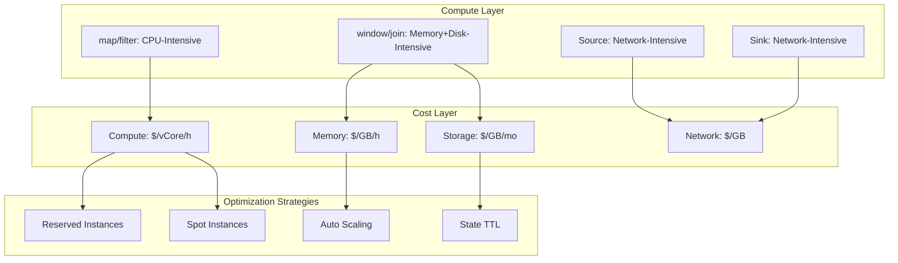
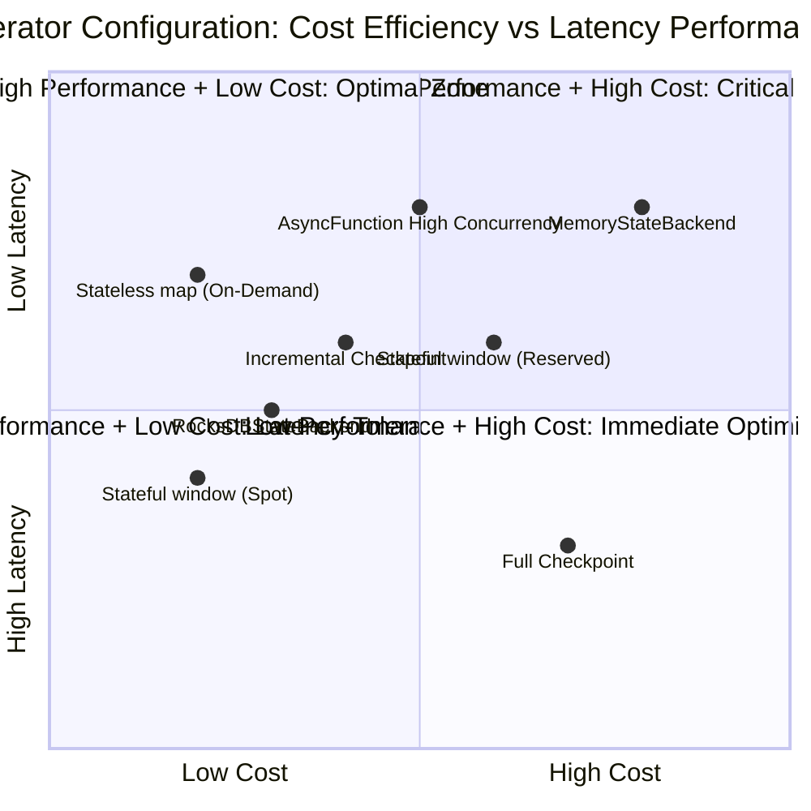
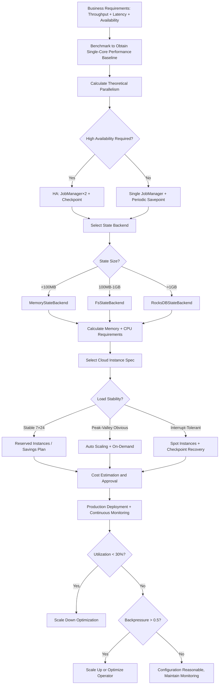

# Operator Cost Model and Cloud Resource Estimation

> **Stage**: Knowledge/07-best-practices | **Prerequisites**: [operator-performance-benchmark-tuning.md](operator-performance-benchmark-tuning.md), [single-input-operators.md](single-input-operators.md) | **Formalization Level**: L2-L3
> **Document Scope**: Resource consumption models for streaming operators, cloud cost estimation methods, and capacity planning guidelines
> **Version**: 2026.04

---

## Table of Contents

- [Operator Cost Model and Cloud Resource Estimation](#operator-cost-model-and-cloud-resource-estimation)
  - [Table of Contents](#table-of-contents)
  - [1. Definitions](#1-definitions)
    - [Def-CST-01-01: Operator Resource Vector (算子资源消耗向量)](#def-cst-01-01-operator-resource-vector-算子资源消耗向量)
    - [Def-CST-01-02: Operator Cost Function (算子成本函数)](#def-cst-01-02-operator-cost-function-算子成本函数)
    - [Def-CST-01-03: State Storage Cost Density (状态存储成本密度)](#def-cst-01-03-state-storage-cost-density-状态存储成本密度)
    - [Def-CST-01-04: Resource Utilization Efficiency (资源利用效率)](#def-cst-01-04-resource-utilization-efficiency-资源利用效率)
    - [Def-CST-01-05: Elastic Scaling Granularity (弹性伸缩粒度)](#def-cst-01-05-elastic-scaling-granularity-弹性伸缩粒度)
  - [2. Properties](#2-properties)
    - [Lemma-CST-01-01: Operator Cost Grows Superlinearly with State Size](#lemma-cst-01-01-operator-cost-grows-superlinearly-with-state-size)
    - [Lemma-CST-01-02: Stateless Operator Cost Has Linear Relationship with Throughput](#lemma-cst-01-02-stateless-operator-cost-has-linear-relationship-with-throughput)
    - [Prop-CST-01-01: Data Skew Causes Resource Utilization Paradox](#prop-cst-01-01-data-skew-causes-resource-utilization-paradox)
    - [Prop-CST-01-02: Cost Difference Between Reserved Instances and On-Demand Instances](#prop-cst-01-02-cost-difference-between-reserved-instances-and-on-demand-instances)
  - [3. Relations](#3-relations)
    - [3.1 Operator Type to Resource Characteristic Mapping](#31-operator-type-to-resource-characteristic-mapping)
    - [3.2 Cloud Provider Pricing Model Comparison](#32-cloud-provider-pricing-model-comparison)
    - [3.3 Relationship Between Capacity Planning and Cost Optimization](#33-relationship-between-capacity-planning-and-cost-optimization)
  - [4. Argumentation](#4-argumentation)
    - [4.1 Why Streaming Processing Costs Are Difficult to Estimate](#41-why-streaming-processing-costs-are-difficult-to-estimate)
    - [4.2 Applicability Analysis of Spot/Preemptible Instances](#42-applicability-analysis-of-spotpreemptible-instances)
    - [4.3 Memory vs. Disk Trade-off](#43-memory-vs-disk-trade-off)
  - [5. Proof / Engineering Argument](#5-proof--engineering-argument)
    - [5.1 Operator Resource Estimation Formula](#51-operator-resource-estimation-formula)
    - [5.2 Capacity Planning Calculator Template](#52-capacity-planning-calculator-template)
    - [5.3 Cost Optimization Strategy Matrix](#53-cost-optimization-strategy-matrix)
  - [6. Examples](#6-examples)
    - [6.1 Case Study: E-commerce Real-time Dashboard Cost Estimation](#61-case-study-e-commerce-real-time-dashboard-cost-estimation)
    - [6.2 Case Study: Deriving Production Configuration from Benchmark Data](#62-case-study-deriving-production-configuration-from-benchmark-data)
  - [7. Visualizations](#7-visualizations)
    - [Operator Resource Consumption Hierarchy](#operator-resource-consumption-hierarchy)
    - [Cost-Latency Trade-off Quadrant Chart](#cost-latency-trade-off-quadrant-chart)
    - [Capacity Planning Decision Flow](#capacity-planning-decision-flow)
  - [8. References](#8-references)

---

## 1. Definitions

### Def-CST-01-01: Operator Resource Vector (算子资源消耗向量)

The resource consumption of operator $Op_i$ is represented by a four-dimensional vector:

$$\vec{R}_i = \langle CPU_i, MEM_i, NET_i, DISK_i \rangle$$

Where:

- $CPU_i$: Single-core utilization (%) or required vCore count
- $MEM_i$: Heap memory + managed memory + network buffers (GB)
- $NET_i$: Input/output network bandwidth (MB/s)
- $DISK_i$: State backend disk I/O (IOPS or MB/s)

### Def-CST-01-02: Operator Cost Function (算子成本函数)

In a public cloud environment, the hourly cost of operator $Op_i$ is:

$$\mathcal{C}(Op_i, t) = \alpha \cdot CPU_i + \beta \cdot MEM_i + \gamma \cdot NET_i + \delta \cdot DISK_i + \epsilon \cdot \mathcal{L}_i$$

Where $\alpha, \beta, \gamma, \delta$ are cloud provider pricing coefficients ($/vCore/h, $/GB/h, etc.), $\epsilon$ is the latency penalty coefficient (SLA breach cost), and $\mathcal{L}_i$ is the operator latency.

### Def-CST-01-03: State Storage Cost Density (状态存储成本密度)

The storage cost per unit of state:

$$\rho_{state} = \frac{\text{Monthly Storage Cost}}{\text{Average State Size}} \quad [\$/GB/month]$$

For RocksDB on SSD: $\rho_{state} \approx 0.08-0.15$ $/GB/month; for incremental Checkpoint on OSS/S3: $\rho_{state} \approx 0.012-0.023$ $/GB/month.

### Def-CST-01-04: Resource Utilization Efficiency (资源利用效率)

Resource utilization efficiency is defined as the ratio of actual workload to allocated peak resources:

$$\eta = \frac{\int_0^T \min(\vec{R}_{\text{actual}}(t), \vec{R}_{\text{allocated}}) \, dt}{\int_0^T \vec{R}_{\text{allocated}} \, dt}$$

If $\eta < 0.3$, resources are over-provisioned; if $\eta > 0.8$ and backpressure persists, resources are under-provisioned.

### Def-CST-01-05: Elastic Scaling Granularity (弹性伸缩粒度)

Elastic scaling granularity $\Delta P$ is defined as the minimum parallelism adjustment unit for a single scaling operation. For Flink on Kubernetes, the granularity is a single TaskManager Pod (typically hosting 1-4 slots):

$$\Delta P = \text{slotsPerTM} \times \Delta \text{Pods}$$

---

## 2. Properties

### Lemma-CST-01-01: Operator Cost Grows Superlinearly with State Size

For stateful operators (window/aggregate/join), cost and state size satisfy:

$$\mathcal{C}(Op_{stateful}) \in O(S \cdot \log S)$$

**Proof Sketch**:

- State storage: linear $O(S)$
- Checkpoint: incremental snapshot requires traversing the state tree, $O(S)$
- Compaction: RocksDB LSM-Tree write amplification is $O(\log S)$
- Recovery: read and deserialize state, $O(S)$

Combining these yields superlinear growth. ∎

### Lemma-CST-01-02: Stateless Operator Cost Has Linear Relationship with Throughput

For stateless operators (map/filter/flatMap), when CPU is not saturated:

$$\mathcal{C}(Op_{stateless}) \approx k \cdot \lambda$$

Where $\lambda$ is the input throughput (records/s) and $k$ is the per-record processing cost.

**Corollary**: Stateless operator cost is the most predictable; it can be linearly extrapolated from small-scale benchmark tests.

### Prop-CST-01-01: Data Skew Causes Resource Utilization Paradox

In data skew scenarios, overall resource utilization $\eta$ and skew index $\text{SkewIndex}$ satisfy:

$$\eta \approx \frac{1}{\text{SkewIndex}} + (1 - \frac{1}{K}) \cdot \eta_{idle}$$

Where $\eta_{idle}$ is the proportion of idle Task resources and $K$ is the total parallelism.

**Engineering Implication**: When SkewIndex=10, even if overall utilization shows 30%, the hot Task may already be 100% saturated. Scaling decisions cannot be based solely on average utilization.

### Prop-CST-01-02: Cost Difference Between Reserved Instances and On-Demand Instances

For 7×24 streaming jobs, Reserved Instances / Savings Plans can reduce costs:

$$\text{SavingsRatio} = 1 - \frac{\text{Cost}_{\text{reserved}}}{\text{Cost}_{\text{ondemand}}} \in [0.3, 0.6]$$

**Constraint**: Reserved instances require a 1-3 year commitment and are not suitable for jobs with frequent elastic scaling fluctuations.

---

## 3. Relations

### 3.1 Operator Type to Resource Characteristic Mapping

| Operator Type | CPU Characteristic | Memory Characteristic | Network Characteristic | Disk Characteristic | Cost Sensitivity |
|---------|---------|---------|---------|---------|-----------|
| **Source(Kafka)** | Low | Low | High (consumption bandwidth) | Low | Medium |
| **map/filter** | Medium | Very Low | Medium | None | Low |
| **flatMap** | Medium-High | Low | High (output expansion) | None | Low-Medium |
| **keyBy** | Low | Low | High (shuffle) | None | Medium |
| **window/aggregate** | Medium | **Very High** (state) | Medium | High (RocksDB) | **High** |
| **join** | High | **Very High** (dual-state) | High | High | **High** |
| **ProcessFunction** | Variable | Variable | Variable | Variable | Variable |
| **AsyncFunction** | Low | Low | Very High (concurrent IO) | None | Medium |
| **Sink** | Low-Medium | Low | High (write bandwidth) | None | Medium |

### 3.2 Cloud Provider Pricing Model Comparison

| Cloud Provider | Compute Pricing | Storage Pricing | Network Pricing | Reserved Discount |
|--------|---------|---------|---------|---------|
| **AWS** | $0.05-0.20/vCore/h (EKS) | $0.10/GB/mo (EBS gp3) | $0.09/GB (egress) | Up to 55% |
| **Alibaba Cloud** | ¥0.30-1.20/vCore/h | ¥0.50/GB/mo (ESSD) | ¥0.80/GB | Up to 50% |
| **GCP** | $0.05-0.15/vCore/h (GKE) | $0.12/GB/mo (PD-SSD) | $0.12/GB | Up to 57% |
| **Azure** | $0.04-0.18/vCore/h (AKS) | $0.15/GB/mo (Managed Disk) | $0.10/GB | Up to 55% |

### 3.3 Relationship Between Capacity Planning and Cost Optimization

```
Capacity Planning Process
├── 1. Throughput Estimation (QPS × Record Size × Peak Factor)
├── 2. Operator-Level Resource Modeling (based on Def-CST-01-01 vector)
├── 3. Cloud Resource Selection (VM spec matching)
├── 4. Cost Estimation (Reserved vs On-Demand vs Spot)
├── 5. Benchmark Validation (verify model accuracy)
└── 6. Continuous Optimization (adjust based on actual utilization)
```

---

## 4. Argumentation

### 4.1 Why Streaming Processing Costs Are Difficult to Estimate

Unlike batch processing's "start on demand, pay per run" model, streaming processing is **continuously running**:

- **Fixed Cost**: Even during low-traffic periods (e.g., early morning), the job is still running and resources are continuously billed
- **State Accumulation**: State size grows over time, and storage costs increase monotonically (unless TTL is effective)
- **Peak Redundancy**: Resources reserved for traffic peaks remain idle during low-traffic periods
- **Checkpoint Overhead**: Periodic snapshots consume CPU and I/O regardless of business traffic

**Case Study**: A certain e-commerce real-time recommendation system has an average daily QPS of 100K and a peak QPS of 2M during promotions.

- Provisioned for peak: 2M QPS requires 80 vCores, monthly cost $2,880
- Actual average utilization: 15% (most of the time at 100K QPS)
- After optimization (auto scaling): average 40 vCores per month, monthly cost $1,440 (50% savings)

### 4.2 Applicability Analysis of Spot/Preemptible Instances

Spot instance prices are typically 20-40% of on-demand prices, but cloud providers may reclaim them at any time.

**Applicable Scenarios**:

- ✅ Stateless operators (map/filter): state loss is recoverable
- ✅ Jobs that can tolerate minute-level interruptions (recovery from Savepoint takes approximately 30-60 seconds)
- ✅ Redundant Tasks deployed across multiple availability zones

**Inapplicable Scenarios**:

- ❌ Primary replicas of stateful operators (state migration cost is high)
- ❌ JobManager (single point of failure is unacceptable)
- ❌ Jobs with strict SLA (<30 seconds RTO)

### 4.3 Memory vs. Disk Trade-off

Flink provides two state backends:

| Dimension | MemoryStateBackend | FsStateBackend | RocksDBStateBackend |
|------|-------------------|----------------|---------------------|
| State Location | JVM Heap | JVM Heap + Disk | Native Memory + Disk |
| State Limit | Several GB (heap limited) | Several GB | TB-level |
| Serialization Overhead | Low (object reference) | Low | High (Kryo/Avro) |
| Checkpoint Speed | Fast | Medium | Slow (medium after incremental optimization) |
| Unit Cost | High (memory is expensive) | High | Low (disk is cheap) |

**Decision**:

- State < 100MB: MemoryStateBackend (simple, fast)
- State 100MB-1GB: FsStateBackend
- State > 1GB: RocksDBStateBackend (only choice)

---

## 5. Proof / Engineering Argument

### 5.1 Operator Resource Estimation Formula

**Input**: Business throughput $\lambda$ (records/s), average record size $s$ (bytes), Pipeline topology.

**Step 1: Calculate per-operator input/output volume**

$$\lambda_i^{in} = \lambda_{i-1}^{out} \cdot (1 - r_{filter,i})$$

Where $r_{filter,i}$ is the drop rate of the $i$-th filter operator.

$$\lambda_i^{out} = \lambda_i^{in} \cdot c_{flatMap,i}$$

Where $c_{flatMap,i}$ is the average expansion coefficient of flatMap.

**Step 2: Calculate CPU requirement**

$$CPU_i = \frac{\lambda_i^{in} \cdot \tau_i}{1000 \cdot U_{target}} \quad [\text{vCore}]$$

Where $\tau_i$ is the single-record processing time (ms, from benchmark testing) and $U_{target}$ is the target CPU utilization (typically 0.6-0.7).

**Step 3: Calculate memory requirement**

$$MEM_i = MEM_{fixed} + MEM_{network} + MEM_{managed}$$

Where:

- $MEM_{fixed}$: Flink framework fixed overhead (approximately 1.5-2GB/TaskManager)
- $MEM_{network}$: Network buffers = $\min(\text{slots} \times 64MB, 1GB)$
- $MEM_{managed}$: Managed memory (RocksDB cache) = recommended 256MB/Slot

**Step 4: Calculate state storage cost**

$$S_i = \lambda_i^{in} \cdot s_{state} \cdot TTL_{effective} \quad [GB]$$

Where $s_{state}$ is the per-record state size and $TTL_{effective}$ is the effective retention time.

$$\text{Cost}_{state} = S_i \cdot \rho_{state}$$

**Step 5: Total cost**

$$\text{TotalCost} = \sum_i (CPU_i \cdot \alpha + MEM_i \cdot \beta) \cdot 730 + \sum_i S_i \cdot \rho_{state}$$

(730 = average hours per month)

### 5.2 Capacity Planning Calculator Template

```yaml
# streaming-resource-calculator.yaml
pipeline:
  source:
    type: kafka
    throughput_rps: 100000
    record_size_bytes: 512

  operators:
    - name: filter
      type: filter
      drop_rate: 0.3
      processing_time_ms: 0.05

    - name: enrich
      type: asyncWait
      processing_time_ms: 10
      capacity: 50

    - name: aggregate
      type: window_aggregate
      window_minutes: 5
      state_per_key_bytes: 1024
      unique_keys_estimate: 1000000

    - name: sink
      type: kafka_sink
      processing_time_ms: 0.5

pricing:
  cloud_provider: aws
  region: us-east-1
  vcore_hourly: 0.05
  memory_gb_hourly: 0.015
  storage_gb_monthly: 0.10
  network_egress_per_gb: 0.09

constraints:
  target_cpu_utilization: 0.65
  target_memory_utilization: 0.70
  sla_latency_p99_ms: 500
  sla_availability: 0.999
```

### 5.3 Cost Optimization Strategy Matrix

| Strategy | Applicable Scenario | Expected Savings | Risk |
|------|---------|---------|------|
| **Reserved Instances** | 7×24 stable workload | 30-55% | Long-term lock-in |
| **Spot Instances** | Stateless Tasks, interrupt-tolerant | 60-80% | Interruption recovery latency |
| **Auto Scaling** | Obvious peak-valley pattern | 20-40% | Cold start latency |
| **State TTL Optimization** | Continuously growing state | 10-30% | Business data loss |
| **Serialization Optimization** | High CPU, serialization >30% | 10-20% | Code complexity |
| **Co-location Deployment** | High cross-AZ/Region traffic | 5-15% (network cost) | Reduced disaster recovery |

---

## 6. Examples

### 6.1 Case Study: E-commerce Real-time Dashboard Cost Estimation

**Business Requirements**:

- Real-time statistics for category-level GMV, UV, and order count
- Throughput: 50,000 orders/s
- Windows: 1-minute Tumbling + 5-minute Sliding
- Latency SLA: p99 < 300ms

**Resource Estimation**:

| Component | Parallelism | vCore | Memory (GB) | State (GB) | Monthly Cost (USD) |
|------|--------|-------|---------|---------|------------|
| Source(Kafka) | 16 | 4 | 8 | 0 | $140 |
| map+filter | 16 | 4 | 8 | 0 | $140 |
| keyBy+window(1min) | 32 | 8 | 32 | 2.5 | $730 |
| aggregate(5min sliding) | 32 | 8 | 48 | 15 | $1,100 |
| Sink | 8 | 2 | 4 | 0 | $70 |
| **Total** | | **26** | **100** | **17.5** | **~$2,180** |

**After Optimization** (enabling State TTL, auto scaling, reserved instances):

- Average monthly vCore reduced to 18, saving 30%
- State controlled to 5GB via TTL, saving 60% on storage
- Reserved instances save an additional 40%
- **Optimized monthly cost: ~$920**

### 6.2 Case Study: Deriving Production Configuration from Benchmark Data

**Benchmark Results** (per vCore):

- map: 500,000 records/s
- window aggregate (1min): 50,000 records/s
- join: 20,000 records/s

**Production Requirement**: 100,000 records/s, with map → keyBy → window → sink.

**Derivation**:

```
map parallelism = 100,000 / 500,000 = 0.2 -> minimum 1
window parallelism = 100,000 / 50,000 = 2
Considering 3x peak and 0.7 utilization:
map parallelism = ceil(1 * 3 / 0.7) = 5
window parallelism = ceil(2 * 3 / 0.7) = 9
```

**Recommended Configuration**: map×5, window×9, with 20% headroom for bursts.

---

## 7. Visualizations

### Operator Resource Consumption Hierarchy



### Cost-Latency Trade-off Quadrant Chart



### Capacity Planning Decision Flow



---

## 8. References


---

*Related Documents*: [operator-performance-benchmark-tuning.md](operator-performance-benchmark-tuning.md) | [operator-evolution-and-version-compatibility.md](operator-evolution-and-version-compatibility.md) | [process-and-async-operators.md](process-and-async-operators.md)
