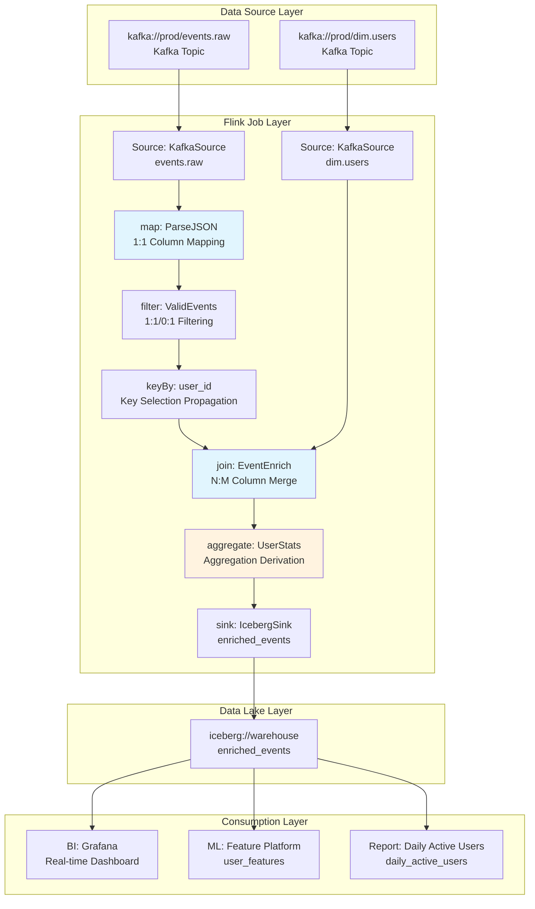

# Stream Processing Operator Data Lineage and Impact Analysis

> Stage: Knowledge | Prerequisites: [Flink DataStream API](../Flink/03-api/README.md), [Flink SQL Parsing Principles](../Flink/02-core/flink-state-management-complete-guide.md) | Formalization Level: L4
>
> **Status**: Production Ready | **Risk Level**: Medium | **Last Updated**: 2026-04

## Table of Contents

- [Stream Processing Operator Data Lineage and Impact Analysis](#stream-processing-operator-data-lineage-and-impact-analysis)
  - [Table of Contents](#table-of-contents)
  - [1. Definitions](#1-definitions)
  - [2. Properties](#2-properties)
  - [3. Relations](#3-relations)
    - [3.1 Mapping Between Flink Native Lineage and OpenLineage](#31-mapping-between-flink-native-lineage-and-openlineage)
    - [3.2 Integration Matrix: Lineage Collection Layer and Metadata Platforms](#32-integration-matrix-lineage-collection-layer-and-metadata-platforms)
    - [3.3 Correspondence Between Lineage Granularity and Applicable Scenarios](#33-correspondence-between-lineage-granularity-and-applicable-scenarios)
  - [4. Argumentation](#4-argumentation)
    - [4.1 Why Column-Level Lineage Is a Hard Requirement for Stream Processing](#41-why-column-level-lineage-is-a-hard-requirement-for-stream-processing)
    - [4.2 Boundaries and Limitations of Calcite RelNode Traversal](#42-boundaries-and-limitations-of-calcite-relnode-traversal)
    - [4.3 Technical Challenges of DataStream API Lineage](#43-technical-challenges-of-datastream-api-lineage)
  - [5. Proof / Engineering Argument](#5-proof--engineering-argument)
    - [5.1 Operator-Level Lineage Propagation Rules](#51-operator-level-lineage-propagation-rules)
    - [5.2 Flink SQL Parser Interception: Based on Calcite RelNode Traversal](#52-flink-sql-parser-interception-based-on-calcite-relnode-traversal)
    - [5.3 DataStream API Runtime Lineage: Based on Transformation Topology Traversal](#53-datastream-api-runtime-lineage-based-on-transformation-topology-traversal)
    - [5.4 OpenLineage Integration Solution](#54-openlineage-integration-solution)
  - [6. Examples](#6-examples)
    - [6.1 Flink SQL Column-Level Lineage Extraction Example](#61-flink-sql-column-level-lineage-extraction-example)
    - [6.2 DataStream API Lineage Configuration (FLIP-314)](#62-datastream-api-lineage-configuration-flip-314)
    - [6.3 OpenLineage Event Manual Emission Example](#63-openlineage-event-manual-emission-example)
    - [6.4 Upstream Schema Change Impact Analysis Example](#64-upstream-schema-change-impact-analysis-example)
  - [7. Visualizations](#7-visualizations)
    - [7.1 Typical Pipeline Lineage DAG](#71-typical-pipeline-lineage-dag)
    - [7.2 Column-Level Impact Analysis Diagram](#72-column-level-impact-analysis-diagram)
    - [7.3 Data Quality Anomaly Traceback Path Diagram](#73-data-quality-anomaly-traceback-path-diagram)
  - [8. References](#8-references)

## 1. Definitions

Data Lineage (数据血缘) is the core infrastructure of data governance; it precisely characterizes the hierarchical, traceable relationships formed during data production, processing, circulation, and ultimate consumption. In stream processing systems, lineage analysis must simultaneously address challenges brought by high throughput, low latency, and continuous operation.

**Def-LIN-01-01 (Data Lineage / 数据血缘)**
Given a stream processing system $\mathcal{S}$, a dataset collection $\mathcal{D}$, and an operator collection $\mathcal{O}$, data lineage is a labeled directed graph $G = (V, E, \lambda)$, where:

- The vertex set $V = \mathcal{D} \cup \mathcal{O}$ represents datasets and operators;
- The edge set $E \subseteq V \times V$ represents data flow relationships;
- The label function $\lambda: E \to \mathcal{T}$ maps each edge to a transformation type $\mathcal{T} = \{\text{map}, \text{filter}, \text{join}, \text{aggregate}, \text{union}, \dots\}$.

Data lineage can be divided into three granularity levels:

**Def-LIN-01-02 (Table-Level Lineage / 表级血缘)**
Table-level lineage is the projection of the lineage graph $G$ onto dataset vertices $G_{table} = (\mathcal{D}, E_{\mathcal{D}}, \lambda_{\mathcal{D}})$, where $E_{\mathcal{D}} \subseteq \mathcal{D} \times \mathcal{D}$ represents direct dependency relationships between datasets. Table-level lineage answers the question "which table flows to which table" and is the coarsest granularity of lineage representation.

**Def-LIN-01-03 (Column-Level Lineage / 字段级血缘)**
Let the schema of dataset $d \in \mathcal{D}$ be $\text{Schema}(d) = \{c_1, c_2, \dots, c_n\}$. Column-level lineage is a further decomposition of each edge $e = (d_s, d_t) \in E_{\mathcal{D}}$ on top of table-level lineage, defining column mapping relationships:
$$\text{ColMap}(e) \subseteq \text{Schema}(d_s) \times \text{Schema}(d_t) \times \mathcal{F}$$
where $\mathcal{F}$ is the set of transformation expressions. Column-level lineage precisely traces the transformation path of individual columns from source to target and is the "gold standard" for compliance auditing and root-cause analysis.

**Def-LIN-01-04 (Operator-Level Lineage / 算子级血缘)**
Operator-level lineage is the expanded representation of the lineage graph on operator vertices $G_{op} = (\mathcal{D} \cup \mathcal{O}, E_{op}, \lambda_{op})$, where each operator $o \in \mathcal{O}$ explicitly appears in the graph, and edges $E_{op}$ describe input/output relationships between datasets and operators. Operator-level lineage reveals the hop-by-hop processing of data inside a pipeline.

**Def-LIN-01-05 (End-to-End Lineage / 端到端血缘)**
End-to-end lineage is a lineage graph $G_{e2e} = (V_{e2e}, E_{e2e})$ that spans multiple system boundaries, where $V_{e2e}$ contains cross-system datasets (e.g., Kafka Topic, Flink job, Iceberg table, BI report), and $E_{e2e}$ connects heterogeneous system lineage fragments through unified namespaces and identification strategies. The OpenLineage standard provides the interoperability foundation for such cross-platform lineage.

**Def-LIN-01-06 (Lineage Propagation Function / 血缘传播函数)**
For an operator $o \in \mathcal{O}$, define its lineage propagation function $\text{Prop}_o: 2^{\text{Schema}(in)} \to 2^{\text{Schema}(out)}$, which describes the mapping rules from the input column set to the output column set. Different operator types have different propagation function semantics.

## 2. Properties

**Lemma-LIN-01-01 (DAG Property of Lineage Graph / 血缘图的DAG性质)**
The lineage graph $G$ of a stream processing pipeline is a directed acyclic graph (DAG).

*Derivation*: In a stream processing system, data flows from Source to Sink; each operator produces a new DataStream, and there is no semantics of data flowing backward (unless iteration is explicitly introduced, but iteration is isolated by special operator boundaries in Flink). Therefore, there is no directed path in $G$ that starts from any vertex and returns to itself; i.e., $G$ is a DAG. $\square$

**Lemma-LIN-01-02 (Transitive Closure of Column-Level Lineage / 字段级血缘的传递闭包)**
If column $c_s$ propagates through an operator chain $o_1 \to o_2 \to \dots \to o_k$ to column $c_t$, then there exists a column-level lineage path $(c_s, c_1, f_1), (c_1, c_2, f_2), \dots, (c_{k-1}, c_t, f_k)$, where $c_i$ are intermediate columns and $f_i$ are local transformations.

*Derivation*: By the definition of operator-level lineage, each operator $o_i$ defines a local column mapping $\text{ColMap}_i$. The end-to-end mapping can be constructed through relational composition $\text{ColMap}_1 \circ \text{ColMap}_2 \circ \dots \circ \text{ColMap}_k$. Since $G$ is a DAG (Lemma-LIN-01-01), the composition is finite and well-defined. $\square$

**Lemma-LIN-01-03 (Lineage Monotonicity of the filter Operator / filter算子的血缘单调性)**
Let the predicate of a filter operator $o_{filter}$ be $p: \text{Record} \to \{\text{true}, \text{false}\}$; then its output schema is a subset of the input schema (columns unchanged), and the output record set is a subset of the input record set: $\text{Schema}(out) = \text{Schema}(in)$ and $|out| \leq |in|$.

*Derivation*: A filter operator does not modify the record structure; it only decides whether to retain a record based on predicate $p$. Therefore, each output column precisely corresponds to an input column with the same name; there is no column addition, deletion, or renaming. $\square$

**Prop-LIN-01-01 (Irreversibility of aggregate Operator Lineage / aggregate算子的血缘不可逆性)**
An aggregate operator $o_{agg}$ aggregates multiple input rows into a single or fewer output rows; its column-level lineage involves information loss: given an output column $c_{out}$, one can trace back to the aggregation key and aggregation value columns through lineage; but given an input column $c_{in}$, it is impossible to determine exactly which output rows it affects (it is only known to affect the aggregation group containing that key).

*Explanation*: This irreversibility makes data quality anomalies downstream of aggregate operators difficult to precisely trace back to individual input records, which is an inherent challenge of stream processing lineage analysis.

## 3. Relations

### 3.1 Mapping Between Flink Native Lineage and OpenLineage

The Flink community introduced the native lineage API through [FLIP-314](https://cwiki.apache.org/confluence/display/FLINK/FLIP-314%3A+Lineage+Graph+API); its core interfaces are highly aligned with the OpenLineage standard model:

| Flink Native Concept | OpenLineage Concept | Semantic Description |
|----------------------|---------------------|----------------------|
| `LineageVertex` | Job / Dataset | Nodes in the lineage graph; Source/Sink implements `LineageVertexProvider` |
| `LineageEdge` | Input/output relationship of Run | Data flow edges connecting Source and Sink |
| `LineageDataset` | Dataset | Dataset metadata, including namespace, name, schema facets |
| `LineageGraph` | Lineage Graph | Complete lineage graph exposed in `JobCreatedEvent` |
| Facets (custom) | Facets (standard + custom) | Extended metadata, such as schema, data quality, ownership |

### 3.2 Integration Matrix: Lineage Collection Layer and Metadata Platforms

| Collection Technology | DataHub | Apache Atlas | Marquez | Supported Granularity |
|-----------------------|---------|--------------|---------|-----------------------|
| Flink SQL Parser (Calcite) | ✅ Column-level | ⚠️ Table-level | ✅ Column-level | Column-level |
| Flink DataStream API | ✅ Operator-level | ⚠️ Job-level | ✅ Operator-level | Operator-level |
| OpenLineage Listener | ✅ Native integration | ❌ Bridge required | ✅ Reference implementation | Table/Column-level |
| DataHub Flink Ingestion | ✅ Auto extraction | — | — | Operator/Table-level |

### 3.3 Correspondence Between Lineage Granularity and Applicable Scenarios

```
┌─────────────────────────────────────────────────────────────┐
│                 Lineage Granularity Spectrum                │
├─────────────┬─────────────┬─────────────┬─────────────────┤
│  System     │  Table      │  Operator   │   Column        │
│  (System)   │  (Table)    │  (Operator) │   (Column)      │
├─────────────┼─────────────┼─────────────┼─────────────────┤
│ Architecture│ Data        │ Debug       │ Compliance      │
│ view        │ dependency  │ tracing     │ auditing        │
│ Cost        │ Impact      │ Performance │ Root cause      │
│ estimation  │ analysis    │ tuning      │ localization    │
│ Asset       │ Scheduling  │ Change      │ Schema change   │
│ inventory   │ orchestration│ evaluation │ impact          │
└─────────────┴─────────────┴─────────────┴─────────────────┘
```

## 4. Argumentation

### 4.1 Why Column-Level Lineage Is a Hard Requirement for Stream Processing

In batch processing systems, lineage can be reconstructed after job completion by querying logs. However, in stream processing systems, jobs run continuously, and data flows through operators as unbounded streams; traditional "post-hoc analysis" methods face the following challenges:

1. **Real-time requirements**: Data quality issues in stream processing need to be localized within minutes or even seconds; it is impossible to wait for the job to finish before analyzing logs.
2. **Stateful operator complexity**: Operators such as KeyedProcessFunction and WindowOperator maintain internal state; column modifications may affect state compatibility, and lineage must cover state columns.
3. **Dynamic tables and continuous SQL**: Flink SQL's `INSERT INTO ... SELECT ...` statements define continuously running queries; column mapping relationships are determined at compile time, providing the possibility for static lineage extraction.

### 4.2 Boundaries and Limitations of Calcite RelNode Traversal

Although column-level lineage extraction based on Calcite `RelMetadataQuery.getColumnOrigins()` is mature, it has the following boundary conditions:

- **UDF black-box problem**: The internal logic of user-defined functions (UDF/UDTF) is invisible to Calcite; lineage can only be marked as "UDF transformation" and cannot expand internal column mappings.
- **Dynamic SQL limitations**: SQL where table or column names are dynamically generated at runtime (e.g., through variable concatenation) cannot be parsed at compile time.
- **SELECT * expansion**: `SELECT *` needs to be expanded into explicit column references through schema; if the schema changes at runtime, static lineage may become invalid.
- **Non-deterministic operators**: Columns generated by functions such as `RAND()`, `UUID()` have no upstream lineage source points and need to be marked as "virtual source".

### 4.3 Technical Challenges of DataStream API Lineage

Unlike SQL, the DataStream API uses general-purpose programming languages (Java/Scala/Python) to express transformation logic; after compilation to bytecode, high-level semantic information is lost:

- **Anonymous function decompilation**: The column mapping in `map(r -> new Result(r.field1, r.field2 * 2))` requires bytecode analysis or source AST parsing to extract.
- **Operator Chaining optimization**: Flink merges multiple operators into an OperatorChain when generating the JobGraph; intermediate data transfers are optimized away, and lineage edges may be hidden.
- **Side Output**: An operator may produce multiple output streams; each side output stream has an independent schema and lineage path.

## 5. Proof / Engineering Argument

### 5.1 Operator-Level Lineage Propagation Rules

**Thm-LIN-01-01 (Completeness of Operator Lineage Propagation / 算子血缘传播完备性)**
For the standard operator set of the Flink DataStream API, the column-level lineage propagation function $\text{Prop}_o$ can be completely defined by operator type:

| Operator Type | Propagation Pattern | Mathematical Description | Lineage Semantics |
|---------------|---------------------|--------------------------|-------------------|
| **map** | 1:1 column mapping | $\forall c_{out} \in \text{Schema}(out), \exists! c_{in} \in \text{Schema}(in): c_{out} = f(c_{in})$ | Each output column is derived from a single input column through transformation $f$ |
| **filter** | 1:1 or 0:1 | $\text{Schema}(out) = \text{Schema}(in)$, $\text{Prop}_{filter}(C) = C$ | Columns unchanged; records may be filtered (0 or 1 output per input) |
| **flatMap** | 1:N column mapping | $\forall c_{out} \in \text{Schema}(out), \exists c_{in} \in \text{Schema}(in): c_{out} = f(c_{in})$ | A single input can produce multiple outputs; column mapping is preserved |
| **keyBy** | Key selection propagation | $\text{Prop}_{keyBy}(C) = C$, marking $K \subseteq C$ as partition key | Data is repartitioned by key; schema unchanged; lineage attaches upstream/downstream partition properties |
| **join** | N:M column merge | $\text{Schema}(out) = \text{Schema}(left) \cup \text{Schema}(right) \cup \{join\_key\}$ | Output columns come from left/right input tables; join condition columns have shared lineage |
| **aggregate** | Aggregation derivation | $\forall c_{out} \in \text{Schema}(out), c_{out} = \text{agg}(\{c_{in}\}_{group})$ | Output columns are derived from input columns of multiple records within the aggregation group |
| **union** | Multi-source merge | $\text{Schema}(out) = \text{Schema}(in_1) = \dots = \text{Schema}(in_n)$ | Same-schema multi-source merge; each output record is precisely traceable to a specific input source |

*Proof*:

- **map/filter/flatMap**: Defined by Flink's `MapFunction`/`FilterFunction`/`FlatMapFunction` interfaces; each input element independently produces output elements, and there is no cross-record dependency. Column mapping is determined by the function body and can be extracted through source or bytecode analysis.
- **keyBy**: `KeySelector` extracts the key value from the input record, but the record itself is completely passed downstream; schema unchanged. Partition properties are attached as metadata to the lineage edge.
- **join**: `JoinFunction` receives two input elements from left and right, producing one output element. The output schema is the union of the two input schemas (handling same-name column conflicts). Join condition columns appear in both left and right inputs, forming shared lineage nodes.
- **aggregate**: `AggregateFunction` accumulates multiple records within the same key group into a single result. The relationship between output columns and input columns is many-to-one and needs to be marked as "aggregation derivation".
- **union**: Flink requires all inputs of a union to have the same schema; output records precisely come from one of the input sources, distinguishable by data source markers. $\square$

### 5.2 Flink SQL Parser Interception: Based on Calcite RelNode Traversal

**Engineering Argument**: The core technical path of Flink SQL lineage extraction has been validated in the open-source project [flink-sql-lineage](https://github.com/HamaWhiteGG/flink-sql-lineage) and Flink's official FLIP-314. Its technical flow is as follows:

```
SQL Text
   ↓
Calcite SqlParser → SqlNode (AST)
   ↓
SqlValidator Semantic Validation + Catalog Metadata Resolution
   ↓
SqlToRelConverter → RelNode Tree (Logical Execution Plan)
   ↓
FlinkRelBuilder Optimization → Optimized RelNode Tree
   ↓
RelMetadataQuery.getColumnOrigins(rel, iColumn) → RelColumnOrigin[]
   ↓
Build Column-Level Lineage Graph
```

Key implementation points:

1. **RelColumnOrigin parsing**: `RelColumnOrigin` contains the source table (`RelOptTable`), source column index (`int originColumn`), and whether it is a derived column (`boolean isDerived`).
2. **Recursive traceback**: For nested subqueries, recursively call `getColumnOrigins()` until reaching leaf nodes (TableScan).
3. **Expression tracking**: Record transformation logic between columns through the `RexNode` expression tree, such as `CAST`, `UPPER`, `+`, `CONCAT`, etc.

### 5.3 DataStream API Runtime Lineage: Based on Transformation Topology Traversal

The Flink DataStream API builds the `StreamGraph` when `StreamExecutionEnvironment.execute()` is called; its topology information can be used to extract lineage in the following ways:

1. **Transformation list traversal**: `StreamExecutionEnvironment` maintains a `List<Transformation<?>>` list; each Transformation corresponds to an operator operation in user code.
2. **StreamGraph generation**: `StreamGraphGenerator` traverses the Transformation list, building `StreamNode` (operator) and `StreamEdge` (data flow edge).
3. **JobGraph conversion**: `StreamingJobGraphGenerator` applies operator chaining strategies, merging chainable operators into `JobVertex`.

Lineage extraction strategies:

- **Compile-time extraction**: Intercept after `StreamGraph` generation; traverse `StreamNode` and `StreamEdge`, recording operator name, type, parallelism, and input/output type information.
- **Connector metadata**: Source/Sink connectors implement `LineageVertexProvider` (FLIP-314), exposing dataset namespace, name, and schema facets.
- **Runtime enhancement**: Combine Flink Metrics (such as `numRecordsIn`, `numRecordsOut`) to attach operational metadata to lineage edges.

### 5.4 OpenLineage Integration Solution

OpenLineage, as an open standard for data lineage, defines the core event model:

**RunEvent Structure**:

```json
{
  "eventType": "START|COMPLETE|FAIL",
  "eventTime": "2026-04-30T09:00:00Z",
  "run": { "runId": "uuid" },
  "job": { "namespace": "prod.flink", "name": "order-enrichment" },
  "inputs": [{
    "namespace": "kafka://prod-cluster",
    "name": "orders-topic",
    "facets": { "schema": { "fields": [...] } }
  }],
  "outputs": [{
    "namespace": "iceberg://warehouse",
    "name": "orders.enriched",
    "facets": { "schema": { "fields": [...] }, "dataQuality": {...} }
  }]
}
```

Flink and OpenLineage integration patterns:

1. **FLIP-314 Native Listener Mode** (Recommended, Flink 2.0+):
   - Flink carries `LineageGraph` in `JobCreatedEvent`.
   - Third parties implement the `JobStatusListener` interface, converting `LineageGraph` into OpenLineage `RunEvent` and emitting it.
   - No need to modify job code; enable through configuration `execution.job-status-listeners`.

2. **OpenLineage Flink Agent Mode** (Flink 1.15-1.18):
   - Intercept Flink job submission at runtime through Java Agent bytecode enhancement.
   - Use reflection to extract private fields of Source/Sink to obtain dataset information.
   - Limitations: Does not support Flink SQL / Table API; high maintenance cost due to reflection dependency.

3. **Manual Annotation Mode**:
   - Declare input/output datasets in job configuration YAML.
   - Deployment scripts read the configuration and emit OpenLineage events.
   - Suitable for scenarios where lineage requirements are not strict or manual review is needed.

## 6. Examples

### 6.1 Flink SQL Column-Level Lineage Extraction Example

```java
// Extract column-level lineage using Flink SQL Lineage library
LineageService lineageService = new LineageServiceImpl();

String sql = "INSERT INTO sink_table " +
    "SELECT a.user_id, " +
    "       UPPER(a.user_name) AS user_name_upper, " +
    "       b.order_amount * 0.85 AS discounted_amount, " +
    "       a.region " +
    "FROM source_users a " +
    "JOIN source_orders b ON a.user_id = b.user_id " +
    "WHERE b.order_status = 'PAID'";

// Parse and obtain lineage
List<LineageResult> results = lineageService.analyzeLineage(sql);

// Sample output:
// sink_table.user_id         ← source_users.user_id         (direct mapping)
// sink_table.user_name_upper ← source_users.user_name       (UPPER transformation)
// sink_table.discounted_amount ← source_orders.order_amount  (* 0.85 transformation)
// sink_table.region          ← source_users.region          (direct mapping)
```

### 6.2 DataStream API Lineage Configuration (FLIP-314)

```java
// Custom Source implementing LineageVertexProvider
public class KafkaLineageSource implements SourceFunction<Event>,
        LineageVertexProvider {

    @Override
    public LineageVertex getLineageVertex() {
        return DefaultLineageVertex.builder()
            .addDataset(DefaultLineageDataset.builder()
                .namespace("kafka://prod-cluster")
                .name("events.raw")
                .facet("schema", SchemaFacet.builder()
                    .field("event_id", "STRING")
                    .field("payload", "JSON")
                    .field("ts", "TIMESTAMP")
                    .build())
                .build())
            .build();
    }
}

// Enable OpenLineage JobStatusListener
Configuration config = new Configuration();
config.setString("execution.job-status-listeners",
    "org.openlineage.flink.OpenLineageJobStatusListener");
config.setString("openlineage.transport.type", "http");
config.setString("openlineage.transport.url", "http://marquez:5000");
```

### 6.3 OpenLineage Event Manual Emission Example

```java
OpenLineageClient client = OpenLineageClient.builder()
    .transport(new HttpTransport("http://marquez:5000"))
    .build();

RunEvent event = RunEvent.builder()
    .eventType(RunState.START)
    .run(new Run(UUID.randomUUID().toString()))
    .job(new Job("prod.flink", "fraud-detection-job"))
    .inputs(Collections.singletonList(
        InputDataset.builder()
            .namespace("kafka://prod-cluster")
            .name("transactions")
            .facets(buildSchemaFacet("transaction_id", "amount", "timestamp"))
            .build()))
    .outputs(Collections.singletonList(
        OutputDataset.builder()
            .namespace("kafka://prod-cluster")
            .name("flagged-transactions")
            .facets(buildSchemaFacet("transaction_id", "risk_score"))
            .build()))
    .build();

client.emit(event);
```

### 6.4 Upstream Schema Change Impact Analysis Example

**Scenario**: The `user_id` field in the upstream Kafka Topic `user_events` is changed from `INT` to `STRING`.

**Impact Analysis Steps**:

1. Locate the `user_events.user_id` field node in the lineage graph.
2. Perform downstream BFS traversal to collect all downstream nodes that depend on this field.
3. Identify key impact points:
   - Flink job `user-profile-enrichment`: join condition field type changes; KeySelector needs to be modified.
   - Iceberg table `user_profiles`: `user_id` column type needs to be synchronously changed.
   - BI report `daily-active-users`: aggregation logic based on `user_id` may be affected.

## 7. Visualizations

### 7.1 Typical Pipeline Lineage DAG

The diagram below shows the end-to-end lineage of an e-commerce real-time analytics pipeline, covering Kafka Source, Flink operator processing, Iceberg Sink, and downstream BI report consumption.



### 7.2 Column-Level Impact Analysis Diagram

The diagram below takes `source_orders.order_amount` as the starting point, showing the downstream impact scope of a schema change (impact radius = 2).

```mermaid
graph LR
    subgraph Upstream
        A[source_orders<br/>.order_amount DECIMAL]
    end

    subgraph Impact Radius = 1
        B1[flink-job: order-enrich<br/>.discounted_amount = order_amount * 0.85]
        B2[flink-job: order-stats<br/>.total_amount = SUM(order_amount)]
    end

    subgraph Impact Radius = 2
        C1[iceberg://warehouse<br/>enriched_orders.discounted_amount]
        C2[iceberg://warehouse<br/>hourly_stats.total_amount]
        C3[BI Dashboard: Revenue Overview<br/>Metric: Discounted Revenue]
        C4[ML Feature: user_ltv<br/>Feature: Historical Consumption Total]
    end

    subgraph Impact Radius = 3
        D1[Alert Rule: Revenue Fluctuation > 5%<br/>May Trigger False Positives]
        D2[Marketing System: Coupon Distribution<br/>Depends on user_ltv Feature]
    end

    A --> B1 --> C1 --> C3 --> D1
    A --> B2 --> C2 --> C4 --> D2

    style A fill:#ffebee,stroke:#c62828,stroke-width:2px
    style B1 fill:#fff3e0
    style B2 fill:#fff3e0
    style D1 fill:#ffebee
    style D2 fill:#ffebee
```

### 7.3 Data Quality Anomaly Traceback Path Diagram

The diagram below shows a complete traceback path for a data quality anomaly (sudden drop in downstream metrics), tracing from the BI report back to the root-cause Source.

```mermaid
flowchart TD
    Start[Downstream Anomaly Detection:<br/>BI Report "Daily Active Users" Metric Drops 40%] --> Q1{Check Recent Changes?}

    Q1 -->|No BI Layer Changes| Q2{Check Upstream Data?}
    Q1 -->|Has Changes| X1[Rollback BI Configuration]

    Q2 -->|Iceberg Table Data Normal| Q3{Check Flink Job?}
    Q2 -->|Iceberg Data Abnormal| P1[Traceback to Flink Job Output]

    Q3 -->|Job Running Normally| Q4{Check Source Topic?}
    Q3 -->|Job Failed/Delayed| X2[Restart Job / Scale Up]

    Q4 -->|Kafka Topic Data Normal| Q5{Check Column-Level Lineage}
    Q4 -->|Topic Data Drops Sharply| X3[Locate Upstream Producer Change]

    Q5 -->|filter Operator Condition Changed| P2[Root Cause: filter Predicate<br/>Changed from status='active'<br/>Mistakenly to status='ACTIVE'<br/>Case-Sensitive Causing Over-Filtering]
    Q5 -->|join Condition Changed| P3[Root Cause: join Key Type Change]

    P2 --> Fix[Fix Predicate Case:<br/>LOWER(status)='active']
    P3 --> Fix2[Fix join Key Type Consistency]

    style Start fill:#ffebee
    style P2 fill:#c8e6c9,stroke:#2e7d32,stroke-width:2px
    style P3 fill:#c8e6c9,stroke:#2e7d32,stroke-width:2px
```

## 8. References
