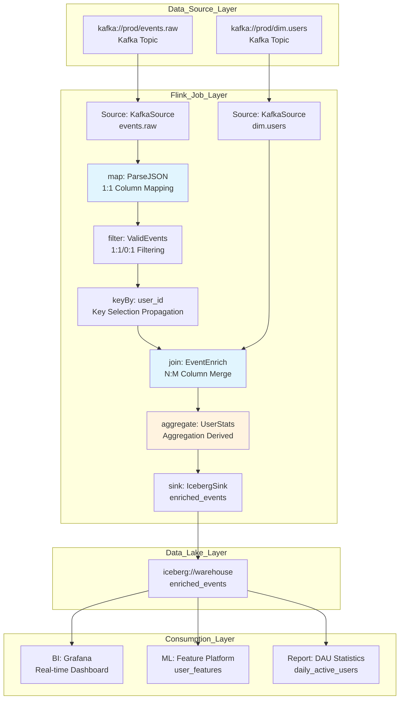

# Stream Processing Operator Data Lineage and Impact Analysis

> Stage: Knowledge | Prerequisites: [Flink DataStream API](../Flink/03-api/README.md), [Flink SQL Parsing Principles](../Flink/02-core/flink-state-management-complete-guide.md) | Formalization Level: L4
>
> **Status**: Production Ready | **Risk Level**: Medium | **Last Updated**: 2026-04

## Table of Contents

- [Stream Processing Operator Data Lineage and Impact Analysis](#stream-processing-operator-data-lineage-and-impact-analysis)
  - [Table of Contents](#table-of-contents)
  - [1. Definitions](#1-definitions)
  - [2. Properties](#2-properties)
  - [3. Relations](#3-relations)
    - [3.1 Mapping Between Flink Native Lineage and OpenLineage](#31-mapping-between-flink-native-lineage-and-openlineage)
    - [3.2 Integration Matrix Between Lineage Collection Layer and Metadata Platforms](#32-integration-matrix-between-lineage-collection-layer-and-metadata-platforms)
    - [3.3 Correspondence Between Lineage Granularity and Applicable Scenarios](#33-correspondence-between-lineage-granularity-and-applicable-scenarios)
  - [4. Argumentation](#4-argumentation)
    - [4.1 Why Column-Level Lineage Is a Hard Requirement for Stream Processing](#41-why-column-level-lineage-is-a-hard-requirement-for-stream-processing)
    - [4.2 Boundaries and Limitations of Calcite RelNode Traversal](#42-boundaries-and-limitations-of-calcite-relnode-traversal)
    - [4.3 Technical Difficulties of DataStream API Lineage](#43-technical-difficulties-of-datastream-api-lineage)
  - [5. Proof / Engineering Argument](#5-proof--engineering-argument)
    - [5.1 Operator-Level Lineage Propagation Rules](#51-operator-level-lineage-propagation-rules)
    - [5.2 Flink SQL Parser Interception: Based on Calcite RelNode Traversal](#52-flink-sql-parser-interception-based-on-calcite-relnode-traversal)
    - [5.3 DataStream API Runtime Lineage: Based on Transformation Topology Traversal](#53-datastream-api-runtime-lineage-based-on-transformation-topology-traversal)
    - [5.4 OpenLineage Integration Scheme](#54-openlineage-integration-scheme)
  - [6. Examples](#6-examples)
    - [6.1 Flink SQL Column-Level Lineage Extraction Example](#61-flink-sql-column-level-lineage-extraction-example)
    - [6.2 DataStream API Lineage Configuration (FLIP-314)](#62-datastream-api-lineage-configuration-flip-314)
    - [6.3 OpenLineage Event Manual Emission Example](#63-openlineage-event-manual-emission-example)
    - [6.4 Upstream Schema Change Impact Analysis Example](#64-upstream-schema-change-impact-analysis-example)
  - [7. Visualizations](#7-visualizations)
    - [7.1 Typical Pipeline Lineage DAG](#71-typical-pipeline-lineage-dag)
    - [7.2 Column-Level Impact Analysis Diagram](#72-column-level-impact-analysis-diagram)
    - [7.3 Data Quality Anomaly Traceability Path Diagram](#73-data-quality-anomaly-traceability-path-diagram)
  - [8. References](#8-references)

## 1. Definitions

Data Lineage (数据血缘) is the core infrastructure of data governance. It precisely characterizes the hierarchical and traceable relationships formed during data production, processing, circulation, and final consumption. In stream processing systems, lineage analysis must simultaneously address challenges brought by high throughput, low latency, and continuous operation.

**Def-LIN-01-01 (Data Lineage)**
Given a stream processing system $\mathcal{S}$, a dataset collection $\mathcal{D}$, and an operator collection $\mathcal{O}$, data lineage is a labeled directed graph $G = (V, E, \lambda)$, where:

- Vertex set $V = \mathcal{D} \cup \mathcal{O}$, representing datasets and operators;
- Edge set $E \subseteq V \times V$, representing data flow relationships;
- Label function $\lambda: E \to \mathcal{T}$, mapping each edge to a transformation type $\mathcal{T} = \{\text{map}, \text{filter}, \text{join}, \text{aggregate}, \text{union}, \dots\}$.

Data lineage can be divided into three granularity levels:

**Def-LIN-01-02 (Table-Level Lineage / 表级血缘)**
Table-Level Lineage is the projection of the lineage graph $G$ onto dataset vertices $G_{table} = (\mathcal{D}, E_{\mathcal{D}}, \lambda_{\mathcal{D}})$, where $E_{\mathcal{D}} \subseteq \mathcal{D} \times \mathcal{D}$ represents direct dependency relationships between datasets. Table-Level Lineage answers the question "which table flows to which table" and is the coarsest granularity of lineage representation.

**Def-LIN-01-03 (Column-Level Lineage / 字段级血缘)**
Let the schema of dataset $d \in \mathcal{D}$ be $\text{Schema}(d) = \{c_1, c_2, \dots, c_n\}$. Column-Level Lineage is a further decomposition of each edge $e = (d_s, d_t) \in E_{\mathcal{D}}$ on top of Table-Level Lineage, defining column mapping relationships:
$$\text{ColMap}(e) \subseteq \text{Schema}(d_s) \times \text{Schema}(d_t) \times \mathcal{F}$$
where $\mathcal{F}$ is the set of transformation expressions. Column-Level Lineage precisely traces the transformation path of individual columns from source to target, serving as the "gold standard" for compliance auditing and root cause analysis.

**Def-LIN-01-04 (Operator-Level Lineage / 算子级血缘)**
Operator-Level Lineage is the expanded representation of the lineage graph on operator vertices $G_{op} = (\mathcal{D} \cup \mathcal{O}, E_{op}, \lambda_{op})$, where each operator $o \in \mathcal{O}$ explicitly appears in the graph, and edges $E_{op}$ describe input/output relationships between datasets and operators. Operator-Level Lineage reveals the hop-by-hop processing inside the pipeline.

**Def-LIN-01-05 (End-to-End Lineage / 端到端血缘)**
End-to-End Lineage is a lineage graph spanning multiple system boundaries $G_{e2e} = (V_{e2e}, E_{e2e})$, where $V_{e2e}$ contains cross-system datasets (e.g., Kafka Topic, Flink Job, Iceberg Table, BI Report), and $E_{e2e}$ connects heterogeneous lineage fragments through unified namespaces and identification strategies. The OpenLineage standard provides the interoperability foundation for such cross-platform lineage.

**Def-LIN-01-06 (Lineage Propagation Function / 血缘传播函数)**
For an operator $o \in \mathcal{O}$, define its lineage propagation function $\text{Prop}_o: 2^{\text{Schema}(in)} \to 2^{\text{Schema}(out)}$, describing the mapping rules from the input column set to the output column set. Different operator types have different propagation function semantics.

## 2. Properties

**Lemma-LIN-01-01 (DAG Property of Lineage Graph)**
The lineage graph $G$ of a stream processing pipeline is a Directed Acyclic Graph (DAG).

*Derivation*: In a stream processing system, data flows from Source to Sink. Each operator produces a new DataStream, and there is no semantic data backflow (unless iteration is explicitly introduced, but iteration is isolated by special operator boundaries in Flink). Therefore, there is no directed path in $G$ that starts from any vertex and returns to itself, i.e., $G$ is a DAG. $\square$

**Lemma-LIN-01-02 (Transitive Closure of Column-Level Lineage)**
If column $c_s$ propagates through operator chain $o_1 \to o_2 \to \dots \to o_k$ to column $c_t$, then there exists a column-level lineage path $(c_s, c_1, f_1), (c_1, c_2, f_2), \dots, (c_{k-1}, c_t, f_k)$, where $c_i$ are intermediate columns and $f_i$ are local transformations.

*Derivation*: By the definition of Operator-Level Lineage, each operator $o_i$ defines a local column mapping $\text{ColMap}_i$. Through relational composition $\text{ColMap}_1 \circ \text{ColMap}_2 \circ \dots \circ \text{ColMap}_k$, an end-to-end mapping can be constructed. Since $G$ is a DAG (Lemma-LIN-01-01), the composition is finite and well-defined. $\square$

**Lemma-LIN-01-03 (Monotonicity of filter Operator Lineage)**
Let the predicate of filter operator $o_{filter}$ be $p: \text{Record} \to \{\text{true}, \text{false}\}$. Then its output schema is a subset of the input schema (columns unchanged), and the output record set is a subset of the input record set: $\text{Schema}(out) = \text{Schema}(in)$ and $|out| \leq |in|$.

*Derivation*: The filter operator does not modify record structure; it only decides whether to retain records based on predicate $p$. Therefore, each output column precisely corresponds to an input column with the same name, with no column addition, deletion, or renaming. $\square$

**Prop-LIN-01-01 (Irreversibility of aggregate Operator Lineage)**
The aggregate operator $o_{agg}$ aggregates multiple input rows into single or fewer output rows. Its Column-Level Lineage exhibits information loss: given an output column $c_{out}$, one can trace back to the aggregation key and aggregation value columns through lineage; but given an input column $c_{in}$, it is impossible to determine precisely which output rows it affects (only known that it affects the aggregation group containing that key).

*Note*: This irreversibility makes data quality anomalies downstream of aggregate operators difficult to precisely trace back to individual input records, representing an inherent challenge in stream processing lineage analysis.

## 3. Relations

### 3.1 Mapping Between Flink Native Lineage and OpenLineage

The Flink community introduced the native Lineage API through [FLIP-314](https://cwiki.apache.org/confluence/display/FLINK/FLIP-314%3A+Lineage+Graph+API). Its core interfaces are highly aligned with the OpenLineage standard model:

| Flink Native Concept | OpenLineage Concept | Semantic Description |
|---------------------|---------------------|----------------------|
| `LineageVertex` | Job / Dataset | Nodes in the lineage graph; Source/Sink implements `LineageVertexProvider` |
| `LineageEdge` | Input/Output relationship of Run | Data flow edges connecting Source and Sink |
| `LineageDataset` | Dataset | Dataset metadata, including namespace, name, and schema facets |
| `LineageGraph` | Lineage Graph | Complete lineage graph, exposed in `JobCreatedEvent` |
| Facets (custom) | Facets (standard + custom) | Extended metadata, such as schema, data quality, ownership |

### 3.2 Integration Matrix Between Lineage Collection Layer and Metadata Platforms

| Collection Technology | DataHub | Apache Atlas | Marquez | Supported Granularity |
|----------------------|---------|-------------|---------|----------------------|
| Flink SQL Parser (Calcite) | ✅ Column-level | ⚠️ Table-level | ✅ Column-level | Column-level |
| Flink DataStream API | ✅ Operator-level | ⚠️ Job-level | ✅ Operator-level | Operator-level |
| OpenLineage Listener | ✅ Native integration | ❌ Requires bridge | ✅ Reference implementation | Table/Column-level |
| DataHub Flink Ingestion | ✅ Automatic extraction | — | — | Operator/Table-level |

### 3.3 Correspondence Between Lineage Granularity and Applicable Scenarios

```
┌────────────────────────────────────────────────────────────────┐
│                 Lineage Granularity Spectrum                   │
├──────────────┬──────────────┬──────────────┬──────────────────┤
│    System    │    Table     │   Operator   │     Column       │
│   (System)   │   (Table)    │  (Operator)  │    (Column)      │
├──────────────┼──────────────┼──────────────┼──────────────────┤
│ Architecture │  Data        │   Debug      │   Compliance     │
│    View      │ Dependency   │   Tracing    │   Auditing       │
│ Cost         │   Impact     │ Performance  │   Root Cause     │
│ Estimation   │  Analysis    │ Optimization │  Localization    │
│ Asset        │ Scheduling   │   Change     │   Schema Change  │
│ Inventory    │Orchestration │ Assessment   │                  │
└──────────────┴──────────────┴──────────────┴──────────────────┘
```

## 4. Argumentation

### 4.1 Why Column-Level Lineage Is a Hard Requirement for Stream Processing

In batch processing systems, lineage can be reconstructed after job completion by querying logs. However, in stream processing systems, jobs run continuously, and data passes through operators in the form of unbounded streams. Traditional "post-hoc analysis" methods face the following challenges:

1. **Real-time Requirements**: Data quality issues in stream processing need to be located within minutes or even seconds; it is impossible to wait for job completion before analyzing logs.
2. **Stateful Operator Complexity**: Operators such as KeyedProcessFunction and WindowOperator maintain internal state. Column modifications may affect state compatibility, so lineage must cover state columns.
3. **Dynamic Tables and Continuous SQL**: Flink SQL's `INSERT INTO ... SELECT ...` statements define continuously running queries, and column mapping relationships are determined at compile time, providing the possibility for static lineage extraction.

### 4.2 Boundaries and Limitations of Calcite RelNode Traversal

Although Column-Level Lineage extraction based on Calcite `RelMetadataQuery.getColumnOrigins()` is mature, it has the following boundary conditions:

- **UDF Black Box Problem**: The internal logic of User-Defined Functions (UDF/UDTF) is invisible to Calcite. Lineage can only be marked as "UDF transformation" and cannot expand internal column mappings.
- **Dynamic SQL Limitations**: SQL with table or column names dynamically generated at runtime (e.g., through variable concatenation) cannot be resolved at compile time.
- **SELECT * Expansion**: `SELECT *` needs to be expanded into explicit column references through schema. If the schema changes at runtime, static lineage may become invalid.
- **Non-deterministic Operators**: Columns generated by functions such as `RAND()` and `UUID()` have no upstream lineage source points and need to be marked as "virtual source".

### 4.3 Technical Difficulties of DataStream API Lineage

Unlike SQL, the DataStream API expresses transformation logic using general-purpose programming languages (Java/Scala/Python). After compilation to bytecode, high-level semantic information is lost:

- **Anonymous Function Decompilation**: Field mappings such as `map(r -> new Result(r.field1, r.field2 * 2))` require bytecode analysis or source code AST parsing to extract.
- **Operator Chaining Optimization**: When generating the JobGraph, Flink merges multiple operators into an OperatorChain, and intermediate data transfers are optimized away, potentially hiding lineage edges.
- **Side Output**: A single operator may produce multiple output streams, each side output stream having an independent schema and lineage path.

## 5. Proof / Engineering Argument

### 5.1 Operator-Level Lineage Propagation Rules

**Thm-LIN-01-01 (Completeness of Operator Lineage Propagation)**
For the standard operator set of the Flink DataStream API, the Column-Level Lineage propagation function $\text{Prop}_o$ can be completely defined by operator type:

| Operator Type | Propagation Mode | Mathematical Description | Lineage Semantics |
|--------------|------------------|-------------------------|-------------------|
| **map** | 1:1 Column Mapping | $\forall c_{out} \in \text{Schema}(out), \exists! c_{in} \in \text{Schema}(in): c_{out} = f(c_{in})$ | Each output column is derived from a single input column through transformation $f$ |
| **filter** | 1:1 or 0:1 | $\text{Schema}(out) = \text{Schema}(in)$, $\text{Prop}_{filter}(C) = C$ | Columns unchanged; records may be filtered (0 or 1 output per input) |
| **flatMap** | 1:N Column Mapping | $\forall c_{out} \in \text{Schema}(out), \exists c_{in} \in \text{Schema}(in): c_{out} = f(c_{in})$ | Single input can produce multiple outputs; column mapping preserved |
| **keyBy** | Key Selection Propagation | $\text{Prop}_{keyBy}(C) = C$, marking $K \subseteq C$ as partition key | Data repartitioned by key; schema unchanged; lineage annotated with upstream/downstream partition properties |
| **join** | N:M Column Merge | $\text{Schema}(out) = \text{Schema}(left) \cup \text{Schema}(right) \cup \{join\_key\}$ | Output columns from left/right input tables; join condition columns form shared lineage |
| **aggregate** | Aggregation Derivation | $\forall c_{out} \in \text{Schema}(out), c_{out} = \text{agg}(\{c_{in}\}_{group})$ | Output columns derived from input columns of multiple records within the aggregation group |
| **union** | Multi-source Merge | $\text{Schema}(out) = \text{Schema}(in_1) = \dots = \text{Schema}(in_n)$ | Multiple sources with same schema merged; each output record precisely traces to one input source |

*Proof*:

- **map/filter/flatMap**: Defined by Flink's `MapFunction`/`FilterFunction`/`FlatMapFunction` interfaces. Each input element independently produces output elements, with no cross-record dependencies. Column mappings are determined by the function body and can be extracted through source code or bytecode analysis.
- **keyBy**: `KeySelector` extracts key values from input records, but the records themselves are passed intact to downstream, with schema unchanged. Partition properties are attached as metadata to the lineage edge.
- **join**: `JoinFunction` receives left/right two input elements and produces one output element. The output schema is the union of the two input schemas (with same-name field conflicts handled). Join condition columns appear simultaneously in both left and right inputs, forming shared lineage nodes.
- **aggregate**: `AggregateFunction` accumulates multiple records within the same key group into a single result. The relationship between output columns and input columns is many-to-one and needs to be marked as "aggregation derived".
- **union**: Flink requires all inputs of a union to have the same schema. Output records precisely come from one of the input sources, distinguishable by data source markers. $\square$

### 5.2 Flink SQL Parser Interception: Based on Calcite RelNode Traversal

**Engineering Argument**: The core technical path for Flink SQL lineage extraction has been validated in the open-source project [flink-sql-lineage](https://github.com/HamaWhiteGG/flink-sql-lineage) and Flink's official FLIP-314. The technical workflow is as follows:

```
SQL Text
   ↓
Calcite SqlParser → SqlNode (AST)
   ↓
SqlValidator Semantic Validation + Catalog Metadata Resolution
   ↓
SqlToRelConverter → RelNode Tree (Logical Execution Plan)
   ↓
FlinkRelBuilder Optimization → Optimized RelNode Tree
   ↓
RelMetadataQuery.getColumnOrigins(rel, iColumn) → RelColumnOrigin[]
   ↓
Construct Column-Level Lineage Graph
```

Key implementation points:

1. **RelColumnOrigin Parsing**: `RelColumnOrigin` contains the source table (`RelOptTable`), source column index (`int originColumn`), and whether it is a derived column (`boolean isDerived`).
2. **Recursive Tracing**: For nested subqueries, recursively call `getColumnOrigins()` until reaching leaf nodes (TableScan).
3. **Expression Tracing**: Record transformation logic between columns through the `RexNode` expression tree, such as `CAST`, `UPPER`, `+`, `CONCAT`, etc.

### 5.3 DataStream API Runtime Lineage: Based on Transformation Topology Traversal

When the Flink DataStream API calls `StreamExecutionEnvironment.execute()`, it constructs the `StreamGraph`. Its topology information can be used to extract lineage through the following methods:

1. **Transformation List Traversal**: `StreamExecutionEnvironment` maintains a `List<Transformation<?>>` list, where each Transformation corresponds to an operator operation in user code.
2. **StreamGraph Generation**: `StreamGraphGenerator` traverses the Transformation list to build `StreamNode` (operators) and `StreamEdge` (data flow edges).
3. **JobGraph Conversion**: `StreamingJobGraphGenerator` applies the chaining strategy to merge chainable operators into `JobVertex`.

Lineage extraction strategies:

- **Compile-time Extraction**: Intercept after `StreamGraph` generation, traverse `StreamNode` and `StreamEdge`, recording operator name, type, parallelism, and input/output type information.
- **Connector Metadata**: Source/Sink connectors implement `LineageVertexProvider` (FLIP-314), exposing dataset namespace, name, and schema facets.
- **Runtime Enhancement**: Combine Flink Metrics (such as `numRecordsIn`, `numRecordsOut`) to attach operational metadata to lineage edges.

### 5.4 OpenLineage Integration Scheme

OpenLineage, as an open standard for data lineage, defines the core event model:

**RunEvent Structure**:

```json
{
  "eventType": "START|COMPLETE|FAIL",
  "eventTime": "2026-04-30T09:00:00Z",
  "run": { "runId": "uuid" },
  "job": { "namespace": "prod.flink", "name": "order-enrichment" },
  "inputs": [{
    "namespace": "kafka://prod-cluster",
    "name": "orders-topic",
    "facets": { "schema": { "fields": [...] } }
  }],
  "outputs": [{
    "namespace": "iceberg://warehouse",
    "name": "orders.enriched",
    "facets": { "schema": { "fields": [...] }, "dataQuality": {...} }
  }]
}
```

Flink and OpenLineage integration patterns:

1. **FLIP-314 Native Listener Mode** (Recommended, Flink 2.0+):
   - Flink carries `LineageGraph` in `JobCreatedEvent`.
   - Third-party implementations of the `JobStatusListener` interface convert `LineageGraph` to OpenLineage `RunEvent` and emit it.
   - No need to modify job code; enabled through configuration `execution.job-status-listeners`.

2. **OpenLineage Flink Agent Mode** (Flink 1.15-1.18):
   - Intercept Flink job submission at runtime through Java Agent bytecode enhancement.
   - Use reflection to extract private fields of Source/Sink to obtain dataset information.
   - Limitations: Does not support Flink SQL / Table API; high maintenance cost due to reflection dependency.

3. **Manual Annotation Mode**:
   - Declare input/output datasets in job configuration YAML.
   - Deployment scripts read configuration and emit OpenLineage events.
   - Applicable to scenarios with loose lineage requirements or requiring manual review.


## 6. Examples

### 6.1 Flink SQL Column-Level Lineage Extraction Example

```java
// Extract column-level lineage using Flink SQL Lineage library
LineageService lineageService = new LineageServiceImpl();

String sql = "INSERT INTO sink_table " +
    "SELECT a.user_id, " +
    "       UPPER(a.user_name) AS user_name_upper, " +
    "       b.order_amount * 0.85 AS discounted_amount, " +
    "       a.region " +
    "FROM source_users a " +
    "JOIN source_orders b ON a.user_id = b.user_id " +
    "WHERE b.order_status = 'PAID'";

// Parse and extract lineage
List<LineageResult> results = lineageService.analyzeLineage(sql);

// Example output:
// sink_table.user_id         ← source_users.user_id         (Direct Mapping)
// sink_table.user_name_upper ← source_users.user_name       (UPPER Transformation)
// sink_table.discounted_amount ← source_orders.order_amount  (* 0.85 Transformation)
// sink_table.region          ← source_users.region          (Direct Mapping)
```

### 6.2 DataStream API Lineage Configuration (FLIP-314)

```java
// Custom Source implementing LineageVertexProvider
public class KafkaLineageSource implements SourceFunction<Event>,
        LineageVertexProvider {

    @Override
    public LineageVertex getLineageVertex() {
        return DefaultLineageVertex.builder()
            .addDataset(DefaultLineageDataset.builder()
                .namespace("kafka://prod-cluster")
                .name("events.raw")
                .facet("schema", SchemaFacet.builder()
                    .field("event_id", "STRING")
                    .field("payload", "JSON")
                    .field("ts", "TIMESTAMP")
                    .build())
                .build())
            .build();
    }
}

// Enable OpenLineage JobStatusListener
Configuration config = new Configuration();
config.setString("execution.job-status-listeners",
    "org.openlineage.flink.OpenLineageJobStatusListener");
config.setString("openlineage.transport.type", "http");
config.setString("openlineage.transport.url", "http://marquez:5000");
```

### 6.3 OpenLineage Event Manual Emission Example

```java
OpenLineageClient client = OpenLineageClient.builder()
    .transport(new HttpTransport("http://marquez:5000"))
    .build();

RunEvent event = RunEvent.builder()
    .eventType(RunState.START)
    .run(new Run(UUID.randomUUID().toString()))
    .job(new Job("prod.flink", "fraud-detection-job"))
    .inputs(Collections.singletonList(
        InputDataset.builder()
            .namespace("kafka://prod-cluster")
            .name("transactions")
            .facets(buildSchemaFacet("transaction_id", "amount", "timestamp"))
            .build()))
    .outputs(Collections.singletonList(
        OutputDataset.builder()
            .namespace("kafka://prod-cluster")
            .name("flagged-transactions")
            .facets(buildSchemaFacet("transaction_id", "risk_score"))
            .build()))
    .build();

client.emit(event);
```

### 6.4 Upstream Schema Change Impact Analysis Example

**Scenario**: The `user_id` field in upstream Kafka Topic `user_events` changes from `INT` to `STRING`.

**Impact Analysis Steps**:

1. Locate the `user_events.user_id` field node in the lineage graph.
2. Perform downstream BFS traversal to collect all downstream nodes dependent on this field.
3. Identify key impact points:
   - Flink Job `user-profile-enrichment`: Join condition field type changes; `KeySelector` needs modification.
   - Iceberg Table `user_profiles`: The `user_id` column type needs synchronous change.
   - BI Report `daily-active-users`: Aggregation logic based on `user_id` may be affected.

## 7. Visualizations

### 7.1 Typical Pipeline Lineage DAG

The following diagram shows the end-to-end lineage relationships of an e-commerce real-time analytics Pipeline, covering Kafka Source, Flink operator processing, Iceberg Sink, and downstream BI report consumption.



### 7.2 Column-Level Impact Analysis Diagram

The following diagram takes the `source_orders.order_amount` field as the starting point, showing the downstream impact scope of a schema change (impact radius = 2).

```mermaid
graph LR
    subgraph Upstream
        A[source_orders<br/>.order_amount DECIMAL]
    end

    subgraph Impact_Radius_1
        B1[flink-job: order-enrich<br/>.discounted_amount = order_amount * 0.85]
        B2[flink-job: order-stats<br/>.total_amount = SUM(order_amount)]
    end

    subgraph Impact_Radius_2
        C1[iceberg://warehouse<br/>enriched_orders.discounted_amount]
        C2[iceberg://warehouse<br/>hourly_stats.total_amount]
        C3[BI Dashboard: Revenue Overview<br/>Metric: Discounted Revenue]
        C4[ML Feature: user_ltv<br/>Feature: Historical Spending Total]
    end

    subgraph Impact_Radius_3
        D1[Alert Rule: Revenue Fluctuation >5%<br/>May Misfire]
        D2[Marketing System: Coupon Distribution<br/>Depends on user_ltv Feature]
    end

    A --> B1 --> C1 --> C3 --> D1
    A --> B2 --> C2 --> C4 --> D2

    style A fill:#ffebee,stroke:#c62828,stroke-width:2px
    style B1 fill:#fff3e0
    style B2 fill:#fff3e0
    style D1 fill:#ffebee
    style D2 fill:#ffebee
```

### 7.3 Data Quality Anomaly Traceability Path Diagram

The following diagram shows a complete traceability path for a data quality anomaly (sudden drop in downstream metric), tracing backward from the BI report to the root cause Source.

```mermaid
flowchart TD
    Start[Downstream Anomaly Detection:<br/>BI Report "DAU" Metric Drops 40%] --> Q1{Recent Changes?}

    Q1 -->|No BI Layer Changes| Q2{Check Upstream Data?}
    Q1 -->|Changes Detected| X1[Rollback BI Config]

    Q2 -->|Iceberg Data Normal| Q3{Check Flink Job?}
    Q2 -->|Iceberg Data Anomalous| P1[Trace to Flink Job Output]

    Q3 -->|Job Running Normally| Q4{Check Source Topic?}
    Q3 -->|Job Failed/Delayed| X2[Restart Job / Scale Out]

    Q4 -->|Kafka Topic Data Normal| Q5{Check Column-Level Lineage}
    Q4 -->|Topic Data Dropped Sharply| X3[Locate Upstream Producer Change]

    Q5 -->|Filter Operator Condition Changed| P2[Root Cause: Filter Predicate<br/>Changed from status='active'<br/>Mistakenly to status='ACTIVE'<br/>Case-Sensitive Caused Over-Filtering]
    Q5 -->|Join Condition Changed| P3[Root Cause: Join Key Type Change]

    P2 --> Fix[Fix Predicate Case:<br/>LOWER(status)='active']
    P3 --> Fix2[Fix Join Key Type Consistency]

    style Start fill:#ffebee
    style P2 fill:#c8e6c9,stroke:#2e7d32,stroke-width:2px
    style P3 fill:#c8e6c9,stroke:#2e7d32,stroke-width:2px
```

## 8. References
