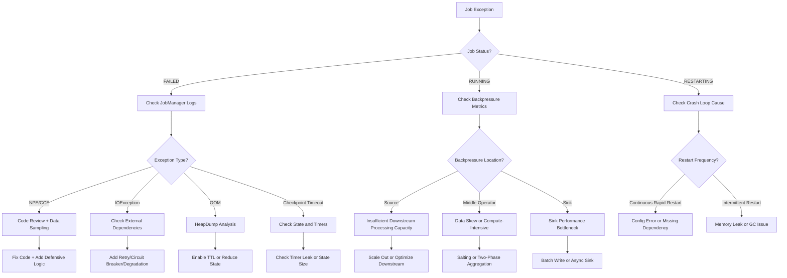
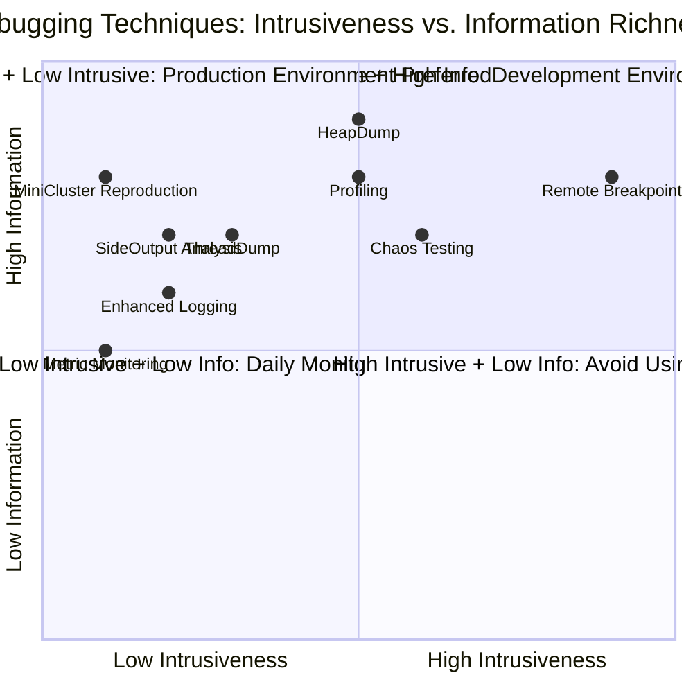

# Operator Debugging and Troubleshooting Handbook

> **Stage**: Knowledge/07-best-practices | **Prerequisites**: [operator-observability-and-intelligent-ops.md](operator-observability-and-intelligent-ops.md), [operator-anti-patterns.md](operator-anti-patterns.md) | **Formalization Level**: L2-L3
> **Document Positioning**: Practical guide for stream processing operator-level fault diagnosis, debugging techniques, and problem resolution
> **Version**: 2026.04

---

## Table of Contents

- [Operator Debugging and Troubleshooting Handbook](#operator-debugging-and-troubleshooting-handbook)
  - [Table of Contents](#table-of-contents)
  - [1. Definitions](#1-definitions)
    - [Def-DBG-01-01: Operator Failure Taxonomy (算子故障分类)](#def-dbg-01-01-operator-failure-taxonomy-算子故障分类)
    - [Def-DBG-01-02: Debugging Signal (调试信号)](#def-dbg-01-02-debugging-signal-调试信号)
    - [Def-DBG-01-03: Minimal Reproducible Example, MRE (最小可复现示例)](#def-dbg-01-03-minimal-reproducible-example-mre-最小可复现示例)
    - [Def-DBG-01-04: Checkpoint Diagnosis (检查点诊断)](#def-dbg-01-04-checkpoint-diagnosis-检查点诊断)
  - [2. Properties](#2-properties)
    - [Lemma-DBG-01-01: Unidirectionality of Exception Propagation (异常传播的单向性)](#lemma-dbg-01-01-unidirectionality-of-exception-propagation-异常传播的单向性)
    - [Lemma-DBG-01-02: Reproducibility of Deterministic Failures (确定性故障的可复现性)](#lemma-dbg-01-02-reproducibility-of-deterministic-failures-确定性故障的可复现性)
    - [Prop-DBG-01-01: Correlation Between Backpressure and Latency (背压与延迟的相关性)](#prop-dbg-01-01-correlation-between-backpressure-and-latency-背压与延迟的相关性)
    - [Prop-DBG-01-02: GC Patterns Before OOM (OOM前的GC模式)](#prop-dbg-01-02-gc-patterns-before-oom-oom前的gc模式)
  - [3. Relations](#3-relations)
    - [3.1 Mapping of Failure Symptoms to Debugging Tools](#31-mapping-of-failure-symptoms-to-debugging-tools)
    - [3.2 Layered Debugging Techniques](#32-layered-debugging-techniques)
  - [4. Argumentation](#4-argumentation)
    - [4.1 Why Stream Processing Debugging is Harder Than Batch Processing](#41-why-stream-processing-debugging-is-harder-than-batch-processing)
    - [4.2 Best Practices for Logging Strategy](#42-best-practices-for-logging-strategy)
    - [4.3 Risks of Remote Debugging and Alternative Solutions](#43-risks-of-remote-debugging-and-alternative-solutions)
  - [5. Proof / Engineering Argument](#5-proof--engineering-argument)
    - [5.1 Systematic Fault Troubleshooting Process](#51-systematic-fault-troubleshooting-process)
    - [5.2 Common Exception Quick Reference Table](#52-common-exception-quick-reference-table)
    - [5.3 Performance Profiling Methodology](#53-performance-profiling-methodology)
  - [6. Examples](#6-examples)
    - [6.1 Case Study: KeyedProcessFunction State Leak Investigation](#61-case-study-keyedprocessfunction-state-leak-investigation)
    - [6.2 Case Study: Data Skew (数据倾斜) Causing Single Task OOM](#62-case-study-data-skew-数据倾斜-causing-single-task-oom)
    - [6.3 Case Study: Side Output Capturing Exceptional Data](#63-case-study-side-output-capturing-exceptional-data)
  - [7. Visualizations](#7-visualizations)
    - [Troubleshooting Decision Tree](#troubleshooting-decision-tree)
    - [Debugging Technique Selection Matrix](#debugging-technique-selection-matrix)
  - [8. References](#8-references)

---

## 1. Definitions

### Def-DBG-01-01: Operator Failure Taxonomy (算子故障分类)

Operator (算子) failures are classified into four categories by layer:

$$\text{Failure} = \text{CompilationFailure} \cup \text{RuntimeFailure} \cup \text{PerformanceFailure} \cup \text{SemanticFailure}$$

| Type | Occurrence Stage | Typical Symptoms | Detection Method |
|------|-----------------|------------------|-----------------|
| **Compilation Failure** | Before job submission | Type mismatch, missing serializer | Compilation error logs |
| **Runtime Failure** | During job execution | NPE, OOM, connection timeout | Exception stack trace |
| **Performance Failure** | During job execution | Backpressure (背压), high latency, low throughput | Metric monitoring |
| **Semantic Failure** | During result validation | Data duplication, loss, disorder | Result comparison |

### Def-DBG-01-02: Debugging Signal (调试信号)

A Debugging Signal (调试信号) is an observable output used to locate operator issues:

$$\text{Signal} \in \{\text{Exception}, \text{Metric}, \text{Log}, \text{ThreadDump}, \text{HeapDump}, \text{StateDump}\}$$

### Def-DBG-01-03: Minimal Reproducible Example, MRE (最小可复现示例)

MRE is the minimal Pipeline that can still reproduce an operator failure after stripping business logic:

$$\text{MRE} = (\text{Minimal Source}, \text{Target Operator}, \text{Minimal Sink})$$

Requirements:

1. Can run independently (no dependency on external systems)
2. Data volume is controllable (typically < 1000 records)
3. Failure reproduction rate is 100%

### Def-DBG-01-04: Checkpoint Diagnosis (检查点诊断)

Checkpoint Diagnosis (检查点诊断) is a method of locating problems by analyzing checkpoint success/failure patterns:

$$\text{Diagnosis}(chkpt) = f(\text{duration}, \text{size}, \text{syncDuration}, \text{asyncDuration}, \text{numOfAcknowledgedTasks})$$

---

## 2. Properties

### Lemma-DBG-01-01: Unidirectionality of Exception Propagation (异常传播的单向性)

If operator $i$ throws an uncaught exception, the exception only affects the Task where operator $i$ resides and does not directly propagate to other Tasks. However, it propagates through the following indirect paths:

1. **Checkpoint failure**: The exceptional Task does not respond to barriers, causing global checkpoint timeout
2. **Backpressure propagation**: The exceptional Task stops consuming, and upstream network buffers fill up
3. **JobManager decision**: If the exception rate exceeds the threshold, the JobManager restarts the entire job

### Lemma-DBG-01-02: Reproducibility of Deterministic Failures (确定性故障的可复现性)

If a failure is caused by deterministic factors (code bug, fixed input data), it will be reproduced 100% under the same conditions:

$$\text{Deterministic}(bug) \Rightarrow P(\text{Failure} \mid \text{SameConditions}) = 1$$

If a failure is caused by non-deterministic factors (network jitter, GC timing, race conditions), increasing the sampling frequency is required to capture it.

### Prop-DBG-01-01: Correlation Between Backpressure and Latency (背压与延迟的相关性)

In a Pipeline, the backpressure index $B$ and end-to-end latency $\mathcal{L}$ are positively correlated:

$$\rho(B, \mathcal{L}) > 0.7$$

**Engineering significance**: When a latency spike is observed, checking the backpressure metric first can quickly locate the bottleneck operator.

### Prop-DBG-01-02: GC Patterns Before OOM (OOM前的GC模式)

The following GC patterns typically appear before an OOM occurs:

1. Full GC frequency drops from minute-level to second-level
2. Post-GC memory recovery rate drops from 80% to below 10%
3. GC time ratio rises from < 5% to > 50%

**Warning**: When GC time ratio > 30% persists for 1 minute, the job will OOM within 10 minutes.

---

## 3. Relations

### 3.1 Mapping of Failure Symptoms to Debugging Tools

| Symptom | Primary Tool | Secondary Tool | Key Metric |
|---------|-------------|---------------|-----------|
| **Job Crash** | JobManager logs | TaskManager logs | Exception class name |
| **Checkpoint Timeout** | Web UI Checkpoints page | TM logs | alignmentDuration |
| **High Latency** | Flink Metrics | Custom logs | records-lag-max |
| **OOM** | HeapDump + MAT | GC logs | oldGenUsage |
| **Data Loss** | Sink output comparison | Checkpoint state inspection | records-out vs records-in |
| **Data Duplication** | Idempotency check | Transaction logs | Primary key conflict count |
| **Data Disorder** | Watermark monitoring | Event time distribution chart | watermark-lag |
| **Large State (状态过大)** | StateBackend statistics | Checkpoint size | stateSize |

### 3.2 Layered Debugging Techniques

```
Debugging Technique Stack
├── Static Analysis
│   ├── Code Review
│   ├── Type Checking
│   └── Serialization Compatibility Check
├── Dynamic Analysis
│   ├── Enhanced Logging
│   ├── Metric Collection
│   ├── Remote Breakpoint Debugging
│   └── Profiling
├── Fault Injection
│   ├── Chaos Engineering
│   ├── Network Partition Simulation
│   └── Latency Injection
└── Post-hoc Analysis
    ├── Heap Dump Analysis
    ├── Thread Dump Analysis
    └── Checkpoint Analysis
```

---

## 4. Argumentation

### 4.1 Why Stream Processing Debugging is Harder Than Batch Processing

| Dimension | Batch Processing | Stream Processing |
|-----------|-----------------|-------------------|
| Data Visibility | Full dataset is known before execution | Data is infinite, only sampling is possible |
| Failure Timing | Usually exposed at job startup | May be exposed after running for several days |
| Re-run Cost | Low (just re-run once) | High (requires recovery from Savepoint) |
| State Complexity | Stateless or simple state | Continuously accumulated complex state |
| Time Factor | Does not involve time semantics | Event time / processing time / watermark interleaved |
| Concurrent Debugging | Usually single-threaded | Multiple parallelism, race conditions hard to reproduce |

### 4.2 Best Practices for Logging Strategy

**Anti-pattern**: Printing a log for every record.

```java
// ❌ Wrong: log flood
public void processElement(Event event, Context ctx, Collector<Result> out) {
    LOG.info("Processing event: {}", event);  // 100k logs per second
    out.collect(process(event));
}
```

**Positive-pattern**: Sampled logging + structured logging.

```java
// ✅ Correct: sampling + structured
private static final int LOG_SAMPLE_RATE = 1000;
private long counter = 0;

public void processElement(Event event, Context ctx, Collector<Result> out) {
    counter++;
    if (counter % LOG_SAMPLE_RATE == 0) {
        LOG.info("Sample processing", StructuredArguments.keyValue("eventId", event.getId()));
    }
    out.collect(process(event));
}
```

### 4.3 Risks of Remote Debugging and Alternative Solutions

**Risks of Remote Debugging (远程调试)**:

- Breakpoint pauses cause backpressure propagation, affecting the production environment
- Debugger connections add network overhead
- Under multiple parallelism, the debugger can only attach to one Task

**Alternative Solutions**:

1. **Local MiniCluster Reproduction**: Reproduce locally with the same code and data
2. **Enhanced Logging**: Add detailed logs at suspicious locations and redeploy
3. **Side Output Exception Stream**: Route exceptional data to Side Output for offline analysis

---

## 5. Proof / Engineering Argument

### 5.1 Systematic Fault Troubleshooting Process

**Step 1: Symptom Collection**

```
Job Exception?
├── Complete Crash (FAILED Status)
│   └── Collect JobManager + all TaskManager logs
├── Running but High Latency (RUNNING Status)
│   └── Collect Metrics + Backpressure metrics
├── Checkpoint Continuously Fails
│   └── Collect Checkpoint details + TM logs
└── Incorrect Results (Data Quality Issues)
    └── Collect input/output comparison + intermediate operator output sampling
```

**Step 2: Scope Narrowing**

Use binary search to narrow down the failure scope:

1. Cut the Pipeline from the middle
2. Check whether the upper half output is normal
3. If normal, the fault is in the lower half; otherwise, in the upper half
4. Repeat until a single operator is located

**Step 3: Root Cause Confirmation**

Perform the following checks on the target operator:

- Code logic review
- Input data sampling analysis
- State size and type check
- External dependency availability check

### 5.2 Common Exception Quick Reference Table

| Exception Message | Root Cause | Fix |
|-------------------|-----------|-----|
| `NullPointerException` | Null values in input data | Pre-filter or null handling |
| `ClassCastException` | Type erasure or serialization issue | Check TypeInformation configuration |
| `IOException: Connection refused` | External service unavailable | Add retry and circuit breaker |
| `TimeoutException` | Async call timeout | Increase timeout or optimize external service |
| `OutOfMemoryError` | State too large or memory leak | Enable TTL or reduce window size |
| `CheckpointExpiredException` | Checkpoint timeout | Increase timeout or optimize state |
| `Watermarks are lagging` | Source lag or data disorder | Check Source Lag or adjust Watermark strategy |
| `Buffer pool is destroyed` | Network layer closed after Task crash | Check upstream Task exception |

### 5.3 Performance Profiling Methodology

**CPU Hotspot Analysis**:

```bash
# Use async-profiler to attach to TaskManager
./profiler.sh -d 60 -f cpu.svg $(jps | grep TaskManager | awk '{print $1}')
```

Analyze the Flame Graph to locate the methods with the highest CPU consumption:

- Serialization / deserialization (Kryo/Avro)
- State access (RocksDB get/put)
- User-defined functions (UDF)
- Network transmission (Netty)

**Memory Leak Analysis**:

```bash
# Generate Heap Dump
jmap -dump:format=b,file=heap.hprof $(jps | grep TaskManager | awk '{print $1}')

# Analyze with Eclipse MAT
# Find largest objects in Dominator Tree
# Check classes with largest retained heap
```

Common leak sources:

- Unbounded growth of ListState/MapState
- Uncleaned Timers
- Static collection caches
- Unreleased network buffers

---

## 6. Examples

### 6.1 Case Study: KeyedProcessFunction State Leak Investigation

**Symptom**: After running for 2 days, Checkpoint increased from 5s to 120s, eventually OOM.

**Troubleshooting Steps**:

1. **Check Metrics**: `numberOfRegisteredTimers` continuously grows to 2,000,000+
2. **Code Review**:

```java
// ❌ Problematic code: registers Timer for each event, old Timer not deleted
public void processElement(Event event, Context ctx, Collector<Result> out) {
    ctx.timerService().registerEventTimeTimer(event.getTimestamp() + 60000);
    // No logic to delete old Timer!
}
```

1. **Fix**:

```java
private ValueState<Long> timerState;

public void processElement(Event event, Context ctx, Collector<Result> out) {
    Long oldTimer = timerState.value();
    if (oldTimer != null) {
        ctx.timerService().deleteEventTimeTimer(oldTimer);
    }
    long newTimer = event.getTimestamp() + 60000;
    ctx.timerService().registerEventTimeTimer(newTimer);
    timerState.update(newTimer);
}

public void onTimer(long timestamp, OnTimerContext ctx, Collector<Result> out) {
    timerState.clear();
}
```

1. **Verification**: After the fix, the number of Timers stabilizes within the expected range, and Checkpoint recovers to 5s.

### 6.2 Case Study: Data Skew (数据倾斜) Causing Single Task OOM

**Symptom**: A certain Task in the job frequently OOMs and restarts, while other Tasks run normally.

**Troubleshooting Steps**:

1. **Check Metrics**: The problematic Task's `records-in` is 15x that of other Tasks
2. **Check keyBy key distribution**:

```java
// ❌ Problem: keyBy by province, Beijing/Shanghai account for 90% of data
stream.keyBy(Order::getProvince)
```

1. **Fix** (salting):

```java
// ✅ Fix: salting to distribute hotspots
stream.map(order -> {
    int salt = ThreadLocalRandom.current().nextInt(10);
    order.setSaltedKey(order.getProvince() + "_" + salt);
    return order;
})
.keyBy(Order::getSaltedKey)
.aggregate(new PartialSum())
.keyBy(Order::getProvince)  // downstream de-salting aggregation
.aggregate(new FinalSum());
```

1. **Verification**: Each Task is load-balanced, no OOM.

### 6.3 Case Study: Side Output Capturing Exceptional Data

**Scenario**: An operator occasionally throws NPE, but it is impossible to determine which record causes it.

**Solution**: Use Side Output to capture exceptional data without interrupting the main flow.

```java
OutputTag<Event> errorTag = new OutputTag<Event>("parse-errors"){};

SingleOutputStreamOperator<Result> mainStream = stream
    .process(new ProcessFunction<Event, Result>() {
        @Override
        public void processElement(Event event, Context ctx, Collector<Result> out) {
            try {
                out.collect(parse(event));
            } catch (Exception e) {
                ctx.output(errorTag, event);  // Output exception data to Side Output
                LOG.error("Parse failed for event: {}", event.getId(), e);
            }
        }
    });

// Exceptional data handled separately
DataStream<Event> errorStream = mainStream.getSideOutput(errorTag);
errorStream.addSink(new ErrorEventSink());
```

---

## 7. Visualizations

### Troubleshooting Decision Tree

The following decision tree guides the selection of troubleshooting paths based on job status and symptoms.



### Debugging Technique Selection Matrix

The following quadrant chart compares debugging techniques by intrusiveness and information richness.



---

## 8. References

---

*Related Documents*: [operator-observability-and-intelligent-ops.md](operator-observability-and-intelligent-ops.md) | [operator-anti-patterns.md](operator-anti-patterns.md) | [operator-testing-and-verification-guide.md](operator-testing-and-verification-guide.md)
