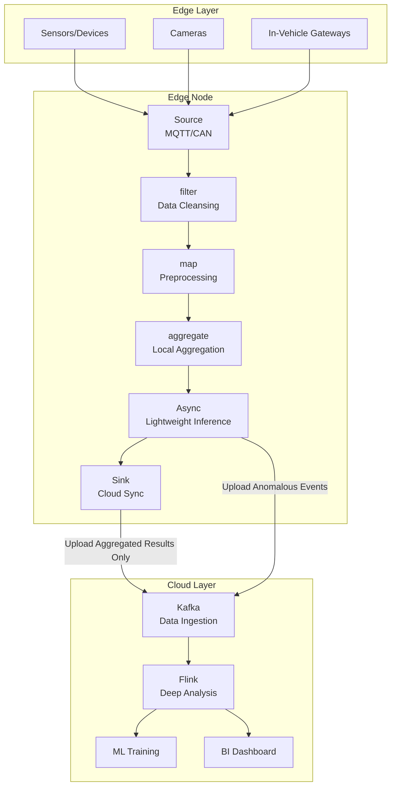
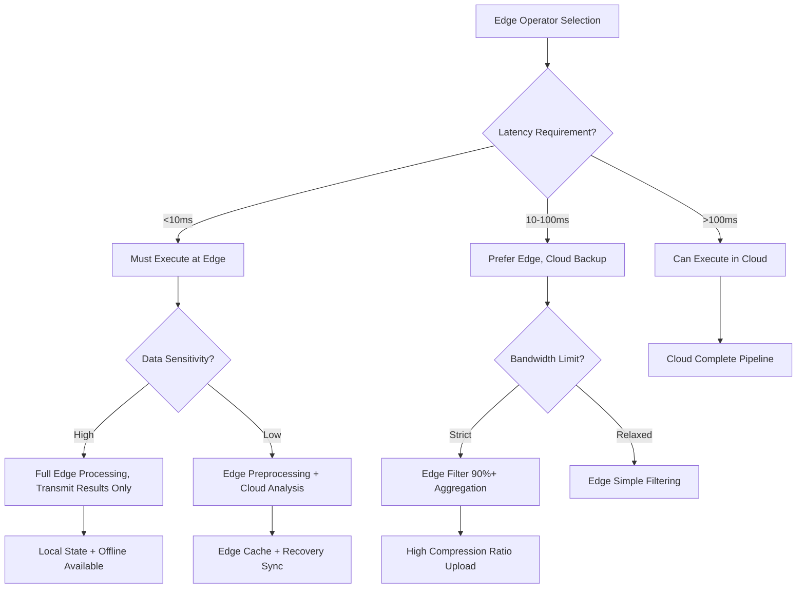

# Operator and Edge Computing Integration

> **Stage**: Knowledge/06-frontier | **Prerequisites**: [01.06-single-input-operators.md](../Knowledge/01-concept-atlas/operator-deep-dive/01.06-single-input-operators.md), [operator-cost-model-and-resource-estimation.md](../Knowledge/07-best-practices/operator-cost-model-and-resource-estimation.md) | **Formalization Level**: L3
> **Document Positioning**: Deployment, constraints, and optimization strategies for stream processing operators in edge computing environments
> **Version**: 2026.04

---

## Table of Contents

- [Operator and Edge Computing Integration](#operator-and-edge-computing-integration)
  - [Table of Contents](#table-of-contents)
  - [1. Definitions](#1-definitions)
    - [Def-EDGE-01-01: Edge Computing (边缘计算)](#def-edge-01-01-edge-computing-边缘计算)
    - [Def-EDGE-01-02: Edge Operator (边缘算子)](#def-edge-01-02-edge-operator-边缘算子)
    - [Def-EDGE-01-03: Edge-Cloud Collaboration Model (边缘-云协同模型)](#def-edge-01-03-edge-cloud-collaboration-model-边缘-云协同模型)
    - [Def-EDGE-01-04: Network Partition Tolerance (网络分区容忍度)](#def-edge-01-04-network-partition-tolerance-网络分区容忍度)
    - [Def-EDGE-01-05: Operator Offloading (算子下沉)](#def-edge-01-05-operator-offloading-算子下沉)
  - [2. Properties](#2-properties)
    - [Lemma-EDGE-01-01: Bandwidth Saving Ratio of Edge Filtering](#lemma-edge-01-01-bandwidth-saving-ratio-of-edge-filtering)
    - [Lemma-EDGE-01-02: State Upper Bound of Edge Aggregation](#lemma-edge-01-02-state-upper-bound-of-edge-aggregation)
    - [Prop-EDGE-01-01: Edge-Cloud Latency Gap](#prop-edge-01-01-edge-cloud-latency-gap)
    - [Prop-EDGE-01-02: Energy-Compute Tradeoff of Edge Nodes](#prop-edge-01-02-energy-compute-tradeoff-of-edge-nodes)
  - [3. Relations](#3-relations)
    - [3.1 Operator Types and Edge Suitability](#31-operator-types-and-edge-suitability)
    - [3.2 Edge-Cloud Operator Division Matrix](#32-edge-cloud-operator-division-matrix)
    - [3.3 Edge Stream Processing Framework Comparison](#33-edge-stream-processing-framework-comparison)
  - [4. Argumentation](#4-argumentation)
    - [4.1 Why Edge Computing Needs Stream Processing Operators](#41-why-edge-computing-needs-stream-processing-operators)
    - [4.2 Resource Constraint Challenges of Edge Operators](#42-resource-constraint-challenges-of-edge-operators)
    - [4.3 Failure Independence of Edge Nodes](#43-failure-independence-of-edge-nodes)
  - [5. Proof / Engineering Argument](#5-proof--engineering-argument)
    - [5.1 ROI Calculation for Edge Filtering](#51-roi-calculation-for-edge-filtering)
    - [5.2 Lightweight Configuration for Edge Stream Processing](#52-lightweight-configuration-for-edge-stream-processing)
    - [5.3 Disconnection Resume Mechanism](#53-disconnection-resume-mechanism)
  - [6. Examples](#6-examples)
    - [6.1 Practice: Smart Manufacturing Edge Quality Inspection](#61-practice-smart-manufacturing-edge-quality-inspection)
    - [6.2 Practice: Connected Vehicle Edge Alerting](#62-practice-connected-vehicle-edge-alerting)
  - [7. Visualizations](#7-visualizations)
    - [Edge-Cloud Collaboration Architecture Diagram](#edge-cloud-collaboration-architecture-diagram)
    - [Edge Operator Selection Decision Tree](#edge-operator-selection-decision-tree)
  - [8. References](#8-references)

---

## 1. Definitions

### Def-EDGE-01-01: Edge Computing (边缘计算)

Edge Computing is a computing paradigm that executes computation near the data source (network edge), complementing centralized cloud computing:

$$\text{Edge Computing} = (\text{Edge Nodes}, \text{Local Processing}, \text{Cloud Sync})$$

Core objectives: reduce latency, save bandwidth, protect privacy, and enhance reliability.

### Def-EDGE-01-02: Edge Operator (边缘算子)

An Edge Operator is a subset of stream processing operators running on resource-constrained devices (ARM CPU, <4GB memory):

$$\text{EdgeOperator} \subset \text{CloudOperator}$$

Constraints:

- CPU: ≤ 2 cores
- Memory: ≤ 2GB
- Disk: optional (prefer in-memory state)
- Network: intermittent connectivity
- Power: battery-powered (energy-saving required)

### Def-EDGE-01-03: Edge-Cloud Collaboration Model (边缘-云协同模型)

Edge-Cloud Collaboration defines the processing division of data between edge and cloud:

$$\text{Collaboration} = (\text{EdgeFilter} \circ \text{EdgeAggregate}) \xrightarrow{\text{Sync}} (\text{CloudDeepAnalyze})$$

**Layered Filtering Principle**: Complete as much filtering and aggregation as possible at the edge, and only synchronize necessary data to the cloud.

### Def-EDGE-01-04: Network Partition Tolerance (网络分区容忍度)

The network partition tolerance of an edge node defines the duration it can maintain local processing during network disconnection:

$$\mathcal{T}_{partition} = \frac{S_{local}}{R_{produce}}$$

Where $S_{local}$ is local storage capacity and $R_{produce}$ is data production rate.

### Def-EDGE-01-05: Operator Offloading (算子下沉)

Operator Offloading is the process of migrating cloud-side operators to edge execution:

$$\text{Offload}(Op_{cloud}) \to Op_{edge}, \quad \text{if } \mathcal{L}_{edge} + \mathcal{C}_{edge} < \mathcal{L}_{cloud}$$

Where $\mathcal{L}$ is latency and $\mathcal{C}$ is cost.

---

## 2. Properties

### Lemma-EDGE-01-01: Bandwidth Saving Ratio of Edge Filtering

If a filter operator is deployed at the edge with filtering ratio $r$, the bandwidth saving is:

$$\text{BandwidthSaving} = r \times 100\%$$

**Proof**: Let the original data volume be $D$, and the transmission volume after edge filtering be $(1-r) \cdot D$. The saving ratio is $(D - (1-r)D)/D = r$. ∎

### Lemma-EDGE-01-02: State Upper Bound of Edge Aggregation

When an edge node executes window aggregation, the state size is limited by window size and Key space:

$$S_{edge} = |K| \times s_{accumulator} \times \frac{W}{\Delta t}$$

Where $|K|$ is the number of keys, $s_{accumulator}$ is the accumulator size, $W$ is the window size, and $\Delta t$ is the data arrival interval.

**Engineering Corollary**: Edge nodes should avoid large-window aggregation ($W > 1$ hour) to prevent state overflow.

### Prop-EDGE-01-01: Edge-Cloud Latency Gap

For scenarios requiring < 10ms response, edge processing is the only choice:

$$\mathcal{L}_{cloud} = \mathcal{L}_{network} + \mathcal{L}_{process}^{cloud} \gg 10ms$$

$$\mathcal{L}_{edge} = \mathcal{L}_{process}^{edge} \approx 1\text{-}5ms$$

Typical cloud latency: intra-datacenter 10-50ms, inter-city 50-200ms, cross-country 200-500ms.

### Prop-EDGE-01-02: Energy-Compute Tradeoff of Edge Nodes

The energy consumption $E$ and compute power $C$ of edge devices satisfy an approximately linear relationship:

$$E = E_{idle} + \alpha \cdot C$$

Where $E_{idle}$ is idle energy consumption (ARM devices approx. 1-5W), and $\alpha$ is the compute-energy coefficient.

**Optimization Strategy**: Reduce operator parallelism or enter sleep mode during low load.

---

## 3. Relations

### 3.1 Operator Types and Edge Suitability

| Operator | Edge Suitability | Limitation | Alternative |
|----------|-----------------|------------|-------------|
| **map/filter** | ⭐⭐⭐⭐⭐ | None | Run directly |
| **flatMap** | ⭐⭐⭐⭐ | Output expansion may cause OOM | Limit expansion rate |
| **keyBy+aggregate** | ⭐⭐⭐ | State limited by memory | Small window + local RocksDB |
| **window** | ⭐⭐⭐ | Large window state too big | Micro-window (second-level) |
| **join** | ⭐⭐ | Dual-stream state memory pressure | Single-stream join at edge only |
| **AsyncFunction** | ⭐⭐⭐ | Unreliable network | Local cache + fallback |
| **CEP** | ⭐⭐⭐ | High memory for complex patterns | Simplify patterns |
| **ProcessFunction** | ⭐⭐⭐⭐ | Requires manual resource management | Streamlined state logic |

### 3.2 Edge-Cloud Operator Division Matrix

| Processing Stage | Edge Layer | Cloud Layer | Rationale |
|-----------------|------------|-------------|-----------|
| **Raw Data Filtering** | ✅ Execute | ❌ Do not execute | Reduce 90% invalid data transmission |
| **Simple Aggregation** | ✅ Execute | ❌ Do not execute | Second/minute-level aggregation done at edge |
| **Anomaly Detection** | ✅ Execute | ⚠️ Auxiliary | Edge real-time alerting, cloud deep analysis |
| **Complex ML Inference** | ⚠️ Lightweight model | ✅ Large model | Edge runs TinyML, cloud runs deep learning |
| **Cross-Device Correlation** | ❌ Do not execute | ✅ Execute | Requires global view |
| **Historical Trend Analysis** | ❌ Do not execute | ✅ Execute | Requires large amount of historical data |
| **Model Training** | ❌ Do not execute | ✅ Execute | Requires massive compute power |

### 3.3 Edge Stream Processing Framework Comparison

| Framework | Resource Usage | Latency | Cloud Integration | Applicable Scenario |
|-----------|---------------|---------|-------------------|---------------------|
| **Apache Flink (Mini)** | Medium-High | Low | Strong | Complex edge computing |
| **Apache Kafka Streams** | Medium | Low | Strong | Lightweight ETL |
| **Redis Streams** | Low | Ultra-low | Medium | Simple message processing |
| **Node-RED** | Ultra-low | Ultra-low | Weak | Rapid prototyping |
| **AWS Greengrass** | Medium | Low | Strong (AWS-only) | AWS ecosystem |
| **Azure IoT Edge** | Medium | Low | Strong (Azure-only) | Azure ecosystem |

---

## 4. Argumentation

### 4.1 Why Edge Computing Needs Stream Processing Operators

Traditional edge computing adopts a "collect-upload-process" model:

- High latency: data must be transmitted to the cloud before processing
- Bandwidth waste: large amounts of raw data are uploaded
- Privacy risk: sensitive data leaves the local environment

After stream processing operators are offloaded to the edge:

- Real-time response: local processing latency < 10ms
- Bandwidth optimization: only aggregated results are uploaded
- Privacy protection: raw data does not leave the local environment
- Offline availability: continues local processing during network disconnection

### 4.2 Resource Constraint Challenges of Edge Operators

**Challenge 1: Memory Limitation**

- Edge devices typically have 1-4GB RAM
- Flink TaskManager requires 1.5GB+ by default
- Solution: use Flink lightweight configuration or custom micro-runtime

**Challenge 2: CPU Limitation**

- ARM Cortex-A53 performance is about 30-50% of x86
- Complex serialization (Kryo) has high overhead
- Solution: use Avro/Protobuf instead of Kryo, avoid reflection

**Challenge 3: Network Intermittency**

- 4G/5G/WiFi may be interrupted
- Solution: local buffer + resume from breakpoint

### 4.3 Failure Independence of Edge Nodes

Failures of edge nodes should not affect the overall system:

- Single edge node failure → data from that node is temporarily lost, other nodes operate normally
- Cloud failure → edge nodes continue local processing, synchronize after recovery
- Network partition → edge nodes buffer locally, batch upload after network recovery

---

## 5. Proof / Engineering Argument

### 5.1 ROI Calculation for Edge Filtering

**Problem**: What is the return on investment for deploying a filter operator at the edge?

**Inputs**:

- Raw data volume: $D$ = 100GB/day
- Filtering ratio: $r$ = 90%
- Cloud transmission cost: $c$ = $0.09/GB
- Edge device cost: $C_{edge}$ = $50/month

**Calculation**:
$$\text{CloudCost}_{before} = D \times c \times 30 = 100 \times 0.09 \times 30 = \\$270/month$$

$$\text{CloudCost}_{after} = D \times (1-r) \times c \times 30 = 100 \times 0.1 \times 0.09 \times 30 = \\$27/month$$

$$\text{Saving} = \\$270 - \\$27 = \\$243/month$$

$$\text{ROI} = \frac{\text{Saving} - C_{edge}}{C_{edge}} = \frac{243 - 50}{50} = 386\%$$

**Conclusion**: Edge filtering can recover device cost within the first month.

### 5.2 Lightweight Configuration for Edge Stream Processing

Minimum configuration for Flink on edge devices:

```properties
# JVM Configuration
jobmanager.memory.process.size=512m
taskmanager.memory.process.size=1024m
taskmanager.memory.managed.fraction=0.1
taskmanager.numberOfTaskSlots=1

# State Configuration
state.backend=rocksdb
state.backend.rocksdb.memory.fixed-per-slot=64mb
state.backend.incremental=true

# Checkpoint Configuration (local disk)
execution.checkpointing.interval=60s
state.checkpoints.dir=file:///tmp/flink-checkpoints

# Network Configuration (minimized)
taskmanager.memory.network.min=32mb
taskmanager.memory.network.max=64mb
```

**Total Memory Requirement**: approximately 1GB (can run on 2GB RAM ARM devices).

### 5.3 Disconnection Resume Mechanism

**Mechanism Design**:

```
Edge Node (during disconnection):
1. Data ingestion and processing proceed normally
2. Output results are written to local WAL (Write-Ahead Log)
3. Periodically attempt to connect to cloud
4. After connection recovery, replay WAL to cloud in order

Cloud Reception:
1. Detect data stream recovery
2. Process backlogged data from edge nodes
3. Deduplication (based on event ID or offset)
```

**Key Point**: WAL must be persisted to local storage (eMMC/SD card) to prevent data loss upon edge node restart.

---

## 6. Examples

### 6.1 Practice: Smart Manufacturing Edge Quality Inspection

**Scenario**: Factory production line camera real-time quality inspection, requiring defect detection at the edge.

**Edge Pipeline**:

```java
// Edge Device: NVIDIA Jetson Nano (4GB RAM)
StreamExecutionEnvironment env = StreamExecutionEnvironment.getExecutionEnvironment();
env.setParallelism(1);  // single-core device

// 1. Ingest image frames from camera
DataStream<ImageFrame> frames = env.addSource(new CameraSource("/dev/video0"));

// 2. Edge preprocessing: resize + grayscale (reduce data volume)
DataStream<ProcessedImage> processed = frames
    .map(new ResizeAndGrayscale(224, 224));

// 3. Edge inference: TensorFlow Lite model
DataStream<DetectionResult> results = AsyncDataStream.unorderedWait(
    processed,
    new TFLiteInferenceFunction("defect_model.tflite"),
    Time.milliseconds(200),
    5
);

// 4. Filter: retain only defect frames
DataStream<DetectionResult> defects = results
    .filter(r -> r.getConfidence() > 0.8);

// 5. Edge aggregation: count defects per minute
defects.keyBy(DetectionResult::getLineId)
    .window(TumblingProcessingTimeWindows.of(Time.minutes(1)))
    .aggregate(new DefectCountAggregate())
    .addSink(new CloudSyncSink("https://factory-cloud/api/metrics"));

// 6. Upload defect frames to cloud (only anomalous data)
defects.map(r -> r.getImageBytes())
    .addSink(new CloudStorageSink("s3://defect-images/"));
```

**Results**:

- Edge latency: 50ms (inference + filtering)
- Bandwidth saving: 95% (only defect frames uploaded)
- Offline availability: continues local detection during disconnection, synchronizes statistics after recovery

### 6.2 Practice: Connected Vehicle Edge Alerting

**Scenario**: Vehicle sensor real-time monitoring, edge nodes detect dangerous driving behavior and alert immediately.

**Edge Operator Design**:

```java
// Edge Device: In-vehicle ARM gateway
DataStream<VehicleEvent> events = env.addSource(new CANBusSource());

// Dangerous behavior detection (edge real-time)
events.keyBy(VehicleEvent::getVehicleId)
    .process(new KeyedProcessFunction<String, VehicleEvent, Alert>() {
        private ValueState<DrivingContext> contextState;

        @Override
        public void processElement(VehicleEvent event, Context ctx, Collector<Alert> out) {
            DrivingContext context = contextState.value();
            if (context == null) context = new DrivingContext();

            // Harsh braking detection
            if (event.getDeceleration() > 8.0) {
                out.collect(new Alert("HARSH_BRAKING", event.getVehicleId(), ctx.timestamp()));
            }

            // Overspeed detection
            if (event.getSpeed() > 120) {
                out.collect(new Alert("OVERSPEED", event.getVehicleId(), ctx.timestamp()));
            }

            context.update(event);
            contextState.update(context);
        }
    })
    .addSink(new LTEUploadSink("tcp://edge-server:9999"));  // upload alerts only
```

**Key Constraints**:

- Latency requirement: < 100ms (from event occurrence to alert issuance)
- Bandwidth constraint: 4G network, upload alerts only (< 1KB each)
- Reliability: local storage of the most recent 1000 events to prevent data loss

---

## 7. Visualizations

### Edge-Cloud Collaboration Architecture Diagram



### Edge Operator Selection Decision Tree



---

## 8. References


---

*Related Documents*: [operator-iot-stream-processing.md](../Knowledge/06-frontier/operator-iot-stream-processing.md) | [operator-cost-model-and-resource-estimation.md](../Knowledge/07-best-practices/operator-cost-model-and-resource-estimation.md) | [operator-kubernetes-cloud-native-deployment.md](../Knowledge/06-frontier/operator-kubernetes-cloud-native-deployment.md)
