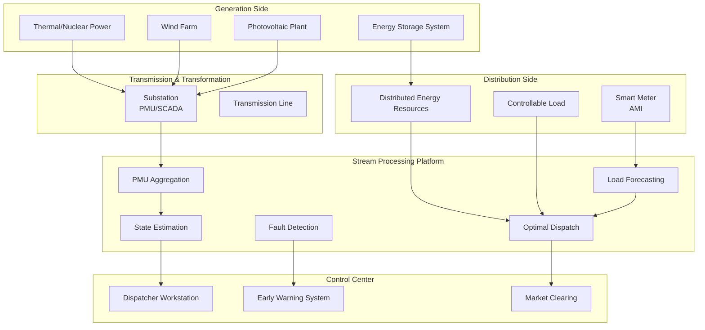
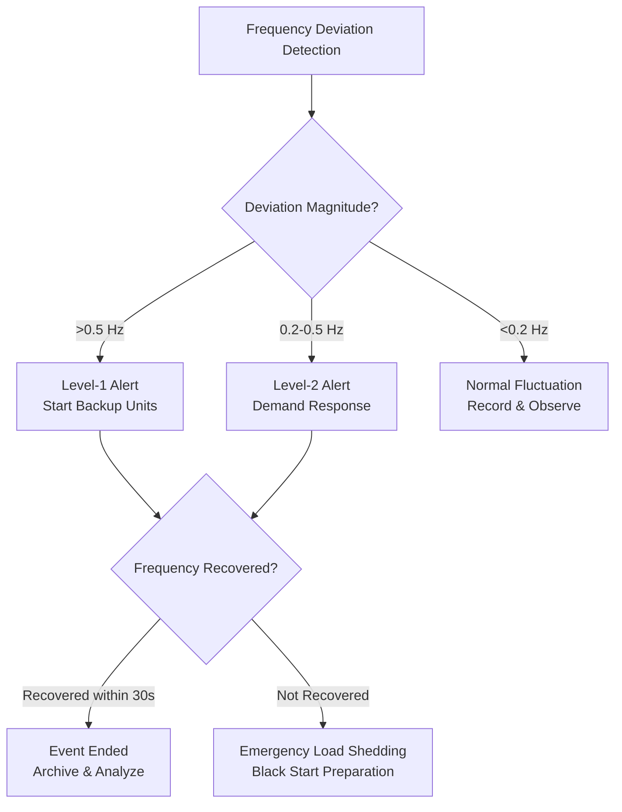

# Operators and Real-Time Energy Grid Monitoring

> **Stage**: Knowledge/06-frontier | **Prerequisites**: [operator-iot-stream-processing.md](operator-iot-stream-processing.md), [operator-ai-ml-integration.md](operator-ai-ml-integration.md) | **Formalization Level**: L3
> **Document Positioning**: Stream processing operator fingerprints and Pipeline design for real-time monitoring, load forecasting, and fault detection in Smart Grid (智能电网)
> **Version**: 2026.04

---

## Table of Contents

- [Operators and Real-Time Energy Grid Monitoring](#operators-and-real-time-energy-grid-monitoring)
  - [Table of Contents](#table-of-contents)
  - [1. Concepts (Definitions)](#1-concepts-definitions)
    - [Def-ENG-01-01: Smart Grid (智能电网)](#def-eng-01-01-smart-grid-智能电网)
    - [Def-ENG-01-02: Synchrophasor Measurement (同步相量测量) (Phasor Measurement Unit, PMU)](#def-eng-01-02-synchrophasor-measurement-同步相量测量-phasor-measurement-unit-pmu)
    - [Def-ENG-01-03: Load Forecasting (负荷预测)](#def-eng-01-03-load-forecasting-负荷预测)
    - [Def-ENG-01-04: Frequency Deviation and Primary Frequency Regulation](#def-eng-01-04-frequency-deviation-and-primary-frequency-regulation)
    - [Def-ENG-01-05: Renewable Variability (可再生能源波动性)](#def-eng-01-05-renewable-variability-可再生能源波动性)
  - [2. Properties](#2-properties)
    - [Lemma-ENG-01-01: PMU Data Nyquist Requirement](#lemma-eng-01-01-pmu-data-nyquist-requirement)
    - [Lemma-ENG-01-02: Load Forecasting Error Accumulation](#lemma-eng-01-02-load-forecasting-error-accumulation)
    - [Prop-ENG-01-01: Renewable Penetration Rate and Frequency Regulation Difficulty](#prop-eng-01-01-renewable-penetration-rate-and-frequency-regulation-difficulty)
    - [Prop-ENG-01-02: Aggregation Effect of Demand Response](#prop-eng-01-02-aggregation-effect-of-demand-response)
  - [3. Relations](#3-relations)
    - [3.1 Power Grid Monitoring Pipeline Operator Mapping](#31-power-grid-monitoring-pipeline-operator-mapping)
    - [3.2 Operator Fingerprint](#32-operator-fingerprint)
    - [3.3 Power Grid Data Protocols](#33-power-grid-data-protocols)
  - [4. Argumentation](#4-argumentation)
    - [4.1 Why Power Grids Need Stream Processing Instead of Traditional SCADA](#41-why-power-grids-need-stream-processing-instead-of-traditional-scada)
    - [4.2 Real-Time Challenges of Renewable Energy Grid Integration](#42-real-time-challenges-of-renewable-energy-grid-integration)
    - [4.3 Coupling of Cyber Security and Physical Security](#43-coupling-of-cyber-security-and-physical-security)
  - [5. Proof / Engineering Argument](#5-proof--engineering-argument)
    - [5.1 Frequency Nadir Event Detection](#51-frequency-nadir-event-detection)
    - [5.2 Ultra-Short-Term Load Forecasting](#52-ultra-short-term-load-forecasting)
    - [5.3 Demand Response Signal Broadcasting](#53-demand-response-signal-broadcasting)
  - [6. Examples](#6-examples)
    - [6.1 In Practice: Wide Area Monitoring System (WAMS)](#61-in-practice-wide-area-monitoring-system-wams)
    - [6.2 In Practice: Virtual Power Plant (VPP) Aggregation and Dispatch](#62-in-practice-virtual-power-plant-vpp-aggregation-and-dispatch)
  - [7. Visualizations](#7-visualizations)
    - [Smart Grid Monitoring Architecture](#smart-grid-monitoring-architecture)
    - [Frequency Event Response Process](#frequency-event-response-process)
  - [8. References](#8-references)

---

## 1. Concepts (Definitions)

### Def-ENG-01-01: Smart Grid (智能电网)

Smart Grid (智能电网) is the next-generation power grid architecture that integrates modern communication, computing, and control technologies into traditional power systems:

$$\text{SmartGrid} = (\text{Generation}, \text{Transmission}, \text{Distribution}, \text{Consumption}) \times \text{ICT}$$

Core characteristics: bidirectional communication, self-healing capability, distributed energy resource integration, and demand-side response.

### Def-ENG-01-02: Synchrophasor Measurement (同步相量测量) (Phasor Measurement Unit, PMU)

PMU is a power system measurement device based on GPS-synchronized clocks, sampling voltage/current phasors at high frequencies (30-120 frames/second):

$$\text{Phasor}_t = V \angle \theta = V \cdot e^{j\theta}, \quad \text{where } \theta = 2\pi f t + \phi$$

PMU data is the gold-standard data source for power system state estimation and stability analysis.

### Def-ENG-01-03: Load Forecasting (负荷预测)

Load Forecasting (负荷预测) is a time-series prediction problem that forecasts future electricity demand based on historical load, meteorological, and economic factors:

$$\hat{L}_{t+h} = f(L_{[t-W, t]}, W_{[t, t+h]}, C_{[t, t+h]})$$

where $W$ represents meteorological factors (temperature/humidity/wind speed), and $C$ represents calendar factors (workdays/holidays).

### Def-ENG-01-04: Frequency Deviation and Primary Frequency Regulation

Power system frequency $f$ is directly related to the generation-load balance:

$$\Delta f = f_{actual} - f_{nominal} = -\frac{\Delta P}{D + \frac{1}{R}}$$

where $\Delta P$ is the power imbalance, $D$ is the load damping coefficient, and $R$ is the generator droop coefficient.

Primary frequency regulation requires frequency deviation to recover within $\pm 0.5$ Hz, with response time $< 30$ seconds.

### Def-ENG-01-05: Renewable Variability (可再生能源波动性)

Wind and solar power outputs exhibit high intermittency and uncontrollability:

$$P_{wind}(t) = \frac{1}{2} \rho A C_p v(t)^3$$

$$P_{solar}(t) = A \cdot \eta \cdot I(t) \cdot (1 - 0.005(T_{cell}(t) - 25))$$

where $v(t)$ is wind speed, $I(t)$ is solar irradiance, and $T_{cell}$ is panel temperature.

---

## 2. Properties

### Lemma-ENG-01-01: PMU Data Nyquist Requirement

PMU sampling frequency $f_{PMU}$ and the highest frequency $f_{max}$ of power system dynamics satisfy:

$$f_{PMU} \geq 2 \cdot f_{max}$$

Power system electromechanical oscillation frequency range: 0.1-2.5 Hz. Therefore, $f_{PMU} = 30-60$ Hz is sufficient to capture all electromechanical modes.

### Lemma-ENG-01-02: Load Forecasting Error Accumulation

Short-term load forecasting error grows with prediction horizon $h$:

$$\text{RMSE}(h) \approx \text{RMSE}(1h) \cdot \sqrt{h}$$

**Engineering Corollary**: Ultra-short-term (5 minutes-1 hour) prediction error is approximately 1-3%; day-ahead prediction error is approximately 5-10%.

### Prop-ENG-01-01: Renewable Penetration Rate and Frequency Regulation Difficulty

As renewable energy penetration rate $R$ increases, system inertia $H$ decreases, and the rate of change of frequency increases:

$$\frac{df}{dt}\bigg|_{t=0} = -\frac{\Delta P}{2H_{eq}}$$

where $H_{eq} = (1-R) \cdot H_{conventional} + R \cdot H_{renewable}$, and $H_{renewable} \approx 0$.

**Engineering Significance**: High-penetration systems require Virtual Inertia or fast-responding energy storage to maintain frequency stability.

### Prop-ENG-01-02: Aggregation Effect of Demand Response

Individual demand response resources have small capacity, but large-scale aggregation can rival conventional generation units:

$$P_{DR}^{total} = \sum_{i=1}^{N} p_i \cdot \mathbb{1}_{respond}(i)$$

where $N$ is the number of participating resources (up to millions), $p_i$ is the power of an individual resource, and $\mathbb{1}_{respond}(i)$ is the response indicator function.

---

## 3. Relations

### 3.1 Power Grid Monitoring Pipeline Operator Mapping

| Application Scenario | Operator Combination | Data Source | Latency Requirement |
|---------|---------|--------|---------|
| **PMU State Estimation** | Source → filter → map | PMU (30-120Hz) | < 100ms |
| **Frequency Monitoring** | window+aggregate | SCADA/PMU | < 1s |
| **Load Forecasting** | window+Async ML | Historical Load + Weather | < 5 minutes |
| **Wind Power Forecasting** | window+Async ML | Wind Speed + Power History | < 15 minutes |
| **Fault Detection** | CEP / ProcessFunction | PMU/Protection Device | < 100ms |
| **Power Quality** | window+aggregate | Harmonic/Flicker Data | < 1 minute |
| **Demand Response** | keyBy+aggregate+Broadcast | Load Aggregation + Price Signal | < 30 seconds |

### 3.2 Operator Fingerprint

| Dimension | Power Grid Monitoring Characteristics |
|------|-------------|
| **Core Operators** | window+aggregate (load statistics), AsyncFunction (ML prediction), CEP (fault patterns), Broadcast (price signals) |
| **State Types** | ValueState (current frequency deviation), MapState (regional load), WindowState (prediction features) |
| **Time Semantics** | Event time (GPS synchronization) as primary |
| **Data Characteristics** | Multi-source synchronization (PMU requires GPS clock), high frequency (PMU 30-120Hz), strong periodicity (daily/weekly/seasonal) |
| **State Hotspots** | Key for trunk lines/hub substations |
| **Performance Bottlenecks** | ML model inference (load forecasting), PMU data aggregation bandwidth |

### 3.3 Power Grid Data Protocols

| Protocol | Purpose | Data Rate | Flink Source |
|------|------|---------|-------------|
| **IEC 61850** | Substation Automation | 1-10Hz | IEC 61850 Client |
| **IEEE C37.118** | PMU Data Transmission | 30-120Hz | PMU Stream Source |
| **DNP3** | Distribution SCADA | 1-5Hz | DNP3 Source |
| **Modbus** | RTU Communication | 1Hz | Modbus Source |
| **OpenADR** | Demand Response Signals | Event-triggered | HTTP/WebSocket |

---

## 4. Argumentation

### 4.1 Why Power Grids Need Stream Processing Instead of Traditional SCADA

Problems with traditional SCADA:

- Scan cycle 2-10 seconds, unable to capture fast dynamics (e.g., frequency nadir)
- Data scattered across dispatch centers, making global analysis difficult
- Alarms based on fixed thresholds, unable to predict system instability

Advantages of stream processing:

- PMU 30-120Hz data processed in real time
- Wide-area monitoring: real-time cross-regional data aggregation
- Predictive analysis: from "post-fault alarm" to "pre-instability warning"
- Demand response: second-level load dispatch

### 4.2 Real-Time Challenges of Renewable Energy Grid Integration

**Challenge 1: Power Fluctuation**

- Cloud passing: photovoltaic plant output drops 50% within seconds
- Gusts: wind power output changes 20% within minutes

**Challenge 2: Reduced System Inertia**

- Conventional units provide rotational inertia; new energy sources connected via inverters do not provide inertia
- Under high penetration, rate of change of frequency $df/dt$ increases 3-5 times

**Stream Processing Solutions**:

- Real-time power prediction: cloud motion prediction based on weather radar
- Energy storage dispatch: prediction error → automatic trigger of energy storage charge/discharge
- Virtual Power Plant: aggregation of distributed resources to provide ancillary services

### 4.3 Coupling of Cyber Security and Physical Security

Grid digitization brings cyber security risks:

- Ukraine power grid incidents (2015/2016): cyber attacks caused large-scale blackouts
- Stream processing can be used to detect anomalous control commands in real time

**Detection Patterns**:

- Remote operation commands outside working hours
- Same account logged in from multiple locations
- Frequent modification of protection settings
- Control commands inconsistent with physical quantity changes

---

## 5. Proof / Engineering Argument

### 5.1 Frequency Nadir Event Detection

```java
public class FrequencyNadirDetector extends KeyedProcessFunction<String, PMUFrame, FrequencyAlert> {
    private ValueState<Double> lastFrequency;
    private ValueState<Long> deviationStartTime;

    @Override
    public void processElement(PMUFrame frame, Context ctx, Collector<FrequencyAlert> out) {
        double freq = frame.getFrequency();
        double nominal = 50.0;  // or 60.0 (US standard)
        double deviation = Math.abs(freq - nominal);

        Double lastFreq = lastFrequency.value();
        Long devStart = deviationStartTime.value();

        // Frequency deviation exceeds 0.2 Hz
        if (deviation > 0.2) {
            if (devStart == null) {
                deviationStartTime.update(ctx.timestamp());
            } else {
                long duration = ctx.timestamp() - devStart;

                // Trigger alert if sustained for more than 5 seconds
                if (duration > 5000) {
                    double rocof = (freq - lastFreq) / (ctx.timestamp() - lastTimestamp);  // Hz/s
                    out.collect(new FrequencyAlert(
                        frame.getStationId(),
                        freq,
                        rocof,
                        duration,
                        deviation > 0.5 ? "CRITICAL" : "WARNING"
                    ));
                }
            }
        } else {
            deviationStartTime.clear();
        }

        lastFrequency.update(freq);
    }
}
```

### 5.2 Ultra-Short-Term Load Forecasting

```java
// Feature engineering: time + weather + historical load
DataStream<LoadFeatures> features = env.addSource(new LoadDataSource())
    .map(new FeatureExtractor())
    .keyBy(LoadFeatures::getRegionId)
    .window(SlidingEventTimeWindows.of(Time.hours(1), Time.minutes(15)))
    .aggregate(new LoadFeatureAggregate());

// Asynchronous ML inference
DataStream<LoadForecast> forecast = AsyncDataStream.unorderedWait(
    features,
    new LoadPredictionFunction(),  // Invoke LSTM/XGBoost model
    Time.milliseconds(500),
    50
);

// Prediction error feedback
forecast.keyBy(LoadForecast::getRegionId)
    .intervalJoin(actualLoadStream.keyBy(ActualLoad::getRegionId))
    .between(Time.minutes(-5), Time.minutes(5))
    .process(new ForecastErrorCalculator())
    .addSink(new ModelRetrainingTriggerSink());
```

### 5.3 Demand Response Signal Broadcasting

```java
// Price signal broadcast
BroadcastStream<PriceSignal> priceBroadcast = env.addSource(new PriceSignalSource())
    .broadcast(PRICE_STATE_DESCRIPTOR);

// Load aggregator response
aggregatedLoadStream.keyBy(RegionLoad::getRegionId)
    .connect(priceBroadcast)
    .process(new CoProcessFunction<RegionLoad, PriceSignal, LoadAdjustment>() {
        private ValueState<PriceSignal> currentPrice;

        @Override
        public void processElement1(RegionLoad load, Context ctx, Collector<LoadAdjustment> out) {
            PriceSignal price = currentPrice.value();
            if (price == null) return;

            // Price increase -> load reduction
            if (price.getPrice() > price.getBaseline() * 1.5) {
                double reduction = calculateDemandResponse(load, price);
                out.collect(new LoadAdjustment(load.getRegionId(), -reduction, ctx.timestamp()));
            }
        }

        @Override
        public void processElement2(PriceSignal price, Context ctx, Collector<LoadAdjustment> out) {
            currentPrice.update(price);
        }
    });
```

---

## 6. Examples

### 6.1 In Practice: Wide Area Monitoring System (WAMS)

```java
// 1. PMU data ingestion (IEEE C37.118 protocol)
DataStream<PMUFrame> pmuData = env.addSource(new PMUStreamSource("tcp://pmu-gateway:4712"));

// 2. Frequency monitoring and alerting
pmuData.keyBy(PMUFrame::getStationId)
    .process(new FrequencyNadirDetector())
    .addSink(new AlertSystemSink());

// 3. Oscillation mode detection (Prony analysis)
pmuData.filter(frame -> frame.getType().equals("VOLTAGE"))
    .keyBy(PMUFrame::getStationId)
    .window(TumblingEventTimeWindows.of(Time.seconds(10)))
    .apply(new PronyAnalysisWindowFunction())
    .filter(result -> result.getDampingRatio() < 0.03)  // Alert if damping ratio < 3%
    .addSink(new OscillationAlertSink());

// 4. State estimation (weighted least squares)
pmuData.windowAll(TumblingEventTimeWindows.of(Time.seconds(1)))
    .apply(new StateEstimator())
    .addSink(new SCADASyncSink());
```

### 6.2 In Practice: Virtual Power Plant (VPP) Aggregation and Dispatch

```java
// Distributed resource reporting (EV/energy storage/controllable load)
DataStream<DistributedResource> resources = env.addSource(new KafkaSource<>("der-status"));

// Real-time aggregation of adjustable capacity by region
resources.keyBy(DistributedResource::getRegionId)
    .window(TumblingProcessingTimeWindows.of(Time.seconds(10)))
    .aggregate(new AvailableCapacityAggregate())
    .keyBy(CapacityReport::getRegionId)
    .connect(priceBroadcast)
    .process(new VPPOptimizationFunction())
    .addSink(new DispatchCommandSink());
```

---

## 7. Visualizations

### Smart Grid Monitoring Architecture



### Frequency Event Response Process



---

## 8. References


---

*Related Documents*: [operator-iot-stream-processing.md](operator-iot-stream-processing.md) | [operator-ai-ml-integration.md](operator-ai-ml-integration.md) | [operator-edge-computing-integration.md](operator-edge-computing-integration.md)
