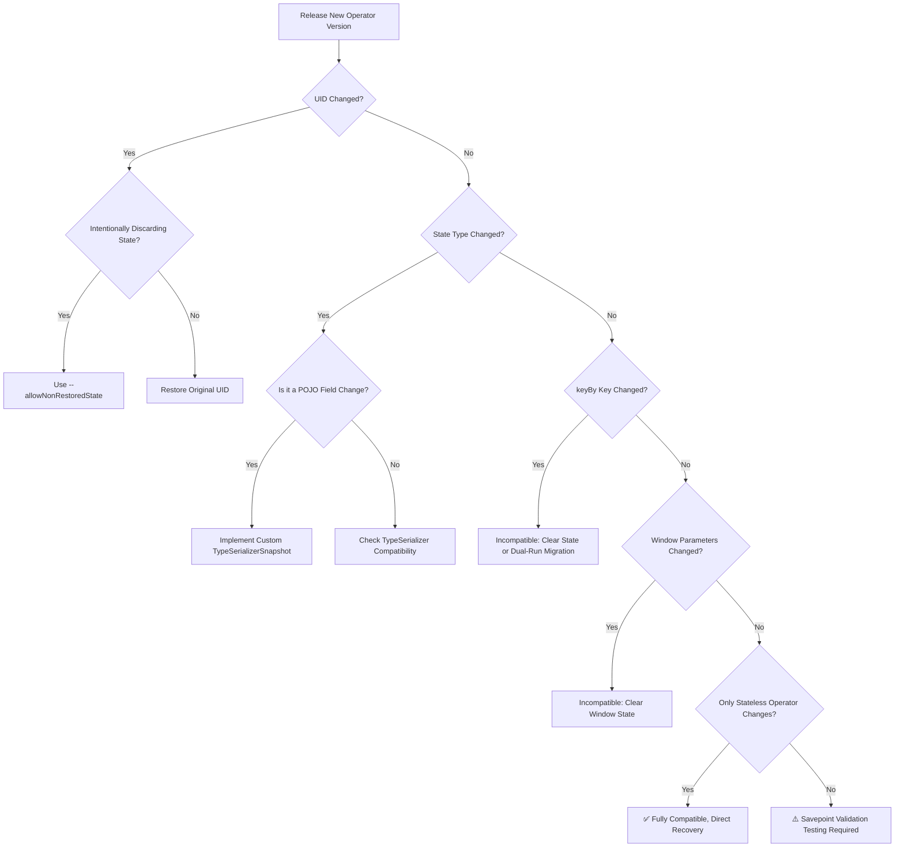
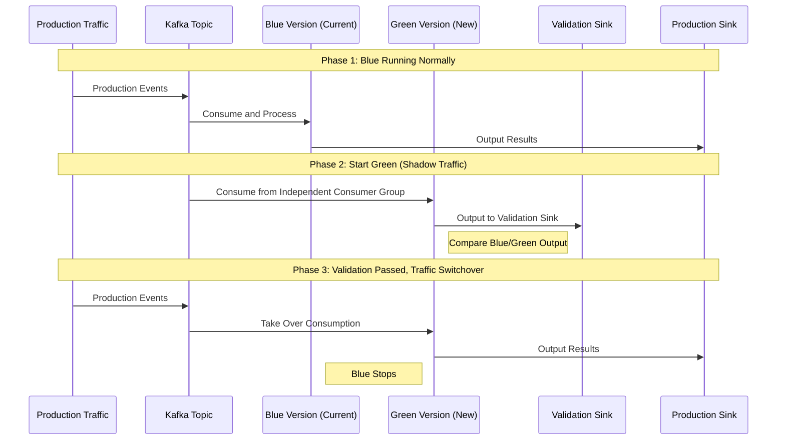
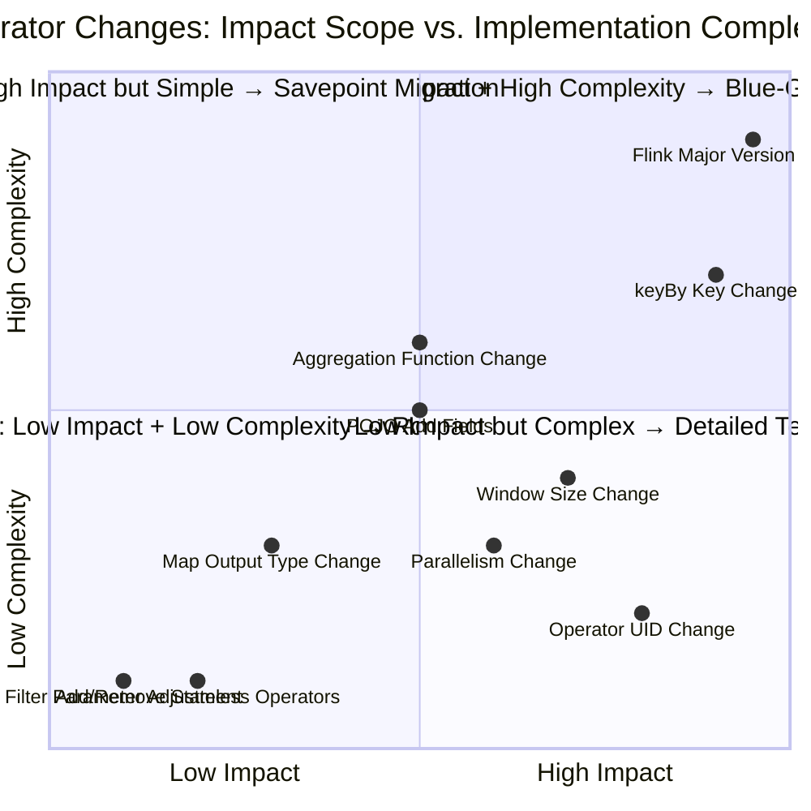

# Operator Evolution and Version Compatibility

> **Stage**: Knowledge/07-best-practices | **Prerequisites**: [01.10-process-and-async-operators.md](../Knowledge/01-concept-atlas/operator-deep-dive/01.10-process-and-async-operators.md), [operator-testing-and-verification-guide.md](operator-testing-and-verification-guide.md) | **Formalization Level**: L2-L3
> **Document Scope**: State compatibility of streaming operators, Savepoint migration, version upgrade strategies, and rollback mechanisms
> **Version**: 2026.04

---

## Table of Contents

- [Operator Evolution and Version Compatibility](#operator-evolution-and-version-compatibility)
  - [Table of Contents](#table-of-contents)
  - [1. Definitions](#1-definitions)
    - [Def-EVO-01-01: Operator State Compatibility (算子状态兼容性)](#def-evo-01-01-operator-state-compatibility-算子状态兼容性)
    - [Def-EVO-01-02: Savepoint Semantic Version (Savepoint语义版本)](#def-evo-01-02-savepoint-semantic-version-savepoint语义版本)
    - [Def-EVO-01-03: State Schema Evolution (状态Schema演化)](#def-evo-01-03-state-schema-evolution-状态schema演化)
    - [Def-EVO-01-04: Operator UID Stability (算子UID稳定性)](#def-evo-01-04-operator-uid-stability-算子uid稳定性)
    - [Def-EVO-01-05: Blue-Green Deployment and Shadow Traffic (蓝绿部署与影子流量)](#def-evo-01-05-blue-green-deployment-and-shadow-traffic-蓝绿部署与影子流量)
  - [2. Properties](#2-properties)
    - [Lemma-EVO-01-01: UID Change Causes State Loss (UID变更导致状态丢失)](#lemma-evo-01-01-uid-change-causes-state-loss-uid变更导致状态丢失)
    - [Lemma-EVO-01-02: Topological Commutativity of Stateless Operators (无状态算子的拓扑可交换性)](#lemma-evo-01-02-topological-commutativity-of-stateless-operators-无状态算子的拓扑可交换性)
    - [Prop-EVO-01-01: Incompatibility of Window Operator Parameter Changes (窗口算子参数变更的不兼容性)](#prop-evo-01-01-incompatibility-of-window-operator-parameter-changes-窗口算子参数变更的不兼容性)
    - [Prop-EVO-01-02: Data Redistribution Requirement for keyBy Key Selector Changes (keyBy键选择器变更的数据重分布需求)](#prop-evo-01-02-data-redistribution-requirement-for-keyby-key-selector-changes-keyby键选择器变更的数据重分布需求)
  - [3. Relations](#3-relations)
    - [3.1 Change Type and Compatibility Matrix](#31-change-type-and-compatibility-matrix)
    - [3.2 Version Upgrade Strategy Comparison](#32-version-upgrade-strategy-comparison)
    - [3.3 Relationship with Other Project Documents](#33-relationship-with-other-project-documents)
  - [4. Argumentation](#4-argumentation)
    - [4.1 Why StateSchemaEvolution Is So Difficult](#41-why-stateschemaevolution-is-so-difficult)
    - [4.2 Special Challenges of Flink Version Upgrades](#42-special-challenges-of-flink-version-upgrades)
    - [4.3 State Repartitioning for Parallelism Changes](#43-state-repartitioning-for-parallelism-changes)
  - [5. Proof / Engineering Argument](#5-proof--engineering-argument)
    - [5.1 Compatibility Checklist](#51-compatibility-checklist)
    - [5.2 Custom State Migration Pattern](#52-custom-state-migration-pattern)
    - [5.3 Blue-Green Deployment Implementation Process](#53-blue-green-deployment-implementation-process)
  - [6. Examples](#6-examples)
    - [6.1 Hands-on: Window Aggregation Parameter Upgrade](#61-hands-on-window-aggregation-parameter-upgrade)
    - [6.2 Hands-on: POJO State Field Extension](#62-hands-on-pojo-state-field-extension)
  - [7. Visualizations](#7-visualizations)
    - [Version Compatibility Decision Tree](#version-compatibility-decision-tree)
    - [Blue-Green Deployment Sequence Diagram](#blue-green-deployment-sequence-diagram)
    - [State Compatibility Matrix](#state-compatibility-matrix)
  - [8. References](#8-references)

---

## 1. Definitions

### Def-EVO-01-01: Operator State Compatibility (算子状态兼容性)

Operator State Compatibility (算子状态兼容性) refers to the binary property of whether a new operator version $Op_{v2}$ can restore state from a checkpoint/savepoint saved by the old version $Op_{v1}$ and continue to operate correctly:

$$\text{Compatible}(Op_{v1}, Op_{v2}) = \begin{cases} \text{true} & \text{if } \forall s \in \text{State}(Op_{v1}), \exists f: s \mapsto s' \in \text{State}(Op_{v2}) \\ \text{false} & \text{otherwise} \end{cases}$$

where $f$ is the State Migration Function (状态迁移函数).

### Def-EVO-01-02: Savepoint Semantic Version (Savepoint语义版本)

The semantic version of a Savepoint follows the $Major.Minor.Patch$ scheme:

- **Major Change**: Pipeline topology changes (adding, removing, or reordering operators); incompatible recovery
- **Minor Change**: Operator parameter adjustments (window size, TTL, etc.); requires a state adaptation function
- **Patch Change**: Pure bug fixes or performance optimizations; fully compatible recovery

### Def-EVO-01-03: State Schema Evolution (状态Schema演化)

State Schema Evolution (状态Schema演化) refers to the handling strategy when the data types of an operator's internal ValueState/MapState/ListState change:

$$\text{SchemaEvolution}(T_{old}, T_{new}) \in \{\text{IDENTITY}, \text{UPCAST}, \text{MIGRATION}, \text{BREAKING}\}$$

| Type | Example | Handling |
|------|---------|----------|
| IDENTITY | `String` → `String` | Direct Restore |
| UPCAST | `int` → `long` | Automatic Type Promotion |
| MIGRATION | `UserV1{name,age}` → `UserV2{name,age,email}` | Custom Migration Function |
| BREAKING | `String` → `POJO` (no default constructor) | Incompatible; State Must Be Cleared |

### Def-EVO-01-04: Operator UID Stability (算子UID稳定性)

The Operator UID (算子UID) is the identifier Flink uses to locate an operator's state within a Savepoint. UID stability is defined as:

$$\text{UIDStable} = \forall t_1, t_2: \text{UID}(Op, t_1) = \text{UID}(Op, t_2)$$

If the UID changes, the state in the Savepoint cannot be automatically associated with the new operator.

### Def-EVO-01-05: Blue-Green Deployment and Shadow Traffic (蓝绿部署与影子流量)

Blue-Green Deployment (蓝绿部署) refers to running two versions of a job simultaneously (Blue is the current production version, Green is the new version), achieving zero-downtime upgrades through traffic switching. Shadow Traffic (影子流量) means replicating production traffic to the Green version simultaneously without affecting actual output, used to verify the correctness of the new version.

---

## 2. Properties

### Lemma-EVO-01-01: UID Change Causes State Loss (UID变更导致状态丢失)

If the UID of operator $Op$ changes from $uid_1$ to $uid_2$, then when restoring from a Savepoint containing $uid_1$:

$$\text{State}_{recovered}(Op_{uid_2}) = \emptyset$$

**Proof**: A Flink Savepoint uses the UID as the state index key. The new UID has no corresponding entry in the Savepoint; therefore, the operator's state is the empty set upon recovery. ∎

### Lemma-EVO-01-02: Topological Commutativity of Stateless Operators (无状态算子的拓扑可交换性)

For stateless operators (map/filter/flatMap), if only the order of adjacent operators is swapped without changing semantics:

$$Op_1 \circ Op_2 = Op_2' \circ Op_1' \Rightarrow \text{Compatible}(\text{Savepoint}(Op_1 \circ Op_2), \text{Savepoint}(Op_2' \circ Op_1'))$$

**Proof**: Stateless operators do not persist any state data; therefore, the Savepoint does not contain state entries for these operators. Topological changes do not affect the state mapping of stateful operators. ∎

### Prop-EVO-01-01: Incompatibility of Window Operator Parameter Changes (窗口算子参数变更的不兼容性)

When the Tumbling window size is changed from $W_1$ to $W_2$ ($W_1 \neq W_2$), the existing window state cannot be directly mapped:

$$\text{Compatible}(\text{Tumble}(W_1), \text{Tumble}(W_2)) = \text{false}, \quad W_1 \neq W_2$$

**Engineering Corollary**: Window parameter changes require clearing the window state (discarding incomplete window data) or using custom migration logic to redistribute old window data.

### Prop-EVO-01-02: Data Redistribution Requirement for keyBy Key Selector Changes (keyBy键选择器变更的数据重分布需求)

If the keyBy key selector changes from $key_1$ to $key_2$, the state must be repartitioned according to the new key:

$$\text{State}_{new}(key_2) = \bigoplus_{\{e: key_2(e) = k\}} \text{State}_{old}(key_1(e))$$

where $\bigoplus$ is the aggregation operation (depending on the specific operator semantics, such as SUM, COUNT, etc.).

---

## 3. Relations

### 3.1 Change Type and Compatibility Matrix

| Change Type | Example | Compatibility | Recovery Strategy |
|-------------|---------|---------------|-------------------|
| **Add Stateless Operator** | Add filter after map | ✅ Fully Compatible | Direct Recovery |
| **Remove Stateless Operator** | Remove redundant map | ✅ Fully Compatible | Direct Recovery |
| **Adjust Stateless Operator Parameters** | Change filter condition | ✅ Fully Compatible | Direct Recovery |
| **Add Stateful Operator** | Add window aggregate | ⚠️ Initial State Required | Use `--allowNonRestoredState` or custom initialization |
| **Remove Stateful Operator** | Remove aggregate | ⚠️ Allow Discarding State | Use `--allowNonRestoredState` |
| **Change UID** | Rename operator | ❌ Incompatible | Keep original value with `--uid` or state migration |
| **Change keyBy Key** | userId → sessionId | ❌ Incompatible | State Repartitioning or Clearing |
| **Change Window Parameters** | 1 minute → 5 minutes | ❌ Incompatible | Clear Window State |
| **Change State Type** | int → long | ✅ Automatically Compatible | Handled automatically by TypeSerializer |
| **Change POJO Structure** | Add fields | ⚠️ Migration Function Required | Implement `StateTtlConfig` or custom `TypeSerializer` |
| **Change Parallelism** | 4 → 8 | ⚠️ Limited Compatibility | Flink automatically repartitions state (RocksDB backend) |

### 3.2 Version Upgrade Strategy Comparison

```
Upgrade Strategies
├── Rolling Upgrade
│   ├── Applicable: Stateless operators or Patch changes
│   └── Characteristic: Restart TaskManagers one by one without interrupting data processing
├── Savepoint-Stop-Resume
│   ├── Applicable: Minor changes (parameter adjustments)
│   └── Characteristic: Short downtime, state fully preserved
├── Blue-Green Deployment
│   ├── Applicable: Major changes or high-risk releases
│   └── Characteristic: Zero downtime, requires dual resources, traffic can be switched back in seconds
└── Shadow Traffic Validation
    ├── Applicable: Major changes to core pipelines
    └── Characteristic: Validate with replicated production traffic without affecting actual business
```

### 3.3 Relationship with Other Project Documents

- [operator-testing-and-verification-guide.md](operator-testing-and-verification-guide.md): Compatibility testing methods before upgrades
- [01.10-process-and-async-operators.md](../Knowledge/01-concept-atlas/operator-deep-dive/01.10-process-and-async-operators.md): Serialization control for ProcessFunction custom states
- [02.06-stream-operator-algebra.md](../Struct/02-properties/02.06-stream-operator-algebra.md): Theoretical foundations for operator commutativity and topological transformations

---

## 4. Argumentation

### 4.1 Why StateSchemaEvolution Is So Difficult

The state of a stream processing system is **continuously accumulated**, unlike a batch processing system that "starts from scratch every time":

- **Batch Processing**: Modifying the schema only requires rerunning the job, with no historical burden
- **Stream Processing**: State may contain historical aggregation data spanning hours/days/months; schema changes must be compatible with this data

**Typical Case**: A user profiling system has been running for 6 months, and its MapState has accumulated tag data for 100 million users. At this point, a `vipLevel` field needs to be added to the UserProfile POJO:

- Batch processing: Simply modify the code and rerun
- Stream processing: Must ensure that `vipLevel` has a reasonable default value for old data, or provide migration logic

### 4.2 Special Challenges of Flink Version Upgrades

Flink major version upgrades (e.g., 1.x → 2.x) involve:

1. **Savepoint Format Changes**: The new format may be unable to read old Savepoints
2. **Serializer Changes**: TypeSerializerSnapshot format may be incompatible
3. **API Deprecation**: Certain methods in the DataStream API may be removed

**Mitigation Strategies**:

- Minor version upgrade (1.17 → 1.18): Upgrade directly, usually compatible
- Major version upgrade (1.x → 2.x): Must migrate via Savepoint and requires testing and validation

### 4.3 State Repartitioning for Parallelism Changes

Flink automatically handles state repartitioning when parallelism changes during recovery:

**Scaling Scenarios**:

- 4 parallelism → 8 parallelism: The state of each old partition is redistributed to 2 new partitions according to the new key partition function
- 8 parallelism → 4 parallelism: The state of every 2 old partitions is merged into 1 new partition

**Limitations**:

- Only applicable to keyed state (naturally repartitionable by key hash)
- Operator state (e.g., Broadcast state) requires a custom `OperatorStateRepartitioner`

---

## 5. Proof / Engineering Argument

### 5.1 Compatibility Checklist

Before releasing a new operator version, verify each item in the following checklist:

```markdown
□ Does the UID remain unchanged? (Unless intentionally discarding state)
□ Have the operator input/output types changed?
□ Have the operator state types (ValueState/MapState/ListState/ReducingState) changed?
□ Have fields in the state POJO been added, removed, or modified?
□ Has the keyBy key selector changed?
□ Have the window type or window parameters changed?
□ Has the aggregation function changed?
□ Has the TTL configuration changed?
□ Is the TypeSerializer custom? Has the SerializerSnapshot been upgraded?
□ Is the parallelism range compatible with the Savepoint?
```

### 5.2 Custom State Migration Pattern

When automatic compatibility is insufficient, implement a custom `StateMigrationFunction`:

```java
public class UserProfileMigration
    implements StateMigrationFunction<UserProfileV1, UserProfileV2> {

    @Override
    public UserProfileV2 migrate(UserProfileV1 oldValue) {
        return UserProfileV2.builder()
            .userId(oldValue.getUserId())
            .name(oldValue.getName())
            .age(oldValue.getAge())
            .email("unknown@example.com")  // Default value for new field
            .vipLevel(0)                  // Default value for new field
            .build();
    }
}

// Register migration
env.getConfig().registerTypeWithKryoSerializer(
    UserProfileV2.class,
    new MigratingSerializer<>(new UserProfileMigration())
);
```

### 5.3 Blue-Green Deployment Implementation Process

**Phase 1: Green Version Deployment**

```bash
# 1. Start Green version from the current Blue version's Savepoint
flink run -s hdfs://savepoints/blue-v1.0 -d green-job.jar

# 2. Configure shadow traffic (via Kafka Consumer Group or traffic replication)
# Green version consumes from an independent Consumer Group, not affecting Blue's offset commits
```

**Phase 2: Validate Green Version**

- Compare Blue and Green outputs to an independent validation Sink
- Check metrics such as latency, throughput, state size, and error rate
- Run for at least 2 business cycles (e.g., 2 days)

**Phase 3: Traffic Switchover**

```bash
# 1. Stop Blue version (retain Savepoint)
flink cancel -s hdfs://savepoints/blue-final <blue-job-id>

# 2. Green version takes over production traffic (switch Kafka Consumer Group or load balancer)
```

**Phase 4: Rollback Preparation**

- Retain the Blue version Savepoint for at least 7 days
- If issues are found in Green, the Blue version can be immediately restored from the `blue-final` Savepoint

---

## 6. Examples

### 6.1 Hands-on: Window Aggregation Parameter Upgrade

**Scenario**: Real-time UV statistics, originally with a 1-minute window; business requirements change to 5 minutes for more stable statistics.

**Analysis**:

- Window type unchanged (TumblingEventTimeWindows)
- Window size changed from 1 minute to 5 minutes
- According to Prop-EVO-01-01, incompatible

**Solution Selection**:

| Solution | Description | Data Loss | Complexity |
|----------|-------------|-----------|------------|
| A: Clear State and Restart | Modify parameters directly, discard old window state | Lose current incomplete windows | Low |
| B: Dual Window Parallel Run | Run both 1-minute and 5-minute jobs simultaneously | None | High (double resources) |
| C: Smooth Migration | New job recovers from Savepoint with custom window state transformation | None | High |

**Recommended Solution A** (Applicable to scenarios where minute-level data loss is acceptable):

```java
// New code
stream.keyBy(Event::getPageId)
    .window(TumblingEventTimeWindows.of(Time.minutes(5)))  // Changed from 1 to 5
    .aggregate(new UvAggregate());

// Launch command: allow non-restored state
flink run -s hdfs://savepoints/old -d new-job.jar \
    --allowNonRestoredState
```

### 6.2 Hands-on: POJO State Field Extension

**Scenario**: Order aggregation state is extended from `OrderStats{count, totalAmount}` to `OrderStats{count, totalAmount, avgAmount, maxAmount}`.

**Migration Implementation**:

```java
// Old version POJO
public class OrderStatsV1 implements Serializable {
    private long count;
    private BigDecimal totalAmount;
}

// New version POJO
public class OrderStatsV2 implements Serializable {
    private long count;
    private BigDecimal totalAmount;
    private BigDecimal avgAmount;  // Newly added
    private BigDecimal maxAmount;  // Newly added
}

// Custom TypeSerializerSnapshot
public class OrderStatsV2SerializerSnapshot
    extends CompositeTypeSerializerSnapshot<OrderStatsV2, OrderStatsV2Serializer> {

    private static final int CURRENT_VERSION = 2;

    @Override
    protected int getCurrentOuterSnapshotVersion() {
        return CURRENT_VERSION;
    }

    @Override
    protected TypeSerializer<OrderStatsV2> createOuterSerializerWithNestedSerializers(
            TypeSerializer<?>[] nestedSerializers) {
        return new OrderStatsV2Serializer();
    }

    @Override
    protected TypeSerializer<?>[] getNestedSerializers(TypeSerializer<OrderStatsV2> outerSerializer) {
        return new TypeSerializer[0];
    }

    // Migration logic when restoring from old version
    @Override
    protected OrderStatsV2Serializer restoreOuterSerializer(
            int readOuterSnapshotVersion,
            TypeSerializer<?>[] restoredNestedSerializers) {
        if (readOuterSnapshotVersion == 1) {
            // Migrate from V1 to V2
            return new OrderStatsV2Serializer.WithMigration();
        }
        return new OrderStatsV2Serializer();
    }
}
```

---

## 7. Visualizations

### Version Compatibility Decision Tree



### Blue-Green Deployment Sequence Diagram



### State Compatibility Matrix



---

## 8. References

---

*Related Documents*: [operator-testing-and-verification-guide.md](operator-testing-and-verification-guide.md) | [02.06-stream-operator-algebra.md](../Struct/02-properties/02.06-stream-operator-algebra.md) | [01.10-process-and-async-operators.md](../Knowledge/01-concept-atlas/operator-deep-dive/01.10-process-and-async-operators.md)
