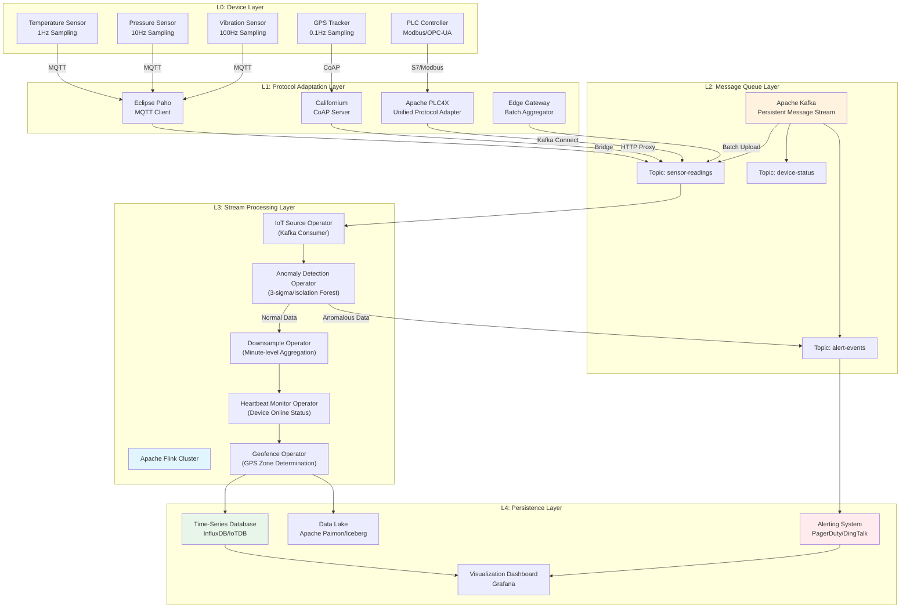
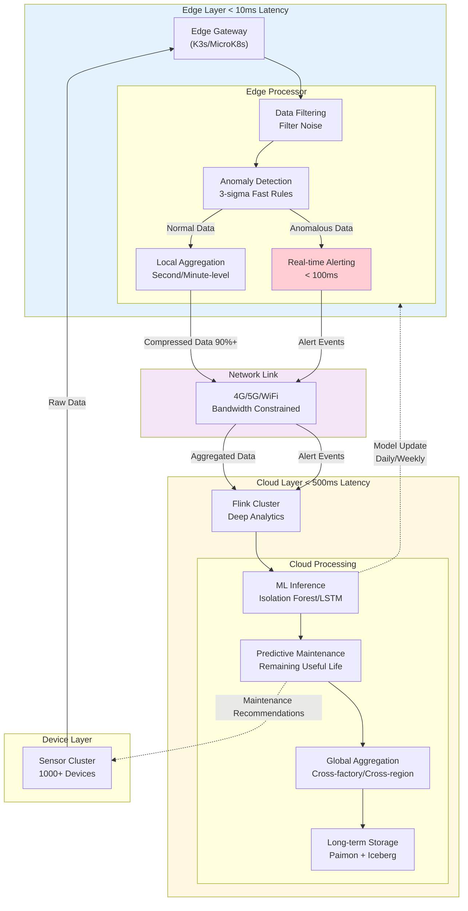
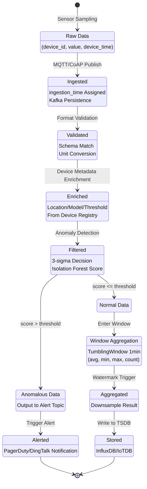
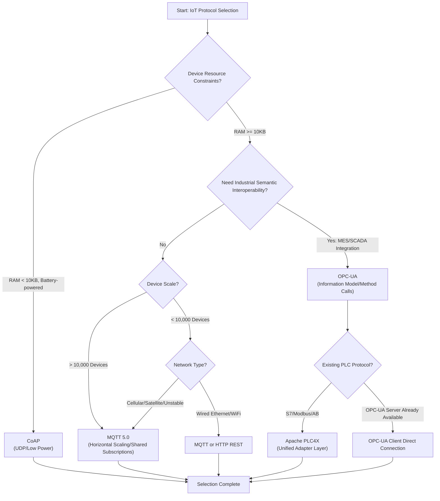

# Stream Processing Operators and IoT Integration: Real-Time Pipelines from Device to Cloud

> **Stage**: Knowledge/06-frontier | **Prerequisites**: [Edge Streaming Architecture](edge-streaming-architecture.md), [Flink State Management and Fault Tolerance](../Flink/02-core/02.02-state/flink-state-management-complete-guide.md) | **Formalization Level**: L4-L5

**Document Version**: v1.0 | **Last Updated**: 2026-04-30 | **Status**: Frontier Extension

---

## Table of Contents

- [Stream Processing Operators and IoT Integration: Real-Time Pipelines from Device to Cloud](#stream-processing-operators-and-iot-integration-real-time-pipelines-from-device-to-cloud)
  - [Table of Contents](#table-of-contents)
  - [1. Definitions](#1-definitions)
    - [Def-IOT-01-01: IoT Data Stream Model](#def-iot-01-01-iot-data-stream-model)
    - [Def-IOT-01-02: Temporal Data Tuple](#def-iot-01-02-temporal-data-tuple)
    - [Def-IOT-01-03: Out-of-Order Tolerance](#def-iot-01-03-out-of-order-tolerance)
    - [Def-IOT-01-04: IoT Source Operator](#def-iot-01-04-iot-source-operator)
    - [Def-IOT-01-05: Edge Gateway Aggregator](#def-iot-01-05-edge-gateway-aggregator)
    - [Def-IOT-01-06: Data Downsample Operator](#def-iot-01-06-data-downsample-operator)
    - [Def-IOT-01-07: Device Heartbeat Monitor Operator](#def-iot-01-07-device-heartbeat-monitor-operator)
    - [Def-IOT-01-08: Geofence Operator](#def-iot-01-08-geofence-operator)
  - [2. Properties](#2-properties)
    - [Prop-IOT-01-01: IoT Data Volume Estimation Proposition](#prop-iot-01-01-iot-data-volume-estimation-proposition)
    - [Prop-IOT-01-02: Impact of Out-of-Order Data on Window Accuracy](#prop-iot-01-02-impact-of-out-of-order-data-on-window-accuracy)
    - [Lemma-IOT-01-01: Downsample Storage Compression Ratio Lemma](#lemma-iot-01-01-downsample-storage-compression-ratio-lemma)
    - [Lemma-IOT-01-02: Edge Preprocessing Bandwidth Saving Lemma](#lemma-iot-01-02-edge-preprocessing-bandwidth-saving-lemma)
    - [Lemma-IOT-01-03: Heartbeat Detection Latency Lower Bound Lemma](#lemma-iot-01-03-heartbeat-detection-latency-lower-bound-lemma)
  - [3. Relations](#3-relations)
    - [3.1 IoT Protocol to Stream Processing System Mapping](#31-iot-protocol-to-stream-processing-system-mapping)
    - [3.2 Edge-Cloud Collaborative Data Flow Relations](#32-edge-cloud-collaborative-data-flow-relations)
    - [3.3 IoT Operators vs. Flink Native Operators](#33-iot-operators-vs-flink-native-operators)
  - [4. Argumentation](#4-argumentation)
    - [4.1 MQTT vs CoAP vs OPC-UA Selection Argumentation](#41-mqtt-vs-coap-vs-opc-ua-selection-argumentation)
    - [4.2 Anomaly Detection Algorithm Selection Argumentation](#42-anomaly-detection-algorithm-selection-argumentation)
    - [4.3 Edge-Cloud Collaborative Architecture Decision Argumentation](#43-edge-cloud-collaborative-architecture-decision-argumentation)
  - [5. Formal Proof / Engineering Argument](#5-formal-proof--engineering-argument)
    - [Thm-IOT-01-01: IoT Pipeline End-to-End Correctness Theorem](#thm-iot-01-01-iot-pipeline-end-to-end-correctness-theorem)
    - [Thm-IOT-01-02: Edge-Cloud Collaboration Optimality Theorem](#thm-iot-01-02-edge-cloud-collaboration-optimality-theorem)
  - [6. Examples](#6-examples)
    - [6.1 Complete Pipeline: MQTT Source + Anomaly Detection + Downsample](#61-complete-pipeline-mqtt-source--anomaly-detection--downsample)
    - [6.2 Edge-Cloud Collaborative Implementation: Heartbeat Monitor + Batch Aggregation](#62-edge-cloud-collaborative-implementation-heartbeat-monitor--batch-aggregation)
    - [6.3 Industrial Scenario: OPC-UA + PLC4X Integration](#63-industrial-scenario-opc-ua--plc4x-integration)
  - [7. Visualizations](#7-visualizations)
    - [7.1 IoT Pipeline Architecture Diagram](#71-iot-pipeline-architecture-diagram)
    - [7.2 Edge-Cloud Collaborative Architecture Diagram](#72-edge-cloud-collaborative-architecture-diagram)
    - [7.3 Temporal Data Model Diagram](#73-temporal-data-model-diagram)
    - [7.4 IoT Protocol Selection Decision Matrix](#74-iot-protocol-selection-decision-matrix)
  - [8. References](#8-references)

---

## 1. Definitions

### Def-IOT-01-01: IoT Data Stream Model

The **IoT Data Stream Model (IoT数据流模型)** is defined as a nonuple:

$$\mathcal{I} = \langle \mathcal{D}, \mathcal{S}, \mathcal{T}, \mathcal{P}, \mathcal{G}, \mathcal{A}, \mathcal{N}, \mathcal{W}, \mathcal{R} \rangle$$

Where:

- $\mathcal{D} = \{d_1, d_2, ..., d_n\}$: Set of devices, $|D|$ can reach $10^5$ ~ $10^7$ scale
- $\mathcal{S}$: Set of sensor types, $\mathcal{S} = \{temperature, pressure, humidity, vibration, gps, ...\}$
- $\mathcal{T}: \mathcal{D} \times \mathcal{S} \rightarrow \mathbb{T}$: Sampling timestamp function
- $\mathcal{P}: \mathcal{D} \times \mathcal{S} \rightarrow \mathbb{R}$: Sensor reading value function
- $\mathcal{G}: \mathcal{D} \rightarrow (lat, lon, alt)$: Device geolocation function
- $\mathcal{A}: \mathcal{D} \rightarrow \{active, offline, maintenance\}$: Device status function
- $\mathcal{N}$: Network topology, characterizing the connection relationship between devices and gateways
- $\mathcal{W}$: Out-of-order tolerance window, $\mathcal{W}: \mathcal{D} \rightarrow \Delta t$
- $\mathcal{R}$: Reliability requirement, $\mathcal{R} \in \{at\text{-}least\text{-}once, exactly\text{-}once\}$

**Four Core Characteristics of IoT Data**:

| Characteristic | Description | Impact on Stream Processing |
|----------------|-------------|----------------------------|
| **High-Concurrency Devices** | A single factory may deploy 10,000+ sensors[^1], generating 864 million data points per day | Requires horizontally scalable Source operators |
| **Temporal Data** | Each reading is bound to a device timestamp, forming a strict time series | Must use the Event Time (事件时间) processing model |
| **Out-of-Order Arrival** | Sensors on cellular/satellite networks may buffer readings and flush in batches, with delays reaching minutes[^2] | Watermark mechanism is indispensable |
| **Sensor Outliers** | Device failures and electromagnetic interference cause reading spikes (outlier) | Requires in-stream anomaly detection operators |

---

### Def-IOT-01-02: Temporal Data Tuple

The **Temporal Data Tuple (时序数据元组)** is the basic data unit in an IoT stream:

$$e = (device\_id, sensor\_type, value, unit, device\_time, ingestion\_time, metadata)$$

Where:

- $device\_id \in String$: Globally unique device identifier
- $sensor\_type \in \mathcal{S}$: Sensor type
- $value \in \mathbb{R}$: Reading value
- $unit \in String$: Unit of measurement (e.g., `celsius`, `psi`, `mm/s`)
- $device\_time \in Timestamp$: Sensor local sampling time (event time)
- $ingestion\_time \in Timestamp$: Time when data enters the stream processing system (ingestion time)
- $metadata \in Map<String, String>$: Additional metadata (firmware version, signal strength, etc.)

**Key Constraint**: $device\_time \leq ingestion\_time$ (sensor time cannot be later than ingestion time).

---

### Def-IOT-01-03: Out-of-Order Tolerance

**Out-of-Order Tolerance (乱序容忍度)** $\mathcal{W}$ is defined as the maximum event-time lag that the system can correctly process:

$$\mathcal{W} = \max\{ \Delta t \mid \forall e \in Stream: ingestion\_time(e) - device\_time(e) \leq \Delta t \}$$

In Flink, the Watermark strategy is configured as:

```
WATERMARK FOR device_time AS device_time - INTERVAL '30' SECOND
```

For cellular-network sensors, $\mathcal{W}$ is typically set to **30 seconds ~ 5 minutes**; for satellite-connected remote sensors, $\mathcal{W}$ may need to reach **10 minutes or more**[^2].

---

### Def-IOT-01-04: IoT Source Operator

The **IoT Source Operator (IoT Source算子)** is the standard interface that reads data from physical devices or protocol gateways and converts it into a data stream:

$$\text{IoTSource}: Protocol \times Endpoint \rightarrow DataStream\langle e \rangle$$

Current mainstream IoT Source operators include:

| Source Type | Protocol Layer | Applicable Scenario | Flink Integration Method |
|-------------|---------------|---------------------|--------------------------|
| **MQTT Source** | Application layer (Pub/Sub) | General IoT, connected vehicles, smart home | Eclipse Paho client + Kafka Bridge |
| **CoAP Source** | Application layer (REST-like) | Resource-constrained devices, low-power sensor networks | Custom Source + Californium library |
| **OPC-UA Source** | Application layer (Client/Server) | Industrial automation, PLC communication | Apache PLC4X + Kafka Connect |
| **Modbus Source** | Transport layer (Master/Slave) | Legacy devices, RS-485 bus | Apache PLC4X passive mode driver |
| **Edge Gateway Source** | Batch aggregation | Large-scale device clusters, offline tolerance | HTTP/MQTT batch upload interface |

**MQTT Source (Eclipse Paho Integration)**:

MQTT is the de-facto standard protocol in the IoT domain. Eclipse Paho provides a Java client implementation, and the Flink community integrates it via `flink-connector-mqtt`[^3]. Key configuration parameters:

- `brokerUrl`: MQTT Broker address (e.g., `tcp://broker.hivemq.com:1883`)
- `clientId`: Client identifier (must be globally unique)
- `topic`: Subscription topic (supports wildcards `+` and `#`)
- `qos`: Quality of Service level (0=at most once, 1=at least once, 2=exactly once)

> **Engineering Recommendation**: MQTT itself is not a distributed message queue and lacks the highest level of reliability guarantees. In production environments, MQTT should be bridged to Kafka via a Kafka Bridge, leveraging Kafka's persistence, partitioning, and replay capabilities, and then consumed by Flink[^3].

---

### Def-IOT-01-05: Edge Gateway Aggregator

The **Edge Gateway Aggregator (边缘网关聚合器)** is a lightweight stream processing component deployed at edge nodes, responsible for aggregating raw data streams from multiple devices into batch upload streams:

$$\text{GatewayAggregator}: \{Stream\langle e \rangle\}_{i=1}^{n} \rightarrow Stream\langle Batch\langle e \rangle \rangle$$

Aggregation strategies include:

- **Time-triggered**: Send a batch every $T$ seconds or when each window expires
- **Count-triggered**: Send a batch every $N$ accumulated records
- **Size-triggered**: Send a batch when it reaches $B$ bytes

---

### Def-IOT-01-06: Data Downsample Operator

The **Data Downsample Operator (数据降采样算子)** $Downsample_{\Delta}$ compresses high-frequency temporal data into a low-frequency aggregated representation while preserving key statistical characteristics:

$$Downsample_{\Delta}: Stream\langle e_{t_1}, e_{t_2}, ... \rangle \rightarrow Stream\langle \bar{e}_{\tau_1}, \bar{e}_{\tau_2}, ... \rangle$$

Where $\tau_j = [t_j, t_j + \Delta)$ is the downsample window, and $\bar{e}_{\tau_j}$ contains:

$$\bar{e}_{\tau_j} = (device\_id, avg(value), min(value), max(value), count, stddev, \tau_j^{start})$$

**Downsample Levels**:

| Original Sampling Rate | Downsample Target | Compression Ratio | Applicable Analysis |
|------------------------|-------------------|-------------------|---------------------|
| 1 Hz (1 second) | 1-minute average | 60:1 | Real-time monitoring |
| 1 Hz | 1-hour average | 3,600:1 | Trend analysis |
| 100 Hz | 1-minute statistics | 6,000:1 | Vibration monitoring |

---

### Def-IOT-01-07: Device Heartbeat Monitor Operator

The **Device Heartbeat Monitor Operator (设备心跳监控算子)** $HeartbeatMon_{T_{timeout}}$ detects whether a device has reported data within the specified time window:

$$HeartbeatMon_{T_{timeout}}(device\_id, t_{last}) = \begin{cases} online & \text{if } t_{now} - t_{last} \leq T_{timeout} \\ offline & \text{otherwise} \end{cases}$$

For periodically reporting devices (e.g., reporting every 60 seconds), $T_{timeout}$ is typically set to $2 \times T_{period}$; for event-driven devices, $T_{timeout}$ is dynamically adjusted based on business rules.

---

### Def-IOT-01-08: Geofence Operator

The **Geofence Operator (地理围栏算子)** $GeoFence_{(c, r)}$ determines whether a device is located within a specified geographic area based on GPS coordinates:

$$GeoFence_{(c, r)}(lat, lon) = \begin{cases} inside & \text{if } d_{haversine}((lat, lon), c) \leq r \\ outside & \text{otherwise} \end{cases}$$

Where $d_{haversine}$ is the Haversine spherical distance formula, $c = (lat_c, lon_c)$ is the fence center, and $r$ is the radius (meters). When supporting polygon fences, the Ray Casting algorithm is used to determine whether a point is inside a polygon.

---


## 2. Properties

### Prop-IOT-01-01: IoT Data Volume Estimation Proposition

**Proposition**: The IoT data generation rate of a single medium-scale manufacturing shop floor is:

$$R_{total} = \sum_{i=1}^{n} f_i \cdot s_i$$

Where $f_i$ is the sampling frequency of the $i$-th sensor type, and $s_i$ is the quantity of that sensor type.

**Example Calculation**:

- Temperature sensors: 1,000 units × 1 Hz = 1,000 events/s
- Pressure sensors: 500 units × 10 Hz = 5,000 events/s
- Vibration sensors: 200 units × 100 Hz = 20,000 events/s
- GPS trackers: 300 units × 0.1 Hz = 30 events/s

**Total**: $R_{total} \approx 26,030$ events/s, i.e., **2.25 billion records/day**, with raw data volume of approximately **180 GB/day** (assuming 80 bytes per record).

---

### Prop-IOT-01-02: Impact of Out-of-Order Data on Window Accuracy

**Proposition**: Let the out-of-order tolerance be $\mathcal{W}$ and the window size be $W$, then the proportion of windows requiring recomputation due to out-of-order events is:

$$\rho = \frac{\mathcal{W}}{W + \mathcal{W}}$$

- When $\mathcal{W} \ll W$, $\rho \approx 0$, and the out-of-order impact is negligible
- When $\mathcal{W} \approx W$, $\rho \approx 0.5$, and nearly half of the windows require recomputation
- When $\mathcal{W} \gg W$, $\rho \approx 1$, and almost all windows are in an uncertain state

**Engineering Corollary**: For satellite-connected IoT devices ($\mathcal{W} = 10min$), if using a tumbling window with $W = 1min$, then $\rho \approx 0.91$. In this case, a **Session Window** or **Global Window + Trigger** should be considered as alternatives to fixed windows.

---

### Lemma-IOT-01-01: Downsample Storage Compression Ratio Lemma

**Lemma**: Downsampling raw temporal data to minute-level aggregation can achieve a storage compression ratio of **over 90%**[^2].

**Proof Sketch**:
Raw data: $N$ records, each $B_{raw}$ bytes.
After downsampling: $N / 60$ aggregated records, each containing $avg, min, max, count, stddev$ (5 Doubles + 1 Long + 1 Timestamp), approximately $B_{agg} = 56$ bytes.

$$\text{Compression Ratio} = 1 - \frac{(N/60) \cdot B_{agg}}{N \cdot B_{raw}} = 1 - \frac{B_{agg}}{60 \cdot B_{raw}}$$

Taking $B_{raw} = 80$ bytes, $B_{agg} = 56$ bytes:

$$\text{Compression Ratio} = 1 - \frac{56}{4800} \approx 98.8\%$$

---

### Lemma-IOT-01-02: Edge Preprocessing Bandwidth Saving Lemma

**Lemma**: Performing data pre-filtering and aggregation at the edge can reduce upload data volume by **70-95%**[^4].

**Proof Sketch**:
Let the edge filtering condition retention ratio be $\alpha$ (typically $\alpha = 0.05$ ~ $0.3$), and the edge aggregation compression ratio be $\beta$ (typically $\beta = 0.01$ ~ $0.1$), then:

$$\text{Bandwidth Reduction} = 1 - (\alpha \cdot \beta) = 0.70 \sim 0.995$$

**Example**: In a smart factory scenario, after edge FFT feature extraction on raw vibration data, only frequency-domain peaks and alarm status are uploaded, reducing data rate from 100 Hz to 0.1 Hz, achieving a compression ratio of **99.9%**.

---

### Lemma-IOT-01-03: Heartbeat Detection Latency Lower Bound Lemma

**Lemma**: The minimum false-positive–false-negative trade-off latency for device heartbeat detection is:

$$T_{optimal} = T_{period} + \sqrt{\frac{2\sigma^2 \cdot \ln(1/\delta)}{f^2}}$$

Where $T_{period}$ is the device's normal reporting period, $\sigma$ is the network jitter standard deviation, $\delta$ is the acceptable false-positive rate, and $f$ is the sampling frequency.

**Intuitive Explanation**: If $T_{timeout}$ is set too short, network jitter causes a large number of false positives; if set too long, the detection delay for actual device failures increases. The optimal value lies in the $2T_{period}$ ~ $3T_{period}$ range.

---

## 3. Relations

### 3.1 IoT Protocol to Stream Processing System Mapping

The mapping between the IoT protocol stack and stream processing systems follows a **"Protocol Adaptation → Message Queue → Stream Engine"** three-layer model:

| Protocol | Adaptation Layer | Message Queue | Stream Processing Engine | Typical Latency |
|----------|-----------------|---------------|--------------------------|-----------------|
| MQTT 5.0 | Eclipse Paho / HiveMQ | Kafka (MQTT Bridge) | Flink | 50-200ms |
| CoAP | Californium | Kafka (HTTP Proxy) | Flink | 100-500ms |
| OPC-UA | Apache PLC4X | Kafka Connect | Flink | 10-100ms |
| Modbus TCP | PLC4X (passive mode) | Kafka Connect | Flink | 5-50ms |
| HTTP REST | Gateway Aggregator | Kafka REST Proxy | Flink | 200-1000ms |

> **Key Insight**: OPC-UA and PLC4X are complementary rather than competitive. PLC4X provides a unified API to access multiple PLC native protocols (S7, Modbus, EtherNet/IP, etc.) without modifying existing hardware; OPC-UA provides standardized information modeling and semantic interoperability. The two can be used together: PLC4X serves as the adaptation layer to read PLC data, which is then exposed externally via an OPC-UA Server[^5][^6].

---

### 3.2 Edge-Cloud Collaborative Data Flow Relations

The data flow in an edge-cloud collaborative architecture can be formalized as a directed acyclic graph $G = (V, E)$:

$$V = V_{edge} \cup V_{cloud}, \quad E \subseteq V \times V$$

Where edge $(u, v) \in E$ is labeled as one of the following types:

| Edge Type | Source | Target | Data Content | Latency Requirement |
|-----------|--------|--------|--------------|---------------------|
| $E_{raw}$ | Device | Edge Gateway | Raw sensor readings | < 10ms |
| $E_{filtered}$ | Edge Gateway | Edge Processor | Filtered data | < 50ms |
| $E_{alert}$ | Edge Processor | Alert System | Real-time alerts | < 100ms |
| $E_{aggregated}$ | Edge Processor | Cloud Platform | Aggregated statistics | < 1s |
| $E_{ml}$ | Cloud Platform | Edge Node | Model updates | Minute-level |
| $E_{cmd}$ | Cloud Platform | Device | Control commands | < 500ms |

---

### 3.3 IoT Operators vs. Flink Native Operators

| IoT-Specific Operator | Flink Native Implementation | State Requirement | Complexity |
|----------------------|----------------------------|-------------------|------------|
| Anomaly Detection Operator | `ProcessFunction` + ValueState | Sliding window statistics | O(k) |
| Downsample Operator | `TumblingWindow` + Aggregate | None (window state managed by framework) | O(1) |
| Heartbeat Monitor Operator | `ProcessFunction` + TimerService | One ValueState per device | O(n) |
| Geofence Operator | `FlatMapFunction` | None (pure function computation) | O(1) |
| Protocol Decode Operator | `MapFunction` | None | O(1) |
| Device Enrichment Operator | `AsyncFunction` + Redis/HBase | External query cache | O(1) |

---

## 4. Argumentation

### 4.1 MQTT vs CoAP vs OPC-UA Selection Argumentation

The three protocols each have clear boundaries in the IoT ecosystem, and selection should be based on **data flow characteristics** rather than pure functional comparison[^7][^8]:

**MQTT (Message Queuing Telemetry Transport)**:

- **Advantages**: Lightweight (header only 2 bytes), publish-subscribe model naturally adapts to multiple consumers, three-level QoS guarantees, massive device horizontal scaling[^1]
- **Disadvantages**: No built-in information modeling, no standardized data semantics
- **Best Scenarios**: Sensor data collection, remote asset monitoring, connected vehicles

**CoAP (Constrained Application Protocol)**:

- **Advantages**: Lower overhead based on UDP, supports multicast, compatible with HTTP semantics, suitable for RESTful interactions[^8]
- **Disadvantages**: UDP-based reliability needs to be implemented at the application layer, NAT traversal is relatively complex
- **Best Scenarios**: Resource-constrained devices (battery-powered sensors), Low-Power Wide-Area Networks (LPWAN)

**OPC-UA (Open Platform Communications Unified Architecture)**:

- **Advantages**: Industrial-grade information modeling, built-in security mechanisms (X.509 certificates), device discovery and browsing, method invocation[^7]
- **Disadvantages**: Large protocol overhead (connection establishment involves multiple handshakes), activating UA services on the PLC side increases load and licensing costs[^5]
- **Best Scenarios**: Factory automation, MES system integration, OT/IT bridging requiring semantic interoperability

**Selection Decision Tree**:

1. Are device resources extremely constrained (< 10KB RAM)? → **CoAP**
2. Is semantic interoperability with MES/SCADA required? → **OPC-UA**
3. Is massive device horizontal scaling (> 10,000) required? → **MQTT**
4. For other general IoT scenarios → **MQTT** (most mature ecosystem)

---

### 4.2 Anomaly Detection Algorithm Selection Argumentation

Anomaly detection in IoT streams requires balancing **latency**, **accuracy**, and **computational cost**:

| Algorithm | Latency | Accuracy | Computational Cost | Applicable Scenario |
|-----------|---------|----------|-------------------|---------------------|
| **3-sigma Rule** | Extremely low (single computation) | Medium (assumes Gaussian distribution) | O(1) | Simple threshold monitoring |
| **Isolation Forest** | Low (window-level) | High | O(n log n) | Multivariate anomalies |
| **LSTM Autoencoder** | High (sequence modeling) | Very high | O(k²) | Complex temporal patterns |
| **CEP-based Rule Engine** | Extremely low | Medium (depends on rule quality) | O(1) | Known failure modes |

**Argumentation Conclusion**:

- **Edge nodes**: Use 3-sigma rules or simplified Isolation Forest (limit tree depth ≤ 8) to guarantee sub-millisecond latency
- **Cloud**: Use LSTM autoencoders or Transformers for deep anomaly detection, mining long-term dependency patterns
- **Hybrid strategy**: Edge executes 3-sigma fast filtering (intercepting 80% of obvious anomalies), cloud executes Isolation Forest for fine-grained analysis

---

### 4.3 Edge-Cloud Collaborative Architecture Decision Argumentation

**Problem**: Given IoT workload characteristics, how to demarcate the processing boundary between edge and cloud?

**Decision Variables**:

- $L_{max}$: Maximum acceptable end-to-end latency
- $B_{avail}$: Available bandwidth from edge to cloud
- $D_{raw}$: Raw data generation rate
- $C_{edge}$: Edge computing cost coefficient
- $C_{cloud}$: Cloud computing cost coefficient

**Decision Rules**:

$$\text{Process at Edge} \iff L_{max} < 100ms \lor \frac{D_{raw}}{B_{avail}} > 10$$

$$\text{Process at Cloud} \iff L_{max} > 1s \land \frac{D_{raw}}{B_{avail}} < 2$$

$$\text{Hybrid} \iff \text{otherwise}$$

**Real-World Scenario Mapping**:

| Scenario | $L_{max}$ | $D_{raw}/B_{avail}$ | Decision | Architecture Pattern |
|----------|-----------|---------------------|----------|----------------------|
| Industrial safety monitoring | 10ms | 50 | Edge | Pure edge real-time alerting |
| Equipment predictive maintenance | 1min | 5 | Hybrid | Edge feature extraction → Cloud ML inference |
| Energy consumption trend analysis | 1hour | 0.1 | Cloud | Batch aggregation → Cloud storage and analysis |
| Fleet GPS tracking | 5s | 20 | Hybrid | Edge geofencing → Cloud route optimization |

---

## 5. Formal Proof / Engineering Argument

### Thm-IOT-01-01: IoT Pipeline End-to-End Correctness Theorem

**Theorem**: An IoT processing pipeline composed of `MQTT Source → Anomaly Detection → Downsample → Storage`, under Flink's Exactly-Once semantic guarantee, satisfies temporal consistency and losslessness in its output.

**Formal Statement**:
Let the pipeline be $\mathcal{P} = f_3 \circ f_2 \circ f_1$, where:

- $f_1 = \text{MQTT Source}$ (reads messages from Broker)
- $f_2 = \text{AnomalyFilter}$ (3-sigma anomaly filtering)
- $f_3 = \text{Downsample}_{1min}$ (minute-level aggregation)

If Flink enables Checkpoint (interval $T_{cp}$, timeout $T_{to}$), then:

$$\forall e \in Input: e \text{ is processed exactly once } \Rightarrow Output(\mathcal{P}) = \mathcal{P}(Input)$$

**Proof Sketch**:

1. **Source stage**: MQTT QoS=1 guarantees messages arrive at the Broker at least once; Kafka as the persistence layer guarantees no message loss; Flink Kafka Source achieves Exactly-Once consumption based on checkpoint offset
2. **Anomaly detection stage**: The ValueState in `ProcessFunction` is automatically snapshotted by Flink's state backend, and state is precisely restored after failure recovery
3. **Downsample stage**: Window state is persisted at checkpoint time, ensuring window aggregation results are neither duplicated nor omitted due to failures
4. **Sink stage**: Using a two-phase commit Sink (e.g., Kafka Producer transactions, JDBC XA) guarantees Exactly-Once at the output end

**Engineering Conditions**:

- Checkpoint interval ≥ data processing latency (to avoid backpressure causing checkpoint timeout)
- Watermark delay ≥ maximum out-of-order tolerance (to avoid late data being dropped)
- StateBackend uses RocksDB (supports large states, such as heartbeat states for 100,000+ devices)

---

### Thm-IOT-01-02: Edge-Cloud Collaboration Optimality Theorem

**Theorem**: For an IoT workload $\mathcal{W}$, the total cost $C_{total}$ of an edge-cloud collaborative architecture is lower than that of a pure-cloud architecture $C_{cloud}$ if and only if:

$$C_{total} = C_{edge} + C_{cloud}' + C_{transfer}' < C_{cloud}$$

Where $C_{cloud}'$ is the reduced cloud computing cost (due to preprocessing reduction), and $C_{transfer}'$ is the reduced transfer cost.

**Sufficient Condition**:
When the following inequality is satisfied, edge-cloud collaboration is strictly superior to pure cloud:

$$\frac{C_{edge} + C_{transfer} \cdot \alpha \cdot \beta}{C_{cloud}} < 1$$

Where $\alpha$ is the edge filtering ratio, and $\beta$ is the edge aggregation compression ratio.

**Proof**:
From Lemma-IOT-01-02, we know $\alpha \cdot \beta \leq 0.3$ (edge preprocessing can reduce data volume by more than 70%), and typically $C_{edge} \ll C_{cloud}$ (edge nodes are fixed CAPEX, cloud is elastic OPEX). Therefore:

$$C_{total} \approx C_{edge} + 0.3 \cdot C_{transfer} + 0.3 \cdot C_{cloud} < C_{cloud}$$

This holds when $C_{transfer} + C_{cloud} > \frac{C_{edge}}{0.7}$, which is always true in data-intensive IoT scenarios.

---


## 6. Examples

### 6.1 Complete Pipeline: MQTT Source + Anomaly Detection + Downsample

The following is a complete Flink DataStream API implementation, demonstrating a full pipeline that consumes temperature sensor data from an MQTT Broker, performs 3-sigma anomaly detection, and downsamples to minute-level aggregation:

```java
import org.apache.flink.api.common.eventtime.WatermarkStrategy;
import org.apache.flink.api.common.functions.RichFlatMapFunction;
import org.apache.flink.api.common.state.ValueState;
import org.apache.flink.api.common.state.ValueStateDescriptor;
import org.apache.flink.api.java.tuple.Tuple2;
import org.apache.flink.configuration.Configuration;
import org.apache.flink.streaming.api.datastream.DataStream;
import org.apache.flink.streaming.api.environment.StreamExecutionEnvironment;
import org.apache.flink.streaming.api.functions.sink.PrintSinkFunction;
import org.apache.flink.streaming.api.functions.windowing.ProcessWindowFunction;
import org.apache.flink.streaming.api.windowing.assigners.TumblingEventTimeWindows;
import org.apache.flink.streaming.api.windowing.time.Time;
import org.apache.flink.streaming.api.windowing.windows.TimeWindow;
import org.apache.flink.util.Collector;

import java.time.Duration;

// ==================== 1. Data Model ====================
class SensorReading {
    public String deviceId;
    public String sensorType;
    public double value;
    public String unit;
    public long deviceTime;      // Event time (sensor local time)
    public long ingestionTime;   // Ingestion time

    public SensorReading() {}
    public SensorReading(String deviceId, String sensorType, double value,
                         String unit, long deviceTime) {
        this.deviceId = deviceId;
        this.sensorType = sensorType;
        this.value = value;
        this.unit = unit;
        this.deviceTime = deviceTime;
        this.ingestionTime = System.currentTimeMillis();
    }
}

// ==================== 2. Anomaly Detection Operator (3-sigma Rule) ====================
class AnomalyDetectionFunction extends RichFlatMapFunction<SensorReading, SensorReading> {

    // Per-device sliding window statistics state
    private ValueState<Tuple2<Double, Double>> statsState; // (mean, variance)
    private static final int WINDOW_SIZE = 100;
    private static final double SIGMA_THRESHOLD = 3.0;

    @Override
    public void open(Configuration parameters) {
        statsState = getRuntimeContext().getState(
            new ValueStateDescriptor<>("sensor-stats", Tuple2.class));
    }

    @Override
    public void flatMap(SensorReading reading, Collector<SensorReading> out)
            throws Exception {
        Tuple2<Double, Double> stats = statsState.value();
        if (stats == null) {
            stats = Tuple2.of(reading.value, 0.0);
        }

        double mean = stats.f0;
        double variance = stats.f1;
        double stdDev = Math.sqrt(variance);

        // 3-sigma detection: |value - mean| > 3 * stdDev
        if (stdDev > 0 && Math.abs(reading.value - mean) > SIGMA_THRESHOLD * stdDev) {
            // Mark as anomaly; in production output to side output instead of dropping
            System.out.printf("[ANOMALY] device=%s, value=%.2f, mean=%.2f, stdDev=%.2f%n",
                reading.deviceId, reading.value, mean, stdDev);
            return;
        }

        // Update online statistics (Welford's algorithm)
        double delta = reading.value - mean;
        mean += delta / WINDOW_SIZE;
        variance += delta * (reading.value - mean);
        statsState.update(Tuple2.of(mean, variance));

        out.collect(reading);
    }
}

// ==================== 3. Downsample Aggregation Result ====================
class MinuteAggregate {
    public String deviceId;
    public double avgValue;
    public double minValue;
    public double maxValue;
    public long count;
    public long windowStart;

    @Override
    public String toString() {
        return String.format("MinuteAgg{device=%s, avg=%.2f, min=%.2f, max=%.2f, count=%d, start=%d}",
            deviceId, avgValue, minValue, maxValue, count, windowStart);
    }
}

// ==================== 4. Main Program ====================
public class IoTPipeline {
    public static void main(String[] args) throws Exception {
        StreamExecutionEnvironment env =
            StreamExecutionEnvironment.getExecutionEnvironment();
        env.enableCheckpointing(60000); // Checkpoint every 60 seconds

        // Simulated MQTT Source (in production use flink-connector-mqtt or Kafka Bridge)
        DataStream<SensorReading> source = env
            .addSource(new MqttSensorSource("tcp://broker.hivemq.com:1883",
                                           "factory/sensors/+/temperature"))
            .assignTimestampsAndWatermarks(
                WatermarkStrategy.<SensorReading>forBoundedOutOfOrderness(
                    Duration.ofSeconds(30))  // 30-second out-of-order tolerance
                    .withTimestampAssigner((event, timestamp) -> event.deviceTime)
            );

        // Step 1: Anomaly Detection
        DataStream<SensorReading> filtered = source
            .keyBy(r -> r.deviceId)
            .flatMap(new AnomalyDetectionFunction());

        // Step 2: Minute-level Downsample Aggregation
        DataStream<MinuteAggregate> downsampled = filtered
            .keyBy(r -> r.deviceId)
            .window(TumblingEventTimeWindows.of(Time.minutes(1)))
            .aggregate(
                // AggregateFunction: incremental aggregation
                new AverageAggregate(),
                // ProcessWindowFunction: output complete result
                new ProcessWindowFunction<MinuteAggregate, MinuteAggregate,
                                          String, TimeWindow>() {
                    @Override
                    public void process(String key,
                                       Context context,
                                       Iterable<MinuteAggregate> inputs,
                                       Collector<MinuteAggregate> out) {
                        MinuteAggregate result = inputs.iterator().next();
                        result.windowStart = context.window().getStart();
                        out.collect(result);
                    }
                }
            );

        // Step 3: Output to console (replace with Kafka Sink/TSDB Sink in production)
        downsampled.addSink(new PrintSinkFunction<>("IoT-Downsampled", true));

        env.execute("IoT Stream Processing Pipeline");
    }
}
```

---

### 6.2 Edge-Cloud Collaborative Implementation: Heartbeat Monitor + Batch Aggregation

```java
import org.apache.flink.api.common.state.ValueState;
import org.apache.flink.api.common.state.ValueStateDescriptor;
import org.apache.flink.api.common.time.Time;
import org.apache.flink.configuration.Configuration;
import org.apache.flink.streaming.api.functions.KeyedProcessFunction;
import org.apache.flink.util.Collector;

// Device Heartbeat Monitor Operator
class DeviceHeartbeatMonitor extends KeyedProcessFunction<String, SensorReading, DeviceStatus> {

    private ValueState<Long> lastHeartbeatState;
    private ValueState<Boolean> isOnlineState;

    private final long timeoutMillis;

    public DeviceHeartbeatMonitor(long timeoutMillis) {
        this.timeoutMillis = timeoutMillis;
    }

    @Override
    public void open(Configuration parameters) {
        lastHeartbeatState = getRuntimeContext().getState(
            new ValueStateDescriptor<>("last-heartbeat", Long.class));
        isOnlineState = getRuntimeContext().getState(
            new ValueStateDescriptor<>("is-online", Boolean.class));
    }

    @Override
    public void processElement(SensorReading reading,
                              Context ctx,
                              Collector<DeviceStatus> out) throws Exception {
        long currentTime = ctx.timerService().currentProcessingTime();
        lastHeartbeatState.update(currentTime);

        Boolean wasOnline = isOnlineState.value();
        if (wasOnline == null || !wasOnline) {
            isOnlineState.update(true);
            out.collect(new DeviceStatus(reading.deviceId, "ONLINE", currentTime));
        }

        // Register timeout detection timer
        ctx.timerService().registerProcessingTimeTimer(currentTime + timeoutMillis);
    }

    @Override
    public void onTimer(long timestamp, OnTimerContext ctx, Collector<DeviceStatus> out)
            throws Exception {
        Long lastHeartbeat = lastHeartbeatState.value();
        if (lastHeartbeat != null && timestamp - lastHeartbeat >= timeoutMillis) {
            isOnlineState.update(false);
            out.collect(new DeviceStatus(ctx.getCurrentKey(), "OFFLINE", timestamp));
        }
    }
}

// Edge Batch Aggregator (gateway side)
class EdgeBatchAggregator {
    private final List<SensorReading> buffer = new ArrayList<>();
    private final int batchSize;
    private final long flushIntervalMs;
    private long lastFlushTime;

    public List<SensorReading> process(SensorReading reading) {
        buffer.add(reading);
        long now = System.currentTimeMillis();

        if (buffer.size() >= batchSize || now - lastFlushTime >= flushIntervalMs) {
            List<SensorReading> batch = new ArrayList<>(buffer);
            buffer.clear();
            lastFlushTime = now;
            return batch; // Return batch for upload to cloud
        }
        return Collections.emptyList(); // Continue buffering
    }
}
```

---

### 6.3 Industrial Scenario: OPC-UA + PLC4X Integration

Apache PLC4X provides a unified industrial protocol adaptation layer, supporting Siemens S7, Modbus, EtherNet/IP, OPC-UA, and other protocols, without requiring modifications to existing PLC hardware[^6].

```java
// PLC4X connection string examples
String modbusConnection = "modbus-tcp://192.168.1.100:502";
String s7Connection = "s7://192.168.1.101?rack=0&slot=1";
String opcuaConnection = "opcua-tcp://opcua-server:4840";

// PLC4X read PLC data (Java)
try (PlcConnection connection = PlcDriverManager.getDefault().getConnectionManager().getConnection(s7Connection)) {

    // Check if connection supports reading
    if (connection.getMetadata().canRead()) {
        PlcReadRequest.Builder builder = connection.readRequestBuilder();
        builder.addItem("temperature", "%DB100.DBW0:INT");   // S7 data block
        builder.addItem("pressure", "%DB100.DBW2:INT");
        builder.addItem("status", "%DB100.DBX4.0:BOOL");

        PlcReadRequest readRequest = builder.build();
        PlcReadResponse response = readRequest.execute().get();

        // Extract data and send to Kafka
        double temp = response.getDouble("temperature");
        double pressure = response.getDouble("pressure");
        boolean status = response.getBoolean("status");

        // Send to Kafka Topic for Flink consumption
        kafkaProducer.send(new ProducerRecord<>("plc-readings",
            new PlcReading(temp, pressure, status, System.currentTimeMillis())));
    }
} catch (Exception e) {
    logger.error("PLC communication error", e);
}
```

**PLC4X + Kafka Connect Architecture**:

1. PLC4X serves as a Kafka Connect Source Connector, periodically polling or subscribing to PLC data changes
2. Data is written to Kafka Topic in a structured format (Avro/JSON)
3. Flink consumes the Kafka Topic and executes business logic (anomaly detection, aggregation, enrichment)
4. Results are output to a time-series database (e.g., Apache IoTDB, InfluxDB) or an alerting system

> **Best Practice**: PLC4X's "passive mode driver" guarantees no side effects on the PLC, does not increase the PLC's CPU load, avoiding the performance impact of activating UA services on the PLC in traditional OPC-UA solutions[^5].

---


## 7. Visualizations

### 7.1 IoT Pipeline Architecture Diagram

The following diagram shows the complete data pipeline architecture from IoT devices to the stream processing engine, covering four layers: protocol adaptation, message queue, stream processing, and persistent storage:



---

### 7.2 Edge-Cloud Collaborative Architecture Diagram

The following diagram shows the layered data flow of edge nodes collaborating with the cloud, embodying the core pattern of "edge preprocessing (filtering + aggregation) → cloud deep analysis":



---

### 7.3 Temporal Data Model Diagram

The following state diagram shows the lifecycle state transitions of temporal data in the stream processing pipeline, from sensor acquisition to final persistence:



---

### 7.4 IoT Protocol Selection Decision Matrix



---

## 8. References

[^1]: Streamkap, "IoT Sensor Data Processing with Apache Flink", 2026. <https://streamkap.com/resources-and-guides/flink-iot-sensor-processing/>

[^2]: T. Akidau et al., "The Dataflow Model: A Practical Approach to Balancing Correctness, Latency, and Cost in Massive-Scale, Unbounded, Out-of-Order Data Processing", PVLDB, 8(12), 2015.

[^3]: GitHub - kevin4936/kevin-flink-connector-mqtt3, "A library for writing and reading data from MQTT Servers using Flink SQL Streaming", 2022. <https://github.com/kevin4936/kevin-flink-connector-mqtt3>

[^4]: K. Waehner, "Industrial IoT Middleware for Edge and Cloud OT/IT Bridge powered by Apache Kafka and Flink", 2024. <https://www.kai-waehner.de/blog/2024/09/20/industrial-iot-middleware-for-edge-and-cloud-ot-it-bridge-powered-by-apache-kafka-and-flink/>

[^5]: K. Waehner, "OPC UA, MQTT, and Apache Kafka – The Trinity of Data Streaming in Industrial IoT", 2022. <https://www.kai-waehner.de/blog/2022/02/11/opc-ua-mqtt-apache-kafka-the-trinity-of-data-streaming-in-industrial-iot/>

[^6]: Apache PLC4X Official Documentation, "The universal protocol adapter for Industrial IoT", <https://plc4x.apache.org/>

[^7]: FlowFuse, "MQTT vs OPC UA: Why This Question Never Has a Straight Answer", 2026. <https://flowfuse.com/blog/2026/01/opcua-vs-mqtt/>

[^8]: F. Silva et al., "A Performance Analysis of Internet of Things Networking Protocols: Evaluating MQTT, CoAP, OPC UA", Applied Sciences, 11(11), 4879, 2021. <https://www.mdpi.com/2076-3417/11/11/4879>
