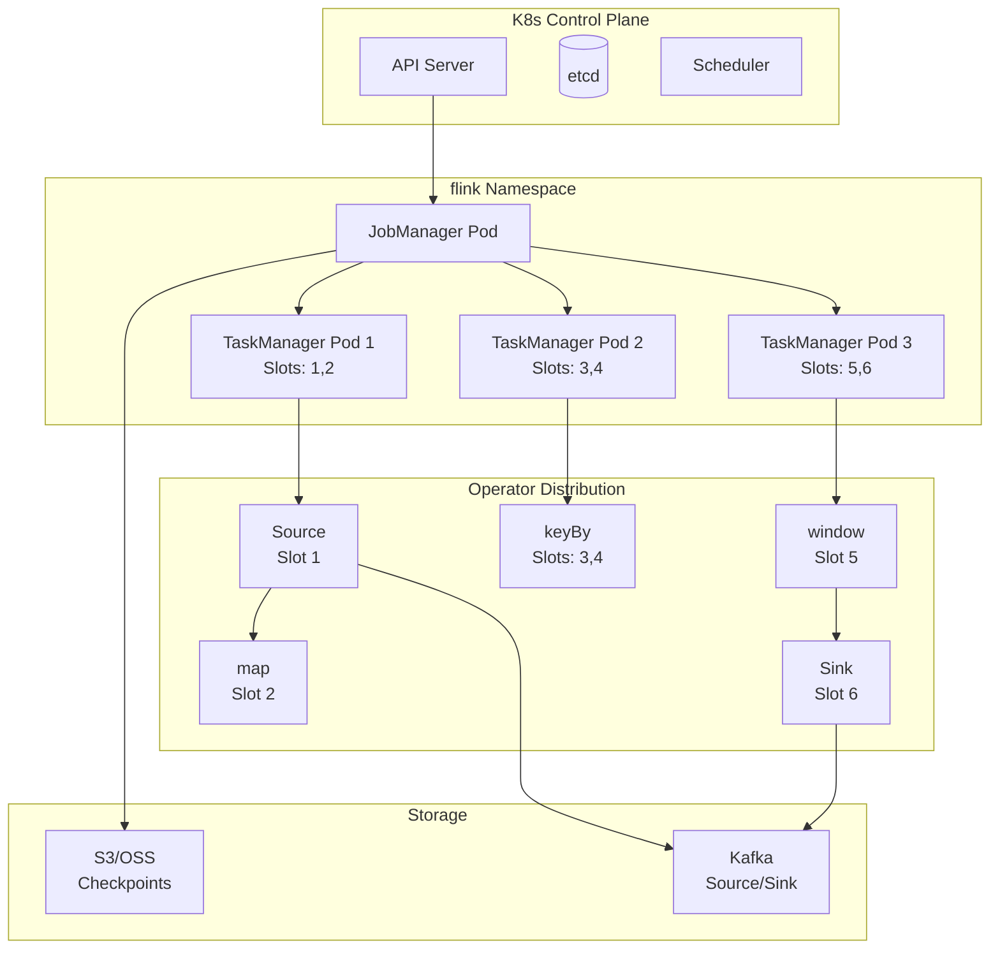
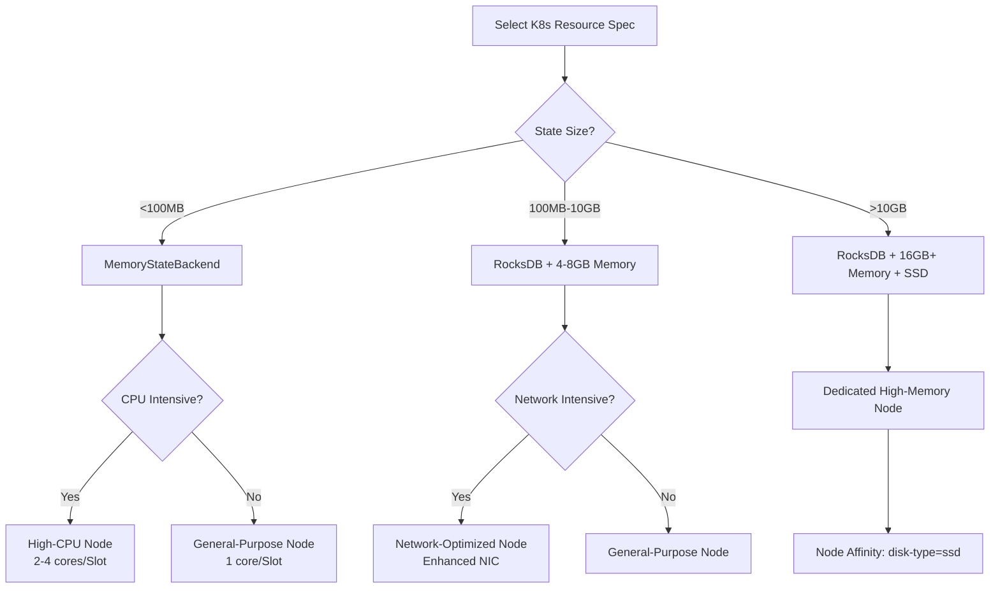

# Operators and Kubernetes Cloud-Native Deployment

> **Stage**: Knowledge/07-best-practices | **Prerequisites**: [operator-cost-model-and-resource-estimation.md](operator-cost-model-and-resource-estimation.md), [operator-evolution-and-version-compatibility.md](operator-evolution-and-version-compatibility.md) | **Formalization Level**: L3
> **Document Positioning**: Resource scheduling, deployment strategies, and lifecycle management of streaming operators in Kubernetes (K8s, Kubernetes) environments
> **Version**: 2026.04

---

## Table of Contents

- [Operators and Kubernetes Cloud-Native Deployment](#operators-and-kubernetes-cloud-native-deployment)
  - [Table of Contents](#table-of-contents)
  - [1. Definitions](#1-definitions)
    - [Def-K8S-01-01: Operator-to-Resource Mapping (算子-资源映射)](#def-k8s-01-01-operator-to-resource-mapping-算子-资源映射)
    - [Def-K8S-01-02: TaskManager Pod Model (TaskManager Pod模型)](#def-k8s-01-02-taskmanager-pod-model-taskmanager-pod模型)
    - [Def-K8S-01-03: Operator Affinity (算子亲和性)](#def-k8s-01-03-operator-affinity-算子亲和性)
    - [Def-K8S-01-04: Operator-level Autoscaling (算子级弹性伸缩)](#def-k8s-01-04-operator-level-autoscaling-算子级弹性伸缩)
    - [Def-K8S-01-05: Flink Kubernetes Operator](#def-k8s-01-05-flink-kubernetes-operator)
  - [2. Properties](#2-properties)
    - [Lemma-K8S-01-01: Locality Optimization via Slot Sharing](#lemma-k8s-01-01-locality-optimization-via-slot-sharing)
    - [Lemma-K8S-01-02: Impact of Pod Restart on Jobs](#lemma-k8s-01-02-impact-of-pod-restart-on-jobs)
    - [Prop-K8S-01-01: Resource Fragmentation and Scheduling Efficiency](#prop-k8s-01-01-resource-fragmentation-and-scheduling-efficiency)
    - [Prop-K8S-01-02: State Migration Cost of Stateful Operator Scaling](#prop-k8s-01-02-state-migration-cost-of-stateful-operator-scaling)
  - [3. Relations](#3-relations)
    - [3.1 Operator Type to K8s Resource Specification Mapping](#31-operator-type-to-k8s-resource-specification-mapping)
    - [3.2 Flink on K8s Deployment Mode Comparison](#32-flink-on-k8s-deployment-mode-comparison)
    - [3.3 Operator to K8s Health Check Mapping](#33-operator-to-k8s-health-check-mapping)
  - [4. Argumentation](#4-argumentation)
    - [4.1 Why Flink on K8s Outperforms Standalone](#41-why-flink-on-k8s-outperforms-standalone)
    - [4.2 TaskManager Memory Model Adaptation for K8s](#42-taskmanager-memory-model-adaptation-for-k8s)
    - [4.3 Relationship Between Checkpoint and PersistentVolume](#43-relationship-between-checkpoint-and-persistentvolume)
  - [5. Proof / Engineering Argument](#5-proof--engineering-argument)
    - [5.1 Operator Resource Requirement Calculation Formula](#51-operator-resource-requirement-calculation-formula)
    - [5.2 K8s ResourceQuota and LimitRange Design](#52-k8s-resourcequota-and-limitrange-design)
    - [5.3 Autoscaling Strategy (HPA + Flink Autoscaler)](#53-autoscaling-strategy-hpa--flink-autoscaler)
  - [6. Examples](#6-examples)
    - [6.1 Hands-on: Flink Kubernetes Operator Deployment](#61-hands-on-flink-kubernetes-operator-deployment)
    - [6.2 Hands-on: Node Affinity Configuration for Stateful Operators](#62-hands-on-node-affinity-configuration-for-stateful-operators)
  - [7. Visualizations](#7-visualizations)
    - [Flink on K8s Architecture Diagram](#flink-on-k8s-architecture-diagram)
    - [Resource Specification Selection Decision Tree](#resource-specification-selection-decision-tree)
  - [8. References](#8-references)

---

## 1. Definitions

### Def-K8S-01-01: Operator-to-Resource Mapping (算子-资源映射)

Operator-to-Resource Mapping defines the allocation relationship between streaming operators and Kubernetes (K8s, Kubernetes) resource objects:

$$\text{Mapping}: Op_i \mapsto (\text{Pod}_j, \text{Container}_k, \text{Resources}(CPU, MEM))$$

Where $Op_i$ is an operator instance (Subtask), $\text{Pod}_j$ is a K8s Pod, and $\text{Container}_k$ is a container within the Pod.

### Def-K8S-01-02: TaskManager Pod Model (TaskManager Pod模型)

In Flink on K8s, the TaskManager runs as a Pod. Each Pod hosts one TaskManager process containing multiple Slots:

$$\text{TaskManager Pod} = (\text{JobManager Connection}, \text{SlotPool}, \text{MemoryManager}, \text{IOManager})$$

The number of Slots is determined by the configuration `taskmanager.numberOfTaskSlots`, typically allocating 1–2 Slots per CPU core.

### Def-K8S-01-03: Operator Affinity (算子亲和性)

Operator Affinity controls the distribution strategy of operator Subtasks across K8s nodes:

- **Pod Affinity**: Schedules related operators (e.g., Source and the first processing operator) onto the same node to reduce network transfer.
- **Pod Anti-Affinity**: Disperses different replicas of stateful operators across distinct nodes / availability zones to improve fault tolerance.
- **Node Affinity**: Schedules compute-intensive operators onto high-CPU nodes and memory-intensive operators onto high-memory nodes.

### Def-K8S-01-04: Operator-level Autoscaling (算子级弹性伸缩)

Operator-level Autoscaling is the ability to dynamically adjust an operator's parallelism based on runtime metrics:

$$P_{new} = \text{ScaleFunction}(P_{current}, \text{Metrics}, \text{Constraints})$$

Constraints:

- Source parallelism ≤ number of Kafka partitions
- Scaling stateful operators requires state migration
- Scaling down must guarantee minimum redundancy

### Def-K8S-01-05: Flink Kubernetes Operator

The Flink Kubernetes Operator is a Kubernetes custom controller (CRD) that manages the lifecycle of Flink jobs:

$$\text{Operator} = \text{Reconcile}(\text{Desired State (FlinkDeployment)}, \text{Actual State (K8s Resources)})$$

It supports job submission, updates (savepoint-based), pause/resume, and automatic recovery.

---

## 2. Properties

### Lemma-K8S-01-01: Locality Optimization via Slot Sharing

Flink's Slot Sharing mechanism allows placing Subtasks of different operators into the same Slot (if they belong to the same Pipeline Region):

$$\text{LocalityGain} = \text{avoids network serialization and transfer overhead}$$

**Constraint**: The total resource demand of operators sharing a Slot must not exceed the Slot capacity.

### Lemma-K8S-01-02: Impact of Pod Restart on Jobs

The impact of a TaskManager Pod restart depends on the restart timing:

- **Restart within a checkpoint interval**: The job recovers from the last successful checkpoint; no data loss.
- **Restart during a checkpoint**: The current checkpoint fails; the job rolls back to the last successful checkpoint.
- **JobManager restart**: If HA (High Availability, 高可用) is configured (EmbeddedJournal / ZooKeeper, ZK), job state is preserved.

### Prop-K8S-01-01: Resource Fragmentation and Scheduling Efficiency

When the CPU / memory requested by a TaskManager does not match the K8s node capacity, resource fragmentation occurs:

$$\text{FragmentationRatio} = 1 - \frac{\sum_{i}(\text{Allocated}_i)}{\sum_{j}(\text{NodeCapacity}_j)}$$

**Optimization**: Use `taskmanager.memory.process.size` to fix the total memory of a TaskManager, enabling the K8s scheduler to perform Bin Packing efficiently.

### Prop-K8S-01-02: State Migration Cost of Stateful Operator Scaling

The state migration time when scaling a stateful operator from $P_{old}$ to $P_{new}$ is:

$$\mathcal{T}_{migrate} = \frac{S_{total}}{B_{network}} \cdot \frac{P_{new} - P_{old}}{P_{new}}$$

Where $S_{total}$ is the total state size and $B_{network}$ is the network bandwidth.

**Engineering Corollary**: Scaling stateful operators with > 10 GB of state takes several minutes, during which job processing is paused.

---

## 3. Relations

### 3.1 Operator Type to K8s Resource Specification Mapping

| Operator Characteristic | CPU Request | Memory Request | Disk | Node Preference |
|-------------------------|-------------|----------------|------|-----------------|
| **Stateless lightweight** (map / filter) | 0.5–1 core | 1–2 GB | None | General-purpose nodes |
| **Stateless heavy** (flatMap / complex UDF) | 1–2 cores | 2–4 GB | None | High-CPU nodes |
| **Stateful window** (window / aggregate) | 1–2 cores | 4–8 GB | SSD (RocksDB) | High-memory + SSD nodes |
| **Stateful Join** | 2–4 cores | 8–16 GB | SSD | High-memory + SSD nodes |
| **Async I/O** | 0.5 core | 1–2 GB | None | Network-optimized nodes |
| **Source / Sink** | 0.5–1 core | 1–2 GB | None | Close to Kafka / Broker |

### 3.2 Flink on K8s Deployment Mode Comparison

| Mode | Resource Isolation | Elasticity | Applicable Scenario | Drawback |
|------|-------------------|------------|---------------------|----------|
| **Session Cluster** | Low (multiple jobs share TM) | Low | Development / testing, small jobs | Inter-job resource contention |
| **Application Mode** | High (per-job isolation) | Medium | Standard production choice | Potentially low resource utilization |
| **Per-Job Mode** | High | Low | Flink < 1.15 compatibility | Deprecated |
| **Native K8s** | High | High | Requires dynamic scaling | Complex configuration |

### 3.3 Operator to K8s Health Check Mapping

```
K8s LivenessProbe → TaskManager process liveness
├── Failure → K8s restarts Pod → Flink automatically recovers the Task

K8s ReadinessProbe → Whether TaskManager can accept Slot assignments
├── Failure → Removed from Service Endpoint → No new Slots allocated

Flink RestartStrategy → Restart policy after operator failure
├── fixed-delay: Fixed-interval restart (recommended for dev environments)
├── exponential-delay: Exponential backoff (recommended for production)
└── failure-rate: Rate-limited restart (prevents restart storms)
```

---

## 4. Argumentation

### 4.1 Why Flink on K8s Outperforms Standalone

| Dimension | Standalone | Kubernetes |
|-----------|-----------|------------|
| **Resource Scheduling** | Static allocation | Dynamic scheduling, resource pooling |
| **Fault Recovery** | Manual or scripted | Automatic Pod restart, automatic rescheduling |
| **Elastic Scaling** | Manual scaling required | HPA / VPA automatic scaling |
| **Resource Isolation** | Process-level | Container-level (cgroup) |
| **Multi-tenancy** | Weak | Strong (Namespace isolation) |
| **Operational Complexity** | Medium (host maintenance) | Medium (requires K8s expertise) |

### 4.2 TaskManager Memory Model Adaptation for K8s

Flink 1.10+ introduced a new memory model:

```
Total Process Memory
├── Total Flink Memory
│   ├── Framework Heap (128 MB fixed)
│   ├── Task Heap (user code + state)
│   ├── Managed Memory (RocksDB cache + batch sorting)
│   └── Network Memory (network buffers)
└── JVM Overhead (metaspace + stack + direct memory)
```

**K8s Configuration Recommendation**:

```yaml
resources:
  requests:
    memory: "4Gi"  # Corresponds to taskmanager.memory.process.size
    cpu: "2"
  limits:
    memory: "4Gi"  # Must equal requests to avoid OOMKiller
    cpu: "2"
```

**Key Point**: The K8s memory limit must equal Flink's process memory; otherwise, off-heap memory usage exceeding the limit will trigger the OOMKiller.

### 4.3 Relationship Between Checkpoint and PersistentVolume

Checkpoint storage requires a highly available, high-throughput storage backend:

| Storage Type | Applicable Scenario | Performance | Cost |
|--------------|---------------------|-------------|------|
| **HDFS** | Traditional big-data ecosystem | High | Medium (requires NameNode maintenance) |
| **S3 / OSS** | Cloud-native | Medium | Low |
| **NFS / EFS** | Small-scale or testing | Low | Medium |
| **PersistentVolume (SSD)** | Low-latency requirements | Very high | High |

**Recommendation**: Use object storage (S3 / OSS) in production; local SSD should only be used for RocksDB state storage (via emptyDir or local PV).

---

## 5. Proof / Engineering Argument

### 5.1 Operator Resource Requirement Calculation Formula

**Input**: Business throughput $\lambda$, pipeline topology, operator characteristics.

**Step 1: Calculate the number of TaskManagers**

$$N_{TM} = \left\lceil \frac{\sum_i P_i}{SlotsPerTM} \right\rceil$$

Where $P_i$ is the parallelism of operator $i$, and $SlotsPerTM$ is the number of Slots per TaskManager.

**Step 2: Calculate resources per TaskManager**

$$MEM_{TM} = MEM_{framework} + \sum_{s \in Slots}(MEM_{task}^{(s)} + MEM_{managed}^{(s)} + MEM_{network}^{(s)})$$

$$CPU_{TM} = \sum_{s \in Slots} CPU_{task}^{(s)}$$

**Step 3: Calculate JobManager resources**

$$MEM_{JM} = 1.5GB + 0.1 \times N_{TM} \quad \text{(empirical formula)}$$

$$CPU_{JM} = 1 \sim 2 \quad \text{cores}$$

### 5.2 K8s ResourceQuota and LimitRange Design

Set resource quotas for the Flink job Namespace:

```yaml
apiVersion: v1
kind: ResourceQuota
metadata:
  name: flink-quota
  namespace: flink-jobs
spec:
  hard:
    requests.cpu: "100"
    requests.memory: 400Gi
    limits.cpu: "100"
    limits.memory: 400Gi
    pods: "50"
---
apiVersion: v1
kind: LimitRange
metadata:
  name: flink-limits
  namespace: flink-jobs
spec:
  limits:
  - default:
      memory: 4Gi
      cpu: "2"
    defaultRequest:
      memory: 4Gi
      cpu: "2"
    type: Container
```

### 5.3 Autoscaling Strategy (HPA + Flink Autoscaler)

**HPA (Horizontal Pod Autoscaler) Configuration**:

```yaml
apiVersion: autoscaling/v2
kind: HorizontalPodAutoscaler
metadata:
  name: flink-taskmanager-hpa
spec:
  scaleTargetRef:
    apiVersion: apps/v1
    kind: Deployment
    name: flink-taskmanager
  minReplicas: 2
  maxReplicas: 20
  metrics:
  - type: Resource
    resource:
      name: cpu
      target:
        type: Utilization
        averageUtilization: 70
  behavior:
    scaleUp:
      stabilizationWindowSeconds: 300
      policies:
      - type: Pods
        value: 2
        periodSeconds: 60
    scaleDown:
      stabilizationWindowSeconds: 600
      policies:
      - type: Pods
        value: 1
        periodSeconds: 120
```

**Constraint**: HPA can only scale the number of TaskManagers, not the operator parallelism. True operator-level autoscaling requires the Flink Autoscaler (experimental feature).

---

## 6. Examples

### 6.1 Hands-on: Flink Kubernetes Operator Deployment

**FlinkDeployment CRD**:

```yaml
apiVersion: flink.apache.org/v1beta1
kind: FlinkDeployment
metadata:
  name: streaming-pipeline
  namespace: flink
spec:
  image: flink:1.18-scala_2.12
  flinkVersion: v1.18
  jobManager:
    resource:
      memory: "2Gi"
      cpu: 1
  taskManager:
    resource:
      memory: "4Gi"
      cpu: 2
    replicas: 3
  job:
    jarURI: local:///opt/flink/examples/streaming/StateMachineExample.jar
    parallelism: 6
    upgradeMode: savepoint
    state: running
  podTemplate:
    spec:
      affinity:
        podAntiAffinity:
          preferredDuringSchedulingIgnoredDuringExecution:
          - weight: 100
            podAffinityTerm:
              labelSelector:
                matchLabels:
                  app: flink-taskmanager
              topologyKey: kubernetes.io/hostname
```

### 6.2 Hands-on: Node Affinity Configuration for Stateful Operators

**Scenario**: RocksDB state backend requires local SSD.

```yaml
podTemplate:
  spec:
    containers:
    - name: flink-main-container
      volumeMounts:
      - name: state-volume
        mountPath: /opt/flink/state
    volumes:
    - name: state-volume
      emptyDir:
        medium: Memory  # or local SSD
    affinity:
      nodeAffinity:
        requiredDuringSchedulingIgnoredDuringExecution:
          nodeSelectorTerms:
          - matchExpressions:
            - key: disk-type
              operator: In
              values:
              - ssd
```

---

## 7. Visualizations

### Flink on K8s Architecture Diagram

The following diagram illustrates the architectural relationship between the K8s control plane, Flink components, operator distribution, and external storage.



### Resource Specification Selection Decision Tree

The following decision tree guides the selection of K8s resource specifications based on state size, CPU intensity, and network intensity.



---

## 8. References


---

*Related Documents*: [operator-cost-model-and-resource-estimation.md](operator-cost-model-and-resource-estimation.md) | [operator-evolution-and-version-compatibility.md](operator-evolution-and-version-compatibility.md) | [operator-observability-and-intelligent-ops.md](operator-observability-and-intelligent-ops.md)
