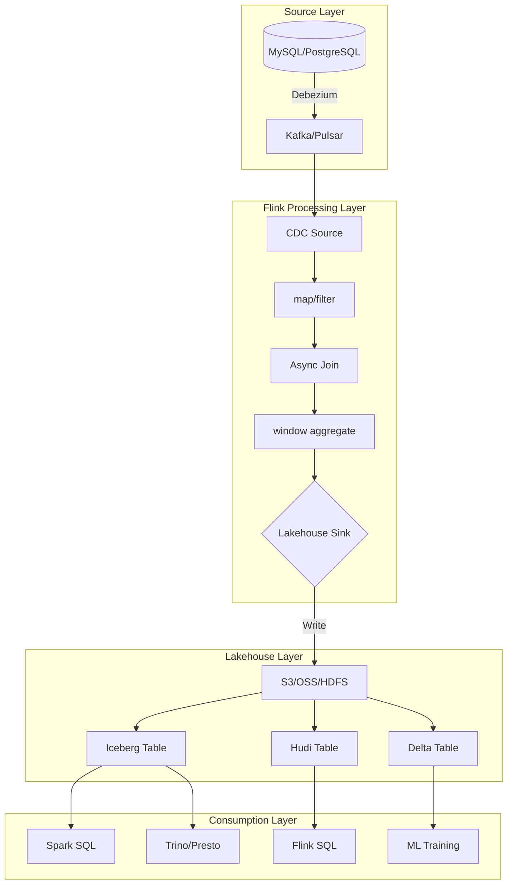
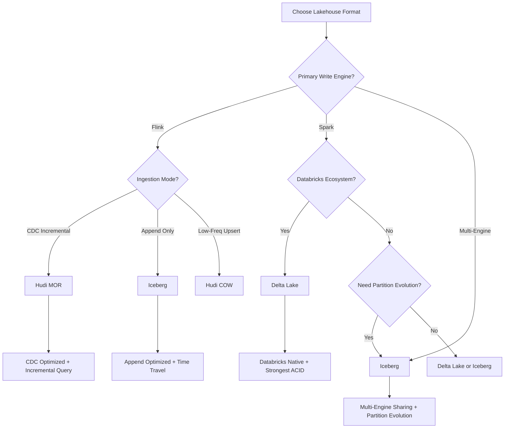
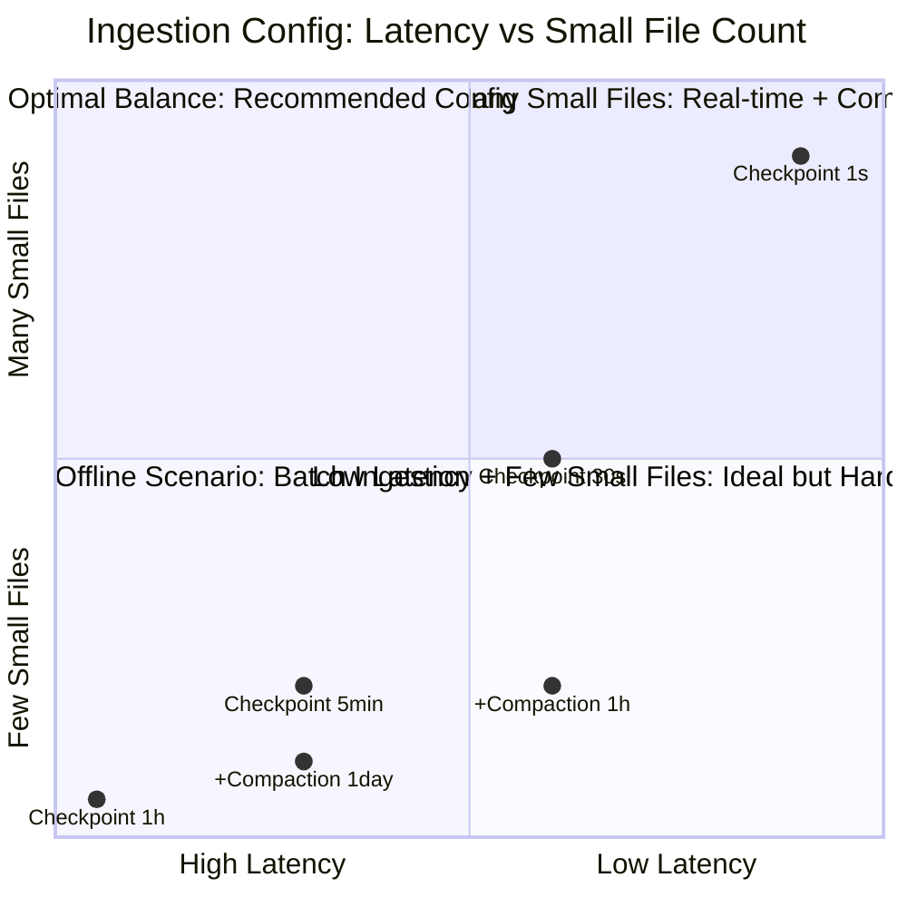

# Operator and Lakehouse (湖仓一体) Integration

> **Stage**: Knowledge/06-frontier | **Prerequisites**: [01.11-io-operators.md](../Knowledge/01-concept-atlas/operator-deep-dive/01.11-io-operators.md), [operator-data-lineage-and-impact-analysis.md](../Knowledge/07-best-practices/operator-data-lineage-and-impact-analysis.md) | **Formalization Level**: L3-L4
> **Document Focus**: Integration architecture and best practices for streaming operators with modern lakehouse formats (Iceberg/Delta Lake/Hudi)
> **Version**: 2026.04

---

## Table of Contents

- [Operator and Lakehouse (湖仓一体) Integration](#operator-and-lakehouse-湖仓一体-integration)
  - [Table of Contents](#table-of-contents)
  - [1. Definitions](#1-definitions)
    - [Def-LKH-01-01: Lakehouse (湖仓一体)](#def-lkh-01-01-lakehouse-湖仓一体)
    - [Def-LKH-01-02: Open Table Format (开放表格式)](#def-lkh-01-02-open-table-format-开放表格式)
    - [Def-LKH-01-03: Streaming Sink to Lakehouse (流式入湖算子)](#def-lkh-01-03-streaming-sink-to-lakehouse-流式入湖算子)
    - [Def-LKH-01-04: CDC Source to Lakehouse (CDC入湖算子)](#def-lkh-01-04-cdc-source-to-lakehouse-cdc入湖算子)
    - [Def-LKH-01-05: Time Travel Query (时间旅行查询)](#def-lkh-01-05-time-travel-query-时间旅行查询)
  - [2. Properties](#2-properties)
    - [Lemma-LKH-01-01: Idempotency Condition for Streaming Ingestion](#lemma-lkh-01-01-idempotency-condition-for-streaming-ingestion)
    - [Lemma-LKH-01-02: Inverse Relationship Between Small File Count and Batch Interval](#lemma-lkh-01-02-inverse-relationship-between-small-file-count-and-batch-interval)
    - [Prop-LKH-01-01: Latency Lower Bound for CDC Ingestion](#prop-lkh-01-01-latency-lower-bound-for-cdc-ingestion)
    - [Prop-LKH-01-02: Backward Compatibility of Schema Evolution](#prop-lkh-01-02-backward-compatibility-of-schema-evolution)
  - [3. Relations](#3-relations)
    - [3.1 Feature Comparison Matrix of the Three Major Table Formats](#31-feature-comparison-matrix-of-the-three-major-table-formats)
    - [3.2 Flink Operator and Lakehouse Integration Architecture](#32-flink-operator-and-lakehouse-integration-architecture)
    - [3.3 Ingestion Modes and Operator Selection](#33-ingestion-modes-and-operator-selection)
  - [4. Argumentation](#4-argumentation)
    - [4.1 Why Stream Processing Needs Lakehouse Rather Than Traditional Data Warehouses](#41-why-stream-processing-needs-lakehouse-rather-than-traditional-data-warehouses)
    - [4.2 Iceberg vs Delta Lake vs Hudi Selection Decision](#42-iceberg-vs-delta-lake-vs-hudi-selection-decision)
    - [4.3 Root Cause and Resolution of the Small File Problem](#43-root-cause-and-resolution-of-the-small-file-problem)
  - [5. Proof / Engineering Argument](#5-proof--engineering-argument)
    - [5.1 Implementation Principle of Exactly-Once Ingestion](#51-implementation-principle-of-exactly-once-ingestion)
    - [5.2 Latency-Throughput Trade-off in Stream-Batch Unified Architecture](#52-latency-throughput-trade-off-in-stream-batch-unified-architecture)
    - [5.3 Data Consistency Proof for CDC Ingestion](#53-data-consistency-proof-for-cdc-ingestion)
  - [6. Examples](#6-examples)
    - [6.1 Practical: Flink + Iceberg Real-Time Ingestion](#61-practical-flink--iceberg-real-time-ingestion)
    - [6.2 Practical: CDC + Hudi Real-Time Data Warehouse](#62-practical-cdc--hudi-real-time-data-warehouse)
  - [7. Visualizations](#7-visualizations)
    - [Streaming Ingestion Architecture Diagram](#streaming-ingestion-architecture-diagram)
    - [Lakehouse Selection Decision Tree](#lakehouse-selection-decision-tree)
    - [Ingestion Latency vs Small File Trade-off Quadrant](#ingestion-latency-vs-small-file-trade-off-quadrant)
  - [8. References](#8-references)

---

## 1. Definitions

### Def-LKH-01-01: Lakehouse (湖仓一体)

Lakehouse is a unified architecture that fuses the low-cost storage of a Data Lake (数据湖) with the transactional and performance characteristics of a Data Warehouse (数据仓库). Formally defined as a triple:

$$\text{Lakehouse} = (\text{Object Storage}, \text{Open Table Format}, \text{SQL Engine})$$

where the Open Table Format provides ACID transactions, Schema evolution, Time Travel (时间旅行), and a metadata management layer.

### Def-LKH-01-02: Open Table Format (开放表格式)

An Open Table Format is a table abstraction built on object storage (S3/OSS/HDFS), realized through a metadata layer:

$$\text{Table} = \{S_1, S_2, ..., S_n\}$$

where $S_i$ is the $i$-th Snapshot, and each Snapshot points to a set of immutable Parquet/ORC data files and their associated metadata files.

Current mainstream open table formats:

- **Apache Iceberg**: Led by Netflix/Apple, with the most flexible Catalog abstraction
- **Delta Lake**: Led by Databricks, most tightly integrated with the Spark ecosystem
- **Apache Hudi**: Led by Uber, strongest optimization for incremental processing

### Def-LKH-01-03: Streaming Sink to Lakehouse (流式入湖算子)

A Streaming Sink to Lakehouse is a Sink operator that continuously writes unbounded stream data into an open table format, and must satisfy:

1. **Exactly-Once semantics**: Each batch of data is committed via a transaction, rolling back on failure
2. **Small file management**: Control compaction strategy to avoid metadata explosion
3. **Schema evolution compatibility**: When upstream Schema changes, the downstream table format automatically adapts
4. **Partition awareness**: Partition by event time to support efficient time-range queries

### Def-LKH-01-04: CDC Source to Lakehouse (CDC入湖算子)

A CDC (Change Data Capture, 变更数据捕获) Source to Lakehouse is a Source+Sink combination that parses database change logs (binlog/WAL) into stream events and writes them into the Lakehouse:

$$\text{CDC} \to \text{Stream} \xrightarrow{\text{Debezium}} \text{Kafka} \xrightarrow{\text{Flink}} \text{Lakehouse Table}$$

CDC event types: INSERT ($+R$), UPDATE ($-R_{old}, +R_{new}$), DELETE ($-R$).

### Def-LKH-01-05: Time Travel Query (时间旅行查询)

A Time Travel Query is the capability to access historical Snapshots based on the Lakehouse metadata layer:

$$Q_{t}(T) = \{r \in T \mid r \text{ was visible at timestamp } t\}$$

where $T$ is the table and $t$ is the query timestamp or Snapshot ID. Stream processing operators can leverage Time Travel to implement "Replay" (回放) capability.

---

## 2. Properties

### Lemma-LKH-01-01: Idempotency Condition for Streaming Ingestion

If the Lakehouse Sink operator satisfies:

1. Each batch of data is written using a unique identifier (e.g., Flink Checkpoint ID)
2. The table format supports transactional commits (ACID)
3. Duplicate submissions with the same identifier are handled idempotently

Then the Sink operator satisfies Exactly-Once semantics.

**Proof Sketch**: Let the $n$-th checkpoint attempt write data $D_n$ with identifier $cid_n$. If the first commit succeeds, the metadata layer records $cid_n \to S_n$. If a retry occurs after recovery, $D_n$ is resubmitted with the same $cid_n$; the metadata layer detects that $cid_n$ already exists and returns success directly without rewriting data files. ∎

### Lemma-LKH-01-02: Inverse Relationship Between Small File Count and Batch Interval

Let the checkpoint interval of streaming ingestion be $\Delta t$ (seconds) and the throughput be $\lambda$ (records/s). Then the small file growth rate is:

$$\frac{dN_{files}}{dt} = \frac{\lambda \cdot s_{record}}{B_{target} \cdot \Delta t}$$

where $s_{record}$ is the average record size and $B_{target}$ is the target file size.

**Engineering Corollary**: The smaller the checkpoint interval (e.g., 1 second), the more small files are produced. A compaction strategy (such as Iceberg's RewriteDataFilesAction) must be used to merge files periodically.

### Prop-LKH-01-01: Latency Lower Bound for CDC Ingestion

The end-to-end latency $\mathcal{L}_{CDC}$ of CDC ingestion satisfies:

$$\mathcal{L}_{CDC} \geq \mathcal{L}_{db\_wal} + \mathcal{L}_{debezium} + \mathcal{L}_{kafka} + \mathcal{L}_{flink} + \mathcal{L}_{commit}$$

where $\mathcal{L}_{commit}$ is the Lakehouse transaction commit time (Iceberg approx. 100–500 ms, Delta Lake approx. 50–300 ms).

**Optimization Direction**: Reducing Flink's buffer timeout and checkpoint interval can lower $\mathcal{L}_{flink}$, but will increase the number of small files.

### Prop-LKH-01-02: Backward Compatibility of Schema Evolution

The Schema evolution supported by Lakehouse table formats maintains backward compatibility for the following changes:

- ADD COLUMN: ✅ Compatible
- DROP COLUMN: ⚠️ Requires filling old data with NULL or default values
- ALTER COLUMN TYPE: ⚠️ Requires a safely convertible type
- RENAME COLUMN: ❌ Usually incompatible (breaks existing queries)

---

## 3. Relations

### 3.1 Feature Comparison Matrix of the Three Major Table Formats

| Feature | Apache Iceberg | Delta Lake | Apache Hudi |
|---------|---------------|-----------|-------------|
| **ACID Transactions** | ✅ Snapshot isolation | ✅ Optimistic concurrency control | ✅ MVCC |
| **Schema Evolution** | ✅ Full support | ✅ Full support | ✅ Limited support |
| **Time Travel** | ✅ Full Snapshot history | ✅ Full version history | ✅ Via commit timestamp |
| **Incremental Read** | ✅ Via Snapshot comparison | ✅ Via version comparison | ✅ Native, strongest optimization |
| **Streaming Write** | ✅ Flink Iceberg Sink | ✅ Flink Delta Sink | ✅ Flink Hudi Sink |
| **Compaction** | ✅ Rewrite action | ✅ OPTIMIZE | ✅ Automatic / Manual |
| **Partition Evolution** | ✅ Dynamic partition changes | ❌ Not supported | ⚠️ Limited support |
| **Hidden Partitioning** | ✅ Via transform | ❌ Not supported | ❌ Not supported |
| **Flink Integration Maturity** | ⭐⭐⭐⭐⭐ | ⭐⭐⭐⭐ | ⭐⭐⭐⭐ |

### 3.2 Flink Operator and Lakehouse Integration Architecture

```
Source Layer
├── CDC Source (Debezium)
│   └── MySQL/PostgreSQL/Oracle → Kafka → Flink CDC Source
├── Message Queue Source
│   └── Kafka/Pulsar → Flink Kafka Source
└── File Source
    └── S3/OSS → Flink File Source

Flink Processing Layer
├── Data Cleansing (map/filter/flatMap)
├── Dimension Join (AsyncFunction + HBase/Redis)
├── Window Aggregation (window + aggregate)
└── Lakehouse Sink
    ├── IcebergSink (Streaming Sink)
    ├── DeltaSink (ForSt / Streaming)
    └── HudiSink (Streamer / DeltaStreamer)

Lakehouse Storage Layer
├── Object Storage (S3/OSS/HDFS)
│   ├── Data Files (Parquet/ORC/Avro)
│   └── Metadata Files (Avro/JSON)
└── Catalog (Hive/Hadoop/JDBC/REST)
```

### 3.3 Ingestion Modes and Operator Selection

| Ingestion Mode | Applicable Scenario | Key Operator | Latency | Small Files |
|---------|---------|---------|------|--------|
| **Append Only** | Log/event data | IcebergSink.append | Second-level | Medium |
| **Upsert (Merge On Read)** | CDC/dimension tables | Hudi MOR Sink | Second-level | High (compaction needed) |
| **Upsert (Copy On Write)** | Low-frequency updates | Hudi COW Sink | Minute-level | Low |
| **Overwrite Partition** | Offline backfill | IcebergSink.overwrite | Minute-level | Low |

---

## 4. Argumentation

### 4.1 Why Stream Processing Needs Lakehouse Rather Than Traditional Data Warehouses

Traditional data warehouses (e.g., Hive) in batch processing mode:

- Data first lands in the lake (HDFS), then is ETL'd into the warehouse on a schedule
- Latency: hour-level or day-level
- Schema changes: require full re-runs

Lakehouse + Stream Processing:

- Data is ingested into the lake in real time, unified stream-batch processing
- Latency: second-level to minute-level
- Schema changes: online evolution, does not affect historical data

**Key Difference**: Operators write directly into the open table format, bypassing the traditional ETL layer.

### 4.2 Iceberg vs Delta Lake vs Hudi Selection Decision

**Choose Iceberg if**:

- You need the most flexible Catalog management and partition evolution
- Multiple engines share the same table (Flink/Spark/Trino/StarRocks)
- Strong requirements for Time Travel and hidden partitioning

**Choose Delta Lake if**:

- Primarily within the Databricks ecosystem
- You need the strongest ACID guarantees and concurrency control
- Integration with MLflow and other ML toolchains

**Choose Hudi if**:

- CDC incremental ingestion is the core scenario
- You need the strongest incremental query performance
- Extremely high data freshness requirements (minute-level compaction)

### 4.3 Root Cause and Resolution of the Small File Problem

High-frequency writes in stream processing (checkpoint per second) naturally produce a large number of small files:

- 1-second checkpoint × 100 parallelism = 360,000 new files per hour
- The time for the metadata layer to traverse these files grows linearly with file count
- Query engines (Spark/Trino) incur extremely high overhead opening large numbers of small files

**Solution Matrix**:

- **Iceberg**: Periodically run `RewriteDataFiles` action to merge small files
- **Delta Lake**: `OPTIMIZE` command, Z-Ordering optimization
- **Hudi**: Built-in compaction scheduling, automatic merging for MOR tables

---

## 5. Proof / Engineering Argument

### 5.1 Implementation Principle of Exactly-Once Ingestion

**Exactly-Once Guarantee of Iceberg Streaming Sink**:

```
When Checkpoint n starts:
  1. Flink operator accumulates data in a memory buffer
  2. Data is organized by partition and written to temporary Parquet files

When Checkpoint n succeeds:
  3. Commit temporary files to the final location in object storage
  4. Atomically update metadata via Iceberg Catalog (add new Snapshot S_n)
  5. Write the checkpoint ID into the summary property of the Snapshot

During recovery:
  6. Read the latest Snapshot S_m
  7. Check whether the checkpoint ID has already been committed
  8. If committed, skip this batch; if not, rewrite
```

**Formal Argument**: Let $W_n$ be the write operation of the $n$-th checkpoint and $C_n$ be the metadata commit operation. Since $C_n$ is atomic (guaranteed by Catalog) and the idempotency of $W_n$ is guaranteed by file overwrite, we have:

$$\forall n: W_n \circ C_n = W_n \circ C_n \circ W_n \circ C_n$$

That is, repeating the same $W_n \circ C_n$ does not change the final state.

### 5.2 Latency-Throughput Trade-off in Stream-Batch Unified Architecture

| Config | Checkpoint Interval | Latency | Throughput | Small Files / Hour |
|------|---------------|------|------|--------------|
| Real-time mode | 1s | 1–5s | High | 360K |
| Balanced mode | 30s | 10–60s | High | 12K |
| Micro-batch mode | 5min | Minute-level | Very High | 1.2K |
| Offline mode | 1h | Hour-level | Batch-level | 100 |

**Recommendation**: Use 30s–1min balanced mode for real-time analytics; use hour-level batch mode for offline backfill.

### 5.3 Data Consistency Proof for CDC Ingestion

**Problem**: How to guarantee eventual consistency between the CDC source (e.g., MySQL binlog) and the Lakehouse target table?

**Proof**:

1. Debezium captures binlog and guarantees ordering (strictly ordered within a single partition)
2. Kafka guarantees FIFO ordering within a partition
3. Flink Kafka Source consumes in partition order
4. Lakehouse Sink applies changes in event order (UPSERT semantics)

Because every link in the chain $binlog \to debezium \to kafka \to flink \to lakehouse$ preserves ordering within a single partition, and the ACID transactions of the Lakehouse guarantee atomic visibility for each batch of changes, eventual consistency holds.

**Boundary Condition**: If multi-partition parallel consumption is used, changes to the same primary key may arrive out of order. Solutions:

- Partition by primary key (ensuring changes to the same key land in the same partition)
- Or adopt Hudi's pre-merge strategy (resolve conflicts during compaction)

---

## 6. Examples

### 6.1 Practical: Flink + Iceberg Real-Time Ingestion

**Scenario**: Real-time ingestion of e-commerce orders into the lake, supporting BI analytics and ML feature engineering.

```java
// Iceberg Sink Configuration
FlinkSink.forRowData(new HadoopCatalog("hdfs://namenode:8020/warehouse", "db"), TableIdentifier.of("db", "orders"))
    .setOverwrite(false)
    .setDistributionMode(DistributionMode.HASH)  // Distribute by partition key
    .setWriteParallelism(16)
    .build();

// Stream Processing Pipeline
env.fromSource(kafkaSource, WatermarkStrategy.forBoundedOutOfOrderness(Duration.ofMinutes(5)), "orders")
    .map(new ParseOrder())
    .filter(order -> order.getAmount() > 0)
    .keyBy(Order::getRegion)
    .window(TumblingEventTimeWindows.of(Time.minutes(1)))
    .aggregate(new OrderStatsAggregate())
    .sinkTo(icebergSink);
```

**Result**: Order data latency < 30 seconds into the lake; BI queries can directly access the Iceberg table with no additional ETL.

### 6.2 Practical: CDC + Hudi Real-Time Data Warehouse

**Scenario**: Real-time synchronization of MySQL user table to Hudi, supporting incremental queries.

```java
// Flink CDC Source
MySqlSource<String> mysqlSource = MySqlSource.<String>builder()
    .hostname("mysql")
    .databaseList("crm")
    .tableList("crm.users")
    .build();

// Hudi Sink (MOR Mode)
HoodiePipeline.Builder builder = HoodiePipeline.newBuilder("users")
    .setPartitionFields("dt")
    .setRecordKeyFields("user_id")
    .setPreCombineFields("updated_at")
    .setTableType(HoodieTableType.MERGE_ON_READ);

env.fromSource(mysqlSource, WatermarkStrategy.noWatermarks(), "mysql-cdc")
    .map(new DebeziumToHudiRecord())
    .sinkTo(builder.build());
```

**Result**: MySQL changes are synchronized to Hudi within seconds; Spark/Trino can read change data incrementally.

---

## 7. Visualizations

### Streaming Ingestion Architecture Diagram



### Lakehouse Selection Decision Tree



### Ingestion Latency vs Small File Trade-off Quadrant



---

## 8. References


---

*Related Documents*: [01.11-io-operators.md](../Knowledge/01-concept-atlas/operator-deep-dive/01.11-io-operators.md) | [operator-data-lineage-and-impact-analysis.md](../Knowledge/07-best-practices/operator-data-lineage-and-impact-analysis.md) | [operator-cost-model-and-resource-estimation.md](../Knowledge/07-best-practices/operator-cost-model-and-resource-estimation.md)
