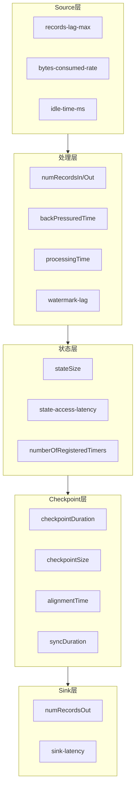
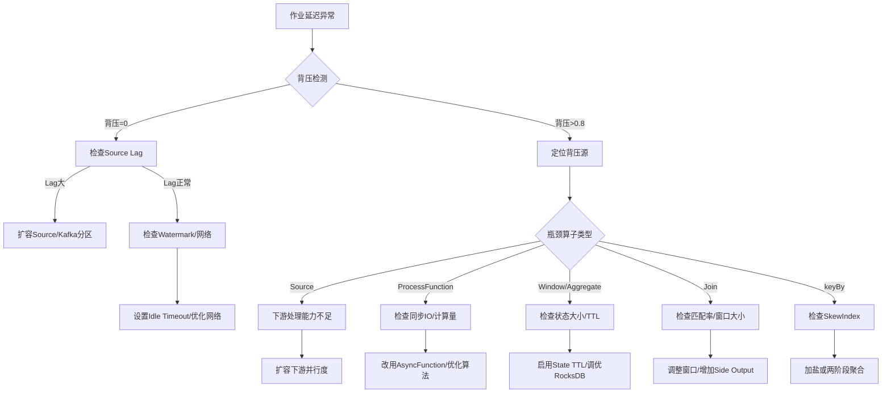
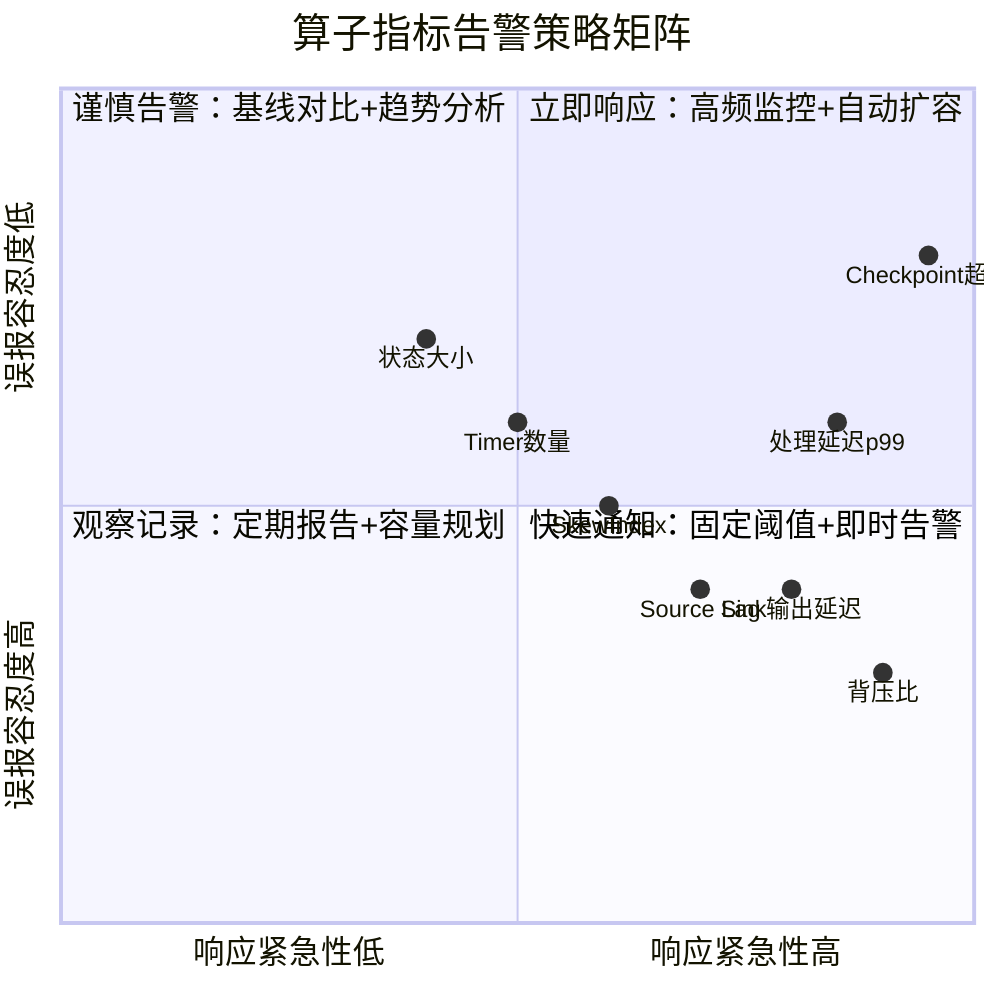

# Operator Observability and Intelligent Operations (算子可观测性与智能运维)

> **Stage**: Knowledge/07-best-practices | **Prerequisites**: [01.06-single-input-operators.md](01.06-single-input-operators.md), [operator-performance-benchmark-tuning.md](operator-performance-benchmark-tuning.md) | **Formalization Level**: L2-L3
> **Document Positioning**: Metric collection, monitoring and alerting, fault diagnosis, and intelligent operations (智能运维) at the stream processing operator (算子) level
> **Version**: 2026.04

---

## Table of Contents

- [Operator Observability and Intelligent Operations (算子可观测性与智能运维)](#operator-observability-and-intelligent-operations-算子可观测性与智能运维)
  - [Table of Contents](#table-of-contents)
  - [1. Concept Definitions (Definitions)](#1-concept-definitions-definitions)
    - [Def-OBS-01-01: Operator-level Observability (算子级可观测性)](#def-obs-01-01-operator-level-observability-算子级可观测性)
    - [Def-OBS-01-02: Backpressure Metric (背压指标)](#def-obs-01-02-backpressure-metric-背压指标)
    - [Def-OBS-01-03: Operator Latency Decomposition (算子延迟分解)](#def-obs-01-03-operator-latency-decomposition-算子延迟分解)
    - [Def-OBS-01-04: Data Skew Index (数据倾斜指数)](#def-obs-01-04-data-skew-index-数据倾斜指数)
    - [Def-OBS-01-05: Checkpoint Alignment Time (检查点对齐时间)](#def-obs-01-05-checkpoint-alignment-time-检查点对齐时间)
  - [2. Property Derivation (Properties)](#2-property-derivation-properties)
    - [Lemma-OBS-01-01: Backpressure Propagation Monotonicity](#lemma-obs-01-01-backpressure-propagation-monotonicity)
    - [Lemma-OBS-01-02: Inverse Relationship Between Operator Latency and Parallelism](#lemma-obs-01-02-inverse-relationship-between-operator-latency-and-parallelism)
    - [Prop-OBS-01-01: Positive Correlation Between State Size and Checkpoint Duration](#prop-obs-01-01-positive-correlation-between-state-size-and-checkpoint-duration)
    - [Prop-OBS-01-02: Equivalence of Watermark Lag and Event Time Latency](#prop-obs-01-02-equivalence-of-watermark-lag-and-event-time-latency)
  - [3. Relation Establishment (Relations)](#3-relation-establishment-relations)
    - [3.1 Operator Type to Observability Dimension Mapping](#31-operator-type-to-observability-dimension-mapping)
    - [3.2 Observability Toolchain Mapping](#32-observability-toolchain-mapping)
    - [3.3 Relationship with Performance Tuning](#33-relationship-with-performance-tuning)
  - [4. Argumentation](#4-argumentation)
    - [4.1 Why Operator-level Observability Is More Important Than Job-level](#41-why-operator-level-observability-is-more-important-than-job-level)
    - [4.2 Common Pitfalls in Backpressure Localization](#42-common-pitfalls-in-backpressure-localization)
    - [4.3 Watermark Lag Analysis](#43-watermark-lag-analysis)
  - [5. Formal Proof / Engineering Argument](#5-formal-proof--engineering-argument)
    - [5.1 Intelligent Alerting Threshold Derivation](#51-intelligent-alerting-threshold-derivation)
    - [5.2 Root Cause Analysis Decision Tree (RCA Tree)](#52-root-cause-analysis-decision-tree-rca-tree)
    - [5.3 Auto-scaling Strategy](#53-auto-scaling-strategy)
  - [6. Example Verification (Examples)](#6-example-verification-examples)
    - [6.1 Case Study: Locating a Join Operator Performance Bottleneck](#61-case-study-locating-a-join-operator-performance-bottleneck)
    - [6.2 Case Study: Timer Leak Diagnosis](#62-case-study-timer-leak-diagnosis)
  - [7. Visualizations](#7-visualizations)
    - [Operator Observability Metrics Panorama](#operator-observability-metrics-panorama)
    - [Backpressure Root Cause Analysis Decision Tree](#backpressure-root-cause-analysis-decision-tree)
    - [Intelligent Alerting Threshold Quadrant Chart](#intelligent-alerting-threshold-quadrant-chart)
  - [8. References](#8-references)

---

## 1. Concept Definitions (Definitions)

### Def-OBS-01-01: Operator-level Observability (算子级可观测性)

Operator-level observability (算子级可观测性) refers to the measurable, traceable, and alert-capable triad for a single operator instance (subtask) regarding its runtime state, performance characteristics, resource consumption, and anomalous behavior:

$$\text{Observability}_{op} = (\text{Metrics}, \text{Traces}, \text{Logs})_{op}$$

where Metrics are time-series metrics, Traces are distributed tracing spans, and Logs are structured log events.

### Def-OBS-01-02: Backpressure Metric (背压指标)

The backpressure (背压) metric quantifies the degree of blocking when an upstream operator outputs data to a downstream operator. In Flink, it is measured via `backPressuredTimeMsPerSecond`:

$$\text{BackpressureRatio}_i = \frac{\text{backPressuredTimeMsPerSecond}_i}{1000} \in [0, 1]$$

If $\text{BackpressureRatio}_i > 0.8$, operator $i$ is considered to be in a **high backpressure** state.

### Def-OBS-01-03: Operator Latency Decomposition (算子延迟分解)

End-to-end latency (延迟) $\mathcal{L}$ is decomposed along the Pipeline into the sum of individual operator latencies:

$$\mathcal{L} = \sum_{i=1}^{n} (\mathcal{L}_i^{\text{process}} + \mathcal{L}_i^{\text{wait}} + \mathcal{L}_i^{\text{serialize}} + \mathcal{L}_i^{\text{network}})$$

where $\mathcal{L}_i^{\text{process}}$ is processing time, $\mathcal{L}_i^{\text{wait}}$ is waiting time (for watermark or barrier), $\mathcal{L}_i^{\text{serialize}}$ is serialization time, and $\mathcal{L}_i^{\text{network}}$ is network transmission time.

### Def-OBS-01-04: Data Skew Index (数据倾斜指数)

For grouped aggregation after keyBy, the data skew index (数据倾斜指数) is defined as the ratio of the maximum partition event count to the average partition event count:

$$\text{SkewIndex} = \frac{\max_{k}(|P_k|)}{\frac{1}{K}\sum_{k=1}^{K}|P_k|}$$

where $P_k$ is the key set of the $k$-th partition, and $K$ is the total number of partitions. If $\text{SkewIndex} > 5$, severe data skew (数据倾斜) is considered to exist.

### Def-OBS-01-05: Checkpoint Alignment Time (检查点对齐时间)

When an operator receives multiple input streams, the checkpoint (检查点) alignment time is the time difference between the arrival of barriers from all input streams:

$$\mathcal{T}_{\text{align}} = \max_{j}(t_j^{\text{barrier}}) - \min_{j}(t_j^{\text{barrier}})$$

where $t_j^{\text{barrier}}$ is the arrival time of the barrier on the $j$-th input stream. If $\mathcal{T}_{\text{align}} > \text{checkpointTimeout} \times 0.5$, an alignment bottleneck exists.

---

## 2. Property Derivation (Properties)

### Lemma-OBS-01-01: Backpressure Propagation Monotonicity

If operator $i$ is in a backpressure (背压) state, then all upstream operators $j \in \text{Up}(i)$ must be or will eventually be in a backpressure state. Formally:

$$\text{Backpressure}_i \Rightarrow \forall j \in \text{Up}(i), \text{Backpressure}_j \text{ eventually}$$

**Proof Sketch**: When the downstream consumption rate is lower than the upstream production rate, Flink network buffers fill up, and Netty credit-based flow control propagates backwards, blocking upstream output. ∎

### Lemma-OBS-01-02: Inverse Relationship Between Operator Latency and Parallelism

Under the conditions of no data skew (数据倾斜) and no shared resource contention, operator processing latency (算子延迟) $\mathcal{L}_i^{\text{process}}$ and parallelism (并行度) $P_i$ approximately satisfy:

$$\mathcal{L}_i^{\text{process}} \approx \frac{\lambda_i}{\mu_i \cdot P_i}$$

where $\lambda_i$ is the arrival rate and $\mu_i$ is the single-core processing rate.

### Prop-OBS-01-01: Positive Correlation Between State Size and Checkpoint Duration

Operator state (状态) size $S_i$ and checkpoint (检查点) duration $\mathcal{T}_{\text{chkpt}}$ satisfy an approximately linear relationship:

$$\mathcal{T}_{\text{chkpt}}^{(i)} \approx \alpha \cdot S_i + \beta$$

where $\alpha$ is the rate coefficient for state serialization and storage writing (RocksDB incremental checkpoint is approximately 50–200 MB/s), and $\beta$ is the fixed overhead (approximately 100–500 ms).

**Engineering Significance**: Operators with state exceeding 1 GB require monitoring whether incremental checkpoints are effective (i.e., delta size is much smaller than full state).

### Prop-OBS-01-02: Equivalence of Watermark Lag and Event Time Latency

Under event time semantics, operator $i$'s Watermark lag (Watermark滞后) $\Delta W_i$ and the operator's maximum event time latency (事件时间延迟) $\mathcal{L}_i^{\text{event}}$ satisfy:

$$\Delta W_i = \max_{e \in \text{buffer}_i}(t_{\text{current}} - t_e^{\text{event}}) \approx \mathcal{L}_i^{\text{event}}$$

where $t_e^{\text{event}}$ is the event timestamp of event $e$.

---

## 3. Relation Establishment (Relations)

### 3.1 Operator Type to Observability Dimension Mapping

| Operator Type | Core Metrics | Key Thresholds | Alerting Strategy |
|---------|---------|---------|---------|
| **Source** | records-lag-max, bytes-consumed-rate | lag > 10000 | Consumer lag alert |
| **map/filter** | numRecordsInPerSecond, numRecordsOutPerSecond | Backpressure ratio > 0.5 | Insufficient processing capacity alert |
| **keyBy** | (implicit, no independent metrics) | SkewIndex > 5 | Data skew alert |
| **window/aggregate** | stateSize, checkpointDuration | state > 1GB | State bloat alert |
| **join** | stateSize, records-matched-rate | Match rate < 10% | Low join efficiency alert |
| **ProcessFunction** | processingTimePerRecord | p99 > 100ms | Compute-intensive alert |
| **AsyncFunction** | asyncWaitTime, capacity-utilization | Utilization > 90% | Insufficient concurrency alert |
| **Sink** | numRecordsOutPerSecond, sink-latency | Output latency > 5s | Sink bottleneck alert |

### 3.2 Observability Toolchain Mapping

```
Flink Metrics System
├── Web UI (Real-time Monitoring)
├── REST API (Programmatic Collection)
├── Prometheus (Time-series Storage)
│   └── Grafana (Visualization / Alerting)
├── OpenTelemetry (Distributed Tracing)
│   └── Jaeger/Zipkin (Trace Analysis)
└── Structured Logging
    └── ELK/Loki (Log Aggregation)
```

### 3.3 Relationship with Performance Tuning

Observability data directly drives tuning decisions:

- High backpressure + low processing latency → Network bottleneck → Increase buffer timeout
- High backpressure + high processing latency + SkewIndex > 5 → Data skew → Add salt or repartition
- Linear state growth + checkpoint timeout → TTL not set → Enable state expiration

---

## 4. Argumentation

### 4.1 Why Operator-level Observability Is More Important Than Job-level

Job-level metrics (such as overall throughput and latency) can only answer "Is the job healthy?" but cannot answer "Which operator is the bottleneck?"

**Case Study**: In a 10-operator Pipeline, the overall latency is 1 second. Job-level metrics appear normal, but operator-level metrics reveal:

- Operator 3 (join) processing latency: 900 ms
- Other 9 operators: 50 ms each

**Conclusion**: Optimizing the join operator alone can reduce overall latency by 90%.

### 4.2 Common Pitfalls in Backpressure Localization

**Pitfall 1**: Backpressure is at the Source, so the Source is the bottleneck.
**Correction**: Backpressure always propagates from downstream to upstream. Source backpressure means the **downstream Sink or some intermediate operator** is the bottleneck.

**Pitfall 2**: Increasing parallelism (并行度) will always solve backpressure.
**Correction**: If the bottleneck is a single-key hotspot (e.g., a global counter), increasing parallelism is ineffective. Check SkewIndex first.

### 4.3 Watermark Lag Analysis

High Watermark lag may be caused by the following reasons:

1. **Source delay**: Large Kafka consumer lag, or the data source itself has late event times
2. **Slow operator processing**: Intermediate operator backpressure causes event accumulation
3. **Idle Source**: A certain parallelism has no data, and the watermark does not advance (Idleness Timeout needs to be set)
4. **Excessive disorder**: Large gap between event timestamp and processing time (business rationality needs to be evaluated)

---

## 5. Formal Proof / Engineering Argument

### 5.1 Intelligent Alerting Threshold Derivation

**Problem**: How to set scientific alerting thresholds for operator metrics?

**Method**: Statistical thresholds based on historical data (3σ principle).

Let the historical time series of operator $i$'s metric $m_i(t)$ be $\{m_i(t_1), ..., m_i(t_n)\}$. Then:

$$\text{Threshold}_i^{\text{upper}} = \mu_i + 3\sigma_i$$
$$\text{Threshold}_i^{\text{lower}} = \mu_i - 3\sigma_i$$

where $\mu_i$ is the historical mean and $\sigma_i$ is the standard deviation. Exceeding 3σ is considered anomalous.

**Engineering Implementation**:

```yaml
# Prometheus Recording Rule Example
- record: flink_operator_processing_time_p99_baseline
  expr: avg_over_time(flink_taskmanager_job_task_operator_latency_p99[7d])

- record: flink_operator_processing_time_p99_stddev
  expr: stddev_over_time(flink_taskmanager_job_task_operator_latency_p99[7d])

# Alert Rule
- alert: OperatorLatencyAnomaly
  expr: |
    flink_taskmanager_job_task_operator_latency_p99 >
    flink_operator_processing_time_p99_baseline + 3 * flink_operator_processing_time_p99_stddev
  for: 5m
  annotations:
    summary: "Operator {{ $labels.operator_name }} latency anomaly detected"
```

### 5.2 Root Cause Analysis Decision Tree (RCA Tree)

Root cause analysis process based on observability metrics:

```
High job latency?
├── Large Source lag?
│   ├── Yes → Insufficient Kafka consumer capacity → Increase Source parallelism or expand Kafka partitions
│   └── No → Continue
├── High backpressure on an operator?
│   ├── Yes → That operator is the bottleneck
│   │   ├── High processing latency? → CPU-intensive or blocking IO
│   │   ├── Slow state access? → RocksDB tuning or preheating
│   │   └── High SkewIndex? → Data skew → Repartition
│   └── No → Continue
├── Checkpoint timeout?
│   ├── Yes → State too large or incremental checkpoint ineffective → Enable TTL or tune RocksDB
│   └── No → Continue
└── Watermark lag?
    ├── Yes → Check Idle Source / Disorder degree
    └── No → Network latency → Optimize network configuration or co-locate deployment
```

### 5.3 Auto-scaling Strategy

Reactive auto-scaling based on operator metrics:

**Scale-out Conditions** (satisfy any one):

1. Backpressure sustained > 0.8 for more than 2 minutes
2. Processing latency p99 exceeds 150% of SLA
3. CPU utilization > 80% sustained for 5 minutes

**Scale-in Conditions** (must satisfy all):

1. Backpressure < 0.1 sustained for 10 minutes
2. CPU utilization < 30% sustained for 10 minutes
3. No checkpoint timeouts

**Constraints**: Source parallelism ≤ Kafka partition count; Window operator parallelism changes must consider state migration cost.

---

## 6. Example Verification (Examples)

### 6.1 Case Study: Locating a Join Operator Performance Bottleneck

**Scenario**: E-commerce order stream joining payment stream, end-to-end latency spikes from 200 ms to 5 seconds.

**Troubleshooting Steps**:

1. **Check job-level metrics**: Overall throughput drops by 80%
2. **Check operator-level backpressure**: Operator 5 (IntervalJoin) backpressure ratio 0.95, downstream operator 6 backpressure 0
3. **Check operator 5 state**: stateSize = 2.3 GB, growing linearly
4. **Check join match rate**: records-matched-rate = 2%

**Diagnosis**:

- Interval window is too large (30 minutes), payment delays are much greater than expected
- Large number of payment events unmatched within the window, causing state accumulation
- Match rate is only 2%, indicating unreasonable window configuration

**Fix**:

```java
// Original code (problematic)
.between(Time.seconds(-5), Time.minutes(30))

// Fix: Shorten window + add Side Output
.between(Time.seconds(-5), Time.minutes(5))
.process(new OrderPaymentJoinWithLateData());

// Unmatched data output to Side Output
OutputTag<Order> lateOrderTag = new OutputTag<Order>("late-orders"){};
```

**Result**: State reduced from 2.3 GB to 180 MB, latency recovered to 250 ms.

### 6.2 Case Study: Timer Leak Diagnosis

**Scenario**: After running for 3 days, checkpoint time increases from 2 seconds to 60 seconds, eventually timing out.

**Troubleshooting Steps**:

1. **Checkpoint metrics**: Duration grows linearly
2. **Timer metrics**: `numberOfRegisteredTimers` = 15,000,000 (abnormally high)
3. **Code review**: KeyedProcessFunction registers a new Timer for each event, but old Timers are not deleted

**Fix**:

```java
public void processElement(Event event, Context ctx, Collector<Result> out) {
    Long oldTimer = timerState.value();
    if (oldTimer != null) {
        ctx.timerService().deleteEventTimeTimer(oldTimer);
    }
    long newTimer = event.getTimestamp() + TIMEOUT_MS;
    ctx.timerService().registerEventTimeTimer(newTimer);
    timerState.update(newTimer);
}

public void onTimer(long timestamp, OnTimerContext ctx, Collector<Result> out) {
    timerState.clear();  // Key: clean up state
    // ... processing logic
}
```

**Result**: Timer count stabilizes at ~10,000, checkpoint recovers to 2 seconds.

---

## 7. Visualizations

### Operator Observability Metrics Panorama



### Backpressure Root Cause Analysis Decision Tree



### Intelligent Alerting Threshold Quadrant Chart



---

## 8. References


---

*Related Documents*: [operator-performance-benchmark-tuning.md](operator-performance-benchmark-tuning.md) | [operator-anti-patterns.md](operator-anti-patterns.md) | [01.10-process-and-async-operators.md](01.10-process-and-async-operators.md)
