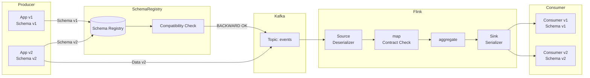
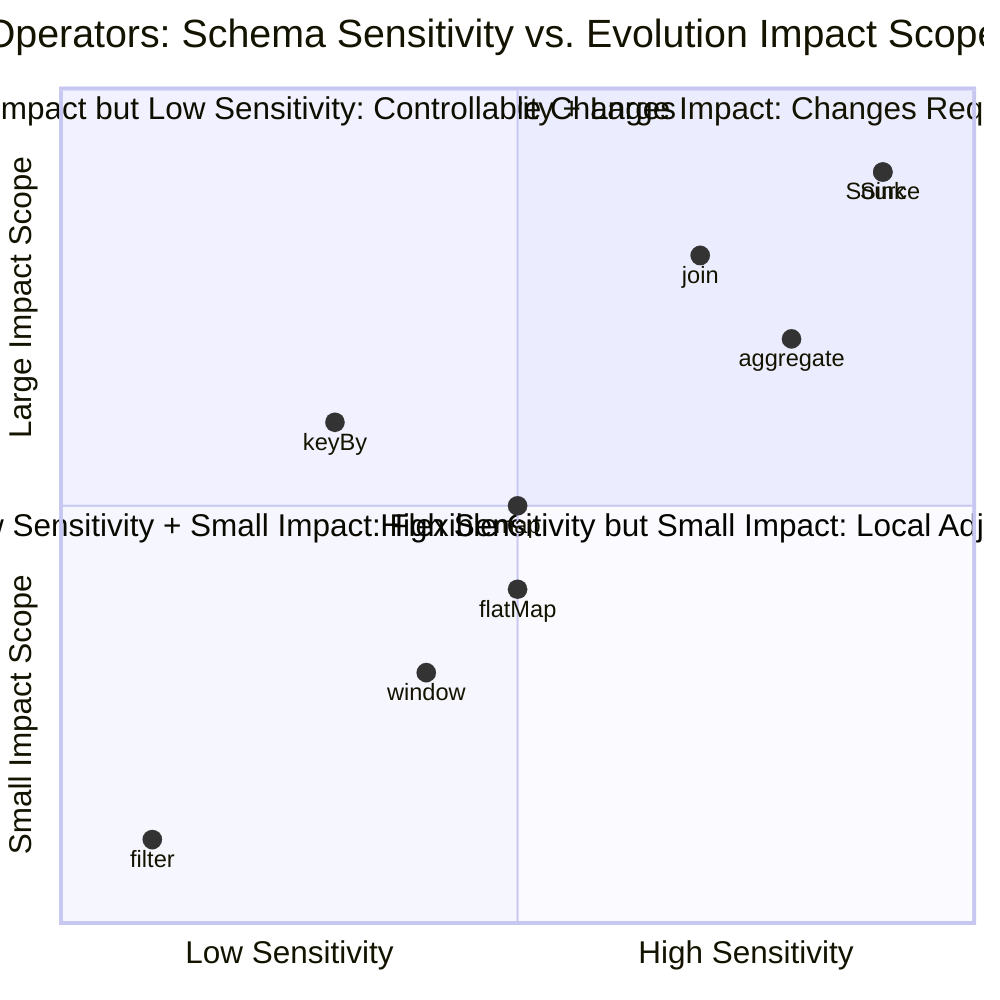

# Operators, Schema Evolution, and Data Contracts

> **Stage**: Knowledge/07-best-practices | **Prerequisites**: [01.06-single-input-operators.md](01.06-single-input-operators.md), [operator-evolution-and-version-compatibility.md](operator-evolution-and-version-compatibility.md) | **Formalization Level**: L3
> **Document Positioning**: Schema management, data contract design, and evolution strategies at the streaming operator level
> **Version**: 2026.04

---

## Table of Contents

- [Operators, Schema Evolution, and Data Contracts](#operators-schema-evolution-and-data-contracts)
  - [Table of Contents](#table-of-contents)
  - [1. Definitions](#1-definitions)
    - [Def-SCH-01-01: Data Contract (数据契约)](#def-sch-01-01-data-contract-数据契约)
    - [Def-SCH-01-02: Schema Compatibility Level (Schema兼容性等级)](#def-sch-01-02-schema-compatibility-level-schema兼容性等级)
    - [Def-SCH-01-03: Operator Schema Propagation (算子Schema传播)](#def-sch-01-03-operator-schema-propagation-算子schema传播)
    - [Def-SCH-01-04: Schema Registry](#def-sch-01-04-schema-registry)
  - [2. Properties](#2-properties)
    - [Lemma-SCH-01-01: Determinism of map Operator Schema](#lemma-sch-01-01-determinism-of-map-operator-schema)
    - [Lemma-SCH-01-02: keyBy Does Not Change Schema Structure](#lemma-sch-01-02-keyby-does-not-change-schema-structure)
    - [Prop-SCH-01-01: Schema Compression of aggregate Operator](#prop-sch-01-01-schema-compression-of-aggregate-operator)
    - [Prop-SCH-01-02: Schema Expansion of join Operator](#prop-sch-01-02-schema-expansion-of-join-operator)
  - [3. Relations](#3-relations)
    - [3.1 Operator Types and Schema Evolution Capability](#31-operator-types-and-schema-evolution-capability)
    - [3.2 Schema Registry and Flink Integration Architecture](#32-schema-registry-and-flink-integration-architecture)
    - [3.3 Mapping Data Contracts to Operator Validation](#33-mapping-data-contracts-to-operator-validation)
  - [4. Argumentation](#4-argumentation)
    - [4.1 Why Schema Evolution in Stream Processing Is More Complex Than Batch](#41-why-schema-evolution-in-stream-processing-is-more-complex-than-batch)
    - [4.2 Avro vs Protobuf vs JSON Schema Selection](#42-avro-vs-protobuf-vs-json-schema-selection)
    - [4.3 Broadcast Notification Mechanism for Schema Changes](#43-broadcast-notification-mechanism-for-schema-changes)
  - [5. Proof / Engineering Argument](#5-proof--engineering-argument)
    - [5.1 Operator-Level Data Contract Enforcement](#51-operator-level-data-contract-enforcement)
    - [5.2 Version Negotiation Protocol for Schema Evolution](#52-version-negotiation-protocol-for-schema-evolution)
    - [5.3 Engineering Implementation of State Schema Migration](#53-engineering-implementation-of-state-schema-migration)
  - [6. Examples](#6-examples)
    - [6.1 Hands-On: Avro Schema Evolution Pipeline](#61-hands-on-avro-schema-evolution-pipeline)
    - [6.2 Hands-On: Data Contract Violation Handling](#62-hands-on-data-contract-violation-handling)
  - [7. Visualizations](#7-visualizations)
    - [Schema Evolution Flow Diagram](#schema-evolution-flow-diagram)
    - [Operator Schema Sensitivity Matrix](#operator-schema-sensitivity-matrix)
  - [8. References](#8-references)

---

## 1. Definitions

### Def-SCH-01-01: Data Contract (数据契约)

A Data Contract (数据契约) is a structured protocol between data producers and consumers that defines the data Schema, semantics, quality rules, and SLA:

$$\text{Contract} = (\text{Schema}, \text{Semantics}, \text{QualityRules}, \text{SLA})$$

Where:

- Schema: field names, types, nullability, default values
- Semantics: field business meaning, enum definitions, units
- QualityRules: completeness, uniqueness, range constraints
- SLA: latency, availability, data freshness

### Def-SCH-01-02: Schema Compatibility Level (Schema兼容性等级)

Schema Compatibility (Schema兼容性) defines the degree to which a new Schema version is compatible with old version data:

$$\text{Compatibility}(S_{new}, S_{old}) \in \{\text{BACKWARD}, \text{FORWARD}, \text{FULL}, \text{NONE}\}$$

| Level | Definition | Stream Processing Impact |
|-------|-----------|--------------------------|
| **BACKWARD** | New Schema can read old data | Consumers can still read old producer data after upgrade |
| **FORWARD** | Old Schema can read new data | Old consumers can still read new producer data |
| **FULL** | Satisfies both BACKWARD + FORWARD | Safest, but most restrictive |
| **NONE** | No compatibility guarantee | Requires full stop-and-migrate |

### Def-SCH-01-03: Operator Schema Propagation (算子Schema传播)

Operator Schema Propagation (算子Schema传播) refers to the mapping relationship where an operator's output Schema is uniquely determined by its input Schema and operator logic:

$$\text{Schema}_{out} = \mathcal{F}_{op}(\text{Schema}_{in})$$

Where $\mathcal{F}_{op}$ is the operator's Schema transformation function.

### Def-SCH-01-04: Schema Registry

Schema Registry is a centralized Schema storage and version management service that provides:

- Schema registration and version control
- Compatibility checking
- Schema discovery and lookup
- Serializer / deserializer generation

Mainstream implementations: Confluent Schema Registry (Avro / JSON Schema / Protobuf), AWS Glue Schema Registry, Azure Schema Registry.

---

## 2. Properties

### Lemma-SCH-01-01: Determinism of map Operator Schema

For the `map` operator, if the mapping function $f: A \to B$ is deterministic, then the output Schema is fully determined by the input Schema and the type signature of $f$:

$$\text{Schema}_{out}^{map} = \text{Type}(f(\text{Schema}_{in}))$$

**Corollary**: Schema evolution of the `map` operator can be directly traced back to changes in the input Schema.

### Lemma-SCH-01-02: keyBy Does Not Change Schema Structure

The `keyBy` operator only repartitions by specified fields without changing the record structure:

$$\text{Schema}_{out}^{keyBy} = \text{Schema}_{in}$$

### Prop-SCH-01-01: Schema Compression of aggregate Operator

The output Schema of the `aggregate` operator is typically "narrower" than the input Schema (fewer fields):

$$|\text{Schema}_{out}^{aggregate}| \leq |\text{Schema}_{in}|$$

**Engineering significance**: Aggregate operators are naturally Schema information loss layers; the semantics of post-aggregation fields must be explicitly defined in the contract.

### Prop-SCH-01-02: Schema Expansion of join Operator

The output Schema of the `join` operator is a Cartesian-product-like merge of the two input Schemas:

$$\text{Schema}_{out}^{join} = \text{Schema}_{left} \cup \text{Schema}_{right}$$

**Risk**: When left and right stream field names conflict, explicit renaming is required (e.g. `left.id` vs `right.id`).

---

## 3. Relations

### 3.1 Operator Types and Schema Evolution Capability

| Operator | Schema Transformation | Evolution Sensitivity | Compatibility Risk |
|----------|----------------------|----------------------|--------------------|
| **Source** | External Schema → Internal Type | 🔴 High | Upstream Schema changes directly affect Pipeline |
| **map** | Field add / delete / modify | 🟡 Medium | Depends on mapping function implementation |
| **filter** | No transformation | 🟢 Low | Only affects data volume |
| **flatMap** | 1→N field mapping | 🟡 Medium | Output structure may be unrelated to input |
| **keyBy** | No structural transformation | 🟢 Low | Key field type change leads to partitioning change |
| **aggregate** | Compress / aggregate | 🔴 High | Aggregation field semantics change affects results |
| **join** | Merge two Schemas | 🔴 High | Field conflicts, type mismatches |
| **window** | Add window metadata | 🟡 Medium | Window field types are fixed |
| **Sink** | Internal Type → External Schema | 🔴 High | Downstream consumers depend on output Schema |

### 3.2 Schema Registry and Flink Integration Architecture

```
Data Producer
├── Schema Registration (Confluent Schema Registry)
│   └── POST /subjects/orders-value/versions
└── Serialization (AvroSerializer with Schema ID)

Kafka
├── Key: byte[]
└── Value: [MagicByte(1)][SchemaID(4)][AvroPayload(N)]

Flink Consumer
├── Schema Resolution (ConfluentRegistryAvroDeserializationSchema)
│   └── Retrieve Schema from Registry by ID
├── Type Mapping (Avro → Flink TypeInformation)
└── Operator Processing
```

### 3.3 Mapping Data Contracts to Operator Validation

| Contract Rule | Validation Location | Validation Method |
|--------------|--------------------|-------------------|
| Field non-null | Source / map | `filter(event -> event.getField() != null)` |
| Value range | map / ProcessFunction | `if (value < 0) ctx.output(invalidTag, event)` |
| Enum values | map | `if (!EnumSet.contains(value)) ...` |
| Uniqueness | keyed aggregate | `state.get(key) == null` |
| Foreign key existence | AsyncFunction | Async dimension table lookup validation |
| Format compliance | Source deserialization | Schema Registry validation |

---

## 4. Argumentation

### 4.1 Why Schema Evolution in Stream Processing Is More Complex Than Batch

**Batch Processing**:

- Schema is determined at job startup
- Schema change = modify code + rerun job
- No historical state burden

**Stream Processing**:

- Schema can change at runtime
- Schema changes must be compatible with in-flight data and historical state
- Data in state may be serialized using the old Schema
- Multiple consumers may use different Schema versions

**Typical case**: Adding a `vipLevel` field to an order stream. Batch processing only requires a rerun; stream processing must ensure:

1. New data contains `vipLevel`
2. Old state data has a default value for `vipLevel` upon recovery
3. Downstream consumers (possibly not yet upgraded) can read normally

### 4.2 Avro vs Protobuf vs JSON Schema Selection

| Dimension | Avro | Protobuf | JSON Schema |
|-----------|------|----------|-------------|
| Schema evolution | ⭐⭐⭐⭐⭐ | ⭐⭐⭐⭐ | ⭐⭐⭐ |
| Serialization performance | ⭐⭐⭐⭐ | ⭐⭐⭐⭐⭐ | ⭐⭐ |
| Serialized size | ⭐⭐⭐⭐⭐ | ⭐⭐⭐⭐⭐ | ⭐⭐ |
| Readability | ⭐⭐ | ⭐⭐ | ⭐⭐⭐⭐⭐ |
| Dynamic type support | ⭐⭐⭐⭐ | ⭐⭐ | ⭐⭐⭐⭐⭐ |
| Flink integration | ⭐⭐⭐⭐⭐ | ⭐⭐⭐ | ⭐⭐⭐ |

**Recommendations**:

- Inter-service communication: Protobuf (performance first)
- Flink streaming Pipeline: Avro (Schema evolution + integration first)
- External API / debug interface: JSON Schema (readability first)

### 4.3 Broadcast Notification Mechanism for Schema Changes

When a Schema changes, all operators in the Pipeline must be notified:

1. **Schema Registry triggers Webhook** → notifies of Schema change
2. **Flink JobManager receives notification** → assesses compatibility impact
3. **Compatibility check**:
   - FULL compatibility: automatically update operator Schema, no interruption
   - BACKWARD compatibility: consumers upgrade, producers continue
   - FORWARD compatibility: producers upgrade, consumers continue
   - NONE: requires stop-and-coordinate upgrade

---

## 5. Proof / Engineering Argument

### 5.1 Operator-Level Data Contract Enforcement

**Problem**: How to enforce Data Contracts at the operator level?

**Solution**: Embed contract validation operators at Source and Sink layers:

```java
// Contract validation operator
public class ContractEnforcementFunction
    extends RichMapFunction<Event, ValidatedEvent> {

    private transient DataContract contract;
    private transient Counter violationCounter;

    @Override
    public void open(Configuration parameters) {
        contract = DataContractRegistry.load("orders-v2");
        violationCounter = getRuntimeContext()
            .getMetricGroup().counter("contract-violations");
    }

    @Override
    public ValidatedEvent map(Event event) {
        List<Violation> violations = contract.validate(event);
        if (!violations.isEmpty()) {
            violationCounter.inc();
            // Fatal violation: throw exception
            if (violations.stream().anyMatch(Violation::isFatal)) {
                throw new ContractViolationException(violations);
            }
            // Non-fatal violation: mark but continue
            return new ValidatedEvent(event, violations);
        }
        return new ValidatedEvent(event, Collections.emptyList());
    }
}
```

### 5.2 Version Negotiation Protocol for Schema Evolution

**Protocol flow**:

```
Producer (Schema v2)        Schema Registry         Consumer (Schema v1)
     |                           |                         |
     |-- Register v2 ----------> |                         |
     |                           |-- Compatibility Check BACKWARD --|
     |                           |<-- Compatible ----------|
     |                           |                         |
     |-- Write Data [v2 ID] ---> |                         |
     |                           |                         |
     |                           |<-- Read Data [v2 ID] ---|
     |                           |-- Return v2 Schema ---->|
     |                           |                         |
     |                           |                         |-- Avro deserialization (v2→v1)
     |                           |                         |   (using Avro schema resolution)
```

**Key point**: Avro's `SchemaResolution` mechanism allows v2 data to be read by v1 consumers (as long as BACKWARD compatibility is satisfied).

### 5.3 Engineering Implementation of State Schema Migration

When an operator state's POJO Schema changes, implement a custom `TypeSerializerSnapshot`:

```java
public class OrderSerializerSnapshot
    extends CompositeTypeSerializerSnapshot<Order, OrderSerializer> {

    private static final int CURRENT_VERSION = 2;

    @Override
    protected int getCurrentOuterSnapshotVersion() {
        return CURRENT_VERSION;
    }

    @Override
    protected TypeSerializer<Order> createOuterSerializerWithNestedSerializers(
            TypeSerializer<?>[] nestedSerializers) {
        return new OrderSerializer();
    }

    @Override
    protected OrderSerializer restoreOuterSerializer(
            int readOuterSnapshotVersion,
            TypeSerializer<?>[] restoredNestedSerializers) {
        if (readOuterSnapshotVersion == 1) {
            // V1 → V2 migration
            return new OrderSerializer.WithMigration(
                oldValue -> new Order(
                    oldValue.getId(),
                    oldValue.getAmount(),
                    "UNKNOWN"  // default value for new field
                )
            );
        }
        return new OrderSerializer();
    }
}
```

---

## 6. Examples

### 6.1 Hands-On: Avro Schema Evolution Pipeline

**Scenario**: User event stream evolves from v1 to v2, adding a `deviceType` field.

**v1 Schema**:

```json
{
  "type": "record",
  "name": "UserEvent",
  "fields": [
    {"name": "userId", "type": "string"},
    {"name": "eventType", "type": "string"},
    {"name": "timestamp", "type": "long"}
  ]
}
```

**v2 Schema** (BACKWARD compatible):

```json
{
  "type": "record",
  "name": "UserEvent",
  "fields": [
    {"name": "userId", "type": "string"},
    {"name": "eventType", "type": "string"},
    {"name": "timestamp", "type": "long"},
    {"name": "deviceType", "type": ["null", "string"], "default": null}
  ]
}
```

**Flink configuration**:

```java
// Source: dynamic resolution using Schema Registry
KafkaSource<UserEvent> source = KafkaSource.<UserEvent>builder()
    .setTopics("user-events")
    .setValueOnlyDeserializer(
        ConfluentRegistryAvroDeserializationSchema.forSpecific(
            UserEvent.class,
            "http://schema-registry:8081"
        )
    )
    .build();

// Operator processing: safely access newly added fields
stream.map(event -> {
    String deviceType = event.getDeviceType() != null
        ? event.getDeviceType()
        : "unknown";
    return new EnrichedEvent(event, deviceType);
});
```

### 6.2 Hands-On: Data Contract Violation Handling

**Contract rule**: Order amount must be > 0.

```java
OutputTag<Order> invalidAmountTag = new OutputTag<Order>("invalid-amount"){};

stream.process(new ProcessFunction<Order, ValidOrder>() {
    @Override
    public void processElement(Order order, Context ctx, Collector<ValidOrder> out) {
        if (order.getAmount() <= 0) {
            // Violates contract, output to side output
            ctx.output(invalidAmountTag, order);
            getRuntimeContext().getMetricGroup()
                .counter("invalid-amount-count").inc();
        } else {
            out.collect(new ValidOrder(order));
        }
    }
});
```

---

## 7. Visualizations

### Schema Evolution Flow Diagram



### Operator Schema Sensitivity Matrix



---

## 8. References

---

*Related Documents*: [operator-evolution-and-version-compatibility.md](operator-evolution-and-version-compatibility.md) | [01.06-single-input-operators.md](01.06-single-input-operators.md) | [operator-data-lineage-and-dependency-tracking.md](operator-data-lineage-and-dependency-tracking.md)
