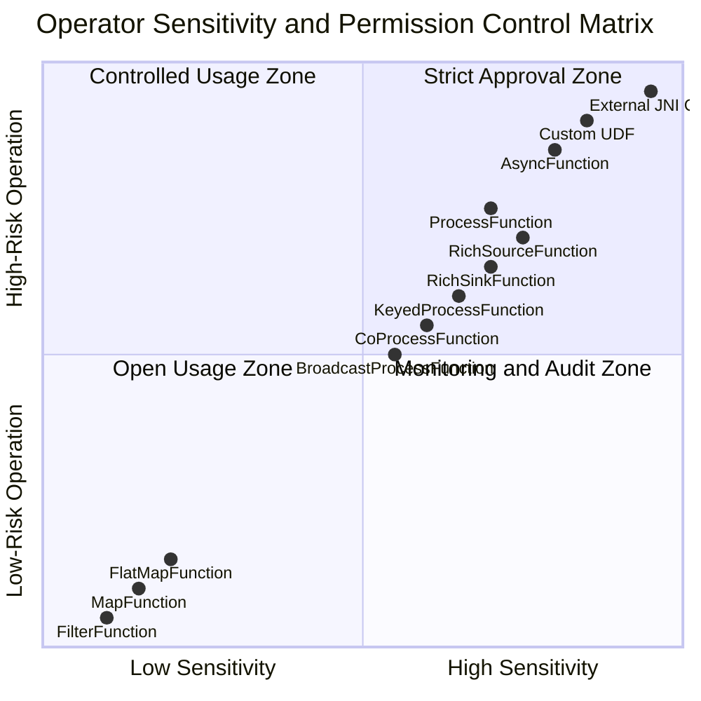
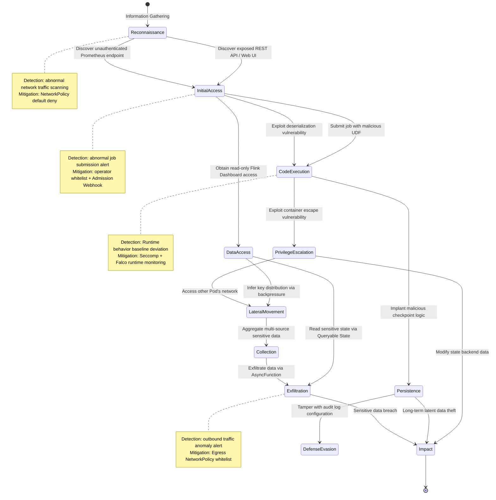

# Streaming Operator Security Model and Permission Control

> **Stage**: Knowledge/08-standards | **Prerequisites**: [streaming-security-compliance.md](streaming-security-compliance.md) | **Formalization Level**: L4
> **Status**: Production Ready | **Risk Level**: Medium | **Last Updated**: 2026-04

## Table of Contents

- [Streaming Operator Security Model and Permission Control](#streaming-operator-security-model-and-permission-control)
  - [Table of Contents](#table-of-contents)
  - [1. Definitions](#1-definitions)
  - [2. Properties](#2-properties)
  - [3. Relations](#3-relations)
    - [3.1 Relationship with Kubernetes RBAC](#31-relationship-with-kubernetes-rbac)
    - [3.2 Relationship with Flink Kerberos](#32-relationship-with-flink-kerberos)
    - [3.3 Relationship with GDPR/CCPA](#33-relationship-with-gdprccpa)
    - [3.4 Relationship with Zero Trust Architecture](#34-relationship-with-zero-trust-architecture)
  - [4. Argumentation](#4-argumentation)
    - [4.1 Operator Security Threat Surface Analysis](#41-operator-security-threat-surface-analysis)
    - [4.2 Attack Tree Analysis: Side-Channel Inference Attack](#42-attack-tree-analysis-side-channel-inference-attack)
    - [4.3 Counterexample Analysis: Bypass Paths of Whitelist Mechanism](#43-counterexample-analysis-bypass-paths-of-whitelist-mechanism)
  - [5. Proof / Engineering Argument](#5-proof--engineering-argument)
    - [5.1 Implementability Argument for GDPR Right to Erasure in Streaming Systems](#51-implementability-argument-for-gdpr-right-to-erasure-in-streaming-systems)
    - [5.2 Security Boundary Argument for Operator Sandbox Isolation](#52-security-boundary-argument-for-operator-sandbox-isolation)
  - [6. Examples](#6-examples)
    - [6.1 Flink Kerberos + SSL/TLS Security Configuration](#61-flink-kerberos--ssltls-security-configuration)
    - [6.2 Kubernetes RBAC: Operator Deployment Permission Control](#62-kubernetes-rbac-operator-deployment-permission-control)
    - [6.3 Differentially Private Aggregation Operator Implementation](#63-differentially-private-aggregation-operator-implementation)
    - [6.4 PII Data Identification and Masking Operator](#64-pii-data-identification-and-masking-operator)
  - [7. Visualizations](#7-visualizations)
    - [7.1 Streaming Operator Security Model Hierarchy](#71-streaming-operator-security-model-hierarchy)
    - [7.2 Operator Permission Control Matrix](#72-operator-permission-control-matrix)
    - [7.3 Operator Security Threat Model Diagram](#73-operator-security-threat-model-diagram)
  - [8. References](#8-references)

## 1. Definitions

**Def-SEC-01-01** [Operator Security Threat Model (算子安全威胁模型)]
> Given a stream processing system $\mathcal{S} = (O, D, K, C)$, where $O$ is the set of operators, $D$ is the set of data streams, $K$ is the set of state stores, and $C$ is the set of configurations. The operator security threat model $\mathcal{T}$ is defined as a quadruple $\mathcal{T} = (A, V, T, R)$, where $A$ is the set of attackers, $V$ is the set of system vulnerabilities, $T: A \times V \to \{0, 1\}$ is the attack reachability function, and $R: V \to \mathbb{R}^+$ is the risk quantification function.

The operator security threat model focuses on the security risks faced by **individual operators** and their combinations in a stream processing system. Unlike traditional batch processing systems, stream processing operators have characteristics of continuous execution, state accumulation, and real-time data flow, which significantly expand their threat surface—attackers can intrude not only through external interfaces but also deliver malicious payloads through the data streams themselves.

**Def-SEC-01-02** [Operator-Level Access Control (算子级权限控制)]
> Operator-Level Access Control is an authorization decision function $\text{Auth}: U \times O \times P \to \{\text{allow}, \text{deny}\}$, where $U$ is the set of users/principals, $O$ is the set of operator types, and $P = \{\text{deploy}, \text{execute}, \text{audit}, \text{admin}\}$ is the set of permissions. For any user $u \in U$, operator $o \in O$, and permission $p \in P$, $\text{Auth}(u, o, p) = \text{allow}$ if and only if there exists a role $r \in R$ such that $(u, r) \in \text{UA}$ (user-role assignment) and $(r, (o, p)) \in \text{PA}$ (permission-role assignment).

Operator-Level Access Control pushes the granularity of Access Control (访问控制) from the **job level** down to the **operator level**. This means that even if a user is authorized to submit stream processing jobs, the system can still further restrict their use of specific types of operators (such as `ProcessFunction`, `AsyncFunction`, and other operators with external calling capabilities). Apache Flink currently provides primarily job-level security control (via Kerberos + SSL/TLS); operator-level permission control usually requires external frameworks (such as StreamPark, Ververica Platform) or Kubernetes Admission Controller.

**Def-SEC-01-03** [Privacy-Preserving Operator (数据隐私保护算子)]
> A Privacy-Preserving Operator is a stream processing operator $\hat{o}: D_{\text{in}} \to D_{\text{out}}$ that satisfies privacy constraints, such that for any adjacent input streams $D_{\text{in}} \approx D'_{\text{in}}$ (differing by only one personal data record), the output stream satisfies $\Pr[\hat{o}(D_{\text{in}}) \in S] \leq e^\epsilon \cdot \Pr[\hat{o}(D'_{\text{in}}) \in S] + \delta$, where $\epsilon \geq 0$ is the privacy budget and $\delta \in [0, 1]$ is the failure probability. When $\delta = 0$, it is called pure $(\epsilon, 0)$-Differential Privacy (DP, 差分隐私).

A Privacy-Preserving Operator is an enhanced operator that overlays privacy constraints on top of standard operator semantics. It ensures that output data does not leak Personally Identifiable Information (PII, 个人身份信息) from the input data through technical means (such as data masking, Differential Privacy noise injection, and k-anonymization).

**Def-SEC-01-04** [Source Poisoning Attack (数据源投毒攻击)]
> A Source Poisoning Attack refers to an attacker controlling or forging upstream data sources to inject maliciously crafted data records $d_{\text{poison}}$ into the stream processing system, causing downstream operator $o$ to produce unexpected state changes $\Delta s \neq 0$ or outputs $\Delta o \neq 0$ after processing the record, ultimately leading the system behavior to deviate from specifications. Formally, the attacker's goal is to find $d_{\text{poison}}$ such that $\|o(s, d_{\text{poison}}) - o(s, d_{\text{normal}})\| > \theta$, where $\theta$ is the anomaly detection threshold.

Source poisoning is particularly dangerous in stream processing scenarios because:

1. Data arrives continuously, so the attack window exists for a long time;
2. Stateful operators (such as window aggregation, session state machines) accumulate the impact of malicious inputs into state $s$;
3. Unlike batch processing, stream systems usually cannot perform complete schema validation at the input stage.

**Def-SEC-01-05** [Operator Code Injection (算子代码注入)]
> Operator Code Injection refers to an attacker submitting User-Defined Functions (UDF, 用户自定义函数), User-Defined Aggregate Functions (UDAF, 用户自定义聚合函数), or User-Defined Table Functions (UDTF, 用户自定义表函数) containing malicious code, and executing arbitrary code in the stream processing system's execution environment. Attack vectors include but are not limited to: deserialization vulnerabilities (such as Java deserialization), dynamic code loading, JNDI injection, and executing system calls through the `open()` or `processElement()` methods of `ProcessFunction`.

Flink's DataStream API allows users to define `RichFunction`, whose lifecycle method `open(Configuration)` executes in the TaskManager JVM with the same privileges as the Flink process. If the job submission mechanism does not sandbox or sign-verify the code, attackers can exploit this to read local files, access network resources, or even achieve Remote Code Execution (RCE, 远程代码执行) through deserialization gadget chains.

**Def-SEC-01-06** [State Leakage (状态泄露)]
> State Leakage refers to sensitive information contained in the internal state $s \in K$ of a stream processing operator being accessed by unauthorized principals through the following pathways: (a) unencrypted checkpoint files $c \in C$; (b) savepoint export operations; (c) improperly configured access control of state backends (RocksDB/HDFS/S3); (d) unauthorized access to the Queryable State API.

State is the "memory" of a stream processing system. Window operators may cache raw events for hours or even days; aggregation operators may save user behavior statistics; Join operators may retain associated personal information. When checkpoints are written to distributed storage, if encryption is not enabled (such as Flink's `state.backend.incremental` + S3 SSE), sensitive state data will be persisted in plaintext.

**Def-SEC-01-07** [Side-Channel Attack (侧信道攻击)]
> A Side-Channel Attack refers to an attacker inferring the statistical distribution of input data or individual sensitive attributes by observing non-functional characteristics of the stream processing system (such as backpressure metrics, checkpoint duration, network buffer occupancy, CPU/GPU utilization patterns). Formally, let the observed feature vector be $\vec{f} = (f_1, f_2, \ldots, f_n)$; the attacker constructs an inference function $g: \vec{f} \to D_{\text{sensitive}}$, such that $g$ recovers sensitive data $d_{\text{secret}}$ with non-negligible probability.

Flink's Web UI provides detailed backpressure metrics—`outPoolUsage` and `inPoolUsage` reflect the saturation of network buffers. If an attacker has read-only access, they can observe how these metrics change with the distribution of input data. For example, when a specific key appears frequently, the processing delay of the corresponding KeyGroup will systematically increase, thereby exposing the existence and frequency of that key.

## 2. Properties

**Prop-SEC-01-01** [Operator Security Closure (算子安全闭包性)]
> If every operator $o_i \in O$ in the stream processing topology $G = (O, E)$ satisfies security property $\phi_i$, and all data flows $e_{ij} \in E$ between operators are encrypted and integrity-protected, then the entire topology $G$ satisfies security property $\Phi = \bigwedge_{i} \phi_i$.

**Derivation**: A stream processing topology can be viewed as a Directed Acyclic Graph (DAG, 有向无环图) (or an iterative graph allowing cycles). According to the threat model in Def-SEC-01-01, for an attacker to compromise the security property of the entire topology, they must breach at least one operator or one data flow edge. If each operator independently satisfies the security property (e.g., code signature verification passed, no known vulnerabilities) and data flow edges are protected by TLS/mTLS, the attacker cannot inject malicious data from the outside or tamper with data in transit. State transfer (via checkpoint) is also protected by encryption, so state leakage paths are blocked. According to the security composition principle[^1], the conjunction of individual component security constitutes system-level security.

**Lemma-SEC-01-01** [Whitelist Completeness (白名单机制的完备性)]
> Let the set of allowed operators be $O_{\text{allow}} \subset O$, and the set of denied operators be $O_{\text{deny}} = O \setminus O_{\text{allow}}$. If static analysis at job submission time can completely extract the operator type set $O_{\text{job}}$, then the whitelist mechanism is complete under the following condition:
> $$\forall \text{job } j, \quad O_{\text{job}} \subseteq O_{\text{allow}} \iff \text{Auth}(u, j, \text{deploy}) = \text{allow}$$

**Proof Sketch**: The core of the whitelist mechanism lies in the reliability of static analysis. Flink DataStream API's JobGraph has already determined all operator types before being submitted to the JobManager. By parsing the bytecode/JSON representation of the JobGraph at the client or Admission Controller layer, complete operator class names can be extracted. If static analysis is complete (no operator is missed) and the whitelist $O_{\text{allow}}$ is maintained and updated in sync with the Flink version, then the above equivalence holds. For dynamically loaded operators (such as UDFs instantiated via `Class.forName` reflection), static analysis may be incomplete; in this case, runtime sandbox mechanisms are needed as supplementary protection.

**Prop-SEC-01-02** [Differential Privacy Composition (差分隐私组合的隐私预算累积)]
> Let the stream processing topology contain $n$ Differentially Private operators, where the $i$-th operator provides $(\epsilon_i, \delta_i)$-DP guarantee. Then the entire topology satisfies $(\sum_{i=1}^n \epsilon_i, \sum_{i=1}^n \delta_i)$-DP guarantee (basic composition theorem); if the advanced composition theorem[^2] is used, for any $\delta' > 0$, the topology satisfies $(\epsilon_{\text{total}}, \delta_{\text{total}})$-DP, where
> $$\epsilon_{\text{total}} = \sqrt{2n \ln(1/\delta')} \cdot \max_i \epsilon_i + n \cdot \max_i \epsilon_i \cdot \frac{e^{\max_i \epsilon_i} - 1}{e^{\max_i \epsilon_i} + 1}, \quad \delta_{\text{total}} = \sum_{i=1}^n \delta_i + \delta'$$

This proposition directly impacts the engineering implementation of privacy-preserving operators: in a stream processing pipeline, each Differentially Private operator consumes a portion of the privacy budget $\epsilon$. When the budget is exhausted, data publication must be terminated or Privacy Accounting must be reset. For unbounded streams, streaming Differential Privacy mechanisms[^3] are needed, such as sliding-window-based budget recharge strategies.

## 3. Relations

### 3.1 Relationship with Kubernetes RBAC

Kubernetes RBAC (Role-Based Access Control, 基于角色的访问控制) provides an infrastructure-level permission control framework for stream processing systems. When deploying Flink on Kubernetes, there are three levels of RBAC mapping:

| Level | Kubernetes Resource | Flink Concept | Permission Mapping |
|------|----------------|-----------|---------|
| Cluster-level | `ClusterRole` + `ClusterRoleBinding` | Flink Operator | Manage FlinkDeployment CRD |
| Namespace-level | `Role` + `RoleBinding` | JobManager Pod | Create/manage TaskManager Pod, ConfigMap |
| Job-level | `ServiceAccount` | TaskManager | Credentials for accessing external services (S3, Kafka) |

Flink Kubernetes Operator creates two custom roles upon installation: `flink-operator` for managing FlinkDeployment resources, and `flink` for the JobManager to create TaskManager resources[^4]. **Key security principle**: For scenarios running untrusted code, the standalone Kubernetes deployment mode should be used—this mode does not require the Flink Pod's service account to have permission to launch additional Pods, thereby minimizing the risk of attacker lateral movement through the JobManager.

### 3.2 Relationship with Flink Kerberos

Flink's Kerberos security module architecture delegates authentication for operator access to external systems to three security modules[^5]:

1. **Hadoop Security Module**: Uses `UserGroupInformation` (UGI) to establish process-level login user context, for HDFS, HBase, YARN interactions;
2. **JAAS Security Module**: Provides dynamic security configuration for components relying on JAAS, such as ZooKeeper, Kafka;
3. **ZooKeeper Security Module**: Configures ZooKeeper service name and JAAS login context.

At the operator level, this means **all operators share the same Kerberos principal**. If a `ProcessFunction` in one job needs to access HDFS, and an `AsyncFunction` in another job needs to access Kafka, they both use the cluster-level keytab. This design creates tension between convenience and isolation—using different keytabs for different jobs or different operators requires launching independent Flink clusters.

### 3.3 Relationship with GDPR/CCPA

GDPR (General Data Protection Regulation, 通用数据保护条例) and CCPA (California Consumer Privacy Act, 加州消费者隐私法案) impose direct compliance requirements on stream processing systems:

- **Data Minimization Principle (Article 5(1)(c) GDPR)**: Operators should process only the personal data necessary to achieve the processing purpose. This requires operators to adopt **field-level filtering** at the data source operator—eliminating irrelevant PII fields rather than uniformly masking them at the end of the pipeline.
- **Purpose Limitation Principle (Article 5(1)(b) GDPR)**: The same data stream may not be used for subsequent processing incompatible with the purpose declared at collection. Operator permission control should be bound to the processing purpose; re-approval is required when the purpose changes.
- **Right to Erasure (Article 17 GDPR)**: When a data subject requests deletion of their personal data, the stream system must be able to locate and remove that data from all states (window state, Join state, aggregation state) and checkpoint copies.
- **CCPA's "Right to Know" and "Right to Delete"**: Enterprises must disclose the categories of personal information collected and delete relevant information upon receipt of a verifiable consumer request.

### 3.4 Relationship with Zero Trust Architecture

Zero Trust (零信任) security model's core principle is "Never Trust, Always Verify" (永不信任，始终验证). In the context of stream processing operator security, Zero Trust is embodied as:

1. **Identity as the Perimeter**: Each operator instance should have a verifiable identity (via ServiceAccount + SPIFFE/SPIRE identity), rather than relying on network location (Pod IP) to determine trustworthiness;
2. **Least Privilege**: Operators can only access external resources and data fields necessary for their function;
3. **Continuous Verification**: Verify operator image signatures and scan for vulnerabilities at deployment time through Admission Controller, and monitor system call anomalies at runtime through Falco/KubeArmor;
4. **Default Deny**: NetworkPolicy adopts a default-deny posture, only explicitly allowing necessary pod-to-pod communication[^6].

## 4. Argumentation

### 4.1 Operator Security Threat Surface Analysis

The threat surface of stream processing operators can be analyzed from four dimensions:

**Input Surface**

- Authentication bypass of data source connectors (Kafka, Kinesis, Pulsar);
- Tampering with Schema Registry causing operators to parse maliciously crafted data;
- Unvalidated input data causing operator internal state overflow (such as unlimited window state growth).

**Code Surface**

- Deserialization vulnerabilities in UDF/UDAF/ProcessFunction;
- System call escape via `Runtime.getRuntime().exec()`;
- External resource configuration files loaded through the `open()` method being contaminated.

**State Surface**

- ACL misconfiguration of checkpoint storage (S3, HDFS, NFS);
- Unencrypted RocksDB SST files readable by the local file system;
- Queryable State service endpoints exposed to the internet.

**Observation Surface**

- Flink Web UI's REST API exposing runtime metrics such as backpressure, latency, and throughput;
- Prometheus metrics endpoint (`/metrics`) exposing operator-level latency distributions;
- Sensitive data leakage in logs (such as `System.out.println(record)` printing raw events).

### 4.2 Attack Tree Analysis: Side-Channel Inference Attack

Taking the Side-Channel Attack defined in Def-SEC-01-07 as an example, a simplified attack tree is constructed:

```
Goal: Infer the existence of a specific key in the input data
├── [OR] Observe backpressure metrics
│   ├── [AND] Obtain read-only access to Flink Web UI
│   └── [AND] Inject test data at controllable frequency
│       └── Observe latency pattern of subtask corresponding to the target key
├── [OR] Observe checkpoint duration
│   ├── [AND] Obtain access to JobManager logs
│   └── [AND] Target key causes window state bloat
│       └── Checkpoint duration is positively correlated with the frequency of that key
└── [OR] Observe network I/O patterns
    ├── [AND] Obtain node-level network monitoring permissions
    └── [AND] Specific key triggers cross-node shuffle
        └── Network buffer occupancy is abnormal when the target key appears
```

**Mitigation Strategies**: (1) Implement role-based access control on runtime metrics, so developers and operators see metrics at different granularities; (2) Aggregate or add noise to latency data of sensitive subtasks at the metrics collection layer; (3) Restrict the overlap between network monitoring permissions and Flink cluster access permissions.

### 4.3 Counterexample Analysis: Bypass Paths of Whitelist Mechanism

The whitelist mechanism (a special case of Def-SEC-01-02) is not absolutely secure. Consider the following bypass scenarios:

- **Scenario A**: The whitelist allows `MapFunction`; the attacker invokes `java.lang.Runtime.exec()` via Java reflection inside `MapFunction`. Since reflection calls may be hidden in static analysis (e.g., using `Class.forName("java.lang.Runtime")`), class-name-based whitelists cannot detect this.
- **Scenario B**: The whitelist allows `AsyncFunction`; the attacker leaks data to a malicious server in `asyncInvoke()`. This behavior is considered normal external I/O at the static analysis level and is difficult to distinguish from legitimate external service access.
- **Scenario C**: The whitelist is based on operator class names, but the attacker constructs a Denial of Service (DoS, 拒绝服务) attack through a combination of Flink's `StateTtlConfig` and `CheckpointListener`—frequently triggering large-scale state cleanup causing GC pauses.

These counterexamples indicate that **whitelist must be used in combination with runtime sandboxes (such as Seccomp, AppArmor, gVisor)** to form Defense in Depth (纵深防御).

## 5. Proof / Engineering Argument

### 5.1 Implementability Argument for GDPR Right to Erasure in Streaming Systems

**Thm-SEC-01-01** [Theorem on the Implementability of the Right to Erasure in Streaming Systems]
> Let the stream processing system use event-time-based window operators, the state backend supports incremental checkpoints, and the data retention period is $T_{\text{retention}}$. If the system satisfies the following conditions:
> (1) Each input event $e$ carries a unique identifier $id(e)$ and a data subject identifier $subj(e)$;
> (2) State TTL is configured as $T_{\text{TTL}} \leq T_{\text{retention}}$;
> (3) Expired files of incremental checkpoints are cleaned up within $T_{\text{cleanup}} < T_{\text{retention}}$;
> then for any data subject $s$, after receiving a deletion request, the system can guarantee that all personal data of $s$ is completely removed from active state and historical checkpoints within at most $T_{\text{retention}} + T_{\text{cleanup}}$ time.

**Engineering Argument**:

The implementation of the right to erasure in stream systems faces a core contradiction—**the conflict between data immutability and erasure requirements**. In batch processing systems, deletion can be achieved by overwriting storage files; but in stream systems, checkpoints are append-only historical sequences, and operator states may store data in complex structures (such as `MapState<Key, List<Event>>` in window states).

The argument unfolds in three steps:

**Step 1: Deletion of Active State**. For Flink's `ValueState`, `ListState`, `MapState`, and `ReducingState`, custom "forget logic" can be implemented in the operator to delete records belonging to specific data subjects. Specifically, in `processElement()`, detect whether `subj(e)` matches the deletion request list; if so, skip state updates or remove the corresponding entry from `MapState`. Since Flink's state changes are only persisted at checkpoint time, the deletion of active state takes effect after the next checkpoint completes.

**Step 2: Processing of Historical Checkpoints**. Flink's incremental checkpoint depends on reference-counted snapshot files. After a state entry is deleted, old checkpoint files may still contain historical versions of that entry. The solutions are:

- Configure `state.checkpoints.num-retained` to limit the number of retained checkpoints;
- Use the automatic cleanup feature of the state backend (RocksDB compaction + TTL);
- For scenarios requiring immediate deletion, trigger a savepoint and then manually clean up the historical checkpoint directory.

**Step 3: Alignment of Event Time and Privacy Retention Period**. GDPR does not specify a uniform retention period, but requires that it "not be kept longer than is necessary for the purposes for which the personal data are processed." Let the event-time window required by the business be $T_{\text{window}}$; then the privacy retention period $T_{\text{retention}}$ should satisfy $T_{\text{retention}} \geq T_{\text{window}}$. By configuring `StateTtlConfig`'s `TimeCharacteristic.EventTime`, the state expiration time can be aligned with the event timestamp (rather than processing time), thereby automatically clearing data at the time point allowed by business logic:

```java
StateTtlConfig ttlConfig = StateTtlConfig
    .newBuilder(Time.days(90))  // 90-day privacy retention period
    .setUpdateType(OnCreateAndWrite)
    .setStateVisibility(NeverReturnExpired)
    .cleanupInRocksdbCompactFilter(1000)  // cleanup during compaction
    .build();
```

In summary, although implementing the right to erasure in stream systems is more complex than in batch systems, the compliance requirements of GDPR can be met in engineering through a three-layer strategy of **state TTL + incremental checkpoint cleanup + event time alignment**.

### 5.2 Security Boundary Argument for Operator Sandbox Isolation

**Thm-SEC-01-02** [Operator Sandbox Isolation Boundary Theorem]
> If stream processing operator $o$ runs in a sandbox environment satisfying the following conditions:
> (1) File system namespace isolation (chroot / overlayfs);
> (2) System call filtering (Seccomp-BPF or eBPF);
> (3) Network access restriction (NetworkPolicy + egress whitelist);
> (4) Resource quota limitation (CPU/memory/disk);
> then the impact of operator $o$ on the host machine and other operators is restricted within the sandbox boundary, i.e., for any malicious input $d_{\text{malicious}}$, $o(d_{\text{malicious}})$ cannot break the isolation property of the sandbox.

**Engineering Argument**: Modern container runtimes (containerd, cri-o) and Kubernetes Pod Security Standards provide a complete toolchain to implement the above conditions. In Flink on Kubernetes scenarios, operator-level sandboxes can be achieved through the following configurations:

1. **SecurityContext Configuration**:
   - `runAsNonRoot: true`—prohibit running as root;
   - `readOnlyRootFilesystem: true`—read-only root filesystem;
   - `allowPrivilegeEscalation: false`—prohibit privilege escalation;
   - `seccompProfile.type: RuntimeDefault`—enable default Seccomp filtering.

2. **NetworkPolicy Configuration**: Default deny all egress, only allow access to Kafka broker (port 9093) and S3 endpoint (port 443).

3. **ResourceQuota Configuration**: Limit the CPU and memory of each TaskManager Pod to prevent resource exhaustion attacks.

4. **gVisor or Kata Containers**: For high-risk operators (such as executing third-party UDFs), use user-space kernels or lightweight virtual machines to provide additional isolation layers.

The combination of these measures constitutes a Defense in Depth system, such that even if a single operator is compromised, the attacker cannot laterally move to other operators or the host machine.

## 6. Examples

### 6.1 Flink Kerberos + SSL/TLS Security Configuration

The following `flink-conf.yaml` configuration demonstrates how to enable Kerberos authentication and TLS encryption in Flink:

```yaml
# ========== Kerberos Authentication Configuration ==========
security.kerberos.login.keytab: /etc/security/keytabs/flink.keytab
security.kerberos.login.principal: flink@EXAMPLE.COM
security.kerberos.login.use-ticket-cache: false

# ========== Internal Communication TLS ==========
security.ssl.internal.enabled: true
security.ssl.internal.keystore: /etc/flink/ssl/flink.keystore
security.ssl.internal.keystore-password: ${SSL_KEYSTORE_PASSWORD}
security.ssl.internal.key-password: ${SSL_KEY_PASSWORD}
security.ssl.internal.truststore: /etc/flink/ssl/flink.truststore
security.ssl.internal.truststore-password: ${SSL_TRUSTSTORE_PASSWORD}

# ========== REST API TLS ==========
security.ssl.rest.enabled: true
security.ssl.rest.keystore: /etc/flink/ssl/rest.keystore
security.ssl.rest.keystore-password: ${SSL_KEYSTORE_PASSWORD}

# ========== Checkpoint Encryption (S3) ==========
state.backend: rocksdb
state.checkpoints.dir: s3p://flink-checkpoints/prod/
s3.access-key: ${S3_ACCESS_KEY}
s3.secret-key: ${S3_SECRET_KEY}
# S3 Server-Side Encryption (SSE-S3)
state.backend.rocksdb.memory.managed: true
```

**Security Notes**:

- All password fields use environment variables or encryption tools (such as Cloudera's EncryptTool[^7]) for injection, avoiding plaintext storage;
- `security.ssl.internal.enabled` ensures all RPC and data transmission between TaskManager and JobManager is encrypted;
- For S3 storage, it is recommended to enable SSE-KMS or SSE-C for stronger key management.

### 6.2 Kubernetes RBAC: Operator Deployment Permission Control

The following YAML demonstrates how to restrict Flink job deployment permissions within a specific namespace through Kubernetes RBAC, and combine with a custom Admission Webhook to implement an operator whitelist:

```yaml
# === Role: allow deploying basic operators, deny ProcessFunction ===
apiVersion: rbac.authorization.k8s.io/v1
kind: Role
metadata:
  namespace: flink-streaming
  name: flink-basic-operator-role
rules:
- apiGroups: ["flink.apache.org"]
  resources: ["flinkdeployments"]
  verbs: ["get", "list", "create"]
---
apiVersion: rbac.authorization.k8s.io/v1
kind: RoleBinding
metadata:
  namespace: flink-streaming
  name: flink-basic-operator-binding
subjects:
- kind: User
  name: "developer@example.com"
  apiGroup: rbac.authorization.k8s.io
roleRef:
  kind: Role
  name: flink-basic-operator-role
  apiGroup: rbac.authorization.k8s.io
---
# === NetworkPolicy: default deny, only allow access to Kafka and S3 ===
apiVersion: networking.k8s.io/v1
kind: NetworkPolicy
metadata:
  namespace: flink-streaming
  name: flink-default-deny
spec:
  podSelector:
    matchLabels:
      app: flink
  policyTypes:
  - Ingress
  - Egress
  egress:
  - to:
    - namespaceSelector:
        matchLabels:
          name: kafka
    ports:
    - protocol: TCP
      port: 9093
  - to:
    - ipBlock:
        cidr: 0.0.0.0/0
    ports:
    - protocol: TCP
      port: 443
```

**Operator Whitelist Admission Webhook Logic** (Python pseudocode):

```python
import json
from flask import Flask, request

ALLOWED_OPERATORS = {
    "org.apache.flink.streaming.api.functions.source.SourceFunction",
    "org.apache.flink.streaming.api.functions.sink.SinkFunction",
    "org.apache.flink.api.common.functions.MapFunction",
    "org.apache.flink.api.common.functions.FilterFunction",
    "org.apache.flink.api.common.functions.FlatMapFunction",
    # basic operator whitelist...
}

DENIED_OPERATORS = {
    "org.apache.flink.streaming.api.functions.ProcessFunction",
    "org.apache.flink.streaming.api.functions.async.AsyncFunction",
    "java.lang.Runtime",
}

def validate_jobgraph(jobgraph):
    operators = extract_operators(jobgraph)  # extract operator class names from JobGraph JSON
    for op in operators:
        if op in DENIED_OPERATORS:
            return False, f"Denied operator detected: {op}"
        if op not in ALLOWED_OPERATORS:
            return False, f"Unknown operator not in whitelist: {op}"
    return True, "Validation passed"

app = Flask(__name__)

@app.route('/validate', methods=['POST'])
def validate():
    admission_review = request.get_json()
    jobgraph = admission_review['request']['object']
    allowed, message = validate_jobgraph(jobgraph)
    # construct AdmissionResponse...
    return json.dumps({"allowed": allowed, "message": message})
```

### 6.3 Differentially Private Aggregation Operator Implementation

The following code demonstrates how to implement an $(\epsilon, 0)$-Differentially Private count aggregation operator in Flink:

```java
import org.apache.flink.streaming.api.functions.windowing.ProcessWindowFunction;
import org.apache.flink.streaming.api.windowing.windows.TimeWindow;
import org.apache.flink.util.Collector;

import java.security.SecureRandom;

/**
 * Differentially Private count operator: adds Laplace noise to window count results
 * Satisfies (epsilon, 0)-differential privacy with sensitivity 1
 * (adding/removing a single record affects the count by at most 1)
 */
public class DifferentialPrivacyCountFunction<T>
    extends ProcessWindowFunction<T, PrivacyPreservingResult<T>, String, TimeWindow> {

    private final double epsilon;  // privacy budget
    private final SecureRandom random;

    public DifferentialPrivacyCountFunction(double epsilon) {
        if (epsilon <= 0) {
            throw new IllegalArgumentException("Privacy budget epsilon must be positive");
        }
        this.epsilon = epsilon;
        this.random = new SecureRandom();
    }

    @Override
    public void process(String key, Context context,
                        Iterable<T> elements,
                        Collector<PrivacyPreservingResult<T>> out) {
        // Step 1: compute true count
        long trueCount = 0;
        for (T ignored : elements) {
            trueCount++;
        }

        // Step 2: sample noise from Laplace(0, sensitivity/epsilon) distribution
        // sensitivity = 1 (L1 sensitivity of count query)
        double scale = 1.0 / epsilon;
        double noise = sampleLaplace(0.0, scale);

        // Step 3: output noised result (non-negative truncation)
        long noisyCount = Math.max(0, Math.round(trueCount + noise));

        // Step 4: privacy accounting (global budget management should be handled by an external service)
        // auditLog.recordConsumption(key, epsilon, context.window());

        out.collect(new PrivacyPreservingResult<>(
            key,
            context.window().getStart(),
            context.window().getEnd(),
            noisyCount,
            epsilon
        ));
    }

    /**
     * Laplace distribution sampling: using inverse transform sampling
     */
    private double sampleLaplace(double mean, double scale) {
        double u = random.nextDouble() - 0.5;  // u ~ Uniform(-0.5, 0.5)
        return mean - scale * Math.signum(u) * Math.log(1 - 2 * Math.abs(u));
    }
}
```

**Usage Constraints and Notes**:

- The choice of privacy budget $\epsilon$ requires a trade-off between data utility and privacy protection. Typically $\epsilon \in [0.1, 1.0]$ is considered strong privacy protection, and $\epsilon \in [1.0, 10.0]$ is suitable for medium-sensitivity scenarios;
- This operator only guarantees **Differential Privacy within a single window**. If the same data subject appears in multiple windows, the composition theorem (Prop-SEC-01-02) must be applied to accumulate the privacy budget;
- For aggregation queries such as sum and mean, the sensitivity calculation differs (sum sensitivity is the numerical upper bound $M$, mean sensitivity is $2M/n$), and the noise scale needs to be adjusted accordingly.

### 6.4 PII Data Identification and Masking Operator

```java
import org.apache.flink.api.common.functions.MapFunction;
import java.util.regex.Pattern;

/**
 * PII masking operator: uses regular expressions to identify common PII fields and perform masking
 */
public class PIIMaskingFunction implements MapFunction<Event, Event> {

    // phone number masking: keep first 3 digits and last 4 digits
    private static final Pattern PHONE_PATTERN =
        Pattern.compile("(1\\d{2})\\d{4}(\\d{4})");
    // ID card number masking: keep first 6 digits and last 4 digits
    private static final Pattern ID_CARD_PATTERN =
        Pattern.compile("(\\d{6})\\d{8}(\\d{4})");
    // email masking: keep first character and domain
    private static final Pattern EMAIL_PATTERN =
        Pattern.compile("(.)[^@]*(@.+)");

    @Override
    public Event map(Event event) {
        String payload = event.getPayload();

        // phone number masking
        payload = PHONE_PATTERN.matcher(payload)
            .replaceAll("$1****$2");
        // ID card number masking
        payload = ID_CARD_PATTERN.matcher(payload)
            .replaceAll("$1********$2");
        // email masking
        payload = EMAIL_PATTERN.matcher(payload)
            .replaceAll("$1****$2");

        return new Event(event.getId(), payload, event.getTimestamp());
    }
}
```

**Engineering Practice Recommendations**: For production environments, it is recommended to use dedicated data classification tools (such as Apache Ranger, AWS Macie, Azure Purview) to identify PII at the data source layer, rather than relying on regular expressions. Masking strategies should be bound to data classification tags to achieve Policy-as-Code management.

## 7. Visualizations

### 7.1 Streaming Operator Security Model Hierarchy

The following hierarchy diagram shows the five-layer defense system of the streaming operator security model, progressing from the infrastructure layer to the data layer:

```mermaid
graph TB
    subgraph L5["Data Layer"]
        D1["PII Identification and Classification"]
        D2["Data Masking / Tokenization"]
        D3["Differential Privacy Noise Injection"]
        D4["Field-Level Minimization"]
    end

    subgraph L4["Operator Layer"]
        O1["Operator Whitelist / Blacklist"]
        O2["UDF Code Signature Verification"]
        O3["Sensitive Operator Approval Workflow"]
        O4["Operator-Level Resource Quota"]
    end

    subgraph L3["Job Layer"]
        J1["Job Submission Identity Authentication"]
        J2["Job-Level Encryption Configuration"]
        J3["Queryable State Access Control"]
    end

    subgraph L2["Cluster Layer"]
        C1["K8s RBAC / Namespace Isolation"]
        C2["NetworkPolicy Micro-Segmentation"]
        C3["Flink Kerberos Authentication"]
        C4["TLS / mTLS Transport Encryption"]
    end

    subgraph L1["Infrastructure Layer"]
        I1["Node-Level Seccomp / AppArmor"]
        I2["gVisor / Kata Containers"]
        I3["Image Signing and Vulnerability Scanning"]
        I4["Audit Logs and Monitoring Alerts"]
    end

    L1 --> L2
    L2 --> L3
    L3 --> L4
    L4 --> L5

    style L1 fill:#e1f5fe
    style L2 fill:#e8f5e9
    style L3 fill:#fff3e0
    style L4 fill:#fce4ec
    style L5 fill:#f3e5f5
```



**Note**: This five-layer model follows the Defense in Depth principle. The infrastructure layer provides OS-level isolation; the cluster layer provides network and service identity management; the job layer controls permissions in the job lifecycle; the operator layer implements fine-grained operator type control; the data layer ensures privacy protection of personal information during flow. The failure of any single layer will not cause the overall security system to collapse, because upper and lower layers still provide compensating protection.

### 7.2 Operator Permission Control Matrix

The following matrix shows the access permissions of different roles to stream processing operator types, embodying the Principle of Least Privilege:



**Matrix Interpretation**:

- **Open Usage Zone (lower-left)**: `MapFunction`, `FilterFunction`, and other pure transformation operators have no side effects and are allowed for all authenticated users;
- **Monitoring and Audit Zone (lower-right)**: `FlatMapFunction` and other operators that can generate multiple output records require operation logging but do not need special approval;
- **Controlled Usage Zone (upper-left)**: `KeyedProcessFunction`, `CoProcessFunction`, and other operators with state access capabilities require department-level approval and state TTL configuration;
- **Strict Approval Zone (upper-right)**: `AsyncFunction` (can initiate external I/O), custom UDFs (arbitrary code execution), and external JNI calls (breaking JVM sandbox) are high-risk operators and must undergo multi-level approval by the security team, and run in isolated namespaces or gVisor environments.

### 7.3 Operator Security Threat Model Diagram

The following state transition diagram shows the typical path an attacker takes from initial intrusion to achieving the attack goal, as well as detection and mitigation measures at each stage:



**Threat Model Note**: This diagram is modeled based on the tactical stages of the MITRE ATT&CK framework[^8]. Unique threats to stream processing systems include:

- **Data-level attack paths**: Attackers do not need full code execution control; they can influence the behavior of stateful operators solely through data input (source poisoning);
- **Observation-level attack paths**: Read-only access permissions are sufficient to infer sensitive information through system side channels;
- **Persistence-level attack paths**: Malicious logic can be hidden in checkpoint states and continue to take effect after job restart.

## 8. References

[^1]: M. Abadi et al., "Deep Learning with Differential Privacy", CCS 2016. <https://arxiv.org/abs/1607.00133>

[^2]: C. Dwork and A. Roth, "The Algorithmic Foundations of Differential Privacy", Foundations and Trends in Theoretical Computer Science, 2014. <https://www.cis.upenn.edu/~aaroth/Papers/privacybook.pdf>

[^3]: T. Wang et al., "Continuous Release of Data Streams under both Centralized and Local Differential Privacy", CCS 2021. <https://dl.acm.org/doi/10.1145/3460120.3484740>

[^4]: Confluent Documentation, "Configure security for a Flink job", 2025. <https://docs.confluent.io/cp-flink/current/jobs/configure/security.html>

[^5]: Apache Flink Documentation, "Kerberos Authentication Setup and Configuration", Flink 1.13. <https://nightlies.apache.org/flink/flink-docs-release-1.13/docs/deployment/security/security-kerberos/>

[^6]: Microsoft Tech Community, "Zero-Trust Kubernetes: Enforcing Security & Multi-Tenancy with Custom Admission Webhooks", 2025. <https://techcommunity.microsoft.com/blog/azureinfrastructureblog/zero-trust-kubernetes-enforcing-security--multi-tenancy-with-custom-admission-we/4466646>

[^7]: Cloudera Documentation, "Securing Apache Flink", CSA 1.16. <https://docs.cloudera.com/csa/1.16.0/security/topics/csa-enable-security.html>

[^8]: MITRE Corporation, "MITRE ATT&CK Framework for Containers", 2025. <https://attack.mitre.org/matrices/enterprise/cloud/>
