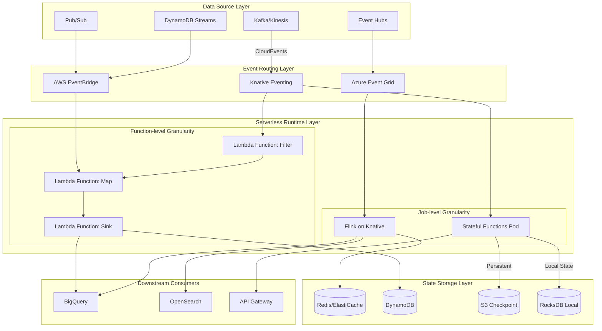
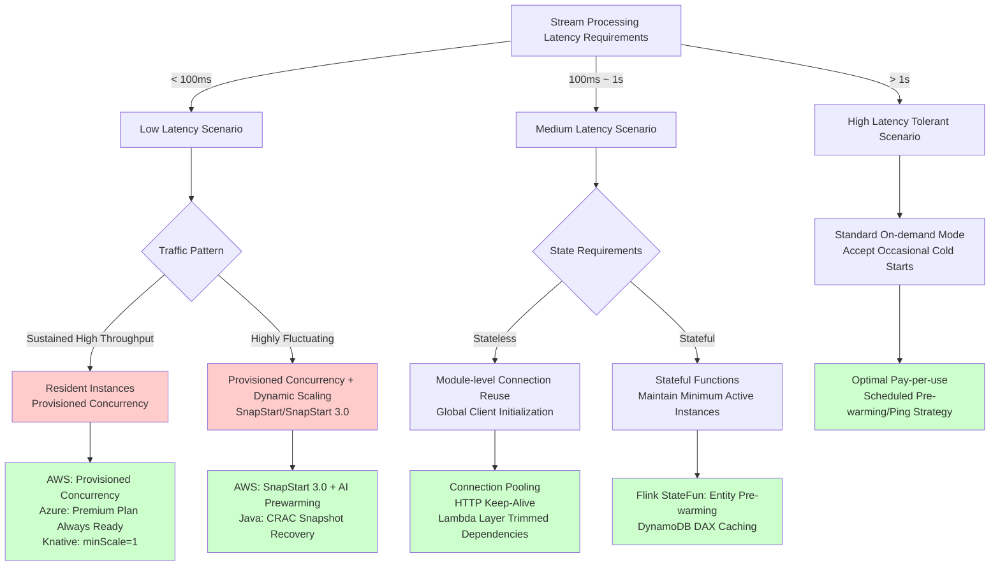
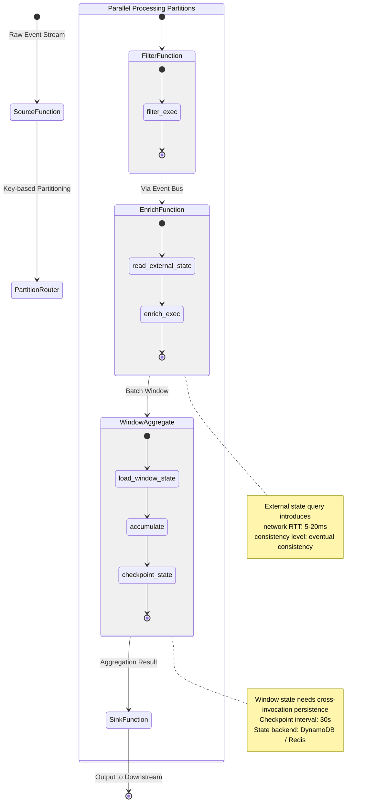

# Stream Processing Operators and Serverless/FaaS Integration

> Stage: Knowledge/06-frontier | Prerequisites: [Flink Runtime Architecture](flink-runtime-overview.md), [StateBackend Design](flink-state-backends-deep-comparison.md) | Formalization Level: L4
> Last Updated: 2026-04-30

## 1. Concept Definitions

**Def-FAAS-01-01** (Function-as-a-Service, FaaS). Function-as-a-Service (FaaS, 函数即服务) is a cloud computing execution model where the cloud provider dynamically manages the allocation of compute resources. Developers only need to deploy independent function code units, and billing is based on actual execution time and resource consumption. Typical representatives include AWS Lambda, Azure Functions, and Google Cloud Functions.

**Def-FAAS-01-02** (Event-driven Functions, 事件驱动函数). Event-driven functions are FaaS function units triggered by external events. Event sources can be message queues (Kafka/SQS/Pub/Sub), HTTP requests, database change streams (DynamoDB Streams/Debezium), or scheduled triggers. Their execution semantics can be formalized as:

$$
\forall f \in \text{Functions}, \exists e \in \text{Events} : \text{trigger}(f) \iff \text{match}(e, \text{pattern}_f)
$$

where $\text{pattern}_f$ defines the event pattern that triggers function $f$.

**Def-FAAS-01-03** (Serverless Stream Processing, Serverless流处理). Serverless stream processing is a computing paradigm that deploys stream computing logic on top of Serverless (无服务器) runtimes, leveraging FaaS auto-scaling capabilities to process unbounded data streams. Its core characteristics include: (a) zero server management, (b) event-level elastic scaling, (c) pay-per-invocation, and (d) stateless execution assumption.

**Def-FAAS-01-04** (Function Cold Start, 函数冷启动). Function cold start refers to the additional latency incurred when a FaaS platform needs to reinitialize the execution environment after a function has not been invoked for a long time, including runtime loading, dependency initialization, and network connection establishment. The formal definition is:

$$
\text{ColdStartLatency} = T_{\text{env-init}} + T_{\text{runtime-load}} + T_{\text{dependency-init}} + T_{\text{conn-establish}}
$$

**Def-FAAS-01-05** (Operator-level Function Decomposition, 算子级函数分解). An architectural pattern that maps each logical operator (e.g., Map, Filter, Aggregate, Join) in a stream processing job to an independent Serverless function, with functions passing data to each other through an event bus or message queue.

**Def-FAAS-01-06** (Stateful Serverless, 有状态Serverless). A Serverless computing model that breaks through the traditional FaaS stateless assumption, allowing functions to maintain state across invocations or achieve cross-invocation state sharing through external state storage. Apache Flink Stateful Functions and Azure Durable Functions belong to this category of frameworks.

## 2. Property Derivation

**Lemma-FAAS-01-01** (Event-granularity Elasticity Lower Bound). Let the input event arrival rate of the stream processing system be $\lambda$ (events/second), and the processing capacity of a single function instance be $\mu$ (events/second). Then the minimum number of function instances required to maintain steady state is:

$$
N_{\min} = \left\lceil \frac{\lambda}{\mu} \right\rceil
$$

FaaS platforms can complete scaling from 0 to $N_{\min}$ within $\Delta t_{\text{scale}} \approx 100\text{ms} \sim 10\text{s}$, which is significantly faster than traditional container orchestration (minute-level).

**Lemma-FAAS-01-02** (Impact of Cold Start Latency on Throughput). Let the function cold start probability be $p_c$, the cold start latency be $L_c$, and the warm start processing latency be $L_w$. Then the effective average processing latency is:

$$
L_{\text{avg}} = p_c \cdot L_c + (1 - p_c) \cdot L_w
$$

For real-time stream processing (requiring end-to-end latency $< 1\text{s}$), if $p_c > 0.1$ and $L_c > 5\text{s}$, the Serverless architecture cannot meet the SLA.

**Lemma-FAAS-01-03** (Inter-function Communication Overhead Lower Bound). In an operator-level function decomposition architecture, if adjacent operators are mapped to independent functions and communicate via HTTP/gRPC, let the single network round-trip latency be $R_{\text{net}}$ and the serialization/deserialization overhead be $S$. Then the additional overhead for per-event cross-operator transfer is at least:

$$
O_{\text{comm}} = R_{\text{net}} + S \geq 2 \cdot T_{\text{RTT}} + S
$$

Within the same data center $T_{\text{RTT}} \approx 0.5 \sim 2\text{ms}$, but across availability zones it can reach $20 \sim 100\text{ms}$, which is significantly higher than Flink TaskManager local network transmission ($< 0.1\text{ms}$).

**Prop-FAAS-01-01** (Fundamental Conflict Between Stateless Assumption and Stateful Stream Processing). The stateless assumption of traditional FaaS functions ($\forall t, \text{state}(f, t) = \emptyset$) is fundamentally contradictory to the stateful requirements of stream processing operators (e.g., window aggregation needs to maintain $\sum_{e \in w} e.\text{value}$). Resolving this contradiction requires introducing external state storage or a Stateful Serverless runtime.

## 3. Relation Establishment

### 3.1 Mapping Between Event-driven Functions and Stream Processing

There is a many-to-many mapping relationship between event-driven functions and stream processing operators:

| Dimension | Event-driven Functions (FaaS) | Stream Processing Operators (Flink) |
|-----------|------------------------------|-------------------------------------|
| Trigger Granularity | Single Event / Micro-batch | Continuous Data Stream / Event Time Window |
| Execution Model | Request-response / Async Event | Continuous Running / Bounded/Unbounded Stream |
| State Management | Stateless (Default) | Local State (Keyed/Operator State) |
| Scaling Unit | Function Instance | Task Slot / TaskManager |
| Fault Tolerance | Platform Retry / DLQ | Checkpoint / Savepoint |
| Latency Characteristic | Variable Latency with Cold Start | Sub-second Stable Latency |

### 3.2 Serverless Stream Processing Architecture Spectrum

From the perspective of control flow and data flow coupling degree, Serverless stream processing architectures can be divided into three levels:

1. **Function-level**: Each operator corresponds to an independent function (AWS Lambda + Kinesis), chained through message queues
2. **Job-level**: The entire stream job runs in Serverless containers (Knative Serving + Flink JobManager)
3. **Hybrid-level**: Stateful operators reside in a Stateful Runtime, while stateless operators are offloaded to FaaS (Flink Stateful Functions)

### 3.3 Major Platform Integration Matrix

| Platform | Serverless Runtime | Stream Data Sources | State Storage | Integration Mode |
|----------|-------------------|---------------------|---------------|------------------|
| AWS | Lambda | Kinesis, MSK, DynamoDB Streams | DynamoDB, ElastiCache | Trigger / Polling |
| Azure | Functions | Event Hubs, IoT Hub | Cosmos DB, Blob Storage | Binding Trigger |
| GCP | Cloud Functions | Pub/Sub, Dataflow | Firestore, Bigtable | Native Integration |
| K8s Ecosystem | Knative | Kafka, NATS | Redis, Cassandra | Eventing Bridge |

## 4. Argumentation

### 4.1 Core Challenges of Stateful Serverless

Traditional FaaS architectures assume functions are stateless, with each invocation being independent. However, core operators in stream processing such as window aggregation, session analysis, and CEP (Complex Event Processing, 复杂事件处理) pattern matching are inherently stateful. The resolution paths for this contradiction include:

**Path A: Externalized State**
Storing state in external storage such as DynamoDB, Redis, or Firestore. The advantage is that it does not depend on a specific FaaS platform; the disadvantage is the introduction of network RTT (typically $5 \sim 20\text{ms}$) and consistency complexity.

**Path B: Stateful Functions Runtime**
Apache Flink Stateful Functions provides a "stateful entity" abstraction, where each entity has a unique ID and persistent state. Function invocations are routed to the corresponding entity via messages. Its state access is local (co-located with the StateBackend), avoiding network round-trips.

**Path C: Durable Functions / Durable Execution**
Azure Durable Functions and AWS Durable Functions (2026 preview) provide "durable execution" semantics, allowing functions to pause at await points, serialize state, and resume on subsequent events. This is suitable for asynchronous workflows, but support for high-throughput stream processing remains limited.

### 4.2 Function Granularity vs. Job Granularity Trade-off Analysis

The pros and cons of decomposing stream jobs into function-level granularity:

**Advantages**:

- Finer elasticity: Bottleneck operators can scale independently
- Polyglot support: Each function can be implemented in a different language
- Better cost efficiency: Non-hotspot operators can scale down to zero on demand

**Disadvantages**:

- Serialization overhead: Each function boundary requires event serialization/deserialization
- Difficult state access: Window state needs to be synchronized across functions
- Debugging complexity: Distributed tracing must span the function chain
- Semantic integrity: Exactly-once guarantees are difficult to maintain across function boundaries

**Conclusion**: For high-throughput ($> 10^4$ events/second), low-latency ($< 1\text{s}$), stateful stream processing scenarios, job-level granularity (entire Flink job running in Serverless containers) is superior to function-level granularity.

## 5. Formal Proof / Engineering Argument

### 5.1 Serverless Stream Processing Cost Model

**Thm-FAAS-01-01** (Serverless Stream Processing Cost Upper Bound). Let the event arrival rate of the stream processing system be $\lambda$, the processing time per event be $t_p$, and the memory configuration be $M$. Then the monthly processing cost upper bound for AWS Lambda is:

$$
C_{\text{monthly}} \leq \lambda \cdot t_p \cdot M \cdot c_{\text{GB-s}} \cdot T_{\text{month}} + N_{\text{warm}} \cdot c_{\text{provisioned}} \cdot T_{\text{month}}
$$

where $c_{\text{GB-s}}$ is the per GB-second unit price (approx. $0.0000166667), and $N_{\text{warm}}$ is the number of provisioned concurrency instances. When $\lambda$ fluctuates drastically (e.g., 10x peak during daytime), the cost-effectiveness of Serverless is significantly better than resident clusters.

**Proof Sketch**:

1. Lambda is billed based on actual execution time and memory configuration, with no charges when there are no requests
2. Resident clusters (EC2/K8s) need to provision resources for peak loads, generating idle costs during troughs
3. When the peak/valley ratio $> 5$, the total cost of ownership (TCO) of Serverless is lower than resident clusters

### 5.2 Cold Start Latency Constraints on Real-time Performance

**Thm-FAAS-01-02** (Cold Start Constraint Theorem). For a stream processing pipeline requiring end-to-end latency not exceeding $D_{\max}$, if the function chain length is $k$, the single cold start latency is $L_c$, and the warm invocation latency is $L_w$, then the maximum allowable cold start proportion is:

$$
p_c \leq \frac{D_{\max} - k \cdot L_w}{k \cdot (L_c - L_w)}
$$

**Derivation**:
The total latency constraint is $k \cdot [p_c \cdot L_c + (1 - p_c) \cdot L_w] \leq D_{\max}$, rearranging gives the above inequality.

**Example**: Let $D_{\max} = 500\text{ms}$, $k = 5$, $L_w = 50\text{ms}$, $L_c = 2000\text{ms}$ (Java function). Then:

$$
p_c \leq \frac{500 - 250}{5 \cdot 1950} = \frac{250}{9750} \approx 2.56\%
$$

That is, the cold start proportion must be below 2.56%, which poses a severe challenge for burst traffic scenarios.

## 6. Example Verification

### 6.1 Knative Eventing + Flink Integration Configuration

The following example demonstrates how to use Knative Eventing to route Kafka events to a Flink Stateful Functions application:

```yaml
# 1. KafkaSource: Consume events from Kafka topic
apiVersion: sources.knative.dev/v1beta1
kind: KafkaSource
metadata:
  name: kafka-source-orders
  namespace: stream-processing
spec:
  consumerGroup: statefun-orders-consumer
  bootstrapServers:
    - kafka-cluster-kafka-bootstrap.kafka:9092
  topics:
    - orders-events
  sink:
    ref:
      apiVersion: serving.knative.dev/v1
      kind: Service
      name: statefun-orders-service

---
# 2. Knative Service: Run Flink Stateful Functions module
apiVersion: serving.knative.dev/v1
kind: Service
metadata:
  name: statefun-orders-service
  namespace: stream-processing
spec:
  template:
    metadata:
      annotations:
        autoscaling.knative.dev/minScale: "1"  # Keep at least 1 instance to avoid cold start
        autoscaling.knative.dev/maxScale: "50"
        autoscaling.knative.dev/targetConcurrency: "100"
    spec:
      containers:
        - image: myregistry/statefun-orders-module:v1.2.0
          ports:
            - containerPort: 8000
          env:
            - name: STATEFUL_FUNCTIONS_MODULE_NAME
              value: "orders-module"
            - name: FLINK_STATE_BACKEND
              value: "rocksdb"
            - name: FLINK_CHECKPOINT_DIR
              value: "s3://my-bucket/statefun-checkpoints"
          resources:
            requests:
              memory: "2Gi"
              cpu: "1000m"
            limits:
              memory: "4Gi"
              cpu: "2000m"

---
# 3. State storage configuration (Stateful Functions State Backend)
apiVersion: v1
kind: ConfigMap
metadata:
  name: statefun-state-config
  namespace: stream-processing
data:
  flink-conf.yaml: |
    state.backend: rocksdb
    state.backend.incremental: true
    state.checkpoints.dir: s3://my-bucket/statefun-checkpoints
    state.savepoints.dir: s3://my-bucket/statefun-savepoints
    execution.checkpointing.interval: 30s
    execution.checkpointing.min-pause-between-checkpoints: 10s
```

```java
// 4. Stateful Functions module definition (Java)
public class OrderModule implements StatefulFunctionModule {
    @Override
    public void configure(Map<String, String> globalConfiguration, Binder binder) {
        // Register function type and routing rules
        binder.bindFunctionProvider(
            FunctionType.of("orders", "order-aggregator"),
            new OrderAggregatorProvider()
        );

        // Extract target function address from Kafka messages
        binder.bindIngressRouter(
            KafkaIngressNames.ORDERS,
            new OrderRouter()
        );
    }
}

// Stateful function implementation
public class OrderAggregator implements StatefulFunction {
    @Persisted
    private final PersistedValue<OrderState> state = PersistedValue.of("order-state", OrderState.class);

    @Override
    public void invoke(Context context, Object input) {
        OrderEvent event = (OrderEvent) input;
        OrderState current = state.value();

        if (current == null) {
            current = new OrderState(event.getOrderId());
        }

        current.accumulate(event);
        state.update(current);

        // Send summary result downstream when order is complete
        if (current.isComplete()) {
            context.send(
                MessageBuilder.forAddress(FunctionType.of("orders", "order-sink"), event.getOrderId())
                    .withPayload(current.toSummary())
                    .build()
            );
        }
    }
}
```

### 6.2 AWS Lambda + Kinesis Data Streams Stateless Processing

```python
# Lambda function processing Kinesis data stream (Python)
import json
import base64
import boto3
from aws_lambda_powertools import Logger, Tracer

logger = Logger()
tracer = Tracer()
dynamodb = boto3.resource('dynamodb')
metrics_table = dynamodb.Table('stream-metrics')

@logger.inject_lambda_context
@tracer.capture_lambda_handler
def lambda_handler(event, context):
    """
    Process Kinesis batch events, perform lightweight filtering and transformation.
    Stateless design: all intermediate results are written to DynamoDB or sent to downstream SNS.
    """
    processed = 0
    failed = 0

    for record in event['Records']:
        try:
            # Kinesis data is Base64 encoded
            payload = base64.b64decode(record['kinesis']['data'])
            event_data = json.loads(payload)

            # Business logic: filter abnormal metrics and write to DynamoDB
            if event_data.get('metric_value', 0) > 100:
                metrics_table.put_item(Item={
                    'metric_id': record['kinesis']['sequenceNumber'],
                    'timestamp': event_data['timestamp'],
                    'device_id': event_data['device_id'],
                    'value': event_data['metric_value'],
                    'alert_level': 'critical'
                })

            processed += 1

        except Exception as e:
            logger.error(f"Failed to process record: {e}")
            failed += 1

    logger.info(f"Batch complete: {processed} processed, {failed} failed")
    return {'processed': processed, 'failed': failed}
```

## 7. Visualizations

### 7.1 Serverless Stream Processing Architecture Panorama

The following architecture diagram shows the complete data flow from data sources through Serverless processing to state storage:



### 7.2 Cold Start Optimization Strategy Decision Tree



### 7.3 Function Orchestration and State Flow Diagram

The following state diagram illustrates event routing and state consistency challenges in operator-level function decomposition:



## 8. References
