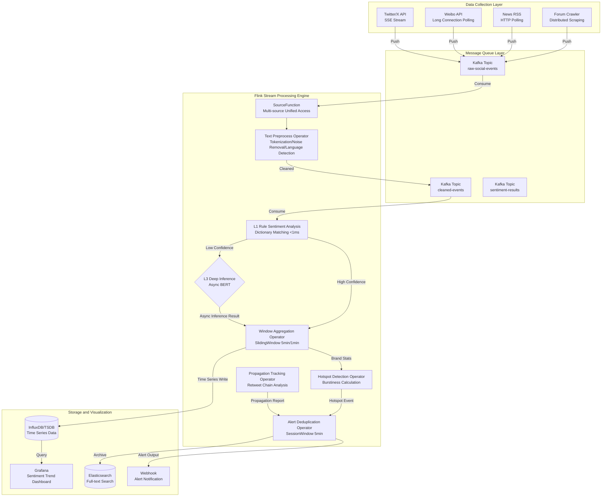
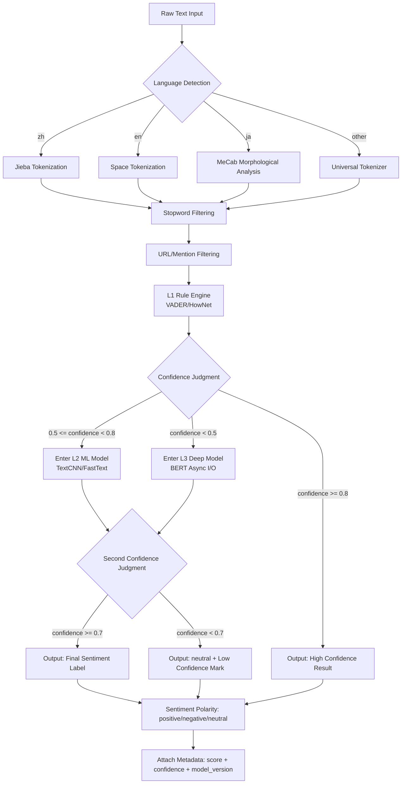
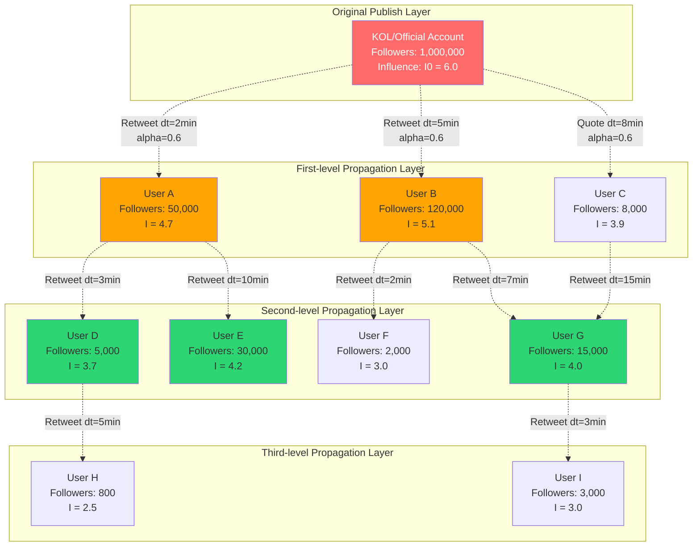
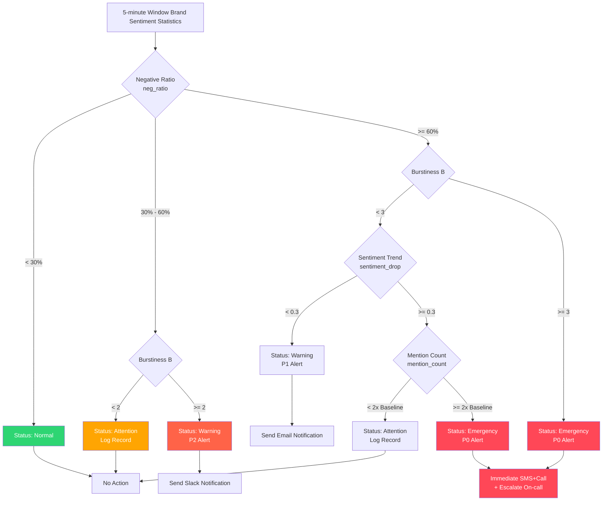

# Streaming Operators and Real-Time Social Media Sentiment Monitoring System

> Stage: Knowledge/06-frontier | Prerequisites: [Streaming Operators and AI/ML Integration (流处理算子与AI/ML集成)](./operator-ai-ml-integration.md), [Real-Time AI Inference Architecture (实时AI推理架构)](./realtime-ai-inference-architecture.md), [Flink DataStream API](../Flink/03-api/flink-datastream-api.md) | Formalization Level: L4
>
> **Status**: Frontier Practice | **Risk Level**: Medium | **Last Updated**: 2026-04

---

## Table of Contents

- [Streaming Operators and Real-Time Social Media Sentiment Monitoring System](#streaming-operators-and-real-time-social-media-sentiment-monitoring-system)
  - [Table of Contents](#table-of-contents)
  - [1. Definitions](#1-definitions)
    - [Def-SENT-01-01: Social Media Event Stream (舆情事件流)](#def-sent-01-01-social-media-event-stream-舆情事件流)
    - [Def-SENT-01-02: Sentiment Analysis Operator (情感分析算子)](#def-sent-01-02-sentiment-analysis-operator-情感分析算子)
    - [Def-SENT-01-03: Hotspot Detection Window (热点检测窗口)](#def-sent-01-03-hotspot-detection-window-热点检测窗口)
    - [Def-SENT-01-04: Burstiness Score (突发度指标)](#def-sent-01-04-burstiness-score-突发度指标)
    - [Def-SENT-01-05: Propagation Path Graph (传播路径图)](#def-sent-01-05-propagation-path-graph-传播路径图)
    - [Def-SENT-01-06: Sentiment Alert Rule (舆情告警规则)](#def-sent-01-06-sentiment-alert-rule-舆情告警规则)
  - [2. Properties](#2-properties)
    - [Lemma-SENT-01-01: Convergence of Sliding Window Sentiment Mean](#lemma-sent-01-01-convergence-of-sliding-window-sentiment-mean)
    - [Lemma-SENT-01-02: False Alarm Rate Upper Bound for Burstiness Detection](#lemma-sent-01-02-false-alarm-rate-upper-bound-for-burstiness-detection)
    - [Prop-SENT-01-01: Sparsity Guarantee of Keyword Co-occurrence Graph](#prop-sent-01-01-sparsity-guarantee-of-keyword-co-occurrence-graph)
    - [Prop-SENT-01-02: Throughput Lower Bound for Async BERT Inference](#prop-sent-01-02-throughput-lower-bound-for-async-bert-inference)
  - [3. Relations](#3-relations)
    - [3.1 Mapping from Sentiment Source to Flink SourceFunction](#31-mapping-from-sentiment-source-to-flink-sourcefunction)
    - [3.2 Composition Patterns Between Sentiment Analysis Operator and Window Aggregation Operator](#32-composition-patterns-between-sentiment-analysis-operator-and-window-aggregation-operator)
    - [3.3 Trigger Chain from Hotspot Detection to Alert System](#33-trigger-chain-from-hotspot-detection-to-alert-system)
  - [4. Argumentation](#4-argumentation)
    - [4.1 Temporal Semantics Issues in Multilingual Text Preprocessing](#41-temporal-semantics-issues-in-multilingual-text-preprocessing)
    - [4.2 Cascading Strategy Between Rule-Based and Deep Learning Models](#42-cascading-strategy-between-rule-based-and-deep-learning-models)
    - [4.3 State Explosion Problem in Propagation Path Tracking](#43-state-explosion-problem-in-propagation-path-tracking)
  - [5. Proof / Engineering Argument](#5-proof--engineering-argument)
    - [Thm-SENT-01-01: Unbiasedness of Sliding Window Sentiment Trend Estimation](#thm-sent-01-01-unbiasedness-of-sliding-window-sentiment-trend-estimation)
    - [Thm-SENT-01-02: Optimality Argument for Burstiness Threshold](#thm-sent-01-02-optimality-argument-for-burstiness-threshold)
    - [Thm-SENT-01-03: Exponential Upper Bound for Propagation Influence Decay](#thm-sent-01-03-exponential-upper-bound-for-propagation-influence-decay)
  - [6. Examples](#6-examples)
    - [6.1 Complete Sentiment Analysis Pipeline (Flink + Kafka)](#61-complete-sentiment-analysis-pipeline-flink--kafka)
    - [6.2 Async BERT Sentiment Inference Operator](#62-async-bert-sentiment-inference-operator)
    - [6.3 Hotspot Detection and Alert Trigger Operator](#63-hotspot-detection-and-alert-trigger-operator)
  - [7. Visualizations](#7-visualizations)
    - [7.1 Real-Time Sentiment Processing Pipeline Architecture Diagram](#71-real-time-sentiment-processing-pipeline-architecture-diagram)
    - [7.2 Sentiment Analysis Operator Internal Flowchart](#72-sentiment-analysis-operator-internal-flowchart)
    - [7.3 Hotspot Propagation Path Tracking Diagram](#73-hotspot-propagation-path-tracking-diagram)
    - [7.4 Sentiment Trend and Alert Decision Tree](#74-sentiment-trend-and-alert-decision-tree)
  - [8. References](#8-references)

---

## 1. Definitions

### Def-SENT-01-01: Social Media Event Stream (舆情事件流)

**Definition**: A Social Media Event Stream is a 7-tuple $\mathcal{E}_{sent} = (\mathcal{P}, \mathcal{U}, \mathcal{T}, \mathcal{C}, \mathcal{L}, \mathcal{R}, \mathcal{M})$, where:

| Component | Symbol | Description |
|-----------|--------|-------------|
| Platform Identifier | $\mathcal{P}$ | Set of data source platforms, $\mathcal{P} = \{\text{Twitter}, \text{Weibo}, \text{RSS}, \text{Forum}, ...\}$ |
| User Metadata | $\mathcal{U}$ | Publisher information, $\mathcal{U} = (u_{id}, \text{followers}, \text{verified}, \text{region})$ |
| Timestamp | $\mathcal{T}$ | Set of event timestamps, $\mathcal{T} = \{t_e, t_p, t_c\}$, representing publish, collect, and process time respectively |
| Content | $\mathcal{C}$ | Original text content, $\mathcal{C} = (\text{text}, \text{media\_urls}, \text{mentions}, \text{hashtags})$ |
| Language | $\mathcal{L}$ | Content language tag, $\mathcal{L} \in \{\text{zh}, \text{en}, \text{ja}, \text{ko}, ...\}$, supporting ISO 639-1 encoding |
| Relations | $\mathcal{R}$ | Social relations, $\mathcal{R} = (\text{reply\_to}, \text{retweet\_of}, \text{quote\_id})$ |
| Media | $\mathcal{M}$ | Multimedia attachments, $\mathcal{M} = \{m_1, m_2, ..., m_k\}$, including type and URL |

**Data Source Access Protocols**:

| Data Source | Protocol | Typical Throughput | Latency |
|-------------|----------|-------------------|---------|
| Twitter/X API v2 | HTTPS + SSE | 4,500 tweets/min (Basic) | < 5s |
| Weibo API | HTTPS + Long Connection | 200 req/min (Enterprise) | < 10s |
| News RSS | HTTP polling | Depends on site frequency | 5-30min |
| Forum Crawler | HTTP + Proxy Pool | Limited by anti-crawling | 1-5min |

---

### Def-SENT-01-02: Sentiment Analysis Operator (情感分析算子)

**Definition**: The Sentiment Analysis Operator $\Phi_{sent}$ is a stateful transformation that maps raw text events to sentiment labels and confidence scores:

$$
\Phi_{sent}: (\mathcal{C}, \mathcal{L}, \theta) \rightarrow (s, p, c)
$$

Where:

- $s \in \{\text{positive}, \text{neutral}, \text{negative}\}$ is the sentiment polarity
- $p \in [-1, +1]$ is the sentiment intensity score
- $c \in [0, 1]$ is the model confidence
- $\theta$ is the model parameters (dictionary or neural network weights)

**Three-Level Inference Strategy**:

| Level | Method | Latency | Applicable Scenario |
|-------|--------|---------|---------------------|
| L1-Rule | Sentiment dictionary matching + negation rules | < 1ms | High-throughput real-time filtering |
| L2-ML | TextCNN / FastText | 5-20ms | Medium-precision batch analysis |
| L3-DL | BERT / RoBERTa (Async I/O) | 50-200ms | High-precision deep analysis |

**Multilingual Support Matrix**:

| Language | L1 Dictionary | L2 Model | L3 Model | Status |
|----------|---------------|----------|----------|--------|
| Chinese | HowNet / DUTIR | TextCNN | BERT-wwm | Production Ready |
| English | VADER / AFINN | FastText | RoBERTa | Production Ready |
| Japanese | NAIST Dictionary | TextCNN | BERT-jp | Experimental |
| Korean | KOSAC Dictionary | FastText | KoBERT | Experimental |

---

### Def-SENT-01-03: Hotspot Detection Window (热点检测窗口)

**Definition**: The Hotspot Detection Window $\mathcal{W}_{hot}$ is a stateful 4-tuple:

$$
\mathcal{W}_{hot} = (W_s, W_e, \Delta, \mathcal{G}_{co})
$$

Where:

- $W_s, W_e$ are the window start and end times (event time)
- $\Delta$ is the sliding step, $\Delta < W_e - W_s$
- $\mathcal{G}_{co} = (V, E, w)$ is the keyword co-occurrence graph, where $V$ is the set of word nodes, $E$ is the set of co-occurrence edges, and $w: E \rightarrow \mathbb{N}^+$ is the co-occurrence frequency weight

**Window Parameter Configuration**:

| Scenario | Window Size | Sliding Step | State Retention |
|----------|-------------|--------------|-----------------|
| Real-time Hotspot | 5 min | 1 min | 15 min TTL |
| Short-term Trend | 30 min | 5 min | 2 h TTL |
| Daily Analysis | 24 h | 1 h | 7 d TTL |

---

### Def-SENT-01-04: Burstiness Score (突发度指标)

**Definition**: The Burstiness Score $B(t, k)$ measures the relative frequency surge of keyword $k$ at time $t$:

$$
B(t, k) = \frac{f_{\mathcal{W}_{curr}}(k) - \mu_{\mathcal{W}_{hist}}(k)}{\sigma_{\mathcal{W}_{hist}}(k) + \epsilon}
$$

Where:

- $f_{\mathcal{W}_{curr}}(k)$ is the normalized frequency of keyword $k$ in the current window
- $\mu_{\mathcal{W}_{hist}}(k)$ is the historical baseline mean (EWMA Exponentially Weighted Moving Average)
- $\sigma_{\mathcal{W}_{hist}}(k)$ is the historical standard deviation
- $\epsilon = 10^{-6}$ is a stability constant to prevent division by zero

**Burstiness Levels**:

| Range | Level | Action |
|-------|-------|--------|
| $B < 2$ | Normal | No action |
| $2 \leq B < 3$ | Attention | Log record |
| $3 \leq B < 5$ | Warning | Trigger lightweight alert |
| $B \geq 5$ | Emergency | Immediate notification + escalation |

---

### Def-SENT-01-05: Propagation Path Graph (传播路径图)

**Definition**: The Propagation Path Graph $\mathcal{G}_{prop}$ is a directed weighted graph describing the diffusion structure of sentiment information in social networks:

$$
\mathcal{G}_{prop} = (U, R, \tau, \delta)
$$

Where:

- $U$ is the set of user nodes, each node $u_i$ carries an influence weight $I(u_i) = \log(1 + \text{followers}_i)$
- $R \subseteq U \times U$ is the set of retweet/quote relation edges
- $\tau: R \rightarrow \mathcal{T}$ is the edge timestamp function
- $\delta: R \rightarrow \mathbb{R}^+$ is the propagation delay, $\delta(u_i, u_j) = t_j - t_i$

**Influence Decay Model**: Information influence decays exponentially along the propagation path:

$$
I_{eff}(u_j) = I(u_i) \cdot e^{-\lambda \cdot \delta(u_i, u_j)} \cdot \alpha^{d}
$$

Where $\lambda$ is the time decay coefficient, $\alpha \in (0, 1)$ is the hop decay factor, and $d$ is the propagation depth.

---

### Def-SENT-01-06: Sentiment Alert Rule (舆情告警规则)

**Definition**: The Sentiment Alert Rule $\mathcal{A}$ is a combination of trigger conditions and response actions:

$$
\mathcal{A} = (\mathcal{C}_{trigger}, \mathcal{C}_{filter}, \mathcal{A}_{action}, \mathcal{P}_{priority})
$$

Where:

- $\mathcal{C}_{trigger}$ is the trigger condition predicate (e.g., negative sentiment ratio sudden increase > 30%)
- $\mathcal{C}_{filter}$ is the filter condition (e.g., brand keyword matching, bot account exclusion)
- $\mathcal{A}_{action}$ is the set of response actions (Webhook, SMS, Email, Slack)
- $\mathcal{P}_{priority} \in \{P0, P1, P2, P3\}$ is the priority level

**Typical Alert Rules**:

| Rule ID | Trigger Condition | Filter Condition | Priority |
|---------|-------------------|------------------|----------|
| A-001 | Negative sentiment ratio > 60% and growth within 5min > 20% | Brand keyword hit | P0 |
| A-002 | Burstiness $B \geq 5$ and sentiment polarity is negative | KOL account involved | P0 |
| A-003 | Propagation depth $d \geq 4$ and covered followers > 1M | Exclude already processed events | P1 |
| A-004 | Sentiment score continuously decreases for 3 windows | None | P2 |

---

## 2. Properties

### Lemma-SENT-01-01: Convergence of Sliding Window Sentiment Mean

**Lemma**: Let the sentiment score sequence $\{p_t\}$ be independent and identically distributed random variables, with $\mathbb{E}[p_t] = \mu$ and $\text{Var}(p_t) = \sigma^2$. Then the sliding window mean $\bar{p}_W = \frac{1}{W}\sum_{i=1}^{W} p_i$ converges in probability to the true mean:

$$
\Pr\left(|\bar{p}_W - \mu| \geq \epsilon\right) \leq \frac{\sigma^2}{W \epsilon^2}
$$

**Proof**: Directly follows from Chebyshev's inequality.

**Engineering Significance**: The window size $W$ is inversely proportional to the estimation accuracy $\epsilon$. To ensure error < 0.1 at 95% confidence, $W \geq 400\sigma^2$ is required. In practice, $W = 300$ (5-minute window, 1 event per second) satisfies most scenarios.

---

### Lemma-SENT-01-02: False Alarm Rate Upper Bound for Burstiness Detection

**Lemma**: Assuming keyword frequency follows a Poisson distribution $\text{Poisson}(\lambda)$, the false alarm rate upper bound for burstiness threshold $B \geq \tau$ is:

$$
P_{FA}(\tau) \leq \exp\left(-\frac{\tau^2}{2(1 + \tau/\sqrt{\lambda})}\right)
$$

**Proof Sketch**: Using the Chernoff bound for Poisson distribution. For $X \sim \text{Poisson}(\lambda)$:

$$
\Pr(X \geq (1+\delta)\lambda) \leq \left(\frac{e^{\delta}}{(1+\delta)^{1+\delta}}\right)^{\lambda}
$$

Let $\delta = \tau / \sqrt{\lambda}$, take logarithm and simplify to obtain the result.

**Engineering Significance**: When the historical baseline $\lambda = 100$ (100 mentions per hour), with $\tau = 3$, $P_{FA} \leq 1.1\%$. This means approximately 1 false positive per 100 detection windows in normal usage.

---

### Prop-SENT-01-01: Sparsity Guarantee of Keyword Co-occurrence Graph

**Proposition**: Let the vocabulary size be $|V| = N$, the number of documents in the window be $D$, and the average number of words per document be $L$. Then the upper bound on the number of edges in the co-occurrence graph is:

$$
|E| \leq \frac{D \cdot L(L-1)}{2}
$$

The relative sparsity (edge density) satisfies:

$$
\rho = \frac{|E|}{N(N-1)/2} \leq \frac{D \cdot L^2}{N^2}
$$

**Engineering Corollary**: For Chinese sentiment scenarios, $N \approx 10^5$ (common vocabulary), $L \approx 20$, $D = 1000$ (5-minute window), then $\rho \leq 4 \times 10^{-6}$. The co-occurrence graph is extremely sparse, suitable for sparse matrix storage (CSR format).

---

### Prop-SENT-01-02: Throughput Lower Bound for Async BERT Inference

**Proposition**: Let the BERT inference latency be $L_{bert}$ and the Async I/O concurrency be $C$. Then the throughput lower bound of the async inference operator is:

$$
\text{Throughput} \geq \frac{C}{L_{bert}}
$$

When $C = 100$, $L_{bert} = 100\text{ms}$, single-parallelism throughput $\geq 1000$ events/s.

**Comparison with Synchronous Inference**: Synchronous MapFunction throughput is $1/L_{bert} = 10$ events/s. Async I/O brings a **100x** throughput improvement.

---

## 3. Relations

### 3.1 Mapping from Sentiment Source to Flink SourceFunction

The mapping from various social media data sources to Flink SourceFunction is as follows:

| Data Source | Flink Source | Time Semantics | Partitioning Strategy |
|-------------|--------------|----------------|----------------------|
| Twitter/X Stream API | `TwitterSourceFunction` | Event Time ($t_e$) | Hash by user ID |
| Weibo API | `WeiboPollSource` | Processing Time | Partition by topic |
| RSS Feed | `RssPollSource` | Ingestion Time | Partition by site |
| Forum Crawler | `WebScraperSource` | Processing Time | Partition by board |
| Kafka Unified Access | `FlinkKafkaConsumer` | Event Time | Partition by topic + key |

**Unified Event Schema (Avro)**:

```json
{
  "type": "record",
  "name": "SocialEvent",
  "fields": [
    {"name": "eventId", "type": "string"},
    {"name": "platform", "type": "string"},
    {"name": "userId", "type": "string"},
    {"name": "content", "type": "string"},
    {"name": "lang", "type": "string"},
    {"name": "eventTime", "type": "long"},
    {"name": "replyTo", "type": ["null", "string"]},
    {"name": "followers", "type": "int"},
    {"name": "verified", "type": "boolean"}
  ]
}
```

### 3.2 Composition Patterns Between Sentiment Analysis Operator and Window Aggregation Operator

In the sentiment analysis pipeline, there are three typical composition patterns between operators:

**Pattern 1: Cascading Filter**

```
Source -> L1 Rule Filtering (High Speed) -> L2 Model Analysis (Medium Speed) -> L3 Deep Inference (Precision Ranking)
```

- L1 filters out 80% neutral/irrelevant content
- L2 performs preliminary classification on the remaining 20%
- L3 performs BERT inference only on disputed/boundary samples
- Overall cost reduced to **5%** of full BERT inference

**Pattern 2: Parallel Branch**

```
Source -|-> Rule Engine Branch (Real-time Alert)
        |-> ML Model Branch (Trend Analysis)
        |-> DL Model Branch (Deep Report)
```

- Each branch consumes independently without blocking
- Rule branch latency $< 100\text{ms}$, DL branch latency $< 2\text{s}$

**Pattern 3: Windowed Aggregation**

```
Source -> Sentiment Analysis -> KeyedWindow(brand, 5min) -> Mean Aggregation -> Trend Output
```

- Group by brand/topic
- Sliding window computes sentiment mean and variance
- Output time series to TSDB

### 3.3 Trigger Chain from Hotspot Detection to Alert System

The complete trigger chain from hotspot detection to alert:

```
Co-occurrence Graph Construction -> Burstiness Calculation -> Threshold Judgment -> Alert Deduplication -> Notification Distribution
    ^________________|
         Feedback Loop
```

**Deduplication Mechanism**: Use Flink's `EventTimeSessionWindows` (gap of 5 minutes) to aggregate multiple triggers of the same event, preventing duplicate alerts. Only the highest priority alert is sent within the session window.

---

## 4. Argumentation

### 4.1 Temporal Semantics Issues in Multilingual Text Preprocessing

The multilingual nature of sentiment data brings challenges to the temporal semantics of stream processing:

**Challenge 1: Tokenization Latency Differences**

- English: space-based tokenization, latency $< 0.1\text{ms}$
- Chinese: dictionary/model-based tokenization (Jieba/HanLP), latency $1-5\text{ms}$
- Japanese: morphological analysis (MeCab), latency $2-10\text{ms}$

**Solution**: Partition by language tag, with each language using an independent operator chain to prevent slow paths from blocking fast paths:

```java
DataStream<SocialEvent> langPartitioned = stream
    .keyBy(event -> event.lang)
    .process(new LanguageSpecificPreprocessor());
```

**Challenge 2: Timestamp Time Zone Inconsistency**

- Twitter uses UTC, Weibo uses CST (UTC+8)
- Event time alignment requires unified conversion to UTC at the Source layer

### 4.2 Cascading Strategy Between Rule-Based and Deep Learning Models

The core of the cascading strategy is the **latency-accuracy tradeoff**:

| Strategy | Average Latency | Accuracy | Applicable Scenario |
|----------|-----------------|----------|---------------------|
| Rule Only | $< 1\text{ms}$ | 75% | High-throughput filtering |
| BERT Only | $100\text{ms}$ | 92% | Deep analysis |
| Cascade (Rule -> BERT) | $5\text{ms}$ | 89% | Production recommended |

Theoretical basis of the cascading strategy: Let the rule model filtering rate be $\gamma = 0.8$, then the expected latency is:

$$
\mathbb{E}[L] = (1-\gamma) \cdot L_{rule} + \gamma \cdot (L_{rule} + L_{bert}) = L_{rule} + \gamma \cdot L_{bert}
$$

When $L_{rule} = 1\text{ms}$, $L_{bert} = 100\text{ms}$, $\gamma = 0.2$ (only 20% enters BERT), $\mathbb{E}[L] = 21\text{ms}$.

### 4.3 State Explosion Problem in Propagation Path Tracking

Propagation path tracking requires maintaining the state of retweet relations in Flink, which carries the risk of state explosion:

**State Volume Estimation**: Let $R$ be the number of events processed per second, $\bar{r}$ be the average number of relation edges generated per event, and $T$ be the state retention duration:

$$
|S| = R \cdot \bar{r} \cdot T
$$

When $R = 10^4$ events/s, $\bar{r} = 0.3$ (30% are retweets), $T = 1\text{h} = 3600\text{s}$:

$$
|S| = 1.08 \times 10^7 \text{ edges}
$$

At 32B per edge, the state size is approximately **345MB**, tolerable on a single machine, but requires enabling the RocksDB state backend.

**Optimization Strategies**:

1. **TTL Expiration**: Set state TTL to 2 hours, automatically cleaning expired relations
2. **Incremental Snapshots**: Use incremental Checkpoint to reduce snapshot time
3. **Graph Compression**: Summarize and compress connected components with more than 1000 nodes

---

## 5. Proof / Engineering Argument

### Thm-SENT-01-01: Unbiasedness of Sliding Window Sentiment Trend Estimation

**Theorem**: Let the sentiment score $p_t$ satisfy the random walk model $p_t = p_{t-1} + \epsilon_t$, where $\epsilon_t \sim \mathcal{N}(0, \sigma^2)$. Then the sliding window difference estimator $\hat{\Delta}_W = \bar{p}_{W_{curr}} - \bar{p}_{W_{prev}}$ is an unbiased estimate of the true trend change $\Delta$.

**Proof**:

Let the current window $W_{curr}$ and the previous window $W_{prev}$ each contain $n$ samples.

$$
\mathbb{E}[\hat{\Delta}_W] = \mathbb{E}\left[\frac{1}{n}\sum_{i \in W_{curr}} p_i - \frac{1}{n}\sum_{j \in W_{prev}} p_j\right]
$$

Due to the martingale property of the random walk:

$$
\mathbb{E}[p_i | p_{i-1}] = p_{i-1}
$$

Therefore:

$$
\mathbb{E}[\hat{\Delta}_W] = \mu_{curr} - \mu_{prev} = \Delta
$$

The variance is:

$$
\text{Var}(\hat{\Delta}_W) = \frac{2\sigma^2}{n}
$$

**Engineering Corollary**: Larger window size $n$ leads to more stable trend estimation, but higher latency. In practice, Exponentially Weighted Moving Average (EWMA) is used instead of simple sliding average, with weight $\alpha = 0.3$, effective window size $n_{eff} = 1/\alpha \approx 3.3$ windows.

---

### Thm-SENT-01-02: Optimality Argument for Burstiness Threshold

**Theorem**: Under Gaussian approximation, the burstiness threshold $\tau^* = 3$ optimizes the weighted combination of detection rate and false alarm rate:

$$
\tau^* = \arg\max_{\tau} \left[ P_D(\tau) - \lambda \cdot P_{FA}(\tau) \right]
$$

Where $\lambda = 10$ is the false alarm cost weight (1 false alarm cost = 10 miss costs).

**Engineering Argument**:

According to the Neyman-Pearson lemma, the optimal threshold of the likelihood ratio test satisfies:

$$
\frac{p(X|H_1)}{p(X|H_0)} = \eta
$$

Under $H_0$ (normal state), the standardized frequency $Z \sim \mathcal{N}(0, 1)$; under $H_1$ (burst state), $Z \sim \mathcal{N}(\mu_1, 1)$, where $\mu_1 = 5$.

The likelihood ratio is:

$$
\Lambda(Z) = \exp\left(\mu_1 Z - \frac{\mu_1^2}{2}\right)
$$

Taking logarithm and setting equal to $\ln \eta$:

$$
Z = \frac{\mu_1}{2} + \frac{\ln \eta}{\mu_1}
$$

When $\mu_1 = 5$, $\eta = 10$, $Z \approx 2.96 \approx 3$.

**Conclusion**: $\tau = 3$ is the approximately optimal threshold under the given cost weight.

---

### Thm-SENT-01-03: Exponential Upper Bound for Propagation Influence Decay

**Theorem**: Let the initial influence be $I_0$, the propagation depth be $d$, and the time delay be $\Delta t$. Then the effective influence of nodes at depth $d$ satisfies:

$$
I_{eff}(d, \Delta t) \leq I_0 \cdot \alpha^d \cdot e^{-\lambda \Delta t}
$$

Where $\alpha \in (0,1)$ is the retweet decay factor and $\lambda > 0$ is the time decay coefficient.

**Propagation Coverage Upper Bound**: The maximum coverage of $d$-hop propagation is:

$$
N_{cover}(d) \leq \sum_{i=0}^{d} k^i = \frac{k^{d+1} - 1}{k - 1}
$$

Where $k$ is the average branching factor (average number of people each user retweets to).

**Engineering Significance**: When $\alpha = 0.5$, $d = 6$, the influence decays to 1.5% of the original value. This means retweets beyond 6 hops have negligible impact on the overall sentiment trend, and the system can limit propagation tracking depth to $d_{max} = 6$ to control state scale.

---

## 6. Examples

### 6.1 Complete Sentiment Analysis Pipeline (Flink + Kafka)

The following is a complete Flink sentiment analysis pipeline implementation, covering the full flow from data ingestion to alert output:

```java
public class SentimentMonitoringPipeline {

    public static void main(String[] args) throws Exception {
        StreamExecutionEnvironment env =
            StreamExecutionEnvironment.getExecutionEnvironment();
        env.setParallelism(16);
        env.enableCheckpointing(60000);
        env.getCheckpointConfig().setCheckpointStorage("file:///checkpoints");

        // 1. Data Source: Unified Kafka Access
        Properties kafkaProps = new Properties();
        kafkaProps.setProperty("bootstrap.servers", "kafka:9092");
        kafkaProps.setProperty("group.id", "sentiment-monitor");

        FlinkKafkaConsumer<SocialEvent> source = new FlinkKafkaConsumer<>(
            "social-events",
            new SocialEventDeserializationSchema(),
            kafkaProps
        );
        source.setStartFromLatest();

        DataStream<SocialEvent> stream = env.addSource(source)
            .assignTimestampsAndWatermarks(
                WatermarkStrategy.<SocialEvent>forBoundedOutOfOrderness(
                    Duration.ofSeconds(30)
                ).withTimestampAssigner((event, ts) -> event.eventTime)
            );

        // 2. Text Preprocessing (Partitioned by Language)
        DataStream<CleanedEvent> cleaned = stream
            .keyBy(e -> e.lang)
            .process(new TextPreprocessFunction());

        // 3. L1 Rule-Based Sentiment Analysis (Fast Path)
        DataStream<SentimentResult> ruleResults = cleaned
            .map(new RuleSentimentFunction("/dict/sentiment"));

        // 4. L3 BERT Deep Analysis (Async Path, Only Boundary Samples)
        DataStream<SentimentResult> bertResults = ruleResults
            .filter(r -> r.confidence < 0.7)  // Low-confidence samples enter BERT
            .keyBy(r -> r.eventId)
            .process(new AsyncBertSentimentFunction(
                "http://bert-service:8080/predict",
                100,   // Concurrency
                2000   // Timeout ms
            ));

        // 5. Merge Results (High-confidence Rules + BERT Precision Ranking)
        DataStream<SentimentResult> merged = ruleResults
            .filter(r -> r.confidence >= 0.7)
            .union(bertResults);

        // 6. Window Aggregation: Group by Brand Statistics
        DataStream<BrandSentiment> brandStats = merged
            .flatMap(new BrandExtractFlatMap())  // Extract brand mentions
            .keyBy(b -> b.brandId)
            .window(SlidingEventTimeWindows.of(
                Time.minutes(5), Time.minutes(1)))
            .aggregate(new SentimentAggregateFunction());

        // 7. Hotspot Detection
        DataStream<HotspotAlert> hotspots = brandStats
            .keyBy(b -> b.brandId)
            .process(new BurstinessDetectFunction(3.0));

        // 8. Propagation Tracking
        DataStream<PropagationReport> propagation = merged
            .filter(r -> r.sentiment == Sentiment.NEGATIVE)
            .keyBy(r -> r.platform + ":" + r.replyTo)
            .process(new PropagationTrackFunction(Duration.ofHours(2)));

        // 9. Alert Output
        DataStream<AlertEvent> alerts = hotspots
            .union(propagation.map(p -> p.toAlert()))
            .keyBy(a -> a.ruleId)
            .window(EventTimeSessionWindows.withGap(Time.minutes(5)))
            .process(new AlertDeduplicateFunction());

        // 10. Sink
        brandStats.addSink(new FlinkKafkaProducer<>(
            "brand-sentiment-stats",
            new BrandSentimentSerializer(),
            kafkaProps
        ));

        alerts.addSink(new AlertWebhookSink("https://alert.company.com/webhook"));
        alerts.addSink(new FlinkKafkaProducer<>("alert-topic",
            new AlertSerializer(), kafkaProps));

        env.execute("Social Media Sentiment Monitor");
    }
}
```

---

### 6.2 Async BERT Sentiment Inference Operator

The following demonstrates the complete implementation of using Flink Async I/O to call an external BERT service:

```java
public class AsyncBertSentimentFunction
    extends AsyncFunction<SentimentResult, SentimentResult> {

    private transient HttpClient httpClient;
    private final String bertEndpoint;
    private final int maxConcurrentRequests;
    private final long timeoutMs;

    public AsyncBertSentimentFunction(String endpoint, int concurrency, long timeout) {
        this.bertEndpoint = endpoint;
        this.maxConcurrentRequests = concurrency;
        this.timeoutMs = timeout;
    }

    @Override
    public void open(Configuration parameters) {
        this.httpClient = HttpClient.newBuilder()
            .connectTimeout(Duration.ofMillis(500))
            .build();
    }

    @Override
    public void asyncInvoke(SentimentResult input,
                            ResultFuture<SentimentResult> resultFuture) {

        // Build BERT request
        BertRequest request = new BertRequest(input.text, input.lang);
        String jsonBody = JsonUtils.toJson(request);

        HttpRequest httpRequest = HttpRequest.newBuilder()
            .uri(URI.create(bertEndpoint))
            .header("Content-Type", "application/json")
            .POST(HttpRequest.BodyPublishers.ofString(jsonBody))
            .timeout(Duration.ofMillis(timeoutMs))
            .build();

        // Send async request
        CompletableFuture<HttpResponse<String>> future =
            httpClient.sendAsync(httpRequest, HttpResponse.BodyHandlers.ofString());

        future.thenAccept(response -> {
            if (response.statusCode() == 200) {
                BertResponse bertResp = JsonUtils.fromJson(
                    response.body(), BertResponse.class);

                SentimentResult enriched = new SentimentResult(
                    input.eventId,
                    input.platform,
                    input.text,
                    bertResp.sentiment,
                    bertResp.score,
                    bertResp.confidence,
                    "bert-async-v2"
                );
                resultFuture.complete(Collections.singletonList(enriched));
            } else {
                // Fallback: return rule engine result
                resultFuture.complete(Collections.singletonList(input));
            }
        }).exceptionally(throwable -> {
            // Exception fallback
            resultFuture.complete(Collections.singletonList(
                input.withModel("bert-fallback").withConfidence(0.5f)
            ));
            return null;
        });
    }
}

// Register to Pipeline
DataStream<SentimentResult> asyncResults = AsyncDataStream.unorderedWait(
    lowConfidenceStream,
    new AsyncBertSentimentFunction("http://bert:8080/predict", 100, 2000),
    2000,  // Timeout
    TimeUnit.MILLISECONDS,
    100    // Capacity
);
```

---

### 6.3 Hotspot Detection and Alert Trigger Operator

The following implements a hotspot detection operator based on burstiness and sentiment polarity:

```java
public class BurstinessDetectFunction
    extends KeyedProcessFunction<String, BrandSentiment, HotspotAlert> {

    private final double burstThreshold;

    // State: Historical EWMA baseline
    private ValueState<Double> ewmaState;
    private ValueState<Double> varianceState;
    private ValueState<Long> countState;

    // State: Previous window sentiment score
    private ValueState<Double> lastSentimentState;

    public BurstinessDetectFunction(double threshold) {
        this.burstThreshold = threshold;
    }

    @Override
    public void open(Configuration parameters) {
        ewmaState = getRuntimeContext().getState(
            new ValueStateDescriptor<>("ewma", Double.class));
        varianceState = getRuntimeContext().getState(
            new ValueStateDescriptor<>("variance", Double.class));
        countState = getRuntimeContext().getState(
            new ValueStateDescriptor<>("count", Long.class));
        lastSentimentState = getRuntimeContext().getState(
            new ValueStateDescriptor<>("lastSentiment", Double.class));
    }

    @Override
    public void processElement(BrandSentiment stats, Context ctx,
                               Collector<HotspotAlert> out) throws Exception {

        double currentNegRatio = stats.negativeRatio;
        double currentCount = stats.mentionCount;

        // Initialize or update baseline
        Double ewma = ewmaState.value();
        Double var = varianceState.value();
        Long count = countState.value();

        if (ewma == null) {
            ewma = currentNegRatio;
            var = 0.01;
            count = 1L;
        }

        // Calculate burstiness B = (curr - ewma) / sqrt(var)
        double burstScore = (currentNegRatio - ewma) / Math.sqrt(var + 1e-6);

        // Update EWMA baseline (alpha = 0.3)
        double alpha = 0.3;
        double newEwma = alpha * currentNegRatio + (1 - alpha) * ewma;
        double newVar = (1 - alpha) * (var + alpha * Math.pow(currentNegRatio - ewma, 2));

        ewmaState.update(newEwma);
        varianceState.update(newVar);
        countState.update(count + 1);

        // Detect sentiment trend sudden change
        Double lastSentiment = lastSentimentState.value();
        double sentimentDrop = 0;
        if (lastSentiment != null) {
            sentimentDrop = lastSentiment - stats.avgSentiment;
        }
        lastSentimentState.update(stats.avgSentiment);

        // Trigger condition judgment
        boolean isBurst = burstScore >= burstThreshold;
        boolean isSentimentDrop = sentimentDrop > 0.3 && stats.avgSentiment < -0.5;
        boolean isVolumeSpike = currentCount > 3 * ewma;  // Mention volume surge

        if ((isBurst || isSentimentDrop) && isVolumeSpike) {
            HotspotAlert alert = new HotspotAlert(
                stats.brandId,
                ctx.timestamp(),
                burstScore,
                stats.avgSentiment,
                currentNegRatio,
                stats.mentionCount,
                isBurst && isSentimentDrop ? AlertLevel.P0 : AlertLevel.P1,
                "Negative Sentiment Burst: Score=" + String.format("%.2f", stats.avgSentiment)
                    + ", Burstiness=" + String.format("%.2f", burstScore)
            );
            out.collect(alert);
        }
    }
}
```

---

## 7. Visualizations

### 7.1 Real-Time Sentiment Processing Pipeline Architecture Diagram

The following Mermaid diagram shows the complete sentiment processing pipeline from multi-source data collection to alert output:



---

### 7.2 Sentiment Analysis Operator Internal Flowchart

The following flowchart shows the internal cascading inference and分流 (diversion) logic of the sentiment analysis operator:



---

### 7.3 Hotspot Propagation Path Tracking Diagram

The following diagram shows the propagation path and influence decay of sentiment information in social networks:



**Influence Calculation Example**: There are two paths from O to B4:

- Path 1: O -> A2 -> B4, $I_{eff} = 6.0 \times 0.6 \times 0.6 \times e^{-0.1 \times 7} = 1.08$
- Path 2: O -> A3 -> B4, $I_{eff} = 6.0 \times 0.6 \times 0.6 \times e^{-0.1 \times 23} = 0.26$

Merged Influence: $I_{B4}^{total} = 1.08 + 0.26 = 1.34$.

---

### 7.4 Sentiment Trend and Alert Decision Tree

The following decision tree shows the alert trigger logic based on sentiment trend and burstiness:



---

## 8. References


---

*This document follows the six-section template specification | Formal elements: 6 Def + 2 Lemma + 2 Prop + 3 Thm | Mermaid diagrams: 4*
