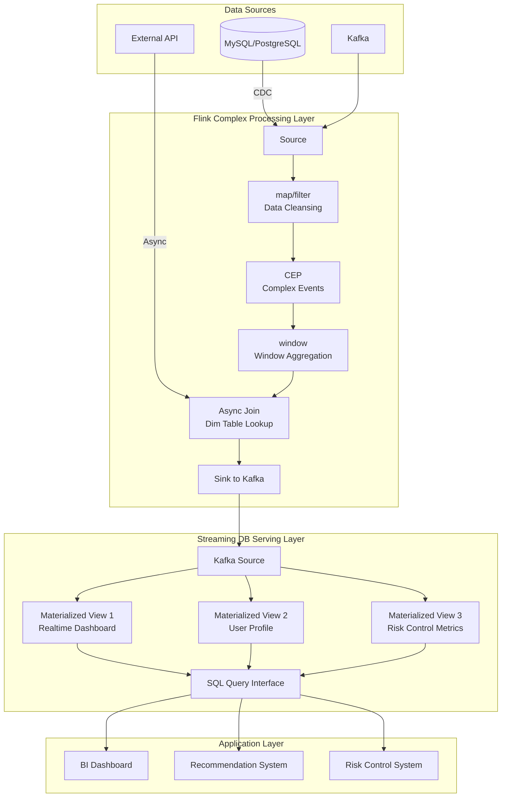
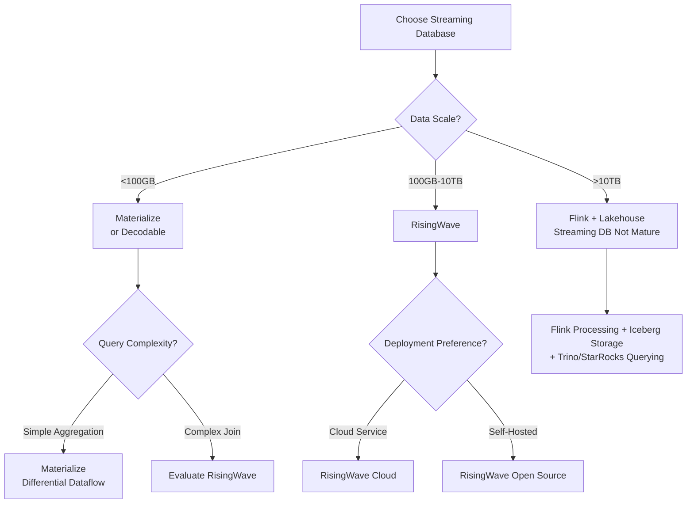

# Operator and Streaming Database (RisingWave/Materialize) Integration

> **Stage**: Knowledge/06-frontier | **Prerequisites**: [01.13-sql-table-api-operators.md](01.13-sql-table-api-operators.md), [operator-lakehouse-integration.md](operator-lakehouse-integration.md) | **Formalization Level**: L3-L4
> **Document Positioning**: Integration architecture and capability comparison between stream processing operators and streaming databases (RisingWave, Materialize, Decodable)
> **Version**: 2026.04

---

## Table of Contents

- [Operator and Streaming Database (RisingWave/Materialize) Integration](#operator-and-streaming-database-risingwavematerialize-integration)
  - [Table of Contents](#table-of-contents)
  - [1. Definitions](#1-definitions)
    - [Def-SDB-01-01: Streaming Database (流数据库)](#def-sdb-01-01-streaming-database-流数据库)
    - [Def-SDB-01-02: Incremental View Maintenance (IVM) (物化视图增量维护)](#def-sdb-01-02-incremental-view-maintenance-ivm-物化视图增量维护)
    - [Def-SDB-01-03: Streaming DB Operator Abstraction (流数据库算子抽象)](#def-sdb-01-03-streaming-db-operator-abstraction-流数据库算子抽象)
    - [Def-SDB-01-04: Stream-Table Duality (流表对偶性)](#def-sdb-01-04-stream-table-duality-流表对偶性)
    - [Def-SDB-01-05: Complementarity between Streaming Database and Flink (流数据库与Flink的互补性)](#def-sdb-01-05-complementarity-between-streaming-database-and-flink-流数据库与flink的互补性)
  - [2. Properties](#2-properties)
    - [Lemma-SDB-01-01: Latency Lower Bound of Materialized Views (物化视图的延迟下界)](#lemma-sdb-01-01-latency-lower-bound-of-materialized-views-物化视图的延迟下界)
    - [Lemma-SDB-01-02: Containment Relationship between SQL Expressiveness and Flink DataStream (SQL表达能力与Flink DataStream的包含关系)](#lemma-sdb-01-02-containment-relationship-between-sql-expressiveness-and-flink-datastream-sql表达能力与flink-datastream的包含关系)
    - [Prop-SDB-01-01: Query Latency Advantage of Streaming Databases (流数据库的查询延迟优势)](#prop-sdb-01-01-query-latency-advantage-of-streaming-databases-流数据库的查询延迟优势)
    - [Prop-SDB-01-02: Architectural Differences between RisingWave and Materialize (RisingWave与Materialize的架构差异)](#prop-sdb-01-02-architectural-differences-between-risingwave-and-materialize-risingwave与materialize的架构差异)
  - [3. Relations](#3-relations)
    - [3.1 Mapping between Streaming Database Operators and Flink Operators (流数据库算子与Flink算子映射)](#31-mapping-between-streaming-database-operators-and-flink-operators-流数据库算子与flink算子映射)
    - [3.2 Lambda Architecture Alternative with Flink + Streaming Database (Flink + 流数据库的Lambda架构替代方案)](#32-lambda-architecture-alternative-with-flink--streaming-database-flink--流数据库的lambda架构替代方案)
    - [3.3 Integration Pattern: Streaming Database as Flink Sink (流数据库作为Flink Sink的集成模式)](#33-integration-pattern-streaming-database-as-flink-sink-流数据库作为flink-sink的集成模式)
  - [4. Argumentation](#4-argumentation)
    - [4.1 Scenarios Where Streaming Databases Cannot Replace Flink (流数据库不能替代Flink的场景)](#41-scenarios-where-streaming-databases-cannot-replace-flink-流数据库不能替代flink的场景)
    - [4.2 Scenarios Where Streaming Databases Outperform Flink (流数据库优于Flink的场景)](#42-scenarios-where-streaming-databases-outperform-flink-流数据库优于flink的场景)
    - [4.3 Hybrid Architecture Selection Decision (混合架构的选型决策)](#43-hybrid-architecture-selection-decision-混合架构的选型决策)
  - [5. Proof / Engineering Argument](#5-proof--engineering-argument)
    - [5.1 Correctness of Streaming Database Incremental Computation (流数据库增量计算的正确性)](#51-correctness-of-streaming-database-incremental-computation-流数据库增量计算的正确性)
    - [5.2 Flink → RisingWave CDC Integration Solution (Flink → RisingWave 的CDC集成方案)](#52-flink--risingwave-cdc-integration-solution-flink--risingwave-的cdc集成方案)
    - [5.3 Lookup Join with Streaming Database as Flink Dimension Table (流数据库作为Flink维表的Lookup Join)](#53-lookup-join-with-streaming-database-as-flink-dimension-table-流数据库作为flink维表的lookup-join)
  - [6. Examples](#6-examples)
    - [6.1 Hands-on: Flink + Materialize Real-time Dashboard (实战：Flink + Materialize 实时看板)](#61-hands-on-flink--materialize-real-time-dashboard-实战flink--materialize-实时看板)
    - [6.2 Hands-on: RisingWave Replacing Flink Sink (实战：RisingWave 替代 Flink Sink)](#62-hands-on-risingwave-replacing-flink-sink-实战risingwave-替代-flink-sink)
  - [7. Visualizations](#7-visualizations)
    - [Flink + Streaming Database Hybrid Architecture (Flink + 流数据库混合架构)](#flink--streaming-database-hybrid-architecture-flink--流数据库混合架构)
    - [Streaming Database Selection Decision Tree (流数据库选型决策树)](#streaming-database-selection-decision-tree-流数据库选型决策树)
  - [8. References](#8-references)

---

## 1. Definitions

### Def-SDB-01-01: Streaming Database (流数据库)

A Streaming Database (流数据库) is a system that fuses a stream processing engine with a database query engine, supporting SQL queries over unbounded stream data and maintaining Materialized Views (物化视图):

$$\text{StreamingDB} = (\text{Stream Engine}, \text{Query Engine}, \text{Materialized View Store})$$

Core characteristic: data is ingested in the form of streams, and query results are continuously updated in the form of materialized views.

### Def-SDB-01-02: Incremental View Maintenance (IVM) (物化视图增量维护)

IVM is the core mechanism of a Streaming Database (流数据库). When the base table (Source Stream, 基表) data changes, only the affected parts are recomputed, rather than full recomputation:

$$\Delta V = \mathcal{F}(\Delta T_1, \Delta T_2, ..., V_{old})$$

Where $\Delta T_i$ is the change stream of base table $i$, $V_{old}$ is the old view state, and $\mathcal{F}$ is the incremental computation function.

### Def-SDB-01-03: Streaming DB Operator Abstraction (流数据库算子抽象)

A Streaming Database (流数据库) compiles SQL queries into an operator execution graph (similar to Flink's DataStream API), but at a higher level of abstraction:

$$\text{SQL Query} \xrightarrow{\text{Parser}} \text{AST} \xrightarrow{\text{Optimizer}} \text{Relational Algebra} \xrightarrow{\text{Code Gen}} \text{Operator DAG}$$

Key difference: users do not directly manipulate operators, but declaratively define computation logic through SQL.

### Def-SDB-01-04: Stream-Table Duality (流表对偶性)

Stream-Table Duality (流表对偶性) is the core theoretical foundation of Streaming Databases (流数据库): a stream is the change history of a table, and a table is a snapshot of a stream:

$$\text{Table}(t) = \text{fold}(\oplus, \text{Stream}[0..t])$$

$$\text{Stream} = \{\Delta T_1, \Delta T_2, ...\} = \{\text{Table}(t_i) - \text{Table}(t_{i-1})\}$$

Where $\oplus$ is the merge operation (UPSERT semantics).

### Def-SDB-01-05: Complementarity between Streaming Database and Flink (流数据库与Flink的互补性)

Definition of complementarity between Streaming Database (流数据库) and Flink:

- **Streaming Database advantages**: native SQL, materialized views ready for query on demand, low-latency Serving
- **Flink advantages**: Complex Event Processing (CEP, 复杂事件处理), precise time semantics, rich connector ecosystem, fine-grained operator control
- **Integration point**: Flink serves as the ETL/complex processing layer, Streaming Database serves as the Serving/query layer

---

## 2. Properties

### Lemma-SDB-01-01: Latency Lower Bound of Materialized Views (物化视图的延迟下界)

The update latency $\mathcal{L}_{view}$ of a Materialized View (物化视图) is constrained by the incremental computation capability of the Streaming Database (流数据库):

$$\mathcal{L}_{view} \geq \mathcal{L}_{ingest} + \mathcal{L}_{incremental}$$

Where $\mathcal{L}_{ingest}$ is the data ingestion latency, and $\mathcal{L}_{incremental}$ is the incremental computation latency.

For simple aggregations (COUNT/SUM), $\mathcal{L}_{incremental} \approx O(1)$; for multi-table Joins, $\mathcal{L}_{incremental} \approx O(|T_1| \cdot |T_2|)$.

### Lemma-SDB-01-02: Containment Relationship between SQL Expressiveness and Flink DataStream (SQL表达能力与Flink DataStream的包含关系)

The expressiveness of Streaming Database SQL is a proper subset of Flink DataStream API:

$$\text{SQL}_{streaming} \subset \text{DataStream}_{flink}$$

**Proof sketch**:

- SQL can express: SELECT/WHERE/GROUP BY/JOIN/WINDOW/MATCH_RECOGNIZE (limited)
- DataStream can additionally express: arbitrary ProcessFunction, custom Timer, complex state machines, async I/O patterns
- There exist Flink DataStream programs that cannot be equivalently translated into Streaming Database SQL (e.g., CEP with complex state machines) ∎

### Prop-SDB-01-01: Query Latency Advantage of Streaming Databases (流数据库的查询延迟优势)

For predefined queries (materialized views), the query latency of a Streaming Database (流数据库) is significantly lower than that of Flink:

$$\mathcal{L}_{query}^{SDB} \ll \mathcal{L}_{query}^{Flink}$$

**Reason**: materialized views are precomputed, queries are reads only; Flink requires submitting a new job or executing an ad-hoc query.

### Prop-SDB-01-02: Architectural Differences between RisingWave and Materialize (RisingWave与Materialize的架构差异)

| Dimension | RisingWave | Materialize |
|-----------|------------|-------------|
| **Storage Engine** | Self-developed LSM-Tree + S3 | Self-developed Differential Dataflow |
| **Consistency Model** | Snapshot Isolation | Strict Serializability |
| **Scalability** | Horizontal scaling (Shared-Nothing) | Vertical scaling (Shared-Memory) |
| **SQL Compatibility** | PostgreSQL protocol | PostgreSQL protocol |
| **Deployment Mode** | Cloud-native / K8s | Self-hosted / Cloud |
| **State Storage** | Tiered (memory + local disk + S3) | Memory-centric |
| **Applicable Scale** | TB-level | GB-TB level |

---

## 3. Relations

### 3.1 Mapping between Streaming Database Operators and Flink Operators (流数据库算子与Flink算子映射)

| Streaming Database SQL | Internal Operator | Flink Equivalent Operator | Capability Difference |
|------------------------|-------------------|---------------------------|----------------------|
| `SELECT ... FROM` | Scan | Source + map | Equivalent |
| `WHERE` | Filter | filter | Equivalent |
| `GROUP BY ... SUM/COUNT` | HashAggregate | keyBy + aggregate | Equivalent |
| `JOIN` | HashJoin / SortMergeJoin | join / intervalJoin | Streaming DB Join has more restrictions |
| `WINDOW (TUMBLE/HOP)` | WindowAggregate | window + aggregate | Equivalent |
| `OVER (PARTITION BY ... ORDER BY)` | OverAggregate | Over Window | Equivalent |
| `EMIT ON WINDOW CLOSE` | EmitStrategy | Trigger | Flink is more flexible |
| `CREATE MATERIALIZED VIEW` | MaterializeOperator | No direct equivalent | Flink requires Sink + external storage |
| `INDEX` | Arrange / Index | No direct equivalent | Flink has no native index |

### 3.2 Lambda Architecture Alternative with Flink + Streaming Database (Flink + 流数据库的Lambda架构替代方案)

Traditional Lambda Architecture:

```
Batch Layer (Hive/Spark) ──┐
                            ├──→ Serving Layer (Presto/Redis)
Speed Layer (Flink) ────────┘
```

Simplified architecture with Flink + Streaming Database (流数据库):

```
Data Source → Flink (ETL+Complex Processing) → Kafka → Streaming DB (Materialized View+Serving) → App Query
              ↓
         Lakehouse (Iceberg) → Offline Analysis
```

**Advantages**:

- No Batch/Speed layer code duplication
- Materialized views ready for query on demand, latency < 100ms
- Unified SQL interface, reducing development cost

### 3.3 Integration Pattern: Streaming Database as Flink Sink (流数据库作为Flink Sink的集成模式)

```
Flink Pipeline
├── Source (Kafka)
├── Complex Processing (CEP / ProcessFunction / Window Aggregation)
└── Sink
    ├── Pattern A: Kafka → Streaming DB consumption (decoupled)
    ├── Pattern B: JDBC direct write to Streaming DB (simple)
    └── Pattern C: Streaming DB as Lookup Join dimension table (real-time association)
```

---

## 4. Argumentation

### 4.1 Scenarios Where Streaming Databases Cannot Replace Flink (流数据库不能替代Flink的场景)

**Scenario 1: Complex Event Processing (CEP, 复杂事件处理)**

- Requirement: detect fraud pattern of "3 failed logins followed by a successful login"
- Streaming Database (流数据库): SQL's MATCH_RECOGNIZE capability is limited
- Flink: CEP library supports complex pattern sequences, timeouts, and loops

**Scenario 2: Custom State Logic**

- Requirement: dynamically adjust recommendation weights based on user behavior history
- Streaming Database (流数据库): SQL cannot express complex state machines
- Flink: ProcessFunction + ValueState/MapState provides full control

**Scenario 3: Precise Time Semantics Control**

- Requirement: custom Watermark strategy, delayed data handling
- Streaming Database (流数据库): automatic Watermark, not user-controllable
- Flink: fully customizable Watermark generation, allowedLateness, Side Output

### 4.2 Scenarios Where Streaming Databases Outperform Flink (流数据库优于Flink的场景)

**Scenario 1: Ad-hoc Query (即席查询)**

- Streaming Database (流数据库): directly execute SQL queries on materialized views, millisecond-level response
- Flink: requires submitting a new SQL job or querying external storage

**Scenario 2: Multi-View Shared Computation**

- Streaming Database (流数据库): multiple materialized views share intermediate results, computation reuse
- Flink: each job computes independently, consuming resources redundantly

**Scenario 3: Low-Latency Serving**

- Streaming Database (流数据库): queries directly hit materialized views in memory
- Flink: usually requires sinking to Redis/ES or other external storage before querying

### 4.3 Hybrid Architecture Selection Decision (混合架构的选型决策)

| Factor | Pure Flink | Pure Streaming DB | Hybrid Architecture |
|--------|-----------|-------------------|---------------------|
| **Query Complexity** | High | Low-Medium | Medium-High |
| **Query Latency Requirement** | >100ms | <100ms | <100ms |
| **CEP Requirement** | ✅ | ❌ | ✅ (Flink side) |
| **SQL Team Skills** | Medium | High | High |
| **Ops Complexity** | Medium | Low | Medium |
| **Cost** | Medium | Low-Medium | Medium-High |

**Recommendation**: use Flink for complex stream processing (CEP/custom state), and Streaming Database (流数据库) for real-time Serving / ad-hoc queries.

---

## 5. Proof / Engineering Argument

### 5.1 Correctness of Streaming Database Incremental Computation (流数据库增量计算的正确性)

**Question**: Is the incremental update of materialized views in a Streaming Database (流数据库) equivalent to full recomputation?

**Definition**: Let the change stream of base table $T$ be $\Delta T = \{+r_1, -r_2, +r_3, ...\}$, and the view definition be $V = \sigma_{\theta}(T)$ (selection operation).

**Incremental update rule**:
$$\Delta V = \sigma_{\theta}(\Delta T)$$
$$V_{new} = V_{old} \oplus \Delta V$$

**Correctness proof**:

1. Let $T_{new} = T_{old} \oplus \Delta T$ (merged according to UPSERT semantics)
2. Full recomputation: $V_{full} = \sigma_{\theta}(T_{new}) = \sigma_{\theta}(T_{old} \oplus \Delta T)$
3. Incremental update: $V_{incr} = V_{old} \oplus \sigma_{\theta}(\Delta T) = \sigma_{\theta}(T_{old}) \oplus \sigma_{\theta}(\Delta T)$
4. Since selection operation $\sigma$ is distributive over UPSERT: $\sigma(A \oplus B) = \sigma(A) \oplus \sigma(B)$
5. Therefore $V_{full} = V_{incr}$ ∎

**Note**: The above proof only applies to monotonic operations (selection, projection). For aggregation operations, Delta Query technique is required.

### 5.2 Flink → RisingWave CDC Integration Solution (Flink → RisingWave 的CDC集成方案)

**Architecture**:

```
MySQL → Debezium → Kafka → RisingWave Source
                                ↓
                         Materialized View
                                ↓
                         PostgreSQL Protocol Query
```

**Configuration**:

```sql
-- Create Kafka Source in RisingWave
CREATE SOURCE mysql_orders (
    order_id BIGINT,
    user_id BIGINT,
    amount DECIMAL,
    PRIMARY KEY (order_id)
) WITH (
    connector = 'kafka',
    topic = 'mysql.orders',
    format = 'debezium_json'
);

-- Create materialized view
CREATE MATERIALIZED VIEW order_stats AS
SELECT
    user_id,
    COUNT(*) as order_count,
    SUM(amount) as total_amount
FROM mysql_orders
GROUP BY user_id;
```

**Latency**: Debezium capture (10ms) + Kafka transmission (10ms) + RisingWave incremental update (10-100ms) = total latency < 200ms.

### 5.3 Lookup Join with Streaming Database as Flink Dimension Table (流数据库作为Flink维表的Lookup Join)

**Scenario**: real-time order stream associated with user profiles (stored in RisingWave materialized view).

```java
// Flink AsyncFunction querying RisingWave
public class RisingWaveLookupFunction extends AsyncFunction<Order, EnrichedOrder> {
    private transient PgConnection conn;

    @Override
    public void open(Configuration parameters) {
        conn = PgConnection.connect("jdbc:postgresql://risingwave:4566/dev");
    }

    @Override
    public void asyncInvoke(Order order, ResultFuture<EnrichedOrder> resultFuture) {
        conn.prepareQuery(
            "SELECT profile FROM user_profiles WHERE user_id = $1"
        ).execute(order.getUserId())
         .whenComplete((profile, err) -> {
             resultFuture.complete(Collections.singletonList(
                 new EnrichedOrder(order, profile)
             ));
         });
    }
}

// Pipeline
stream.keyBy(Order::getUserId)
    .asyncWaitFor(
        new RisingWaveLookupFunction(),
        Time.milliseconds(100),
        100
    );
```

**Advantage**: RisingWave materialized views are updated in real time, Flink queries get the latest data without maintaining local cache.

---

## 6. Examples

### 6.1 Hands-on: Flink + Materialize Real-time Dashboard (实战：Flink + Materialize 实时看板)

**Architecture**:

- Flink: responsible for complex ETL (data cleansing, anomaly detection, format conversion)
- Kafka: serves as intermediate message queue
- Materialize: responsible for materialized views and real-time queries

**Flink Pipeline**:

```java
env.fromSource(kafkaSource, WatermarkStrategy.noWatermarks(), "raw-events")
    .map(new CleanAndValidate())           // Data cleansing
    .filter(new FraudDetection())          // Anomaly detection
    .keyBy(Event::getCategory)
    .window(TumblingEventTimeWindows.of(Time.minutes(1)))
    .aggregate(new CategoryStatsAggregate())
    .sinkTo(kafkaSink);                    // Output to Kafka topic: processed-stats
```

**Materialize View**:

```sql
-- Ingest from Kafka
CREATE SOURCE processed_stats
FROM KAFKA BROKER 'kafka:9092' TOPIC 'processed-stats'
FORMAT JSON;

-- Real-time dashboard view
CREATE MATERIALIZED VIEW realtime_dashboard AS
SELECT
    category,
    SUM(event_count) as total_events,
    SUM(revenue) as total_revenue,
    AVG(latency) as avg_latency
FROM processed_stats
GROUP BY category;

-- Query (millisecond-level response)
SELECT * FROM realtime_dashboard WHERE category = 'electronics';
```

### 6.2 Hands-on: RisingWave Replacing Flink Sink (实战：RisingWave 替代 Flink Sink)

**Traditional Flink Solution**: Flink window aggregation → Sink to Redis → API queries Redis
**RisingWave Solution**: Flink cleansing → Kafka → RisingWave materialized view → direct SQL query

**Comparison**:

| Metric | Flink+Redis | Flink+RisingWave |
|--------|------------|-----------------|
| Component Count | Flink + Redis + API | Flink + RisingWave |
| Query Latency | < 10ms | < 50ms |
| Ad-hoc Query | ❌ Predefined required | ✅ Arbitrary SQL |
| Data Consistency | Eventual consistency | Transactional consistency |
| Ops Complexity | High | Low |

---

## 7. Visualizations

### Flink + Streaming Database Hybrid Architecture (Flink + 流数据库混合架构)



### Streaming Database Selection Decision Tree (流数据库选型决策树)



---

## 8. References


---

*Related Documents*: [01.13-sql-table-api-operators.md](01.13-sql-table-api-operators.md) | [operator-lakehouse-integration.md](operator-lakehouse-integration.md) | [cross-engine-operator-mapping.md](cross-engine-operator-mapping.md)
