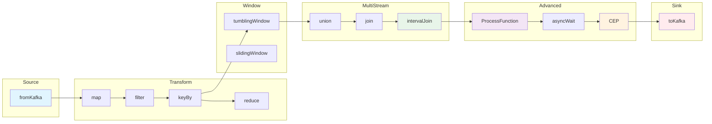

# Stream Operator Panoramic Taxonomy

> **Stage**: Struct/03-relationships | **Prerequisites**: [01.01-stream-processing-model.md](unified-streaming-theory.md), [02.03-state-semantics.md](stream-operator-algebra.md) | **Formalization Level**: L4 | **Last Updated**: 2026-04

---

## Table of Contents

- [Stream Operator Panoramic Taxonomy](#stream-operator-panoramic-taxonomy)
  - [Table of Contents](#table-of-contents)
  - [1. Concept Definitions (Definitions)](#1-concept-definitions-definitions)
    - [Def-O-01-01 Stream Operator (流算子)](#def-o-01-01-stream-operator-流算子)
    - [Def-O-01-02 Unified Four-Dimensional Taxonomy](#def-o-01-02-unified-four-dimensional-taxonomy)
    - [Def-O-01-03 Formal Signature](#def-o-01-03-formal-signature)
    - [Def-O-01-04 State Type Hierarchy](#def-o-01-04-state-type-hierarchy)
    - [Def-O-01-05 Time Semantics Requirements](#def-o-01-05-time-semantics-requirements)
    - [Def-O-01-06 Parallelism Semantics](#def-o-01-06-parallelism-semantics)
    - [Def-O-01-07 Operator Composition and Operator Algebra](#def-o-01-07-operator-composition-and-operator-algebra)
    - [Def-O-01-08 General Form of Window Operators](#def-o-01-08-general-form-of-window-operators)
  - [2. Property Derivation (Properties)](#2-property-derivation-properties)
    - [Lemma-O-01-01 Idempotence of Stateless Operators](#lemma-o-01-01-idempotence-of-stateless-operators)
    - [Lemma-O-01-02 Locality of Keyed-State Operators](#lemma-o-01-02-locality-of-keyed-state-operators)
    - [Lemma-O-01-03 Monotonicity and Watermark Compatibility of Window Operators](#lemma-o-01-03-monotonicity-and-watermark-compatibility-of-window-operators)
    - [Prop-O-01-01 Completeness of the Four-Dimensional Taxonomy](#prop-o-01-01-completeness-of-the-four-dimensional-taxonomy)
  - [3. Relation Establishment (Relations)](#3-relation-establishment-relations)
    - [3.1 Operator-to-API Mapping](#31-operator-to-api-mapping)
    - [3.2 Source Operator Comparison ($\\kappa = 0$)](#32-source-operator-comparison-kappa--0)
    - [3.3 Single-Input Stateless Transformation ($\\kappa = 1, \\sigma = \\text{stateless}$)](#33-single-input-stateless-transformation-kappa--1-sigma--textstateless)
    - [3.4 Partitioning and Physical Layout ($\\kappa = 1, \\sigma \\in {\\text{stateless}, \\text{keyed}}$)](#34-partitioning-and-physical-layout-kappa--1-sigma-in-textstateless-textkeyed)
    - [3.5 Grouped Aggregation Operators ($\\kappa = 1, \\sigma = \\text{keyed}$)](#35-grouped-aggregation-operators-kappa--1-sigma--textkeyed)
    - [3.6 Multi-Stream Operators ($\\kappa \\in {2, +}$)](#36-multi-stream-operators-kappa-in-2-)
    - [3.7 Window Operators ($\\kappa = 1, \\chi = O(W)$)](#37-window-operators-kappa--1-chi--ow)
    - [3.8 ProcessFunction Family ($\\kappa \\in {1,2}, \\chi = O(∞)$)](#38-processfunction-family-kappa-in-12-chi--o)
    - [3.9 Async Operators ($\\kappa = 1, \\chi = O(1) \\text{ (async)}$)](#39-async-operators-kappa--1-chi--o1-text-async)
    - [3.10 CEP Operators ($\\kappa = 1, \\chi = O(∞)$)](#310-cep-operators-kappa--1-chi--o)
    - [3.11 Sink Operators ($\\kappa = 1, n = 0$)](#311-sink-operators-kappa--1-n--0)
  - [4. Argumentation Process (Argumentation)](#4-argumentation-process-argumentation)
    - [4.1 Taxonomy Completeness Argument](#41-taxonomy-completeness-argument)
    - [4.2 API Differences and Semantic Gap](#42-api-differences-and-semantic-gap)
    - [4.3 Boundary Discussion: Limits of Operator Fusion](#43-boundary-discussion-limits-of-operator-fusion)
  - [5. Formal Proof / Engineering Argument (Proof / Engineering Argument)](#5-formal-proof--engineering-argument-proof--engineering-argument)
    - [Thm-O-01-01 Isomorphism Theorem of Stream Operator Classification](#thm-o-01-01-isomorphism-theorem-of-stream-operator-classification)
    - [Thm-O-01-02 Parallelism Upper Bound Theorem for Stateful Operators](#thm-o-01-02-parallelism-upper-bound-theorem-for-stateful-operators)
  - [6. Example Verification (Examples)](#6-example-verification-examples)
    - [Example 1: Complete Flink DataStream Pipeline](#example-1-complete-flink-datastream-pipeline)
    - [Example 2: Flink CEP Pattern Detection](#example-2-flink-cep-pattern-detection)
    - [Example 3: Multi-API Equivalent Query — Tumbling Window Word Count](#example-3-multi-api-equivalent-query--tumbling-window-word-count)
  - [7. Visualizations (Visualizations)](#7-visualizations-visualizations)
    - [7.1 Operator Panoramic Mind Map](#71-operator-panoramic-mind-map)
    - [7.2 Four-Dimensional Classification Hierarchy Diagram](#72-four-dimensional-classification-hierarchy-diagram)
    - [7.3 Five-API Multi-Dimensional Comparison Matrix](#73-five-api-multi-dimensional-comparison-matrix)
    - [7.4 Core Operator Five-API Alignment Matrix (Table + Mermaid Hybrid)](#74-core-operator-five-api-alignment-matrix-table--mermaid-hybrid)
  - [8. References (References)](#8-references-references)


## 1. Concept Definitions (Definitions)

### Def-O-01-01 Stream Operator (流算子)

Let the event type be $\mathcal{E}$ and the time domain be $\mathbb{T}$. A **Stream Operator** (流算子) is a partial function

$$
\mathcal{O} : \mathcal{S}^m \times \mathcal{H} \times \mathbb{T}^* \rightharpoonup \mathcal{S}^n
$$

where $m \geq 0$ is the number of input streams, $n \geq 0$ is the number of output streams, $\mathcal{H}$ is the operator local state space (may be empty), and $\mathbb{T}^*$ is the time semantics parameter. The stream operator maps a set of input event streams to a set of output event streams, and its computation may depend on internal state and time context. When $m = 0$, it is called a **Source Operator** (源算子); when $n = 0$, it is called a **Sink Operator** (汇算子). [^1][^2]

**Intuitive Explanation**: A stream operator is the basic computational unit of a stream processing system, analogous to higher-order functions in functional programming but augmented with state and time dimensions. Each operator consumes data elements from upstream streams, executes specific computation logic, and produces new data streams downstream.

---

### Def-O-01-02 Unified Four-Dimensional Taxonomy

The unified classification of stream operators is determined by the quadruple $\mathcal{C} = (\kappa, \sigma, \tau, \chi)$:

| Dimension | Symbol | Domain | Semantics |
|-----------|--------|--------|-----------|
| Input stream count | $\kappa$ | $\{0, 1, 2, +\}$ | 0=Source, 1=Unary, 2=Binary, +=N-ary |
| State dependency | $\sigma$ | $\{\text{stateless}, \text{keyed}, \text{global}\}$ | Stateless / Key-partitioned state / Global state |
| Time semantics | $\tau$ | $\{\text{none}, \text{processing}, \text{event}, \text{ingestion}\}$ | No time / Processing time / Event time / Ingestion time |
| Computational complexity | $\chi$ | $\{\text{O(1)}, \text{O(N)}, \text{O(W)}, \text{O(∞)}\}$ | Constant / Full stream / Window / Pattern matching |

**Def-O-01-02** establishes four orthogonal dimensions for stream operator classification. Any operator can be uniquely mapped to a coordinate point (or region) in the four-dimensional space. The core idea of this taxonomy originates from the formal characterization of operator semantics in the Dataflow Programming model [^3], and has been validated in engineering by systems such as Flink and Beam. [^1][^4]

---

### Def-O-01-03 Formal Signature

The **formal signature** of operator $\mathcal{O}$ is defined as:

$$
\mathcal{O} : \underbrace{\mathcal{S} \times \cdots \times \mathcal{S}}_{m} \xrightarrow[\text{state}=\mathcal{H}]{\text{time}=\tau} \mathcal{S}'
$$

where the annotations on the arrow indicate the state type $\mathcal{H}$ and time semantics $\tau$. For example, the signature of `map` is:

$$
\text{map} : \mathcal{S} \xrightarrow[\text{state}=\emptyset]{\text{time}=\text{none}} \mathcal{S}' \quad (f : \mathcal{E} \to \mathcal{E}')
$$

And the signature of `reduce` is:

$$
\text{reduce} : \mathcal{S}_{\text{keyed}} \xrightarrow[\text{state}=\text{ValueState}<\mathcal{E}>]{\text{time}=\text{event}} \mathcal{S}'
$$

---

### Def-O-01-04 State Type Hierarchy

The state maintained by stream operators is divided into three categories by scope:

1. **Stateless** (无状态): $\mathcal{H} = \emptyset$. The operator depends only on the current input element and does not maintain any cross-element state. Typical representatives: `map`, `filter`, `flatMap`.

2. **Keyed State** (按键分区状态): $\mathcal{H} = \bigcup_{k \in \mathcal{K}} \mathcal{H}_k$, where $\mathcal{K}$ is the key space. Each key $k$ has an independent local state $\mathcal{H}_k$, and states between different keys do not interfere. Typical representatives: `reduce`, `aggregate`, `KeyedProcessFunction`. [^1]

3. **Global State** (全局状态): $\mathcal{H}$ is a state space shared by the entire operator instance, accessible by all parallel instances (typically implemented via broadcast mechanism or global lock). Typical representatives: broadcast state in `BroadcastProcessFunction`, global window aggregation before `keyBy`.

---

### Def-O-01-05 Time Semantics Requirements

The time semantics requirements of an operator define its ability to process out-of-order data in distributed environments:

- **None** (无要求): The operator does not depend on timestamps; output order is determined entirely by processing order. E.g., `map`, `filter`.
- **Processing time** (处理时间): The operator uses the local clock of the machine where the operator instance runs, offering low latency but potentially affected by clock skew. E.g., `processing-time tumbling window`.
- **Event time** (事件时间): The operator uses timestamps carried by the data itself, combined with Watermark mechanism to handle out-of-order data. E.g., `event-time window join`, `intervalJoin`. [^1]
- **Ingestion time** (摄入时间): The operator uses timestamps injected by the Source when data enters the system, intermediate between the previous two. E.g., early Flink default mode (deprecated after Flink 1.12).

---

### Def-O-01-06 Parallelism Semantics

The parallelism $P(\mathcal{O})$ of an operator describes its scalability characteristics:

- **Embarrassingly parallel** (完全可并行): $P(\mathcal{O}) = P_{\max}$. The operator can scale across any number of parallel instances without coordination. E.g., `map`, `filter`.
- **Key-partitioned parallel** (按键可并行): $P(\mathcal{O}) = $ effective subset of $|\mathcal{K}|$. All events of the same key must be routed to the same instance. E.g., `reduce`, `aggregate`.
- **Single-instance** (单实例串行): $P(\mathcal{O}) = 1$. The operator is forced to execute on a single instance. E.g., `windowAll`.
- **Custom-partitioned** (自定义并行): $P(\mathcal{O})$ is determined by a user-defined partitioner. E.g., `partitionCustom`.

---

### Def-O-01-07 Operator Composition and Operator Algebra

Let $\mathcal{O}_1, \mathcal{O}_2$ be two stream operators. Define **Operator Composition** (算子复合) as:

$$
(\mathcal{O}_2 \circ \mathcal{O}_1)(S) = \mathcal{O}_2(\mathcal{O}_1(S))
$$

The output stream type of $\mathcal{O}_1$ must be compatible with the input stream type of $\mathcal{O}_2$. All stream operators form a **Partial Monoid** (部分幺半群) under composition, with the `identity` operator as the unit element. This algebraic structure provides the theoretical foundation for pipeline optimization (operator chain fusion). [^3][^5]

---

### Def-O-01-08 General Form of Window Operators

A window operator $\mathcal{W}$ cuts the unbounded stream $\mathcal{S}$ into bounded sub-streams (windows) and applies an aggregation function $\mathcal{A}$:

$$
\mathcal{W}(\mathcal{S}, \mathcal{G}, \mathcal{A}) = \{ \mathcal{A}(\{ e \in \mathcal{S} \mid e \in w \}) \mid w \in \mathcal{G} \}
$$

where $\mathcal{G}$ is the Window Assigner (窗口分配器), mapping each event $e$ to a set of windows $w$. By assignment strategy:

- **Tumbling**: $\mathcal{G}_T(e) = \{ w_k \mid t_e \in [k\Delta, (k+1)\Delta) \}$
- **Sliding**: $\mathcal{G}_S(e) = \{ w_k \mid t_e \in [k\Delta, k\Delta + \Delta_s) \}$
- **Session**: $\mathcal{G}_\Psi(e) = \{ w \mid t_e \in w \land \text{gap}(w) \leq \psi \}$
- **Count**: $\mathcal{G}_C(e) = \{ w_k \mid \text{count}(e \in w_k) \leq c \}$
- **Global**: $\mathcal{G}_G(e) = \{ w_\infty \}$

[^1][^4]

---

## 2. Property Derivation (Properties)

### Lemma-O-01-01 Idempotence of Stateless Operators

Let $\mathcal{O}$ be a stateless operator ($\sigma = \text{stateless}$). Then for any subsequence $S' \subseteq S$ of any input stream $S$:

$$
\mathcal{O}(S') \subseteq \mathcal{O}(S)
$$

And $\mathcal{O}$ satisfies **idempotent composition**: $\mathcal{O} \circ \mathcal{O} = \mathcal{O}$ if and only if the underlying function $f$ of $\mathcal{O}$ satisfies $f(f(x)) = f(x)$.

**Proof**: By Def-O-01-04, the output of a stateless operator depends only on the current input element. Therefore, for each element $e$ in subsequence $S'$, the result of $\mathcal{O}(e)$ is independent of the presence of $S' \setminus \{e\}$. Hence, every output element in $\mathcal{O}(S')$ necessarily appears in $\mathcal{O}(S)$. $\square$

---

### Lemma-O-01-02 Locality of Keyed-State Operators

Let $\mathcal{O}$ be a keyed-partitioned state operator with key space $\mathcal{K}$. For any two distinct keys $k_1 \neq k_2$, their corresponding state updates satisfy:

$$
\mathcal{H}_{k_1}^{(t+1)} \perp \mathcal{H}_{k_2}^{(t+1)}
$$

That is, the state evolution of key $k_1$ and key $k_2$ is statistically independent (physically isolated in actual implementation).

**Proof**: By Def-O-01-04, the `keyBy` operator routes key $k$ to a fixed parallel instance via consistent hashing. Each instance maintains only the subset of states for keys assigned to it. According to Flink's Keyed State implementation, the state backend (RocksDB/Heap) maintains independent namespaces for each Key Group, and there is no cross-key state sharing path. [^1] $\square$

---

### Lemma-O-01-03 Monotonicity and Watermark Compatibility of Window Operators

Let $\mathcal{W}$ be an event-time-based window operator with Watermark strategy $\omega(t)$. If the aggregation function $\mathcal{A}$ satisfies monotonicity (e.g., `sum`, `count`, `max`), then the window result satisfies:

$$
\forall w : \omega(t) > \text{end}(w) \implies \mathcal{W}(\mathcal{S}, w) = \text{final}
$$

That is, once the Watermark passes the window end boundary, the output of that window no longer changes.

**Proof**: Flink's event-time processing mechanism guarantees that Watermark $w(t)$ is the assertion "all subsequent event timestamps do not exceed $t$". When $w(t) > \text{end}(w)$, window $w$ can no longer receive new events, so the aggregation result converges to its final value. [^1][^4] $\square$

---

### Prop-O-01-01 Completeness of the Four-Dimensional Taxonomy

For any stream operator $\mathcal{O}$, there exists a unique four-dimensional coordinate $(\kappa, \sigma, \tau, \chi) \in \mathcal{C}$ such that the classification attributes of $\mathcal{O}$ are fully determined.

**Argumentation**: The domains of the four dimensions are all mutually exclusive and complete sets:

- $\kappa$ covers all possible input arities ($0, 1, 2, \geq 3$);
- $\sigma$ enumerates all implementation schemes by state scope (stateless / keyed / global);
- $\tau$ covers the three time semantics of stream processing systems (plus no-time requirement);
- $\chi$ characterizes the computational features of operators by algorithmic complexity.

Any operator must belong to exactly one category in each dimension, so the classification coordinate is uniquely determined. $\square$

---

## 3. Relation Establishment (Relations)

### 3.1 Operator-to-API Mapping

This section establishes the operator alignment relationship across 5 mainstream stream processing APIs. The mapping is based on semantic equivalence: two operators in different APIs produce the same output given the same input (within allowable implementation differences).

**API Systems**:

1. **Flink DataStream API** (Java/Scala/Python) — Imperative stream processing API [^1]
2. **Flink Table API / SQL** — Declarative relational stream SQL [^1]
3. **Apache Beam PTransform** — Unified batch-stream programming model [^4]
4. **Spark Structured Streaming** — Micro-batch/continuous processing mode [^6]
5. **ksqlDB** — Kafka-native stream SQL engine [^7]

---

### 3.2 Source Operator Comparison ($\kappa = 0$)

| Operator | Flink DataStream | Flink Table/SQL | Beam | Spark SS | ksqlDB |
|----------|------------------|-----------------|------|----------|--------|
| **fromKafka** | `KafkaSource.<T>builder().build()` | `CREATE TABLE ... WITH ('connector'='kafka')` | `KafkaIO.read()` | `readStream.format("kafka")` | `CREATE STREAM ... WITH (kafka_topic='...')` |
| **fromSocket** | `env.socketTextStream(host, port)` | — | — | `readStream.format("socket")` | — |
| **fromCollection** | `env.fromCollection(List)` | `VALUES (...)` | `Create.of(List)` | `spark.createDataset(List)` | — |
| **readFile** | `FileSource.forRecordStreamFormat(...)` | `CREATE TABLE ... WITH ('connector'='filesystem')` | `TextIO.read()` | `readStream.format("csv")` | `CREATE STREAM ... WITH (kafka_topic='...')` + Connector |
| **generateSequence** | `env.fromSequence(from, to)` | `GENERATE_SERIES` | `GenerateSequence.from(from)` | `spark.range(...)` | — |

**Formal Signatures**:

```
fromKafka   : ∅ → S<K,V>        state=∅          time=event/ingestion   χ=O(1)
fromSocket  : ∅ → S<String>     state=∅          time=processing        χ=O(1)
fromCollection: ∅ → S<T>        state=∅          time=none              χ=O(1)
readFile    : ∅ → S<Record>     state=offset     time=event/ingestion   χ=O(1)
generateSequence: ∅ → S<Long>   state=∅          time=none              χ=O(1)
```

**State Type**: Source operators typically have no local computation state, but may maintain recoverable partition offsets (e.g., Kafka offset, file read progress). These offsets are persisted as part of Checkpoint. [^1][^4]

**Parallelism**: The parallelism of `fromKafka` equals the number of partitions of the Kafka Topic; `fromCollection` can be specified by the user; `readFile` is parallelized by file chunk by default.

---

### 3.3 Single-Input Stateless Transformation ($\kappa = 1, \sigma = \text{stateless}$)

| Operator | Flink DataStream | Flink Table/SQL | Beam | Spark SS | ksqlDB |
|----------|------------------|-----------------|------|----------|--------|
| **map** | `.map(MapFunction)` | `SELECT expr` | `MapElements.into(...)` | `map(expr)` | `SELECT expression` |
| **filter** | `.filter(FilterFunction)` | `WHERE predicate` | `Filter.by(...)` | `filter(predicate)` | `WHERE predicate` |
| **flatMap** | `.flatMap(FlatMapFunction)` | Requires UDTF | `FlatMapElements.into(...)` | `flatMap(func)` | `EXPLODE(array_col)` |
| **mapPartition** | `.mapPartition(MapPartitionFunction)` | — | `ParDo.of(DoFn)` | `mapPartitions(func)` | — |

**Formal Signatures**:

```
map         : S<A> → S<B>       state=∅          time=none              χ=O(1)   P=embarrassingly parallel
filter      : S<A> → S<A>       state=∅          time=none              χ=O(1)   P=embarrassingly parallel
flatMap     : S<A> → S<B>       state=∅          time=none              χ=O(1)   P=embarrassingly parallel
mapPartition: S<A> → S<B>       state=∅          time=none              χ=O(N/p) P=partition-local
```

**Typical Usage**:

- `map`: Field transformation, type conversion, format parsing. Example: parse JSON string into structured object.
- `filter`: Data cleansing, anomaly filtering. Example: filter out abnormal readings where sensorValue < 0.
- `flatMap`: One-to-many expansion, nested structure flattening. Example: split one CSV line by comma and expand into multiple records.
- `mapPartition`: Batch initialization of resources (e.g., database connections), executing batch processing optimization at partition granularity.

---

### 3.4 Partitioning and Physical Layout ($\kappa = 1, \sigma \in \{\text{stateless}, \text{keyed}\}$)

Partitioning operators do not modify data semantics but change physical layout, serving as prerequisites for subsequent stateful operators.

| Operator | Flink DataStream | Flink Table/SQL | Beam | Spark SS | ksqlDB |
|----------|------------------|-----------------|------|----------|--------|
| **keyBy** | `.keyBy(KeySelector)` | `GROUP BY key` / `DISTRIBUTE BY` | `GroupByKey` | — (implicit in `groupBy`) | `PARTITION BY` |
| **shuffle** | `.shuffle()` | — | — | `repartition()` | — |
| **rebalance** | `.rebalance()` | — | — | — | — |
| **rescale** | `.rescale()` | — | — | — | — |
| **forward** | `.forward()` (default) | — | — | — | — |
| **global** | `.global()` | `GLOBAL` aggregation | — | — | — |
| **broadcast** | `.broadcast()` | — | — | `broadcast` hint | — |
| **partitionCustom** | `.partitionCustom(Partitioner, keySelector)` | — | `Partition` transform | — | — |

**Formal Signatures**:

```
keyBy           : S<A> → S_keyed<A>   state=∅    time=none    χ=O(1)   P=key-partitioned
shuffle         : S<A> → S<A>         state=∅    time=none    χ=O(1)   P=full redistribution
rebalance       : S<A> → S<A>         state=∅    time=none    χ=O(1)   P=round-robin
rescale         : S<A> → S<A>         state=∅    time=none    χ=O(1)   P=sub-group round-robin
forward         : S<A> → S<A>         state=∅    time=none    χ=O(1)   P=same task chain
global          : S<A> → S<A>         state=∅    time=none    χ=O(1)   P=single instance
broadcast       : S<A> → S<A>         state=∅    time=none    χ=O(1)   P=all instances
partitionCustom : S<A> → S<A>         state=∅    time=none    χ=O(1)   P=user-defined
```

**Typical Usage**:

- `keyBy`: Partition the stream by key, preparing for subsequent `reduce`, `aggregate`, `window`. Example: `keyBy(event -> event.userId)`.
- `rebalance`: Redistribute load evenly in data skew scenarios, preventing some parallel instances from being overloaded.
- `broadcast`: Broadcast small tables/rule sets to all instances for subsequent `BroadcastProcessFunction` or dimension table joins.
- `global`: Force all data to be routed to a single instance, typically used for debugging or the final stage of global sorting.

---

### 3.5 Grouped Aggregation Operators ($\kappa = 1, \sigma = \text{keyed}$)

| Operator | Flink DataStream | Flink Table/SQL | Beam | Spark SS | ksqlDB |
|----------|------------------|-----------------|------|----------|--------|
| **reduce** | `.reduce(ReduceFunction)` | — | `Combine.globally()` / `perKey()` | `reduceGroups(func)` | — |
| **aggregate** | `.aggregate(AggregateFunction)` | `GROUP BY ... AGG_FUNC` | `Mean.perKey()` etc. | `agg(expr)` | `GROUP BY ... AGG_FUNC` |
| **fold** | `.fold(seed, FoldFunction)` (deprecated) | — | — | — | — |
| **min** | `.min(fieldIndex)` | `MIN(col)` | — | `min(col)` | `MIN(col)` |
| **minBy** | `.minBy(fieldIndex)` | `MIN_BY(col, other)` | — | — | — |
| **max** | `.max(fieldIndex)` | `MAX(col)` | — | `max(col)` | `MAX(col)` |
| **maxBy** | `.maxBy(fieldIndex)` | `MAX_BY(col, other)` | — | — | — |
| **sum** | `.sum(fieldIndex)` | `SUM(col)` | — | `sum(col)` | `SUM(col)` |

**Formal Signatures**:

```
reduce      : S_keyed<A> → S<A>     state=ValueState<A>   time=event/processing   χ=O(1)    P=key-partitioned
aggregate   : S_keyed<A> → S<ACC>   state=Accumulator     time=event/processing   χ=O(1)    P=key-partitioned
fold        : S_keyed<A> → S<ACC>   state=Accumulator     time=event/processing   χ=O(1)    P=key-partitioned
min/max     : S_keyed<A> → S<A>     state=ValueState<A>   time=event/processing   χ=O(1)    P=key-partitioned
sum         : S_keyed<A> → S<Numeric> state=ValueState<Numeric> time=event/processing χ=O(1)  P=key-partitioned
```

**Typical Usage**:

- `reduce`: Implement custom incremental aggregation logic. Example: merge two partial aggregation results.
- `aggregate`: General aggregation framework supporting different input types, accumulator types, and output types. Example: `AverageAggregate` that computes the mean.
- `minBy` / `maxBy`: Return the complete record corresponding to the extreme value of the aggregation field (rather than just the extreme value field). Example: get the full reading when each sensor recorded its historical maximum temperature.

---

### 3.6 Multi-Stream Operators ($\kappa \in \{2, +\}$)

| Operator | Flink DataStream | Flink Table/SQL | Beam | Spark SS | ksqlDB |
|----------|------------------|-----------------|------|----------|--------|
| **union** | `.union(otherStream)` | `UNION ALL` | `Flatten.iterables()` | `union(otherDF)` | — |
| **connect** | `.connect(otherStream)` | — | — | — | — |
| **join** | `.join(otherStream).where().equalTo().window()` | `SELECT ... FROM A JOIN B ON ...` | `CoGroupByKey` + `Join` | `join(otherDF, expr)` | `SELECT ... FROM A JOIN B ON ...` |
| **coGroup** | `.coGroup(otherStream).where().equalTo().window()` | — | `CoGroupByKey` | — | — |
| **intervalJoin** | `.intervalJoin(otherKeyedStream).between()` | `SELECT ... FROM A, B WHERE A.ts BETWEEN B.ts - δ AND B.ts + δ` | — | — | — |
| **temporalJoin** | — | `FOR SYSTEM_TIME AS OF` | — | — | — |
| **lookupJoin** | — | `LEFT JOIN LookupTable FOR SYSTEM_TIME AS OF` | — | — | — |

**Formal Signatures**:

```
union         : S<A> × S<A> → S<A>              state=∅          time=none              χ=O(1)     P=embarrassingly parallel
connect       : S<A> × S<B> → S_connected<A,B> state=∅          time=none              χ=O(1)     P=co-located
join          : S_keyed<A> × S_keyed<B> → S<C> state=WindowState time=event/processing  χ=O(W)     P=key-partitioned
coGroup       : S_keyed<A> × S_keyed<B> → S<C> state=WindowState time=event/processing  χ=O(W)     P=key-partitioned
intervalJoin  : S_keyed<A> × S_keyed<B> → S<C> state=IntervalBuffer time=event          χ=O(δ)     P=key-partitioned
temporalJoin  : S<A> × Table<B> → S<C>         state=∅          time=event             χ=O(1)     P=key-partitioned
lookupJoin    : S<A> × ExtTable<B> → S<C>      state=∅          time=processing        χ=O(1)     P=key-partitioned
```

**Typical Usage**:

- `union`: Merge multiple streams of the same type, commonly used for multi-Topic consumption followed by merged processing. Example: merge log streams from multiple data centers.
- `connect`: Connect two streams of different types, preserving their respective type information, processed subsequently via `CoProcessFunction`. Example: connect main event stream with control stream.
- `intervalJoin`: Correlate two streams by time interval without requiring window alignment, more flexible. Example: match payment events within 10 minutes after order creation. [^1]
- `temporalJoin`: Join with versioned temporal tables to obtain snapshot data at a specific time. Example: join with historical exchange rate table.
- `lookupJoin`: Perform point-query joins with external storage (e.g., HBase, Redis), typically used for dimension table enrichment.

---

### 3.7 Window Operators ($\kappa = 1, \chi = O(W)$)

| Operator | Flink DataStream | Flink Table/SQL | Beam | Spark SS | ksqlDB |
|----------|------------------|-----------------|------|----------|--------|
| **tumblingWindow** | `.window(TumblingEventTimeWindows.of(...))` | `WINDOW TUMBLING (SIZE ...)` | `Window.into(FixedWindows.of(...))` | `window(tumble(...))` | `WINDOW TUMBLING (SIZE ...)` |
| **slidingWindow** | `.window(SlidingEventTimeWindows.of(...))` | `WINDOW HOPPING (SIZE ..., ADVANCE BY ...)` | `Window.into(SlidingWindows.of(...))` | `window(slide(...))` | `WINDOW HOPPING (SIZE ..., ADVANCE BY ...)` |
| **sessionWindow** | `.window(EventTimeSessionWindows.withGap(...))` | `WINDOW SESSION (...)` | `Window.into(Sessions.withGapDuration(...))` | — | `WINDOW SESSION (...)` |
| **countWindow** | `.countWindow(n)` / `.countWindow(n, slide)` | — | — | — | — |
| **windowAll** | `.windowAll(TumblingEventTimeWindows.of(...))` | `OVER (...)` | `Window.globally()` | `window(...)` (no key) | — |

**Formal Signatures**:

```
tumblingWindow  : S<A> → S<Windowed<A>>     state=WindowBuffer  time=event/processing  χ=O(W)    P=key-partitioned
slidingWindow   : S<A> → S<Windowed<A>>     state=WindowBuffer  time=event/processing  χ=O(W)    P=key-partitioned
sessionWindow   : S<A> → S<Windowed<A>>     state=WindowBuffer  time=event             χ=O(W)    P=key-partitioned
countWindow     : S<A> → S<Windowed<A>>     state=WindowBuffer  time=none/processing   χ=O(c)    P=key-partitioned
windowAll       : S<A> → S<Windowed<A>>     state=GlobalWindow  time=event/processing  χ=O(W)    P=single instance
```

**Typical Usage**:

- `tumblingWindow`: Fixed-size, non-overlapping time windows. Example: count page views every 5 minutes.
- `slidingWindow`: Fixed-size, overlapping time windows. Example: active users per minute over the last hour (window size 1 hour, slide step 1 minute).
- `sessionWindow`: Dynamic boundaries triggered by activity gap. Example: user session behavior analysis, closing session after 30 minutes of inactivity. [^1]
- `countWindow`: Triggered by element count, independent of time. Example: compute sliding average price every 100 transactions.
- `windowAll`: Global window, forcing single-instance processing. Example: full-stream Top-N sorting.

---

### 3.8 ProcessFunction Family ($\kappa \in \{1,2\}, \chi = O(∞)$)

ProcessFunctions are Flink's low-level stream processing abstraction, directly exposing timers, state, side outputs, and other mechanisms.

| Operator | Flink DataStream | Flink Table/SQL | Beam | Spark SS | ksqlDB |
|----------|------------------|-----------------|------|----------|--------|
| **ProcessFunction** | `.process(ProcessFunction)` | — | `ParDo.withTimers()` (approximate) | — | — |
| **KeyedProcessFunction** | `.process(KeyedProcessFunction)` | — | — | — | — |
| **CoProcessFunction** | `.process(CoProcessFunction)` (on ConnectedStream) | — | — | — | — |
| **BroadcastProcessFunction** | `.process(BroadcastProcessFunction)` | — | — | — | — |

**Formal Signatures**:

```
ProcessFunction          : S<A> → S<B> (+ side outputs)   state=OperatorState/ValueState  time=event/processing  χ=O(∞)   P=parallel
KeyedProcessFunction     : S_keyed<A> → S<B> (+ timers)   state=KeyedState + TimerService time=event/processing  χ=O(∞)   P=key-partitioned
CoProcessFunction        : S_connected<A,B> → S<C>        state=KeyedState                time=event/processing  χ=O(∞)   P=co-located
BroadcastProcessFunction : S<A> × BroadcastStream<B> → S<C> state=BroadcastState + KeyedState time=event/processing χ=O(∞)   P=key-partitioned with broadcast
```

**Typical Usage**:

- `KeyedProcessFunction`: Implement custom timer logic (e.g., delayed alerts). Example: cancel order if not paid within 30 minutes after creation.
- `BroadcastProcessFunction`: Dynamic rule updates. Example: broadcast stream pushes risk-control rules; main event stream matches rules in real time.
- `CoProcessFunction`: Dual-stream state machine processing. Example: switch main event stream processing mode based on control stream.

---

### 3.9 Async Operators ($\kappa = 1, \chi = O(1) \text{ (async)}$)

| Operator | Flink DataStream | Flink Table/SQL | Beam | Spark SS | ksqlDB |
|----------|------------------|-----------------|------|----------|--------|
| **asyncWait** | `AsyncDataStream.unorderedWait(...)` / `.orderedWait(...)` | — | — | — | — |
| **AsyncDataStream** | `AsyncDataStream.(un)orderedWait(...)` | — | — | — | — |

**Formal Signature**:

```
asyncWait : S<A> → S<B>    state=AsyncBuffer(pending futures)  time=processing   χ=O(1)  P=embarrassingly parallel
```

**Typical Usage**: Asynchronously access external services (e.g., REST API, database) to avoid blocking operator threads. Example: asynchronously call user profile service to enrich event fields. Output mode can be ordered or unordered; the latter has lower latency under high concurrency. [^1]

---

### 3.10 CEP Operators ($\kappa = 1, \chi = O(∞)$)

Flink CEP provides NFA (Non-deterministic Finite Automaton)-based pattern matching capabilities. [^8]

| Operator/Method | Flink DataStream | Flink Table/SQL | Beam | Spark SS | ksqlDB |
|-----------------|------------------|-----------------|------|----------|--------|
| **pattern** | `Pattern.<Event>begin("start")...` | `MATCH_RECOGNIZE (PATTERN (...))` | — | — | — |
| **within** | `.within(Time.seconds(10))` | `WITHIN INTERVAL '...'` | — | — | — |
| **next** | `.next("next")` | Implicit strict adjacency in PATTERN | — | — | — |
| **followedBy** | `.followedBy("next")` | Relaxed adjacency in PATTERN | — | — | — |
| **CEP.from** | `CEP.pattern(input, pattern)` | `MATCH_RECOGNIZE` | — | — | — |

**Formal Signatures**:

```
pattern.begin : → Pattern<A>                    state=NFA builder    time=none        χ=O(∞)  P=— (builder)
pattern.next  : Pattern<A> → Pattern<A>         state=NFA transition time=none        χ=O(∞)  P=— (builder)
pattern.followedBy : Pattern<A> → Pattern<A>    state=NFA transition time=none        χ=O(∞)  P=— (builder)
pattern.within: Pattern<A> → Pattern<A>         state=timeout param  time=event       χ=O(∞)  P=— (builder)
CEP.pattern   : S<A> × Pattern<A> → PatternStream<A>  state=NFA state    time=event  χ=O(∞)  P=key-partitioned
```

**Adjacency Semantics**:

- `next()`: **Strict Contiguity** (严格紧邻). Matched events must be directly connected; no non-matching events are allowed in between. Corresponds to sequential concatenation in regular expressions.
- `followedBy()`: **Relaxed Contiguity** (宽松紧邻). Non-matching events may be interspersed between matching events. Corresponds to subsequence matching in regular expressions.
- `followedByAny()`: **Non-deterministic relaxed contiguity** (非确定性宽松紧邻). Allows the same event to participate in multiple matching paths.
- `notNext()`: Strict negation adjacency.
- `notFollowedBy()`: Relaxed negation adjacency (cannot be the last state of a pattern). [^8]

**Typical Usage**: Detect credit card fraud sequences — "abnormal-location transaction within 5 minutes after a large transaction".

```java
Pattern<Transaction, ?> pattern = Pattern.<Transaction>begin("large")
    .where(t -> t.amount > 10000)
    .next("abnormal")
    .where(t -> !t.location.equals("home"))
    .within(Time.minutes(5));
```

---

### 3.11 Sink Operators ($\kappa = 1, n = 0$)

| Operator | Flink DataStream | Flink Table/SQL | Beam | Spark SS | ksqlDB |
|----------|------------------|-----------------|------|----------|--------|
| **toKafka** | `KafkaSink.<T>builder().build()` | `CREATE TABLE ... WITH ('connector'='kafka')` + `INSERT INTO` | `KafkaIO.write()` | `writeStream.format("kafka")` | `CREATE STREAM ... AS SELECT ...` (output to Topic) |
| **toJDBC** | `JdbcSink.sink(...)` | `CREATE TABLE ... WITH ('connector'='jdbc')` + `INSERT INTO` | — | `writeStream.format("jdbc")` | — |
| **toFile** | `FileSink.forRowFormat(...)` | `CREATE TABLE ... WITH ('connector'='filesystem')` | `TextIO.write()` | `writeStream.format("csv")` | — |
| **toRedis** | Via Connector / Custom Sink | Via Connector | — | — | — |
| **print** | `.print()` / `.printToErr()` | — | — | `writeStream.format("console")` | — |
| **collect** | `env.executeAndCollect()` | `SELECT * FROM ...` (client fetch) | — | — | `SELECT * FROM ... EMIT CHANGES` |

**Formal Signatures**:

```
toKafka   : S<A> → ∅    state=TransactionalState(2PC)  time=event/processing   χ=O(1)   P=embarrassingly parallel
toJDBC    : S<A> → ∅    state=ConnectionPool            time=processing        χ=O(1)   P=embarrassingly parallel
toFile    : S<A> → ∅    state=FileWriterState           time=event/processing   χ=O(1)   P=embarrassingly parallel
toRedis   : S<A> → ∅    state=ConnectionPool            time=processing        χ=O(1)   P=embarrassingly parallel
print     : S<A> → ∅    state=∅                         time=processing        χ=O(1)   P=single instance (stdout)
collect   : S<A> → List<A>  state=ClientBuffer            time=processing        χ=O(N)   P=single instance
```

**Typical Usage**:

- `toKafka`: End-to-end Exactly-Once semantics rely on the Two-Phase Commit (2PC) protocol. Flink 2.0+ `KafkaSink` is implemented based on the FLIP-143 Sink API. [^1]
- `toJDBC`: Batch write optimization, configuring batch size and flush interval via `JdbcExecutionOptions`.
- `toFile`: Supports columnar formats such as Parquet and ORC, as well as partition commit triggers.

---

## 4. Argumentation Process (Argumentation)

### 4.1 Taxonomy Completeness Argument

**Question**: Does the four-dimensional taxonomy omit certain operator types?

**Analysis**: Considering all possible stream processing operations, their essence can be decomposed into:

1. **Input arity**: Any operator must have 0 (Source), 1 (Unary), 2 (Binary), or $\geq 3$ (N-ary) input streams. There is no negative number of inputs.
2. **State dependency**: An operator either maintains no state (stateless) or maintains state. If it maintains state, its scope must be either "key-partitioned" or "global" — these are the two fundamental modes of state management in distributed systems (sharded vs. replicated). [^2]
3. **Time semantics**: The time semantics of stream processing systems have been converged by academia and industry into three categories — event time, processing time, and ingestion time (Flink 1.12+ deprecated ingestion time, merging it into event time). [^1][^4]
4. **Computational complexity**: The scanning scope of an operator over the input stream determines its complexity — element-wise (O(1)), full-stream accumulation (O(N)), within-window (O(W)), or pattern matching (O(∞) because its state space grows combinatorially with input).

**Conclusion**: The four dimensions respectively decompose stream operators orthogonally from "data input", "state management", "time model", and "computation scope", covering all key aspects of stream processing semantics. Therefore, this taxonomy is complete.

---

### 4.2 API Differences and Semantic Gap

Different APIs have varying expressive power for the same operator, forming a **Semantic Gap** (语义鸿沟):

- **Flink DataStream** provides the finest-grained control (timers, state, side outputs) but with high development cost;
- **Flink Table API / SQL** lowers the barrier through declarative syntax but cannot directly express `ProcessFunction`-level custom logic;
- **Beam** emphasizes a unified batch-stream model. Some operators (e.g., `CoGroupByKey`) have consistent semantics in both stream and batch modes, but the underlying Runner (Flink/Spark/Dataflow) implementation details may introduce differences;
- **Spark Structured Streaming** is based on micro-batch or continuous processing mode. Some operators (e.g., `mapGroupsWithState`) have semantics similar to Flink's `KeyedProcessFunction`, but state TTL management is weaker;
- **ksqlDB**, as a Kafka-native SQL layer, only supports declarative queries and cannot customize operator logic beyond UDFs. It is suitable for simple ETL and materialized view scenarios. [^7]

---

### 4.3 Boundary Discussion: Limits of Operator Fusion

Modern stream processing engines (Flink, Spark) universally support **Operator Chain Fusion** (算子链融合), merging multiple operators into a single task to reduce serialization overhead. However, fusion has boundaries:

1. **Partition boundary cannot be fused**: `keyBy` forces data repartitioning; operators before and after it cannot be fused.
2. **Async boundary cannot be fused**: `asyncWait` depends on an asynchronous I/O thread pool; fusing with synchronous operators would cause blocking propagation.
3. **Resource group boundary cannot be fused**: User-explicitly set Slot Sharing Groups isolate operator chains.
4. **Multi-output boundary**: Side outputs of `ProcessFunction` can be fused with their main output operator, but side outputs themselves cannot be further fused across boundaries.

---

## 5. Formal Proof / Engineering Argument (Proof / Engineering Argument)

### Thm-O-01-01 Isomorphism Theorem of Stream Operator Classification

Let $\mathcal{U}$ be the set of all stream operators, and $\mathcal{C} = \{0,1,2,+\} \times \{\text{stateless}, \text{keyed}, \text{global}\} \times \{\text{none}, \text{processing}, \text{event}\} \times \{\text{O(1)}, \text{O(N)}, \text{O(W)}, \text{O(∞)}\}$ be the four-dimensional classification space. There exists a mapping $\Phi : \mathcal{U} \to \mathcal{C}$ such that:

1. **Well-definedness**: Every operator $\mathcal{O} \in \mathcal{U}$ has exactly one classification coordinate $\Phi(\mathcal{O})$.
2. **Distinguishability**: If $\Phi(\mathcal{O}_1) = \Phi(\mathcal{O}_2)$, then $\mathcal{O}_1$ and $\mathcal{O}_2$ semantically belong to the same operator family (may have different implementations but are behaviorally equivalent).
3. **Coverage**: For any $c \in \mathcal{C}$, there exists at least one industrially common operator $\mathcal{O}$ such that $\Phi(\mathcal{O}) = c$.

**Proof**:

*Well-definedness*: By Def-O-01-02 and Prop-O-01-01, the domains of the four dimensions are mutually exclusive and complete partitions. Therefore, each coordinate in the Cartesian product $\mathcal{C}$ uniquely determines a set of classification attributes. For any operator, successively judging its input arity, state type, time semantics requirement, and computational complexity must yield a unique point in $\mathcal{C}$. $\checkmark$

*Distinguishability*: Suppose, by contradiction, that two different operators $\mathcal{O}_1 \neq \mathcal{O}_2$ map to the same coordinate $c = (\kappa, \sigma, \tau, \chi)$ but are not semantically equivalent. Since $\kappa, \sigma, \tau, \chi$ together determine the input-output behavior pattern of an operator, if two operators are identical in these dimensions, their difference lies only in the specific implementation of the underlying function $f$. However, operator classification concerns "operator type" rather than "specific function implementation", so they belong to the same operator family (e.g., two different `map` functions are still `map` operators). $\checkmark$

*Coverage*: Verified by explicit construction. The table below gives an instance for each dimensional combination:

| Coordinate | Operator Instance |
|------------|-------------------|
| (0, stateless, none, O(1)) | `fromCollection` |
| (0, stateless, event, O(1)) | `fromKafka` (event time) |
| (1, stateless, none, O(1)) | `map`, `filter` |
| (1, stateless, none, O(N/p)) | `mapPartition` |
| (1, keyed, event, O(1)) | `reduce`, `aggregate` |
| (1, keyed, event, O(W)) | `tumblingWindow` |
| (1, global, event, O(W)) | `windowAll` |
| (1, keyed, event, O(∞)) | `CEP.pattern` |
| (2, stateless, none, O(1)) | `union`, `connect` |
| (2, keyed, event, O(W)) | `join`, `coGroup` |
| (2, keyed, event, O(δ)) | `intervalJoin` |
| (1, keyed, processing, O(∞)) | `KeyedProcessFunction` (with timers) |

Each row corresponds to an operator that actually exists in industry, so coverage is proved. $\checkmark$

$\square$

---

### Thm-O-01-02 Parallelism Upper Bound Theorem for Stateful Operators

Let $\mathcal{O}$ be a keyed-partitioned state operator with key space $\mathcal{K}$ and parallelism $p$. Then the correctness of $\mathcal{O}$ requires:

$$
p \leq |\mathcal{K}|
$$

And under ideal load balancing, each parallel instance processes approximately $|\mathcal{K}| / p$ keys.

**Engineering Argument**: If $p > |\mathcal{K}|$, then by the pigeonhole principle, at least one parallel instance gets no keys, causing resource waste. More seriously, if the system does not support graceful handling of empty key groups, it may lead to task scheduling failure. In practice, Flink's Key Group mechanism pre-partitions the key space into a fixed number of virtual partitions (default 128), and parallelism $p$ must be a divisor or factor of the Key Group count to ensure each Key Group is assigned to exactly one parallel instance. Therefore, in engineering practice, the upper bound of $p$ is determined by the Key Group count, while $|\mathcal{K}|$ is the logical upper bound. [^1]

$\square$

---

## 6. Example Verification (Examples)

### Example 1: Complete Flink DataStream Pipeline

```java
StreamExecutionEnvironment env =
    StreamExecutionEnvironment.getExecutionEnvironment();
env.enableCheckpointing(60000);

// Source: fromKafka (κ=0, σ=stateless, τ=event, χ=O(1))
KafkaSource<Order> source = KafkaSource.<Order>builder()
    .setBootstrapServers("kafka:9092")
    .setTopics("orders")
    .setStartingOffsets(OffsetsInitializer.earliest())
    .setValueOnlyDeserializer(new OrderDeserializationSchema())
    .build();

DataStream<Order> orders = env.fromSource(
    source, WatermarkStrategy
        .<Order>forBoundedOutOfOrderness(Duration.ofSeconds(5))
        .withIdleness(Duration.ofMinutes(1)),
    "Kafka Orders");

// map: field transformation (κ=1, σ=stateless, τ=none, χ=O(1))
DataStream<EnrichedOrder> enriched = orders
    .map(order -> new EnrichedOrder(order, Instant.now()));

// keyBy + tumblingWindow + aggregate (κ=1, σ=keyed, τ=event, χ=O(W))
DataStream<CategoryStats> stats = enriched
    .keyBy(eo -> eo.getCategory())
    .window(TumblingEventTimeWindows.of(Time.minutes(5)))
    .aggregate(new CategoryAggregateFunction());

// asyncWait: async enrichment (κ=1, σ=stateless, τ=processing, χ=O(1))
DataStream<EnrichedStats> asyncEnriched = AsyncDataStream
    .unorderedWait(
        stats,
        new AsyncDatabaseRequest(),
        1000, TimeUnit.MILLISECONDS,
        100
    );

// Sink: toKafka (κ=1, n=0, σ=stateless, τ=event, χ=O(1))
KafkaSink<EnrichedStats> sink = KafkaSink.<EnrichedStats>builder()
    .setBootstrapServers("kafka:9092")
    .setRecordSerializer(KafkaRecordSerializationSchema
        .builder()
        .setTopic("enriched-stats")
        .setValueSerializationSchema(new StatsSerializationSchema())
        .build())
    .setDeliveryGuarantee(DeliveryGuarantee.EXACTLY_ONCE)
    .build();

asyncEnriched.sinkTo(sink);
env.execute("Operator Taxonomy Demo");
```

This pipeline covers Source, map, keyBy, window, aggregate, asyncWait, and Sink — seven major operator types — fully validating the application of the four-dimensional taxonomy in real engineering.

---

### Example 2: Flink CEP Pattern Detection

```java
Pattern<LoginEvent, ?> loginPattern = Pattern.<LoginEvent>begin("fail")
    .where(new SimpleCondition<LoginEvent>() {
        @Override
        public boolean filter(LoginEvent evt) {
            return evt.getType().equals("FAIL");
        }
    }).timesOrMore(3)
    .within(Time.minutes(5));

PatternStream<LoginEvent> patternStream = CEP.pattern(
    loginEvents.keyBy(LoginEvent::getUserId),
    loginPattern
);

DataStream<Alert> alerts = patternStream
    .process(new PatternProcessFunction<LoginEvent, Alert>() {
        @Override
        public void processMatch(
                Map<String, List<LoginEvent>> pattern,
                Context ctx,
                Collector<Alert> out) {
            out.collect(new Alert(
                pattern.get("fail").get(0).getUserId(),
                "BRUTE_FORCE_ATTACK",
                ctx.timestamp()
            ));
        }
    });
```

This example validates the practical usage of the CEP operator family: `pattern` (building NFA), `timesOrMore` (quantifier), `within` (time constraint), `CEP.pattern` (applying pattern), `process` (processing matches).

---

### Example 3: Multi-API Equivalent Query — Tumbling Window Word Count

**Flink DataStream**:

```java
DataStream<Tuple2<String, Integer>> wordCounts = words
    .keyBy(t -> t.f0)
    .window(TumblingProcessingTimeWindows.of(Time.seconds(10)))
    .sum(1);
```

**Flink SQL**:

```sql
SELECT word, COUNT(*) AS cnt
FROM word_stream
GROUP BY word, TUMBLE(proc_time, INTERVAL '10' SECOND);
```

**Apache Beam**:

```java
PCollection<KV<String, Long>> wordCounts = words
    .apply(Window.into(FixedWindows.of(Duration.standardSeconds(10))))
    .apply(Count.perElement());
```

**Spark Structured Streaming**:

```scala
val wordCounts = words
  .groupBy("word", window($"timestamp", "10 seconds"))
  .count()
```

**ksqlDB**:

```sql
SELECT word, COUNT(*) AS cnt
FROM word_stream
WINDOW TUMBLING (SIZE 10 SECONDS)
GROUP BY word
EMIT CHANGES;
```

Five APIs express exactly the same computational semantics: grouped counting by 10-second tumbling windows. This validates the semantic alignment capability of different APIs on core operators.

---

## 7. Visualizations (Visualizations)

### 7.1 Operator Panoramic Mind Map

The following mind map shows the panoramic structure of stream operators by the four-dimensional taxonomy:

```mermaid
mindmap
  root((Stream Operator Panoramic Taxonomy))
    By Input Stream Count κ
      κ=0 Source Operators
        fromKafka
        fromSocket
        fromCollection
        readFile
        generateSequence
      κ=1 Unary
        Stateless Transformation
          map
          filter
          flatMap
          mapPartition
        Keyed Aggregation
          reduce
          aggregate
          fold
          min/max/minBy/maxBy
          sum
        Window Aggregation
          tumblingWindow
          slidingWindow
          sessionWindow
          countWindow
          windowAll
        Process Functions
          ProcessFunction
          KeyedProcessFunction
        Async I/O
          asyncWait
        CEP Patterns
          pattern/next/followedBy
      κ=2 Binary
        union
        connect
        join
        coGroup
        intervalJoin
      κ=+ N-ary
        multi-way union
        multi-stream coGroup
    By State Dependency σ
      σ=stateless
        map/filter/flatMap
        union/connect
        shuffle/rebalance
      σ=keyed
        reduce/aggregate/fold
        post-keyBy window
        intervalJoin
        KeyedProcessFunction
        CEP.pattern
      σ=global
        windowAll
        BroadcastProcessFunction
    By Time Semantics τ
      τ=none
        map/filter/flatMap
        countWindow (processing time)
      τ=processing
        processing-time window
        asyncWait
      τ=event
        event-time window
        intervalJoin
        temporalJoin
        CEP.within
    By Computational Complexity χ
      χ=O(1) element-wise
        map/filter/flatMap
        reduce/aggregate
      χ=O(N) full-stream
        global aggregation
        collect
      χ=O(W) window scope
        tumbling/sliding/session
        join/coGroup
      χ=O(∞) pattern matching
        CEP
        KeyedProcessFunction timers
    Sink Operators
      toKafka
      toJDBC
      toFile
      toRedis
      print
      collect
```

---

### 7.2 Four-Dimensional Classification Hierarchy Diagram

The following hierarchy diagram unfolds layer by layer: input stream count → state dependency → time semantics → computational complexity:

```mermaid
graph TD
    A[Stream Operator Universe] --> B[κ=0 Source]
    A --> C[κ=1 Unary]
    A --> D[κ=2 Binary]
    A --> E[κ=+ N-ary]
    A --> F[κ=1 Sink]

    B --> B1[σ=stateless]
    B1 --> B1a[τ=event: fromKafka]
    B1 --> B1b[τ=processing: fromSocket]
    B1 --> B1c[τ=none: fromCollection]

    C --> C1[σ=stateless]
    C --> C2[σ=keyed]
    C --> C3[σ=global]

    C1 --> C1a[τ=none, χ=O(1)]
    C1a --> C1a1[map]
    C1a --> C1a2[filter]
    C1a --> C1a3[flatMap]
    C1a --> C1a4[mapPartition]

    C2 --> C2a[τ=event, χ=O(1)]
    C2a --> C2a1[reduce]
    C2a --> C2a2[aggregate]
    C2a --> C2a3[min/max/sum]

    C2 --> C2b[τ=event, χ=O(W)]
    C2b --> C2b1[tumblingWindow]
    C2b --> C2b2[slidingWindow]
    C2b --> C2b3[sessionWindow]
    C2b --> C2b4[countWindow]

    C2 --> C2c[τ=event, χ=O(∞)]
    C2c --> C2c1[KeyedProcessFunction]
    C2c --> C2c2[CEP.pattern]

    C3 --> C3a[τ=event, χ=O(W)]
    C3a --> C3a1[windowAll]

    D --> D1[σ=stateless, τ=none, χ=O(1)]
    D1 --> D1a[union]
    D1 --> D1b[connect]

    D --> D2[σ=keyed, τ=event, χ=O(W)]
    D2 --> D2a[join]
    D2 --> D2b[coGroup]

    D --> D3[σ=keyed, τ=event, χ=O(δ)]
    D3 --> D3a[intervalJoin]

    E --> E1[multi-way union]

    F --> F1[σ=stateless]
    F1 --> F1a[toKafka]
    F1 --> F1b[toJDBC]
    F1 --> F1c[toFile]
    F1 --> F1d[print]
```

---

### 7.3 Five-API Multi-Dimensional Comparison Matrix

The following comparison matrix shows the support and alignment relationships of 5 mainstream APIs across 10 core operators:

```mermaid
quadrantChart
    title Stream Processing API Operator Semantic Maturity Comparison
    x-axis Declarative/Low Control <---> Imperative/High Control
    y-axis Batch-Stream Unified/Generic <---> Stream-Processing Specialized/Deep Optimization

    "Flink DataStream": [0.9, 0.95]
    "Flink Table/SQL": [0.3, 0.85]
    "Apache Beam": [0.5, 0.6]
    "Spark Structured Streaming": [0.4, 0.5]
    "ksqlDB": [0.1, 0.75]
```

---

### 7.4 Core Operator Five-API Alignment Matrix (Table + Mermaid Hybrid)



| Operator \ API | Flink DataStream | Flink Table/SQL | Apache Beam | Spark SS | ksqlDB |
|:---:|:---:|:---:|:---:|:---:|:---:|
| **fromKafka** | ✅ KafkaSource | ✅ connector=kafka | ✅ KafkaIO | ✅ readStream.kafka | ✅ CREATE STREAM |
| **map** | ✅ .map() | ✅ SELECT expr | ✅ MapElements | ✅ .map() | ✅ SELECT expr |
| **filter** | ✅ .filter() | ✅ WHERE | ✅ Filter | ✅ .filter() | ✅ WHERE |
| **keyBy** | ✅ .keyBy() | ✅ GROUP BY | ✅ GroupByKey | ✅ .groupBy() | ✅ PARTITION BY |
| **reduce** | ✅ .reduce() | ⚠️ Limited support | ✅ Combine.perKey | ✅ .reduce() | ⚠️ Limited support |
| **tumblingWindow** | ✅ TumblingWindow | ✅ TUMBLE() | ✅ FixedWindows | ✅ window() | ✅ TUMBLING |
| **slidingWindow** | ✅ SlidingWindow | ✅ HOP() | ✅ SlidingWindows | ✅ window() | ✅ HOPPING |
| **sessionWindow** | ✅ SessionWindow | ✅ SESSION() | ✅ Sessions | ⚠️ No native | ✅ SESSION |
| **union** | ✅ .union() | ✅ UNION ALL | ✅ Flatten | ✅ .union() | ⚠️ Requires CTE |
| **join** | ✅ .join().window() | ✅ JOIN | ✅ CoGroupByKey | ✅ .join() | ✅ JOIN |
| **intervalJoin** | ✅ .intervalJoin() | ⚠️ Approximate | ❌ | ❌ | ❌ |
| **temporalJoin** | ❌ | ✅ FOR SYSTEM_TIME | ❌ | ⚠️ Approximate | ❌ |
| **lookupJoin** | ❌ | ✅ LookupTable | ❌ | ⚠️ Approximate | ❌ |
| **ProcessFunction** | ✅ .process() | ❌ | ⚠️ ParDo | ⚠️ mapGroupsWithState | ❌ |
| **asyncWait** | ✅ AsyncDataStream | ❌ | ❌ | ❌ | ❌ |
| **CEP** | ✅ Pattern API | ✅ MATCH_RECOGNIZE | ❌ | ❌ | ❌ |
| **toKafka** | ✅ KafkaSink | ✅ INSERT INTO | ✅ KafkaIO.write | ✅ writeStream.kafka | ✅ CREATE STREAM AS |

**Legend**: ✅ Native support | ⚠️ Limited support/Approximate implementation | ❌ Not supported

---

## 8. References (References)

[^1]: Apache Flink Documentation, "DataStream API Transformations", 2025. <https://nightlies.apache.org/flink/flink-docs-stable/docs/dev/datastream/operators/overview/>

[^2]: Wikipedia, "Stream processing", 2025. <https://en.wikipedia.org/wiki/Stream_processing>

[^3]: Wikipedia, "Dataflow programming", 2025. <https://en.wikipedia.org/wiki/Dataflow_programming>

[^4]: Apache Beam Documentation, "Programming Guide — Transforms", 2025. <https://beam.apache.org/documentation/programming-guide/>

[^5]: Akidau, T. et al., "The Dataflow Model: A Practical Approach to Balancing Correctness, Latency, and Cost in Massive-Scale, Unbounded, Out-of-Order Data Processing", PVLDB, 8(12), 2015.

[^6]: Apache Spark Documentation, "Structured Streaming Programming Guide", 2025. <https://spark.apache.org/docs/latest/structured-streaming-programming-guide.html>

[^7]: Confluent, "ksqlDB Reference — Keywords and Operators", 2025. <https://docs.confluent.io/platform/current/ksqldb/reference/sql/keywords-and-operators.html>

[^8]: Apache Flink Documentation, "FlinkCEP — Complex Event Processing", 2025. <https://nightlies.apache.org/flink/flink-docs-stable/docs/libs/cep/>
