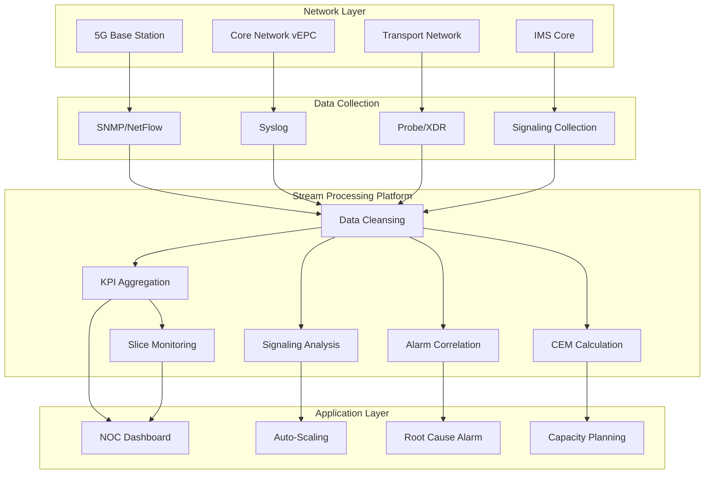
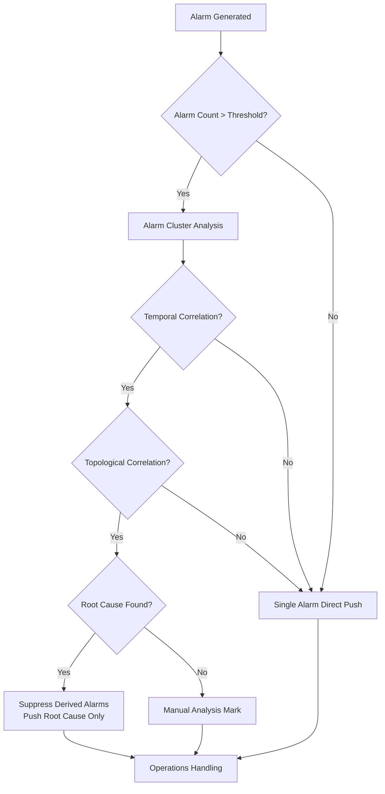

# Operators and Real-Time Telecom Network Monitoring

> **Stage**: Knowledge/06-frontier | **Prerequisites**: [operator-observability-and-intelligent-ops.md](./operator-observability-and-intelligent-ops.md), [operator-iot-stream-processing.md](./operator-iot-stream-processing.md) | **Formalization Level**: L3
> **Document Positioning**: Operator fingerprints and Pipeline design for stream processing operators in telecom network real-time monitoring, alarm correlation, and capacity planning
> **Version**: 2026.04

---

## Table of Contents

- [Operators and Real-Time Telecom Network Monitoring](#operators-and-real-time-telecom-network-monitoring)
  - [Table of Contents](#table-of-contents)
  - [1. Definitions](#1-definitions)
    - [Def-TEL-01-01: Telecom Network Data Stream (电信网络数据流)](#def-tel-01-01-telecom-network-data-stream-电信网络数据流)
    - [Def-TEL-01-02: Network Function Virtualization, NFV (网络功能虚拟化)](#def-tel-01-02-network-function-virtualization-nfv-网络功能虚拟化)
    - [Def-TEL-01-03: Alarm Storm (告警风暴)](#def-tel-01-03-alarm-storm-告警风暴)
    - [Def-TEL-01-04: Signaling Storm (信令风暴)](#def-tel-01-04-signaling-storm-信令风暴)
    - [Def-TEL-01-05: Customer Experience Management, CEM (用户体验管理)](#def-tel-01-05-customer-experience-management-cem-用户体验管理)
  - [2. Properties](#2-properties)
    - [Lemma-TEL-01-01: Temporal Locality of Telecom Data](#lemma-tel-01-01-temporal-locality-of-telecom-data)
    - [Lemma-TEL-01-02: Alarm Compression Ratio](#lemma-tel-01-02-alarm-compression-ratio)
    - [Prop-TEL-01-01: Quality of Service Isolation in 5G Network Slicing](#prop-tel-01-01-quality-of-service-isolation-in-5g-network-slicing)
    - [Prop-TEL-01-02: Peak-to-Average Ratio of Signaling Data](#prop-tel-01-02-peak-to-average-ratio-of-signaling-data)
  - [3. Relations](#3-relations)
    - [3.1 Telecom Monitoring Pipeline Operator Mapping](#31-telecom-monitoring-pipeline-operator-mapping)
    - [3.2 Operator Fingerprint](#32-operator-fingerprint)
    - [3.3 Telecom Protocols and Source Operators](#33-telecom-protocols-and-source-operators)
  - [4. Argumentation](#4-argumentation)
    - [4.1 Why Telecom Needs Stream Processing Instead of Traditional Network Management](#41-why-telecom-needs-stream-processing-instead-of-traditional-network-management)
    - [4.2 Root Cause Analysis of Alarm Correlation](#42-root-cause-analysis-of-alarm-correlation)
    - [4.3 Independent Monitoring of 5G Network Slices](#43-independent-monitoring-of-5g-network-slices)
  - [5. Proof / Engineering Argument](#5-proof--engineering-argument)
    - [5.1 CEP Implementation for Alarm Correlation](#51-cep-implementation-for-alarm-correlation)
    - [5.2 Real-Time KPI Aggregation](#52-real-time-kpi-aggregation)
    - [5.3 Signaling Storm Detection](#53-signaling-storm-detection)
  - [6. Examples](#6-examples)
    - [6.1 Real-World: 5G Core Network Real-Time Monitoring](#61-real-world-5g-core-network-real-time-monitoring)
    - [6.2 Real-World: User Experience Real-Time Monitoring](#62-real-world-user-experience-real-time-monitoring)
  - [7. Visualizations](#7-visualizations)
    - [Telecom Network Monitoring Architecture](#telecom-network-monitoring-architecture)
    - [Alarm Correlation Decision Tree](#alarm-correlation-decision-tree)
  - [8. References](#8-references)

---

## 1. Definitions

### Def-TEL-01-01: Telecom Network Data Stream (电信网络数据流)

The Telecom Network Data Stream is multi-dimensional monitoring data generated from the core network, radio access network (RAN), and transport network:

$$\text{NetworkStream} = \{S_{call}, S_{data}, S_{signal}, S_{fault}, S_{performance}\}$$

- $S_{call}$: Call Detail Record (CDR), including call start/end time, duration, location, etc.
- $S_{data}$: Data traffic record (XDR), including uplink/downlink traffic, application type, QoS level
- $S_{signal}$: Signaling data (SS7/Diameter/GTP), used for network control and user tracking
- $S_{fault}$: Device alarms (SNMP Trap/Syslog), including hardware failures, link interruptions, etc.
- $S_{performance}$: KPI metrics (counters), such as call drop rate, handover success rate, throughput

### Def-TEL-01-02: Network Function Virtualization, NFV (网络功能虚拟化)

NFV is an architecture that implements traditional dedicated telecom equipment functions as software running on general-purpose servers:

$$\text{NFV} = (\text{VNF}, \text{NFVI}, \text{MANO})$$

Where VNF (Virtual Network Function) includes vEPC, vIMS, vRAN, etc. Stream processing operators are responsible for real-time monitoring and elastic scaling of VNFs.

### Def-TEL-01-03: Alarm Storm (告警风暴)

An Alarm Storm is a cascading alarm flooding phenomenon triggered by network failures:

$$\text{AlarmStorm} = \{a_1, a_2, ..., a_n\}, \quad n \gg \text{normal}$$

Root cause: A single point of failure (e.g., fiber optic cable interruption) causes hundreds of downstream devices to alarm simultaneously.

### Def-TEL-01-04: Signaling Storm (信令风暴)

A Signaling Storm is control plane overload caused by a large number of terminals simultaneously triggering network signaling:

$$\lambda_{signaling} = N_{devices} \cdot f_{event} \gg C_{controlPlane}$$

Typical case: iPhone 4S iMessage bug caused a large number of terminals to repeatedly attach to the network.

### Def-TEL-01-05: Customer Experience Management, CEM (用户体验管理)

CEM is a comprehensive method for evaluating service quality by analyzing both network-side and user-side data:

$$\text{QoE} = f(\text{NetworkKPIs}, \text{DeviceMetrics}, \text{UserComplaints})$$

Objective: Derive user subjective experience scores from network performance metrics.

---

## 2. Properties

### Lemma-TEL-01-01: Temporal Locality of Telecom Data

Telecom network events exhibit strong temporal locality:

$$P(\text{event}_{t+1} \mid \text{event}_t) \gg P(\text{event}_{t+1})$$

**Engineering significance**: Aggregation analysis based on sliding windows is more efficient than global analysis.

### Lemma-TEL-01-02: Alarm Compression Ratio

Through root cause analysis, the number of alarms can be compressed to:

$$N_{root} = N_{raw} \cdot (1 - r_{compress})$$

Where $r_{compress}$ is the compression ratio; excellent systems can achieve 80-95%.

### Prop-TEL-01-01: Quality of Service Isolation in 5G Network Slicing

5G network slicing requires resource isolation between different slices:

$$\text{Resource}_{slice_i} \cap \text{Resource}_{slice_j} = \emptyset, \quad i \neq j$$

Stream processing operators must keyBy sliceId to independently count KPIs for each slice.

### Prop-TEL-01-02: Peak-to-Average Ratio of Signaling Data

The Peak-to-Average Power Ratio (PAPR) of signaling traffic is much higher than that of user-plane data:

$$\text{PAPR}_{signaling} = \frac{\lambda_{peak}}{\lambda_{avg}} \in [10, 100]$$

**Reason**: Timer synchronization (e.g., periodic TAU updates),突发事件 (e.g., call surges after earthquakes).

---

## 3. Relations

### 3.1 Telecom Monitoring Pipeline Operator Mapping

| Use Case | Operator Combination | Data Source | Latency Requirement |
|---------|---------|--------|---------|
| **Real-Time KPI Calculation** | window+aggregate | Performance counters | < 1 minute |
| **Alarm Correlation** | CEP / ProcessFunction | SNMP Trap/Syslog | < 5 seconds |
| **Signaling Analysis** | keyBy+aggregate | GTP/Diameter | < 1 minute |
| **Fraud Detection** | CEP+Async ML | CDR/XDR | < 5 minutes |
| **Capacity Alert** | window+map | Resource utilization | < 5 minutes |
| **User Experience** | join+aggregate | Network + application probes | < 5 minutes |
| **Network Slice Monitoring** | keyBy(sliceId)+window | Slice KPI | < 1 minute |

### 3.2 Operator Fingerprint

| Dimension | Telecom Monitoring Characteristics |
|------|-------------|
| **Core Operators** | window+aggregate (KPI statistics), CEP (alarm correlation), ProcessFunction (state machine: device status tracking), AsyncFunction (CEM queries) |
| **State Types** | MapState (current device status), ValueState (threshold configuration), WindowState (KPI history) |
| **Time Semantics** | Event time primarily (network device UTC clock synchronization) |
| **Data Characteristics** | Multi-source heterogeneous (counters + logs + signaling + CDR), high concurrency (tens of millions of devices), strong peaks and valleys (evening peak) |
| **State Hotspots** | Hot cell / base station keys |
| **Performance Bottlenecks** | Signaling decoding (ASN.1/GTP), massive counter aggregation |

### 3.3 Telecom Protocols and Source Operators

| Protocol | Purpose | Data Format | Flink Source |
|------|------|---------|-------------|
| **SNMP** | Device monitoring | MIB/Trap | SNMP4J Source |
| **Syslog** | Log collection | Text | Syslog Source |
| **NetFlow/IPFIX** | Traffic analysis | Binary | NetFlow Source |
| **Kafka** | Enterprise bus | Binary/JSON | Kafka Source |
| **gRPC** | VNF internal communication | Protobuf | gRPC Source |

---

## 4. Argumentation

### 4.1 Why Telecom Needs Stream Processing Instead of Traditional Network Management

Problems with traditional Operation Support System (OSS, 传统网管系统):

- Polling cycle of 5-15 minutes, unable to capture second-level failures
- Each subsystem operates independently; alarm correlation relies on manual work
- Reports generated T+1, unable to support real-time decision-making

Advantages of stream processing:

- Second-level KPI refresh: real-time awareness of network health
- Intelligent alarm correlation: automatic root cause identification, reducing 90% of invalid alarms
- Real-time capacity management: detecting congestion at minute-level and auto-scaling

### 4.2 Root Cause Analysis of Alarm Correlation

**Scenario**: Core router failure causes 100+ downstream base station alarms.

**Traditional approach**: Operations personnel check alarms one by one, taking several hours.

**Stream processing approach**:

1. Collect all alarms and group them by time window
2. Build alarm topology graph (device dependency relationships)
3. Identify root cause: the earliest occurring alarm with the largest impact scope
4. Automatically suppress derived alarms, only push root cause alarms

**Algorithm**:

- Temporal correlation: cluster alarms in the same region within 5 minutes
- Topological correlation: device dependency graph based on CMDB (Configuration Management Database, 配置管理数据库)
- Frequency correlation: rare alarms prioritized (based on historical frequency)

### 4.3 Independent Monitoring of 5G Network Slices

**Challenge**: The same physical infrastructure carries multiple virtual slices (eMBB/URLLC/mMTC), requiring independent monitoring.

**Solution**:

- Data level: all KPI records contain a sliceId field
- Operator level: keyBy sliceId, independent aggregation
- Presentation level: independent monitoring dashboard for each slice

**Key KPIs**:

- eMBB (Enhanced Mobile Broadband, 增强移动宽带): throughput, peak rate
- URLLC (Ultra-Reliable Low Latency, 超可靠低延迟): end-to-end latency, reliability
- mMTC (Massive Machine Type Communications, 海量机器通信): connection density, power consumption

---

## 5. Proof / Engineering Argument

### 5.1 CEP Implementation for Alarm Correlation

```java
Pattern<AlarmEvent, ?> rootCausePattern = Pattern
    .<AlarmEvent>begin("root")
    .where(evt -> evt.getSeverity().equals("CRITICAL"))
    .next("children")
    .where(new IterativeCondition<AlarmEvent>() {
        @Override
        public boolean filter(AlarmEvent event, Context<AlarmEvent> ctx) {
            // Get root alarm
            List<AlarmEvent> roots = ctx.getEventsForPattern("root");
            if (roots.isEmpty()) return false;

            AlarmEvent root = roots.get(0);

            // Temporal correlation: within 5 minutes
            boolean timeRelated = event.getTimestamp() - root.getTimestamp() < 300000;

            // Topological correlation: child alarm device depends on root alarm device
            boolean topoRelated = isDependent(event.getDeviceId(), root.getDeviceId());

            // Frequency correlation: child alarm type is rare
            boolean rareEvent = getHistoricalFrequency(event.getType()) < 0.01;

            return timeRelated && topoRelated && rareEvent;
        }
    })
    .timesOrMore(3)  // At least 3 child alarms
    .within(Time.minutes(5));
```

### 5.2 Real-Time KPI Aggregation

```java
// Cell-level KPI aggregation (1-minute window)
DataStream<KPIRecord> kpis = env.addSource(new KafkaSource<>("network-kpis"));

kpis.keyBy(KPIRecord::getCellId)
    .window(TumblingEventTimeWindows.of(Time.minutes(1)))
    .aggregate(new KPIAggregateFunction())
    .keyBy(KPIStats::getRegionId)
    .process(new ThresholdCheckFunction())
    .addSink(new AlertSink());

public class KPIAggregateFunction implements AggregateFunction<KPIRecord, KPIAccumulator, KPIStats> {
    @Override
    public KPIAccumulator createAccumulator() { return new KPIAccumulator(); }

    @Override
    public KPIAccumulator add(KPIRecord record, KPIAccumulator acc) {
        acc.callAttempts += record.getCallAttempts();
        acc.callDrops += record.getCallDrops();
        acc.dataVolume += record.getDataVolume();
        acc.userCount += record.getActiveUsers();
        return acc;
    }

    @Override
    public KPIStats getResult(KPIAccumulator acc) {
        return new KPIStats(
            acc.cellId,
            (double) acc.callDrops / acc.callAttempts,  // Call drop rate
            acc.dataVolume / 60.0,  // Average throughput
            acc.userCount
        );
    }
}
```

### 5.3 Signaling Storm Detection

```java
// Detect abnormal attach requests (potential signaling storm)
DataStream<SignalingEvent> signaling = env.addSource(new KafkaSource<>("signaling"));

signaling.filter(evt -> evt.getType().equals("ATTACH_REQUEST"))
    .keyBy(SignalingEvent::getCellId)
    .window(SlidingEventTimeWindows.of(Time.minutes(1), Time.seconds(10)))
    .aggregate(new AttachCountAggregate())
    .filter(count -> count > getBaseline(count.getCellId()) * 5)  // Exceeds baseline by 5x
    .addSink(new SignalingStormAlertSink());
```

---

## 6. Examples

### 6.1 Real-World: 5G Core Network Real-Time Monitoring

```java
// 1. Multi-source data ingestion
DataStream<NFMetric> vnfMetrics = env.addSource(new PrometheusSource("vnf-metrics"));
DataStream<AlarmEvent> alarms = env.addSource(new SNMPTrapSource("udp://0.0.0.0:162"));
DataStream<SignalingEvent> signaling = env.addSource(new KafkaSource<>("signaling"));

// 2. VNF performance monitoring (CPU/memory/throughput)
vnfMetrics.keyBy(NFMetric::getVnfId)
    .window(TumblingProcessingTimeWindows.of(Time.minutes(1)))
    .aggregate(new VNFAggregate())
    .filter(stats -> stats.getCpuUsage() > 80 || stats.getMemoryUsage() > 85)
    .addSink(new VNFScalingTriggerSink());  // Trigger auto-scaling

// 3. Alarm correlation and root cause analysis
alarms.keyBy(AlarmEvent::getRegionId)
    .pattern(rootCausePattern)
    .process(new RootCauseHandler())
    .addSink(new ConsolidatedAlertSink());

// 4. Network slice KPI monitoring
vnfMetrics.keyBy(NFMetric::getSliceId)
    .window(TumblingEventTimeWindows.of(Time.minutes(1)))
    .aggregate(new SliceKPIAggregate())
    .addSink(new SliceDashboardSink());
```

### 6.2 Real-World: User Experience Real-Time Monitoring

```java
// XDR (eXtended Detail Record) analysis
DataStream<XDRRecord> xdr = env.addSource(new KafkaSource<>("xdr"));

// Calculate experience score per user
xdr.keyBy(XDRRecord::getUserId)
    .window(TumblingEventTimeWindows.of(Time.minutes(5)))
    .aggregate(new UserExperienceAggregate())
    .filter(qoe -> qoe.getScore() < 3.0)  // Experience score < 3 (out of 5)
    .map(qoe -> new PoorExperienceEvent(qoe.getUserId(), qoe.getCellId(), qoe.getReason()))
    .keyBy(PoorExperienceEvent::getCellId)
    .window(TumblingEventTimeWindows.of(Time.minutes(5)))
    .aggregate(new CellIssueAggregate())
    .filter(issue -> issue.getAffectedUsers() > 100)  // Affects > 100 users
    .addSink(new NetworkOptimizationSink());
```

---

## 7. Visualizations

### Telecom Network Monitoring Architecture



### Alarm Correlation Decision Tree



---

## 8. References


---

*Related Documents*: [operator-observability-and-intelligent-ops.md](./operator-observability-and-intelligent-ops.md) | [operator-iot-stream-processing.md](./operator-iot-stream-processing.md) | [operator-chaos-engineering-and-resilience.md](./operator-chaos-engineering-and-resilience.md)
