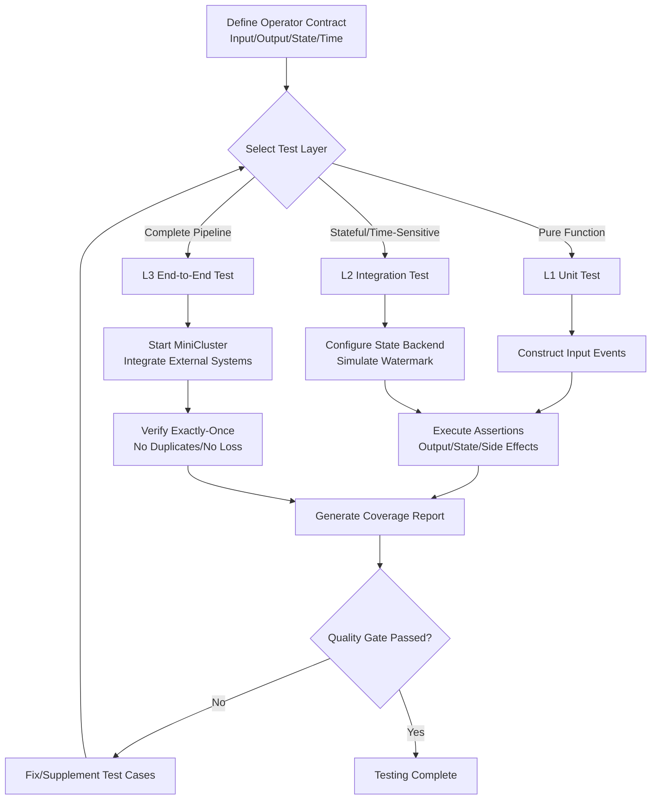
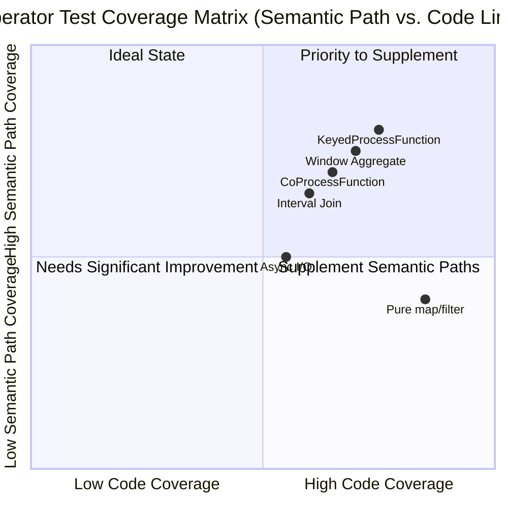
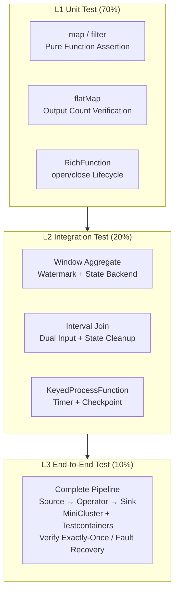
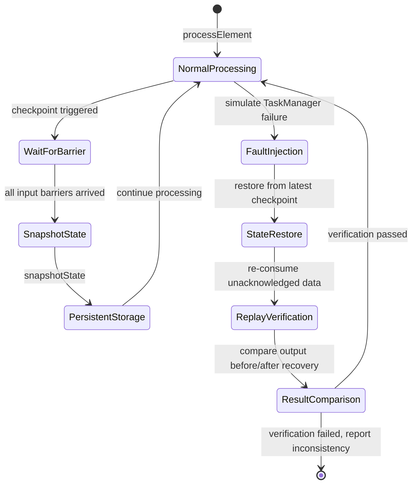
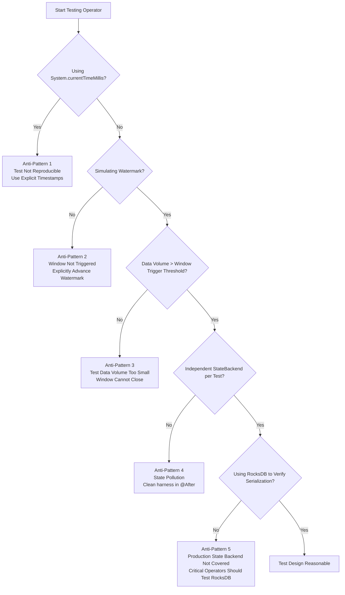

# Stream Processing Operator Testing and Verification Guide

> **Stage**: Knowledge/07-best-practices | **Prerequisites**: [./testing-strategies-complete.md](./testing-strategies-complete.md), [./flink-state-management-complete-guide.md](./flink-state-management-complete-guide.md) | **Formalization Level**: L4
> **Last Updated**: 2026-04-30

---

## Table of Contents

- [Stream Processing Operator Testing and Verification Guide](#stream-processing-operator-testing-and-verification-guide)
  - [Table of Contents](#table-of-contents)
  - [1. Definitions](#1-definitions)
    - [Def-TEST-01-01 (Operator Testing Layer Model)](#def-test-01-01-operator-testing-layer-model)
    - [Def-TEST-01-02 (Flink TestHarness)](#def-test-01-02-flink-testharness)
    - [Def-TEST-01-03 (Deterministic Test Time)](#def-test-01-03-deterministic-test-time)
    - [Def-TEST-01-04 (Test Data Generator)](#def-test-01-04-test-data-generator)
    - [Def-TEST-01-05 (State Consistency Verification)](#def-test-01-05-state-consistency-verification)
  - [2. Properties](#2-properties)
    - [Prop-TEST-01-01 (TestHarness Test Isolation)](#prop-test-01-01-testharness-test-isolation)
    - [Lemma-TEST-01-01 (Watermark Monotonicity Guarantee)](#lemma-test-01-01-watermark-monotonicity-guarantee)
    - [Prop-TEST-01-02 (Checkpoint Restore Idempotence)](#prop-test-01-02-checkpoint-restore-idempotence)
    - [Lemma-TEST-01-02 (Stateful Operator Latency Lower Bound)](#lemma-test-01-02-stateful-operator-latency-lower-bound)
  - [3. Relations](#3-relations)
    - [3.1 Mapping Between Testing Layers and Tools](#31-mapping-between-testing-layers-and-tools)
    - [3.2 Hierarchical Relationship Between TestHarness and MiniCluster](#32-hierarchical-relationship-between-testharness-and-minicluster)
    - [3.3 Test Data Strategy and Scenario Mapping](#33-test-data-strategy-and-scenario-mapping)
  - [4. Argumentation](#4-argumentation)
    - [4.1 Why Stream Processing Operators Require Dedicated Testing Frameworks](#41-why-stream-processing-operators-require-dedicated-testing-frameworks)
    - [4.2 Impact of State Backend Selection on Testing Behavior](#42-impact-of-state-backend-selection-on-testing-behavior)
    - [4.3 Boundary Conditions for Exactly-Once Semantics Verification](#43-boundary-conditions-for-exactly-once-semantics-verification)
  - [5. Proof / Engineering Argument](#5-proof--engineering-argument)
    - [Thm-TEST-01-01 (Operator Testing Completeness Theorem)](#thm-test-01-01-operator-testing-completeness-theorem)
    - [5.1 Engineering Specification for Verification Workflow](#51-engineering-specification-for-verification-workflow)
    - [5.2 Engineering Argument for Coverage Matrix](#52-engineering-argument-for-coverage-matrix)
  - [6. Examples](#6-examples)
    - [6.1 Example 1: KeyedProcessFunction Unit Test (L1 + L2)](#61-example-1-keyedprocessfunction-unit-test-l1--l2)
    - [6.2 Example 2: Window Aggregate Test (L2)](#62-example-2-window-aggregate-test-l2)
    - [6.3 Example 3: Interval Join Test (L2)](#63-example-3-interval-join-test-l2)
    - [6.4 Example 4: End-to-End Exactly-Once Verification (L3)](#64-example-4-end-to-end-exactly-once-verification-l3)
    - [6.5 Example 5: Datafaker Streaming Event Generator](#65-example-5-datafaker-streaming-event-generator)
  - [7. Visualizations](#7-visualizations)
    - [7.1 Operator Testing Pyramid](#71-operator-testing-pyramid)
    - [7.2 State Verification and Exactly-Once Verification Flow](#72-state-verification-and-exactly-once-verification-flow)
    - [7.3 Testing Anti-Pattern Decision Tree](#73-testing-anti-pattern-decision-tree)
  - [8. Common Testing Anti-Patterns](#8-common-testing-anti-patterns)
    - [8.1 Anti-Pattern 1: Using Real Time Instead of Event Time](#81-anti-pattern-1-using-real-time-instead-of-event-time)
    - [8.2 Anti-Pattern 2: Not Simulating Watermark Progression](#82-anti-pattern-2-not-simulating-watermark-progression)
    - [8.3 Anti-Pattern 3: Insufficient Test Data to Trigger Windows](#83-anti-pattern-3-insufficient-test-data-to-trigger-windows)
    - [8.4 Anti-Pattern 4: Not Cleaning Up TestHarness State](#84-anti-pattern-4-not-cleaning-up-testharness-state)
    - [8.5 Anti-Pattern 5: Testing Only with HashMapStateBackend](#85-anti-pattern-5-testing-only-with-hashmapstatebackend)
  - [9. References](#9-references)

## 1. Definitions

### Def-TEST-01-01 (Operator Testing Layer Model)

The stream processing operator testing layer model (算子测试分层模型) defines a three-level verification hierarchy from pure functions to complete data pipelines:

$$
\text{OperatorTestingModel} = \langle L_1^{\text{Unit}}, L_2^{\text{Integration}}, L_3^{\text{E2E}} \rangle
$$

Where:

- $L_1^{\text{Unit}}$: Unit test layer, covering pure-function operators (map/filter/flatMap), verifying single-record transformation logic, execution time $< 100\text{ms}$;
- $L_2^{\text{Integration}}$: Integration test layer, covering stateful operators (window/aggregate/join), verifying state management and time semantics interaction, execution time $1\text{-}10\text{s}$;
- $L_3^{\text{E2E}}$: End-to-end test layer, covering complete pipelines (including Source/Sink), verifying job-level correctness and fault tolerance recovery, execution time $10\text{-}60\text{s}$.

The ideal proportion of the testing pyramid is $L_1 : L_2 : L_3 = 70\% : 20\% : 10\%$[^1].

### Def-TEST-01-02 (Flink TestHarness)

`TestHarness` is a runtime simulator provided by Flink specifically for isolated testing of streaming operators (流算子). Its structure is:

$$
\text{TestHarness} = \langle \text{Environment}, \text{Operator}, \text{StateBackend}, \text{TimeService}, \text{OutputCollector} \rangle
$$

Flink provides four types of TestHarness[^2]:

- `OneInputStreamOperatorTestHarness`: For single-input DataStream operator testing;
- `KeyedOneInputStreamOperatorTestHarness`: For KeyedStream operator testing, requiring additional `KeySelector` and `TypeInformation`;
- `TwoInputStreamOperatorTestHarness`: For ConnectedStreams dual-input operator testing;
- `KeyedTwoInputStreamOperatorTestHarness`: For dual KeyedStream input operator testing (e.g., Interval Join).

In addition, since Flink 1.11, the `ProcessFunctionTestHarnesses` factory class is provided to simplify test case authoring for `ProcessFunction` and its variants (`KeyedProcessFunction`, `KeyedCoProcessFunction`, `BroadcastProcessFunction`)[^3].

### Def-TEST-01-03 (Deterministic Test Time)

Deterministic test time (确定性测试时间) means that during test execution, event time (事件时间) and processing time (处理时间) are fully controlled by test code explicitly, rather than depending on the system clock:

$$
\text{DeterministicTime} \iff \forall t_{\text{event}}, t_{\text{proc}} \in \text{Test}: t_{\text{event}} = f_{\text{test}}(i) \land t_{\text{proc}} = g_{\text{test}}(j)
$$

Where $f_{\text{test}}$ and $g_{\text{test}}$ are time functions explicitly specified in the test code, and $i, j$ are the indices of input elements or test step indexes. Event time is controlled via `processElement(record, timestamp)`, and processing time is controlled via `setProcessingTime(timestamp)`[^4].

### Def-TEST-01-04 (Test Data Generator)

A test data generator (测试数据生成器) is a tool used to automatically construct large-scale, structured, semantically valid streaming event data. Mainstream solutions include:

- **Datafaker**: A Java/Kotlin library supporting 233+ data providers, capable of generating names, addresses, timestamps, financial data, etc., with support for repeatable random seeds and batch/streaming generation[^5];
- **Schema Registry + Avro/Protobuf**: Schema-driven generation based on Confluent Schema Registry or AWS Glue Schema Registry, ensuring data format consistency with production[^6];
- **Event Time Generator**: Generates event streams with monotonically increasing or intentionally out-of-order timestamps according to business scenarios, used to verify watermark strategies and window behaviors.

### Def-TEST-01-05 (State Consistency Verification)

State consistency verification (状态一致性验证) refers to validating the correctness of an operator's state after fault recovery by simulating checkpoint creation, state snapshot persistence, and state restoration:

$$
\text{StateConsistent}(O) \iff \forall \text{ckpt}: \text{Restore}(\text{Snapshot}(O, \text{ckpt})) \equiv O_{\text{pre-failure}}
$$

Where $\text{Snapshot}(O, \text{ckpt})$ is the state snapshot of operator $O$ at checkpoint time, $\text{Restore}$ is the operator state after recovery from the snapshot, and $\equiv$ denotes state equivalence. Flink TestHarness provides `snapshot(checkpointId, timestamp)` and `initializeState(stateHandles)` methods to directly support this verification[^7].

---

## 2. Properties

### Prop-TEST-01-01 (TestHarness Test Isolation)

Each TestHarness instance maintains an independent state backend (状态后端) and output queue in memory:

$$
\forall h_1, h_2 \in \text{TestHarnesses}: \text{State}(h_1) \cap \text{State}(h_2) = \emptyset \land \text{Output}(h_1) \cap \text{Output}(h_2) = \emptyset
$$

This property ensures that concurrent execution of multiple test cases does not cause state pollution or output crossover, provided that each `@Test` method independently creates a TestHarness instance and calls `harness.close()` in `@After`[^8].

### Lemma-TEST-01-01 (Watermark Monotonicity Guarantee)

When manually advancing watermarks in TestHarness, if the following holds:

$$
\forall w_i, w_{i+1} \in \text{Watermarks}: w_{i+1} \geq w_i
$$

Then window operator triggering is deterministic. That is, for the same input event set and watermark sequence, the window computation result is always consistent.

*Derivation*: Flink window operators only trigger computation when receiving a watermark $w \geq \text{window-end-time}$. If watermarks are monotonically non-decreasing, the trigger timing is uniquely determined; if watermarks regress, the behavior is undefined and may cause repeated window triggers or inconsistent results. ∎

### Prop-TEST-01-02 (Checkpoint Restore Idempotence)

For stateful operators supporting exactly-once semantics, the checkpoint/restore cycle satisfies:

$$
\text{Restore}(\text{Snapshot}(O)) \equiv O \implies \forall n \geq 1: (\text{Restore} \circ \text{Snapshot})^n(O) \equiv O
$$

That is, under the condition of no new input, the operator state remains unchanged after multiple snapshot-restore operations. This property is the foundation of end-to-end exactly-once semantics[^9].

### Lemma-TEST-01-02 (Stateful Operator Latency Lower Bound)

For keyed window/aggregate/join operators using the RocksDB state backend, single-record processing latency satisfies:

$$
L_{\text{stateful}} \geq t_{\text{serde}} + t_{\text{rocksdb\_seek}} + t_{\text{udf}}
$$

Where $t_{\text{rocksdb\_seek}}$ is approximately $1\text{-}10\,\mu\text{s}$ on SSD and about $100\,\text{ns}$ in memory (HashMapStateBackend). Therefore, the choice of state backend in integration tests directly affects the focus of operator behavior verification: memory backends verify logical correctness, while RocksDB backends verify serialization and large-state behavior[^10].

---

## 3. Relations

### 3.1 Mapping Between Testing Layers and Tools

| Test Layer | Target Operators | Core Testing Tools | State Backend | Time Control Method | Typical Execution Time |
|---|---|---|---|---|---|
| $L_1$ Unit Test | map, filter, flatMap, pure UDF | `OneInputStreamOperatorTestHarness` | Not needed / In-memory | `processElement(ts)` | $< 100\,\text{ms}$ |
| $L_2$ Integration Test | window, aggregate, join, ProcessFunction | `KeyedOneInputStreamOperatorTestHarness`, `TwoInputStreamOperatorTestHarness` | HashMapStateBackend / EmbeddedRocksDBStateBackend | `processWatermark()`, `setProcessingTime()` | $1\text{-}10\,\text{s}$ |
| $L_3$ End-to-End Test | Complete Pipeline | `MiniClusterWithClientResource`, Testcontainers | Full configuration | System time / Injected time | $10\text{-}60\,\text{s}$ |

### 3.2 Hierarchical Relationship Between TestHarness and MiniCluster

```
┌─────────────────────────────────────────────────────────────────┐
│                     Stream Processing Testing Stack             │
├─────────────────────────────────────────────────────────────────┤
│  L3 End-to-End   │  MiniCluster + Testcontainers (Kafka/PG)     │
├─────────────────────────────────────────────────────────────────┤
│  L2 Integration  │  KeyedOneInputStreamOperatorTestHarness      │
│                  │  TwoInputStreamOperatorTestHarness           │
├─────────────────────────────────────────────────────────────────┤
│  L1 Unit Test    │  OneInputStreamOperatorTestHarness           │
│                  │  ProcessFunctionTestHarnesses Factory        │
├─────────────────────────────────────────────────────────────────┤
│  Infrastructure  │  JUnit 5 + AssertJ + Datafaker + Mockito     │
└─────────────────────────────────────────────────────────────────┘
```

### 3.3 Test Data Strategy and Scenario Mapping

| Data Strategy | Tools | Applicable Scenarios | State Determinism | Data Volume |
|---|---|---|---|---|
| Fixed Hard-coded | Manually constructed POJO | Regression testing, boundary value verification | Fully deterministic | Small (10-100 records) |
| Random Generation | Datafaker + seed | Fuzz testing, coverage improvement | Repeatable (fixed seed) | Medium (1K-10K records) |
| Schema-driven | Schema Registry + Avro | Integration testing, format compatibility | Constrained by schema | Large (10K+ records) |
| Production Subset Sampling | De-sensitized real data | Performance testing, end-to-end verification | Non-deterministic | Extremely large (millions) |

---

## 4. Argumentation

### 4.1 Why Stream Processing Operators Require Dedicated Testing Frameworks

Traditional unit testing frameworks (such as JUnit) face three fundamental deficiencies when testing stream processing operators (流处理算子):

**1. Lack of Time Semantics**

Traditional testing frameworks cannot express event time and watermark progression logic. For the following window aggregation operator:

```java
// Traditional approach: unable to test time semantics
@Test
public void badWindowTest() {
    // Cannot simulate watermark triggering window closure
    // Cannot control event timestamps
    // Result: test cannot cover window computation paths
}
```

**2. State Opacity**

The internal state of stateful operators (e.g., `KeyedProcessFunction`) is a black box to traditional testing frameworks. Developers cannot verify whether state values accumulate correctly after multiple inputs, nor can they verify the accuracy of state recovery after checkpoint.

**3. Asynchronous Execution Complexity**

Stream processing is continuously asynchronous. Traditional assertions `assertEquals(expected, actual)` may produce flaky results when data is not fully processed. TestHarness converts asynchronous streams into a synchronous verification model through synchronous `processElement` and `extractOutputValues`[^11].

Flink TestHarness solution path:

```java
// TestHarness approach: full control of time and state
@Test
public void goodWindowTest() throws Exception {
    KeyedOneInputStreamOperatorTestHarness<String, Event, Result> harness = ...;
    harness.processElement(event1, 1000L);   // Explicitly specify event time
    harness.processElement(event2, 2500L);
    harness.processWatermark(new Watermark(3000L)); // Explicitly advance watermark
    // Synchronous verification of output
    assertThat(harness.extractOutputValues()).containsExactly(expectedResult);
}
```

### 4.2 Impact of State Backend Selection on Testing Behavior

In $L_2$ integration tests, the choice of state backend (状态后端) determines the focus of test verification:

| State Backend | Verification Focus | Limitations |
|---|---|---|
| `HashMapStateBackend` | Operator logic correctness, time semantics | Cannot discover serialization bugs, OOM when state is too large |
| `EmbeddedRocksDBStateBackend` | Serialization correctness, large-state behavior, incremental checkpoint | Test execution time increases 2-5x |

**Argument**: Production environments typically use the RocksDB state backend, so $L_2$ tests must use `EmbeddedRocksDBStateBackend` for verification on at least critical operators to ensure serializer (`TypeSerializer`) compatibility after upgrades. However, daily development's fast feedback loop should primarily use `HashMapStateBackend` to reduce test execution costs[^12].

### 4.3 Boundary Conditions for Exactly-Once Semantics Verification

Flink's exactly-once semantics are based on the Chandy-Lamport distributed snapshot algorithm, achieving state consistency through barrier alignment[^13]. The following boundaries must be verified in testing:

1. **Barrier Alignment Path**: Multi-input operators (join/co-group) must wait for barriers from all input channels before snapshotting state;
2. **Unaligned Checkpoint Path**: Flink 1.11+ supports unaligned checkpoints, incorporating inflight data into the snapshot. Tests must verify recovery behavior under backpressure scenarios;
3. **At-Least-Once Degradation Path**: When barrier alignment times out, the system degrades to at-least-once. Tests must verify that this degradation does not cause state corruption.

---

## 5. Proof / Engineering Argument

### Thm-TEST-01-01 (Operator Testing Completeness Theorem)

For a stream processing operator $O$, a test suite $S$ achieves complete coverage if and only if:

$$
\forall p \in \text{Paths}(O), \exists s \in S: \text{Covers}(s, p)
$$

Where $\text{Paths}(O)$ contains the following six categories of execution paths:

1. **Normal Processing Path**: Single or multiple records processed in order;
2. **Watermark Trigger Path**: Windows close and output due to watermark progression;
3. **Timer Trigger Path**: Processing Time / Event Time timers expire and trigger `onTimer`;
4. **Checkpoint Snapshot Path**: Execute `snapshotState` after barrier arrival;
5. **Fault Recovery Path**: State correctness after recovery from checkpoint/savepoint;
6. **Late Data Path**: Data arriving after window closure enters side output or updates results.

**Engineering Argument**: In practice, complete coverage is achieved through layered testing:

- $L_1$ unit tests cover path 1 (normal processing);
- $L_2$ integration tests cover paths 2, 3, 4, 6 (time semantics + state management);
- $L_3$ end-to-end tests cover path 5 (fault recovery).

### 5.1 Engineering Specification for Verification Workflow

Stream processing operator verification should follow the following standardized workflow:



*Figure 5.1: Standardized Workflow for Stream Processing Operator Verification*

### 5.2 Engineering Argument for Coverage Matrix

Operator test coverage is not merely code line coverage, but emphasizes semantic path coverage. The following table presents minimum coverage requirements for different operator types:



*Figure 5.2: Operator Test Coverage Matrix — Quadrant Distribution of Semantic Path Coverage vs. Code Line Coverage*

**Argument**: Pure map/filter operators have high code line coverage but simple semantic paths (no non-deterministic factors); whereas Interval Join and Async I/O involve dual-input synchronization and timeout handling, making their semantic paths complex and requiring focused supplementation of test cases[^14].

---

## 6. Examples

### 6.1 Example 1: KeyedProcessFunction Unit Test (L1 + L2)

The following example demonstrates how to use `KeyedOneInputStreamOperatorTestHarness` to test a `KeyedProcessFunction` with state and timers, covering normal processing paths, timer trigger paths, and checkpoint restore paths.

```java
import org.apache.flink.api.common.typeinfo.Types;
import org.apache.flink.api.common.state.ValueState;
import org.apache.flink.api.common.state.ValueStateDescriptor;
import org.apache.flink.configuration.Configuration;
import org.apache.flink.streaming.api.functions.KeyedProcessFunction;
import org.apache.flink.streaming.api.operators.KeyedProcessOperator;
import org.apache.flink.streaming.runtime.streamrecord.StreamRecord;
import org.apache.flink.streaming.util.KeyedOneInputStreamOperatorTestHarness;
import org.apache.flink.streaming.util.OneInputStreamOperatorTestHarness;
import org.apache.flink.util.Collector;
import org.junit.After;
import org.junit.Before;
import org.junit.Test;

import java.util.List;
import java.util.concurrent.ConcurrentLinkedQueue;

import static org.assertj.core.api.Assertions.assertThat;

/**
 * KeyedProcessFunction with stateful counting and timeout alerts
 */
public class KeyedCounterProcessFunctionTest {

    private KeyedOneInputStreamOperatorTestHarness<String, Event, Alert> harness;

    @Before
    public void setup() throws Exception {
        KeyedCounterProcessFunction function = new KeyedCounterProcessFunction();
        KeyedProcessOperator<String, Event, Alert> operator =
            new KeyedProcessOperator<>(function);

        harness = new KeyedOneInputStreamOperatorTestHarness<>(
            operator,
            Event::getUserId,
            Types.STRING
        );
        harness.setup();
        harness.open();
    }

    @After
    public void teardown() throws Exception {
        if (harness != null) {
            harness.close();
        }
    }

    @Test
    public void testAccumulateCount() throws Exception {
        // Given: two events for the same user
        harness.processElement(new Event("user1", "click", 1000L), 1000L);
        harness.processElement(new Event("user1", "click", 2000L), 2000L);

        // Then: verify output (each event triggers one count output)
        List<Alert> output = harness.extractOutputValues();
        assertThat(output).hasSize(2);
        assertThat(output.get(0).getCount()).isEqualTo(1);
        assertThat(output.get(1).getCount()).isEqualTo(2);
    }

    @Test
    public void testProcessingTimeTimer() throws Exception {
        // Given: user event, timer set to processing time + 5000ms
        harness.processElement(new Event("user1", "click", 1000L), 1000L);

        // When: advance processing time to trigger timer
        harness.setProcessingTime(6000L);

        // Then: verify timeout alert output
        List<Alert> output = harness.extractOutputValues();
        assertThat(output).hasSize(2); // 1 count + 1 timeout
        Alert timeoutAlert = output.get(1);
        assertThat(timeoutAlert.getType()).isEqualTo("TIMEOUT");
    }

    @Test
    public void testCheckpointRestore() throws Exception {
        // Given: process events and create checkpoint
        harness.processElement(new Event("user1", "click", 1000L), 1000L);
        harness.processElement(new Event("user1", "click", 2000L), 2000L);

        // Simulate checkpoint
        OperatorStateHandles snapshot = harness.snapshot(0L, 0L);

        // When: close old harness, create new one and restore state
        harness.close();
        setup();
        harness.initializeState(snapshot);

        // Then: process another event, count should inherit previous state (2+1=3)
        harness.processElement(new Event("user1", "click", 3000L), 3000L);
        List<Alert> output = harness.extractOutputValues();
        assertThat(output.get(0).getCount()).isEqualTo(3);
    }

    // ========== Operator Under Test ==========
    static class KeyedCounterProcessFunction
            extends KeyedProcessFunction<String, Event, Alert> {

        private transient ValueState<Integer> countState;
        private static final long TIMEOUT_MS = 5000L;

        @Override
        public void open(Configuration parameters) {
            countState = getRuntimeContext().getState(
                new ValueStateDescriptor<>("count", Types.INT)
            );
        }

        @Override
        public void processElement(Event event, Context ctx, Collector<Alert> out)
                throws Exception {
            Integer current = countState.value();
            if (current == null) {
                current = 0;
            }
            current++;
            countState.update(current);
            out.collect(new Alert(event.getUserId(), "COUNT", current));

            // Register processing time timer
            ctx.timerService().registerProcessingTimeTimer(
                ctx.timerService().currentProcessingTime() + TIMEOUT_MS
            );
        }

        @Override
        public void onTimer(long timestamp, OnTimerContext ctx, Collector<Alert> out)
                throws Exception {
            out.collect(new Alert(ctx.getCurrentKey(), "TIMEOUT", countState.value()));
            countState.clear();
        }
    }

    // ========== Data Classes ==========
    static class Event {
        private final String userId;
        private final String action;
        private final long timestamp;
        // constructor, getters...
        public Event(String userId, String action, long timestamp) {
            this.userId = userId; this.action = action; this.timestamp = timestamp;
        }
        public String getUserId() { return userId; }
        public long getTimestamp() { return timestamp; }
    }

    static class Alert {
        private final String userId;
        private final String type;
        private final int count;
        // constructor, getters...
        public Alert(String userId, String type, int count) {
            this.userId = userId; this.type = type; this.count = count;
        }
        public String getType() { return type; }
        public int getCount() { return count; }
    }
}
```

### 6.2 Example 2: Window Aggregate Test (L2)

The following example demonstrates testing of a Tumbling Event Time Window (滚动事件时间窗口), focusing on watermark triggering, late data side output, and incremental aggregation logic.

```java
import org.apache.flink.api.common.typeinfo.Types;
import org.apache.flink.api.java.tuple.Tuple2;
import org.apache.flink.streaming.api.windowing.assigners.TumblingEventTimeWindows;
import org.apache.flink.streaming.api.windowing.time.Time;
import org.apache.flink.streaming.api.windowing.windows.TimeWindow;
import org.apache.flink.streaming.runtime.streamrecord.StreamRecord;
import org.apache.flink.streaming.util.KeyedOneInputStreamOperatorTestHarness;
import org.apache.flink.streaming.util.OneInputStreamOperatorTestHarness;
import org.apache.flink.streaming.api.operators.OneInputStreamOperator;
import org.apache.flink.streaming.api.watermark.Watermark;
import org.junit.Before;
import org.junit.Test;

import java.util.List;

import static org.assertj.core.api.Assertions.assertThat;

/**
 * TumblingWindow Aggregate integration test
 */
public class TumblingWindowAggregateTest {

    private KeyedOneInputStreamOperatorTestHarness<String, Tuple2<String, Long>,
            Tuple2<String, Long>> harness;
    private static final long WINDOW_SIZE_MS = 5000L;
    private static final long ALLOWED_LATENESS_MS = 1000L;

    @Before
    public void setup() throws Exception {
        // Construct WindowOperator (using Flink internal API; in actual projects can be built via StreamExecutionEnvironment)
        WindowOperator<String, Tuple2<String, Long>, ?, ?, ?> windowOperator =
            WindowOperator.builder()
                .setKeySelector(value -> value.f0)
                .setKeyType(Types.STRING)
                .setWindowAssigner(TumblingEventTimeWindows.of(Time.milliseconds(WINDOW_SIZE_MS)))
                .setAllowedLateness(Time.milliseconds(ALLOWED_LATENESS_MS))
                .setTrigger(EventTimeTrigger.create())
                .setWindowFunction(new AggregateFunction<...>()) // specific implementation omitted
                .build();

        harness = new KeyedOneInputStreamOperatorTestHarness<>(
            windowOperator,
            value -> value.f0,
            Types.STRING
        );
        harness.setup();
        harness.open();
    }

    @Test
    public void testWindowAggregation() throws Exception {
        // Given: 3 events within [0, 5000) window
        harness.processElement(Tuple2.of("key1", 100L), 1000L);
        harness.processElement(Tuple2.of("key1", 200L), 2500L);
        harness.processElement(Tuple2.of("key1", 300L), 4000L);

        // When: advance watermark beyond window end time
        harness.processWatermark(new Watermark(5001L));

        // Then: verify aggregation result (sum = 600)
        List<Tuple2<String, Long>> output = harness.extractOutputValues();
        assertThat(output).hasSize(1);
        assertThat(output.get(0).f1).isEqualTo(600L);
    }

    @Test
    public void testLateDataWithinAllowedLateness() throws Exception {
        // Given: trigger window
        harness.processElement(Tuple2.of("key1", 100L), 1000L);
        harness.processWatermark(new Watermark(5001L));

        // When: send late data within allowed lateness range
        harness.processElement(Tuple2.of("key1", 50L), 2000L);
        harness.processWatermark(new Watermark(6001L));

        // Then: result should be updated to 150
        List<Tuple2<String, Long>> output = harness.extractOutputValues();
        assertThat(output.get(output.size() - 1).f1).isEqualTo(150L);
    }

    @Test
    public void testLateDataToSideOutput() throws Exception {
        OutputTag<Tuple2<String, Long>> lateDataTag =
            new OutputTag<>("late-data") {};

        // Given: trigger window
        harness.processElement(Tuple2.of("key1", 100L), 1000L);
        harness.processWatermark(new Watermark(5001L));

        // When: late data beyond allowed lateness range
        harness.processElement(Tuple2.of("key1", 999L), 6100L);

        // Then: verify side output
        assertThat(harness.getSideOutput(lateDataTag)).hasSize(1);
    }
}
```

### 6.3 Example 3: Interval Join Test (L2)

The following example demonstrates testing Interval Join (间隔连接) using `KeyedTwoInputStreamOperatorTestHarness`, verifying dual-input time alignment and state cleanup logic.

```java
import org.apache.flink.api.common.typeinfo.Types;
import org.apache.flink.api.java.tuple.Tuple2;
import org.apache.flink.streaming.api.functions.co.ProcessJoinFunction;
import org.apache.flink.streaming.api.windowing.time.Time;
import org.apache.flink.streaming.runtime.streamrecord.StreamRecord;
import org.apache.flink.streaming.util.KeyedTwoInputStreamOperatorTestHarness;
import org.apache.flink.streaming.api.operators.co.IntervalJoinOperator;
import org.apache.flink.util.Collector;
import org.junit.Before;
import org.junit.Test;

import java.util.List;

import static org.assertj.core.api.Assertions.assertThat;

/**
 * Interval Join operator test
 */
public class IntervalJoinOperatorTest {

    private KeyedTwoInputStreamOperatorTestHarness<String, Order, Shipment, JoinResult> harness;

    @Before
    public void setup() throws Exception {
        // Interval Join: order and shipment match within [-1h, +1h]
        IntervalJoinOperator<String, Order, Shipment, JoinResult> joinOperator =
            new IntervalJoinOperator<>(
                Time.hours(-1).toMilliseconds(),
                Time.hours(1).toMilliseconds(),
                true,  // leftCleanupTime = lowerBound
                true,  // rightCleanupTime = upperBound
                new OrderShipmentJoinFunction()
            );

        harness = new KeyedTwoInputStreamOperatorTestHarness<>(
            joinOperator,
            Order::getOrderId,
            Shipment::getOrderId,
            Types.STRING
        );
        harness.setup();
        harness.open();
    }

    @Test
    public void testMatchWithinInterval() throws Exception {
        // Given: order and shipment with same key and time difference within 30 minutes
        harness.processElement1(new Order("ORD-001", 1000L), 1000L);
        harness.processElement2(new Shipment("ORD-001", 1200L), 1200L);

        // Then: verify join result
        List<JoinResult> output = harness.extractOutputValues();
        assertThat(output).hasSize(1);
        assertThat(output.get(0).getOrderId()).isEqualTo("ORD-001");
    }

    @Test
    public void testNoMatchOutsideInterval() throws Exception {
        // Given: order and shipment time difference exceeds 1 hour
        harness.processElement1(new Order("ORD-002", 1000L), 1000L);
        harness.processElement2(new Shipment("ORD-002", 7200000L), 7200000L); // +2h

        // Then: no join result
        List<JoinResult> output = harness.extractOutputValues();
        assertThat(output).isEmpty();
    }

    @Test
    public void testStateCleanupAfterWatermark() throws Exception {
        // Given: input order, then advance watermark beyond state retention time
        harness.processElement1(new Order("ORD-003", 1000L), 1000L);
        harness.processWatermark1(new Watermark(7200001L)); // exceeds cleanup time

        // When: send matching shipment at this point (already outside interval)
        harness.processElement2(new Shipment("ORD-003", 2000L), 2000L);

        // Then: no match because order state has been cleaned up
        List<JoinResult> output = harness.extractOutputValues();
        assertThat(output).isEmpty();
    }

    // ========== Test Function and Data Classes ==========
    static class OrderShipmentJoinFunction
            extends ProcessJoinFunction<Order, Shipment, JoinResult> {
        @Override
        public void processElement(Order order, Shipment shipment,
                                   Context ctx, Collector<JoinResult> out) {
            out.collect(new JoinResult(order.getOrderId(), order.getTimestamp(),
                                       shipment.getTimestamp()));
        }
    }

    static class Order {
        private final String orderId;
        private final long timestamp;
        public Order(String orderId, long timestamp) {
            this.orderId = orderId; this.timestamp = timestamp;
        }
        public String getOrderId() { return orderId; }
        public long getTimestamp() { return timestamp; }
    }

    static class Shipment {
        private final String orderId;
        private final long timestamp;
        public Shipment(String orderId, long timestamp) {
            this.orderId = orderId; this.timestamp = timestamp;
        }
        public String getOrderId() { return orderId; }
        public long getTimestamp() { return timestamp; }
    }

    static class JoinResult {
        private final String orderId;
        private final long orderTime;
        private final long shipTime;
        // constructor, getters...
        public JoinResult(String orderId, long orderTime, long shipTime) {
            this.orderId = orderId; this.orderTime = orderTime; this.shipTime = shipTime;
        }
        public String getOrderId() { return orderId; }
    }
}
```

### 6.4 Example 4: End-to-End Exactly-Once Verification (L3)

The following example uses `MiniClusterWithClientResource` and Testcontainers to set up a complete test environment, verifying exactly-once semantics after checkpoint recovery.

```java
import org.apache.flink.api.common.restartstrategy.RestartStrategies;
import org.apache.flink.api.common.time.Time;
import org.apache.flink.contrib.streaming.state.EmbeddedRocksDBStateBackend;
import org.apache.flink.runtime.client.JobCancellationException;
import org.apache.flink.runtime.testutils.MiniClusterResourceConfiguration;
import org.apache.flink.streaming.api.environment.StreamExecutionEnvironment;
import org.apache.flink.streaming.api.functions.sink.SinkFunction;
import org.apache.flink.test.util.MiniClusterWithClientResource;
import org.junit.ClassRule;
import org.junit.Test;
import org.testcontainers.containers.KafkaContainer;
import org.testcontainers.junit.jupiter.Container;
import org.testcontainers.junit.jupiter.Testcontainers;
import org.testcontainers.utility.DockerImageName;

import java.util.ArrayList;
import java.util.Collections;
import java.util.List;
import java.util.concurrent.CopyOnWriteArrayList;

import static org.assertj.core.api.Assertions.assertThat;

/**
 * End-to-end exactly-once semantics verification (using MiniCluster + Testcontainers)
 */
@Testcontainers
public class ExactlyOnceEndToEndTest {

    @Container
    public static KafkaContainer kafka = new KafkaContainer(
        DockerImageName.parse("confluentinc/cp-kafka:7.8.0")
    );

    @ClassRule
    public static MiniClusterWithClientResource flinkCluster =
        new MiniClusterWithClientResource(
            new MiniClusterResourceConfiguration.Builder()
                .setNumberSlotsPerTaskManager(2)
                .setNumberTaskManagers(1)
                .build()
        );

    @Test
    public void testExactlyOnceAfterFailure() throws Exception {
        // Given: configure environment
        StreamExecutionEnvironment env =
            StreamExecutionEnvironment.getExecutionEnvironment();
        env.enableCheckpointing(500);
        env.getCheckpointConfig().setCheckpointingMode(
            CheckpointingMode.EXACTLY_ONCE
        );
        env.setStateBackend(new EmbeddedRocksDBStateBackend(true));
        env.setRestartStrategy(RestartStrategies.fixedDelayRestart(
            3, Time.milliseconds(100)
        ));
        env.setParallelism(2);

        ExactlyOnceSink.values.clear();

        // When: build a Source that deliberately fails at the 50th record
        env.addSource(new FailingCountableSource(50))
            .keyBy(event -> event.getKey())
            .process(new StatefulSummingFunction())
            .addSink(new ExactlyOnceSink());

        env.execute("Exactly-Once E2E Test");

        // Then: verify no duplicates, no loss
        List<Long> results = ExactlyOnceSink.values;
        long uniqueCount = results.stream().distinct().count();
        assertThat(uniqueCount).isEqualTo(results.size()); // no duplicates
        assertThat(results).isNotEmpty(); // has output
    }

    // ========== Test Helper Classes ==========
    static class ExactlyOnceSink implements SinkFunction<Long> {
        public static final List<Long> values =
            new CopyOnWriteArrayList<>();

        @Override
        public void invoke(Long value, Context context) {
            values.add(value);
        }
    }

    static class FailingCountableSource
            extends RichParallelSourceFunction<Event>
            implements CheckpointedFunction {

        private final int failAtCount;
        private int count = 0;
        private boolean hasFailed = false;
        private transient ListState<Integer> countState;

        public FailingCountableSource(int failAtCount) {
            this.failAtCount = failAtCount;
        }

        @Override
        public void initializeState(FunctionInitializationContext ctx) {
            countState = ctx.getOperatorStateStore().getListState(
                new ListStateDescriptor<>("count", Integer.class)
            );
            if (ctx.isRestored()) {
                for (Integer c : countState.get()) {
                    count = c;
                }
                hasFailed = true;
            }
        }

        @Override
        public void run(SourceContext<Event> ctx) throws Exception {
            while (count < 100) {
                synchronized (ctx.getCheckpointLock()) {
                    ctx.collect(new Event("key-" + (count % 10), count));
                    count++;
                }
                if (count == failAtCount && !hasFailed) {
                    throw new RuntimeException("Simulated failure");
                }
                Thread.sleep(5);
            }
        }

        @Override
        public void snapshotState(FunctionSnapshotContext ctx) throws Exception {
            countState.clear();
            countState.add(count);
        }

        @Override
        public void cancel() {}
    }
}
```

### 6.5 Example 5: Datafaker Streaming Event Generator

The following example demonstrates using Datafaker to generate large-scale, repeatable streaming event data for $L_2$ and $L_3$ tests[^15].

```java
import net.datafaker.Faker;
import org.apache.flink.streaming.api.functions.source.RichParallelSourceFunction;

import java.util.concurrent.TimeUnit;

/**
 * Datafaker-driven order event generator
 */
public class DatafakerOrderSource extends RichParallelSourceFunction<OrderEvent> {

    private final long seed;
    private final long eventsPerSecond;
    private final long durationSeconds;
    private volatile boolean running = true;

    public DatafakerOrderSource(long seed, long eventsPerSecond, long durationSeconds) {
        this.seed = seed;
        this.eventsPerSecond = eventsPerSecond;
        this.durationSeconds = durationSeconds;
    }

    @Override
    public void run(SourceContext<OrderEvent> ctx) throws Exception {
        Faker faker = new Faker(new java.util.Random(seed));
        long baseTime = System.currentTimeMillis();
        long intervalMs = 1000 / eventsPerSecond;
        long totalEvents = eventsPerSecond * durationSeconds;

        for (long i = 0; i < totalEvents && running; i++) {
            synchronized (ctx.getCheckpointLock()) {
                // Generate events with controllable timestamps (deliberately introducing slight out-of-order)
                long timestamp = baseTime + i * intervalMs
                    + faker.number().numberBetween(-200, 200);

                OrderEvent event = new OrderEvent(
                    faker.commerce().promotionCode(),           // orderId
                    faker.options().option("BUY", "SELL"),      // side
                    faker.number().randomDouble(2, 10, 10000),  // amount
                    faker.stock().nsdqSymbol(),                 // symbol
                    timestamp
                );
                ctx.collectWithTimestamp(event, timestamp);
            }
            Thread.sleep(intervalMs);
        }
    }

    @Override
    public void cancel() {
        running = false;
    }
}
```

Maven dependency configuration:

```xml
<dependencies>
    <!-- Flink testing tools -->
    <dependency>
        <groupId>org.apache.flink</groupId>
        <artifactId>flink-test-utils</artifactId>
        <version>${flink.version}</version>
        <scope>test</scope>
    </dependency>
    <dependency>
        <groupId>org.apache.flink</groupId>
        <artifactId>flink-test-utils-junit</artifactId>
        <version>${flink.version}</version>
        <scope>test</scope>
    </dependency>
    <dependency>
        <groupId>org.apache.flink</groupId>
        <artifactId>flink-runtime</artifactId>
        <version>${flink.version}</version>
        <scope>test</scope>
        <classifier>tests</classifier>
    </dependency>

    <!-- Testing frameworks -->
    <dependency>
        <groupId>org.junit.jupiter</groupId>
        <artifactId>junit-jupiter</artifactId>
        <version>5.10.2</version>
        <scope>test</scope>
    </dependency>
    <dependency>
        <groupId>org.assertj</groupId>
        <artifactId>assertj-core</artifactId>
        <version>3.25.3</version>
        <scope>test</scope>
    </dependency>

    <!-- Data generation -->
    <dependency>
        <groupId>net.datafaker</groupId>
        <artifactId>datafaker</artifactId>
        <version>2.0.2</version>
        <scope>test</scope>
    </dependency>

    <!-- Integration testing -->
    <dependency>
        <groupId>org.testcontainers</groupId>
        <artifactId>kafka</artifactId>
        <version>1.19.7</version>
        <scope>test</scope>
    </dependency>
</dependencies>
```

---

## 7. Visualizations

### 7.1 Operator Testing Pyramid



*Figure 7.1: Stream Processing Operator Testing Pyramid — L1 Unit Tests account for 70%, L2 Integration Tests for 20%, and L3 End-to-End Tests for 10%*

### 7.2 State Verification and Exactly-Once Verification Flow



*Figure 7.2: State Verification and Exactly-Once Semantics Verification State Machine*

### 7.3 Testing Anti-Pattern Decision Tree



*Figure 7.3: Stream Processing Operator Testing Anti-Pattern Decision Tree*

---

## 8. Common Testing Anti-Patterns

### 8.1 Anti-Pattern 1: Using Real Time Instead of Event Time

**Problem Description**: Relying on `System.currentTimeMillis()` or `System.nanoTime()` in tests, causing test results to be non-reproducible and window trigger timing uncontrollable.

**Incorrect Example**:

```java
// Incorrect: using real time
@Test
public void flakyWindowTest() throws Exception {
    harness.processElement(event); // no timestamp specified, defaults to System.currentTimeMillis()
    Thread.sleep(6000); // unreliable wait
    assertThat(harness.extractOutputValues()).isNotEmpty();
}
```

**Correct Approach**:

```java
// Correct: explicitly control event time
@Test
public void stableWindowTest() throws Exception {
    long fixedTimestamp = 1000L;
    harness.processElement(event, fixedTimestamp); // explicit timestamp
    harness.processWatermark(new Watermark(5000L)); // explicitly advance watermark
    assertThat(harness.extractOutputValues()).hasSize(1);
}
```

### 8.2 Anti-Pattern 2: Not Simulating Watermark Progression

**Problem Description**: After inputting events, no watermark is sent, causing Event Time windows to never trigger. The test always passes (because there is no output), forming a false green test.

**Incorrect Example**:

```java
// Incorrect: no watermark sent
@Test
public void brokenWindowTest() throws Exception {
    harness.processElement(event1, 1000L);
    harness.processElement(event2, 2000L);
    // No watermark sent!
    assertThat(harness.extractOutputValues()).isEmpty(); // always passes, but meaningless
}
```

### 8.3 Anti-Pattern 3: Insufficient Test Data to Trigger Windows

**Problem Description**: The Tumbling Window size is 5 minutes, but only 1-2 records are sent before asserting window results, not understanding that window triggering depends on watermark rather than record count.

**Correct Approach**: Send watermark $w \geq \text{window-end-time}$, rather than increasing data volume.

### 8.4 Anti-Pattern 4: Not Cleaning Up TestHarness State

**Problem Description**: Creating TestHarness in `@Before` but not calling `harness.close()` in `@After`, causing state file handle leaks, and port or directory conflicts when multiple test classes execute.

### 8.5 Anti-Pattern 5: Testing Only with HashMapStateBackend

**Problem Description**: All $L_2$ tests use the in-memory state backend (内存状态后端), not covering the RocksDB serialization path. After upgrading Flink versions or changing `TypeInformation` in production, serialization compatibility failures may occur.

**Recommended Strategy**: Core stateful operators (aggregation, join, ProcessFunction) should execute a complete test suite using `EmbeddedRocksDBStateBackend` at least in CI nightly builds[^16].

---

## 9. References

[^1]: M. Fowler, "The Test Pyramid", 2012. <https://martinfowler.com/articles/practical-test-pyramid.html>

[^2]: Apache Flink Documentation, "Testing", 2025. <https://nightlies.apache.org/flink/flink-docs-stable/docs/dev/datastream/testing/>

[^3]: Apache Flink 2.0 Documentation, "Testing — Unit Testing ProcessFunction", 2025. <https://nightlies.apache.org/flink/flink-docs-release-2.0-preview1/docs/dev/datastream/testing/>

[^4]: Apache Flink, "A Guide for Unit Testing in Apache Flink", 2020. <https://flink.apache.org/2020/02/03/a-guide-for-unit-testing-in-apache-flink/>

[^5]: Datafaker Documentation, "Providers Overview", 2024. <https://www.datafaker.net/documentation/providers/>

[^6]: Confluent Documentation, "Schema Registry Overview", 2025. <https://docs.confluent.io/platform/current/schema-registry/index.html>

[^7]: Apache Flink Documentation, "Stateful Stream Processing", 2025. <https://nightlies.apache.org/flink/flink-docs-stable/docs/concepts/stateful-stream-processing/>

[^8]: Diffblue, "Unit Testing using Apache Flink", 2025. <https://www.diffblue.com/resources/unit-testing-using-apache-flink/>

[^9]: Streamkap, "Flink Exactly-Once Semantics: How It Works End-to-End", 2026. <https://streamkap.com/resources-and-guides/flink-exactly-once-semantics>

[^10]: Alibaba Cloud, "Flink Checkpoints Principles and Practices", 2020. <https://www.alibabacloud.com/blog/flink-checkpoints-principles-and-practices-flink-advanced-tutorials_596631>

[^11]: Conduktor, "Testing Strategies for Streaming Applications", 2026. <https://conduktor.io/glossary/testing-strategies-for-streaming-applications>

[^12]: System Internals, "Flink Checkpointing: Barrier Alignment & Exactly-Once Semantics", 2025. <https://systeminternals.dev/flink/checkpointing/>

[^13]: K. Mani Chandy and L. Lamport, "Distributed Snapshots: Determining Global States of Distributed Systems", ACM Transactions on Computer Systems, 3(1), 1985.

[^14]: OneUptime, "How to Implement Flink Exactly-Once Processing", 2026. <https://oneuptime.com/blog/post/2026-01-28-flink-exactly-once-processing/view>

[^15]: Baeldung, "Fake Data in Java with Data Faker", 2022. <https://www.baeldung.com/java-datafaker>

[^16]: Apache Flink Documentation, "State Backends", 2025. <https://nightlies.apache.org/flink/flink-docs-stable/docs/ops/state/state_backends/>

---

*Document Version: v1.0 | Last Updated: 2026-04-30 | Maintainer: AnalysisDataFlow Team*
