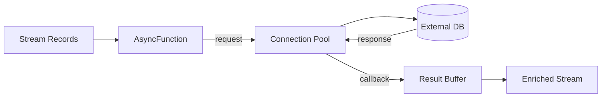

# Pattern: Async I/O Enrichment

> **Stage**: Knowledge | **Prerequisites**: [Stateful Computation](../pattern-stateful-computation.md) | **Formal Level**: L4-L5
>
> **Pattern ID**: 04/7 | **Complexity**: ★★★☆☆
>
> Resolves the core tension between external data lookup and stream processing latency via asynchronous non-blocking I/O for high-throughput, low-latency data enrichment.

---

## 1. Definitions

**Def-K-02-12: Async I/O Enrichment Pattern**

A stream processing pattern that enriches stream records by concurrently querying external data stores without blocking the main processing thread.

Let $\mathcal{R}$ be stream records, $\mathcal{S}$ external storage, enrichment function $f: \mathcal{R} \times \mathcal{S} \to \mathcal{R}'$:

$$
T_{\text{sync}} = |\mathcal{R}| \times (t_{\text{network}} + t_{\text{query}} + t_{\text{serialization}})
$$

$$
T_{\text{async}} \approx \frac{|\mathcal{R}| \times t_{\text{query}}}{\text{concurrency}} + t_{\text{network}}
$$

**Def-K-02-13: AsyncFunction Interface**

Flink's abstraction for async enrichment: `AsyncFunction` with `asyncInvoke()` and `timeout()` callbacks.

---

## 2. Properties

**Prop-K-02-08: Async Throughput Improvement**

With concurrency $C$, async I/O achieves up to $C\times$ throughput compared to synchronous I/O, bounded by external service capacity.

**Prop-K-02-09: Concurrency-Memory Trade-off**

Higher concurrency increases throughput but also increases in-flight request memory: $M_{\text{inflight}} = C \times \text{avg\_record\_size}$.

---

## 3. Relations

- **with Watermark**: Async results must preserve watermark monotonicity; out-of-order completion requires result buffering.
- **with Checkpoint**: In-flight async requests must be drained or checkpointed for exactly-once.

---

## 4. Argumentation

**Sync I/O Bottleneck**: A single synchronous database query at 10ms latency limits throughput to 100 records/second per thread. Async I/O with concurrency 100 raises this to 10,000 records/second.

**Order Preservation vs Unordered**: Ordered output waits for all prior requests; unordered output emits results as they complete, requiring larger buffers for reordering.

---

## 5. Engineering Argument

**Thm-K-02-02 (Async I/O Correctness)**: Async I/O enrichment produces the same enriched results as synchronous I/O, provided the external service is deterministic and requests are idempotent.

---

## 6. Examples

```java
// Flink AsyncDataStream
AsyncDataStream.unorderedWait(
    stream,
    new AsyncDatabaseRequest(),
    1000, // timeout ms
    TimeUnit.MILLISECONDS,
    100   // concurrency
);
```

---

## 7. Visualizations

**Async I/O Architecture**:



---

## 8. References
