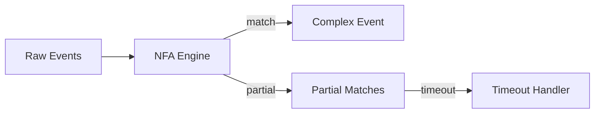

# Pattern: Complex Event Processing (CEP)

> **Stage**: Knowledge | **Prerequisites**: [Windowed Aggregation](../pattern-windowed-aggregation.md) | **Formal Level**: L4-L5
>
> **Pattern ID**: 03/7 | **Complexity**: ★★★★☆
>
> Solves the problem of real-time recognition and extraction of high-level business semantic events from low-level raw event streams via declarative pattern matching.

---

## 1. Definitions

**Def-K-02-09: Complex Event**

A high-level event extracted from raw event streams through pattern matching, defined as a 4-tuple $\langle E, P, T, C \rangle$ where $E$ = composite event type, $P$ = participating primitive events, $T$ = temporal constraints, $C$ = correlation conditions[^1].

**Def-K-02-10: Pattern**

A declarative specification of event sequences and conditions for complex event detection.

**Def-K-02-11: Pattern Matching**

The process of detecting pattern instances in event streams using NFA (Nondeterministic Finite Automaton) encoding.

---

## 2. Properties

**Prop-K-02-06: Pattern Matching Complexity Bound**

For a pattern with $k$ events and stream rate $R$, the worst-case state space is $O(R^k)$.

**Prop-K-02-07: Time Window Boundedness**

Patterns with explicit time windows $\Delta t$ limit match exploration to events within the window, reducing space to $O(R \cdot \Delta t)$.

---

## 3. Relations

- **with Event Time**: CEP relies on event-time ordering for correct temporal pattern detection.
- **with Stateful Computation**: NFA state must be maintained and checkpointed for fault tolerance.
- **with Async I/O**: Enrichment may be required before pattern matching.

---

## 4. Argumentation

**Raw Events vs Business Semantics Gap**: Primitive events (click, login, payment) lack business meaning in isolation. CEP bridges this gap by defining composite patterns (e.g., "suspicious sequence: login from new device + large transfer within 5 min").

---

## 5. Engineering Argument

**NFA Encoding Correctness**: Each pattern is compiled into an NFA where states represent pattern progression and transitions represent event matching. The NFA accepts exactly the event sequences satisfying the pattern[^2].

---

## 6. Examples

```java
// Flink CEP pattern definition
Pattern<Transaction, ?> pattern = Pattern.<Transaction>begin("start")
    .where(new SimpleCondition<Transaction>() {
        public boolean filter(Transaction t) {
            return t.getAmount() > 10000;
        }
    })
    .next("suspicious")
    .where(new SimpleCondition<Transaction>() {
        public boolean filter(Transaction t) {
            return t.getLocation() != t.getAccountLocation();
        }
    })
    .within(Time.minutes(5));

PatternStream<Transaction> patternStream = CEP.pattern(stream, pattern);
```

---

## 7. Visualizations

**CEP Pattern Matching Flow**:



---

## 8. References

[^1]: D. Luckham, *The Power of Events*, Addison-Wesley, 2002.
[^2]: Apache Flink Documentation, "FlinkCEP", 2025.
