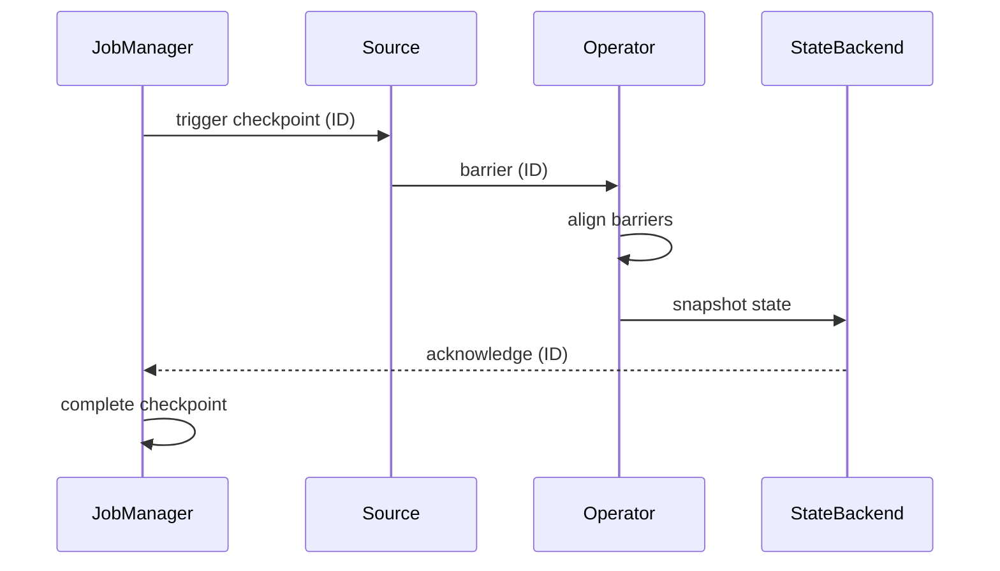

# Pattern: Checkpoint & Recovery

> **Stage**: Knowledge | **Prerequisites**: [State Backends](../flink-state-backends-deep-comparison.md) | **Formal Level**: L5
>
> **Pattern ID**: 07/7 | **Complexity**: ★★★★★
>
> Fault recovery and consistency guarantee via Checkpoint mechanism for Exactly-Once semantics in distributed stream processing.

---

## 1. Definitions

**Def-K-02-25: Checkpoint Mechanism**

Flink's distributed snapshot mechanism for periodically capturing globally consistent state to support fault recovery.

**Def-K-02-26: Checkpoint Barrier**

Special control record injected by JobManager to demarcate logical time for snapshot boundaries.

**Def-K-02-27: Barrier Alignment**

Buffering input records until all upstream barriers arrive, ensuring synchronous snapshot alignment.

**Def-K-02-28: Recovery Strategy**

The approach for restoring job state after failure: full restart, regional restart, or incremental recovery.

---

## 2. Properties

**Lemma-K-02-07: Barrier Propagation Monotonicity**

Barriers propagate monotonically downstream; once passed, they never retreat.

**Lemma-K-02-08: Alignment Window Boundedness**

Alignment duration is bounded by the slowest upstream channel's barrier arrival time.

**Prop-K-02-15: Async Snapshot Performance Advantage**

Asynchronous state materialization reduces checkpoint duration by overlapping snapshot I/O with record processing.

---

## 3. Relations

- **with Chandy-Lamport**: Flink checkpoint is an instance of the distributed snapshot algorithm.
- **with Exactly-Once**: Checkpoint + replayable source + transactional sink = end-to-end Exactly-Once.

---

## 4. Argumentation

**Alignment Mode Selection**:

| Mode | Latency Impact | Use Case |
|------|---------------|----------|
| Aligned | Head-of-line blocking | Small state, low latency |
| Unaligned | Larger snapshot | High throughput, backpressure |
| Partial | Minimal | Large jobs, regional failures |

---

## 5. Engineering Argument

**Checkpoint Consistency**: The global snapshot formed by aligned barriers captures exactly the state after processing all pre-barrier records and before processing any post-barrier records. This is a consistent cut of the distributed computation.

---

## 6. Examples

```java
// Checkpoint configuration
env.enableCheckpointing(60000);
env.getCheckpointConfig().setCheckpointingMode(
    CheckpointingMode.EXACTLY_ONCE);
env.getCheckpointConfig().setMinPauseBetweenCheckpoints(30000);
env.getCheckpointConfig().setMaxConcurrentCheckpoints(1);
env.getCheckpointConfig().enableExternalizedCheckpoints(
    ExternalizedCheckpointCleanup.RETAIN_ON_CANCELLATION);
```

---

## 7. Visualizations

**Checkpoint Mechanism Architecture**:



---

## 8. References
