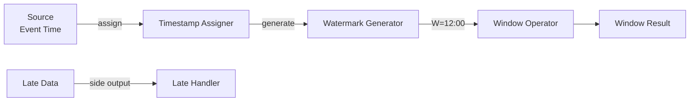

# Pattern: Event Time Processing

> **Stage**: Knowledge | **Prerequisites**: [Time Semantics](../flink-time-semantics-watermark.md) | **Formal Level**: L4-L5
>
> **Pattern ID**: 01/7 | **Complexity**: ★★★☆☆
>
> Resolves the core tension between out-of-order data, late arrivals, and deterministic results via Watermark-based progress tracking.

---

## 1. Definitions

**Def-K-02-16: Event Time**

A mapping from records to the time domain representing when events actually occurred:

$$
t_e: \text{Record} \to \mathbb{T}
$$

**Def-K-02-17: Watermark**

A progress marker asserting that no records with timestamp earlier than $W$ will arrive:

$$
\text{Watermark}(W) \implies \forall r \in \text{future}. \; t_e(r) \geq W
$$

**Def-K-02-18: Late Data**

Records with $t_e(r) < W$ when watermark $W$ has already advanced.

---

## 2. Properties

**Prop-K-02-10: Watermark Monotonic Propagation**

Watermarks are non-decreasing along all dataflow paths:

$$
\forall p. \; W_{in}(p) \leq W_{out}(p)
$$

**Prop-K-02-11: Late Data Handling Semantics**

With `allowedLateness = d`, records arriving within $[T_{window}, T_{window} + d]$ update previously emitted results.

---

## 3. Relations

- **with Window Aggregation**: Event time is the foundation for correct window triggering.
- **with CEP**: Temporal pattern matching requires event-time ordering.
- **with Checkpoint**: Watermark progress is checkpointed for deterministic recovery.

---

## 4. Argumentation

**Distributed Stream Temporal Challenges**:

- Clock skew across producers
- Network delay variation
- Out-of-order arrival due to routing

**Time Semantics Selection**:

| Semantics | Determinism | Latency | Use Case |
|-----------|-------------|---------|----------|
| Event Time | ✓ | Higher | Analytics, billing |
| Processing Time | ✗ | Lower | Monitoring, alerts |
| Ingestion Time | Partial | Medium | Log processing |

---

## 5. Engineering Argument

**Watermark Monotonicity Guarantee**: Flink's watermark generator ensures monotonicity per subtask. For multi-input operators, the output watermark is the minimum of input watermarks, preserving global monotonicity.

---

## 6. Examples

```java
// Watermark with idle source handling
WatermarkStrategy<MyEvent> strategy = WatermarkStrategy
    .<MyEvent>forBoundedOutOfOrderness(Duration.ofSeconds(5))
    .withTimestampAssigner((event, ts) -> event.getEventTime())
    .withIdleness(Duration.ofMinutes(1));
```

---

## 7. Visualizations

**Event Time Processing Architecture**:



---

## 8. References
