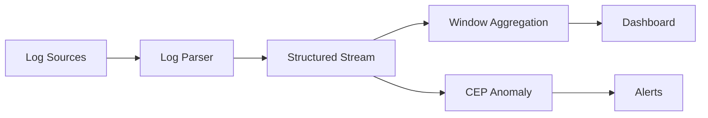

# Pattern: Real-Time Log Analysis

> **Stage**: Knowledge | **Prerequisites**: [Event Time Processing](../pattern-event-time-processing.md) | **Formal Level**: L4
>
> **Pattern ID**: 06/7 | **Complexity**: ★★★☆☆
>
> Solves real-time parsing, structuring, correlation analysis, and anomaly detection for heterogeneous log streams.

---

## 1. Definitions

**Def-K-02-19: Log Stream**

A sequence of timestamped text records from distributed system components:

$$
\mathcal{L} = \langle l_1, l_2, \ldots, l_n \rangle, \quad \forall i: l_i = (t_i, s_i, m_i, \rho_i)
$$

where $t_i$ = timestamp, $s_i$ = source, $m_i$ = message, $\rho_i$ = metadata.

**Def-K-02-20: Log Structuring**

Transformation from unstructured text to typed schema via parsing rules.

**Def-K-02-21: Log Correlation**

Joining related log entries via shared identifiers (trace ID, session ID, user ID).

---

## 2. Properties

**Prop-K-02-12: Parsing Completeness**

A log parser is complete if it successfully parses all log entries matching its grammar, with fallback for unknown formats.

**Prop-K-02-13: Correlation Transitivity**

If log $l_1$ correlates with $l_2$ via trace ID, and $l_2$ correlates with $l_3$, then $l_1$ and $l_3$ are transitively correlated.

---

## 3. Relations

- **with Windowed Aggregation**: Log metrics are computed via time windows.
- **with CEP**: Anomaly patterns are detected via complex event pattern matching.

---

## 4. Argumentation

**Parsing Strategy Matrix**:

| Format | Parser | Example |
|--------|--------|---------|
| JSON | Native | Structured application logs |
| Regex | Custom | Legacy syslog formats |
| Grok | Predefined | Apache/Nginx access logs |
| CSV | Native | Metric exports |

---

## 5. Engineering Argument

**Thm-K-02-02 (Log Correlation Completeness)**: Log correlation is complete if and only if all correlated events share a common identifier and the identifier propagation is lossless across service boundaries.

---

## 6. Examples

```java
// Trace ID correlation
stream.filter(evt -> evt.getTraceId() != null)
    .keyBy(LogEvent::getTraceId)
    .window(EventTimeSessionWindows.withDynamicGap(
        (element) -> Time.minutes(5)))
    .aggregate(new TraceAggregate());
```

---

## 7. Visualizations

**Log Analysis Architecture**:



---

## 8. References
