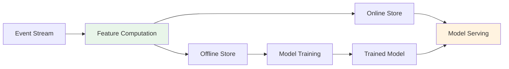

# Pattern: Real-time Feature Engineering

> **Stage**: Knowledge/02-design-patterns | **Prerequisites**: [Streaming Models Mindmap](streaming-models-mindmap.md) | **Formalization Level**: L4
> **Translation Date**: 2026-04-21

## Abstract

Real-time feature engineering transforms raw event streams into machine learning features with low latency. This pattern formalizes feature freshness, windowed aggregations, and feature store integration for production ML pipelines.

---

## 1. Definitions

### Def-K-02-10 (Feature Freshness)

**Feature freshness** $\mathcal{F}$ is the maximum allowed time deviation between feature computation and current time:

$$\mathcal{F}(f, t) = t - \tau_{\text{computed}}(f)$$

| Level | Latency | Use Case |
|-------|---------|----------|
| Real-time | $< 1s$ | High-frequency trading, real-time recommendations |
| Near-real-time | $1s \leq \mathcal{F} < 60s$ | Content recommendations, ad targeting |
| Quasi-real-time | $60s \leq \mathcal{F} < 5min$ | Risk control, user profiling |
| Batch | $\geq 5min$ | Offline analysis, reporting |

### Def-K-02-11 (Windowed Feature Aggregation)

**Windowed feature aggregation** applies aggregate operations over bounded time windows:

$$\text{Agg}(\mathcal{S}, \mathcal{W}, \oplus) = \{ \oplus \{ e \mid e \in \mathcal{S} \land \tau(e) \in \mathcal{W}_i \} \}_{i \in \mathcal{I}}$$

where $\mathcal{W} = \{\mathcal{W}_i\}$ is a window sequence and $\oplus$ is an aggregate operator.

**Window semantics**:
- **Tumbling**: $\mathcal{W}_i = [i \cdot L, (i+1) \cdot L)$, no overlap
- **Sliding**: $\mathcal{W}_i = [i \cdot S, i \cdot S + L)$, overlap $\rho = 1 - S/L$
- **Session**: $\mathcal{W}_i$ dynamically split by inactivity gap $g$

### Def-K-02-12 (Feature Store)

A **feature store** is a dual-mode feature management subsystem:

$$\mathcal{FS} = \langle \mathcal{O}, \mathcal{R}, \mathcal{M}, \mathcal{G} \rangle$$

where:
- $\mathcal{O}$: online serving layer (low-latency point lookups)
- $\mathcal{R}$: offline storage layer (batch training data)
- $\mathcal{M}$: metadata registry (feature definitions, lineage)
- $\mathcal{G}$: governance layer (access control, quality monitoring)

---

## 2. Properties

### Prop-K-02-06 (Feature Consistency)

Online and offline features for the same entity must be consistent:

$$\forall f \in \mathcal{FS}: \mathcal{O}(f, e) \approx \mathcal{R}(f, e) \text{ within tolerance } \epsilon$$

### Prop-K-02-07 (Freshness-Accuracy Trade-off)

Higher freshness (lower latency) generally implies lower accuracy due to incomplete data:

$$\text{Accuracy}(\mathcal{F}) \propto \frac{1}{\mathcal{F}} \text{ (for windowed aggregations)}$$

---

## 3. Architecture



**Feature pipeline**: Raw events → computed features → dual storage → model serving/training.

---

## 4. Implementation

### 4.1 Flink Feature Computation

```java
// Real-time feature: user click count in 5-minute window
DataStream<Feature> features = clickStream
    .keyBy(ClickEvent::getUserId)
    .window(TumblingEventTimeWindows.of(Time.minutes(5)))
    .aggregate(new ClickCountAggregate())
    .map(count -> new Feature("user_click_count_5m", count));
```

### 4.2 Feature Store Write

```java
// Write to online store (Redis) and offline store (Hive/Iceberg)
features.addSink(new RedisFeatureSink());
features.addSink(new IcebergFeatureSink());
```

---

## 5. References

[^1]: M. Zheng et al., "Feature Store: A Data Management System for Machine Learning", CIDR, 2022.
[^2]: Uber Engineering, "Michelangelo Palette: A Feature Store for ML", 2020.
[^3]: T. Akidau et al., "The Dataflow Model", PVLDB, 2015.
