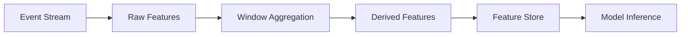

# Pattern: Real-Time Feature Engineering

> **Stage**: Knowledge | **Prerequisites**: [Windowed Aggregation](../pattern-windowed-aggregation.md) | **Formal Level**: L4
>
> Real-time feature computation from streaming events with freshness guarantees, windowed aggregations, and feature store integration.

---

## 1. Definitions

**Def-K-02-22: Feature Freshness**

Maximum allowable time deviation between feature computation and current time:

$$
\mathcal{F}(f, t) = t - \tau_{\text{computed}}(f)
$$

| Level | Latency | Use Case |
|-------|---------|----------|
| Real-time | < 1s | High-frequency trading, real-time recommendation |
| Near-real-time | 1s - 60s | Content recommendation, ad targeting |
| Quasi-real-time | 60s - 5min | Risk control, user profiling |
| Batch | > 5min | Offline analysis, reporting |

**Def-K-02-23: Windowed Feature Aggregation**

Aggregation transformation over bounded time windows:

$$
\text{Agg}(\mathcal{S}, \mathcal{W}, \oplus) = \{ \oplus \{ e \mid e \in \mathcal{S} \land \tau(e) \in \mathcal{W}_i \} \}_{i \in \mathcal{I}}
$$

**Def-K-02-24: Feature Store**

Dual-mode feature management subsystem:

$$
\mathcal{FS} = \langle \mathcal{O}, \mathcal{R}, \mathcal{M}, \mathcal{G} \rangle
$$

where $\mathcal{O}$ = offline storage, $\mathcal{R}$ = online KV, $\mathcal{M}$ = metadata, $\mathcal{G}$ = governance.

---

## 2. Properties

**Prop-K-02-14: Online-Offline Consistency**

Online and offline features must satisfy:

$$
\mathbb{E}[f_{\text{online}}] = \mathbb{E}[f_{\text{offline}}] \quad \land \quad |f_{\text{online}} - f_{\text{offline}}| < \epsilon
$$

---

## 3. Relations

- **with Windowed Aggregation**: Features are computed via tumbling/sliding/session windows.
- **with Async I/O**: Feature store lookups use async I/O for low latency.

---

## 4. Argumentation

**Feature Computation Layers**:

| Layer | Freshness | Computation | Examples |
|-------|-----------|-------------|----------|
| Raw | < 1s | Stream | Click, impression |
| Derived | < 10s | Window | CTR (1min), conversion rate |
| Aggregate | < 1min | Stateful | User 7-day spend |
| Model | < 5min | Batch | Embedding vectors |

---

## 5. Engineering Argument

**Latency Upper Bound**: For real-time features with freshness < 1s:

- Event ingestion (Kafka): ~5ms
- Feature computation (Flink): ~50ms
- Feature store write (Redis): ~5ms
- Total: < 100ms << 1s requirement

---

## 6. Examples

```java
// Real-time feature: user 5-minute click count
stream.keyBy(Event::getUserId)
    .window(SlidingEventTimeWindows.of(Time.minutes(5), Time.minutes(1)))
    .aggregate(new CountAggregate())
    .addSink(new FeatureStoreSink("user_click_count_5m"));
```

---

## 7. Visualizations

**Feature Engineering Pipeline**:



---

## 8. References
