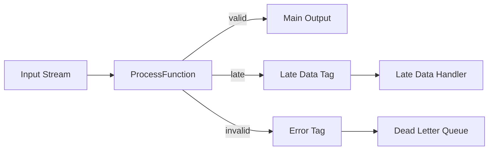

# Pattern: Side Output

> **Stage**: Knowledge | **Prerequisites**: [Windowed Aggregation](../pattern-windowed-aggregation.md) | **Formal Level**: L4
>
> **Pattern ID**: 06/7 | **Complexity**: ★★☆☆☆
>
> Solves multi-route output, exception data diversion, and late data handling via explicit OutputTag mechanism for separating main and side data streams.

---

## 1. Definitions

**Def-K-02-14: Side Output Stream**

An auxiliary output channel alongside the main data stream, defined as a tagged output stream collection:

$$
\text{SideOutput} = \{ (tag_i, \text{Stream}(T_i)) \mid tag_i \in \text{OutputTag}, \; T_i \in \text{Types} \}_{i=1}^{n}
$$

**Def-K-02-15: OutputTag**

A typed identifier for side output streams, ensuring compile-time type safety.

---

## 2. Properties

**Lemma-K-02-04: Side Output Watermark Inheritance**

Side output streams inherit the watermark from their parent stream, ensuring consistent temporal progression.

**Lemma-K-02-05: Main/Side Stream Temporal Consistency**

Records emitted to side output maintain their original event timestamps and ordering relative to the main stream.

---

## 3. Relations

- **with Late Data Handling**: Side output is the standard mechanism for diverting late-arriving records.
- **with Exception Handling**: Invalid records can be routed to side output for separate processing.

---

## 4. Argumentation

**Side Output vs Filter Anti-pattern**:

| Aspect | Side Output | Filter |
|--------|-------------|--------|
| Multi-route | Native | Requires branch |
| Late data | Supported | Lost |
| Type safety | Compile-time | Runtime |
| Watermark | Inherited | Independent |

---

## 5. Engineering Argument

**Prop-K-02-03 (Multi-route Dispatch Correctness)**: Side output correctly partitions the input stream into disjoint substreams because each record is tested against deterministic predicates and routed to exactly one output.

---

## 6. Examples

```java
// Side output for late data
OutputTag<Event> lateOutputTag = new OutputTag<Event>("late-data"){ };

SingleOutputStreamOperator<Result> mainResult = stream
    .keyBy(Event::getUserId)
    .window(TumblingEventTimeWindows.of(Time.minutes(5)))
    .allowedLateness(Time.seconds(30))
    .sideOutputLateData(lateOutputTag)
    .aggregate(new CountAggregate());

DataStream<Event> lateStream = mainResult.getSideOutput(lateOutputTag);
```

---

## 7. Visualizations

**Side Output Architecture**:



---

## 8. References
