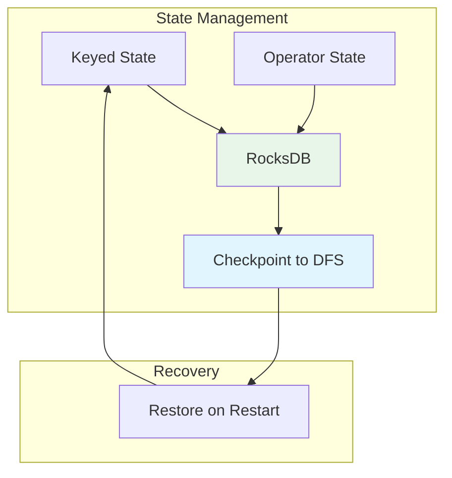

# Pattern: Stateful Computation

> **Stage**: Knowledge/02-design-patterns | **Prerequisites**: [State Management Concepts](state-management-concepts.md) | **Formalization Level**: L4-L5
> **Translation Date**: 2026-04-21

## Abstract

Stateful computation is the foundation of advanced stream processing. This pattern addresses the core tensions between state consistency, fault tolerance, and large-scale state management in distributed systems.

---

## 1. Definitions

### Def-K-02-04 (Operator State)

**Operator state** is bound to operator instances, shared across parallel subtasks:

$$\text{OperatorState}: \text{Op} \to 2^{(K \times V)}$$

Use cases: Source offsets, Sink transaction metadata.

### Def-K-02-05 (Keyed State)

**Keyed state** is partitioned by data key:

$$\text{KeyedState}: K \to V$$

Use cases: Per-user aggregations, session state, keyed counters.

### Def-K-02-06 (State Backend)

The **state backend** provides persistence abstraction:

$$\text{StateBackend} = \langle \text{Store}, \text{Snap}, \text{Restore} \rangle$$

Implementations: MemoryStateBackend, FsStateBackend, RocksDBStateBackend.

### Def-K-02-07 (State TTL)

**Time-to-live** automatically expires state:

$$\text{TTL}: \text{StateEntry} \times \mathbb{T} \to \{\text{Valid}, \text{Expired}\}$$

Cleanup strategies: full snapshot filter, incremental cleanup, RocksDB compaction filter.

### Def-K-02-08 (Queryable State)

**Queryable state** allows external reads of operator state:

$$\text{Query}: \text{StateKey} \times \text{QueryPredicate} \to \text{StateValue}$$

---

## 2. Properties

### Prop-K-02-03 (State Partition Determinism)

For keyed state, records with the same key always access the same state partition:

$$\forall r_1, r_2: \text{key}(r_1) = \text{key}(r_2) \Rightarrow \text{partition}(r_1) = \text{partition}(r_2)$$

### Prop-K-02-04 (TTL Validity Boundary)

Expired state is never returned in queries:

$$\text{TTL}(s) = \text{Expired} \Rightarrow \nexists q: \text{Query}(q) = s$$

### Prop-K-02-05 (State Backend Latency)

| Backend | Read Latency | Write Latency | Capacity |
|---------|-------------|--------------|----------|
| Memory | ~100ns | ~100ns | Limited by heap |
| RocksDB | ~1-10μs | ~10-100μs | Disk size |
| Remote (e.g., Redis) | ~1ms | ~1ms | External limit |

---

## 3. Relations

### Relation to Event Time Processing

Stateful operators in event time must handle out-of-order data. Watermark progress triggers state expiration and window completion.

### Relation to Window Aggregation

Windowed aggregations are a specialization of keyed state: each window is a key, the aggregate is the value.

### Relation to Checkpointing

Checkpointing captures consistent snapshots of all state. Recovery restores state to the checkpointed version.

---

## 4. Engineering Argument

### 4.1 State Backend Selection

```
Is state size < JVM heap?
├── YES → MemoryStateBackend (fastest, dev only)
└── NO  → Is state size < 100GB and latency sensitive?
          ├── YES → FsStateBackend
          └── NO  → RocksDBStateBackend (production default)
```

### 4.2 State Size Estimation

$$\text{StateSize} = \text{KeyCount} \times (\text{KeySize} + \text{ValueSize} + \text{Overhead})$$

RocksDB overhead: ~50 bytes per key-value pair (index, metadata).

---

## 5. Examples

### 5.1 Keyed State Basic Usage

```java
ValueStateDescriptor<Long> sumState = 
    new ValueStateDescriptor<>("sum", Types.LONG);

public void processElement(Event event, Context ctx, Collector<Result> out) {
    Long current = sumState.value();
    if (current == null) current = 0L;
    sumState.update(current + event.getValue());
}
```

### 5.2 State TTL Configuration

```java
StateTtlConfig ttlConfig = StateTtlConfig
    .newBuilder(Time.hours(24))
    .setUpdateType(OnCreateAndWrite)
    .setStateVisibility(NeverReturnExpired)
    .cleanupIncrementally(10, true)
    .build();

descriptor.enableTimeToLive(ttlConfig);
```

---

## 6. Visualizations



---

## 7. References

[^1]: Apache Flink Documentation, "State Backends", 2025.
[^2]: Apache Flink Documentation, "Queryable State", 2025.
[^3]: F. Hueske et al., "Stream Processing with Apache Flink", O'Reilly, 2019.
[^4]: RocksDB Documentation, "RocksDB Tuning Guide", Meta, 2025.
