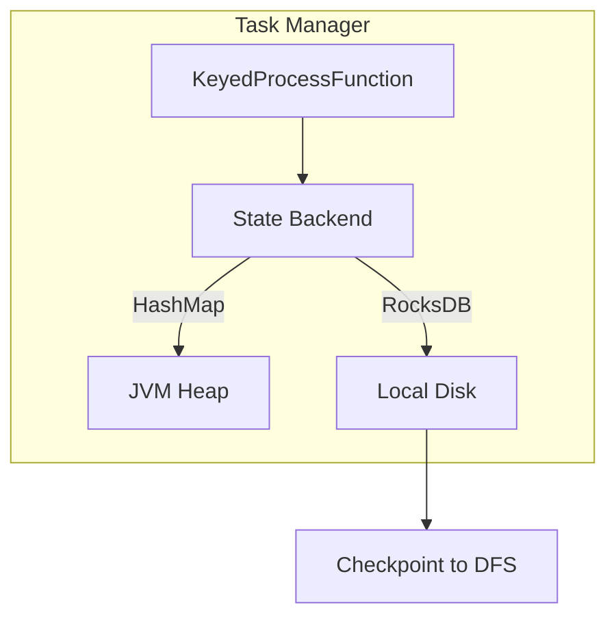

# Pattern: Stateful Computation

> **Stage**: Knowledge | **Prerequisites**: [Checkpoint Mechanism](../flink-state-management-complete-guide.md) | **Formal Level**: L4-L5
>
> **Pattern ID**: 05/7 | **Complexity**: ★★★★☆
>
> Addresses the core tension between state consistency, fault recovery, and large-scale state management in distributed stream processing.

---

## 1. Definitions

**Def-K-02-04: Operator State**

Global state bound to operator instance, shared by all records in the stream[^1].

**Def-K-02-05: Keyed State**

Partitioned state scoped to a specific key, enabling independent per-key operations and checkpointing.

**Def-K-02-06: State Backend**

Pluggable storage layer for keyed/operator state. Primary implementations: HashMapStateBackend (heap) and RocksDBStateBackend (embedded KV).

**Def-K-02-07: State TTL**

Time-to-live mechanism for automatic state expiration, preventing unbounded state growth.

---

## 2. Properties

**Prop-K-02-03: State Partitioning Determinism**

For keyed state, the same key is always routed to the same parallel subtask:

$$
\forall k. \; \text{partition}(k) = \text{hash}(k) \bmod \text{parallelism}
$$

**Prop-K-02-04: TTL Validity Boundary**

State accessed after TTL expiration returns default value (null or configured cleanup):

$$
\forall s. \; \text{now} - \text{lastAccess}(s) > \text{TTL} \implies \text{read}(s) = \bot
$$

---

## 3. Relations

- **with Event Time**: State expiry can be aligned with watermark progression.
- **with Window Aggregation**: Window buffers are a specialized form of keyed state.
- **with Checkpoint**: State backends provide the snapshot mechanism for checkpoint persistence.

---

## 4. Argumentation

**State Backend Selection**:

| Factor | HashMap | RocksDB |
|--------|---------|---------|
| Latency | ~μs | ~ms |
| Capacity | Heap limited | Disk-backed (TB+) |
| Incremental checkpoint | No | Yes |
| SSD required | No | Recommended |

---

## 5. Engineering Argument

**Keyed State Local Determinism**: Within a single subtask, keyed state operations are deterministic because each key maps to a single state entry. This enables efficient incremental checkpointing at key-group granularity.

---

## 6. Examples

```java
// Keyed state with ValueState
class CountFunction extends KeyedProcessFunction<String, Event, Result> {
    private ValueState<Long> countState;

    @Override
    public void open(Configuration params) {
        StateTtlConfig ttl = StateTtlConfig
            .newBuilder(Time.hours(24))
            .setUpdateType(OnCreateAndWrite)
            .build();
        ValueStateDescriptor<Long> descriptor =
            new ValueStateDescriptor<>("count", Types.LONG);
        descriptor.enableTimeToLive(ttl);
        countState = getRuntimeContext().getState(descriptor);
    }

    @Override
    public void processElement(Event value, Context ctx, Collector<Result> out) throws Exception {
        Long current = countState.value();
        if (current == null) current = 0L;
        current += 1;
        countState.update(current);
        out.collect(new Result(value.getKey(), current));
    }
}
```

---

## 7. Visualizations

**State Management Architecture**:



---

## 8. References

[^1]: Apache Flink Documentation, "State Backends", 2025.
