# Pattern: Windowed Aggregation

> **Stage**: Knowledge | **Prerequisites**: [Time Semantics](../flink-time-semantics-watermark.md) | **Formal Level**: L4
>
> **Pattern ID**: 02/7 | **Complexity**: ★★☆☆☆
>
> Splits unbounded data streams into finite time buckets for aggregation, resolving the tension between batch semantics and streaming computation.

---

## 1. Definitions

**Def-K-02-01: Window Assigner**

A function mapping each stream record to a set of time windows:

$$
\text{Assigner}: \mathcal{D} \times \mathbb{T} \to \mathcal{P}(\text{WindowID})
$$

**Def-K-02-02: Window Types**

| Type | Behavior | Use Case |
|------|----------|----------|
| Tumbling | Fixed, non-overlapping | Periodic metrics |
| Sliding | Fixed, overlapping | Moving averages |
| Session | Dynamic, gap-based | User activity |
| Global | Single, all-data | Global top-N |

**Def-K-02-03: Trigger**

Determines when a window's results are emitted. Default: watermark passes window end.

---

## 2. Properties

**Prop-K-02-01: Time Coverage Completeness**

For tumbling windows of size $T$, every record belongs to exactly one window:

$$
\forall r. \; |\{ w \mid r \in w \}| = 1
$$

**Prop-K-02-02: Window Assignment Determinism**

Given the same assigner and timestamp, the same record is always assigned to the same window IDs.

---

## 3. Relations

- **with Watermark**: Window trigger depends on watermark progression for event-time windows.
- **with Stateful Computation**: Window state must be checkpointed for fault tolerance.

---

## 4. Argumentation

**Window Type Selection Matrix**:

| Requirement | Tumbling | Sliding | Session |
|-------------|----------|---------|---------|
| Fixed intervals | ✓ | ✓ | ✗ |
| Overlap needed | ✗ | ✓ | ✗ |
| Activity-based | ✗ | ✗ | ✓ |
| State efficiency | ✓ | ✗ | ✗ |

---

## 5. Engineering Argument

**Thm-K-02-01 (Correctness Condition)**: Windowed aggregation produces correct results if and only if the assigner is total, the trigger is sound (emits after all data), and the aggregate function is associative.

---

## 6. Examples

```java
// Tumbling window aggregation
stream.keyBy(Event::getUserId)
    .window(TumblingEventTimeWindows.of(Time.minutes(5)))
    .aggregate(new AverageAggregate());

// Sliding window
stream.keyBy(Event::getUserId)
    .window(SlidingEventTimeWindows.of(Time.hours(1), Time.minutes(10)))
    .aggregate(new CountAggregate());
```

---

## 7. Visualizations

**Window Types Comparison**:

```mermaid
gantt
    title Window Types
    dateFormat X
    axisFormat %s
    section Tumbling
    Window 1 : 0, 5
    Window 2 : 5, 10
    section Sliding
    Slide 1 : 0, 5
    Slide 2 : 2, 7
    Slide 3 : 4, 9
    section Session
    Session A : 0, 3
    Session B : 7, 10
```



---

## 8. References
