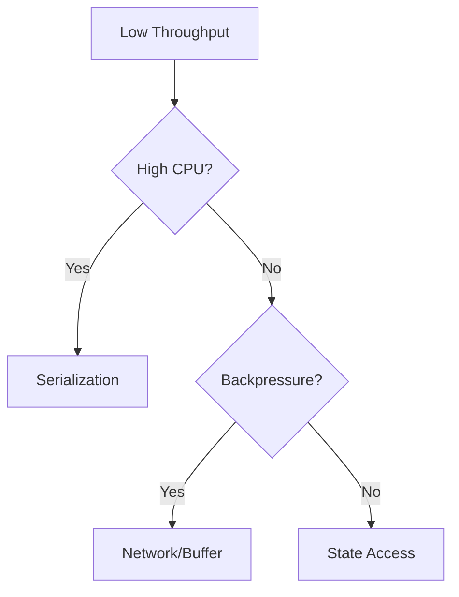

# Performance Tuning Patterns

> **Stage**: Knowledge/07-best-practices | **Prerequisites**: [Anti-Patterns](../09-anti-patterns/anti-pattern-06-serialization-overhead.md) | **Formal Level**: L3
>
> Systematic performance optimization patterns for Flink jobs: serialization, network, state access, and JVM tuning.

---

## 1. Definitions

**Def-K-07-02: Performance Tuning Pattern**

Reusable optimization solution for common streaming performance bottlenecks.

**Key Performance Indicators**:

| Metric | Definition | Optimization Goal |
|--------|------------|-------------------|
| Throughput | Records processed per second | Maximize |
| Latency | Input to output time | Minimize |
| Backpressure | Upstream blocking time | Minimize |
| Checkpoint duration | Snapshot time | Minimize |
| CPU utilization | Effective compute ratio | Maximize |

**Bottleneck Categories**:
- Compute: Serialization, deserialization, business logic
- Network: Buffer exhaustion, credit starvation
- Storage: State access latency, checkpoint I/O
- JVM: GC pauses, heap pressure

---

## 2. Properties

**Prop-K-07-01: Serialization Dominance**

For complex records, serialization often consumes > 50% of CPU time.

**Prop-K-07-02: State Access Locality**

Keyed state access exhibits temporal locality; recently accessed keys are likely to be accessed again.

---

## 3. Relations

- **with Anti-Patterns**: Tuning patterns address specific anti-patterns.
- **with State Backends**: State access patterns depend on backend choice.

---

## 4. Argumentation

**Serialization Optimization**:

| Serializer | Speed | Schema | Best For |
|------------|-------|--------|----------|
| Kryo | Fast | Dynamic | POJOs |
| Avro | Medium | Explicit | Schema evolution |
| Protobuf | Fast | Explicit | Cross-language |
| POJO | Fastest | Java-only | Simple types |

**State Access Optimization**:
- Use ValueState instead of ListState for single values
- Enable state backend cache (RocksDB block cache)
- Batch state updates where possible

---

## 5. Engineering Argument

**Optimization Impact Hierarchy**:

1. Serialization (often 2-10x improvement)
2. Parallelism tuning (2-5x)
3. State backend selection (1.5-3x)
4. JVM tuning (1.2-2x)

---

## 6. Examples

```java
// Serialization optimization: use POJO or Avro
env.getConfig().registerTypeWithKryoSerializer(MyEvent.class, MyEventSerializer.class);

// State access optimization: batch updates
ListStateUpdateMode updateMode = ListStateUpdateMode.BATCH;
```

---

## 7. Visualizations

**Performance Tuning Decision Tree**:


---

## 8. References

[^1]: Apache Flink Documentation, "Performance Tuning", 2025.
[^2]: Netflix Tech Blog, "Flink Performance Optimization", 2023.
