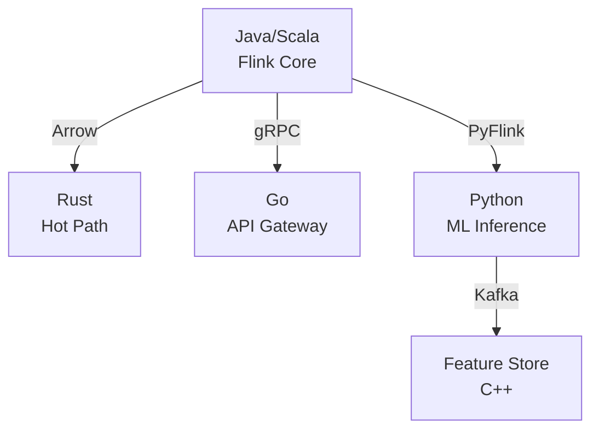

# Polyglot Stream Processing Architecture

> **Stage**: Knowledge | **Prerequisites**: [Knowledge Index](../00-INDEX.md) | **Formal Level**: L4
>
> Multi-language stream processing: Java/Scala for big data frameworks, Rust for performance-critical compute, Python for ML inference, Go for API services.

---

## 1. Definitions

**Def-K-02-29: Polyglot Stream Processing System**

A system using multiple programming languages for different components:

$$
\mathcal{P} = \langle \mathcal{L}, \mathcal{C}, \mathcal{D}, \mathcal{O} \rangle
$$

where $\mathcal{L}$ = languages, $\mathcal{C}$ = components, $\mathcal{D}$ = data flow, $\mathcal{O}$ = orchestration.

**Def-K-02-30: Language Boundary**

Interaction interface between components with different languages:

$$
\mathcal{B}(C_i, C_j) = \langle \mathcal{I}_{ij}, \mathcal{S}_{ij}, \mathcal{T}_{ij} \rangle
$$

where $\mathcal{I}$ = interop mechanism (JNI/gRPC/Arrow), $\mathcal{S}$ = serialization, $\mathcal{T}$ = transport.

**Def-K-02-31: Boundary Overhead**

$$
\mathcal{O}_b(C_i, C_j) = T_{serial} + T_{transfer} + T_{deserial} + T_{context}
$$

---

## 2. Properties

**Prop-K-02-16: Language Selection Trade-off**

For each component $C_i$, language choice is a multi-objective optimization:

$$
\mathcal{F}(L, C_i) = \langle f_{perf}(L), f_{prod}(L), f_{eco}(L), f_{team}(L) \rangle
$$

---

## 3. Relations

- **with Flink**: Flink's Java/Scala core with Python PyFlink for ML integration.
- **with Rust Native**: RisingWave and Arroyo use Rust for performance-critical paths.

---

## 4. Argumentation

**Language Selection Matrix**:

| Component | Language | Rationale |
|-----------|----------|-----------|
| Stream Engine | Java/Scala | Ecosystem, GC, maturity |
| Hot Path | Rust | Zero-cost, memory safety |
| ML Inference | Python | Frameworks (PyTorch, TF) |
| API Gateway | Go | Concurrency, fast build |
| Feature Store | C++ | Latency-critical KV |

**Interop Mechanisms**:

| Mechanism | Latency | Complexity | Use Case |
|-----------|---------|------------|----------|
| JNI | Low | High | In-process |
| gRPC | Medium | Medium | Cross-service |
| Arrow Flight | Low | Medium | Data exchange |
| Kafka | Higher | Low | Decoupled |

---

## 5. Engineering Argument

**Boundary Overhead Minimization**: Minimize cross-language calls on hot paths. Batch data exchange via Arrow buffers to amortize serialization cost.

---

## 6. Examples

```python
# PyFlink + Python UDF for ML inference
from pyflink.datastream import StreamExecutionEnvironment
from pyflink.table import StreamTableEnvironment

env = StreamExecutionEnvironment.get_execution_environment()
t_env = StreamTableEnvironment.create(env)

# Python UDF for model inference
@udf(result_type=DataTypes.FLOAT())
def predict(features: List[float]) -> float:
    return model.predict(features)
```

---

## 7. Visualizations

**Polyglot Architecture**:



---

## 8. References
