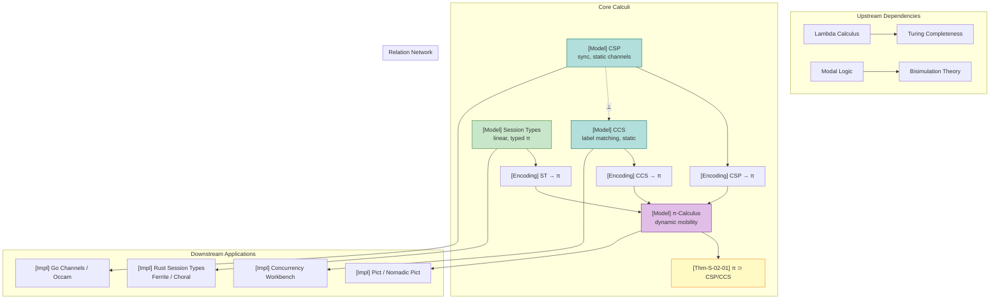

# Process Calculus Primer

> **Stage**: Struct | **Prerequisites**: [AGENTS.md](../../AGENTS.md) | **Formalization Level**: L3-L4

## Table of Contents

- [Process Calculus Primer](#process-calculus-primer)
  - [Table of Contents](#table-of-contents)
  - [1. Definitions](#1-definitions)
    - [Def-S-02-01. CCS (Calculus of Communicating Systems)](#def-s-02-01-ccs-calculus-of-communicating-systems)
    - [Def-S-02-02. CSP (Communicating Sequential Processes)](#def-s-02-02-csp-communicating-sequential-processes)
    - [Def-S-02-03. π-Calculus](#def-s-02-03-π-calculus)
    - [Def-S-02-04. Binary Session Types](#def-s-02-04-binary-session-types)
  - [2. Properties](#2-properties)
    - [Lemma-S-02-01. Static Channel Model Topology Invariance](#lemma-s-02-01-static-channel-model-topology-invariance)
    - [Lemma-S-02-02. Dynamic Channel Calculus Turing Completeness](#lemma-s-02-02-dynamic-channel-calculus-turing-completeness)
    - [Prop-S-02-01. Duality Implies Communication Compatibility](#prop-s-02-01-duality-implies-communication-compatibility)
    - [Prop-S-02-02. Finite-Control Static Calculus Decidability](#prop-s-02-02-finite-control-static-calculus-decidability)
  - [3. Relations](#3-relations)
    - [Relation 1: CSP $\\perp$ CCS (Semantically Incomparable)](#relation-1-csp-perp-ccs-semantically-incomparable)
    - [Relation 2: CCS $\\subset$ π-Calculus (Strict Inclusion)](#relation-2-ccs-subset-π-calculus-strict-inclusion)
    - [Relation 3: CSP $\\subset$ π-Calculus (Weaker Expressiveness)](#relation-3-csp-subset-π-calculus-weaker-expressiveness)
    - [Relation 4: Session Types $\\subset$ π-Calculus (Typed Subset)](#relation-4-session-types-subset-π-calculus-typed-subset)
  - [4. Argumentation](#4-argumentation)
    - [Argument 1: Why CSP and CCS Are Semantically Incomparable](#argument-1-why-csp-and-ccs-are-semantically-incomparable)
    - [Argument 2: Why Dynamic Channels Strictly Enhance Expressiveness](#argument-2-why-dynamic-channels-strictly-enhance-expressiveness)
    - [Argument 3: Session Types as a Disciplined Subset of π-Calculus](#argument-3-session-types-as-a-disciplined-subset-of-π-calculus)
  - [5. Proofs](#5-proofs)
    - [Thm-S-02-01. Dynamic Channel Calculus Strictly Contains Static Channel Calculus](#thm-s-02-01-dynamic-channel-calculus-strictly-contains-static-channel-calculus)
    - [Cor-S-02-01. Well-Typed Session Processes Are Deadlock-Free](#cor-s-02-01-well-typed-session-processes-are-deadlock-free)
  - [6. Examples](#6-examples)
    - [Example 1: Dynamic Topology Change in π-Calculus](#example-1-dynamic-topology-change-in-π-calculus)
    - [Example 2: CSP Synchronous Handshake](#example-2-csp-synchronous-handshake)
    - [Example 3: Binary Session Type Protocol](#example-3-binary-session-type-protocol)
    - [Counterexample 1: Violating Session Type Protocol Leads to Deadlock](#counterexample-1-violating-session-type-protocol-leads-to-deadlock)
    - [Counterexample 2: π-Mobility Encoding Failure in CSP](#counterexample-2-π-mobility-encoding-failure-in-csp)
  - [7. Visualizations](#7-visualizations)
  - [8. References](#8-references)

## 1. Definitions

### Def-S-02-01. CCS (Calculus of Communicating Systems)

CCS, proposed by Milner in 1980, is a process algebra based on labeled synchronization, establishing the syntactic and semantic foundation for the subsequent development of the π-calculus [^1].

**Syntax**:

$$
\begin{aligned}
P, Q ::= &\ 0 \quad \text{(null process / termination)} \\
       |\ &\ \alpha.P \quad \text{(prefix, $\alpha \in \mathcal{A} = \mathcal{N} \cup \bar{\mathcal{N}} \cup \{\tau\}$)} \\
       |\ &\ P + Q \quad \text{(nondeterministic choice)} \\
       |\ &\ P \mid Q \quad \text{(parallel composition)} \\
       |\ &\ P \setminus L \quad \text{(restriction / hiding, $L \subseteq \mathcal{N}$)} \\
       |\ &\ P[f] \quad \text{(relabelling, $f: \mathcal{A} \to \mathcal{A}$)} \\
       |\ &\ \mu X.P \quad \text{(recursion)}
\end{aligned}
$$

where $\mathcal{N}$ is a countably infinite set of names, $\bar{\mathcal{N}} = \{\bar{a} \mid a \in \mathcal{N}\}$ is its co-name set, and $\tau$ is the internal unobservable action.

**Structural Operational Semantics (SOS)**:

```
                α.P ──α──► P                        [Act]

        P ──α──► P'                                   [Sum-L]
        ─────────────────
        P + Q ──α──► P'

        Q ──α──► Q'                                   [Sum-R]
        ─────────────────
        P + Q ──α──► Q'

        P ──α──► P'                                   [Par-L]
        ─────────────────
        P | Q ──α──► P' | Q

        Q ──α──► Q'                                   [Par-R]
        ─────────────────
        P | Q ──α──► P | Q'

        P ──a──► P'     Q ──ā──► Q'                   [Com]
        ────────────────────────────
             P | Q ──τ──► P' | Q'

        P ──α──► P'    α,ᾱ ∉ L                        [Res]
        ─────────────────────────
         P \ L ──α──► P' \ L

        P ──α──► P'                                   [Rel]
        ─────────────────────
        P[f] ──f(α)──► P'[f]

        P[rec x.P / x] ──α──► P'                      [Rec]
        ─────────────────────────
           rec x.P ──α──► P'
```

**Intuitive Explanation**: CCS abstracts concurrent processes as entities that communicate via complementary names ($a$ and $\bar{a}$) through handshake synchronization, producing an internal action $\tau$ upon successful communication. The null process $0$ provides the termination baseline, the prefix operator guarantees prefix closure of behavior, and the restriction operator $\setminus L$ localizes external actions—this is the formal foundation of modularity and information hiding.

**Rationale for Definition**: If the result of communication is not explicitly modeled as $\tau$, it becomes impossible to distinguish internal negotiation from externally visible behavior, thereby precluding subsequent abstraction and refinement. The introduction of SOS gives CCS an executable mathematical model, providing a directly verifiable transition relation for bisimulation equivalence. Without SOS, bisimulation would lack a concrete basis for comparison.

---

### Def-S-02-02. CSP (Communicating Sequential Processes)

CSP, proposed by Hoare in 1985, is a process algebra based on synchronous communication and static event names, emphasizing formal verification through refinement relations [^3].

**Syntax**:

$$
\begin{aligned}
P, Q ::= &\ \text{STOP} \quad \text{(deadlock)} \\
       |\ &\ \text{SKIP} \quad \text{(successful termination)} \\
       |\ &\ a \to P \quad \text{(prefix action, $a \in \Sigma$)} \\
       |\ &\ P \mathbin{\square} Q \quad \text{(external choice—environment decides)} \\
       |\ &\ P \mathbin{\sqcap} Q \quad \text{(internal choice—nondeterministic)} \\
       |\ &\ P \mathbin{|||} Q \quad \text{(interleaving parallelism)} \\
       |\ &\ P \mathbin{\parallel_A} Q \quad \text{(synchronous parallelism, synchronized on event set $A$)} \\
       |\ &\ P \setminus A \quad \text{(hiding—internalizing events in $A$ to $\tau$)} \\
       |\ &\ P; Q \quad \text{(sequential composition)} \\
       |\ &\ \mu X.F(X) \quad \text{(recursion)}
\end{aligned}
$$

**Semantic Domains**:

- $\text{traces}(P)$: Trace semantics—the set of all possible action sequences.
- $\text{failures}(P)$: Failure semantics—pairs $(s, X)$ where $s \in \text{traces}(P)$ and $X$ is the set of events the process may refuse after trace $s$.
- $\text{divergences}(P)$: Divergence semantics—the set of divergent traces.

**Core SOS Rules**:

```
         P ─a→ P'         Q ─a→ Q'
[SYNC] ──────────────────────────────────────────────
        P |[A]| Q ─a→ P' |[A]| Q'        (a ∈ A)

         P ─a→ P'        a ∉ A
[HIDE] ──────────────────────────────────────────────
          P \ A ─τ→ P' \ A

         P ─a→ P'
[EXT-L] ──────────────────────────────────────────────
         P □ Q ─a→ P'

         P ─τ→ P'
[INT-TAU] ────────────────────────────────────────────
           P ⊓ Q ─τ→ P'
```

**Intuitive Explanation**: CSP is a process algebra based on **synchronous communication** and **static event names**, where processes communicate via handshake over predefined event sets. External choice $\square$ allows the environment to decide which branch to take, while internal choice $\sqcap$ embodies nondeterminism. The distinction between successful termination $\text{SKIP}$ and deadlock $\text{STOP}$ enables CSP to model process lifecycles with fine granularity.

**Rationale for Definition**: If channels/events were not restricted to static naming, it would be impossible to determine the communication topology between processes at compile time, thus losing the feasibility of model checking. CSP's static naming design enables tools such as FDR to perform exhaustive verification on finite-state subsets, which is the foundation of industrial-grade formal verification [^3].

---

### Def-S-02-03. π-Calculus

The π-calculus, formally proposed by Milner et al. in 1992, is a process algebra supporting **name passing** (mobility), hailed as "the lambda calculus of concurrency theory" [^2][^6].

**Syntax**:

$$
\begin{aligned}
P, Q ::= &\ 0 \quad \text{(null process)} \\
       |\ &\ a(x).P \quad \text{(input prefix—binding name $x$)} \\
       |\ &\ \bar{a}\langle b \rangle.P \quad \text{(output prefix—sending name $b$)} \\
       |\ &\ \tau.P \quad \text{(internal action)} \\
       |\ &\ P + Q \quad \text{(nondeterministic choice)} \\
       |\ &\ P \mid Q \quad \text{(parallel composition)} \\
       |\ &\ (\nu a)P \quad \text{(restriction / new name creation)} \\
       |\ &\ !P \quad \text{(replication—infinite copies)} \\
       |\ &\ [a = b]P \quad \text{(match guard)}
\end{aligned}
$$

**Structural Congruence** $\equiv$:

- $P \mid Q \equiv Q \mid P$ (commutativity)
- $(P \mid Q) \mid R \equiv P \mid (Q \mid R)$ (associativity)
- $P \mid 0 \equiv P$ (identity)
- $(\nu a)(\nu b)P \equiv (\nu b)(\nu a)P$ (restriction commutativity)
- $(\nu a)0 \equiv 0$ (restriction of null process)
- $(\nu a)(P \mid Q) \equiv P \mid (\nu a)Q$ if $a \notin \text{fn}(P)$ (scope extrusion)

**Core SOS Rules**:

```
              P{y/x} ──→ P'{y/x}
[COMM] ───────────────────────────────────────────────
        a(x).P | ā⟨y⟩.Q ─τ──► P{y/x} | Q

               P ─α──► P'
[PAR] ────────────────────────────────────────────────
        P | Q ─α──► P' | Q

               P ─α──► P'       α ≠ a, ā
[RES] ────────────────────────────────────────────────
        (νa)P ─α──► (νa)P'

               P ≡ P' ─α──► Q' ≡ Q
[STRUCT] ─────────────────────────────────────────────
               P ─α──► Q
```

**Intuitive Explanation**: The core innovation of the π-calculus is that channels themselves can be passed as messages. Through $(\nu a)$ creating new names at runtime and $\bar{a}\langle b \rangle$ sending them to other processes, the system can dynamically reconfigure its communication topology at execution time. The Scope Extrusion rule in structural congruence allows the scope of private channels to extend safely along with message passing.

**Rationale for Definition**: Traditional process algebras (CSP/CCS) have fixed communication topology at the syntactic level, unable to describe scenarios in distributed systems where connections are established dynamically (such as service discovery, P2P networks). The π-calculus was the first process algebra to formalize "mobility," thereby achieving Turing completeness and the ability to express any computable function [^2].

---

### Def-S-02-04. Binary Session Types

Session types, proposed by Honda in 1993, type the session protocol itself, enabling the compiler to verify whether communicating parties "speak the same language" before the code runs [^4][^5].

**Syntax**:

$$
\begin{aligned}
S, T ::= &\ !U.S \quad \text{(output value type $U$, continue session $S$)} \\
       |\ &\ ?U.S \quad \text{(input value type $U$, continue session $S$)} \\
       |\ &\ \oplus\{l_1:S_1, \dots, l_n:S_n\} \quad \text{(internal choice—send label $l_i$, continue $S_i$)} \\
       |\ &\ \&\{l_1:S_1, \dots, l_n:S_n\} \quad \text{(external branch—receive label $l_i$, continue $S_i$)} \\
       |\ &\ \mu t.S \quad \text{(recursive type)} \\
       |\ &\ t \quad \text{(type variable)} \\
       |\ &\ \text{end} \quad \text{(session termination)}
\end{aligned}
$$

**Duality Function $\overline{S}$**:

$$
\begin{aligned}
\overline{!U.S} &=\ ?U.\overline{S} \\
\overline{?U.S} &=\ !U.\overline{S} \\
\overline{\oplus\{l_i:S_i\}} &=\ \&\{l_i:\overline{S_i}\} \\
\overline{\&\{l_i:S_i\}} &=\ \oplus\{l_i:\overline{S_i}\} \\
\overline{\mu t.S} &=\ \mu t.\overline{S} \\
\overline{t} &=\ t \\
\overline{\text{end}} &=\ \text{end}
\end{aligned}
$$

**Intuitive Explanation**: A binary session type is a "typed script" for the communication protocol between a pair of processes, precisely specifying who sends what first, then receives what, on which labels to make choices, and when to terminate. Duality is the "mirror rule" for the two session endpoints—if one side says "I will send a string," the other must exactly say "I will receive a string."

**Rationale for Definition**: If the communication protocol is not structured as a type, the correctness of inter-process interaction can only rely on runtime testing or programmer memory. Session types abstract Honda's dyadic interaction into statically checkable syntactic objects, thereby excluding at compile time deadlocks and type errors caused by protocol mismatch [^4].

---

## 2. Properties

### Lemma-S-02-01. Static Channel Model Topology Invariance

**Statement**: For any process calculus instance that does not include dynamic name creation and passing (such as CSP and CCS), the communication topology at runtime is fully determined at the syntactic level and does not change during execution.

**Proof**:

1. In CSP and CCS, the action set contains only predefined channel names $a$ and their co-names $\bar{a}$; there is no $(\nu a)$ creation operator, and the range of output actions does not include channel names.
2. Therefore, the set of channels on which a process can communicate is entirely determined by the free names in its initial syntax.
3. At runtime, no operation can alter the channel connectivity of a process. The communication topology is an invariant of the initial syntax. ∎

> **Inference [Theory→Model]**: The topology invariance of static channel models means that model checking tools (such as FDR) can construct the complete communication graph at compile time, enabling exhaustive verification of finite-state subsets.

---

### Lemma-S-02-02. Dynamic Channel Calculus Turing Completeness

**Statement**: Even when restricted to monadic π-calculus, as long as dynamic name creation $(\nu a)$ and name passing $\bar{a}\langle b \rangle$ are supported, the calculus is Turing-complete.

**Proof**:

1. By the Church-Turing thesis, the λ-calculus is Turing-complete.
2. Milner (1992) proved that monadic π-calculus can encode λ-calculus: variable binding in λ-terms is encoded as name restriction $(\nu a)$ in the π-calculus; function application is encoded as request-response interaction via a newly created channel; variable reference is encoded as a "pointer" passed via channel names [^2].
3. Since dynamic channel creation allows the generation of new "pointers" at runtime, the π-calculus can express arbitrarily complex binding structures and reference relationships required in λ-calculus.
4. Therefore, the π-calculus is Turing-complete, and its general semantic equivalence decision problem (such as bisimulation) is undecidable. ∎

---

### Prop-S-02-01. Duality Implies Communication Compatibility

**Statement**: If the session types on both ends of a channel $c$ are $S$ and $\overline{S}$ respectively, then for any communication on $c$, the sender's operation and the receiver's operation match perfectly in structure and value type.

**Derivation**:

1. By the duality function of Def-S-02-04, the dual of $!U.S$ is $?U.\overline{S}$, and the dual of $\oplus\{l_i:S_i\}$ is $\&\{l_i:\overline{S_i}\}$.
2. This means that if one side is ready to output type $U$, the other must be ready to input type $U$; if one side is ready to send label $l_j$, the other must be ready to receive label $l_j$.
3. There is no situation where both sides output, or one side waits for label $A$ while the other sends label $B$.
4. Therefore, the operations of both communicating parties are structurally compatible at every step. ∎

---

### Prop-S-02-02. Finite-Control Static Calculus Decidability

**Statement**: For finite-control subsets of CSP and CCS (without replication operator $!$ or unbounded recursion), the decision problem for strong bisimulation (or failure equivalence) is decidable and lies in the PSPACE-complete complexity class.

**Derivation**:

1. When the channel set is static and the process syntax is finite, the reachable state space of the system is finite.
2. Christensen, Hüttel & Stirling (1995) proved that the strong bisimulation decision problem for finite CCS is PSPACE-complete [^8].
3. CSP's failures-divergences semantics is likewise decidable on finite-state subsets, which is the theoretical foundation of the industrial verification tool FDR [^3].
4. Q.E.D. ∎

---

## 3. Relations

### Relation 1: CSP $\perp$ CCS (Semantically Incomparable)

**Argument**:

- **Semantic domain difference**: CSP is based on trace/failures/divergence semantic domains, while CCS is based on bisimulation semantic domains. Strong bisimulation is strictly finer than trace equivalence ($\sim \Rightarrow =_T$), but is incomparable with failure equivalence: there exist $P \sim Q$ but $P \neq_F Q$ (bisimulation does not guarantee identical environment refusal), and there exist $P =_F Q$ but $P \not\sim Q$ (failure equivalence allows internal structural differences).
- **Termination observation**: CSP has a successful termination action $\text{SKIP}$ (observed as $\checkmark$), which CCS lacks. Any encoding from CSP to CCS must simulate $\checkmark$, but weak bisimulation in CCS conflates termination with deadlock.
- **Choice operators**: CSP distinguishes external choice $\square$ and internal choice $\sqcap$, while CCS's $+$ operator cannot precisely preserve this distinction under failure semantics.

Therefore, CSP and CCS are **semantically incomparable** ($\perp$) in the dimension of equivalence semantics. They can simulate each other's computational behavior, but cannot preserve each other's original semantic equivalence relations.

---

### Relation 2: CCS $\subset$ π-Calculus (Strict Inclusion)

**Argument**:

- **Existence of encoding**: CCS is a special case of the π-calculus when $\delta_{\text{mob}} = \text{static}$. Each static channel $a$ in CCS is mapped to a channel of the same name in the π-calculus (but without passing channel names), and all SOS rules of CCS are restricted instances of π-calculus rules. Therefore, a strong-bisimulation-preserving encoding exists.
- **Separation result**: The π-calculus supports dynamic channel creation $(\nu a)$ and channel name passing $\bar{b}\langle a \rangle$, which CCS does not. By Lemma-S-02-02, dynamic channels give the π-calculus Turing completeness, while the finite-control subset of CCS is decidable; therefore, there is no faithful encoding from the π-calculus to CCS [^6].

Therefore, CCS $\subset$ π-Calculus.

---

### Relation 3: CSP $\subset$ π-Calculus (Weaker Expressiveness)

**Argument**:

- **Existence of encoding**: CSP's synchronous communication can be simulated by the π-calculus's request-response pattern. CSP's interleaving parallelism $|||$ corresponds to $\mid$ in the π-calculus; synchronous parallelism $\parallel_A$ can be realized via handshake on a shared channel; hiding $\setminus A$ corresponds to $(\nu a)$ restriction.
- **Separation result**: As in Relation 2, the π-calculus's dynamic topology change capability exceeds CSP's expressive range. By Lemma-S-02-01, CSP's communication topology is a syntactic invariant and cannot express the behavior of creating new channels at runtime and passing them to other processes.

Therefore, CSP $\subset$ π-Calculus (in terms of computational behavior expressiveness).

---

### Relation 4: Session Types $\subset$ π-Calculus (Typed Subset)

**Argument**:

- **Existence of encoding**: Any binary session type can be encoded as a type-annotated π-calculus process. The prefix operations of session types ($!, ?, \oplus, \&$) directly correspond to output/input/label communication in the π-calculus. The restriction operator $(\nu c:S)$ corresponds to $(\nu c)$ in the π-calculus, merely adding type constraints [^4].
- **Separation result**: The π-calculus can express untyped or arbitrarily typed channel passing (including non-linearly sharing the same channel), whereas session types require that channel usage follow a predetermined linear protocol. Therefore, there exist π-calculus processes (such as $(\nu c)(c\langle c \rangle.0 \mid c(x).x\langle v \rangle.0)$) that cannot be described by any session type, because they violate linear usage constraints.

Therefore, Session Types are a **typed subset** of the π-calculus, strictly weaker in expressiveness than untyped π-calculus, but gaining stronger static guarantees (communication safety, deadlock freedom) [^5].

---

## 4. Argumentation

### Argument 1: Why CSP and CCS Are Semantically Incomparable

CSP and CCS are often confused by beginners because both use static channels and synchronous handshake. However, they answer different questions: CSP asks "how might a process behave in its environment" (described through refusal sets and divergence), while CCS asks "is a process indistinguishable from another in any context" (described through bisimulation).

Specifically, consider two processes:

$$
P = a \to \text{STOP} \mathbin{\square} b \to \text{STOP}, \quad Q = a \to \text{STOP} \mathbin{\sqcap} b \to \text{STOP}
$$

In CSP's failure semantics, $P \neq_F Q$, because $P$ at the external choice point can refuse $b$ (when the environment chooses $a$), while $Q$, due to internal nondeterminism, may transition via $\tau$ to a branch that only accepts $a$, resulting in different refusal sets. But in CCS, if $\square$ is encoded as $+$ and $\sqcap$ is encoded as $\tau.(\dots) + \tau.(\dots)$, they may be equivalent under certain variants of bisimulation. This misalignment of semantic domains means that no bidirectional faithful encoding exists.

### Argument 2: Why Dynamic Channels Strictly Enhance Expressiveness

Static channel calculi (CSP/CCS) have expressive power limited by "topology freezing": all possible communication links are already hard-coded in the program text. This is insufficient when building microservices, P2P networks, or mobile agent systems—these systems need to dynamically establish new connections at runtime based on external requests.

The π-calculus breaks this limitation through name passing. A process can execute:

$$
(\nu a)(\bar{b}\langle a \rangle \mid a(x).P)
$$

creating a new channel $a$ and passing it to the environment through an existing channel $b$. Once the receiver obtains $a$, it can communicate with the sender on a private link that did not exist before. This behavior cannot be directly expressed in static models, because static models lack a runtime name generation mechanism.

From the perspective of decidability, this capability directly pushes the system from PSPACE-complete L3 to Turing-complete L4, making general deadlock detection and bisimulation decision undecidable. This is the "cost" of enhanced expressiveness.

### Argument 3: Session Types as a Disciplined Subset of π-Calculus

Session Types do not increase the expressive power of the π-calculus; on the contrary, they restrict certain dangerous patterns in the π-calculus (such as non-linear channel sharing, protocol order confusion) through **linear type constraints**. This restriction buys two key guarantees:

1. **Communication Safety**: Guaranteed by Prop-S-02-01, the type and direction of sends and receives always match.
2. **Deadlock Freedom**: Guaranteed by the Cut elimination theorem in linear logic, as long as processes are well-typed and closed, there will never be a deadlock state where all processes are waiting but no party can act [^4][^9].

In engineering, Rust's ownership system is precisely an effective implementation of this linear constraint: session channels as values with unique ownership are transferred upon send or receive, the old binding becomes invalid, and linear usage is enforced at compile time.

---

## 5. Proofs

### Thm-S-02-01. Dynamic Channel Calculus Strictly Contains Static Channel Calculus

**Statement**: The π-calculus is strictly more expressive than CSP and CCS. That is, there exist faithful encodings from CSP to π-calculus and from CCS to π-calculus; but there is no faithful encoding from π-calculus to CSP (or CCS).

**Proof**:

**Part I: Existence of Encodings (CSP → π and CCS → π)**

*CCS → π*: Define the encoding $[\![ - ]\!]_{CCS} : \text{CCS} \to \pi$:

$$
\begin{aligned}
[\![0]\!] &= 0 \\
[\![\alpha.P]\!] &= \alpha.[\![P]\!] \quad (\alpha \in \{a, \bar{a}, \tau\}) \\
[\![P + Q]\!] &= [\![P]\!] + [\![Q]\!] \\
[\![P \mid Q]\!] &= [\![P]\!] \mid [\![Q]\!] \\
[\![P \setminus L]\!] &= (\nu \vec{a} \in L)[\![P]\!] \\
[\![\mu X.P]\!] &= \text{rec}\, X.[\![P]\!]
\end{aligned}
$$

The SOS rules of CCS—[Act], [Sum-L], [Sum-R], [Par-L], [Par-R], [Com], [Res], [Rel], [Rec]—correspond one-to-one with the π-calculus rules under the parameter $\delta_{\text{mob}} = \text{static}$. Therefore, this encoding preserves strong bisimulation $\sim$.

*CSP → π*: Define the encoding $[\![ - ]\!]_{CSP} : \text{CSP} \to \pi$:

$$
\begin{aligned}
[\![\text{STOP}]\!] &= 0 \\
[\![\text{SKIP}]\!] &= 0 \quad (\text{handled via special marker in trace semantics}) \\
[\![a \to P]\!] &= a(x).[\![P]\!] \quad (x \notin \text{fv}(P)) \\
[\![P \mathbin{\square} Q]\!] &= [\![P]\!] + [\![Q]\!] \\
[\![P \mathbin{\sqcap} Q]\!] &= \tau.[\![P]\!] + \tau.[\![Q]\!] \\
[\![P \mathbin{|||} Q]\!] &= [\![P]\!] \mid [\![Q]\!] \\
[\![P \parallel_A Q]\!] &= (\nu \vec{a} \in A)([\![P]\!] \mid [\![Q]\!]) \\
[\![P \setminus A]\!] &= (\nu \vec{a} \in A)[\![P]\!]
\end{aligned}
$$

CSP's synchronous communication rule [SYNC] requires sender and receiver to be ready simultaneously, which is identical to the handshake on channel $a$ in the π-calculus's [COMM] rule. In CSP's trace semantics, $\text{traces}(P \mathbin{\square} Q) = \text{traces}(P) \cup \text{traces}(Q)$, corresponding to the trace set of $+$ in the π-calculus. Therefore, this encoding preserves trace semantics.

**Part II: Separation Result (π ↛ CSP/CCS)**

Assume there exists a faithful encoding $[\![ - ]\!] : \pi \to \text{CSP}$ (or $\text{CCS}$). Consider the π-process:

$$
P_{\text{mob}} = (\nu a)(\bar{b}\langle a \rangle \mid a(x).\bar{c}\langle x \rangle)
$$

The execution sequence of this process is as follows:

1. Create a new name $a$ via $(\nu a)$.
2. The left branch $\bar{b}\langle a \rangle$ sends the new name $a$ through the public channel $b$.
3. The right branch $a(x)$ receives some value $v$ on $a$.
4. Then execute $\bar{c}\langle v \rangle$, forwarding $v$ to $c$.

To encode $P_{\text{mob}}$ in CSP (or CCS), the encoded process would need to "know" a new event name $a$ at runtime and communicate through it in subsequent steps. But CSP and CCS have no $(\nu a)$ operator and cannot create new event names at runtime.

A possible alternative is to pre-allocate infinitely many event names $\{a_1, a_2, \dots\}$, but then:

- The encoding would no longer be compositional (requiring a global name manager);
- Or the state space becomes infinite, and name invariance cannot be guaranteed;
- More importantly, Sangiorgi & Walker (2001) rigorously proved that no congruence-preserving encoding from π-calculus to CCS exists [^6].

Therefore, the assumption is false; no faithful encoding from π-calculus to CSP or CCS exists.

**Conclusion**: π-Calculus $\supset$ CSP and π-Calculus $\supset$ CCS. ∎

---

### Cor-S-02-01. Well-Typed Session Processes Are Deadlock-Free

**Statement**: Let $R = (\nu c_1:S_1)\dots(\nu c_n:S_n)(P_1 \mid \dots \mid P_m)$ be a closed, well-typed session process (i.e., no free channel variables, all channels have dual type pairings). Then either $R$ has already reduced to $0$, or there exists $R'$ such that $R \to R'$.

**Proof (based on Caires-Pfenning correspondence)**:

1. **Session types ⟷ Linear logic propositions**:
   - $!U.S$ corresponds to $U \multimap S$ (linear implication)
   - $?U.S$ corresponds to $U \otimes S$ (tensor product)
   - $\oplus\{l_i:S_i\}$ corresponds to $\oplus_i S_i$ (internal choice)
   - $\&\{l_i:S_i\}$ corresponds to $\&_i S_i$ (external choice)
   - $\text{end}$ corresponds to $\mathbf{1}$ (unit)

2. **Process composition ⟷ Proof composition (Cut rule)**:
   Typing rule:
   $$
   \frac{\Gamma \vdash P :: S \quad \Delta \vdash Q :: \overline{S}}{\Gamma, \Delta \vdash (\nu c:S)(P \mid Q) :: \text{end}}
   $$
   This corresponds to the Cut rule in linear logic.

3. **Cut elimination ⟷ Process reduction**:
   The Cut elimination theorem of linear logic guarantees that any proof containing a Cut can continue to reduce. At the process level, this means that communication in $(\nu c:S)(P \mid Q)$ can be progressively eliminated through reduction.

4. **Deadlock exclusion**:
   Assume $R$ is deadlocked. Then there exists a state where all sub-processes are waiting for the other party to perform some action, but cannot proceed. In the linear logic correspondence, this means there exists a Cut that cannot be eliminated, contradicting the Cut elimination theorem [^4][^9].

Therefore, well-typed closed session processes cannot deadlock. ∎

> **Inference [Control→Execution]**: Session Types (control-layer type constraints) require communication endpoints to be used linearly according to dual protocols.
>
> **Inference [Execution→Data]**: This guarantees that the communicating parties at the execution layer will never be in a mismatched state where "both are waiting to receive" or "both are trying to send," thereby ensuring deadlock-free semantics at the data layer.
>
> **Basis**: The Cut elimination correspondence of Cor-S-02-01 shows that type checking at compile time excludes all protocol patterns that could lead to deadlock.

---

## 6. Examples

### Example 1: Dynamic Topology Change in π-Calculus

Consider the following π-process:

$$
P = (\nu a)(\bar{b}\langle a \rangle \mid a(x).\bar{c}\langle x \rangle \mid b(y).y\langle \text{msg} \rangle)
$$

**Step-by-step Derivation**:

1. Process $P$ first creates a new channel $a$ via $(\nu a)$.
2. The left parallel component $\bar{b}\langle a \rangle$ sends the new channel $a$ through the public channel $b$.
3. The middle component $a(x).\bar{c}\langle x \rangle$ is ready to receive a message on $a$, then forward it to $c$.
4. The right component $b(y).y\langle \text{msg} \rangle$ receives the channel name $y$ (i.e., $a$) from $b$, then sends message $\text{msg}$ through $y$.
5. Finally, message $\text{msg}$ is passed through the newly created channel $a$, then forwarded to $c$.

This example demonstrates how dynamic channel creation and passing support runtime topology reconfiguration, which CSP and CCS cannot directly express.

---

### Example 2: CSP Synchronous Handshake

Consider two CSP processes synchronized in parallel on event set $\{a\}$:

$$
P = a \to P', \quad Q = a \to Q', \quad R = P \parallel_{\{a\}} Q
$$

**Derivation**:

1. Both $P$ and $Q$ are ready to perform event $a$.
2. By the [SYNC] rule, $P \parallel_{\{a\}} Q \xrightarrow{a} P' \parallel_{\{a\}} Q'$.
3. Event $a$ is externally visible because it is a public event within the synchronization set.
4. If the synchronization set is changed to the empty set, $P \parallel_{\emptyset} Q$ means the $a$ actions of $P$ and $Q$ do not interfere and execute independently.

This illustrates the fine-grained control over communication granularity via "explicit synchronization sets" in CSP.

---

### Example 3: Binary Session Type Protocol

Define a client-server protocol where the client requests an integer and receives a boolean response:

$$
S_{\text{client}} = !\text{Int}.?\text{Bool}.\text{end}
$$

Its dual type is the server-side protocol:

$$
S_{\text{server}} = \overline{S_{\text{client}}} = ?\text{Int}.!\text{Bool}.\text{end}
$$

The corresponding process implementations:

$$
\begin{aligned}
P_{\text{client}} &= c!\langle 42 \rangle.c?(x).0 \\
P_{\text{server}} &= c?(y).c!\langle y > 0 \rangle.0
\end{aligned}
$$

The composition $(\nu c:S_{\text{client}})(P_{\text{client}} \mid P_{\text{server}})$ is well-typed, and by Cor-S-02-01 is guaranteed not to deadlock.

---

### Counterexample 1: Violating Session Type Protocol Leads to Deadlock

Consider the following untyped π-process:

$$
P = c\langle v \rangle.c\langle w \rangle.0, \quad Q = c(y).0
$$

Forcibly composing $(\nu c)(P \mid Q)$:

1. $P$ first sends $v$ on $c$, and $Q$ receives $v$ on $c$.
2. After $Q$ completes, it becomes $0$ and no longer uses $c$.
3. $P$ attempts to send $w$ on $c$ a second time, but $Q$ has already terminated, and no process is on the other end of $c$ to receive.
4. $P$ is permanently blocked on the second output, and deadlock occurs.

In a session type system, the protocol of $P$ should be $!\text{T}.!\text{T}.\text{end}$, while the protocol of $Q$ should be $?\text{T}.?\text{T}.\text{end}$. Since $Q$'s protocol is $?\text{T}.\text{end}$, this composition would be rejected at the type-checking stage, thereby excluding this deadlock at compile time [^5].

---

### Counterexample 2: π-Mobility Encoding Failure in CSP

Again consider the π-process:

$$
P = (\nu a)(\bar{b}\langle a \rangle \mid a(x).x\langle c \rangle)
$$

**Analysis**:

- **Violated premise**: CSP assumes all communication event names are statically determined at the syntactic level, with no operator for creating new names at runtime.
- **Resulting anomaly**: If $P$ is forcibly encoded into CSP, infinitely many potential event names $\{a_1, a_2, \dots\}$ must be pre-allocated to simulate $(\nu a)$. This causes the encoded CSP process's state space to explode, and loses the encapsulation semantics of "the newly created channel $a$ is visible only to the specific receiver."
- **Conclusion**: Any encoding from π to CSP fails on this process, again proving the strictness of CSP $\subset$ π-Calculus.

---

## 7. Visualizations

The following concept dependency diagram shows the expressiveness hierarchy and encoding relations among CSP, CCS, π-calculus, and Session Types.



**Figure Explanation**:

- `⊃` denotes strict inclusion (stronger expressiveness).
- `⊥` denotes semantic incomparability under equivalence semantics.
- Arrow `→` denotes the existence of an encoding mapping.
- The π-calculus sits at the center, depending upstream on λ-calculus (source of Turing completeness) and modal logic (theoretical foundation of bisimulation), and radiating downstream to implementation languages such as Pict. CSP and CCS, due to static channel restrictions, respectively map to tools such as Go and the Concurrency Workbench.

---

## 8. References

[^1]: R. Milner, *A Calculus of Communicating Systems*, Springer, 1980.
[^2]: R. Milner, "The Polyadic π-Calculus: A Tutorial," *Logic and Algebra of Specification*, Springer, 1993.
[^3]: C. A. R. Hoare, *Communicating Sequential Processes*, Prentice Hall, 1985.
[^4]: K. Honda, "Types for Dyadic Interaction," *CONCUR 1993*, LNCS 715, Springer, 1993.
[^5]: K. Honda, N. Yoshida, and M. Carbone, "Multiparty Asynchronous Session Types," *POPL 2008*, ACM, 2008.
[^6]: D. Sangiorgi and D. Walker, *The π-calculus: A Theory of Mobile Processes*, Cambridge University Press, 2001.
[^8]: S. Christensen, H. Hüttel, and C. Stirling, "Bisimulation Equivalence is Decidable for all Context-Free Processes," *CONCUR 1993*, Springer, 1993.
[^9]: L. Caires and F. Pfenning, "Session Types as Intuitionistic Linear Propositions," *CONCUR 2010*, Springer, 2010.

---

*Document version: v1.0 | Translation date: 2026-04-24*
