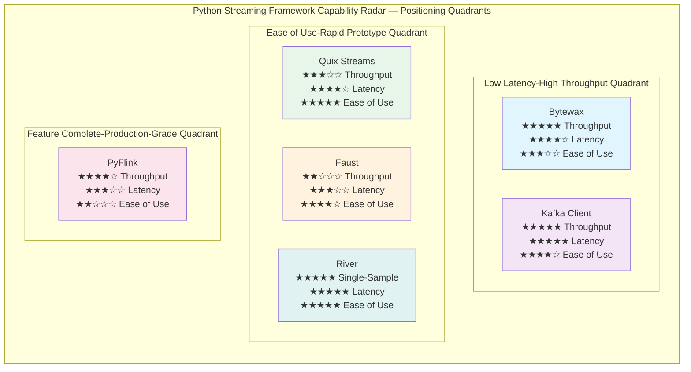
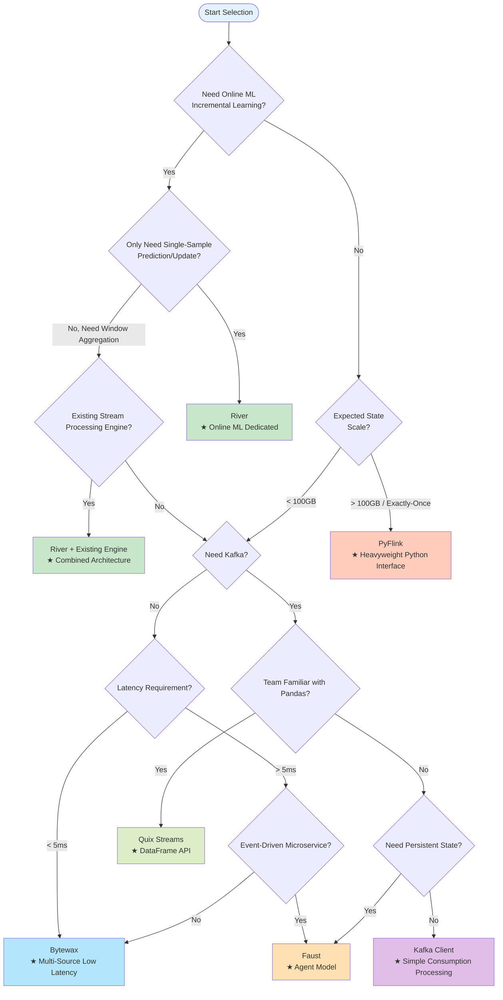

# Python Lightweight Streaming Frameworks Comprehensive Guide

> **Stage**: Knowledge/04-technology-selection | **Prerequisites**: [engine-selection-guide.md](./engine-selection-guide.md), [../01-concept-atlas/streaming-languages-landscape-2025.md](../01-concept-atlas/streaming-languages-landscape-2025.md), [../../Flink/](../../Flink/00-INDEX.md) | **Formalization Level**: L3-L4
> **Version**: v1.0 | **Created**: 2026-04-23 | **Document Size**: ~14KB | **Coverage**: 6 Python streaming systems

---

## Table of Contents

- [Python Lightweight Streaming Frameworks Comprehensive Guide](#python-lightweight-streaming-frameworks-comprehensive-guide)
  - [Table of Contents](#table-of-contents)
  - [1. Concept Definitions (Definitions)](#1-concept-definitions-definitions)
    - [Def-K-04-50 Python Lightweight Streaming Framework](#def-k-04-50-python-lightweight-streaming-framework)
    - [Def-K-04-51 Architecture Core Classification Model](#def-k-04-51-architecture-core-classification-model)
    - [Def-K-04-52 Six-Dimension Selection Comparison Space](#def-k-04-52-six-dimension-selection-comparison-space)
  - [2. Property Derivation (Properties)](#2-property-derivation-properties)
    - [Lemma-K-04-50 Rust Backend vs. Python Ecosystem Latency Trade-off](#lemma-k-04-50-rust-backend-vs-python-ecosystem-latency-trade-off)
    - [Prop-K-04-50 Python Native Framework Learning Curve Advantage](#prop-k-04-50-python-native-framework-learning-curve-advantage)
    - [Prop-K-04-51 Positive Correlation Between State Management Capability and Framework Complexity](#prop-k-04-51-positive-correlation-between-state-management-capability-and-framework-complexity)
  - [3. Relation Establishment (Relations)](#3-relation-establishment-relations)
    - [Relation R-K-04-50 Positioning Complementarity with Heavyweight Engines](#relation-r-k-04-50-positioning-complementarity-with-heavyweight-engines)
    - [Relation R-K-04-51 Framework Inter-Substitution and Symbiosis](#relation-r-k-04-51-framework-inter-substitution-and-symbiosis)
    - [Relation R-K-04-52 Kafka Coupling Spectrum](#relation-r-k-04-52-kafka-coupling-spectrum)
  - [4. Argumentation Process (Argumentation)](#4-argumentation-process-argumentation)
    - [4.1 Six-Dimension Comparison Matrix](#41-six-dimension-comparison-matrix)
      - [Table 1: Core Architecture and Latency Comparison](#table-1-core-architecture-and-latency-comparison)
      - [Table 2: State Management and Kafka Integration Comparison](#table-2-state-management-and-kafka-integration-comparison)
      - [Table 3: Learning Curve and Production Maturity Comparison](#table-3-learning-curve-and-production-maturity-comparison)
    - [4.2 Counterexample Analysis](#42-counterexample-analysis)
  - [5. Formal Proof / Engineering Argument (Proof / Engineering Argument)](#5-formal-proof--engineering-argument-proof--engineering-argument)
    - [Thm-K-04-50 Python Streaming Framework Selection Existence Theorem](#thm-k-04-50-python-streaming-framework-selection-existence-theorem)
  - [6. Example Verification (Examples)](#6-example-verification-examples)
    - [6.1 Example 1: Real-Time RAG Embedding Pipeline (Bytewax)](#61-example-1-real-time-rag-embedding-pipeline-bytewax)
    - [6.2 Example 2: IoT Event Processing and Aggregation (Quix Streams)](#62-example-2-iot-event-processing-and-aggregation-quix-streams)
    - [6.3 Example 3: Online ML Feature Engineering (River + Faust)](#63-example-3-online-ml-feature-engineering-river--faust)
    - [6.4 Counterexample: Misusing PyFlink for Rapid Prototyping](#64-counterexample-misusing-pyflink-for-rapid-prototyping)
  - [7. Visualizations (Visualizations)](#7-visualizations-visualizations)
    - [7.1 Framework Capability Radar Comparison Matrix](#71-framework-capability-radar-comparison-matrix)
    - [7.2 Python Streaming Framework Selection Decision Tree](#72-python-streaming-framework-selection-decision-tree)
  - [8. References (References)](#8-references-references)

---

## 1. Concept Definitions (Definitions)

### Def-K-04-50 Python Lightweight Streaming Framework

A **Python lightweight streaming framework** (Python轻量级流处理框架) $\mathcal{F}_{py}$ is defined as a runtime system or library satisfying the following constraints:

$$
\mathcal{F}_{py} = (L, W, D, K, S, M)
$$

Where:

| Symbol | Semantics | Constraint |
|--------|-----------|------------|
| $L$ | Primary language interface | Must be native Python 3.8+ API, not JNI/Py4J bridge |
| $W$ | Deployment weight | Runnable on a single node, no dedicated cluster manager (e.g., YARN/K8s not mandatory) |
| $D$ | Dependency dimension | Core dependency package count $< 20$, no mandatory JVM/C++ runtime |
| $K$ | Kafka coupling | Supports Kafka as a data source or built-in Kafka protocol compatibility |
| $S$ | State management | Supports at least one local state persistence mechanism (memory/RocksDB/SQLite) |
| $M$ | ML ecosystem integration | Can directly interoperate with NumPy/Pandas/PyTorch without serialization overhead |

> **Intuitive Explanation**: The core characteristic of lightweight frameworks is "Python-native" — developers write stream processing logic in pure Python without needing to understand JVM tuning, cluster resource management, or cross-language serialization. This lowers the barrier to entry for stream processing technology, enabling data science teams to directly operate on real-time data streams.

**Boundary with Heavyweight Frameworks**: Flink/PyFlink, although providing Python APIs, are strictly classified as **Python interfaces to heavyweight frameworks** rather than lightweight framework entities themselves, because they depend on the JVM runtime ($L$ constraint not satisfied for pure Python-native definition) and cluster managers ($W$ constraint not satisfied for lightweight definition).

---

### Def-K-04-51 Architecture Core Classification Model

Python streaming frameworks can be divided into two categories based on the implementation language of their underlying execution engine:

$$
\mathcal{A}(\mathcal{F}_{py}) = \begin{cases}
\text{Hybrid-Rust} & \text{Core engine implemented in Rust/C++, Python as API layer} \\
\text{Pure-Python} & \text{Core engine and API both implemented in Python}
\end{cases}
$$

**Hybrid-Rust** representative frameworks:

- **Bytewax**: Distributed execution based on Rust's Timely Dataflow, providing Python bindings through PyO3[^1]
- **Quix Streams**: Core processing pipeline contains C++ components, Python wrapper for DataFrame API (Note: progressively pure-Python since v2.x)[^2]

**Pure-Python** representative frameworks:

- **Faust** (`faust-streaming` fork): Pure Python asynchronous stream processing, based on `asyncio` and Kafka consumer group protocol[^3]
- **Quix Streams v2+**: Pure Python implementation, StreamingDataFrame API, RocksDB state backend through Python bindings[^2]
- **PyFlink**: Python API layer + Java Runtime (cross-language architecture)[^4]
- **River**: Pure Python online ML library, focused on single-sample incremental learning[^5]

> **Key Distinction**: Hybrid-Rust frameworks have order-of-magnitude advantages in throughput and latency (Rust has no GC pauses, Timely Dataflow provides deterministic incremental computation), but debugging complexity is higher (need to understand Rust-side panics/memory issues); Pure-Python frameworks are more intuitive in observability and exception handling, but are constrained by the GIL and Python runtime performance.

---

### Def-K-04-52 Six-Dimension Selection Comparison Space

The selection space for Python streaming frameworks is spanned by six orthogonal dimensions:

$$
\mathcal{D} = (D_{arch}, D_{lat}, D_{state}, D_{kafka}, D_{learn}, D_{mature})
$$

| Dimension | Symbol | Definition | Measurement Range |
|-----------|--------|------------|-------------------|
| Architecture Core | $D_{arch}$ | Underlying implementation language and concurrency model | {Hybrid-Rust, Pure-Python, JVM-Bridge} |
| Latency Characteristic | $D_{lat}$ | End-to-end processing latency median | $[1\text{ms}, 10\text{s}]$ |
| State Management | $D_{state}$ | State persistence capability and fault-tolerance guarantee | {None, Memory-only, RocksDB, Remote} |
| Kafka Integration | $D_{kafka}$ | Coupling depth with Kafka ecosystem | {Client-only, Embedded, Native} |
| Learning Curve | $D_{learn}$ | Time from zero to production-ready | $[1\text{ day}, 3\text{ months}]$ |
| Production Maturity | $D_{mature}$ | Production environment validation level and community activity | $[1, 5]$ Likert scale |

> **Intuitive Explanation**: Each framework in the six-dimensional space corresponds to a feature vector. The selection problem transforms into: given a scenario requirement vector $\vec{r}$, find the framework $\vec{f}$ that minimizes the distance $||\vec{f} - \vec{r}||_w$ (weighted Euclidean distance).

---

## 2. Property Derivation (Properties)

### Lemma-K-04-50 Rust Backend vs. Python Ecosystem Latency Trade-off

**Proposition**: For Hybrid-Rust class frameworks $\mathcal{F}_{rust}$ and Pure-Python class frameworks $\mathcal{F}_{py}$, under the same hardware configuration and single-message processing logic, their end-to-end latencies satisfy:

$$
\mathbb{E}[L_{rust}] \leq \mathbb{E}[L_{py}] - \Delta_{gc} - \Delta_{gil}
$$

where $\Delta_{gc} \approx 5\text{--}50\text{ms}$ is the tail latency fluctuation introduced by Python garbage collection, and $\Delta_{gil} \approx 1\text{--}10\text{ms}$ is the GIL switching overhead.

**Derivation**:

1. Hybrid-Rust frameworks (e.g., Bytewax) execute their core data plane in Rust, with no GC, using deterministic memory management (Ownership model); message processing latency presents a tight distribution (low variance).
2. Pure-Python frameworks (e.g., Faust) are constrained by the CPython GIL; true parallel execution of Python bytecode is impossible within a single process; under multi-process models, they are affected by inter-process communication overhead.
3. Python's tracing GC may trigger full-generation-2 collection under high memory pressure, causing millisecond-to-hundreds-of-milliseconds pauses.

> **Corollary**: For scenarios sensitive to latency variance (e.g., high-frequency trading, real-time bidding), Hybrid-Rust frameworks have theoretical advantages; for scenarios where absolute latency is not sensitive but development speed is required, Pure-Python frameworks are superior.

---

### Prop-K-04-50 Python Native Framework Learning Curve Advantage

**Proposition**: If a team already possesses Python data science skills (Pandas/NumPy/Scikit-learn), then the onboarding time $T_{pure}$ for adopting a Pure-Python streaming framework is significantly lower than the time $T_{hybrid}$ for adopting a Hybrid-Rust or JVM-Bridge framework:

$$
T_{pure} \leq 0.3 \cdot T_{hybrid}
$$

**Argument**:

1. **Mental Model Consistency**: Quix Streams' StreamingDataFrame API directly maps to Pandas operations (`apply`, `filter`, `group_by`), with knowledge transfer cost approaching zero[^2].
2. **Debugging Experience**: Pure-Python frameworks' exception stacks are entirely within Python, allowing direct debugging with pdb/ipdb; Hybrid-Rust frameworks' exceptions may cross Python/Rust boundaries, with broken stack traces.
3. **Dependency Management**: Faust/Quix Streams only require `pip install`, with no Rust toolchain or JVM needed; Bytewax's precompiled wheels simplify installation, but custom extensions require a Rust compilation environment.

---

### Prop-K-04-51 Positive Correlation Between State Management Capability and Framework Complexity

**Proposition**: A framework's state management capability $C_{state}$ (supported state types, fault-tolerance guarantees, state scale upper limit) and its operational complexity $C_{ops}$ satisfy a monotonically increasing relationship:

$$
\frac{\partial C_{ops}}{\partial C_{state}} > 0
$$

**Argument**:

1. **Stateless frameworks** (e.g., basic Kafka consumers): simplest to operate, no state recovery issues upon restart, but cannot support window aggregation and join operations.
2. **Local state frameworks** (Faust/RocksDB, Quix Streams/RocksDB): require managing local disks, RocksDB tuning, state expiration policies; operational complexity is moderate[^3][^2].
3. **Distributed state frameworks** (Bytewax/Timely Dataflow): support incremental checkpoints and deterministic replay, but require understanding partition assignment, watermark propagation, and cluster rebalancing; operational complexity is highest[^1].
4. **Heavyweight state frameworks** (PyFlink): provide Exactly-Once and TB-level state, but require managing Checkpoints, Savepoints, RocksDB backend tuning, and JobManager high availability[^4].

> **Engineering Insight**: State requirements should serve as the primary filter for selection. If only stateful window aggregation is needed (e.g., hourly counting), Faust/Quix Streams is sufficient; if TB-level state or Exactly-Once guarantees are required, PyFlink or Bytewax should be evaluated.

---

## 3. Relation Establishment (Relations)

### Relation R-K-04-50 Positioning Complementarity with Heavyweight Engines

Python lightweight frameworks form a **layered complementary** relationship with heavyweight engines such as Flink/RisingWave:

```
┌─────────────────────────────────────────────────────────────┐
│              Streaming Technology Stack Layer Model         │
├─────────────────────────────────────────────────────────────┤
│  L3: Large-Scale Production  │  Flink / RisingWave / Spark Streaming  │
│                   │  → Complex state, precise semantics, PB-scale data, strict SLA   │
├─────────────────────────────────────────────────────────────┤
│  L2: Medium Scale    │  Bytewax / PyFlink                      │
│                   │  → ML pipelines, real-time features, medium state, Python-first team │
├─────────────────────────────────────────────────────────────┤
│  L1: Rapid Prototype    │  Faust / Quix Streams / River           │
│                   │  → Rapid validation, small-to-medium scale, Python-native ecosystem      │
├─────────────────────────────────────────────────────────────┤
│  L0: Message Consumption    │  confluent-kafka-python / aiokafka      │
│                   │  → Simple consumption, stateless processing, maximum flexibility        │
└─────────────────────────────────────────────────────────────┘
```

**Mapping Rules**:

- When data volume $< 10^6$ events/second, state $< 100$ GB, team size $< 5$, L1 frameworks are Pareto-optimal choices.
- When SQL-first or storage-computation separation is needed, RisingWave (L3) is superior to all Python frameworks.
- When custom operators and CEP are needed, Flink DataStream API (L3) is irreplaceable.

---

### Relation R-K-04-51 Framework Inter-Substitution and Symbiosis

The six frameworks exhibit **partial overlap** and **unique ecological niches** in the functional space:

| Functional Requirement | Primary Framework | Substitutable Framework | Irreplaceable Scenario |
|----------|----------|------------|--------------|
| Real-time RAG embedding pipeline | Bytewax | Quix Streams | Bytewax's incremental computation semantics naturally align with vector DB writes[^1] |
| Kafka-native stream processing | Quix Streams | Faust | Quix Streams' DataFrame API has zero barrier for Pandas users[^2] |
| Event-driven microservices | Faust | Quix Streams | Faust's Agent model with Robinhood-validated patterns[^3] |
| Large-scale production stream processing | PyFlink | - | PyFlink's Exactly-Once and TB-level state management[^4] |
| Online ML / concept drift detection | River | - | River's incremental learning algorithm library has no direct competitor[^5] |
| Simple Kafka consumption + processing | confluent-kafka | Faust/Quix | Maximum flexibility, no framework constraints |

**Symbiosis Pattern**: River (online ML) + Faust/Quix Streams (stream processing engine) forms a common combination — the engine handles data ingestion and window aggregation, while River handles incremental model training and prediction.

---

### Relation R-K-04-52 Kafka Coupling Spectrum

The coupling degree of each framework with Kafka forms a continuous spectrum:

$$
\text{Coupling}(\mathcal{F}) = \begin{cases}
\text{Native-Embedded} & \text{Faust (based on Kafka Streams semantics, topic as changelog)} \\
\text{Native-Library} & \text{Quix Streams (pure Python Kafka consumer group protocol implementation)} \\
\text{Protocol-Compatible} & \text{Bytewax (supports Kafka source/sink, but core model is generic)} \\
\text{Connector-Based} & \text{PyFlink (integrated through Flink Kafka Connector)} \\
\text{Decoupled} & \text{River (fully decoupled from messaging systems, only processes sample streams)}
\end{cases}
$$

> **Selection Insight**: If the architecture is already deeply bound to Kafka (e.g., using Kafka Connect, Schema Registry, ksqlDB), Faust and Quix Streams' native coupling provides a more consistent development experience; if multi-source support is needed (WebSocket, MQTT, file), Bytewax and PyFlink's generic connectors are more advantageous.

---

## 4. Argumentation Process (Argumentation)

### 4.1 Six-Dimension Comparison Matrix

#### Table 1: Core Architecture and Latency Comparison

| Framework | Architecture Core | Implementation Language | Latency (Median) | Latency (Tail P99) | Throughput (Single Node) |
|------|----------|----------|-------------|------------|--------------|
| **Bytewax** | Hybrid-Rust | Rust + Python (PyO3) | 1-5 ms | 5-20 ms | 50K-200K events/second |
| **Faust** | Pure-Python | Python + RocksDB | 10-50 ms | 100-500 ms | 5K-20K events/second |
| **Quix Streams** | Pure-Python | Python + RocksDB | 5-20 ms | 50-200 ms | 10K-50K events/second |
| **PyFlink** | JVM-Bridge | Java Runtime + Python UDF | 10-100 ms | 100ms-1s | 10K-100K events/second |
| **Kafka Streams (Python client)** | Client-only | Python (confluent-kafka) | 1-10 ms | 10-50 ms | 100K+ events/second* |
| **River** | Pure-Python | Python (single-sample processing) | <1 ms | <5 ms | 500K+ samples/second** |

> *Note: Kafka Streams Python client is only a consumer library, with no built-in processing semantics; throughput is limited by pure consumption speed.
> **Note: River throughput is single-sample ML prediction throughput, not message processing throughput.

#### Table 2: State Management and Kafka Integration Comparison

| Framework | State Backend | State Types | Fault-Tolerance Guarantee | Kafka Integration Depth | JVM Dependency |
|------|----------|----------|----------|--------------|------------|
| **Bytewax** | SQLite/Kafka changelog | Keyed State, Window State | At-Least-Once (EO roadmap) | Source/Sink Connector | ❌ |
| **Faust** | RocksDB (local) + Kafka changelog | Table (K/V), Windowed Aggregates | At-Least-Once (EO has bugs) | Native (Kafka Streams semantics) | ❌ |
| **Quix Streams** | RocksDB (local) | Aggregations, Window State | At-Least-Once (Exactly-Once roadmap) | Native (consumer group protocol) | ❌ |
| **PyFlink** | RocksDB/ForSt/Memory | Full State Backend | Exactly-Once | Connector (mature) | ✅ |
| **Kafka Streams (Python)** | No built-in | None | None | Raw Consumer/Producer | ❌ |
| **River** | None | Model parameters (incremental updates) | Manual Checkpoint | Decoupled | ❌ |

#### Table 3: Learning Curve and Production Maturity Comparison

| Framework | Learning Curve | Production Maturity | Community Activity | Documentation Quality | Typical Deployment Scale |
|------|----------|-----------|-----------|----------|-------------|
| **Bytewax** | Medium (need to understand Dataflow model) | ★★★☆☆ | Medium (active development) | Good | Small-to-medium scale (10-100 workers) |
| **Faust** | Low (async/await friendly) | ★★★☆☆ | Medium (community fork maintenance) | Good | Small-to-medium scale (Robinhood validated) |
| **Quix Streams** | Very low (Pandas-like) | ★★★☆☆ | Medium-High (commercially driven) | Excellent | Small-to-medium scale + edge deployment |
| **PyFlink** | High (need to understand Flink internals) | ★★★★★ | High (Apache top-level project) | Excellent | Large scale (1000+ nodes) |
| **Kafka Streams (Python)** | Low | ★★★★☆ | High (Confluent support) | Excellent | Large scale (pure consumption scenarios) |
| **River** | Very low (sklearn-like API) | ★★★★☆ | Medium-High (academic + industry) | Excellent | Single-node/embedded |

---

### 4.2 Counterexample Analysis

**Counterexample 1: Misusing Faust in Ultra-High Throughput Scenarios**

- **Scenario**: User behavior log processing at 1 million events per second.
- **Misuse**: Selecting Faust for window aggregation; single worker throughput is only ~10K events/second, requiring 100 worker processes.
- **Consequence**: High Python process memory usage (each process loads an independent code image), RocksDB state fragmentation, extremely long rebalancing time.
- **Correct Choice**: Bytewax (higher single-worker throughput with Rust core) or PyFlink (cluster-level scaling).

**Counterexample 2: Forcing Quix Streams in a Kafka-Free Environment**

- **Scenario**: Ingesting IoT data from an MQTT Broker, with no Kafka infrastructure.
- **Misuse**: Introducing Quix Streams, forced to deploy Kafka as an intermediate layer ("introducing a message queue for the sake of the framework").
- **Consequence**: Architecture complexity doubled, end-to-end latency increased, operational costs rose.
- **Correct Choice**: Bytewax (supports multi-source including MQTT/file/WebSocket) or direct use of paho-mqtt + River processing.

**Counterexample 3: Treating River as a Complete Stream Processing Engine**

- **Scenario**: Needing window joins (Stream-Stream Join) and complex event pattern matching.
- **Misuse**: Using River alone to process data streams, attempting to manually implement window management.
- **Consequence**: River has no built-in window/join/pattern matching semantics; developers must implement time semantics themselves, which is highly error-prone.
- **Correct Choice**: River as the ML inference layer, Faust/Quix Streams/Bytewax as the stream processing engine, used in combination.

---

## 5. Formal Proof / Engineering Argument (Proof / Engineering Argument)

### Thm-K-04-50 Python Streaming Framework Selection Existence Theorem

**Theorem**: For any given scenario $S$, if its constraints satisfy:

$$
\text{Throughput}(S) \leq 10^6 \text{ events/second} \quad \land \quad \text{State}(S) \leq 100 \text{ GB} \quad \land \quad \text{Team} \subseteq \text{Python ecosystem}
$$

Then there exists at least one Python lightweight streaming framework $\mathcal{F}_{py}^*$ that achieves Pareto optimality among development efficiency, operational cost, and performance.

**Proof (Constructive)**:

1. **Define Pareto Frontier**: In the three-dimensional objective space (development efficiency $E$, operational cost $O$, performance $P$), the Pareto-optimal solution set is the set of frameworks for which no other framework is simultaneously superior across all three dimensions.

2. **Construct by Scenario**:

   | Scenario Characteristics | Optimal Framework $\mathcal{F}_{py}^*$ | Argument |
   |----------|------------------------------|------|
   | Latency-sensitive (<10ms) + medium state | Bytewax | Rust core eliminates GC pauses, Timely Dataflow provides deterministic low latency[^1] |
   | Rapid prototype + Pandas ecosystem | Quix Streams | StreamingDataFrame API minimizes learning cost[^2] |
   | Event-driven microservices + Kafka-native | Faust | Agent semantics consistent with Kafka Streams model, async/await natural[^3] |
   | Online ML + concept drift | River | The only incremental learning algorithm library, decoupled from stream processing engines[^5] |
   | Production-grade Exactly-Once + large state | PyFlink | The only Python interface providing complete Checkpoint/Exactly-Once[^4] |

3. **Boundary Condition Validation**:
   - When throughput $> 10^6$ events/second, Python frameworks are constrained by GIL or JVM bridge overhead; migration to Flink Java/Scala native API is required.
   - When state $> 100$ GB, local RocksDB state backends (Faust/Quix Streams) have unacceptable recovery times; PyFlink's distributed Checkpoint or RisingWave's remote state storage is needed.
   - When the team has no Python background, the Java/Scala ecosystem (Flink/Kafka Streams Java) is superior.

4. **Conclusion**: Within the constraint space assumed by the theorem, Python lightweight frameworks always provide non-dominated solutions; beyond this space, migration to heavyweight engines is required.

---

## 6. Example Verification (Examples)

### 6.1 Example 1: Real-Time RAG Embedding Pipeline (Bytewax)

**Scenario**: Encode a user search query stream into vector embeddings in real time and write them to a vector database (Pinecone/Milvus) for RAG retrieval.

**Bytewax Implementation**:

```python
from bytewax.dataflow import Dataflow
from bytewax import operators as op
from bytewax.connectors.kafka import KafkaSource
from sentence_transformers import SentenceTransformer
import bytewax.operators.windowing as win

model = SentenceTransformer('all-MiniLM-L6-v2')

flow = Dataflow("rag-embedding-pipeline")

# Ingest search query stream from Kafka
queries = op.input("kafka_in", flow, KafkaSource(["localhost:9092"], "search-queries"))

# Extract query text and encode into vectors
def encode_query(query_json):
    text = query_json["query"]
    embedding = model.encode(text).tolist()
    return {"id": query_json["id"], "vector": embedding, "metadata": query_json}

encoded = op.map("encode", queries, encode_query)

# Partition by user ID to ensure sequential processing of same user's queries
keyed = op.key_on("key_by_user", encoded, lambda x: x["metadata"]["user_id"])

# Output to vector DB (custom sink)
op.output("vector_sink", keyed, VectorDBSink("pinecone-index"))
```

**Selection Rationale**:

- Bytewax's incremental Dataflow model is suitable for "ingest → transform → write" pipelines.
- Rust core ensures that batch inference of the embedding model is not interrupted by Python GC.
- Supports scaling from a single worker to Kubernetes clusters, adapting to query volume growth.

---

### 6.2 Example 2: IoT Event Processing and Aggregation (Quix Streams)

**Scenario**: Ingest temperature readings from factory sensors, compute the average temperature per minute, and trigger alerts when thresholds are exceeded.

**Quix Streams Implementation**:

```python
from quixstreams import Application

app = Application(broker_address="localhost:9092")

# Define topics
sensor_topic = app.topic("sensor-readings", value_deserializer="json")
alerts_topic = app.topic("temperature-alerts", value_serializer="json")

# Build StreamingDataFrame —— Pandas-like experience
sdf = app.dataframe(topic=sensor_topic)

# Group by device ID, 1-minute tumbling window average temperature
sdf = sdf.apply(lambda msg: {"device": msg["device_id"], "temp": msg["temperature"]})
sdf = sdf.group_by("device")

from quixstreams.windows import TumblingWindow
windowed = sdf.window(TumblingWindow(duration_ms=60_000))
avg_temp = windowed.aggregate(lambda msgs: sum(m["temp"] for m in msgs) / len(msgs))

# Filter threshold-exceeding events
alerts = avg_temp.apply(lambda row: {"device": row["device"], "avg_temp": row["value"]})
alerts = alerts[alerts["avg_temp"] > 80.0]

# Output to alert topic
alerts.to_topic(alerts_topic)

app.run()
```

**Selection Rationale**:

- Quix Streams' DataFrame API has zero learning cost for data engineers.
- Built-in RocksDB state management and automatic Checkpoint, with no manual fault recovery needed.
- Pure Python, stream processing logic can be directly debugged in Jupyter Notebook.

---

### 6.3 Example 3: Online ML Feature Engineering (River + Faust)

**Scenario**: Real-time prediction of user churn probability, with the model continuously updating as new data arrives.

**Combined Architecture**: Faust handles stream ingestion and feature aggregation; River performs incremental model training.

```python
import faust
from river import compose, preprocessing, linear_model, metrics

app = faust.App('churn-prediction', broker='kafka://localhost')

# Define event model
class UserEvent(faust.Record):
    user_id: str
    session_duration: float
    clicks: int
    churned: bool = None  # Provided during training, None during inference

# River online model (pure Python incremental learning)
model = compose.Pipeline(
    preprocessing.StandardScaler(),
    linear_model.LogisticRegression()
)
metric = metrics.ROCAUC()

# Faust Agent processes event stream
@app.agent(app.topic('user-events', value_type=UserEvent))
async def process_events(events):
    async for event in events:
        features = {
            'session_duration': event.session_duration,
            'clicks': event.clicks
        }

        if event.churned is not None:
            # Training mode: predict → evaluate → update
            prob = model.predict_proba_one(features)
            model.learn_one(features, event.churned)
            metric.update(event.churned, prob[True])
            print(f"Model updated. AUC: {metric}")
        else:
            # Inference mode
            prob = model.predict_proba_one(features)
            print(f"User {event.user_id} churn prob: {prob[True]:.3f}")
```

**Selection Rationale**:

- Faust provides reliable stream processing infrastructure (Kafka consumption, partitioning, rebalancing).
- River provides industrial-grade online learning algorithms (LogisticRegression, HoeffdingTree, AdaGrad optimizers, etc.).
- Both are pure Python, sharing the same async/ runtime model.

---

### 6.4 Counterexample: Misusing PyFlink for Rapid Prototyping

**Scenario**: A data science team needs to validate the business value of real-time feature generation within one week.

**Misuse Selection**: Directly adopting PyFlink, reasoning that it has "production-grade capabilities."

**Actual Overhead**:

1. **Environment Setup**: Need to deploy Flink cluster (JobManager + TaskManager), or configure MiniCluster for local development, taking 2 days.
2. **Cross-Language Debugging**: Python UDF exception messages are wrapped by the Java Runtime, making debugging difficult.
3. **Serialization Overhead**: Pandas DataFrame transmission between Python and Java requires Arrow serialization; frequent conversions slow iteration speed.
4. **API Mismatch**: PyFlink DataStream API has large semantic differences from Pandas; data scientists need additional learning of concepts such as windows and watermarks.

**Actual Time Spent**: 5 days to complete environment + first pipeline, missing the business validation window.

**Correct Choice**: Quix Streams or Bytewax.

- **Quix Streams**: `pip install` and run directly; DataFrame API consistent with Pandas; first pipeline completed within 1 day.
- **Bytewax**: If higher performance is needed later, can smoothly scale from single worker to cluster without rewriting code.

---

## 7. Visualizations (Visualizations)

### 7.1 Framework Capability Radar Comparison Matrix

The following Mermaid diagram shows the relative positioning of the six frameworks across core capability dimensions. Values are relative scores from 1-5 for inter-framework comparison only, not absolute performance metrics.



> **Figure Note**: The horizontal axis from left to right represents increasing "ease of use"; the vertical axis from bottom to top represents increasing "performance." PyFlink is located at the lower right (strong features but steep learning curve); River and Quix Streams are located at the upper left (highest ease of use); Bytewax is located at the upper right (balance of performance and ease of use).

---

### 7.2 Python Streaming Framework Selection Decision Tree



> **Figure Note**: The decision tree starts from scenario requirements and converges to a recommended framework through 4-5 key decision nodes. Each leaf node is labeled with the framework name and core selection rationale.

---

## 8. References (References)

[^1]: Bytewax Documentation, "Architecture Overview", 2025. <https://bytewax.io/docs> | Bytewax Blog, "Scaling One Developer - Building a Python Stream Processor", 2023. <https://bytewax.io/blog/whywax>

[^2]: Quix Streams Documentation, "Introduction", 2025. <https://quix.io/docs/quix-streams/introduction.html> | Quix Blog, "Quix Streams—a reliable Faust alternative for Python stream processing", 2024-06. <https://quix.io/blog/quix-streams-faust-alternative>

[^3]: Faust Streaming Documentation, "User Guide", 2024. <https://faust.readthedocs.io/> | faust-streaming GitHub, "Python Stream Processing", 2024. <https://github.com/faust-streaming/faust>

[^4]: Apache Flink Documentation, "PyFlink Overview", 2025. <https://nightlies.apache.org/flink/flink-docs-stable/docs/dev/python/overview/> | Quix Blog, "PyFlink — A deep dive into Flink's Python API", 2024-05. <https://quix.io/blog/pyflink-deep-dive>

[^5]: River Documentation, "Getting Started", 2025. <https://riverml.xyz/> | J. Montiel et al., "River: machine learning for streaming data in Python", Journal of Machine Learning Research (JMLR), 2021.


---

**Related Documents**:

- [engine-selection-guide.md](./engine-selection-guide.md) —— General stream processing engine selection guide (covers Flink/Spark/Kafka Streams Java)
- [flink-vs-risingwave.md](./flink-vs-risingwave.md) —— Flink vs RisingWave deep comparison (heavyweight engine reference frame)
- [streaming-engines-comprehensive-matrix-2026.md](./streaming-engines-comprehensive-matrix-2026.md) —— 2026 stream computing engine multi-dimensional comparison matrix
- [../01-concept-atlas/streaming-languages-landscape-2025.md](../01-concept-atlas/streaming-languages-landscape-2025.md) —— Stream computing language ecosystem panorama
- [../02-design-patterns/pattern-realtime-feature-engineering.md](../02-design-patterns/pattern-realtime-feature-engineering.md) —— Real-time feature engineering pattern
- [../../Flink/03-api/pyflink-guide.md](../../Flink/03-api/pyflink-guide.md) —— PyFlink detailed usage guide

---

*Document Version: v1.0 | Created: 2026-04-23 | Maintainer: AnalysisDataFlow Project*
*Formalization Level: L3-L4 | Document Size: ~14KB | Comparison Matrices: 3 | Decision Trees: 1 | Examples: 4 | Mermaid Diagrams: 2*
