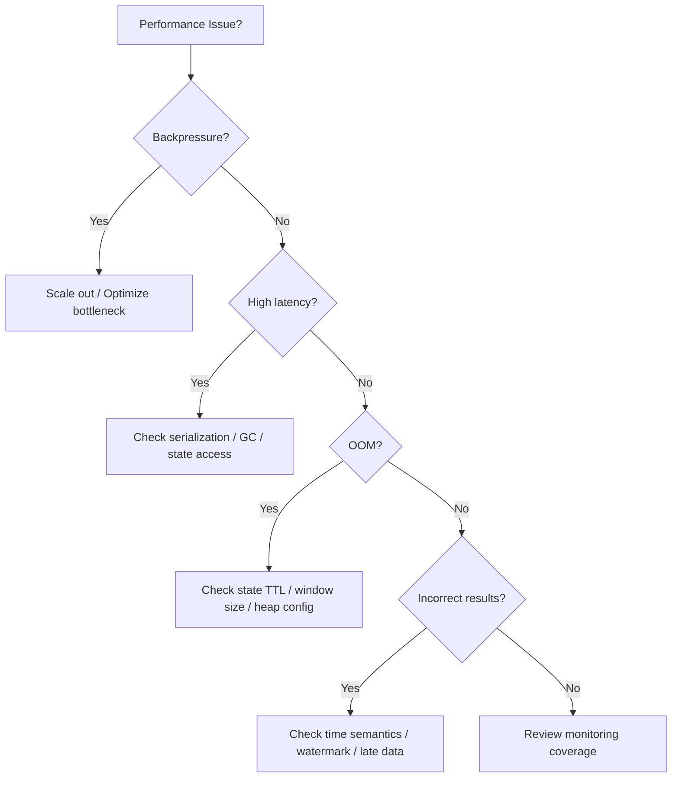

# Streaming Anti-Patterns Quick Reference

> **Language**: English | **Source**: [Knowledge/98-exercises/quick-ref-streaming-anti-patterns.md](../Knowledge/98-exercises/quick-ref-streaming-anti-patterns.md) | **Last Updated**: 2026-04-21

---

## Severity Pyramid

```
        P0 - CATASTROPHIC ▲
                         /███\   Cascade failure, data loss, outage
                        /█████\  AP-02 Ignore Backpressure
                       /███████\ AP-10 Insufficient Monitoring
                      ▔▔▔▔▔▔▔▔▔▔▔

        P1 - HIGH RISK    ▲
                         /███\   Severe degradation, OOM, recovery failure
                        /█████\  AP-03 No State TTL   AP-05 Data Skew
                       /███████\ AP-06 Global Window Abuse
                      /█████████\ AP-04 Wrong Checkpoint Config
                     ▔▔▔▔▔▔▔▔▔▔▔▔▔

        P2 - MODERATE     ▲
                         /███\   Inaccurate results, waste, sporadic errors
                        /█████\  AP-01 Processing Time Bias  AP-08 Wrong Parallelism
                       /███████\ AP-09 No Idempotency
                      ▔▔▔▔▔▔▔▔▔▔▔
```

---

## Top 10 Anti-Patterns

### AP-01: Processing Time Bias (P2)

| Item | Detail |
|------|--------|
| **Symptom** | Different results across reruns; wrong window assignment; sensitive to disorder |
| **Root Cause** | Using `ProcessingTime` instead of `EventTime` as temporal baseline |
| **Fix** | Use `EventTime` + `WatermarkStrategy` + `allowedLateness` |

### AP-02: Ignoring Backpressure (P0)

| Item | Detail |
|------|--------|
| **Symptom** | Tasks marked as BACKPRESSURED; source rate drops; checkpoint timeouts |
| **Root Cause** | Downstream bottleneck propagates upstream; no mitigation strategy |
| **Fix** | Scale out bottleneck operator; enable buffer debloating; apply load shedding |

### AP-03: No State TTL (P1)

| Item | Detail |
|------|--------|
| **Symptom** | State size grows unbounded; OOM; increasing checkpoint duration |
| **Root Cause** | State entries never expire; accumulation of stale keyed state |
| **Fix** | Configure `StateTtlConfig` with appropriate expiration; use cleanup strategies |

### AP-04: Wrong Checkpoint Interval (P1)

| Item | Detail |
|------|--------|
| **Symptom** | Checkpoints fail frequently; recovery takes too long; performance drops during checkpoint |
| **Root Cause** | Interval too short (overhead) or too long (replay window too large) |
| **Fix** | Target checkpoint duration < 50% of interval; tune incremental checkpoints |

### AP-05: Data Skew (P1)

| Item | Detail |
|------|--------|
| **Symptom** | Some subtasks have 10× more records; hot keys dominate |
| **Root Cause** | Key distribution uneven; natural skew in business data |
| **Fix** | Add salt to hot keys; use custom partitioner; enable two-phase aggregation |

### AP-06: Global Window Abuse (P1)

| Item | Detail |
|------|--------|
| **Symptom** | Memory exhaustion; never-triggered windows; incorrect results |
| **Root Cause** | Using global window without trigger; accumulating infinite state |
| **Fix** | Use tumbling/sliding windows with explicit size; add triggers; enable window state TTL |

### AP-07: Ignoring Late Data (P1)

| Item | Detail |
|------|--------|
| **Symptom** | Missing records in window results; inconsistent counts |
| **Root Cause** | Watermark too aggressive; no side output for late data |
| **Fix** | Configure `allowedLateness`; route late data to side output; monitor watermark lag |

### AP-08: Wrong Parallelism (P2)

| Item | Detail |
|------|--------|
| **Symptom** | Low CPU utilization or constant backpressure; resource waste |
| **Root Cause** | Parallelism too high (overhead) or too low (bottleneck) |
| **Fix** | Start with `parallelism = max(source_partitions, sink_partitions)`; tune per operator |

### AP-09: No Idempotency (P2)

| Item | Detail |
|------|--------|
| **Symptom** | Duplicate records in sink after recovery; inconsistent downstream state |
| **Root Cause** | Sink not idempotent; exactly-once not end-to-end |
| **Fix** | Use idempotent sinks (upsert Kafka, idempotent DB writes); enable 2PC where needed |

### AP-10: Insufficient Monitoring (P0)

| Item | Detail |
|------|--------|
| **Symptom** | Failures discovered by users; no early warning; long MTTR |
| **Root Cause** | Missing key metrics; no alerting rules; dashboards not reviewed |
| **Fix** | Monitor: latency (p50/p99), throughput, backpressure, checkpoint metrics, watermark lag |

---

## Quick Decision Tree



---

## References
