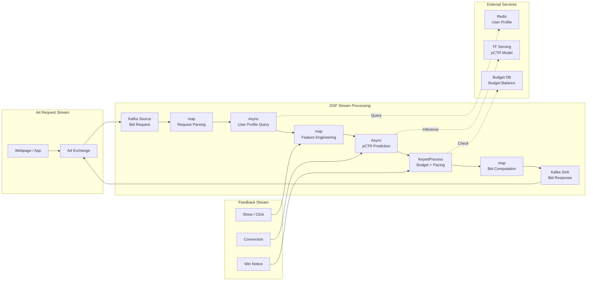
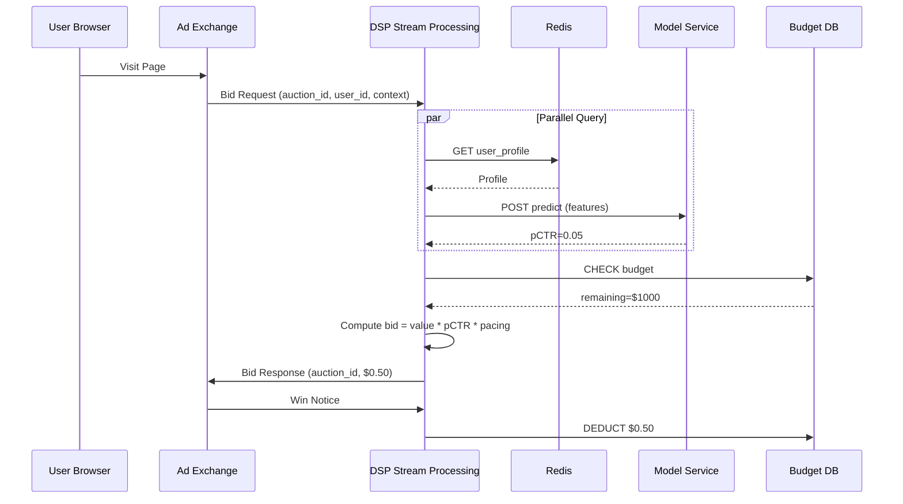

# Operators and Real-Time Bidding (RTB) Systems

> **Stage**: Knowledge/10-case-studies | **Prerequisites**: [01.06-single-input-operators.md](./01-concept-atlas/operator-deep-dive/01.06-single-input-operators.md), [operator-ai-ml-integration.md](./06-frontier/operator-ai-ml-integration.md) | **Formalization Level**: L3
> **Document Positioning**: Operator fingerprints and Pipeline design for stream processing operators in Real-Time Bidding (RTB, 实时竞价) systems
> **Version**: 2026.04

---

## Table of Contents

- [Operators and Real-Time Bidding (RTB) Systems](#operators-and-real-time-bidding-rtb-systems)
  - [Table of Contents](#table-of-contents)
  - [1. Definitions](#1-definitions)
    - [Def-RTB-01-01: Real-Time Bidding (RTB, 实时竞价)](#def-rtb-01-01-real-time-bidding-rtb-实时竞价)
    - [Def-RTB-01-02: Bidding Decision Operator (竞价决策算子)](#def-rtb-01-02-bidding-decision-operator-竞价决策算子)
    - [Def-RTB-01-03: Budget Pacing (预算平滑)](#def-rtb-01-03-budget-pacing-预算平滑)
    - [Def-RTB-01-04: User Profile Real-time Update (用户画像实时更新)](#def-rtb-01-04-user-profile-real-time-update-用户画像实时更新)
    - [Def-RTB-01-05: Bidding Funnel (竞价漏斗)](#def-rtb-01-05-bidding-funnel-竞价漏斗)
  - [2. Properties](#2-properties)
    - [Lemma-RTB-01-01: Strict Upper Bound on Bidding Latency](#lemma-rtb-01-01-strict-upper-bound-on-bidding-latency)
    - [Lemma-RTB-01-02: Predictability of Budget Depletion Time](#lemma-rtb-01-02-predictability-of-budget-depletion-time)
    - [Prop-RTB-01-01: User Profile Cold Start Problem](#prop-rtb-01-01-user-profile-cold-start-problem)
    - [Prop-RTB-01-02: Peak-Valley Pattern of Bidding Request Volume](#prop-rtb-01-02-peak-valley-pattern-of-bidding-request-volume)
  - [3. Relations](#3-relations)
    - [3.1 RTB Pipeline Operator Mapping](#31-rtb-pipeline-operator-mapping)
    - [3.2 Operator Characteristics (Operator Fingerprint)](#32-operator-characteristics-operator-fingerprint)
    - [3.3 Differences Between RTB Systems and General Stream Processing](#33-differences-between-rtb-systems-and-general-stream-processing)
  - [4. Argumentation](#4-argumentation)
    - [4.1 Why RTB Must Use Stream Processing Instead of Batch Processing](#41-why-rtb-must-use-stream-processing-instead-of-batch-processing)
    - [4.2 Peak Handling Strategies for Bidding Systems](#42-peak-handling-strategies-for-bidding-systems)
    - [4.3 Game-Theoretic Analysis of Budget Competition](#43-game-theoretic-analysis-of-budget-competition)
  - [5. Proof / Engineering Argument](#5-proof--engineering-argument)
    - [5.1 Bidding Latency Budget Allocation](#51-bidding-latency-budget-allocation)
    - [5.2 Pacing Algorithm Design](#52-pacing-algorithm-design)
    - [5.3 Windowed User Profile Update](#53-windowed-user-profile-update)
  - [6. Examples](#6-examples)
    - [6.1 In Practice: DSP Bidding Pipeline](#61-in-practice-dsp-bidding-pipeline)
    - [6.2 In Practice: Real-time User Profile Update](#62-in-practice-real-time-user-profile-update)
  - [7. Visualizations](#7-visualizations)
    - [RTB Pipeline Architecture Diagram](#rtb-pipeline-architecture-diagram)
    - [Bidding Decision Sequence Diagram](#bidding-decision-sequence-diagram)
  - [8. References](#8-references)

---

## 1. Definitions

### Def-RTB-01-01: Real-Time Bidding (RTB, 实时竞价)

RTB is a digital advertising transaction mechanism where ad impression opportunities are sold through auction within millisecond-level timeframes:

$$\text{RTB} = (\text{Ad Request}, \text{Bidding Decision}, \text{Ad Delivery}) \text{ within } 100ms$$

Core workflow: user visits a page → Ad Exchange sends a bid request → multiple DSPs (Demand-Side Platforms, 需求方平台) return bids within 100ms → the highest bidder wins the impression opportunity.

### Def-RTB-01-02: Bidding Decision Operator (竞价决策算子)

The Bidding Decision Operator is a stream processing operator that computes the optimal bid based on user characteristics, context, and campaign strategy:

$$\text{Bid} = f(\text{UserProfile}, \text{Context}, \text{CampaignRules}, \text{PacingState})$$

Where $f$ is the bidding function, typically combining predicted Click-Through Rate (pCTR, 预估点击率), ad Value, and budget pacing.

### Def-RTB-01-03: Budget Pacing (预算平滑)

Budget Pacing is a strategy that distributes daily budget evenly across all time slots throughout the day to prevent premature budget exhaustion:

$$\text{PacingMultiplier}_t = \frac{\text{TargetSpend}_t}{\text{ActualSpend}_t}$$

If $\text{PacingMultiplier}_t > 1$, accelerate spending; if $< 1$, decelerate spending.

### Def-RTB-01-04: User Profile Real-time Update (用户画像实时更新)

User Profile Real-time Update is the process of dynamically updating a user's interest tags and feature vectors based on their real-time behavior:

$$\text{Profile}_{t+1} = \alpha \cdot \text{Profile}_t + (1-\alpha) \cdot \text{EventFeature}_t$$

Where $\alpha$ is the decay coefficient (typically 0.9–0.99), implementing exponential weighted moving average.

### Def-RTB-01-05: Bidding Funnel (竞价漏斗)

The Bidding Funnel describes the complete chain from ad request to final conversion:

$$\text{Request} \to \text{Bid} \to \text{Win} \to \text{Show} \to \text{Click} \to \text{Conversion}$$

Each stage exhibits attrition, and stream processing operators are responsible for computing conversion rates at each stage in real time.

---

## 2. Properties

### Lemma-RTB-01-01: Strict Upper Bound on Bidding Latency

RTB systems require the time from receiving a bid request to returning a bid, denoted $\mathcal{L}_{bid}$, to satisfy:

$$\mathcal{L}_{bid} < 100ms$$

**Breakdown**:

- Network transmission (round-trip): 20–50ms
- Feature retrieval: 10–20ms
- Model inference: 5–20ms
- Bid computation: 1–5ms
- Remaining buffer: 10–20ms

**Corollary**: Any subtask exceeding 30ms is a performance bottleneck and requires optimization or asynchronization.

### Lemma-RTB-01-02: Predictability of Budget Depletion Time

Without pacing control, the budget depletion time $T_{deplete}$ satisfies:

$$T_{deplete} = \frac{B}{\bar{b} \cdot \lambda \cdot winRate}$$

Where $B$ is the total budget, $\bar{b}$ is the average bid, $\lambda$ is the request arrival rate, and $winRate$ is the win rate.

**Engineering implication**: During high-value periods (e.g., evening), if pacing is not applied, the budget may be depleted in the morning.

### Prop-RTB-01-01: User Profile Cold Start Problem

New users (with no historical behavior) have empty profiles, leading to inaccurate model predictions:

$$\text{Profile}_{new} = \emptyset \Rightarrow pCTR_{new} = \text{default}$$

**Solutions**:

- Supplement with contextual features based on device / geo-location / time
- Use lookalike (similar user) feature transfer
- Exploration-exploitation tradeoff (ε-greedy)

### Prop-RTB-01-02: Peak-Valley Pattern of Bidding Request Volume

RTB request volume exhibits a clear daily periodic pattern:

$$\lambda(t) = \lambda_{base} + \lambda_{peak} \cdot \sin(\frac{2\pi t}{24h} + \phi)$$

Peak volume is typically 3–5× that of the early morning trough. Stream processing systems must possess elastic scaling capabilities.

---

## 3. Relations

### 3.1 RTB Pipeline Operator Mapping

| Processing Stage | Operator Type | Flink Operator | Latency Requirement |
|------------------|---------------|----------------|---------------------|
| **Request Ingestion** | Source | Kafka Source | < 5ms |
| **Request Parsing** | map | map (JSON parsing) | < 1ms |
| **User Profile Retrieval** | Async Lookup | AsyncFunction (Redis/HBase) | < 10ms |
| **Feature Engineering** | map | map (feature combination) | < 2ms |
| **pCTR Prediction** | Async ML | AsyncFunction (TF Serving) | < 20ms |
| **Bid Computation** | map | map (formula calculation) | < 1ms |
| **Budget Check** | Stateful | KeyedProcessFunction | < 2ms |
| **Pacing Adjustment** | Stateful | KeyedProcessFunction + Timer | Async |
| **Response Return** | Sink | Kafka Sink / HTTP Response | < 5ms |

### 3.2 Operator Characteristics (Operator Fingerprint)

| Dimension | RTB Characteristic |
|-----------|--------------------|
| **Core Operators** | AsyncFunction (feature / model query), KeyedProcessFunction (budget / pacing), Broadcast (strategy distribution) |
| **State Types** | ValueState (budget balance), MapState (user profile cache), ReducingState (hourly consumption statistics) |
| **Time Semantics** | Processing time dominant (latency requirement < 100ms, cannot wait for event time) |
| **Data Characteristics** | High throughput (1M–10M QPS), low latency (< 100ms), large peak fluctuation |
| **State Hotspots** | Budget State (keyBy by Campaign, few keys with high-frequency updates) |
| **Performance Bottlenecks** | Model inference (pCTR prediction), feature service queries |

### 3.3 Differences Between RTB Systems and General Stream Processing

| Dimension | General Stream Processing | RTB Systems |
|-----------|---------------------------|-------------|
| **Latency Requirement** | Second-level to minute-level | Millisecond-level (< 100ms) |
| **State Access** | keyBy by user | keyBy by Campaign (few keys, frequent updates) |
| **Time Semantics** | Event time dominant | Processing time dominant |
| **Exactly-once** | Usually required | Not required (dropped bids acceptable, duplicates must be idempotent) |
| **Data Retention** | Long-term storage | Short-term (post-bid data can be discarded) |
| **Model Integration** | Optional | Required (pCTR / pCVR prediction) |

---

## 4. Argumentation

### 4.1 Why RTB Must Use Stream Processing Instead of Batch Processing

**Problems with Batch Processing**:

- Batch processing has a minimum granularity of minutes, unable to meet the 100ms latency requirement
- User profile updates lag, causing bids to be based on stale features
- Budget consumption cannot be controlled in real time, leading to overspending

**Advantages of Stream Processing**:

- Millisecond-level latency, satisfying RTB real-time requirements
- User behavior is reflected in profile updates in real time
- Real-time budget consumption monitoring and pacing adjustment

### 4.2 Peak Handling Strategies for Bidding Systems

**Scenario**: During Double Eleven (双十一), request volume surges from 1M QPS to 50M QPS.

**Strategy 1: Feature Service Degradation**

- Normal: query 10 features
- Degraded: query only 3 core features (user ID + context + historical CTR)
- Effect: feature query latency drops from 20ms to 5ms, model AUC drops 2% but acceptable

**Strategy 2: Model Inference Degradation**

- Normal: Deep Neural Network (DNN, 深度神经网络) inference
- Degraded: lightweight GBDT model or rule-based bidding
- Effect: inference latency drops from 20ms to 2ms

**Strategy 3: Request Sampling**

- Normal: 100% of requests participate in bidding
- Degraded: only high-value user requests participate, others are dropped directly
- Effect: system load reduced by 80%

### 4.3 Game-Theoretic Analysis of Budget Competition

When multiple advertisers compete for the same ad placement, bidding strategies form a game:

- **First-Price Auction**: the highest bidder pays their own bid
  - Strategy: conservative bidding (below true value)
  - Drawback: advertisers need frequent bid adjustments

- **Second-Price Auction (Vickrey)**: the highest bidder pays the second-highest price
  - Strategy: bidding at true value is the optimal strategy
  - Advantage: incentive-compatible, reducing game costs

Most Ad Exchanges adopt second-price auctions.

---

## 5. Proof / Engineering Argument

### 5.1 Bidding Latency Budget Allocation

**Total Budget**: 100ms

| Stage | Budget | Optimization Means |
|-------|--------|--------------------|
| Request Parsing | 5ms | Pre-compiled JSON parser, object pool |
| Feature Retrieval | 15ms | Local cache + async query |
| Feature Engineering | 5ms | Pre-computed feature combinations |
| Model Inference | 20ms | Model quantization, batch inference, GPU acceleration |
| Bid Computation | 5ms | Simplified formula, pre-computation |
| Budget Check | 5ms | Local cached balance, async deduction |
| Response Return | 5ms | Connection pool, zero-copy |
| **Buffer** | **40ms** | Handle network jitter |

### 5.2 Pacing Algorithm Design

**Goal**: evenly consume budget throughout the day while spending more during high-value periods.

**Algorithm**:

```java
public class PacingFunction extends KeyedProcessFunction<String, BidRequest, Bid> {
    private ValueState<PacingState> state;

    @Override
    public void processElement(BidRequest req, Context ctx, Collector<Bid> out) {
        PacingState pacing = state.value();
        long currentHour = ctx.timestamp() / 3600000;

        // Compute target spend rate
        double targetSpendRate = pacing.getDailyBudget() *
            pacing.getHourlyDistribution(currentHour);

        // Compute actual spend rate
        double actualSpendRate = pacing.getHourSpend(currentHour) / 3600.0;

        // Pacing multiplier
        double multiplier = targetSpendRate / actualSpendRate;
        multiplier = Math.max(0.1, Math.min(multiplier, 3.0));  // Clamp range

        // Compute bid
        double baseBid = req.getValue() * req.getPctr();
        double finalBid = baseBid * multiplier;

        // Check budget
        if (pacing.getRemainingBudget() > finalBid) {
            pacing.deduct(finalBid);
            out.collect(new Bid(req.getAuctionId(), finalBid));
        }

        state.update(pacing);
    }
}
```

### 5.3 Windowed User Profile Update

**Problem**: user profiles need real-time updates, but direct updates may be too frequent.

**Solution**: use micro-windows (1 second) for batch updates:

```java
stream.keyBy(Event::getUserId)
    .window(TumblingProcessingTimeWindows.of(Time.seconds(1)))
    .aggregate(new ProfileUpdateAggregate())
    .addSink(new ProfileStoreSink());
```

**Effect**: from updating once per event → batch updating once per second, Redis QPS reduced by 90%.

---

## 6. Examples

### 6.1 In Practice: DSP Bidding Pipeline

```java
// 1. Bid request Source
DataStream<BidRequest> requests = env.addSource(
    new KafkaSource<>("bid-requests", new BidRequestDeser())
);

// 2. Async user profile retrieval (Redis)
DataStream<EnrichedRequest> enriched = AsyncDataStream.unorderedWait(
    requests,
    new RedisProfileLookup(),
    Time.milliseconds(15),
    100
);

// 3. Async pCTR prediction (TensorFlow Serving)
DataStream<ScoredRequest> scored = AsyncDataStream.unorderedWait(
    enriched,
    new PctrInferenceFunction(),
    Time.milliseconds(25),
    200
);

// 4. Budget check and bid computation
DataStream<BidResponse> bids = scored
    .keyBy(ScoredRequest::getCampaignId)
    .process(new PacingBidFunction());

// 5. Return bid
bids.addSink(new KafkaSink<>("bid-responses"));

// 6. Win notice processing (update budget)
DataStream<WinNotice> wins = env.addSource(
    new KafkaSource<>("win-notices", new WinNoticeDeser())
);
wins.keyBy(WinNotice::getCampaignId)
    .process(new BudgetDeductFunction());
```

### 6.2 In Practice: Real-time User Profile Update

```java
// User behavior stream (click / view / conversion)
DataStream<UserEvent> events = env.addSource(
    new KafkaSource<>("user-events", new UserEventDeser())
);

// Real-time update of user interest tags
events.keyBy(UserEvent::getUserId)
    .process(new KeyedProcessFunction<String, UserEvent, ProfileUpdate>() {
        private MapState<String, Double> interestScores;

        @Override
        public void processElement(UserEvent event, Context ctx, Collector<ProfileUpdate> out) {
            String category = event.getCategory();
            Double current = interestScores.get(category);
            if (current == null) current = 0.0;

            // Exponential decay update
            double newScore = current * 0.95 + event.getWeight();
            interestScores.put(category, newScore);

            // Output update once per minute
            if (ctx.timerService().currentProcessingTime() % 60000 < 1000) {
                out.collect(new ProfileUpdate(event.getUserId(), category, newScore));
            }
        }
    })
    .addSink(new ProfileStoreSink());
```

---

## 7. Visualizations

### RTB Pipeline Architecture Diagram



### Bidding Decision Sequence Diagram



---

## 8. References

[^1]: Google, "Introduction to Real-Time Bidding (RTB)", Google Ad Manager Help, 2025. https://support.google.com/admanager/answer/6232464
[^2]: IAB, "OpenRTB API Specification Version 2.6", 2022. https://iabtechlab.com/standards/openrtb/
[^3]: J. Wang et al., "Display Advertising with Real-Time Bidding (RTB) and Behavioural Targeting", Foundations and Trends in Information Retrieval, 2017.
[^4]: C. Perlich et al., "Bid Optimizing and Inventory Scoring in Targeted Online Advertising", KDD, 2012.
[^5]: W. Zhang et al., "Real-Time Bidding by Reinforcement Learning in Display Advertising", WSDM, 2016.

---

*Related Documents*: [operator-ai-ml-integration.md](./06-frontier/operator-ai-ml-integration.md) | [operator-cost-model-and-resource-estimation.md](./07-best-practices/operator-cost-model-and-resource-estimation.md) | [operator-observability-and-intelligent-ops.md](./07-best-practices/operator-observability-and-intelligent-ops.md)
