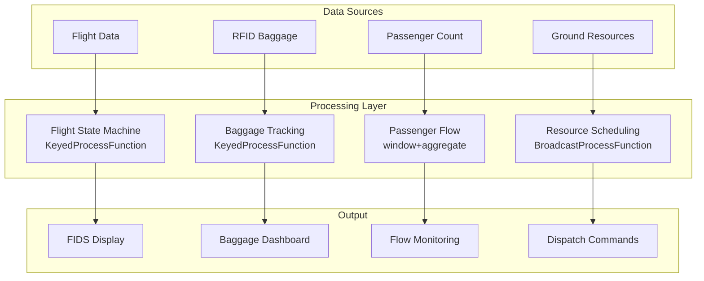

# Operators and Real-Time Airport Operations

> **Stage**: Knowledge/10-case-studies | **Prerequisites**: [01.07-two-input-operators.md](../Knowledge/01-concept-atlas/operator-deep-dive/01.07-two-input-operators.md), [realtime-port-logistics-case-study.md](./realtime-port-logistics-case-study.md) | **Formalization Level**: L3
> **Document Positioning**: Operator fingerprints and pipeline design for stream processing operators in real-time flight scheduling, baggage tracking, and passenger services
> **Version**: 2026.04

---

## Table of Contents

- [1. Definitions](#1-definitions)
- [2. Properties](#2-properties)
- [3. Relations](#3-relations)
- [4. Argumentation](#4-argumentation)
- [5. Proof / Engineering Argument](#5-proof--engineering-argument)
- [6. Examples](#6-examples)
- [7. Visualizations](#7-visualizations)
- [8. References](#8-references)

---

## 1. Definitions

### Def-AIR-01-01: Airport Collaborative Decision Making (机场协同决策, A-CDM)

A-CDM is a collaborative mechanism among airport stakeholders for sharing real-time information:

$$\text{A-CDM} = (\text{Airlines}, \text{ATC}, \text{Airport}, \text{GroundHandlers})$$

### Def-AIR-01-02: Turnaround Time (航班周转时间)

Turnaround Time is the duration from aircraft landing to its next takeoff:

$$T_{turn} = T_{taxi-in} + T_{deplane} + T_{clean} + T_{refuel} + T_{board} + T_{taxi-out}$$

Objective: narrow-body aircraft $T_{turn} < 40$ minutes, wide-body aircraft $T_{turn} < 90$ minutes.

### Def-AIR-01-03: Baggage Handling System (行李处理系统, BHS)

BHS is an automated baggage sorting and conveyor system:

$$\text{BHS}_{capacity} = \sum_{i} v_i \cdot \rho_i$$

where $v_i$ is the conveyor belt speed and $\rho_i$ is the baggage density.

### Def-AIR-01-04: Gate Assignment (登机口分配)

Gate Assignment is the allocation of the optimal parking position for arriving flights:

$$\text{Gate}^* = \arg\min_{g} (\alpha \cdot D_{walk} + \beta \cdot D_{taxi} + \gamma \cdot T_{conflict})$$

### Def-AIR-01-05: Passenger Flow Density (旅客流量密度)

$$\rho_{pax} = \frac{N_{pax}}{A_{terminal}}$$

---

## 2. Properties

### Lemma-AIR-01-01: Baggage Mishandling Rate

$$P_{mishandled} = 1 - (1 - p_{scan})^n$$

where $p_{scan}$ is the single-scan accuracy rate and $n$ is the number of scans. Multiple scans can significantly reduce the mishandling rate.

### Lemma-AIR-01-02: Security Checkpoint Queuing

$$W_q = \frac{\lambda}{\mu(\mu - \lambda)}$$

where $\lambda$ is the passenger arrival rate and $\mu$ is the security screening processing rate.

### Prop-AIR-01-01: A-CDM Delay Improvement

$$\Delta Delay = Delay_{before} - Delay_{after} \approx 15\text{-}30\%$$

### Prop-AIR-01-02: Self-Service Check-In Penetration Rate

$$\text{SelfServiceRate} = \frac{N_{self}}{N_{total}}$$

Large airports can achieve self-service check-in rates of 70-85%.

---

## 3. Relations

### 3.1 Airport Operations Pipeline Operator Mapping

| Application Scenario | Operator Combination | Data Source | Latency Requirement |
|---------|---------|--------|---------|
| **Flight Dynamics** | Source + map | Airlines / ATC | < 1min |
| **Gate Assignment** | ProcessFunction | Flight Schedule | < 5min |
| **Baggage Tracking** | KeyedProcessFunction | RFID / BHS | < 1min |
| **Passenger Flow** | window + aggregate | Security / Gates | < 5min |
| **Delay Prediction** | AsyncFunction | Multi-source Data | < 15min |
| **Resource Scheduling** | Broadcast + ProcessFunction | Ground Resources | < 1min |

### 3.2 Operator Fingerprint

| Dimension | Airport Operations Characteristics |
|------|------------|
| **Core Operators** | ProcessFunction (Gate State Machine), KeyedProcessFunction (Baggage Tracking), BroadcastProcessFunction (Resource Scheduling), AsyncFunction (Delay Prediction) |
| **State Types** | ValueState (Flight Status), MapState (Baggage Location), BroadcastState (Resource Availability) |
| **Time Semantics** | Processing time primarily (operations emphasize real-time responsiveness) |
| **Data Characteristics** | High concurrency (tens of thousands of passengers/day), strong temporal constraints, multi-organization collaboration |
| **State Hotspots** | Peak-hour flight keys, popular route keys |
| **Performance Bottlenecks** | External ATC data interfaces, multi-organization data synchronization |

---

## 4. Argumentation

### 4.1 Why Airports Need Stream Processing Instead of Traditional AODB

Problems with traditional AODB (Airport Operational Database):
- Batch updates: Flight status updates delayed by 5-15 minutes
- Information silos: Each system operates independently, making collaboration difficult
- Passive response: Adjustments only made after delays occur

Advantages of stream processing:
- Real-time updates: Flight dynamics synchronized at second-level granularity
- Collaborative decision-making: All stakeholders share a single source of information
- Proactive prediction: Predict delays based on real-time data and adjust in advance

### 4.2 Prevention of Baggage Mishandling

**Problem**: Global baggage mishandling rate is approximately 0.5-1%.

**Stream Processing Solution**: Baggage RFID real-time tracking → automatic sorting → anomaly alerts → manual intervention.

### 4.3 Passenger Congestion Mitigation

**Scenario**: Security checkpoint queues exceed 30 minutes during peak hours.

**Stream Processing Solution**: Real-time passenger flow monitoring → congestion prediction → dynamic channel opening → guided diversion.

---

## 5. Proof / Engineering Argument

### 5.1 Real-Time Flight Dynamics Tracking

```java
// Flight data stream
DataStream<FlightUpdate> flights = env.addSource(new FlightDataSource());

// Flight state machine
flights.keyBy(FlightUpdate::getFlightId)
    .process(new KeyedProcessFunction<String, FlightUpdate, FlightStatus>() {
        private ValueState<FlightState> flightState;
        
        @Override
        public void processElement(FlightUpdate update, Context ctx, Collector<FlightStatus> out) throws Exception {
            FlightState state = flightState.value();
            if (state == null) state = new FlightState(update.getFlightId());
            
            state.transition(update.getStatus());
            
            // Delay detection
            if (update.getEstimatedTime() != null && update.getScheduledTime() != null) {
                long delay = update.getEstimatedTime() - update.getScheduledTime();
                if (delay > 900000) {  // Exceeds 15 minutes
                    out.collect(new FlightStatus(update.getFlightId(), "DELAYED", delay, ctx.timestamp()));
                }
            }
            
            flightState.update(state);
        }
    })
    .addSink(new FlightDisplaySink());
```

### 5.2 Real-Time Baggage Tracking

```java
// Baggage RFID scan
DataStream<BaggageScan> scans = env.addSource(new RFIDSource());

// Baggage tracking
scans.keyBy(BaggageScan::getBaggageId)
    .process(new KeyedProcessFunction<String, BaggageScan, BaggageLocation>() {
        private ValueState<BaggageRoute> routeState;
        
        @Override
        public void processElement(BaggageScan scan, Context ctx, Collector<BaggageLocation> out) throws Exception {
            BaggageRoute route = routeState.value();
            if (route == null) route = new BaggageRoute(scan.getBaggageId());
            
            route.addCheckpoint(scan.getLocation(), scan.getTimestamp());
            
            // Anomaly detection: no movement for extended time
            if (route.getDwellTime() > 1800000) {  // 30 minutes
                out.collect(new BaggageLocation(scan.getBaggageId(), scan.getLocation(), "STUCK", ctx.timestamp()));
            }
            
            // Mishandling detection: not on expected path
            if (!route.isOnExpectedPath()) {
                out.collect(new BaggageLocation(scan.getBaggageId(), scan.getLocation(), "MISROUTED", ctx.timestamp()));
            }
            
            routeState.update(route);
        }
    })
    .addSink(new BaggageTrackingSink());
```

---

## 6. Examples

### 6.1 Practice: Large Hub Airport A-CDM

```java
// 1. Multi-source data ingestion
DataStream<FlightUpdate> flights = env.addSource(new FlightDataSource());
DataStream<BaggageScan> baggage = env.addSource(new RFIDSource());
DataStream<PassengerCount> pax = env.addSource(new PassengerCounterSource());

// 2. Flight dynamics
flights.keyBy(FlightUpdate::getFlightId)
    .process(new FlightStateMachine())
    .addSink(new FlightDisplaySink());

// 3. Baggage tracking
baggage.keyBy(BaggageScan::getBaggageId)
    .process(new BaggageTracker())
    .addSink(new BaggageDisplaySink());

// 4. Passenger flow
pax.keyBy(PassengerCount::getZoneId)
    .window(SlidingProcessingTimeWindows.of(Time.minutes(5), Time.minutes(1)))
    .aggregate(new PassengerFlowAggregate())
    .addSink(new FlowDashboardSink());
```

---

## 7. Visualizations

### Airport Operations Pipeline



---

## 8. References

[^1]: IATA, "Airport Collaborative Decision Making (A-CDM)", https://www.iata.org/

[^2]: ACI, "Airport Operations Guidelines", https://aci.aero/

[^3]: Wikipedia, "Airport Operations", https://en.wikipedia.org/wiki/Airport_operation

[^4]: Wikipedia, "Baggage Handling System", https://en.wikipedia.org/wiki/Baggage_handling_system

[^5]: Apache Flink Documentation, "KeyedProcessFunction", https://nightlies.apache.org/flink/flink-docs-stable/docs/dev/datastream/operators/process_function/

[^6]: Eurocontrol, "A-CDM Implementation Manual", 2023.

---

*Related Documents*: [01.07-two-input-operators.md](../Knowledge/01-concept-atlas/operator-deep-dive/01.07-two-input-operators.md) | [realtime-port-logistics-case-study.md](./realtime-port-logistics-case-study.md) | [realtime-traffic-management-case-study.md](./realtime-traffic-management-case-study.md)
