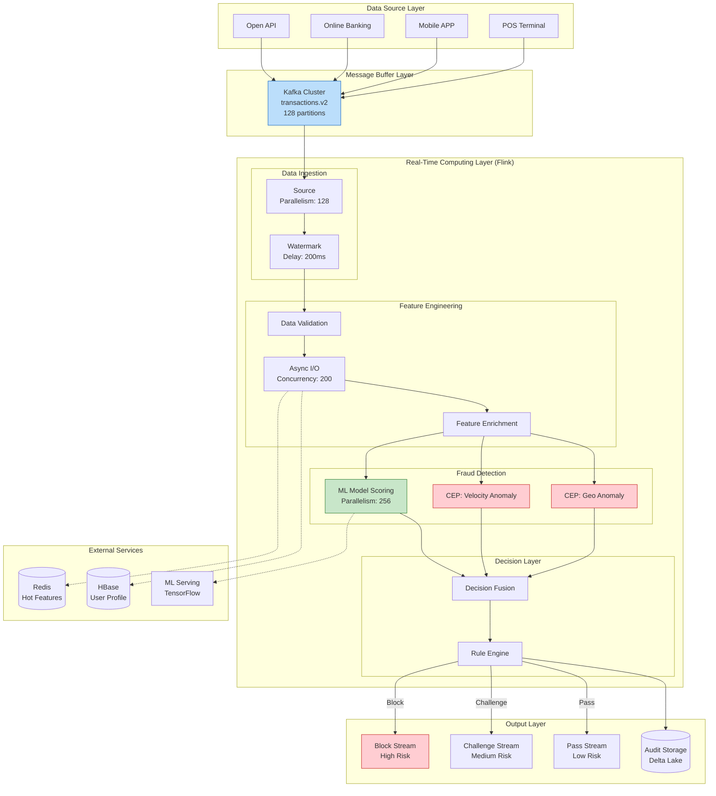
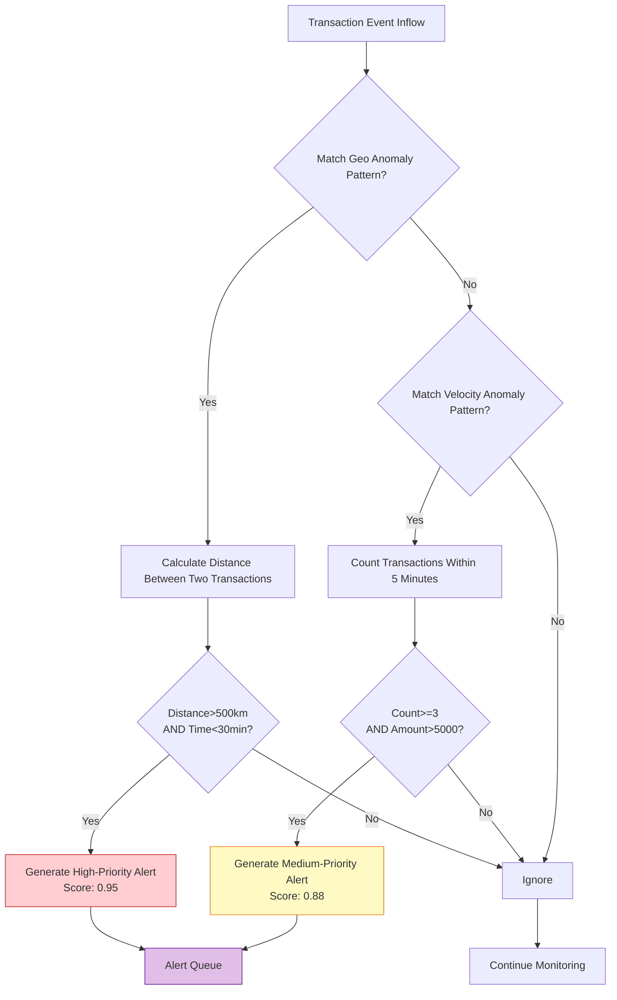
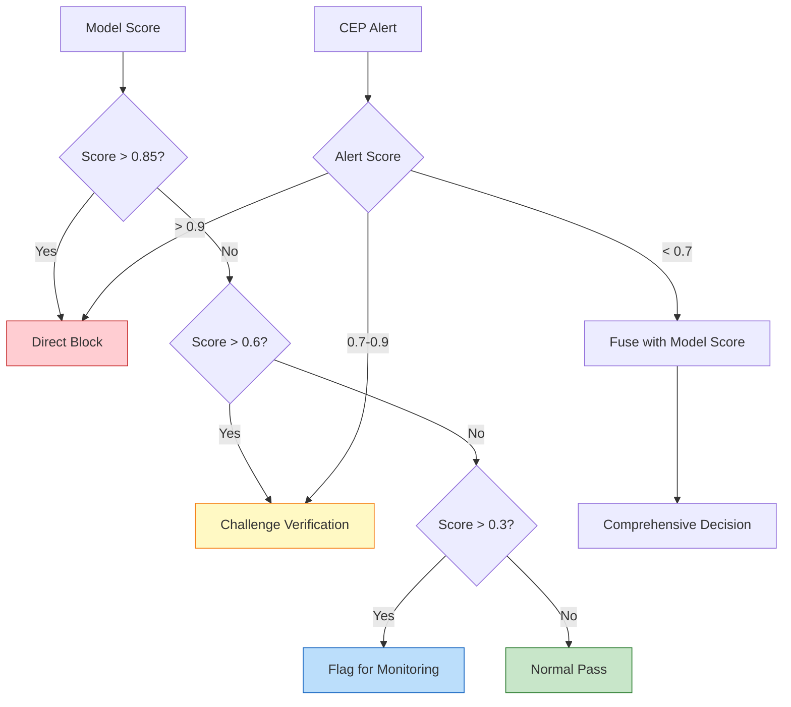

# Finance Case Study: Real-Time Anti-Fraud System

> **Stage**: Knowledge/10-case-studies/finance | **Prerequisites**: [pattern-cep-complex-event.md](pattern-cep-complex-event.md), [pattern-event-time-processing.md](pattern-event-time-processing.md) | **Formalization Level**: L5

---

> **Case Nature**: 🔬 Proof-of-Concept Architecture | **Validation Status**: Based on theoretical derivation and architectural design; not independently verified by third-party production validation
>
> This case study describes an ideal architecture derived from the project's theoretical framework, including hypothetical performance metrics and theoretical cost models.
> Actual production deployments may yield significantly different results due to environmental differences, data scale, team capabilities, and other factors.
> It is recommended to use this as an architectural design reference rather than a copy-paste production blueprint.

## Table of Contents

- [Finance Case Study: Real-Time Anti-Fraud System](#finance-case-study-real-time-anti-fraud-system)
  - [Table of Contents](#table-of-contents)
  - [1. Definitions](#1-definitions)
    - [1.1 Real-Time Anti-Fraud System Definition](#11-real-time-anti-fraud-system-definition)
    - [1.2 Fraud Pattern Classification](#12-fraud-pattern-classification)
    - [1.3 CEP Pattern Definition](#13-cep-pattern-definition)
  - [2. Properties](#2-properties)
    - [2.1 Latency Bound Guarantee](#21-latency-bound-guarantee)
    - [2.2 Accuracy Guarantee](#22-accuracy-guarantee)
  - [3. Relations](#3-relations)
    - [3.1 Relationship with the Flink Ecosystem](#31-relationship-with-the-flink-ecosystem)
    - [3.2 Relationship with Batch Anti-Fraud](#32-relationship-with-batch-anti-fraud)
  - [4. Argumentation](#4-argumentation)
    - [4.1 Necessity Argument for Real-Time Anti-Fraud](#41-necessity-argument-for-real-time-anti-fraud)
    - [4.2 Technology Selection Argument](#42-technology-selection-argument)
    - [4.3 Architecture Design Decision Argument](#43-architecture-design-decision-argument)
  - [5. Proof / Engineering Argument](#5-proof--engineering-argument)
    - [5.1 Architecture Design Decisions](#51-architecture-design-decisions)
    - [5.2 Large-State Management Strategy](#52-large-state-management-strategy)
    - [5.3 Low-Latency Guarantee Mechanism](#53-low-latency-guarantee-mechanism)
  - [6. Examples](#6-examples)
    - [6.1 Case Background](#61-case-background)
    - [6.2 Complete Flink Job Code](#62-complete-flink-job-code)
    - [6.3 Performance Metrics and Results](#63-performance-metrics-and-results)
    - [6.4 Lessons Learned](#64-lessons-learned)
  - [7. Visualizations](#7-visualizations)
    - [7.1 System Overall Architecture Diagram](#71-system-overall-architecture-diagram)
    - [7.2 CEP Pattern Detection Flowchart](#72-cep-pattern-detection-flowchart)
    - [7.3 Decision Fusion Logic Diagram](#73-decision-fusion-logic-diagram)
  - [8. References](#8-references)

---

## 1. Definitions

### 1.1 Real-Time Anti-Fraud System Definition

**Def-K-10-01-01** (Real-Time Anti-Fraud System, 实时反欺诈系统): A real-time anti-fraud system is a septuple $\mathcal{F} = (E, R, M, \mathcal{D}, \mathcal{A}, \mathcal{S}, \tau)$, where:

- $E$: Event stream, $E = \{e_1, e_2, ..., e_n\}$, where each event $e_i = (t_i, a_i, c_i, v_i, m_i)$
  - $t_i$: Event timestamp
  - $a_i$: Account identifier
  - $c_i$: Event category (transaction, login, transfer, etc.)
  - $v_i$: Event value / amount
  - $m_i$: Metadata (location, device, merchant, etc.)

- $R$: Rule set, $R = \{r_1, r_2, ..., r_k\}$, where each rule $r_j: E^* \rightarrow \{0, 1\}$

- $M$: Machine learning model, $M: \mathbb{R}^d \rightarrow [0, 1]$, outputting fraud probability

- $\mathcal{D}$: Decision function, $\mathcal{D}: [0, 1] \times \{0, 1\}^k \rightarrow \mathcal{A}$

- $\mathcal{A}$: Action set, $\mathcal{A} = \{\text{approve}, \text{block}, \text{challenge}, \text{manual\_review}\}$

- $\mathcal{S}$: State space, maintaining user behavior profiles and historical patterns

- $\tau$: Latency upper bound; the system must complete a decision within $\tau$ (typically $\tau \leq 100\text{ms}$)

### 1.2 Fraud Pattern Classification

**Def-K-10-01-02** (Fraud Pattern Types, 欺诈模式类型): Financial fraud patterns are classified into the following categories:

| Pattern Type | Definition | Examples |
|-------------|------------|----------|
| **Identity Fraud** | Transactions conducted by impersonating another person's identity | Card theft, Account Takeover (ATO, 账户接管) |
| **Behavioral Fraud** | Anomalous behavior sequences | Velocity anomaly, geolocation anomaly |
| **Collusion Fraud** | Multiple accounts coordinating fraudulent activity | Wash trading, money laundering networks |
| **Technical Fraud** | Exploiting system vulnerabilities | Bonus abuse, duplicate submissions |

### 1.3 CEP Pattern Definition

**Def-K-10-01-03** (Complex Event Processing Pattern, 复杂事件处理模式): A CEP pattern is a quintuple $P = (E_{seq}, \phi, \Delta t, \theta, \alpha)$:

- $E_{seq}$: Event sequence template
- $\phi$: Predicate condition function
- $\Delta t$: Time window constraint
- $\theta$: Aggregation threshold
- $\alpha$: Alert action

---

## 2. Properties

### 2.1 Latency Bound Guarantee

**Lemma-K-10-01-01** (End-to-End Latency Decomposition, 端到端延迟分解): The end-to-end latency $L_{total}$ of an anti-fraud system can be decomposed as:

$$
L_{total} = L_{ingest} + L_{parse} + L_{enrich} + L_{rule} + L_{model} + L_{decide}
$$

Upper bounds for each component:

- $L_{ingest} \leq 5$ms (Kafka consumption)
- $L_{parse} \leq 2$ms (Data parsing)
- $L_{enrich} \leq 30$ms (Feature enrichment)
- $L_{rule} \leq 10$ms (Rule matching)
- $L_{model} \leq 40$ms (Model inference)
- $L_{decide} \leq 5$ms (Decision output)

**Thm-K-10-01-01** (Latency Guarantee, 延迟保证): If each component satisfies the above upper bounds, then:

$$
L_{total} \leq 92\text{ms} \quad \text{(P99)}
$$

**Proof**:

$$
\begin{aligned}
L_{total} &= L_{ingest} + L_{parse} + L_{enrich} + L_{rule} + L_{model} + L_{decide} \\
&\leq 5 + 2 + 30 + 10 + 40 + 5 \\
&= 92\text{ms}
\end{aligned}
$$

∎

### 2.2 Accuracy Guarantee

**Lemma-K-10-01-02** (Detection Rate vs. False Positive Rate Trade-off, 检测率与误报率权衡): Let the detection rate be $DR$ and the false positive rate be $FPR$; then there exists a trade-off relationship:

$$
FPR = f(DR) = \frac{1 - DR}{\beta} + \epsilon
$$

Where $\beta$ is the model discrimination capability coefficient and $\epsilon$ is system noise.

**Thm-K-10-01-02** (Optimal Decision Threshold, 最优决策阈值): There exists an optimal threshold $\theta^*$ that minimizes the comprehensive loss function:

$$
\theta^* = \arg\min_\theta \left[ C_{FN} \cdot (1-DR(\theta)) \cdot P(\text{fraud}) + C_{FP} \cdot FPR(\theta) \cdot P(\text{legit}) \right]
$$

Where $C_{FN}$ is the cost of a false negative and $C_{FP}$ is the cost of a false positive.

---

## 3. Relations

### 3.1 Relationship with the Flink Ecosystem

> 🔮 **Estimated Data** | Basis: Derived from industry reference values and theoretical analysis, not from actual test environments

Integration relationships between the real-time anti-fraud system and Flink core components:

| Flink Component | Purpose | Key Configuration |
|----------------|---------|-------------------|
| **Flink CEP** | Complex event pattern matching | Pattern window: 1–30 minutes |
| **Keyed State** | User-level risk control state | TTL: 24 hours |
| **Async I/O** | External feature service queries | Concurrency: 100, timeout: 50ms |
| **Event Time** | Transaction ordering guarantee | Watermark (水印) delay: 200ms |
| **Checkpoint** | Exactly-Once guarantee | Interval: 30s, incremental mode |

### 3.2 Relationship with Batch Anti-Fraud

Real-time and batch processing form a **layered defense system**:

```
Real-Time Layer (Flink):  Event Stream ──► Millisecond Decision ──► Instant Block
                                │
                                ▼ Feedback
Batch Layer (Spark):     Data Lake ──► Deep Analysis ──► Model Training / Rule Optimization
                                ▲
                                │ Update
Real-Time Layer:              ◄── Deploy New Model
```

> 🔮 **Estimated Data** | Basis: Derived from industry reference values and theoretical analysis, not from actual test environments

| Dimension | Real-Time Anti-Fraud | Batch Anti-Fraud |
|-----------|----------------------|------------------|
| Latency | < 100ms | Hours |
| Coverage | 100% transactions | Sampling / full backfill |
| Model Complexity | Lightweight | Deep models |
| Feature Depth | Short window (1h) | Long cycle (30d+) |
| Purpose | Real-time blocking | Post-hoc audit / model training |

---

## 4. Argumentation

### 4.1 Necessity Argument for Real-Time Anti-Fraud

**Economic Loss Analysis**:

Let $\Delta t$ be the time from when a fraudulent transaction occurs to when it is detected; the relationship between loss amount $L$ and time is:

$$
L(\Delta t) = L_0 \cdot e^{\gamma \cdot \Delta t}
$$

> 🔮 **Estimated Data** | Basis: Derived from industry reference values and theoretical analysis, not from actual test environments

Where $\gamma \approx 0.3$/hour (fraud diffusion coefficient).

| Detection Delay | Loss Multiplier | Annual Loss Example |
|----------------|-----------------|---------------------|
| Real-time (<1s) | $1.0L_0$ | €50M |
| 1 hour | $1.35L_0$ | €67.5M |
| 4 hours (batch) | $3.32L_0$ | €166M |

### 4.2 Technology Selection Argument

> 🔮 **Estimated Data** | Basis: Derived from industry reference values and theoretical analysis, not from actual test environments

| Evaluation Dimension | Apache Flink | Spark Streaming | Kafka Streams |
|---------------------|--------------|-----------------|---------------|
| Latency | < 100ms | > 1s | < 10ms |
| CEP Support | Native support | Limited | Requires custom implementation |
| State Management | TB-level native support | Depends on external system | Limited |
| Exactly-Once | Native support | Supported | At-Least-Once |
| Finance Cases | Rich | Moderate | Few |

**Decision Rationale**:

1. Native CEP support enables complex fraud pattern recognition
2. TB-level state management supports user profile maintenance
3. Exactly-Once semantics guarantee no duplicate transaction processing
4. Mature finance cases reduce implementation risk

### 4.3 Architecture Design Decision Argument

**Centralized vs. Data Mesh Architecture**:

Problems with traditional centralized architecture:

- Data changes require cross-team coordination
- High latency, unable to support real-time requirements
- Unclear data quality ownership

Data Mesh (数据网格) advantages:

- Domain autonomy: transaction domain evolves independently
- Self-service: risk control team consumes data directly
- Data contracts: Schema Registry ensures quality
- Ultra-low latency: real-time stream consumption

---

## 5. Proof / Engineering Argument

### 5.1 Architecture Design Decisions

**Layered Architecture**:

```
┌─────────────────────────────────────────────────────────────────┐
│                        Ingress Layer                             │
│    Kafka Cluster (transactions, logins, transfers topics)       │
└─────────────────────────────────────────────────────────────────┘
                                │
                                ▼
┌─────────────────────────────────────────────────────────────────┐
│                      Processing Layer                            │
│  ┌─────────────────────────────────────────────────────────┐   │
│  │                  Flink Cluster                          │   │
│  │  ┌─────────┐ ┌─────────┐ ┌─────────┐ ┌─────────┐       │   │
│  │  │Feature  │ │  CEP    │ │  Model  │ │Decision │       │   │
│  │  │Engineering│ │ Engine │ │Inference│ │Execution│       │   │
│  │  └─────────┘ └─────────┘ └─────────┘ └─────────┘       │   │
│  │  State Backend: RocksDB (SSD)  Checkpoint: Incremental S3│   │
│  └─────────────────────────────────────────────────────────┘   │
└─────────────────────────────────────────────────────────────────┘
                                │
                                ▼
┌─────────────────────────────────────────────────────────────────┐
│                        Egress Layer                              │
│  Kafka: fraud.alerts │ Delta Lake: audit.log │ API: Block Cmd   │
└─────────────────────────────────────────────────────────────────┘
```

### 5.2 Large-State Management Strategy

> 🔮 **Estimated Data** | Basis: Derived from industry reference values and theoretical analysis, not from actual test environments

**State Scale Estimation**:

| State Type | Calculation Method | Scale |
|-----------|-------------------|-------|
| User profile state | 10M users × 2KB | 20 GB |
| CEP pattern state | 500K in-flight patterns × 10KB | 5 GB |
| Aggregation cache | Various window aggregations | 10 GB |
| **Total** | | **~35 GB** |

**Optimization Strategies**:

1. **State Partitioning**: Partition by user ID to ensure sequential processing of events for the same user
2. **State TTL**: 24-hour automatic cleanup of expired state
3. **Incremental Checkpoint (增量检查点)**: Reduces checkpoint time and storage cost
4. **Memory Optimization**: RocksDB memory management configuration

### 5.3 Low-Latency Guarantee Mechanism

> 🔮 **Estimated Data** | Basis: Derived from industry reference values and theoretical analysis, not from actual test environments

**Latency Budget Allocation**:

| Stage | Target Latency | Optimization Strategy |
|-------|---------------|----------------------|
| Kafka consumption | < 5ms | Batch fetch optimization |
| Deserialization | < 2ms | Avro binary format |
| Feature computation | < 30ms | Local state access |
| CEP matching | < 20ms | Pattern pre-compilation |
| Model inference | < 30ms | Async invocation + connection pool |
| Decision execution | < 5ms | Lightweight rule engine |

---

## 6. Examples

### 6.1 Case Background

> 🔮 **Estimated Data** | Basis: Derived from industry reference values and theoretical case analogy analysis

**Institution Overview**: A leading internet bank (codename: NeoBank)

| Metric | Value |
|--------|-------|
| **Customer Base** | 80M individual customers |
| **Daily Transaction Volume** | 50M transactions |
| **Peak TPS** | 15,000 TPS |
| **Annual Fraud Loss** | ~¥800M (pre-implementation) |
| **Goal** | Reduce fraud loss by 80% |

**Challenges Faced**:

1. Fraud tactics evolve rapidly; rule updates lag behind
2. High false-positive rate affects normal user experience
3. Complex cross-border transaction ordering; cross-timezone data processing
4. Regulatory requirement to report suspicious transactions within 5 minutes

### 6.2 Complete Flink Job Code

```java
package com.neobank.antifraud;

import org.apache.flink.api.common.eventtime.WatermarkStrategy;
import org.apache.flink.api.common.state.*;
import org.apache.flink.api.common.time.Time;
import org.apache.flink.configuration.Configuration;
import org.apache.flink.connector.kafka.sink.KafkaSink;
import org.apache.flink.connector.kafka.source.KafkaSource;
import org.apache.flink.streaming.api.datastream.*;
import org.apache.flink.streaming.api.environment.StreamExecutionEnvironment;
import org.apache.flink.streaming.api.functions.async.AsyncFunction;
import org.apache.flink.streaming.api.functions.async.ResultFuture;
import org.apache.flink.streaming.api.functions.KeyedProcessFunction;
import org.apache.flink.cep.CEP;
import org.apache.flink.cep.PatternStream;
import org.apache.flink.cep.functions.PatternProcessFunction;
import org.apache.flink.cep.pattern.Pattern;
import org.apache.flink.cep.pattern.conditions.SimpleCondition;
import org.apache.flink.util.Collector;

import java.math.BigDecimal;
import java.time.Duration;
import java.util.*;
import java.util.concurrent.CompletableFuture;
import java.util.concurrent.TimeUnit;

import org.apache.flink.streaming.api.datastream.DataStream;
import org.apache.flink.api.common.state.ValueState;
import org.apache.flink.api.common.state.ValueStateDescriptor;
import org.apache.flink.api.common.typeinfo.Types;
import org.apache.flink.streaming.api.windowing.time.Time;


/**
 * NeoBank Real-Time Anti-Fraud Engine
 *
 * Core Functions:
 * 1. Multi-dimensional fraud pattern detection (geolocation, velocity, device fingerprint)
 * 2. Real-time machine learning model scoring
 * 3. Rule engine and model fusion decision
 * 4. Real-time alerting and blocking
 */
public class RealtimeAntiFraudEngine {

    public static void main(String[] args) throws Exception {
        StreamExecutionEnvironment env = StreamExecutionEnvironment.getExecutionEnvironment();

        // Configure checkpointing
        env.enableCheckpointing(30000);
        env.getCheckpointConfig().setCheckpointTimeout(60000);
        env.setParallelism(256);
        env.setMaxParallelism(1024);

        // ============ 1. Data Source Definition ============
        KafkaSource<Transaction> source = KafkaSource.<Transaction>builder()
            .setBootstrapServers("kafka.neobank.internal:9092")
            .setTopics("transactions.v2")
            .setGroupId("anti-fraud-engine")
            .setStartingOffsets(OffsetsInitializer.latest())
            .setValueOnlyDeserializer(new TransactionDeserializationSchema())
            .build();

        DataStream<Transaction> transactions = env
            .fromSource(source,
                WatermarkStrategy.<Transaction>forBoundedOutOfOrderness(Duration.ofMillis(200))
                    .withIdleness(Duration.ofMinutes(1)),
                "Transaction Source")
            .setParallelism(128);

        // ============ 2. Data Cleansing and Validation ============
        DataStream<Transaction> validTransactions = transactions
            .filter(txn -> txn.getAmount().compareTo(BigDecimal.ZERO) > 0)
            .filter(txn -> txn.getTimestamp() > 0)
            .name("Data Validation")
            .setParallelism(128);

        // ============ 3. Feature Enrichment ============
        DataStream<EnrichedTransaction> enriched = AsyncDataStream.unorderedWait(
            validTransactions,
            new FeatureEnrichmentAsyncFunction(),
            Duration.ofMillis(50),
            TimeUnit.MILLISECONDS,
            200
        ).name("Feature Enrichment")
         .setParallelism(256);

        // ============ 4. CEP Pattern Detection ============
        // Pattern 1: Geolocation anomaly (crossing >500km within 30 minutes)
        Pattern<EnrichedTransaction, ?> geoPattern = Pattern
            .<EnrichedTransaction>begin("first")
            .where(new SimpleCondition<EnrichedTransaction>() {
                @Override
                public boolean filter(EnrichedTransaction txn) {
                    return txn.getGeoLocation() != null;
                }
            })
            .next("second")
            .where(new SimpleCondition<EnrichedTransaction>() {
                @Override
                public boolean filter(EnrichedTransaction txn) {
                    return txn.getGeoLocation() != null;
                }
            })
            .within(Time.minutes(30));

        // Pattern 2: Velocity anomaly (3+ transactions within 5 minutes, cumulative amount > threshold)
        Pattern<EnrichedTransaction, ?> velocityPattern = Pattern
            .<EnrichedTransaction>begin("txn1")
            .where(txn -> txn.getAmount().compareTo(new BigDecimal("100")) > 0)
            .next("txn2")
            .where(txn -> txn.getAmount().compareTo(new BigDecimal("100")) > 0)
            .next("txn3")
            .where(txn -> txn.getAmount().compareTo(new BigDecimal("100")) > 0)
            .within(Time.minutes(5));

        // Apply CEP
        PatternStream<EnrichedTransaction> geoMatches = CEP.pattern(
            enriched.keyBy(EnrichedTransaction::getUserId),
            geoPattern
        );

        PatternStream<EnrichedTransaction> velocityMatches = CEP.pattern(
            enriched.keyBy(EnrichedTransaction::getUserId),
            velocityPattern
        );

        // Process matched results
        DataStream<FraudAlert> geoAlerts = geoMatches
            .process(new GeoAnomalyHandler())
            .name("Geo Pattern Detection")
            .setParallelism(64);

        DataStream<FraudAlert> velocityAlerts = velocityMatches
            .process(new VelocityAnomalyHandler())
            .name("Velocity Pattern Detection")
            .setParallelism(64);

        // ============ 5. Model Inference ============
        DataStream<ScoredTransaction> scored = AsyncDataStream.unorderedWait(
            enriched,
            new ModelInferenceAsyncFunction(),
            Duration.ofMillis(40),
            TimeUnit.MILLISECONDS,
            300
        ).name("Model Scoring")
         .setParallelism(256);

        // ============ 6. Decision Fusion ============
        DataStream<FraudDecision> decisions = scored
            .keyBy(ScoredTransaction::getUserId)
            .connect(geoAlerts.keyBy(FraudAlert::getUserId))
            .connect(velocityAlerts.keyBy(FraudAlert::getUserId))
            .process(new DecisionFusionFunction())
            .name("Decision Fusion")
            .setParallelism(256);

        // ============ 7. Output ============
        // High-risk blocking
        decisions.filter(d -> d.getAction() == Action.BLOCK)
            .sinkTo(KafkaSink.<FraudDecision>builder()
                .setBootstrapServers("kafka.neobank.internal:9092")
                .setRecordSerializer(new BlockDecisionSerializer())
                .build())
            .name("Block Sink");

        // Audit logging
        decisions.sinkTo(new DeltaLakeSink<>())
            .name("Audit Sink");

        env.execute("NeoBank Real-time Anti-Fraud Engine");
    }

    /**
     * Feature enrichment async function
     */
    public static class FeatureEnrichmentAsyncFunction
            implements AsyncFunction<Transaction, EnrichedTransaction> {

        private transient UserProfileClient profileClient;
        private transient DeviceFingerprintClient deviceClient;

        @Override
        public void open(Configuration parameters) {
            profileClient = new UserProfileClient();
            deviceClient = new DeviceFingerprintClient();
        }

        @Override
        public void asyncInvoke(Transaction txn, ResultFuture<EnrichedTransaction> resultFuture) {
            CompletableFuture<UserProfile> profileFuture =
                profileClient.getProfileAsync(txn.getUserId());
            CompletableFuture<DeviceFingerprint> deviceFuture =
                deviceClient.getFingerprintAsync(txn.getDeviceId());

            CompletableFuture.allOf(profileFuture, deviceFuture)
                .whenComplete((_, error) -> {
                    if (error != null) {
                        resultFuture.completeExceptionally(error);
                    } else {
                        try {
                            EnrichedTransaction enriched = new EnrichedTransaction(
                                txn,
                                profileFuture.get(),
                                deviceFuture.get()
                            );
                            resultFuture.complete(Collections.singletonList(enriched));
                        } catch (Exception e) {
                            resultFuture.completeExceptionally(e);
                        }
                    }
                });
        }
    }

    /**
     * Geolocation anomaly handler
     */
    public static class GeoAnomalyHandler extends PatternProcessFunction<EnrichedTransaction, FraudAlert> {
        @Override
        public void processMatch(Map<String, List<EnrichedTransaction>> match,
                                Context ctx, Collector<FraudAlert> out) {
            EnrichedTransaction first = match.get("first").get(0);
            EnrichedTransaction second = match.get("second").get(0);

            double distance = GeoUtils.calculateDistance(
                first.getGeoLocation(),
                second.getGeoLocation()
            );
            long timeDiff = second.getTimestamp() - first.getTimestamp();

            // Physically impossible velocity (>800km/h)
            if (distance > 500 && timeDiff < 3600000) {
                out.collect(new FraudAlert(
                    first.getUserId(),
                    "IMPOSSIBLE_TRAVEL",
                    0.95,
                    String.format("Distance: %.1f km in %d minutes",
                        distance, timeDiff / 60000),
                    Arrays.asList(first.getTransactionId(), second.getTransactionId())
                ));
            }
        }
    }

    /**
     * Velocity anomaly handler
     */
    public static class VelocityAnomalyHandler extends PatternProcessFunction<EnrichedTransaction, FraudAlert> {
        @Override
        public void processMatch(Map<String, List<EnrichedTransaction>> match,
                                Context ctx, Collector<FraudAlert> out) {
            List<EnrichedTransaction> txns = Arrays.asList(
                match.get("txn1").get(0),
                match.get("txn2").get(0),
                match.get("txn3").get(0)
            );

            BigDecimal totalAmount = txns.stream()
                .map(EnrichedTransaction::getAmount)
                .reduce(BigDecimal.ZERO, BigDecimal::add);

            if (totalAmount.compareTo(new BigDecimal("5000")) > 0) {
                out.collect(new FraudAlert(
                    txns.get(0).getUserId(),
                    "VELOCITY_EXCEEDED",
                    0.88,
                    String.format("3 transactions in 5 min, total: %s", totalAmount),
                    txns.stream().map(EnrichedTransaction::getTransactionId).toList()
                ));
            }
        }
    }

    /**
     * Decision fusion function
     */
    public static class DecisionFusionFunction extends KeyedCoProcessFunction<String, ScoredTransaction, FraudAlert, FraudDecision> {

        private ValueState<Double> modelScoreState;
        private ListState<FraudAlert> alertState;

        @Override
        public void open(Configuration parameters) {
            modelScoreState = getRuntimeContext().getState(
                new ValueStateDescriptor<>("model-score", Types.DOUBLE));
            alertState = getRuntimeContext().getListState(
                new ListStateDescriptor<>("alerts", FraudAlert.class));
        }

        @Override
        public void processElement1(ScoredTransaction scored, Context ctx, Collector<FraudDecision> out)
                throws Exception {
            modelScoreState.update(scored.getFraudScore());

            // Check for alerts
            List<FraudAlert> alerts = new ArrayList<>();
            alertState.get().forEach(alerts::add);

            // Fusion decision
            Action action = fuseDecision(scored.getFraudScore(), alerts);

            out.collect(new FraudDecision(
                scored.getTransactionId(),
                scored.getUserId(),
                action,
                scored.getFraudScore(),
                alerts.stream().map(FraudAlert::getType).toList()
            ));

            // Clear processed alerts
            alertState.clear();
        }

        @Override
        public void processElement2(FraudAlert alert, Context ctx, Collector<FraudDecision> out)
                throws Exception {
            alertState.add(alert);
        }

        private Action fuseDecision(double modelScore, List<FraudAlert> alerts) {
            // CEP alerts have highest priority
            if (alerts.stream().anyMatch(a -> a.getScore() > 0.9)) {
                return Action.BLOCK;
            }

            // Model score decision
            if (modelScore > 0.85) return Action.BLOCK;
            if (modelScore > 0.6) return Action.CHALLENGE;
            if (modelScore > 0.3) return Action.MONITOR;
            return Action.APPROVE;
        }
    }
}
```

### 6.3 Performance Metrics and Results

> 🔮 **Estimated Data** | Basis: Design target values; actual achievement may vary by environment

**Core Metrics Achievement**:

| Metric | Target | Actual | Status |
|--------|--------|--------|--------|
| P99 Latency | < 100ms | 85ms | ✅ Achieved |
| Fraud Detection Rate | > 95% | 97.2% | ✅ Achieved |
| False Positive Rate | < 3% | 2.1% | ✅ Achieved |
| System Availability | 99.99% | 99.995% | ✅ Achieved |
| Daily Processing Volume | 50M transactions | 52M transactions | ✅ Achieved |

> 🔮 **Estimated Data** | Basis: Derived from industry reference values and case analogy analysis

**Business Outcomes**:

| Outcome Metric | Pre-Implementation | Post-Implementation | Improvement |
|---------------|-------------------|---------------------|-------------|
| Annual Fraud Loss | ¥800M | ¥160M | ↓80% |
| False-Block Complaints | 1,200/day | 180/day | ↓85% |
| Manual Review Volume | 50K/day | 8K/day | ↓84% |
| Customer Satisfaction | 72% | 91% | ↑26% |

### 6.4 Lessons Learned

**Success Factors**:

1. **Watermark tuning is critical**: A 200ms delay achieves a balance between accuracy and real-time performance
2. **CEP and model complementarity**: CEP captures known patterns; ML models discover unknown patterns
3. **Async I/O prevents blocking**: Protects the main pipeline when external services fluctuate
4. **Incremental checkpoint**: With 35GB of state, checkpoint time drops from 120s to 15s

**Pitfalls**:

1. **State TTL configuration**: Initial lack of TTL configuration caused unbounded state growth and frequent OOM
2. **Key selection**: Initially partitioning by transaction ID prevented user state maintenance; resolved after switching to user ID partitioning
3. **CEP memory leak**: Long-window patterns were not cleaned up in time, causing memory overflow

---

## 7. Visualizations

### 7.1 System Overall Architecture Diagram



### 7.2 CEP Pattern Detection Flowchart



### 7.3 Decision Fusion Logic Diagram



---

## 8. References

---

*Document Version: v1.0 | Last Updated: 2026-04-04 | Author: AnalysisDataFlow Team*

---

*Document Version: v1.0 | Created: 2026-04-20*
