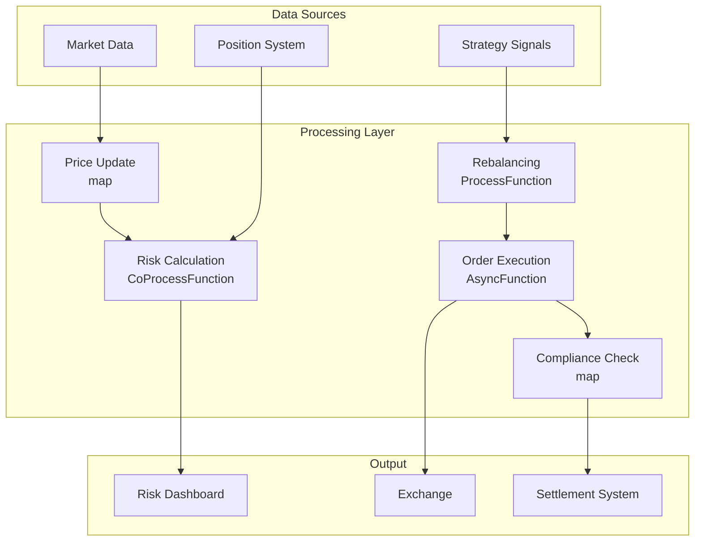

# Operators and Real-time Asset Management

> **Stage**: Knowledge/10-case-studies | **Prerequisites**: [01.10-process-and-async-operators.md](../Knowledge/01-concept-atlas/operator-deep-dive/01.10-process-and-async-operators.md), [realtime-fintech-payment-processing-case-study.md](../Knowledge/10-case-studies/realtime-fintech-payment-processing-case-study.md) | **Formalization Level**: L3
> **Document Positioning**: Operator fingerprints and Pipeline design for stream processing operators in real-time asset pricing, portfolio risk control, and trade execution
> **Version**: 2026.04

---

## Table of Contents

- [1. Definitions](#1-definitions)
- [2. Properties](#2-properties)
- [3. Relations](#3-relations)
- [4. Argumentation](#4-argumentation)
- [5. Proof / Engineering Argument](#5-proof--engineering-argument)
- [6. Examples](#6-examples)
- [7. Visualizations](#7-visualizations)
- [8. References](#8-references)

---

## 1. Definitions

### Def-AST-01-01: Real-time Asset Pricing (实时资产定价)

Real-time Asset Pricing (实时资产定价) is the continuous updating of an asset's fair value based on market data:

$$P_t = P_{t-1} + \Delta P_{market} + \Delta P_{model}$$

where $\Delta P_{market}$ is the market price movement and $\Delta P_{model}$ is the model correction.

### Def-AST-01-02: Value at Risk, VaR (风险价值)

VaR (风险价值) is the maximum potential loss at a given confidence level:

$$\text{VaR}_\alpha = \inf\{l : P(L > l) \leq 1 - \alpha\}$$

### Def-AST-01-03: Portfolio Rebalancing (投资组合再平衡)

Portfolio Rebalancing (投资组合再平衡) is the adjustment of holdings according to target weights:

$$\Delta w_i = w_i^{target} - w_i^{current}$$

### Def-AST-01-04: Algorithmic Execution (算法交易执行)

Algorithmic Execution (算法交易执行) is the strategy of splitting large orders into smaller orders for execution:

$$\min \sum_t (P_t - P_{benchmark})^2 + \lambda \cdot \text{MarketImpact}$$

### Def-AST-01-05: Slippage (滑点)

Slippage (滑点) is the difference between the ordered price and the actual executed price:

$$\text{Slippage} = \frac{P_{fill} - P_{expected}}{P_{expected}}$$

---

## 2. Properties

### Lemma-AST-01-01: Normality Assumption of Returns

Log returns are approximately normally distributed:

$$r_t = \ln(P_t / P_{t-1}) \sim N(\mu, \sigma^2)$$

VaR calculation: $\text{VaR}_\alpha = \mu - z_\alpha \cdot \sigma$

### Lemma-AST-01-02: Optimal Splitting of Transaction Costs

Optimal TWAP (Time-Weighted Average Price) splitting:

$$x_t = \frac{X}{T}, \quad \forall t \in [1, T]$$

**Proof**: Under the uniform distribution assumption, equal partitioning minimizes variance. ∎

### Prop-AST-01-01: Rebalancing Frequency and Tracking Error

$$\text{TrackingError} \propto \frac{1}{\sqrt{f_{rebalance}}}$$

The higher the rebalancing frequency, the smaller the tracking error, but the higher the transaction cost.

### Prop-AST-01-02: Relationship between Market Impact and Order Size

$$\Delta P = \eta \cdot \sigma \cdot \left(\frac{X}{V}\right)^{\gamma}$$

where $X$ is the order volume, $V$ is the average daily trading volume, and $\gamma \approx 0.5$.

---

## 3. Relations

### 3.1 Asset Management Pipeline Operator Mapping

| Application Scenario | Operator Composition | Data Source | Latency Requirement |
|---------|---------|--------|---------|
| **Price Update** | map | Market Data | < 10ms |
| **Risk Calculation** | window+aggregate | Holdings + Market Data | < 1min |
| **Rebalancing** | ProcessFunction | Target Weights | < 5min |
| **Order Execution** | AsyncFunction | Exchange | < 100ms |
| **Compliance Check** | map | Trade Stream | < 10ms |
| **Performance Attribution** | window+aggregate | Historical | Daily |

### 3.2 Operator Fingerprint

| Dimension | Asset Management Characteristics |
|------|------------|
| **Core Operators** | KeyedProcessFunction (holding state), AsyncFunction (trade execution), window+aggregate (risk statistics), BroadcastProcessFunction (strategy update) |
| **State Types** | ValueState (position holdings), MapState (asset prices), BroadcastState (strategy configuration) |
| **Time Semantics** | Processing time dominated (trading emphasizes real-time performance) |
| **Data Characteristics** | High concurrency (ten-thousands of assets), high sensitivity (capital), strong consistency |
| **State Hotspots** | Popular asset keys, large holding keys |
| **Performance Bottlenecks** | External exchange APIs, complex risk models |

---

## 4. Argumentation

### 4.1 Why Asset Management Needs Stream Processing Instead of Traditional End-of-Day Batch Processing

Problems with traditional batch processing:
- End-of-day valuation: Intraday risk exposure is unknown
- T+1 settlement: Long capital occupation time
- Manual decision-making: Unable to capture market opportunities

Advantages of stream processing:
- Real-time risk control: Millisecond-level risk indicator calculation
- Automatic execution: Orders placed immediately upon strategy trigger
- Full lifecycle: Automation from signal to settlement

### 4.2 Coexistence of High-Frequency and Low-Frequency Strategies

**Problem**: The same system needs to support both high-frequency (millisecond-level) and medium/low-frequency (daily-level) strategies simultaneously.

**Solution**: Unified stream processing architecture, meeting different frequency requirements through different window sizes and parallelism.

### 4.3 Pre-trade Compliance Checking

**Scenario**: Each trade must be checked for investment limit violations before execution.

**Stream Processing Solution**: Trade Stream → Compliance Rule Engine → Execute if passed, alert if rejected.

---

## 5. Proof / Engineering Argument

### 5.1 Real-time Position Risk Monitoring

```java
public class RiskMonitorFunction extends KeyedProcessFunction<String, MarketData, RiskReport> {
    private ValueState<PortfolioHoldings> holdings;
    private MapState<String, Double> prices;
    
    @Override
    public void processElement(MarketData data, Context ctx, Collector<RiskReport> out) throws Exception {
        prices.put(data.getSymbol(), data.getPrice());
        
        PortfolioHoldings port = holdings.value();
        if (port == null) return;
        
        // Calculate portfolio value
        double nav = 0;
        double exposure = 0;
        
        for (Position pos : port.getPositions()) {
            Double price = prices.get(pos.getSymbol());
            if (price != null) {
                double value = pos.getQuantity() * price;
                nav += value;
                exposure += Math.abs(value);
            }
        }
        
        // Calculate VaR (simplified: assume normal distribution)
        double portfolioStd = calculatePortfolioStd(port, prices);
        double var95 = 1.645 * portfolioStd;
        double var99 = 2.326 * portfolioStd;
        
        out.collect(new RiskReport(port.getId(), nav, exposure, var95, var99, ctx.timestamp()));
    }
}
```

### 5.2 Algorithmic Trade Execution

```java
// Large order splitting execution
DataStream<ParentOrder> parentOrders = env.addSource(new OrderSource());

parentOrders.keyBy(ParentOrder::getOrderId)
    .process(new KeyedProcessFunction<String, ParentOrder, ChildOrder>() {
        private ValueState<ExecutionState> execState;
        
        @Override
        public void processElement(ParentOrder parent, Context ctx, Collector<ChildOrder> out) throws Exception {
            ExecutionState state = execState.value();
            if (state == null) {
                state = new ExecutionState(parent);
                // Register timer: execute every 30 seconds
                ctx.timerService().registerProcessingTimeTimer(ctx.timestamp() + 30000);
            }
            
            execState.update(state);
        }
        
        @Override
        public void onTimer(long timestamp, OnTimerContext ctx, Collector<ChildOrder> out) {
            ExecutionState state = execState.value();
            if (state == null || state.isComplete()) return;
            
            // TWAP: equal split execution
            double childQty = state.getRemainingQty() / state.getSlicesRemaining();
            
            out.collect(new ChildOrder(state.getParentId(), childQty, state.getSymbol(), timestamp));
            
            state.sliceExecuted(childQty);
            execState.update(state);
            
            // Continue registering timer
            if (!state.isComplete()) {
                ctx.timerService().registerProcessingTimeTimer(timestamp + 30000);
            }
        }
    })
    .addSink(new ExchangeOrderSink());
```

---

## 6. Examples

### 6.1 Practical Example: Quantitative Hedge Fund Real-time Risk Control

```java
// 1. Market data
DataStream<MarketData> market = env.addSource(new MarketDataSource());

// 2. Position updates
DataStream<PositionUpdate> positions = env.addSource(new PositionSource());

// 3. Real-time risk calculation
market.keyBy(MarketData::getSymbol)
    .connect(positions.keyBy(PositionUpdate::getSymbol))
    .process(new CoProcessFunction<MarketData, PositionUpdate, RiskReport>() {
        private ValueState<Double> currentPrice;
        private ValueState<PositionUpdate> currentPosition;
        
        @Override
        public void processElement1(MarketData data, Context ctx, Collector<RiskReport> out) {
            currentPrice.update(data.getPrice());
            calculateAndEmitRisk(out, ctx);
        }
        
        @Override
        public void processElement2(PositionUpdate pos, Context ctx, Collector<RiskReport> out) {
            currentPosition.update(pos);
            calculateAndEmitRisk(out, ctx);
        }
        
        private void calculateAndEmitRisk(Collector<RiskReport> out, Context ctx) {
            Double price = currentPrice.value();
            PositionUpdate pos = currentPosition.value();
            if (price == null || pos == null) return;
            
            double exposure = pos.getQuantity() * price;
            out.collect(new RiskReport(pos.getSymbol(), exposure, ctx.timestamp()));
        }
    })
    .addSink(new RiskDashboardSink());
```

---

## 7. Visualizations

### Asset Management Pipeline



---

## 8. References

[^1]: CFA Institute, "Portfolio Management", https://www.cfainstitute.org/

[^2]: JPMorgan, "RiskMetrics Technical Document", 1996.

[^3]: Wikipedia, "Value at Risk", https://en.wikipedia.org/wiki/Value_at_risk

[^4]: Wikipedia, "Algorithmic Trading", https://en.wikipedia.org/wiki/Algorithmic_trading

[^5]: Apache Flink Documentation, "Stateful Stream Processing", https://nightlies.apache.org/flink/flink-docs-stable/docs/concepts/stateful-stream-processing/

[^6]: ACM, "Real-time Risk Management in Electronic Trading", 2023.

---

*Related Documents*: [01.10-process-and-async-operators.md](../Knowledge/01-concept-atlas/operator-deep-dive/01.10-process-and-async-operators.md) | [realtime-fintech-payment-processing-case-study.md](../Knowledge/10-case-studies/realtime-fintech-payment-processing-case-study.md) | [realtime-financial-risk-control-case-study.md](./realtime-financial-risk-control-case-study.md)
