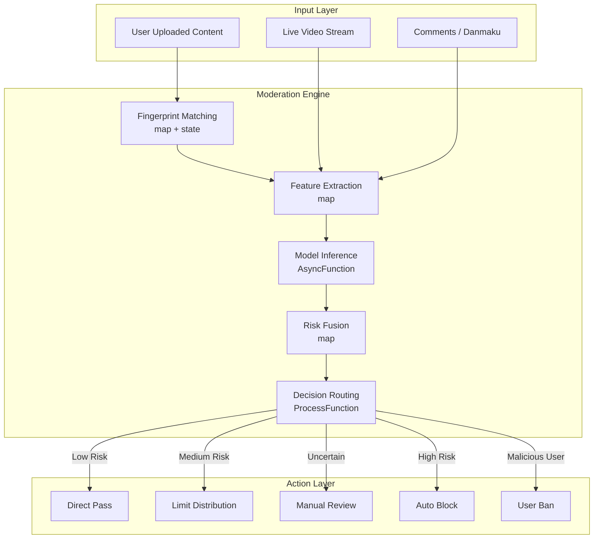
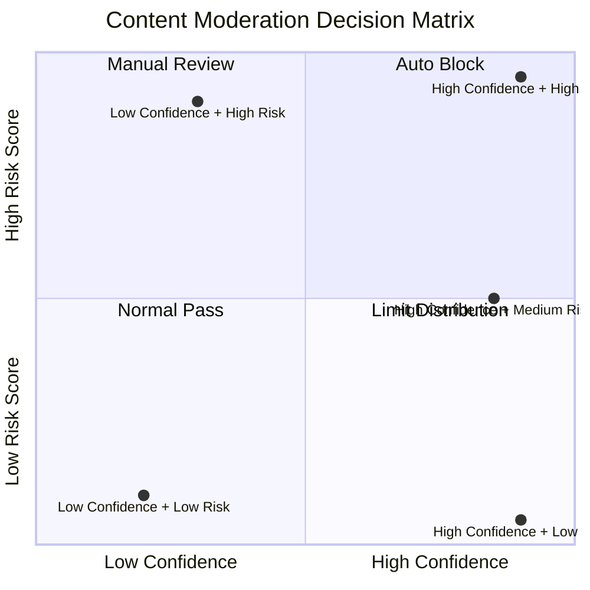

# Operators and Real-Time Content Safety Moderation

> **Stage**: Knowledge/10-case-studies | **Prerequisites**: [01.10-process-and-async-operators.md](../Knowledge/01-concept-atlas/operator-deep-dive/01.10-process-and-async-operators.md), [operator-ai-ml-integration.md](operator-ai-ml-integration.md) | **Formalization Level**: L3
> **Document Positioning**: Operator fingerprints and Pipeline design for streaming operators in real-time content moderation, risk identification, and compliance monitoring
> **Version**: 2026.04

---

## Table of Contents

- [Operators and Real-Time Content Safety Moderation](#operators-and-real-time-content-safety-moderation)
  - [Table of Contents](#table-of-contents)
  - [1. Definitions](#1-definitions)
    - [Def-MOD-01-01: Content Moderation (内容安全审核)](#def-mod-01-01-content-moderation-内容安全审核)
    - [Def-MOD-01-02: Risk Scoring Model (风险评分模型)](#def-mod-01-02-risk-scoring-model-风险评分模型)
    - [Def-MOD-01-03: Moderation Decision Matrix (审核决策矩阵)](#def-mod-01-03-moderation-decision-matrix-审核决策矩阵)
    - [Def-MOD-01-04: Adversarial Example (对抗样本)](#def-mod-01-04-adversarial-example-对抗样本)
    - [Def-MOD-01-05: Content Fingerprint (内容指纹)](#def-mod-01-05-content-fingerprint-内容指纹)
  - [2. Properties](#2-properties)
    - [Lemma-MOD-01-01: Throughput Constraint of Moderation Latency](#lemma-mod-01-01-throughput-constraint-of-moderation-latency)
    - [Lemma-MOD-01-02: False Positive - False Negative Tradeoff](#lemma-mod-01-02-false-positive---false-negative-tradeoff)
    - [Prop-MOD-01-01: Accuracy Improvement of Multi-Model Ensemble](#prop-mod-01-01-accuracy-improvement-of-multi-model-ensemble)
    - [Prop-MOD-01-02: Content Timeliness Decay](#prop-mod-01-02-content-timeliness-decay)
  - [3. Relations](#3-relations)
    - [3.1 Content Moderation Pipeline Operator Mapping](#31-content-moderation-pipeline-operator-mapping)
    - [3.2 Operator Fingerprint](#32-operator-fingerprint)
    - [3.3 Moderation Model Comparison](#33-moderation-model-comparison)
  - [4. Argumentation](#4-argumentation)
    - [4.1 Why Content Moderation Requires Stream Processing Rather Than Offline Batch Processing](#41-why-content-moderation-requires-stream-processing-rather-than-offline-batch-processing)
    - [4.2 Defense Strategies Against Adversarial Examples](#42-defense-strategies-against-adversarial-examples)
    - [4.3 Degradation Strategies Under High Traffic](#43-degradation-strategies-under-high-traffic)
  - [5. Proof / Engineering Argument](#5-proof--engineering-argument)
    - [5.1 Real-Time Content Moderation Pipeline](#51-real-time-content-moderation-pipeline)
    - [5.2 Live Streaming Real-Time Moderation](#52-live-streaming-real-time-moderation)
  - [6. Examples](#6-examples)
    - [6.1 Practice: Social Platform Content Moderation System](#61-practice-social-platform-content-moderation-system)
    - [6.2 Practice: Advertisement Content Compliance Moderation](#62-practice-advertisement-content-compliance-moderation)
  - [7. Visualizations](#7-visualizations)
    - [Content Moderation Pipeline](#content-moderation-pipeline)
    - [Moderation Decision Matrix](#moderation-decision-matrix)
  - [8. References](#8-references)

---

## 1. Definitions

### Def-MOD-01-01: Content Moderation (内容安全审核)

Content Moderation (内容安全审核) is the real-time or offline review of User Generated Content (UGC, 用户生成内容) to identify and handle violations:

$$\text{Moderation} = \{c \in \text{UGC} : \text{Score}(c) > \theta_{violation}\}$$

Moderation types: text (political/terrorism/pornography/advertising/spam), image, video, audio, live stream.

### Def-MOD-01-02: Risk Scoring Model (风险评分模型)

Risk Scoring (风险评分) is the comprehensive violation probability output by a multi-dimensional model:

$$\text{Risk}(c) = \sigma\left(\sum_{i} w_i \cdot f_i(c) + b\right)$$

Where $f_i(c)$ is the output of the $i$-th feature extractor, $\sigma$ is the sigmoid function, and $w_i$ are the weights.

### Def-MOD-01-03: Moderation Decision Matrix (审核决策矩阵)

Moderation decisions are based on a two-dimensional classification of risk score and confidence:

| Risk Score | High Confidence | Low Confidence |
|-----------|-----------------|----------------|
| **High** | Auto Block | Manual Review |
| **Medium** | Limit Distribution | Flag for Observation |
| **Low** | Normal Pass | Normal Pass |

### Def-MOD-01-04: Adversarial Example (对抗样本)

An Adversarial Example (对抗样本) is an input deliberately constructed to deceive the moderation model:

$$x_{adv} = x + \epsilon \cdot \text{sign}(\nabla_x J(\theta, x, y))$$

Where $\epsilon$ is the perturbation magnitude and $J$ is the loss function.

### Def-MOD-01-05: Content Fingerprint (内容指纹)

A Content Fingerprint (内容指纹) is a hash feature of content used for rapid matching against known violations:

$$\text{Fingerprint}(c) = \text{Hash}(\text{Feature}(c))$$

Common algorithms: perceptual hash (pHash), Locality-Sensitive Hashing (LSH, 局部敏感哈希), MinHash.

---

## 2. Properties

### Lemma-MOD-01-01: Throughput Constraint of Moderation Latency

The moderation system must satisfy:

$$\lambda \cdot \mathcal{L} < C$$

Where $\lambda$ is the content arrival rate, $\mathcal{L}$ is the average moderation latency, and $C$ is the system concurrency capacity. When $\lambda \cdot \mathcal{L} \geq C$, the queue will grow indefinitely.

### Lemma-MOD-01-02: False Positive - False Negative Tradeoff

Under a fixed model, reducing the False Positive Rate (FPR, 误报率) necessarily increases the False Negative Rate (FNR, 漏报率):

$$\text{FPR}(\theta) \downarrow \implies \text{FNR}(\theta) \uparrow$$

**Proof**: Raising the threshold $\theta$ causes more content to be classified as safe, reducing false positives but increasing false negatives. ∎

### Prop-MOD-01-01: Accuracy Improvement of Multi-Model Ensemble

The ensemble error upper bound for $N$ independent models:

$$\text{Error}_{ensemble} \leq \frac{1}{N} \sum_{i} \text{Error}_i \cdot (1 - \text{Corr}_{ij})$$

When the correlation between models is low, the ensemble effect is significant.

### Prop-MOD-01-02: Content Timeliness Decay

The propagation value of violating content decays over time:

$$\text{Harm}(t) = \text{Harm}_0 \cdot e^{-\beta t}$$

Where $\beta$ is the decay rate. The net harm of delayed interception is $\int_0^{\mathcal{L}} \text{Harm}(t) \, dt$.

---

## 3. Relations

### 3.1 Content Moderation Pipeline Operator Mapping

| Processing Stage | Operator | Function | Latency Requirement |
|-----------------|----------|----------|-------------------|
| **Content Ingestion** | Source | Receive UGC | < 10ms |
| **Fingerprint Matching** | map + state | Rapid matching of known violations | < 5ms |
| **Feature Extraction** | map | Text/image/video features | < 20ms |
| **Model Inference** | AsyncFunction | Invoke ML model | < 100ms |
| **Risk Scoring** | map | Multi-model fusion scoring | < 5ms |
| **Decision Routing** | ProcessFunction | Route based on score | < 5ms |
| **Action Execution** | AsyncFunction | Delete/throttle/notify | Async |
| **Audit Logging** | map | Record moderation results | < 5ms |

### 3.2 Operator Fingerprint

| Dimension | Content Moderation Characteristics |
|-----------|-----------------------------------|
| **Core Operators** | AsyncFunction (ML inference), KeyedProcessFunction (user behavior state machine), BroadcastProcessFunction (policy update), map (feature extraction) |
| **State Types** | ValueState (user reputation score), MapState (content fingerprint database), BroadcastState (moderation policy) |
| **Time Semantics** | Primarily processing time (moderation emphasizes real-time performance) |
| **Data Characteristics** | High concurrency (million-level QPS), high heterogeneity (text/image/video/audio), strong time sensitivity |
| **State Hotspots** | Popular content fingerprint keys, highly active user keys |
| **Performance Bottlenecks** | ML model inference latency, large-scale fingerprint matching |

### 3.3 Moderation Model Comparison

| Content Type | Model | Latency | Accuracy | Applicable Scenario |
|-------------|-------|---------|----------|-------------------|
| **Text** | BERT/RoBERTa | 10-50ms | 95%+ | Political/pornography/advertising identification |
| **Image** | ResNet/ViT | 20-100ms | 93%+ | Terrorism/pornography/QR code |
| **Video** | 3D-CNN + frame sampling | 100-500ms | 90%+ | Live streaming/short video moderation |
| **Audio** | wav2vec + classifier | 50-200ms | 88%+ | Voice violation identification |
| **Fingerprint** | pHash/LSH | 1-5ms | 99%+ | Known violation matching |

---

## 4. Argumentation

### 4.1 Why Content Moderation Requires Stream Processing Rather Than Offline Batch Processing

Problems with offline batch processing:

- High latency: Violating content has already spread widely within the batch processing interval
- Poor real-time performance: Cannot handle real-time scenarios such as live streaming
- User experience: Normal content is delayed in publication

Advantages of stream processing:

- Real-time interception: Content is moderated instantly upon upload/publication
- Live streaming synchronization: Video streams are reviewed frame-by-frame in real time
- Dynamic policies: Policy updates take effect within seconds

### 4.2 Defense Strategies Against Adversarial Examples

**Attack Methods**:

1. **Text**: Homophone substitution ("涉政" → "涉正"), special symbol insertion
2. **Image**: Adversarial noise, partial occlusion, style transfer
3. **Video**: Rapid flickering, frame rate manipulation

**Defense Strategies**:

1. **Data Augmentation**: Include adversarial examples during training
2. **Multimodal Fusion**: Joint moderation of text + image + audio
3. **Adversarial Training**: Use FGSM/PGD to generate adversarial examples for training

### 4.3 Degradation Strategies Under High Traffic

**Scenario**: An emergency event causes UGC traffic to surge 10x, and ML model inference becomes the bottleneck.

**Degradation Strategies**:

1. **Rule Priority**: High-confidence rules make direct decisions, skipping model inference
2. **Sampling Moderation**: Sample and moderate low-priority content
3. **Asynchronous Processing**: Non-real-time scenarios (e.g., historical content) are transferred to offline queues
4. **Model Caching**: Reuse inference results for similar content

---

## 5. Proof / Engineering Argument

### 5.1 Real-Time Content Moderation Pipeline

```java
public class ContentModerationPipeline {

    public static void main(String[] args) throws Exception {
        StreamExecutionEnvironment env = StreamExecutionEnvironment.getExecutionEnvironment();

        // 1. Content Ingestion
        DataStream<UserContent> content = env.addSource(new ContentSource());

        // 2. Fast Fingerprint Matching
        DataStream<ContentCheckResult> fingerprintChecked = content
            .keyBy(UserContent::getContentHash)
            .process(new FingerprintMatchFunction());

        // 3. Diversion: Directly block known violations
        DataStream<UserContent> toReview = fingerprintChecked
            .filter(r -> !r.isKnownViolation())
            .map(ContentCheckResult::getContent);

        // 4. Multi-Model Inference
        DataStream<ModelScores> textScores = AsyncDataStream.unorderedWait(
            toReview.filter(c -> c.getType().equals("TEXT")),
            new TextModerationFunction(),
            Time.milliseconds(50),
            1000
        );

        DataStream<ModelScores> imageScores = AsyncDataStream.unorderedWait(
            toReview.filter(c -> c.getType().equals("IMAGE")),
            new ImageModerationFunction(),
            Time.milliseconds(100),
            1000
        );

        DataStream<ModelScores> allScores = textScores.union(imageScores);

        // 5. Risk Score Fusion
        DataStream<RiskScore> riskScores = allScores
            .map(new RiskFusionFunction());

        // 6. Decision Routing
        riskScores.keyBy(RiskScore::getContentId)
            .process(new ModerationDecisionFunction())
            .addSink(new ActionSink());

        env.execute("Content Moderation Pipeline");
    }
}

// Fingerprint Matching Operator
public class FingerprintMatchFunction extends KeyedProcessFunction<String, UserContent, ContentCheckResult> {
    private MapState<String, ViolationRecord> fingerprintDB;

    @Override
    public void processElement(UserContent content, Context ctx, Collector<ContentCheckResult> out) throws Exception {
        String hash = content.getContentHash();
        ViolationRecord record = fingerprintDB.get(hash);

        if (record != null) {
            // Known violation, directly block
            out.collect(new ContentCheckResult(content.getId(), true, record.getViolationType(), 1.0));
        } else {
            out.collect(new ContentCheckResult(content.getId(), false, null, 0.0, content));
        }
    }
}

// Moderation Decision Operator
public class ModerationDecisionFunction extends KeyedProcessFunction<String, RiskScore, ModerationAction> {
    private ValueState<UserReputation> userReputation;

    @Override
    public void processElement(RiskScore score, Context ctx, Collector<ModerationAction> out) throws Exception {
        UserReputation rep = userReputation.value();
        if (rep == null) rep = new UserReputation();

        double adjustedThreshold = getAdjustedThreshold(rep);

        String action;
        if (score.getScore() > adjustedThreshold && score.getConfidence() > 0.9) {
            action = "BLOCK";
            rep.incrementViolationCount();
        } else if (score.getScore() > adjustedThreshold * 0.7) {
            action = "REVIEW";
        } else if (score.getScore() > adjustedThreshold * 0.3) {
            action = "LIMIT";
        } else {
            action = "PASS";
        }

        out.collect(new ModerationAction(score.getContentId(), action, score.getScore(), ctx.timestamp()));
        userReputation.update(rep);
    }

    private double getAdjustedThreshold(UserReputation rep) {
        double base = 0.7;
        // Lower threshold for high-violation-rate users
        if (rep.getViolationRate() > 0.1) base -= 0.2;
        // Raise threshold for high-reputation users
        if (rep.getReputationScore() > 0.9) base += 0.1;
        return Math.max(0.3, Math.min(0.9, base));
    }
}
```

### 5.2 Live Streaming Real-Time Moderation

```java
// Live Video Frame Stream
DataStream<VideoFrame> frames = env.addSource(new LiveStreamSource());

// Frame-level Moderation (sample every 5 frames)
DataStream<FrameAuditResult> frameResults = frames
    .filter(f -> f.getSequenceNumber() % 5 == 0)
    .map(new FrameSampler())
    .keyBy(VideoFrame::getStreamId)
    .process(new KeyedProcessFunction<String, VideoFrame, FrameAuditResult>() {
        private ValueState<StreamAuditState> auditState;

        @Override
        public void processElement(VideoFrame frame, Context ctx, Collector<FrameAuditResult> out) throws Exception {
            StreamAuditState state = auditState.value();
            if (state == null) state = new StreamAuditState();

            // Call image moderation model (simplified)
            double risk = callImageModel(frame);
            state.updateRiskHistory(risk);

            // Sliding window average risk
            double avgRisk = state.getWindowedRisk(30);  // Last 30 frames

            // Consecutive high-risk detection
            if (avgRisk > 0.8 && state.getConsecutiveHighRiskFrames() > 10) {
                out.collect(new FrameAuditResult(frame.getStreamId(), "LIVE_BLOCK", avgRisk, ctx.timestamp()));
            } else if (avgRisk > 0.5) {
                out.collect(new FrameAuditResult(frame.getStreamId(), "LIVE_WARNING", avgRisk, ctx.timestamp()));
            }

            auditState.update(state);
        }
    });

// Live stream-level decision
frameResults.keyBy(FrameAuditResult::getStreamId)
    .window(SlidingProcessingTimeWindows.of(Time.seconds(10), Time.seconds(2)))
    .aggregate(new StreamRiskAggregate())
    .filter(r -> r.getMaxRisk() > 0.8)
    .addSink(new LiveStreamControlSink());
```

---

## 6. Examples

### 6.1 Practice: Social Platform Content Moderation System

```java
// Complete moderation pipeline
DataStream<UserContent> content = env.addSource(new KafkaSource<>("user-content"));

// User reputation lookup (Async)
DataStream<UserContentWithRep> contentWithRep = AsyncDataStream.unorderedWait(
    content,
    new UserReputationLookup(),
    Time.milliseconds(20),
    500
);

// Moderation processing
contentWithRep
    .keyBy(c -> c.getContent().getId())
    .process(new ContentModerationFunction())
    .addSink(new ModerationResultSink());

// User behavior update
DataStream<ModerationAction> actions = env.addSource(new ActionSource());
actions.keyBy(ModerationAction::getUserId)
    .process(new UserBehaviorUpdateFunction())
    .addSink(new UserProfileSink());
```

### 6.2 Practice: Advertisement Content Compliance Moderation

```java
// Advertisement content stream
DataStream<Advertisement> ads = env.addSource(new AdSubmissionSource());

// Multi-dimensional moderation
ads.map(ad -> {
    // Text moderation
    double textRisk = textModel.score(ad.getTitle() + " " + ad.getDescription());
    // Image moderation
    double imageRisk = imageModel.score(ad.getImageUrl());
    // Landing page moderation
    double landingRisk = landingPageModel.score(ad.getLandingUrl());

    return new AdRiskScore(ad.getId(), textRisk, imageRisk, landingRisk);
})
.map(score -> {
    double overall = Math.max(score.getTextRisk(), Math.max(score.getImageRisk(), score.getLandingRisk()));
    return new AdModerationResult(score.getAdId(), overall);
})
.filter(r -> r.getRisk() > 0.7)
.addSink(new AdRejectionSink());
```

---

## 7. Visualizations

### Content Moderation Pipeline

The following diagram illustrates the complete content moderation pipeline architecture, showing how different types of content flow through the moderation engine to the action layer.



### Moderation Decision Matrix

The quadrant chart below visualizes the moderation decision matrix based on risk score and confidence level.



---

## 8. References

---

*Related Documents*: [01.10-process-and-async-operators.md](../Knowledge/01-concept-atlas/operator-deep-dive/01.10-process-and-async-operators.md) | [operator-ai-ml-integration.md](operator-ai-ml-integration.md) | [operator-social-media-sentiment-analysis.md](operator-social-media-sentiment-analysis.md)
