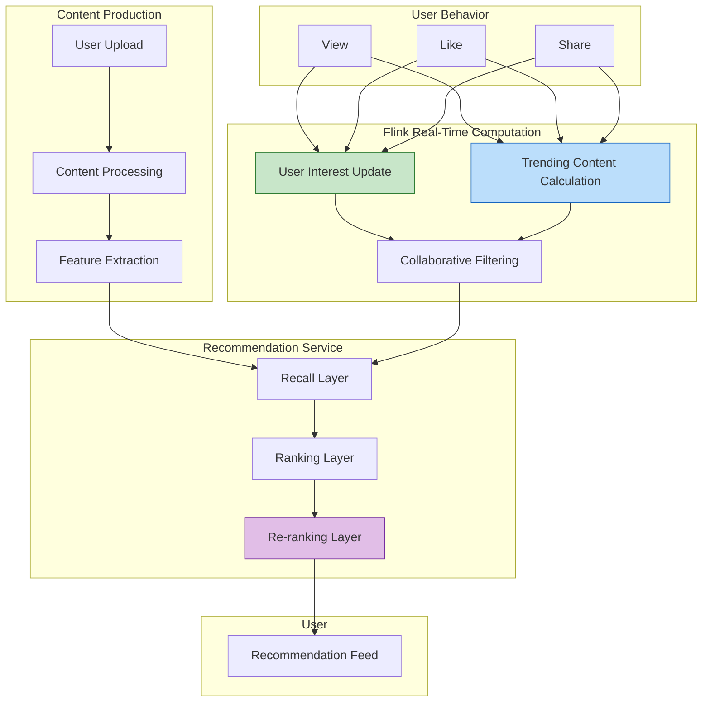

# Social Media Case Study: Real-Time Content Recommendation System

> **Stage**: Knowledge/10-case-studies/social-media | **Prerequisites**: [../Knowledge/02-design-patterns/pattern-stateful-computation.md](../Knowledge/02-design-patterns/pattern-stateful-computation.md) | **Formalization Level**: L4

---

> **Case Nature**: 🔬 Proof-of-Concept Architecture | **Validation Status**: Based on theoretical derivation and architectural design; not independently verified in production by third parties
>
> This case describes an ideal architecture derived from the project's theoretical framework, containing hypothetical performance metrics and a theoretical cost model.
> Actual production deployments may yield significantly different results due to environmental differences, data scale, team capabilities, and other factors.
> It is recommended to use this as an architectural design reference rather than a direct copy-paste production blueprint.

## Table of Contents

- [Social Media Case Study: Real-Time Content Recommendation System](#social-media-case-study-real-time-content-recommendation-system)
  - [Table of Contents](#table-of-contents)
  - [1. Definitions](#1-definitions)
    - [1.1 Content Recommendation System Definition](#11-content-recommendation-system-definition)
    - [1.2 Content Freshness](#12-content-freshness)
    - [1.3 User Interest Model](#13-user-interest-model)
  - [2. Properties](#2-properties)
    - [2.1 Real-Time Update Guarantee](#21-real-time-update-guarantee)
    - [2.2 Content Distribution Fairness](#22-content-distribution-fairness)
  - [3. Relations](#3-relations)
    - [3.1 Recommendation System Components](#31-recommendation-system-components)
  - [4. Argumentation](#4-argumentation)
    - [4.1 Real-Time vs. Batch Recommendation](#41-real-time-vs-batch-recommendation)
    - [4.2 Cold Start Handling](#42-cold-start-handling)
  - [5. Proof / Engineering Argument](#5-proof--engineering-argument)
    - [5.1 Real-Time User Interest Update](#51-real-time-user-interest-update)
    - [5.2 Real-Time Trending Content Calculation](#52-real-time-trending-content-calculation)
  - [6. Examples](#6-examples)
    - [6.1 Case Background](#61-case-background)
    - [6.2 Implementation Results](#62-implementation-results)
  - [7. Visualizations](#7-visualizations)
    - [7.1 Content Recommendation Architecture](#71-content-recommendation-architecture)
  - [8. References](#8-references)

---

## 1. Definitions

### 1.1 Content Recommendation System Definition

**Def-K-10-06-01** (Content Recommendation System / 内容推荐系统): A content recommendation system is a sextuple $\mathcal{C} = (U, P, I, F, M, O)$:

- $U$: Set of users
- $P$: Set of content producers
- $I$: Set of content items, $I = \{i | i = (text, media, timestamp, author)\}$
- $F$: Feature engineering, $F: U \times I \rightarrow \mathbb{R}^d$
- $M$: Recommendation model
- $O$: Ranked output

### 1.2 Content Freshness

**Def-K-10-06-02** (Content Freshness / 内容新鲜度): The freshness of content $i$ at time $t$:

$$
Freshness(i, t) = e^{-\lambda \cdot (t - t_{create})}
$$

Social media platforms typically use $\lambda = \frac{\ln 2}{24h}$ (halving every 24 hours)

### 1.3 User Interest Model

**Def-K-10-06-03** (Dynamic Interest Vector / 动态兴趣向量): User interests evolve over time:

$$
\vec{interest}(t) = (1 - \alpha) \cdot \vec{interest}(t-1) + \alpha \cdot \vec{interaction}(t)
$$

Where $\alpha$ is the learning rate (typically 0.1–0.3)

---

## 2. Properties

### 2.1 Real-Time Update Guarantee

**Lemma-K-10-06-01**: The user interest vector update latency $L_{update}$ and recommendation relevance:

$$
Relevance \propto \frac{1}{1 + \beta \cdot L_{update}}
$$

### 2.2 Content Distribution Fairness

**Lemma-K-10-06-02**: Let the traffic distribution fairness index be $F$:

$$
F = 1 - \frac{\sigma}{\mu}
$$

Where $\sigma$ is the standard deviation of creator impressions and $\mu$ is the mean

---

## 3. Relations

### 3.1 Recommendation System Components

| Component | Function | Update Frequency |
|-----------|----------|-----------------|
| Content Understanding | Text / image feature extraction | At publish time |
| User Profile | Interest vector maintenance | Real-time |
| Recall | Candidate set filtering | Real-time |
| Ranking | Fine-ranking model | Near real-time |
| Re-ranking | Diversity / fairness | Real-time |

---

## 4. Argumentation

### 4.1 Real-Time vs. Batch Recommendation

Particularities of social media:

- Strong content timeliness (hot topics change rapidly)
- Fast-changing user interests
- Dynamic evolution of social relationships
- Requires real-time feedback loop

### 4.2 Cold Start Handling

| Cold Start Type | Solution |
|----------------|----------|
| New User | Default recommendations based on device / location + rapid learning |
| New Content | Content understanding features + creator historical performance |
| New Creator | Cold-start traffic pool + quality assessment |

---

## 5. Proof / Engineering Argument

### 5.1 Real-Time User Interest Update

```java
/**
 * Real-time user interest update
 */

import org.apache.flink.api.common.state.ValueState;
import org.apache.flink.api.common.state.ValueStateDescriptor;
import org.apache.flink.streaming.api.windowing.time.Time;

public class UserInterestUpdater extends KeyedProcessFunction<String, UserEvent, UserProfile> {

    private ValueState<UserProfile> profileState;
    private static final double LEARNING_RATE = 0.2;

    @Override
    public void open(Configuration parameters) {
        StateTtlConfig ttlConfig = StateTtlConfig
            .newBuilder(Time.hours(168))  // 7-day TTL
            .setUpdateType(StateTtlConfig.UpdateType.OnCreateAndWrite)
            .build();

        profileState = getRuntimeContext().getState(
            new ValueStateDescriptor<>("profile", UserProfile.class));
        profileState.enableTimeToLive(ttlConfig);
    }

    @Override
    public void processElement(UserEvent event, Context ctx, Collector<UserProfile> out)
            throws Exception {
        UserProfile profile = profileState.value();
        if (profile == null) {
            profile = new UserProfile(event.getUserId());
        }

        // Extract content interest vector
        double[] contentVector = extractContentVector(event.getContentId());

        // Weight by interaction type
        double weight = getInteractionWeight(event.getAction());

        // Update interest vector (exponentially weighted moving average)
        double[] newInterest = updateInterestVector(
            profile.getInterestVector(),
            contentVector,
            weight,
            LEARNING_RATE
        );

        profile.setInterestVector(newInterest);
        profile.setLastUpdateTime(ctx.timestamp());
        profileState.update(profile);

        // Periodically output updated profile (e.g., every 10 interactions)
        if (profile.getUpdateCount() % 10 == 0) {
            out.collect(profile);
        }
    }

    private double[] updateInterestVector(double[] current, double[] content,
                                          double weight, double alpha) {
        double[] result = new double[current.length];
        for (int i = 0; i < current.length; i++) {
            result[i] = (1 - alpha) * current[i] + alpha * weight * content[i];
        }
        return result;
    }

    private double getInteractionWeight(String action) {
        return switch (action) {
            case "VIEW" -> 0.1;
            case "LIKE" -> 0.5;
            case "COMMENT" -> 1.0;
            case "SHARE" -> 2.0;
            case "FOLLOW" -> 3.0;
            default -> 0.1;
        };
    }
}
```

### 5.2 Real-Time Trending Content Calculation

```java
/**
 * Real-time trending content calculation
 */

import org.apache.flink.streaming.api.environment.StreamExecutionEnvironment;
import org.apache.flink.streaming.api.datastream.DataStream;
import org.apache.flink.api.common.state.ValueState;
import org.apache.flink.api.common.state.ValueStateDescriptor;
import org.apache.flink.streaming.api.windowing.time.Time;

public class TrendingContentCalculator {

    public static void main(String[] args) throws Exception {
        StreamExecutionEnvironment env = StreamExecutionEnvironment.getExecutionEnvironment();

        DataStream<UserEvent> events = env
            .fromSource(createKafkaSource(), WatermarkStrategy.noWatermarks(), "Events");

        // Calculate content hotness score with time decay
        DataStream<ContentScore> trending = events
            .keyBy(UserEvent::getContentId)
            .process(new HotnessCalculator())
            .name("Hotness Calculation");

        // Global Top-K
        DataStream<List<ContentScore>> topK = trending
            .windowAll(TumblingProcessingTimeWindows.of(Time.minutes(1)))
            .aggregate(new TopKAggreagate(100));

        topK.addSink(new TrendingSink());

        env.execute("Trending Content");
    }
}

/**
 * Hotness calculation function with time decay
 */
class HotnessCalculator extends KeyedProcessFunction<String, UserEvent, ContentScore> {

    private ValueState<ContentStats> statsState;
    private static final double DECAY_RATE = Math.log(2) / (24 * 60 * 60 * 1000);  // Halving every 24 hours

    @Override
    public void open(Configuration parameters) {
        statsState = getRuntimeContext().getState(
            new ValueStateDescriptor<>("stats", ContentStats.class));
    }

    @Override
    public void processElement(UserEvent event, Context ctx, Collector<ContentScore> out)
            throws Exception {
        ContentStats stats = statsState.value();
        if (stats == null) {
            stats = new ContentStats(event.getContentId(), ctx.timestamp());
        }

        // Time decay
        long timeDelta = ctx.timestamp() - stats.getLastUpdateTime();
        double decayFactor = Math.exp(-DECAY_RATE * timeDelta);
        stats.applyDecay(decayFactor);

        // Accumulate interaction score
        double interactionScore = calculateInteractionScore(event);
        stats.addScore(interactionScore);

        stats.setLastUpdateTime(ctx.timestamp());
        statsState.update(stats);

        // Output once per minute
        if (ctx.timestamp() - stats.getLastOutputTime() > 60000) {
            out.collect(new ContentScore(
                event.getContentId(),
                stats.getScore(),
                stats.getViewCount(),
                stats.getInteractionCount()
            ));
            stats.setLastOutputTime(ctx.timestamp());
        }
    }
}
```

---

## 6. Examples

### 6.1 Case Background

> 🔮 **Estimated Data** | Basis: Derived from industry reference values and theoretical analysis; not obtained from actual test environments

**Platform**: A short-video social media platform

| Metric | Value |
|--------|-------|
| DAU | 300 million |
| Daily video uploads | 50 million |
| Daily video views | 20 billion |
| Recommendation latency requirement | < 100 ms |

**Challenges**:

1. Slow hot content discovery
2. Untimely user interest capture
3. Difficult content cold start
4. Information cocoon / echo chamber problem

### 6.2 Implementation Results

> 🔮 **Estimated Data** | Basis: Derived from industry reference values and theoretical analysis; not obtained from actual test environments

| Metric | Before Optimization | After Optimization | Improvement |
|--------|--------------------|--------------------|-------------|
| Avg. time spent per user | 65 min | 85 min | 31%↑ |
| Next-day retention | 68% | 75% | 10%↑ |
| Cold-start content CTR | 1.2% | 3.5% | 192%↑ |
| Hot topic discovery latency | 15 min | 30 sec | 97%↓ |

---

## 7. Visualizations

### 7.1 Content Recommendation Architecture



---

## 8. References


---

*Document Version: v1.0 | Last Updated: 2026-04-04*

---

*Document Version: v1.0 | Created: 2026-04-20*
