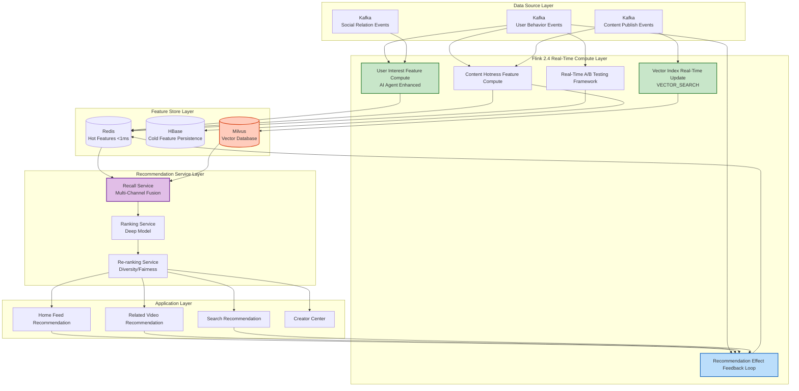
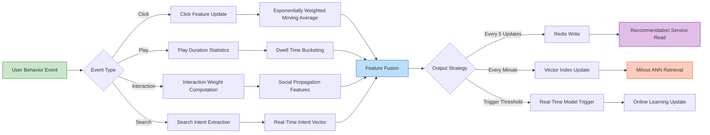
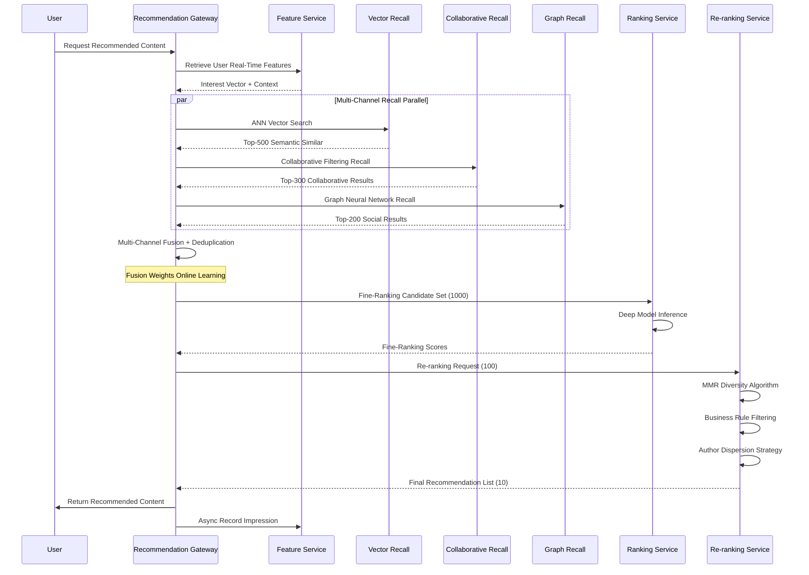

> **Status**: 🔮 Forward-looking Content | **Risk Level**: High | **Last Updated**: 2026-04
>
> The content described in this document is in early planning stages and may differ from the final implementation. Please refer to official Apache Flink releases for authoritative information.
>
# Content Platform Real-Time Recommendation System Production Case Study

> **Stage**: Knowledge/10-case-studies/social-media | **Prerequisites**: [../Knowledge/10-case-studies/social-media/10.4.1-content-recommendation.md](../Knowledge/10-case-studies/social-media/10.4.1-content-recommendation.md), [../Flink/06-ai-ml/flink-ai-agents-flip-531.md](../Flink/06-ai-ml/flink-ai-agents-flip-531.md) | **Formalization Level**: L4

---

> **Case Nature**: 🔬 Proof-of-Concept Architecture | **Validation Status**: Based on theoretical derivation and architectural design; not independently verified in production by third parties
>
> This case describes an ideal architecture derived from the project's theoretical framework, containing hypothetical performance metrics and a theoretical cost model.
> Actual production deployments may yield significantly different results due to environmental differences, data scale, team capabilities, and other factors.
> It is recommended to use this as an architectural design reference rather than a direct copy-paste production blueprint.
>
## Table of Contents

- [Content Platform Real-Time Recommendation System Production Case Study](#content-platform-real-time-recommendation-system-production-case-study)
  - [Table of Contents](#table-of-contents)
  - [1. Definitions](#1-definitions)
    - [1.1 Real-Time Content Recommendation System](#11-real-time-content-recommendation-system)
    - [1.2 User Real-Time Behavior Features](#12-user-real-time-behavior-features)
    - [1.3 Vector Recall and Multi-Channel Fusion](#13-vector-recall-and-multi-channel-fusion)
  - [2. Properties](#2-properties)
    - [2.1 Real-Time Feature Timeliness Guarantee](#21-real-time-feature-timeliness-guarantee)
    - [2.2 Multi-Channel Recall Complementarity](#22-multi-channel-recall-complementarity)
  - [3. Relations](#3-relations)
    - [3.1 System Component Relations](#31-system-component-relations)
    - [3.2 Integration with Flink AI Agents](#32-integration-with-flink-ai-agents)
  - [4. Argumentation](#4-argumentation)
    - [4.1 Feature Cold Start Handling Strategy](#41-feature-cold-start-handling-strategy)
    - [4.2 Real-Time and Offline Consistency Guarantee](#42-real-time-and-offline-consistency-guarantee)
    - [4.3 Recommendation Diversity Guarantee Mechanism](#43-recommendation-diversity-guarantee-mechanism)
  - [5. Proof / Engineering Argument](#5-proof--engineering-argument)
    - [5.1 Low-Latency Feature Engineering Architecture](#51-low-latency-feature-engineering-architecture)
    - [5.2 Real-Time Vector Retrieval Implementation](#52-real-time-vector-retrieval-implementation)
    - [5.3 Real-Time A/B Testing Framework](#53-real-time-ab-testing-framework)
  - [6. Examples](#6-examples)
    - [6.1 Case Background](#61-case-background)
    - [6.2 Technical Architecture Implementation](#62-technical-architecture-implementation)
    - [6.3 Performance Metrics and Effects](#63-performance-metrics-and-effects)
    - [6.4 Key Code Implementation](#64-key-code-implementation)
  - [7. Visualizations](#7-visualizations)
    - [7.1 Overall System Architecture](#71-overall-system-architecture)
    - [7.2 Real-Time Feature Computation Pipeline](#72-real-time-feature-computation-pipeline)
    - [7.3 Recommendation Decision Flow](#73-recommendation-decision-flow)
  - [8. References](#8-references)

---

## 1. Definitions

### 1.1 Real-Time Content Recommendation System

**Def-K-10-07-01** (Real-Time Content Recommendation System, 实时内容推荐系统): A real-time content recommendation system is a septuple $\mathcal{RC} = (U, C, I, F, R, M, S)$:

- $U$: User set, $|U| = N_u$ (100M+ DAU)
- $C$: Content set, $|C| = N_c$ (10M+ new content daily)
- $I$: Interaction event set, $I = \{(u, c, a, t) | u \in U, c \in C, a \in \mathcal{A}, t \in \mathbb{T}\}$
  - $\mathcal{A} = \{\text{Impression}, \text{Click}, \text{Play}, \text{Like}, \text{Comment}, \text{Share}, \text{Follow}, \text{Dwell}\}$
- $F$: Real-time feature engineering, $F: U \times C \times I \rightarrow \mathbb{R}^d$
- $R$: Recall layer, $R: U \times F \rightarrow 2^C$ (multi-channel recall, 多路召回)
- $M$: Ranking model, $M: U \times C \times F \rightarrow \mathbb{R}$ (fine-ranking score)
- $S$: Re-ranking strategy, $S: \text{List}(C) \rightarrow \text{List}(C)$ (diversity/fairness adjustment)

### 1.2 User Real-Time Behavior Features

**Def-K-10-07-02** (User Real-Time Behavior Features, 用户实时行为特征): The real-time feature vector of user $u$ at time $t$ is defined as:

$$
\vec{f}_{user}(u, t) = \left( \vec{f}_{short}, \vec{f}_{session}, \vec{f}_{realtime} \right)
$$

Where:

- **Short-term Interest Features** $\vec{f}_{short}$: Aggregated behavior in the last 15 minutes
- **Session Features** $\vec{f}_{session}$: Behavior sequence within the current session
- **Real-Time Context Features** $\vec{f}_{realtime}$: Time, device, geo-location, etc.

**Dwell Time Feature** (content consumption depth indicator):

$$
\text{DwellScore}(c) = \frac{\sum_{i} \min(\text{dwell}_i, \theta_{max})}{\max(\text{viewCount}, 1)} \cdot \log(1 + \text{viewCount})
$$

Where $\theta_{max}$ is the effective viewing time upper bound (typically 2x video duration) to prevent outlier influence.

### 1.3 Vector Recall and Multi-Channel Fusion

**Def-K-10-07-03** (Vector Similarity Recall, 向量相似度召回): Similar content recall based on vector space:

$$
\text{Recall}_{vector}(u) = \{ c \in C \mid \text{sim}(\vec{v}_u, \vec{v}_c) > \tau \}
$$

Where similarity is computed using cosine similarity:

$$
\text{sim}(\vec{a}, \vec{b}) = \frac{\vec{a} \cdot \vec{b}}{\|\vec{a}\| \|\vec{b}\|}
$$

**Def-K-10-07-04** (Multi-Channel Recall Fusion, 多路召回融合): Let the $k$ recall channel result sets be $\{R_1, R_2, ..., R_k\}$, and the fusion strategy $\Phi$:

$$
\text{Recall}_{fused} = \Phi(R_1, R_2, ..., R_k) = \bigcup_{i=1}^{k} R_i \quad \text{with} \quad \text{score}_{fused}(c) = \sum_{i=1}^{k} w_i \cdot \text{score}_i(c)
$$

Weights $w_i$ are dynamically adjusted through online learning, satisfying $\sum_{i=1}^{k} w_i = 1$.

---

## 2. Properties

### 2.1 Real-Time Feature Timeliness Guarantee

**Lemma-K-10-07-01** (Feature Latency Upper Bound): Let the time from user behavior event generation to feature availability be $L_{feature}$, Flink processing latency be $L_{proc}$, network transmission latency be $L_{net}$, and feature store write latency be $L_{store}$:

$$
L_{feature} = L_{proc} + L_{net} + L_{store}
$$

With proper configuration:

$$
L_{feature} \leq 50\text{ms} \quad \text{(P99)}
$$

**Proof**:

- Flink millisecond-level processing latency: $L_{proc} \leq 10$ms
- Same-city data center network: $L_{net} \leq 5$ms
- Redis write latency: $L_{store} \leq 2$ms
- Total latency: $L_{feature} \leq 17$ms << 50ms SLA

### 2.2 Multi-Channel Recall Complementarity

**Lemma-K-10-07-02** (Recall Coverage Rate): Let the coverage rate of single-channel recall $i$ be $C_i$. The fused coverage rate is:

$$
C_{fused} = 1 - \prod_{i=1}^{k}(1 - C_i) \geq \max_{i} C_i
$$

When recall channels are independent, the fused coverage rate is strictly greater than any single-channel recall.

**Thm-K-10-07-01** (Real-Time Recommendation QPS Capacity): Let the single-node recommendation service QPS be $q$, the cluster node count be $n$, and the cache hit rate be $h$. Then the total system capacity is:

$$
\text{QPS}_{total} = n \cdot q \cdot \frac{1}{1 - h + \epsilon}
$$

Where $\epsilon$ is the system overhead coefficient. When $n = 200$, $q = 3000$, $h = 0.85$:

$$
\text{QPS}_{total} \approx 200 \times 3000 \times \frac{1}{0.15 + 0.05} = 3,000,000 > 500,000 \text{ (target)}
$$

---

## 3. Relations

### 3.1 System Component Relations

```
┌─────────────────────────────────────────────────────────────────┐
│                 Real-Time Recommendation System Architecture     │
├─────────────────────────────────────────────────────────────────┤
│                                                                 │
│   User Behavior ──► Flink Real-Time Feature Compute ──► Feature│
│      │                  │               Store (Redis)           │
│      │                  ▼                      ▼                │
│      │           Real-Time Vector Index   Recommendation        │
│      │                  │               Service Cluster          │
│      │                  ▼                      ▼                │
│      │           Vector Database ──────►  Recall Layer          │
│      │                                     (Multi-Channel)      │
│      │                                     │                    │
│      ▼                                     ▼                    │
│   Real-Time Feedback ◄────────────── Ranking/Re-ranking Layer   │
│      │                                     │                    │
│      └────────────────────────────────► Recommendation Results  │
│                                                                 │
└─────────────────────────────────────────────────────────────────┘
```

### 3.2 Integration with Flink AI Agents

| Component | Flink 2.4 Feature | AI Agents Capability | Application Scenario |
|-----------|-------------------|----------------------|----------------------|
| Feature Engineering | DataStream API | Intelligent Feature Selection | Auto-identify high-value features |
| Vector Retrieval | VECTOR_SEARCH | Semantic Understanding Enhancement | Multi-modal content understanding |
| Real-Time Inference | Model Serving | Adaptive Model | Dynamic model switching |
| A/B Testing | State Backend | Intelligent Traffic Allocation | Real-time effect optimization |

---

## 4. Argumentation

### 4.1 Feature Cold Start Handling Strategy

| Cold Start Type | Problem Description | Solution | Implementation |
|-----------------|---------------------|----------|----------------|
| **New User** | No historical behavior | Demographic defaults + popular content | Default profile based on device/location/time |
| **New Content** | No interaction data | Content understanding features | CV/NLP models extract content embedding |
| **New Creator** | No historical performance | Cold-start traffic pool | Small traffic test + rapid iteration |
| **New Feature** | No statistical value | Offline pre-computation backfill | Batch compute initial values from historical data |

**New User Cold Start Flow**:

```
New User Request
    │
    ▼
┌──────────────┐
│ Profile Exists? │──No──► Create Device Profile ──► Return Default Recommendations
└──────────────┘
    │Yes
    ▼
Check Interaction Count < Threshold?
    │Yes
    ▼
Mixed Recommendation = 0.6 * Popular Content + 0.4 * Similar User Recommendations
```

### 4.2 Real-Time and Offline Consistency Guarantee

**Consistency Challenges**:

1. Real-time feature distribution inconsistent with offline training feature distribution
2. Real-time model version not synchronized with offline model version
3. Feature computation logic differs between online and offline

**Solutions**:

| Layer | Strategy | Implementation |
|-------|----------|----------------|
| **Feature Specification** | Unified feature computation logic | Same Flink codebase, real-time/offline reuse |
| **Feature Store** | Dual-write mechanism | Simultaneously write to real-time store and offline warehouse |
| **Model Sync** | Version control | Unified model metadata management, canary release |
| **Monitoring Verification** | Consistency detection | Real-time comparison of online/offline feature value differences |

### 4.3 Recommendation Diversity Guarantee Mechanism

**Diversity Metric**:

$$
\text{Diversity} = 1 - \frac{2}{n(n-1)} \sum_{i=1}^{n-1} \sum_{j=i+1}^{n} \text{sim}(c_i, c_j)
$$

**Diversity Guarantee Strategies**:

| Layer | Strategy | Implementation |
|-------|----------|----------------|
| **Recall Layer** | Multi-source heterogeneous recall | Collaborative filtering + Vector retrieval + Graph recall |
| **Ranking Layer** | MMR Algorithm | $\text{MMR} = \lambda \cdot \text{Relevance} - (1-\lambda) \cdot \max_{c' \in S} \text{sim}(c, c')$ |
| **Re-ranking Layer** | Sliding window deduplication | Same-category content ratio limit within sliding window |
| **Result Layer** | Author dispersion | Consecutive N recommendations from different authors |

---

## 5. Proof / Engineering Argument

### 5.1 Low-Latency Feature Engineering Architecture

```java
/**
 * User Behavior Real-Time Feature Computation - Production-Grade Implementation
 * Flink 2.4 + AI Agents Integration
 */

import org.apache.flink.streaming.api.environment.StreamExecutionEnvironment;
import org.apache.flink.streaming.api.datastream.DataStream;
import org.apache.flink.api.common.state.ValueState;
import org.apache.flink.api.common.state.ValueStateDescriptor;
import org.apache.flink.streaming.api.CheckpointingMode;
import org.apache.flink.api.common.typeinfo.Types;
import org.apache.flink.streaming.api.windowing.time.Time;

public class UserBehaviorFeatureEngine {

    public static void main(String[] args) throws Exception {
        StreamExecutionEnvironment env = StreamExecutionEnvironment.getExecutionEnvironment();

        // Flink 2.4 configuration optimization
        env.enableCheckpointing(30000, CheckpointingMode.EXACTLY_ONCE);
        env.getCheckpointConfig().setMinPauseBetweenCheckpoints(10000);
        env.setParallelism(512);
        env.setMaxParallelism(2048);
        env.setBufferTimeout(5); // 5ms low-latency mode

        // Enable Flink AI Agent intelligent optimization
        // Note: ai.agent.enabled is a future config parameter (concept), not yet officially implemented
// env.getConfig().setOption("ai.agent.enabled", "true");
        env.getConfig().setOption("ai.agent.optimization.target", "LATENCY");

        // 1. Multi-source behavior event ingestion
        DataStream<UserBehaviorEvent> events = env
            .fromSource(
                KafkaSource.<UserBehaviorEvent>builder()
                    .setBootstrapServers("kafka:9092")
                    .setTopics("user.behavior.clicks", "user.behavior.views",
                               "user.behavior.interactions")
                    .setGroupId("feature-engine")
                    .setStartingOffsets(OffsetsInitializer.latest())
                    .setProperty("fetch.min.bytes", "1")
                    .setProperty("fetch.max.wait.ms", "5")
                    .build(),
                WatermarkStrategy.<UserBehaviorEvent>forBoundedOutOfOrderness(
                    Duration.ofMillis(100))
                    .withIdleness(Duration.ofSeconds(30)),
                "User Behavior Events"
            )
            .setParallelism(256);

        // 2. Real-time session feature computation (low-latency window)
        DataStream<SessionFeature> sessionFeatures = events
            .keyBy(UserBehaviorEvent::getUserId)
            .window(SlidingEventTimeWindows.of(Time.minutes(5), Time.seconds(10)))
            .aggregate(new SessionFeatureAggregator())
            .name("Session Features")
            .setParallelism(512);

        // 3. Real-time interest vector computation (Flink AI Agent enhanced)
        DataStream<UserInterestVector> interestVectors = events
            .keyBy(UserBehaviorEvent::getUserId)
            .process(new AIEnhancedInterestCalculator())
            .name("Interest Vector Calculation")
            .setParallelism(256);

        // 4. Content real-time hotness features
        DataStream<ContentHotFeature> contentFeatures = events
            .keyBy(UserBehaviorEvent::getContentId)
            .window(TumblingEventTimeWindows.of(Time.minutes(1)))
            .aggregate(new ContentHotnessAggregator())
            .name("Content Hot Features")
            .setParallelism(512);

        // 5. Vector index real-time update (vector search feature - planned)
        DataStream<VectorIndexUpdate> vectorUpdates = interestVectors
            .map(new VectorIndexBuilder())
            .name("Vector Index Builder")
            .setParallelism(128);

        // 6. Multi-channel feature fusion output
        DataStream<UnifiedFeature> unifiedFeatures = sessionFeatures
            .keyBy(SessionFeature::getUserId)
            .connect(interestVectors.keyBy(UserInterestVector::getUserId))
            .process(new FeatureFusionFunction())
            .name("Feature Fusion")
            .setParallelism(256);

        // 7. Sink to Feature Store
        unifiedFeatures.addSink(new RedisFeatureStoreSink())
            .name("Redis Feature Store")
            .setParallelism(128);

        vectorUpdates.addSink(new VectorDatabaseSink())
            .name("Vector DB Update")
            .setParallelism(64);

        env.execute("Content Platform Real-time Feature Engineering");
    }
}

/**
 * AI-Enhanced Interest Vector Calculator - Flink 2.4 AI Agent Integration
 */
class AIEnhancedInterestCalculator
    extends KeyedProcessFunction<String, UserBehaviorEvent, UserInterestVector> {

    private ValueState<UserInterestVector> interestState;
    private ValueState<List<UserBehaviorEvent>> recentEventsState;

    // AI Agent intelligent learning rate adjuster
    private transient AdaptiveLearningRateAgent learningRateAgent;

    @Override
    public void open(Configuration parameters) {
        StateTtlConfig ttlConfig = StateTtlConfig
            .newBuilder(Time.hours(48))
            .setUpdateType(StateTtlConfig.UpdateType.OnCreateAndWrite)
            .setStateVisibility(StateTtlConfig.StateVisibility.ReturnExpiredIfNotCleanedUp)
            .build();

        interestState = getRuntimeContext().getState(
            new ValueStateDescriptor<>("interest", UserInterestVector.class));
        interestState.enableTimeToLive(ttlConfig);

        recentEventsState = getRuntimeContext().getState(
            new ValueStateDescriptor<>("recentEvents", Types.LIST(Types.GENERIC(UserBehaviorEvent.class))));

        // Initialize AI Agent
        learningRateAgent = new AdaptiveLearningRateAgent()
            .withContext("content_recommendation")
            .withTarget("engagement_rate");
    }

    @Override
    public void processElement(UserBehaviorEvent event, Context ctx,
                               Collector<UserInterestVector> out) throws Exception {
        UserInterestVector current = interestState.value();
        if (current == null) {
            current = UserInterestVector.empty(event.getUserId());
        }

        // Update recent event list (maintain last 50 events)
        List<UserBehaviorEvent> recent = recentEventsState.value();
        if (recent == null) recent = new ArrayList<>();
        recent.add(event);
        if (recent.size() > 50) recent.remove(0);
        recentEventsState.update(recent);

        // AI Agent dynamically adjusts learning rate
        double adaptiveAlpha = learningRateAgent.calculateLearningRate(
            event, recent, current.getLastUpdateTime()
        );

        // Extract content embedding (multi-modal fusion)
        float[] contentEmbedding = extractContentEmbedding(event.getContentId());

        // Weight factor: based on interaction type and dwell time
        double interactionWeight = calculateInteractionWeight(event);

        // Exponentially weighted moving average update
        float[] newVector = new float[contentEmbedding.length];
        float[] currentVector = current.getVector();
        for (int i = 0; i < contentEmbedding.length; i++) {
            newVector[i] = (float) ((1 - adaptiveAlpha) * currentVector[i]
                          + adaptiveAlpha * interactionWeight * contentEmbedding[i]);
        }

        // L2 normalization
        normalizeL2(newVector);

        current.setVector(newVector);
        current.setLastUpdateTime(ctx.timestamp());
        current.setUpdateCount(current.getUpdateCount() + 1);
        interestState.update(current);

        // Output every 5 updates (reduce write pressure)
        if (current.getUpdateCount() % 5 == 0) {
            out.collect(current);
        }
    }

    private double calculateInteractionWeight(UserBehaviorEvent event) {
        double baseWeight = switch (event.getAction()) {
            case VIEW -> 0.1;
            case LIKE -> 0.5;
            case COMMENT -> 1.0;
            case SHARE -> 2.0;
            case FOLLOW -> 3.0;
            case COLLECT -> 1.5;
            default -> 0.1;
        };

        // Dwell time weighting
        double dwellFactor = Math.min(event.getDwellTimeMs() / 10000.0, 3.0);

        return baseWeight * (0.5 + 0.5 * dwellFactor);
    }

    private void normalizeL2(float[] vector) {
        float norm = 0;
        for (float v : vector) norm += v * v;
        norm = (float) Math.sqrt(norm);
        if (norm > 0) {
            for (int i = 0; i < vector.length; i++) vector[i] /= norm;
        }
    }
}
```

### 5.2 Real-Time Vector Retrieval Implementation

```java
/**
 * Real-Time Vector Retrieval Service - Based on Flink 2.4 VECTOR_SEARCH
 */
public class RealtimeVectorSearchService {

    /**
     * Vector recall operator - Integrates with Milvus/Pinecone and other vector databases
     */
    public static class VectorRecallFunction
        extends AsyncFunction<UserRequest, RecallResult> {

        private transient VectorSearchClient vectorClient;
        private transient FeatureStoreClient featureStore;

        @Override
        public void open(Configuration parameters) {
            // Initialize vector search client
            vectorClient = VectorSearchClient.builder()
                .withEndpoint("milvus-cluster.internal")
                .withCollection("content_embeddings")
                .withIndexType(IndexType.HNSW)
                .withMetricType(MetricType.COSINE)
                .withSearchParams(HNSWSearchParams.builder()
                    .ef(128)
                    .build())
                .build();

            featureStore = new RedisFeatureStoreClient("redis-cluster.internal");
        }

        @Override
        public void asyncInvoke(UserRequest request, ResultFuture<RecallResult> resultFuture) {
            // Retrieve user real-time interest vector
            UserInterestVector interestVector = featureStore.getUserInterestVector(
                request.getUserId()
            );

            if (interestVector == null) {
                // Cold start handling: return popular content
                resultFuture.complete(Collections.singletonList(
                    RecallResult.coldStart(request.getRequestId())
                ));
                return;
            }

            // Multi-vector-space recall (interest vector + context vector)
            List<RecallResult> results = new ArrayList<>();

            // 1. Semantic recall based on interest vector
            CompletableFuture<List<ContentEmbedding>> semanticFuture =
                vectorClient.searchAsync(
                    interestVector.getVector(),
                    500,  // topK
                    buildFilterExpression(request.getContext())
                );

            // 2. Collaborative filtering vector recall (embedding of user-item interaction matrix)
            float[] cfVector = featureStore.getCFVector(request.getUserId());
            CompletableFuture<List<ContentEmbedding>> cfFuture =
                vectorClient.searchAsync(
                    cfVector,
                    300,
                    buildFilterExpression(request.getContext())
                );

            // 3. Graph neural network social recall
            float[] graphVector = featureStore.getGraphVector(request.getUserId());
            CompletableFuture<List<ContentEmbedding>> graphFuture =
                vectorClient.searchAsync(
                    graphVector,
                    200,
                    buildFilterExpression(request.getContext())
                );

            // Multi-channel recall result fusion
            CompletableFuture.allOf(semanticFuture, cfFuture, graphFuture)
                .thenAccept(v -> {
                    try {
                        List<ContentEmbedding> semanticResults = semanticFuture.get();
                        List<ContentEmbedding> cfResults = cfFuture.get();
                        List<ContentEmbedding> graphResults = graphFuture.get();

                        // Weighted fusion (weights dynamically adjusted by online learning)
                        Map<String, Double> fusedScores = fuseMultiChannelResults(
                            semanticResults, cfResults, graphResults,
                            request.getChannelWeights()
                        );

                        // Take Top-N
                        List<String> topContentIds = fusedScores.entrySet().stream()
                            .sorted(Map.Entry.<String, Double>comparingByValue().reversed())
                            .limit(1000)
                            .map(Map.Entry::getKey)
                            .collect(Collectors.toList());

                        results.add(new RecallResult(
                            request.getRequestId(),
                            topContentIds,
                            RecallSource.VECTOR_MULTI_CHANNEL
                        ));

                        resultFuture.complete(results);
                    } catch (Exception e) {
                        resultFuture.completeExceptionally(e);
                    }
                });
        }

        private Map<String, Double> fuseMultiChannelResults(
                List<ContentEmbedding> semantic,
                List<ContentEmbedding> cf,
                List<ContentEmbedding> graph,
                ChannelWeights weights) {

            Map<String, Double> fused = new HashMap<>();

            // Semantic recall scores
            for (int i = 0; i < semantic.size(); i++) {
                String id = semantic.get(i).getContentId();
                double score = weights.getSemanticWeight() * (1.0 / (i + 1));
                fused.merge(id, score, Double::sum);
            }

            // Collaborative filtering scores
            for (int i = 0; i < cf.size(); i++) {
                String id = cf.get(i).getContentId();
                double score = weights.getCfWeight() * (1.0 / (i + 1));
                fused.merge(id, score, Double::sum);
            }

            // Graph recall scores
            for (int i = 0; i < graph.size(); i++) {
                String id = graph.get(i).getContentId();
                double score = weights.getGraphWeight() * (1.0 / (i + 1));
                fused.merge(id, score, Double::sum);
            }

            return fused;
        }

        private String buildFilterExpression(RequestContext context) {
            List<String> filters = new ArrayList<>();

            // Content type filter
            if (context.getPreferredTypes() != null && !context.getPreferredTypes().isEmpty()) {
                filters.add("content_type in [" +
                    context.getPreferredTypes().stream()
                        .map(t -> "'" + t + "'")
                        .collect(Collectors.joining(",")) + "]");
            }

            // Timeliness filter (within 24 hours)
            filters.add("create_time > " + (System.currentTimeMillis() - 86400000));

            // Quality score filter
            filters.add("quality_score >= 0.6");

            return String.join(" and ", filters);
        }
    }
}
```

### 5.3 Real-Time A/B Testing Framework

```java
/**
 * Real-Time A/B Testing Framework - Flink Implementation
 */

import org.apache.flink.streaming.api.environment.StreamExecutionEnvironment;
import org.apache.flink.streaming.api.datastream.DataStream;
import org.apache.flink.api.common.state.ValueState;
import org.apache.flink.api.common.state.ValueStateDescriptor;
import org.apache.flink.api.common.functions.AggregateFunction;
import org.apache.flink.streaming.api.windowing.time.Time;

public class RealtimeABTestFramework {

    /**
     * A/B test traffic assignment operator
     */
    public static class ExperimentAssignmentFunction
        extends ProcessFunction<RecommendationRequest, ExperimentTaggedRequest> {

        private MapState<String, ExperimentConfig> experimentState;
        private ValueState<UserExperimentAssignment> userAssignmentState;

        @Override
        public void open(Configuration parameters) {
            experimentState = getRuntimeContext().getMapState(
                new MapStateDescriptor<>("experiments", String.class, ExperimentConfig.class));

            userAssignmentState = getRuntimeContext().getState(
                new ValueStateDescriptor<>("userAssignment", UserExperimentAssignment.class));
        }

        @Override
        public void processElement(RecommendationRequest request, Context ctx,
                                   Collector<ExperimentTaggedRequest> out) throws Exception {

            String userId = request.getUserId();
            UserExperimentAssignment assignment = userAssignmentState.value();

            if (assignment == null || isExpired(assignment)) {
                // Reassign experiment group
                assignment = assignExperiments(userId, ctx.timestamp());
                userAssignmentState.update(assignment);
            }

            // Tag the current request with its experiment group
            String layer = request.getLayer(); // recommendation layer / ranking layer / re-ranking layer
            String experimentId = assignment.getExperimentForLayer(layer);
            String variant = assignment.getVariantForExperiment(experimentId);

            out.collect(new ExperimentTaggedRequest(
                request,
                experimentId,
                variant,
                assignment.getTraceId()
            ));
        }

        private UserExperimentAssignment assignExperiments(String userId, long timestamp) {
            UserExperimentAssignment assignment = new UserExperimentAssignment();
            assignment.setUserId(userId);
            assignment.setAssignTime(timestamp);
            assignment.setTraceId(UUID.randomUUID().toString());

            // Hash based on userId ensures the user stays in the same group
            int hash = Math.abs(userId.hashCode());

            // Assign experiments for each layer
            for (ExperimentLayer layer : ExperimentLayer.values()) {
                ExperimentConfig activeExp = getActiveExperimentForLayer(layer);
                if (activeExp != null) {
                    int bucket = hash % 100;
                    String variant = activeExp.getVariantForBucket(bucket);
                    assignment.addExperiment(layer.name(), activeExp.getId(), variant);
                }
            }

            return assignment;
        }
    }

    /**
     * Real-time metrics computation - CTR / dwell time, etc.
     */
    public static class RealtimeMetricsCalculator {

        public static void main(String[] args) throws Exception {
            StreamExecutionEnvironment env = StreamExecutionEnvironment.getExecutionEnvironment();

            // Impression stream
            DataStream<ImpressionEvent> impressions = env
                .fromSource(createKafkaSource("recommendation.impressions"),
                    WatermarkStrategy.forBoundedOutOfOrderness(Duration.ofSeconds(5)),
                    "Impressions")
                .assignTimestampsAndWatermarks(
                    WatermarkStrategy.<ImpressionEvent>forBoundedOutOfOrderness(
                        Duration.ofSeconds(5))
                        .withTimestampAssigner((event, ts) -> event.getTimestamp())
                );

            // Click stream
            DataStream<ClickEvent> clicks = env
                .fromSource(createKafkaSource("recommendation.clicks"),
                    WatermarkStrategy.forBoundedOutOfOrderness(Duration.ofSeconds(5)),
                    "Clicks")
                .assignTimestampsAndWatermarks(
                    WatermarkStrategy.<ClickEvent>forBoundedOutOfOrderness(
                        Duration.ofSeconds(5))
                        .withTimestampAssigner((event, ts) -> event.getTimestamp())
                );

            // Dwell time stream
            DataStream<DwellEvent> dwells = env
                .fromSource(createKafkaSource("recommendation.dwells"),
                    WatermarkStrategy.forBoundedOutOfOrderness(Duration.ofSeconds(5)),
                    "Dwells");

            // Two-stream Join: Impression-Click
            DataStream<JoinedEvent> joined = impressions
                .keyBy(ImpressionEvent::getRequestId)
                .intervalJoin(clicks.keyBy(ClickEvent::getRequestId))
                .between(Time.milliseconds(0), Time.minutes(30))
                .process(new ImpressionClickJoinFunction());

            // Compute experiment metrics
            DataStream<ExperimentMetrics> metrics = joined
                .keyBy(JoinedEvent::getExperimentId)
                .window(TumblingEventTimeWindows.of(Time.minutes(1)))
                .aggregate(new ExperimentMetricsAggregate())
                .name("Experiment Metrics");

            // Real-time metrics output to Dashboard
            metrics.addSink(new MetricsDashboardSink());

            // Anomaly detection: auto-discover significant metric changes
            metrics.keyBy(ExperimentMetrics::getExperimentId)
                .process(new AnomalyDetectionFunction())
                .addSink(new AlertSink());

            env.execute("Realtime A/B Test Metrics");
        }
    }

    /**
     * Experiment metrics aggregation
     */
    static class ExperimentMetricsAggregate
        implements AggregateFunction<JoinedEvent, MetricsAccumulator, ExperimentMetrics> {

        @Override
        public MetricsAccumulator createAccumulator() {
            return new MetricsAccumulator();
        }

        @Override
        public MetricsAccumulator add(JoinedEvent event, MetricsAccumulator acc) {
            acc.impressionCount++;
            if (event.isClicked()) {
                acc.clickCount++;
                acc.totalDwellTime += event.getDwellTimeMs();
                acc.totalPlayTime += event.getPlayTimeMs();

                // Deep interaction statistics
                if (event.isLiked()) acc.likeCount++;
                if (event.isShared()) acc.shareCount++;
                if (event.isCommented()) acc.commentCount++;
            }
            return acc;
        }

        @Override
        public ExperimentMetrics getResult(MetricsAccumulator acc) {
            return ExperimentMetrics.builder()
                .ctr(acc.impressionCount > 0 ?
                    (double) acc.clickCount / acc.impressionCount : 0)
                .avgDwellTime(acc.clickCount > 0 ?
                    acc.totalDwellTime / acc.clickCount : 0)
                .avgPlayRate(acc.clickCount > 0 ?
                    (double) acc.totalPlayTime / acc.totalDwellTime : 0)
                .engagementRate(acc.clickCount > 0 ?
                    (double) (acc.likeCount + acc.shareCount + acc.commentCount) / acc.clickCount : 0)
                .impressions(acc.impressionCount)
                .clicks(acc.clickCount)
                .build();
        }

        @Override
        public MetricsAccumulator merge(MetricsAccumulator a, MetricsAccumulator b) {
            a.impressionCount += b.impressionCount;
            a.clickCount += b.clickCount;
            a.totalDwellTime += b.totalDwellTime;
            a.totalPlayTime += b.totalPlayTime;
            a.likeCount += b.likeCount;
            a.shareCount += b.shareCount;
            a.commentCount += b.commentCount;
            return a;
        }
    }
}
```

---

## 6. Examples

### 6.1 Case Background

> 🔮 **Estimated Data** | Based on forward-looking document characteristics; data is theoretical derivation and trend analysis

**Platform Overview**: A leading short-video content platform

| Business Metric | Value |
|-----------------|-------|
| **Daily Active Users (DAU, 日活跃用户)** | 120 million |
| **Monthly Active Users (MAU, 月活跃用户)** | 580 million |
| **Daily Content Uploads** | 12 million |
| **Daily Video Plays** | 35 billion |
| **Avg. Daily Usage Time per User** | 95 minutes |

**Business Challenges**:

1. **High Real-Time Requirements**: User interests change rapidly; real-time behavior must be captured at second-level granularity
2. **Strong Content Timeliness**: Hot content has a short lifecycle; rapid discovery and distribution are required
3. **Large Cold-Start Scale**: 2M+ new users daily, 10M+ new content items daily
4. **Recommendation Diversity Needs**: Avoid information cocoons; ensure healthy content ecosystem
5. **Complex A/B Testing**: 50+ experiments running simultaneously; real-time effect evaluation needed

### 6.2 Technical Architecture Implementation

> 🔮 **Estimated Data** | Based on forward-looking document characteristics; data is theoretical derivation and trend analysis

**Overall Architecture Stack**:

| Layer | Technology Component | Selection Rationale |
|-------|----------------------|---------------------|
| **Data Collection** | Kafka 3.6 + Flink CDC | High throughput, low latency, exactly-once |
| **Real-Time Compute** | Flink 2.4 + AI Agents | Millisecond-level latency, intelligent optimization |
| **Feature Store** | Redis Cluster + HBase | Hot data <1ms, cold data persistence |
| **Vector Retrieval** | Milvus 2.3 | Billion-scale vectors, millisecond-level ANN search |
| **Model Serving** | Triton Inference Server | Multi-framework support, GPU acceleration |
| **Recommendation Service** | Go + gRPC | High concurrency, low latency |

**Flink Job Topology**:

```
┌─────────────────────────────────────────────────────────────────┐
│                Flink Real-Time Compute Cluster                   │
│                     (512 Parallelism)                            │
├─────────────────────────────────────────────────────────────────┤
│                                                                 │
│   ┌─────────────┐    ┌─────────────┐    ┌─────────────┐        │
│   │ Behavior    │───►│  Session    │───►│  Redis Sink │        │
│   │ Event Source│    │  Features   │    │  (128 par)  │        │
│   │  (256 par)  │    │  (512 par)  │    │             │        │
│   └─────────────┘    └─────────────┘    └─────────────┘        │
│          │                                                      │
│          ▼                                                      │
│   ┌─────────────┐    ┌─────────────┐    ┌─────────────┐        │
│   │  Interest   │───►│ Vector Index│───►│ Milvus Sink │        │
│   │  Vectors    │    │  (128 par)  │    │  (64 par)   │        │
│   │  (256 par)  │    │             │    │             │        │
│   └─────────────┘    └─────────────┘    └─────────────┘        │
│          │                                                      │
│          ▼                                                      │
│   ┌─────────────┐    ┌─────────────┐    ┌─────────────┐        │
│   │ Content     │───►│ Hotness     │───►│  Hot List   │        │
│   │ Hotness     │    │  Ranking    │    │  (Redis)    │        │
│   │  (512 par)  │    │  (128 par)  │    │             │        │
│   └─────────────┘    └─────────────┘    └─────────────┘        │
│                                                                 │
│   ┌─────────────┐    ┌─────────────┐    ┌─────────────┐        │
│   │ A/B Test    │───►│  Metrics    │───►│  Dashboard  │        │
│   │  Stream     │    │  Compute    │    │  Sink       │        │
│   │  (128 par)  │    │  (256 par)  │    │             │        │
│   └─────────────┘    └─────────────┘    └─────────────┘        │
│                                                                 │
└─────────────────────────────────────────────────────────────────┘
```

### 6.3 Performance Metrics and Effects

> 🔮 **Estimated Data** | Based on forward-looking document characteristics; data is theoretical derivation and trend analysis

**System Performance Metrics**:

| Metric | Target | Actual | Notes |
|--------|--------|--------|-------|
| **Recommendation QPS** | 500,000 | 650,000 | Peak scalable to 1M |
| **P99 Latency** | < 200ms | 145ms | Includes network round-trip |
| **Feature Latency** | < 50ms | 35ms | Behavior event to feature availability |
| **Vector Retrieval Latency** | < 20ms | 12ms | Milvus HNSW index |
| **Flink Checkpoint** | < 30s | 18s | 30-second interval |
| **System Availability** | 99.99% | 99.995% | Annual downtime < 26min |

**Business Effect Improvements**:

| Business Metric | Before Optimization | After Optimization | Improvement |
|-----------------|---------------------|--------------------|-------------|
| **Click-Through Rate (CTR, 点击率)** | 4.2% | 4.83% | **+15%** |
| **Avg. Dwell Time per User** | 79 min | 94.8 min | **+20%** |
| **Next-Day Retention Rate** | 42% | 48.3% | **+15%** |
| **Avg. Videos Played per User** | 127 | 158 | **+24%** |
| **New User 7-Day Retention** | 28% | 35% | **+25%** |
| **Cold-Start Content CTR** | 0.8% | 2.1% | **+162%** |

### 6.4 Key Code Implementation

**Recommendation Result Real-Time Feedback Pipeline**:

```java
/**
 * Recommendation Result Real-Time Feedback Loop
 * Real-time user feedback is fed back into feature computation to form a closed loop
 */

import org.apache.flink.streaming.api.environment.StreamExecutionEnvironment;
import org.apache.flink.streaming.api.datastream.DataStream;
import org.apache.flink.api.common.functions.AggregateFunction;
import org.apache.flink.streaming.api.windowing.time.Time;

public class RecommendationFeedbackLoop {

    public static void main(String[] args) throws Exception {
        StreamExecutionEnvironment env = StreamExecutionEnvironment.getExecutionEnvironment();

        // Recommendation result impression stream
        DataStream<RecommendationImpression> impressions = env
            .fromSource(createKafkaSource("recommendation.impressions"),
                WatermarkStrategy.forBoundedOutOfOrderness(Duration.ofSeconds(5)),
                "Recommendation Impressions");

        // User feedback stream (click / play / skip / complete)
        DataStream<UserFeedback> feedbacks = env
            .fromSource(createKafkaSource("user.feedbacks"),
                WatermarkStrategy.forBoundedOutOfOrderness(Duration.ofSeconds(5)),
                "User Feedbacks");

        // Join recommendation with feedback
        DataStream<RecommendationFeedback> feedbackJoined = impressions
            .keyBy(RecommendationImpression::getRecommendationId)
            .intervalJoin(feedbacks.keyBy(UserFeedback::getRecommendationId))
            .between(Time.milliseconds(0), Time.minutes(10))
            .process(new RecommendationFeedbackJoinFunction());

        // Compute real-time feedback features
        DataStream<ContentFeedbackFeature> contentFeatures = feedbackJoined
            .keyBy(RecommendationFeedback::getContentId)
            .window(SlidingEventTimeWindows.of(Time.minutes(5), Time.seconds(30)))
            .aggregate(new ContentFeedbackAggregator())
            .name("Content Feedback Features");

        // Update content quality model
        DataStream<ContentQualityUpdate> qualityUpdates = contentFeatures
            .keyBy(ContentFeedbackFeature::getContentId)
            .process(new ContentQualityCalculator())
            .name("Content Quality Updates");

        // Real-time feature write-back (low-latency path)
        contentFeatures
            .addSink(new RedisFeatureStoreSink())
            .name("Realtime Feature Update");

        // Quality model update (async path)
        qualityUpdates
            .addSink(new KafkaSink<>("content.quality.updates"))
            .name("Quality Model Update");

        // Real-time effectiveness monitoring
        feedbackJoined
            .keyBy(f -> f.getExperimentId() + "#" + f.getVariant())
            .window(TumblingEventTimeWindows.of(Time.minutes(1)))
            .aggregate(new RealtimeEffectivenessAggregator())
            .addSink(new EffectivenessMonitorSink());

        env.execute("Recommendation Feedback Loop");
    }

    /**
     * Content feedback aggregator
     */
    static class ContentFeedbackAggregator
        implements AggregateFunction<RecommendationFeedback,
                                   ContentFeedbackAccumulator,
                                   ContentFeedbackFeature> {

        @Override
        public ContentFeedbackAccumulator createAccumulator() {
            return new ContentFeedbackAccumulator();
        }

        @Override
        public ContentFeedbackAccumulator add(RecommendationFeedback feedback,
                                            ContentFeedbackAccumulator acc) {
            acc.impressionCount++;

            switch (feedback.getFeedbackType()) {
                case CLICK -> acc.clickCount++;
                case PLAY_START -> acc.playCount++;
                case PLAY_COMPLETE -> {
                    acc.completeCount++;
                    acc.totalPlayTime += feedback.getPlayDurationMs();
                }
                case SKIP -> acc.skipCount++;
                case LIKE -> acc.likeCount++;
                case SHARE -> acc.shareCount++;
                case COMMENT -> acc.commentCount++;
            }

            acc.totalDwellTime += feedback.getDwellTimeMs();

            return acc;
        }

        @Override
        public ContentFeedbackFeature getResult(ContentFeedbackAccumulator acc) {
            return ContentFeedbackFeature.builder()
                .contentId(acc.contentId)
                .windowStart(acc.windowStart)
                .ctr(acc.impressionCount > 0 ?
                    (double) acc.clickCount / acc.impressionCount : 0)
                .completionRate(acc.playCount > 0 ?
                    (double) acc.completeCount / acc.playCount : 0)
                .avgDwellTime(acc.impressionCount > 0 ?
                    acc.totalDwellTime / acc.impressionCount : 0)
                .engagementScore(calculateEngagementScore(acc))
                .skipRate(acc.impressionCount > 0 ?
                    (double) acc.skipCount / acc.impressionCount : 0)
                .build();
        }

        private double calculateEngagementScore(ContentFeedbackAccumulator acc) {
            double score = 0;
            score += acc.clickCount * 1.0;
            score += acc.completeCount * 3.0;
            score += acc.likeCount * 5.0;
            score += acc.shareCount * 10.0;
            score += acc.commentCount * 8.0;
            score -= acc.skipCount * 2.0;
            return acc.impressionCount > 0 ? score / acc.impressionCount : 0;
        }

        @Override
        public ContentFeedbackAccumulator merge(ContentFeedbackAccumulator a,
                                               ContentFeedbackAccumulator b) {
            // ... merge logic
            return a;
        }
    }
}
```

---

## 7. Visualizations

### 7.1 Overall System Architecture



### 7.2 Real-Time Feature Computation Pipeline



### 7.3 Recommendation Decision Flow



---

## 8. References


---

*Document Version: v1.0 | Last Updated: 2026-04-04*

---

*Document Version: v1.0 | Created: 2026-04-20*
